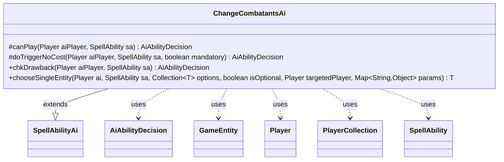

---
aliases:
  - ChangeCombatantsAi
tags:
  - java/class
  - module/forge-ai
  - pkg/forge/ai/ability
fqn: forge.ai.ability.ChangeCombatantsAi
package: forge.ai.ability
module: forge-ai
kind: Class
---

# ChangeCombatantsAi

**Package:** `forge.ai.ability` &nbsp; **Module:** `forge-ai` &nbsp; **Kind:** Class



## Relationships
**Extends:**
- [[forge.ai.SpellAbilityAi|SpellAbilityAi]]
**Uses:**
- [[forge.ai.AiAbilityDecision|AiAbilityDecision]]
- [[forge.game.GameEntity|GameEntity]]
- [[forge.game.player.Player|Player]]
- [[forge.game.player.PlayerCollection|PlayerCollection]]
- [[forge.game.spellability.SpellAbility|SpellAbility]]

## Design Description

ChangeCombatantsAi is the AI decision handler for the ChangeCombatants ability effect, giving Forge's computer player the logic to decide whether and how to redirect combat—typically reassigning which player or entity creatures are attacking. As a concrete subclass of `SpellAbilityAi`, it overrides the standard decision hooks (`canPlay`, `doTriggerNoCost`, `chkDrawback`), each returning an `AiAbilityDecision` that couples a confidence score with an `AiPlayDecision` verdict, plus `chooseSingleEntity` for target selection.

The design is intentionally conservative: the AI never initiates the effect on its own (`canPlay` always returns `CantPlayAi`, with a TODO flagging unfinished activated-ability support), acting only when an effect is mandatory or the `WeakestOppExceptCtrl` AILogic is set. Targeting collaborates with `Player`, `PlayerCollection`, and `PlayerPredicates` to filter to targetable opponents—excluding the host card's controller—and select the lowest-life one, steering combat toward the weakest opponent.

## Source
`forge-ai/src/main/java/forge/ai/ability/ChangeCombatantsAi.java`

```java
package forge.ai.ability;

import forge.ai.AiAbilityDecision;
import forge.ai.AiPlayDecision;
import forge.ai.SpellAbilityAi;
import forge.game.GameEntity;
import forge.game.player.Player;
import forge.game.player.PlayerCollection;
import forge.game.player.PlayerPredicates;
import forge.game.spellability.SpellAbility;

import java.util.Collection;
import java.util.Map;

public class ChangeCombatantsAi extends SpellAbilityAi {
    /* (non-Javadoc)
     * @see forge.card.abilityfactory.SpellAiLogic#canPlayAI(forge.game.player.Player, java.util.Map, forge.card.spellability.SpellAbility)
     */
    @Override
    protected AiAbilityDecision canPlay(Player aiPlayer, SpellAbility sa) {
        // TODO: Extend this if possible for cards that have this as an activated ability
        return new AiAbilityDecision(0, AiPlayDecision.CantPlayAi);
    }

    @Override
    protected AiAbilityDecision doTriggerNoCost(Player aiPlayer, SpellAbility sa, boolean mandatory) {
        if (mandatory) {
            return new AiAbilityDecision(100, AiPlayDecision.WillPlay);
        }
        return new AiAbilityDecision(0, AiPlayDecision.CantPlayAi);
    }

    /* (non-Javadoc)
     * @see forge.card.abilityfactory.SpellAiLogic#chkAIDrawback(java.util.Map, forge.card.spellability.SpellAbility, forge.game.player.Player)
     */
    @Override
    public AiAbilityDecision chkDrawback(Player aiPlayer, SpellAbility sa) {
        final String logic = sa.getParamOrDefault("AILogic", "");

        if (logic.equals("WeakestOppExceptCtrl")) {
            PlayerCollection targetableOpps = aiPlayer.getOpponents();
            targetableOpps.remove(sa.getHostCard().getController());
            if (targetableOpps.isEmpty()) {
                return new AiAbilityDecision(0, AiPlayDecision.CantPlayAi);
            }
            return new AiAbilityDecision(100, AiPlayDecision.WillPlay);
        }

        return new AiAbilityDecision(0, AiPlayDecision.CantPlayAi);
    }

    @Override
    public <T extends GameEntity> T chooseSingleEntity(Player ai, SpellAbility sa, Collection<T> options, boolean isOptional, Player targetedPlayer, Map<String, Object> params) {
        PlayerCollection targetableOpps = new PlayerCollection();
        for (GameEntity p : options) {
            if (p instanceof Player && !p.equals(sa.getHostCard().getController())) {
                Player pp = (Player)p;
                if (pp.isOpponentOf(ai)) {
                    targetableOpps.add(pp);
                }
            }
        }

        Player weakestTargetableOpp = targetableOpps.filter(PlayerPredicates.isTargetableBy(sa))
                .min(PlayerPredicates.compareByLife());

        return (T)weakestTargetableOpp;
    }
}
```
