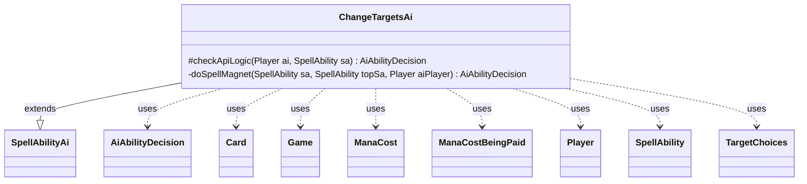

---
aliases:
  - ChangeTargetsAi
tags:
  - java/class
  - module/forge-ai
  - pkg/forge/ai/ability
fqn: forge.ai.ability.ChangeTargetsAi
package: forge.ai.ability
module: forge-ai
kind: Class
---

# ChangeTargetsAi

**Package:** `forge.ai.ability`   **Module:** `forge-ai`   **Kind:** Class



## Relationships
**Extends:**
- [[forge.ai.SpellAbilityAi|SpellAbilityAi]]
**Uses:**
- [[forge.ai.AiAbilityDecision|AiAbilityDecision]]
- [[forge.card.mana.ManaCost|ManaCost]]
- [[forge.game.Game|Game]]
- [[forge.game.card.Card|Card]]
- [[forge.game.mana.ManaCostBeingPaid|ManaCostBeingPaid]]
- [[forge.game.player.Player|Player]]
- [[forge.game.spellability.SpellAbility|SpellAbility]]
- [[forge.game.spellability.TargetChoices|TargetChoices]]

## Design Description

`ChangeTargetsAi` is the AI decision handler for the "ChangeTargets" ability API. Extending `SpellAbilityAi`, it overrides `checkApiLogic` to decide whether the computer should activate an effect that retargets a spell on the stack, delegating the "Self" magnet case to its private `doSpellMagnet` heuristic and otherwise returning only a `MandatoryPlay` fallback so forced triggers aren't skipped.

The `doSpellMagnet` logic models cards like Spellskite and Mizzium Meddler that redirect an opponent's spell onto the host. Collaborating with `Game`, `SpellAbility`, `TargetChoices`, and `Card`, it inspects the top stack spell and applies guard clauses—rejecting spells that don't target, already hit the host, come from the AI, or can't be legally retargeted—before redirecting via `resetTargets`/`add`. Notably, it uses `ManaCost`/`ManaCostBeingPaid` to avoid paying Phyrexian life that exceeds prevented damage, returning a weighted `AiAbilityDecision` that encodes both choice and confidence.

## Source
`forge-ai/src/main/java/forge/ai/ability/ChangeTargetsAi.java`

```java
package forge.ai.ability;

import forge.ai.*;
import forge.card.mana.ManaCost;
import forge.game.Game;
import forge.game.card.Card;
import forge.game.mana.ManaCostBeingPaid;
import forge.game.player.Player;
import forge.game.spellability.SpellAbility;
import forge.game.spellability.TargetChoices;

public class ChangeTargetsAi extends SpellAbilityAi {

    /*
     * (non-Javadoc)
     * 
     * @see forge.ai.SpellAbilityAi#checkApiLogic(forge.game.player.Player,
     * forge.game.spellability.SpellAbility)
     */
    @Override
    protected AiAbilityDecision checkApiLogic(Player ai, SpellAbility sa) {
        final Game game = sa.getHostCard().getGame();
        final SpellAbility topSa = game.getStack().isEmpty() ? null
                : ComputerUtilAbility.getTopSpellAbilityOnStack(game, sa);

        if ("Self".equals(sa.getParam("DefinedMagnet"))) {
            return doSpellMagnet(sa, topSa, ai);
        }

        // The AI can't otherwise play this ability, but should at least not
        // miss mandatory activations (e.g. triggers).
        if (sa.isMandatory()) {
            return new AiAbilityDecision(50, AiPlayDecision.MandatoryPlay);
        }
        return new AiAbilityDecision(0, AiPlayDecision.CantPlayAi);
    }

    private AiAbilityDecision doSpellMagnet(SpellAbility sa, SpellAbility topSa, Player aiPlayer) {
        // For cards like Spellskite that retarget spells to itself
        if (topSa == null) {
            // nothing on stack, so nothing to target
            return new AiAbilityDecision(0, AiPlayDecision.CantPlayAi);
        }
        final TargetChoices topTargets = topSa.getTargets();
        final Card topHost = topSa.getHostCard();

        if (!sa.getTargets().isEmpty() && sa.isTrigger()) {
            // something was already chosen before (e.g. in response to a trigger - Mizzium Meddler), so just proceed
            return new AiAbilityDecision(100, AiPlayDecision.WillPlay);
        }

        if (!topSa.usesTargeting() || topTargets.getTargetCards().contains(sa.getHostCard())) {
            // if this does not target at all or already targets host, no need to redirect it again
            return new AiAbilityDecision(0, AiPlayDecision.CantPlayAi);
        }

        for (Card tgt : topTargets.getTargetCards()) {
            if (ComputerUtilAbility.getAbilitySourceName(sa).equals(tgt.getName()) && tgt.getController().equals(aiPlayer)) {
                // We are already targeting at least one card with the same name (e.g. in presence of 2+ Spellskites),
                // no need to retarget again to another one
                return new AiAbilityDecision(0, AiPlayDecision.CantPlayAi);
            }
        }

        if (topHost != null && !topHost.getController().isOpponentOf(aiPlayer)) {
            // make sure not to redirect our own abilities
            return new AiAbilityDecision(0, AiPlayDecision.CantPlayAi);
        }
        if (!topSa.canTarget(sa.getHostCard())) {
            // don't try targeting it if we can't legally target the host card with it in the first place
            return new AiAbilityDecision(0, AiPlayDecision.CantPlayAi);
        }
        if (!sa.canTarget(topSa)) {
            // don't try retargeting a spell that the current card can't legally retarget (e.g. Muck Drubb + Lightning Bolt to the face)
            return new AiAbilityDecision(0, AiPlayDecision.CantPlayAi);
        }

        if (sa.getPayCosts().getCostMana() != null && sa.getPayCosts().getCostMana().getMana().hasPhyrexian()) {
            ManaCost manaCost = sa.getPayCosts().getCostMana().getMana();
            int payDamage = manaCost.getPhyrexianCount() * 2;
            // e.g. Spellskite or a creature receiving its ability that requires Phyrexian mana P/U
            int potentialDmg = ComputerUtil.predictDamageFromSpell(topSa, aiPlayer);
            ManaCost normalizedMana = manaCost.getNormalizedMana();
            boolean canPay = ComputerUtilMana.canPayManaCost(new ManaCostBeingPaid(normalizedMana), sa, aiPlayer, false);
            if (potentialDmg != -1 && potentialDmg <= payDamage && !canPay
                    && topTargets.contains(aiPlayer)) {
                // do not pay Phyrexian mana if the spell is a damaging one but it deals less damage or the same damage as we'll pay life
                return new AiAbilityDecision(0, AiPlayDecision.CantPlayAi);
            }
        }

        Card firstCard = topTargets.getFirstTargetedCard();
        // if we're not the target don't intervene unless we can steal a buff
        if (firstCard != null && !aiPlayer.equals(firstCard.getController()) && !topHost.getController().equals(firstCard.getController()) && !topHost.getController().getAllies().contains(firstCard.getController())) {
            return new AiAbilityDecision(0, AiPlayDecision.CantPlayAi);
        }
        Player firstPlayer = topTargets.getFirstTargetedPlayer();
        if (firstPlayer != null && !aiPlayer.equals(firstPlayer)) {
            return new AiAbilityDecision(0, AiPlayDecision.CantPlayAi);
        }

        sa.resetTargets();
        sa.getTargets().add(topSa);
        return new AiAbilityDecision(100, AiPlayDecision.WillPlay);
    }
}
```

## Python
`forge/ai/ability/ChangeTargetsAi.py`

```python
package forge.ai.ability ΓÇö output only Python source.

from forge.ai.SpellAbilityAi import SpellAbilityAi
from forge.ai.AiAbilityDecision import AiAbilityDecision
from forge.ai.AiPlayDecision import AiPlayDecision
from forge.ai.ComputerUtilAbility import ComputerUtilAbility
from forge.ai.ComputerUtil import ComputerUtil
from forge.ai.ComputerUtilMana import ComputerUtilMana
from forge.card.mana.ManaCost import ManaCost
from forge.game.Game import Game
from forge.game.card.Card import Card
from forge.game.mana.ManaCostBeingPaid import ManaCostBeingPaid
from forge.game.player.Player import Player
from forge.game.spellability.SpellAbility import SpellAbility
from forge.game.spellability.TargetChoices import TargetChoices


class ChangeTargetsAi(SpellAbilityAi):

    #
    # (non-Javadoc)
    #
    # @see forge.ai.SpellAbilityAi#checkApiLogic(forge.game.player.Player,
    # forge.game.spellability.SpellAbility)
    #
    def checkApiLogic(self, ai: Player, sa: SpellAbility) -> AiAbilityDecision:
        game = sa.getHostCard().getGame()
        topSa = None if game.getStack().isEmpty() \
            else ComputerUtilAbility.getTopSpellAbilityOnStack(game, sa)

        if "Self" == sa.getParam("DefinedMagnet"):
            return self.doSpellMagnet(sa, topSa, ai)

        # The AI can't otherwise play this ability, but should at least not
        # miss mandatory activations (e.g. triggers).
        if sa.isMandatory():
            return AiAbilityDecision(50, AiPlayDecision.MandatoryPlay)
        return AiAbilityDecision(0, AiPlayDecision.CantPlayAi)

    def doSpellMagnet(self, sa: SpellAbility, topSa: SpellAbility, aiPlayer: Player) -> AiAbilityDecision:
        # For cards like Spellskite that retarget spells to itself
        if topSa is None:
            # nothing on stack, so nothing to target
            return AiAbilityDecision(0, AiPlayDecision.CantPlayAi)
        topTargets = topSa.getTargets()
        topHost = topSa.getHostCard()

        if not sa.getTargets().isEmpty() and sa.isTrigger():
            # something was already chosen before (e.g. in response to a trigger - Mizzium Meddler), so just proceed
            return AiAbilityDecision(100, AiPlayDecision.WillPlay)

        if not topSa.usesTargeting() or topTargets.getTargetCards().contains(sa.getHostCard()):
            # if this does not target at all or already targets host, no need to redirect it again
            return AiAbilityDecision(0, AiPlayDecision.CantPlayAi)

        for tgt in topTargets.getTargetCards():
            if ComputerUtilAbility.getAbilitySourceName(sa) == tgt.getName() and tgt.getController().equals(aiPlayer):
                # We are already targeting at least one card with the same name (e.g. in presence of 2+ Spellskites),
                # no need to retarget again to another one
                return AiAbilityDecision(0, AiPlayDecision.CantPlayAi)

        if topHost is not None and not topHost.getController().isOpponentOf(aiPlayer):
            # make sure not to redirect our own abilities
            return AiAbilityDecision(0, AiPlayDecision.CantPlayAi)
        if not topSa.canTarget(sa.getHostCard()):
            # don't try targeting it if we can't legally target the host card with it in the first place
            return AiAbilityDecision(0, AiPlayDecision.CantPlayAi)
        if not sa.canTarget(topSa):
            # don't try retargeting a spell that the current card can't legally retarget (e.g. Muck Drubb + Lightning Bolt to the face)
            return AiAbilityDecision(0, AiPlayDecision.CantPlayAi)

        if sa.getPayCosts().getCostMana() is not None and sa.getPayCosts().getCostMana().getMana().hasPhyrexian():
            manaCost = sa.getPayCosts().getCostMana().getMana()
            payDamage = manaCost.getPhyrexianCount() * 2
            # e.g. Spellskite or a creature receiving its ability that requires Phyrexian mana P/U
            potentialDmg = ComputerUtil.predictDamageFromSpell(topSa, aiPlayer)
            normalizedMana = manaCost.getNormalizedMana()
            canPay = ComputerUtilMana.canPayManaCost(ManaCostBeingPaid(normalizedMana), sa, aiPlayer, False)
            if potentialDmg != -1 and potentialDmg <= payDamage and not canPay \
                    and topTargets.contains(aiPlayer):
                # do not pay Phyrexian mana if the spell is a damaging one but it deals less damage or the same damage as we'll pay life
                return AiAbilityDecision(0, AiPlayDecision.CantPlayAi)

        firstCard = topTargets.getFirstTargetedCard()
        # if we're not the target don't intervene unless we can steal a buff
        if firstCard is not None and not aiPlayer.equals(firstCard.getController()) and not topHost.getController().equals(firstCard.getController()) and not topHost.getController().getAllies().contains(firstCard.getController()):
            return AiAbilityDecision(0, AiPlayDecision.CantPlayAi)
        firstPlayer = topTargets.getFirstTargetedPlayer()
        if firstPlayer is not None and not aiPlayer.equals(firstPlayer):
            return AiAbilityDecision(0, AiPlayDecision.CantPlayAi)

        sa.resetTargets()
        sa.getTargets().add(topSa)
        return AiAbilityDecision(100, AiPlayDecision.WillPlay)
```
