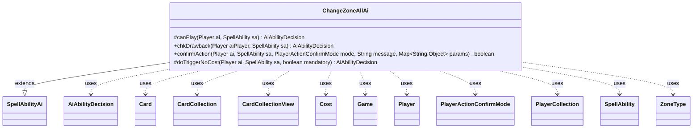

---
aliases:
  - ChangeZoneAllAi
tags:
  - java/class
  - module/forge-ai
  - pkg/forge/ai/ability
fqn: forge.ai.ability.ChangeZoneAllAi
package: forge.ai.ability
module: forge-ai
kind: Class
---

# ChangeZoneAllAi

**Package:** `forge.ai.ability`   **Module:** `forge-ai`   **Kind:** Class



## Relationships
**Extends:**
- [[forge.ai.SpellAbilityAi|SpellAbilityAi]]
**Uses:**
- [[forge.ai.AiAbilityDecision|AiAbilityDecision]]
- [[forge.game.Game|Game]]
- [[forge.game.card.Card|Card]]
- [[forge.game.card.CardCollection|CardCollection]]
- [[forge.game.card.CardCollectionView|CardCollectionView]]
- [[forge.game.cost.Cost|Cost]]
- [[forge.game.player.Player|Player]]
- [[forge.game.player.PlayerActionConfirmMode|PlayerActionConfirmMode]]
- [[forge.game.player.PlayerCollection|PlayerCollection]]
- [[forge.game.spellability.SpellAbility|SpellAbility]]
- [[forge.game.zone.ZoneType|ZoneType]]

## Design Description

ChangeZoneAllAi is the AI controller for "change zone all" spell abilities — effects that mass-move every card matching a type from one zone to another (e.g. board wipes, mass bounce, reanimation, Timetwister-style hand/library swaps). Extending SpellAbilityAi, it overrides the standard decision hooks (canPlay, chkDrawback, confirmAction, doTriggerNoCost), returning AiAbilityDecision verdicts that let the engine decide whether and when the computer plays the ability. Its core logic reads the Origin/Destination ZoneTypes and ChangeType parameter, partitions affected Cards into the AI's own collection versus opponents' (CardCollection/CardCollectionView), and compares their evaluated value to judge whether the swing favors the AI.

Notable design intent: it gates against runaway repeated activations via a decaying random chance, screens prohibitive life/discard Costs, applies timing restrictions (avoiding main-phase-1 plays, acting under lethal-combat pressure), and tunes thresholds through AiProfileUtil properties. Numerous special cases — keyed off AILogic strings or specific card names like Ugin, Living Death, and Profaner of the Dead — delegate to SpecialCardAi, reflecting a general heuristic core extended with hand-written exceptions for individual cards.

## Source
`forge-ai/src/main/java/forge/ai/ability/ChangeZoneAllAi.java`

```java
package forge.ai.ability;

import forge.ai.*;
import forge.game.Game;
import forge.game.ability.AbilityUtils;
import forge.game.card.*;
import forge.game.cost.Cost;
import forge.game.phase.PhaseType;
import forge.game.player.Player;
import forge.game.player.PlayerActionConfirmMode;
import forge.game.player.PlayerCollection;
import forge.game.player.PlayerPredicates;
import forge.game.spellability.SpellAbility;
import forge.game.zone.ZoneType;
import forge.util.MyRandom;

import java.util.Collections;
import java.util.Map;

public class ChangeZoneAllAi extends SpellAbilityAi {
    @Override
    protected AiAbilityDecision canPlay(Player ai, SpellAbility sa) {
        // Change Zone All, can be any type moving from one zone to another
        final Cost abCost = sa.getPayCosts();
        final Card source = sa.getHostCard();
        final String sourceName = ComputerUtilAbility.getAbilitySourceName(sa);
        final Game game = ai.getGame();
        final ZoneType destination = ZoneType.smartValueOf(sa.getParam("Destination"));
        final ZoneType origin = ZoneType.listValueOf(sa.getParam("Origin")).get(0);
        final String aiLogic = sa.getParamOrDefault("AILogic" ,"");

        if (abCost != null) {
            // AI currently disabled for these costs
            if (!ComputerUtilCost.checkLifeCost(ai, abCost, source, 4, sa)) {
                return new AiAbilityDecision(0, AiPlayDecision.CostNotAcceptable);
            }

            if (!ComputerUtilCost.checkDiscardCost(ai, abCost, source, sa)) {
                boolean aiLogicAllowsDiscard = aiLogic.startsWith("DiscardAll");

                if (!aiLogicAllowsDiscard) {
                    return new AiAbilityDecision(0, AiPlayDecision.CostNotAcceptable);
                }
            }
        }

        // prevent run-away activations - first time will always return true
        boolean chance = MyRandom.getRandom().nextFloat() <= Math.pow(.6667, sa.getActivationsThisTurn());

        // TODO targeting with ChangeZoneAll
        // really two types of targeting.
        // Target Player has all their types change zones
        // or target permanent and do something relative to that permanent
        // ex. "Return all Auras attached to target"
        // ex. "Return all blocking/blocked by target creature"

        CardCollectionView oppType = ai.getOpponents().getCardsIn(origin);
        CardCollectionView computerType = ai.getCardsIn(origin);

        // Ugin AI: always try to sweep before considering +1
        if (sourceName.equals("Ugin, the Spirit Dragon")) {
            boolean result = SpecialCardAi.UginTheSpiritDragon.considerPWAbilityPriority(ai, sa, origin, oppType, computerType);
            return result ? new AiAbilityDecision(100, AiPlayDecision.WillPlay) : new AiAbilityDecision(0, AiPlayDecision.CantPlayAi);
        }

        oppType = AbilityUtils.filterListByType(oppType, sa.getParam("ChangeType"), sa);
        computerType = AbilityUtils.filterListByType(computerType, sa.getParam("ChangeType"), sa);
        
        if ("LivingDeath".equals(aiLogic)) {
            return SpecialCardAi.LivingDeath.consider(ai, sa);
        } else if ("Timetwister".equals(aiLogic)) {
            return SpecialCardAi.Timetwister.consider(ai, sa);
        } else if ("RetDiscardedThisTurn".equals(aiLogic)) {
            boolean result = !ai.getDiscardedThisTurn().isEmpty() && ai.getGame().getPhaseHandler().is(PhaseType.END_OF_TURN);
            return result ? new AiAbilityDecision(100, AiPlayDecision.WillPlay) : new AiAbilityDecision(0, AiPlayDecision.CantPlayAi);
        } else if ("ExileGraveyards".equals(aiLogic)) {
            for (Player opp : ai.getOpponents()) {
                CardCollectionView cardsGY = opp.getCardsIn(ZoneType.Graveyard);
                CardCollection creats = CardLists.filter(cardsGY, CardPredicates.CREATURES);
                if (opp.hasDelirium() || opp.hasThreshold() || creats.size() >= 5) {
                    return new AiAbilityDecision(100, AiPlayDecision.WillPlay);
                }
            }
            return new AiAbilityDecision(0, AiPlayDecision.CantPlayAi);
        } else if ("ManifestCreatsFromGraveyard".equals(aiLogic)) {
            PlayerCollection players = ai.getOpponents();
            players.add(ai);
            int maxSize = 1;
            for (Player player : players) {
                Player bestTgt = null;
                if (player.canBeTargetedBy(sa)) {
                    int numGY = CardLists.count(player.getCardsIn(ZoneType.Graveyard),
                            CardPredicates.CREATURES);
                    if (numGY > maxSize) {
                        maxSize = numGY;
                        bestTgt = player;
                    }
                }
                if (bestTgt != null) {
                    sa.resetTargets();
                    sa.getTargets().add(bestTgt);
                    return new AiAbilityDecision(100, AiPlayDecision.WillPlay);
                }
            }
            return new AiAbilityDecision(0, AiPlayDecision.CantPlayAi);
        }

        // TODO improve restrictions on when the AI would want to use this
        // spBounceAll has some AI we can compare to.
        if (origin.equals(ZoneType.Hand) || origin.equals(ZoneType.Library)) {
            if (!sa.usesTargeting()) {
                return new AiAbilityDecision(100, AiPlayDecision.WillPlay);
            } else {
                final PlayerCollection oppList = ai.getOpponents().filter(PlayerPredicates.isTargetableBy(sa));
                if (oppList.isEmpty()) {
                    return new AiAbilityDecision(0, AiPlayDecision.CantPlaySa);
                }
                Player oppTarget = oppList.max(PlayerPredicates.compareByZoneSize(origin));
                if (!oppTarget.getCardsIn(ZoneType.Hand).isEmpty()) {
                    sa.resetTargets();
                    sa.getTargets().add(oppTarget);
                } else {
                    return new AiAbilityDecision(0, AiPlayDecision.CantPlaySa);
                }
            }
        } else if (origin.equals(ZoneType.Battlefield)) {
            if (sa.usesTargeting()) {
                final PlayerCollection oppList = ai.getOpponents().filter(PlayerPredicates.isTargetableBy(sa));
                if (oppList.isEmpty()) {
                    return new AiAbilityDecision(0, AiPlayDecision.CantPlaySa);
                }
                Player oppTarget = oppList.max(PlayerPredicates.compareByZoneSize(origin));
                if (oppTarget.getCardsIn(ZoneType.Graveyard).isEmpty()) {
                    sa.resetTargets();
                    sa.getTargets().add(oppTarget);
                } else {
                    return new AiAbilityDecision(0, AiPlayDecision.CantPlaySa);
                }
                computerType = new CardCollection();
            }

            int creatureEvalThreshold; // value difference (in evaluateCreatureList units)
            int nonCreatureEvalThreshold; // CMC difference
            if (destination == ZoneType.Hand) {
                creatureEvalThreshold = AiProfileUtil.getIntProperty(ai, AiProps.BOUNCE_ALL_TO_HAND_CREAT_EVAL_DIFF);
                nonCreatureEvalThreshold = AiProfileUtil.getIntProperty(ai, AiProps.BOUNCE_ALL_TO_HAND_NONCREAT_EVAL_DIFF);
            } else {
                creatureEvalThreshold = AiProfileUtil.getIntProperty(ai, AiProps.BOUNCE_ALL_ELSEWHERE_CREAT_EVAL_DIFF);
                nonCreatureEvalThreshold = AiProfileUtil.getIntProperty(ai, AiProps.BOUNCE_ALL_ELSEWHERE_NONCREAT_EVAL_DIFF);
            }

            // mass zone change for creatures: if in dire danger, do it; otherwise, only do it if the opponent's
            // creatures are better in value
            if (CardLists.getNotType(oppType, "Creature").isEmpty() && CardLists.getNotType(computerType, "Creature").isEmpty()) {
                if (game.getCombat() != null && ComputerUtilCombat.lifeInSeriousDanger(ai, game.getCombat())) {
                    if (game.getPhaseHandler().is(PhaseType.COMBAT_DECLARE_BLOCKERS)
                            && game.getPhaseHandler().getPlayerTurn().isOpponentOf(ai)) {
                        // Life is in serious danger, return all creatures from the battlefield to wherever
                        // so they don't deal lethal damage
                        return new AiAbilityDecision(100, AiPlayDecision.WillPlay);
                    }
                }
                if ((ComputerUtilCard.evaluateCreatureList(computerType) + creatureEvalThreshold) >= ComputerUtilCard
                        .evaluateCreatureList(oppType)) {
                    return new AiAbilityDecision(0, AiPlayDecision.CantPlayAi);
                }
            } else if ((ComputerUtilCard.evaluatePermanentList(computerType) + nonCreatureEvalThreshold) >= ComputerUtilCard
                    .evaluatePermanentList(oppType)) {
                return new AiAbilityDecision(0, AiPlayDecision.CantPlayAi);
            }
            if (game.getPhaseHandler().is(PhaseType.MAIN1, ai) && !aiLogic.equals("Main1")) {
                return new AiAbilityDecision(0, AiPlayDecision.TimingRestrictions);
            }
        } else if (origin.equals(ZoneType.Graveyard)) {
            if (sa.usesTargeting()) {
                final PlayerCollection oppList = ai.getOpponents().filter(PlayerPredicates.isTargetableBy(sa));
                if (oppList.isEmpty()) {
                    return new AiAbilityDecision(0, AiPlayDecision.CantPlaySa);
                }
                String changeType = sa.getParam("ChangeType");
                Player oppTarget = Collections.max(oppList, AiPlayerPredicates.compareByZoneValue(changeType, origin, sa));
                int countChangeType = AbilityUtils.filterListByType(oppTarget.getCardsIn(ZoneType.Graveyard), changeType, sa).size();
                // Assumes the SpellAbility is only useful when 1 or more ChangeType will change zones
                if (countChangeType > 0) {
                    sa.resetTargets();
                    sa.getTargets().add(oppTarget);
                } else {
                    return new AiAbilityDecision(0, AiPlayDecision.CantPlaySa);
                }
            } else if (destination.equals(ZoneType.Library) && "Card.YouOwn".equals(sa.getParam("ChangeType"))) {
                boolean result = (ai.getCardsIn(ZoneType.Graveyard).size() > ai.getCardsIn(ZoneType.Library).size())
                        && !ComputerUtil.isPlayingReanimator(ai);
                return result ? new AiAbilityDecision(100, AiPlayDecision.WillPlay) : new AiAbilityDecision(0, AiPlayDecision.CantPlayAi);
            }
        } else if (origin.equals(ZoneType.Exile)) {
            if (aiLogic.startsWith("DiscardAllAndRetExiled")) {
                int numExiledWithSrc = CardLists.filter(ai.getCardsIn(ZoneType.Exile), CardPredicates.isExiledWith(source)).size();
                int curHandSize = ai.getCardsIn(ZoneType.Hand).size();
                int minAdv = aiLogic.contains(".minAdv") ? Integer.parseInt(aiLogic.substring(aiLogic.indexOf(".minAdv") + 7)) : 0;
                boolean noDiscard = aiLogic.contains(".noDiscard");
                if (numExiledWithSrc > curHandSize || (noDiscard && numExiledWithSrc > 0)) {
                    if (ComputerUtil.predictThreatenedObjects(ai, sa, true).contains(source)) {
                        return new AiAbilityDecision(100, AiPlayDecision.WillPlay);
                    }
                }
                boolean result = (curHandSize + minAdv - 1 < numExiledWithSrc) || (!noDiscard && numExiledWithSrc >= ai.getMaxHandSize());
                return result ? new AiAbilityDecision(100, AiPlayDecision.WillPlay) : new AiAbilityDecision(0, AiPlayDecision.CantPlayAi);
            }
        } else if (origin.equals(ZoneType.Stack)) {
            return new AiAbilityDecision(0, AiPlayDecision.CantPlayAi);
        }
        if (destination.equals(ZoneType.Battlefield)) {
            if (sa.hasParam("GainControl")) {
                if (CardLists.getNotType(oppType, "Creature").isEmpty() && CardLists.getNotType(computerType, "Creature").isEmpty()) {
                    if ((ComputerUtilCard.evaluateCreatureList(computerType) + ComputerUtilCard
                            .evaluateCreatureList(oppType)) < 400) {
                        return new AiAbilityDecision(0, AiPlayDecision.CantPlayAi);
                    }
                } else if ((ComputerUtilCard.evaluatePermanentList(computerType) + ComputerUtilCard
                        .evaluatePermanentList(oppType)) < 6) {
                    return new AiAbilityDecision(0, AiPlayDecision.CantPlayAi);
                }
            } else {
                if (CardLists.getNotType(oppType, "Creature").isEmpty() && CardLists.getNotType(computerType, "Creature").isEmpty()) {
                    if (ComputerUtilCard.evaluateCreatureList(computerType) <= (ComputerUtilCard
                            .evaluateCreatureList(oppType) + 100)) {
                        return new AiAbilityDecision(0, AiPlayDecision.CantPlayAi);
                    }
                } else if (ComputerUtilCard.evaluatePermanentList(computerType) <= (ComputerUtilCard
                        .evaluatePermanentList(oppType) + 2)) {
                    return new AiAbilityDecision(0, AiPlayDecision.CantPlayAi);
                }
            }
        }
        boolean result = ((MyRandom.getRandom().nextFloat() < .8) || sa.isTrigger()) && chance;
        return result ? new AiAbilityDecision(100, AiPlayDecision.WillPlay) : new AiAbilityDecision(0, AiPlayDecision.CantPlayAi);
    }

    /**
     * <p>
     * changeZoneAllPlayDrawbackAI.
     * </p>
     *
     * @param aiPlayer a {@link Player} object.
     * @param sa       a {@link SpellAbility} object.
     * @return a boolean.
     */
    @Override
    public AiAbilityDecision chkDrawback(Player aiPlayer, SpellAbility sa) {
        // if putting cards from hand to library and parent is drawing cards
        // make sure this will actually do something:

        return new AiAbilityDecision(100, AiPlayDecision.WillPlay);
    }

    /* (non-Javadoc)
     * @see forge.card.ability.SpellAbilityAi#confirmAction(forge.game.player.Player, forge.card.spellability.SpellAbility, forge.game.player.PlayerActionConfirmMode, java.lang.String)
     */
    @Override
    public boolean confirmAction(Player ai, SpellAbility sa, PlayerActionConfirmMode mode, String message, Map<String, Object> params) {
        final Card source = sa.getHostCard();
        final String hostName = source.getName();
        final ZoneType origin = ZoneType.listValueOf(sa.getParam("Origin")).get(0);

        if (hostName.equals("Dawnbreak Reclaimer")) {
        	final CardCollectionView cards = AbilityUtils.filterListByType(ai.getGame().getCardsIn(origin), sa.getParam("ChangeType"), sa);

        	// AI gets nothing
        	final CardCollection aiCards = CardLists.filterControlledBy(cards, ai);        	
        	if (aiCards.isEmpty())
        		return false;

        	// Human gets nothing
        	final CardCollection humanCards = CardLists.filterControlledBy(cards, ai.getOpponents());
        	if (humanCards.isEmpty())
        		return true;

        	// if AI creature is better than Human Creature
            return ComputerUtilCard.evaluateCreatureList(aiCards) >= ComputerUtilCard.evaluateCreatureList(humanCards);
        }
        return true;
    }

    @Override
    protected AiAbilityDecision doTriggerNoCost(Player ai, final SpellAbility sa, boolean mandatory) {
        final ZoneType destination = ZoneType.smartValueOf(sa.getParam("Destination"));
        final ZoneType origin = ZoneType.listValueOf(sa.getParam("Origin")).get(0);

        if (ComputerUtilAbility.getAbilitySourceName(sa).equals("Profaner of the Dead")) {
            boolean result = ai.getOpponents().getCardsIn(origin).anyMatch(CardPredicates.CREATURES);
            return result ? new AiAbilityDecision(100, AiPlayDecision.WillPlay) : new AiAbilityDecision(0, AiPlayDecision.CantPlayAi);
        }
        CardCollectionView humanType = ai.getOpponents().getCardsIn(origin);
        humanType = AbilityUtils.filterListByType(humanType, sa.getParam("ChangeType"), sa);
        CardCollectionView computerType = ai.getCardsIn(origin);
        computerType = AbilityUtils.filterListByType(computerType, sa.getParam("ChangeType"), sa);
        if (origin.equals(ZoneType.Hand) || origin.equals(ZoneType.Library)) {
            if (sa.usesTargeting()) {
                final PlayerCollection oppList = ai.getOpponents().filter(PlayerPredicates.isTargetableBy(sa));
                if (oppList.isEmpty()) {
                    if (mandatory && !sa.isTargetNumberValid() && sa.canTarget(ai)) {
                        sa.resetTargets();
                        sa.getTargets().add(ai);
                        return new AiAbilityDecision(100, AiPlayDecision.WillPlay);
                    }
                    return new AiAbilityDecision(0, AiPlayDecision.CantPlaySa);
                }
                Player oppTarget = oppList.max(PlayerPredicates.compareByZoneSize(origin));
                if (!oppTarget.getCardsIn(ZoneType.Hand).isEmpty() || mandatory) {
                    sa.resetTargets();
                    sa.getTargets().add(oppTarget);
                } else {
                    return new AiAbilityDecision(0, AiPlayDecision.CantPlaySa);
                }
            }
        } else if (origin.equals(ZoneType.Battlefield)) {
            if (mandatory) {
                return new AiAbilityDecision(100, AiPlayDecision.WillPlay);
            }
            if (CardLists.getNotType(humanType, "Creature").isEmpty() && CardLists.getNotType(computerType, "Creature").isEmpty()) {
                if (ComputerUtilCard.evaluateCreatureList(computerType) >= ComputerUtilCard.evaluateCreatureList(humanType)) {
                    return new AiAbilityDecision(0, AiPlayDecision.CantPlayAi);
                }
            } else if (ComputerUtilCard.evaluatePermanentList(computerType) >= ComputerUtilCard.evaluatePermanentList(humanType)) {
                return new AiAbilityDecision(0, AiPlayDecision.CantPlayAi);
            }
        } else if (origin.equals(ZoneType.Graveyard)) {
            if (sa.usesTargeting()) {
                final PlayerCollection oppList = ai.getOpponents().filter(PlayerPredicates.isTargetableBy(sa));
                if (oppList.isEmpty()) {
                    if (mandatory && !sa.isTargetNumberValid() && sa.canTarget(ai)) {
                        sa.resetTargets();
                        sa.getTargets().add(ai);
                        return new AiAbilityDecision(100, AiPlayDecision.WillPlay);
                    }
                    return sa.isTargetNumberValid() ? new AiAbilityDecision(100, AiPlayDecision.WillPlay) : new AiAbilityDecision(0, AiPlayDecision.CantPlaySa);
                }
                Player oppTarget = oppList.max(
                        AiPlayerPredicates.compareByZoneValue(sa.getParam("ChangeType"), origin, sa));
                if (!oppTarget.getCardsIn(ZoneType.Graveyard).isEmpty() || mandatory) {
                    sa.resetTargets();
                    sa.getTargets().add(oppTarget);
                } else {
                    return new AiAbilityDecision(0, AiPlayDecision.CantPlaySa);
                }
            }
        }
        if (destination.equals(ZoneType.Battlefield)) {
            if (mandatory) {
                return new AiAbilityDecision(100, AiPlayDecision.WillPlay);
            }
            if (sa.hasParam("GainControl")) {
                if (CardLists.getNotType(humanType, "Creature").isEmpty() && CardLists.getNotType(computerType, "Creature").isEmpty()) {
                    boolean result = (ComputerUtilCard.evaluateCreatureList(computerType) + ComputerUtilCard.evaluateCreatureList(humanType)) >= 1;
                    return result ? new AiAbilityDecision(100, AiPlayDecision.WillPlay) : new AiAbilityDecision(0, AiPlayDecision.CantPlayAi);
                }
                boolean result = (ComputerUtilCard.evaluatePermanentList(computerType) + ComputerUtilCard
                        .evaluatePermanentList(humanType)) >= 1;
                return result ? new AiAbilityDecision(100, AiPlayDecision.WillPlay) : new AiAbilityDecision(0, AiPlayDecision.CantPlayAi);
            }
            if (CardLists.getNotType(humanType, "Creature").isEmpty() && CardLists.getNotType(computerType, "Creature").isEmpty()) {
                boolean result = ComputerUtilCard.evaluateCreatureList(computerType) > ComputerUtilCard.evaluateCreatureList(humanType);
                return result ? new AiAbilityDecision(100, AiPlayDecision.WillPlay) : new AiAbilityDecision(0, AiPlayDecision.CantPlayAi);
            }
            boolean result = ComputerUtilCard.evaluatePermanentList(computerType) > ComputerUtilCard.evaluatePermanentList(humanType);
            return result ? new AiAbilityDecision(100, AiPlayDecision.WillPlay) : new AiAbilityDecision(0, AiPlayDecision.CantPlayAi);
        }
        return new AiAbilityDecision(100, AiPlayDecision.WillPlay);
    }

}
```

## Python
`forge/ai/ability/ChangeZoneAllAi.py`

```python
from forge.ai.SpellAbilityAi import SpellAbilityAi
from forge.ai.AiAbilityDecision import AiAbilityDecision
from forge.ai.AiPlayDecision import AiPlayDecision
from forge.ai.ComputerUtil import ComputerUtil
from forge.ai.ComputerUtilAbility import ComputerUtilAbility
from forge.ai.ComputerUtilCard import ComputerUtilCard
from forge.ai.ComputerUtilCombat import ComputerUtilCombat
from forge.ai.ComputerUtilCost import ComputerUtilCost
from forge.ai.SpecialCardAi import SpecialCardAi
from forge.ai.AiProfileUtil import AiProfileUtil
from forge.ai.AiProps import AiProps
from forge.ai.AiPlayerPredicates import AiPlayerPredicates
from forge.game.Game import Game
from forge.game.ability.AbilityUtils import AbilityUtils
from forge.game.card.Card import Card
from forge.game.card.CardCollection import CardCollection
from forge.game.card.CardCollectionView import CardCollectionView
from forge.game.card.CardLists import CardLists
from forge.game.card.CardPredicates import CardPredicates
from forge.game.cost.Cost import Cost
from forge.game.phase.PhaseType import PhaseType
from forge.game.player.Player import Player
from forge.game.player.PlayerActionConfirmMode import PlayerActionConfirmMode
from forge.game.player.PlayerCollection import PlayerCollection
from forge.game.player.PlayerPredicates import PlayerPredicates
from forge.game.spellability.SpellAbility import SpellAbility
from forge.game.zone.ZoneType import ZoneType
from forge.util.MyRandom import MyRandom

import math
from typing import Map


class ChangeZoneAllAi(SpellAbilityAi):
    def canPlay(self, ai: Player, sa: SpellAbility) -> AiAbilityDecision:
        # Change Zone All, can be any type moving from one zone to another
        abCost = sa.getPayCosts()
        source = sa.getHostCard()
        sourceName = ComputerUtilAbility.getAbilitySourceName(sa)
        game = ai.getGame()
        destination = ZoneType.smartValueOf(sa.getParam("Destination"))
        origin = ZoneType.listValueOf(sa.getParam("Origin")).get(0)
        aiLogic = sa.getParamOrDefault("AILogic", "")

        if abCost is not None:
            # AI currently disabled for these costs
            if not ComputerUtilCost.checkLifeCost(ai, abCost, source, 4, sa):
                return AiAbilityDecision(0, AiPlayDecision.CostNotAcceptable)

            if not ComputerUtilCost.checkDiscardCost(ai, abCost, source, sa):
                aiLogicAllowsDiscard = aiLogic.startswith("DiscardAll")

                if not aiLogicAllowsDiscard:
                    return AiAbilityDecision(0, AiPlayDecision.CostNotAcceptable)

        # prevent run-away activations - first time will always return true
        chance = MyRandom.getRandom().nextFloat() <= math.pow(.6667, sa.getActivationsThisTurn())

        # TODO targeting with ChangeZoneAll
        # really two types of targeting.
        # Target Player has all their types change zones
        # or target permanent and do something relative to that permanent
        # ex. "Return all Auras attached to target"
        # ex. "Return all blocking/blocked by target creature"

        oppType = ai.getOpponents().getCardsIn(origin)
        computerType = ai.getCardsIn(origin)

        # Ugin AI: always try to sweep before considering +1
        if sourceName == "Ugin, the Spirit Dragon":
            result = SpecialCardAi.UginTheSpiritDragon.considerPWAbilityPriority(ai, sa, origin, oppType, computerType)
            return AiAbilityDecision(100, AiPlayDecision.WillPlay) if result else AiAbilityDecision(0, AiPlayDecision.CantPlayAi)

        oppType = AbilityUtils.filterListByType(oppType, sa.getParam("ChangeType"), sa)
        computerType = AbilityUtils.filterListByType(computerType, sa.getParam("ChangeType"), sa)

        if "LivingDeath" == aiLogic:
            return SpecialCardAi.LivingDeath.consider(ai, sa)
        elif "Timetwister" == aiLogic:
            return SpecialCardAi.Timetwister.consider(ai, sa)
        elif "RetDiscardedThisTurn" == aiLogic:
            result = (not ai.getDiscardedThisTurn().isEmpty()) and ai.getGame().getPhaseHandler().is_(PhaseType.END_OF_TURN)
            return AiAbilityDecision(100, AiPlayDecision.WillPlay) if result else AiAbilityDecision(0, AiPlayDecision.CantPlayAi)
        elif "ExileGraveyards" == aiLogic:
            for opp in ai.getOpponents():
                cardsGY = opp.getCardsIn(ZoneType.Graveyard)
                creats = CardLists.filter(cardsGY, CardPredicates.CREATURES)
                if opp.hasDelirium() or opp.hasThreshold() or creats.size() >= 5:
                    return AiAbilityDecision(100, AiPlayDecision.WillPlay)
            return AiAbilityDecision(0, AiPlayDecision.CantPlayAi)
        elif "ManifestCreatsFromGraveyard" == aiLogic:
            players = ai.getOpponents()
            players.add(ai)
            maxSize = 1
            for player in players:
                bestTgt = None
                if player.canBeTargetedBy(sa):
                    numGY = CardLists.count(player.getCardsIn(ZoneType.Graveyard),
                                            CardPredicates.CREATURES)
                    if numGY > maxSize:
                        maxSize = numGY
                        bestTgt = player
                if bestTgt is not None:
                    sa.resetTargets()
                    sa.getTargets().add(bestTgt)
                    return AiAbilityDecision(100, AiPlayDecision.WillPlay)
            return AiAbilityDecision(0, AiPlayDecision.CantPlayAi)

        # TODO improve restrictions on when the AI would want to use this
        # spBounceAll has some AI we can compare to.
        if origin == ZoneType.Hand or origin == ZoneType.Library:
            if not sa.usesTargeting():
                return AiAbilityDecision(100, AiPlayDecision.WillPlay)
            else:
                oppList = ai.getOpponents().filter(PlayerPredicates.isTargetableBy(sa))
                if oppList.isEmpty():
                    return AiAbilityDecision(0, AiPlayDecision.CantPlaySa)
                oppTarget = oppList.max(PlayerPredicates.compareByZoneSize(origin))
                if not oppTarget.getCardsIn(ZoneType.Hand).isEmpty():
                    sa.resetTargets()
                    sa.getTargets().add(oppTarget)
                else:
                    return AiAbilityDecision(0, AiPlayDecision.CantPlaySa)
        elif origin == ZoneType.Battlefield:
            if sa.usesTargeting():
                oppList = ai.getOpponents().filter(PlayerPredicates.isTargetableBy(sa))
                if oppList.isEmpty():
                    return AiAbilityDecision(0, AiPlayDecision.CantPlaySa)
                oppTarget = oppList.max(PlayerPredicates.compareByZoneSize(origin))
                if oppTarget.getCardsIn(ZoneType.Graveyard).isEmpty():
                    sa.resetTargets()
                    sa.getTargets().add(oppTarget)
                else:
                    return AiAbilityDecision(0, AiPlayDecision.CantPlaySa)
                computerType = CardCollection()

            # value difference (in evaluateCreatureList units)
            # CMC difference
            if destination == ZoneType.Hand:
                creatureEvalThreshold = AiProfileUtil.getIntProperty(ai, AiProps.BOUNCE_ALL_TO_HAND_CREAT_EVAL_DIFF)
                nonCreatureEvalThreshold = AiProfileUtil.getIntProperty(ai, AiProps.BOUNCE_ALL_TO_HAND_NONCREAT_EVAL_DIFF)
            else:
                creatureEvalThreshold = AiProfileUtil.getIntProperty(ai, AiProps.BOUNCE_ALL_ELSEWHERE_CREAT_EVAL_DIFF)
                nonCreatureEvalThreshold = AiProfileUtil.getIntProperty(ai, AiProps.BOUNCE_ALL_ELSEWHERE_NONCREAT_EVAL_DIFF)

            # mass zone change for creatures: if in dire danger, do it; otherwise, only do it if the opponent's
            # creatures are better in value
            if CardLists.getNotType(oppType, "Creature").isEmpty() and CardLists.getNotType(computerType, "Creature").isEmpty():
                if game.getCombat() is not None and ComputerUtilCombat.lifeInSeriousDanger(ai, game.getCombat()):
                    if game.getPhaseHandler().is_(PhaseType.COMBAT_DECLARE_BLOCKERS) \
                            and game.getPhaseHandler().getPlayerTurn().isOpponentOf(ai):
                        # Life is in serious danger, return all creatures from the battlefield to wherever
                        # so they don't deal lethal damage
                        return AiAbilityDecision(100, AiPlayDecision.WillPlay)
                if (ComputerUtilCard.evaluateCreatureList(computerType) + creatureEvalThreshold) >= ComputerUtilCard.evaluateCreatureList(oppType):
                    return AiAbilityDecision(0, AiPlayDecision.CantPlayAi)
            elif (ComputerUtilCard.evaluatePermanentList(computerType) + nonCreatureEvalThreshold) >= ComputerUtilCard.evaluatePermanentList(oppType):
                return AiAbilityDecision(0, AiPlayDecision.CantPlayAi)
            if game.getPhaseHandler().is_(PhaseType.MAIN1, ai) and aiLogic != "Main1":
                return AiAbilityDecision(0, AiPlayDecision.TimingRestrictions)
        elif origin == ZoneType.Graveyard:
            if sa.usesTargeting():
                oppList = ai.getOpponents().filter(PlayerPredicates.isTargetableBy(sa))
                if oppList.isEmpty():
                    return AiAbilityDecision(0, AiPlayDecision.CantPlaySa)
                changeType = sa.getParam("ChangeType")
                oppTarget = Collections.max(oppList, AiPlayerPredicates.compareByZoneValue(changeType, origin, sa))
                countChangeType = AbilityUtils.filterListByType(oppTarget.getCardsIn(ZoneType.Graveyard), changeType, sa).size()
                # Assumes the SpellAbility is only useful when 1 or more ChangeType will change zones
                if countChangeType > 0:
                    sa.resetTargets()
                    sa.getTargets().add(oppTarget)
                else:
                    return AiAbilityDecision(0, AiPlayDecision.CantPlaySa)
            elif destination == ZoneType.Library and "Card.YouOwn" == sa.getParam("ChangeType"):
                result = (ai.getCardsIn(ZoneType.Graveyard).size() > ai.getCardsIn(ZoneType.Library).size()) \
                    and not ComputerUtil.isPlayingReanimator(ai)
                return AiAbilityDecision(100, AiPlayDecision.WillPlay) if result else AiAbilityDecision(0, AiPlayDecision.CantPlayAi)
        elif origin == ZoneType.Exile:
            if aiLogic.startswith("DiscardAllAndRetExiled"):
                numExiledWithSrc = CardLists.filter(ai.getCardsIn(ZoneType.Exile), CardPredicates.isExiledWith(source)).size()
                curHandSize = ai.getCardsIn(ZoneType.Hand).size()
                minAdv = int(aiLogic[aiLogic.index(".minAdv") + 7:]) if ".minAdv" in aiLogic else 0
                noDiscard = ".noDiscard" in aiLogic
                if numExiledWithSrc > curHandSize or (noDiscard and numExiledWithSrc > 0):
                    if ComputerUtil.predictThreatenedObjects(ai, sa, True).contains(source):
                        return AiAbilityDecision(100, AiPlayDecision.WillPlay)
                result = (curHandSize + minAdv - 1 < numExiledWithSrc) or (not noDiscard and numExiledWithSrc >= ai.getMaxHandSize())
                return AiAbilityDecision(100, AiPlayDecision.WillPlay) if result else AiAbilityDecision(0, AiPlayDecision.CantPlayAi)
        elif origin == ZoneType.Stack:
            return AiAbilityDecision(0, AiPlayDecision.CantPlayAi)

        if destination == ZoneType.Battlefield:
            if sa.hasParam("GainControl"):
                if CardLists.getNotType(oppType, "Creature").isEmpty() and CardLists.getNotType(computerType, "Creature").isEmpty():
                    if (ComputerUtilCard.evaluateCreatureList(computerType) + ComputerUtilCard.evaluateCreatureList(oppType)) < 400:
                        return AiAbilityDecision(0, AiPlayDecision.CantPlayAi)
                elif (ComputerUtilCard.evaluatePermanentList(computerType) + ComputerUtilCard.evaluatePermanentList(oppType)) < 6:
                    return AiAbilityDecision(0, AiPlayDecision.CantPlayAi)
            else:
                if CardLists.getNotType(oppType, "Creature").isEmpty() and CardLists.getNotType(computerType, "Creature").isEmpty():
                    if ComputerUtilCard.evaluateCreatureList(computerType) <= (ComputerUtilCard.evaluateCreatureList(oppType) + 100):
                        return AiAbilityDecision(0, AiPlayDecision.CantPlayAi)
                elif ComputerUtilCard.evaluatePermanentList(computerType) <= (ComputerUtilCard.evaluatePermanentList(oppType) + 2):
                    return AiAbilityDecision(0, AiPlayDecision.CantPlayAi)

        result = ((MyRandom.getRandom().nextFloat() < .8) or sa.isTrigger()) and chance
        return AiAbilityDecision(100, AiPlayDecision.WillPlay) if result else AiAbilityDecision(0, AiPlayDecision.CantPlayAi)

    def chkDrawback(self, aiPlayer: Player, sa: SpellAbility) -> AiAbilityDecision:
        # if putting cards from hand to library and parent is drawing cards
        # make sure this will actually do something:

        return AiAbilityDecision(100, AiPlayDecision.WillPlay)

    def confirmAction(self, ai: Player, sa: SpellAbility, mode: PlayerActionConfirmMode, message: str, params: Map[str, object]) -> bool:
        source = sa.getHostCard()
        hostName = source.getName()
        origin = ZoneType.listValueOf(sa.getParam("Origin")).get(0)

        if hostName == "Dawnbreak Reclaimer":
            cards = AbilityUtils.filterListByType(ai.getGame().getCardsIn(origin), sa.getParam("ChangeType"), sa)

            # AI gets nothing
            aiCards = CardLists.filterControlledBy(cards, ai)
            if aiCards.isEmpty():
                return False

            # Human gets nothing
            humanCards = CardLists.filterControlledBy(cards, ai.getOpponents())
            if humanCards.isEmpty():
                return True

            # if AI creature is better than Human Creature
            return ComputerUtilCard.evaluateCreatureList(aiCards) >= ComputerUtilCard.evaluateCreatureList(humanCards)
        return True

    def doTriggerNoCost(self, ai: Player, sa: SpellAbility, mandatory: bool) -> AiAbilityDecision:
        destination = ZoneType.smartValueOf(sa.getParam("Destination"))
        origin = ZoneType.listValueOf(sa.getParam("Origin")).get(0)

        if ComputerUtilAbility.getAbilitySourceName(sa) == "Profaner of the Dead":
            result = ai.getOpponents().getCardsIn(origin).anyMatch(CardPredicates.CREATURES)
            return AiAbilityDecision(100, AiPlayDecision.WillPlay) if result else AiAbilityDecision(0, AiPlayDecision.CantPlayAi)

        humanType = ai.getOpponents().getCardsIn(origin)
        humanType = AbilityUtils.filterListByType(humanType, sa.getParam("ChangeType"), sa)
        computerType = ai.getCardsIn(origin)
        computerType = AbilityUtils.filterListByType(computerType, sa.getParam("ChangeType"), sa)
        if origin == ZoneType.Hand or origin == ZoneType.Library:
            if sa.usesTargeting():
                oppList = ai.getOpponents().filter(PlayerPredicates.isTargetableBy(sa))
                if oppList.isEmpty():
                    if mandatory and not sa.isTargetNumberValid() and sa.canTarget(ai):
                        sa.resetTargets()
                        sa.getTargets().add(ai)
                        return AiAbilityDecision(100, AiPlayDecision.WillPlay)
                    return AiAbilityDecision(0, AiPlayDecision.CantPlaySa)
                oppTarget = oppList.max(PlayerPredicates.compareByZoneSize(origin))
                if not oppTarget.getCardsIn(ZoneType.Hand).isEmpty() or mandatory:
                    sa.resetTargets()
                    sa.getTargets().add(oppTarget)
                else:
                    return AiAbilityDecision(0, AiPlayDecision.CantPlaySa)
        elif origin == ZoneType.Battlefield:
            if mandatory:
                return AiAbilityDecision(100, AiPlayDecision.WillPlay)
            if CardLists.getNotType(humanType, "Creature").isEmpty() and CardLists.getNotType(computerType, "Creature").isEmpty():
                if ComputerUtilCard.evaluateCreatureList(computerType) >= ComputerUtilCard.evaluateCreatureList(humanType):
                    return AiAbilityDecision(0, AiPlayDecision.CantPlayAi)
            elif ComputerUtilCard.evaluatePermanentList(computerType) >= ComputerUtilCard.evaluatePermanentList(humanType):
                return AiAbilityDecision(0, AiPlayDecision.CantPlayAi)
        elif origin == ZoneType.Graveyard:
            if sa.usesTargeting():
                oppList = ai.getOpponents().filter(PlayerPredicates.isTargetableBy(sa))
                if oppList.isEmpty():
                    if mandatory and not sa.isTargetNumberValid() and sa.canTarget(ai):
                        sa.resetTargets()
                        sa.getTargets().add(ai)
                        return AiAbilityDecision(100, AiPlayDecision.WillPlay)
                    return AiAbilityDecision(100, AiPlayDecision.WillPlay) if sa.isTargetNumberValid() else AiAbilityDecision(0, AiPlayDecision.CantPlaySa)
                oppTarget = oppList.max(
                    AiPlayerPredicates.compareByZoneValue(sa.getParam("ChangeType"), origin, sa))
                if not oppTarget.getCardsIn(ZoneType.Graveyard).isEmpty() or mandatory:
                    sa.resetTargets()
                    sa.getTargets().add(oppTarget)
                else:
                    return AiAbilityDecision(0, AiPlayDecision.CantPlaySa)
        if destination == ZoneType.Battlefield:
            if mandatory:
                return AiAbilityDecision(100, AiPlayDecision.WillPlay)
            if sa.hasParam("GainControl"):
                if CardLists.getNotType(humanType, "Creature").isEmpty() and CardLists.getNotType(computerType, "Creature").isEmpty():
                    result = (ComputerUtilCard.evaluateCreatureList(computerType) + ComputerUtilCard.evaluateCreatureList(humanType)) >= 1
                    return AiAbilityDecision(100, AiPlayDecision.WillPlay) if result else AiAbilityDecision(0, AiPlayDecision.CantPlayAi)
                result = (ComputerUtilCard.evaluatePermanentList(computerType) + ComputerUtilCard.evaluatePermanentList(humanType)) >= 1
                return AiAbilityDecision(100, AiPlayDecision.WillPlay) if result else AiAbilityDecision(0, AiPlayDecision.CantPlayAi)
            if CardLists.getNotType(humanType, "Creature").isEmpty() and CardLists.getNotType(computerType, "Creature").isEmpty():
                result = ComputerUtilCard.evaluateCreatureList(computerType) > ComputerUtilCard.evaluateCreatureList(humanType)
                return AiAbilityDecision(100, AiPlayDecision.WillPlay) if result else AiAbilityDecision(0, AiPlayDecision.CantPlayAi)
            result = ComputerUtilCard.evaluatePermanentList(computerType) > ComputerUtilCard.evaluatePermanentList(humanType)
            return AiAbilityDecision(100, AiPlayDecision.WillPlay) if result else AiAbilityDecision(0, AiPlayDecision.CantPlayAi)
        return AiAbilityDecision(100, AiPlayDecision.WillPlay)
```
