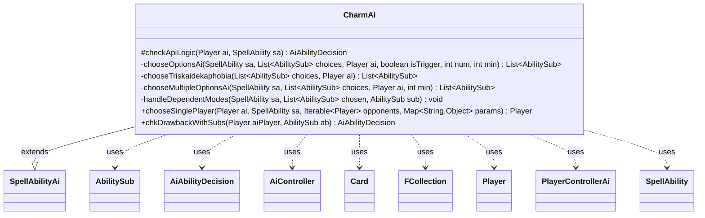

---
aliases:
  - CharmAi
tags:
  - java/class
  - module/forge-ai
  - pkg/forge/ai/ability
fqn: forge.ai.ability.CharmAi
package: forge.ai.ability
module: forge-ai
kind: Class
---

# CharmAi

**Package:** `forge.ai.ability`   **Module:** `forge-ai`   **Kind:** Class



## Relationships
**Extends:**
- [[forge.ai.SpellAbilityAi|SpellAbilityAi]]
**Uses:**
- [[forge.ai.AiAbilityDecision|AiAbilityDecision]]
- [[forge.ai.AiController|AiController]]
- [[forge.ai.PlayerControllerAi|PlayerControllerAi]]
- [[forge.game.card.Card|Card]]
- [[forge.game.player.Player|Player]]
- [[forge.game.spellability.AbilitySub|AbilitySub]]
- [[forge.game.spellability.SpellAbility|SpellAbility]]
- [[forge.util.collect.FCollection|FCollection]]

## Design Description

CharmAi is the AI decision-maker for "Charm"-style spells and abilities — cards offering a menu of modal sub-abilities from which a number must be selected. Extending `SpellAbilityAi`, it overrides `checkApiLogic` to compute how many modes are required (honoring Entwine, CharmNum/MinCharmNum, and Pawprint limits), then delegates to private heuristics that pick the best `AbilitySub` options via the `AiController`/`PlayerControllerAi`, evaluating candidates with `canPlaySa` and `doTrigger` and chaining dependent or unique-target modes.

Notable design intent is its layered fallback strategy: a strict first pass selects only clearly good modes, with progressively more permissive passes for triggers to satisfy minimum-choice requirements. It special-cases complex cards (e.g. the elaborate Triskaidekaphobia life-total logic and Cryptic Command's multi-mode handling), caches the chosen list on the `SpellAbility` to avoid re-deciding, and pre-builds the ability chain for accurate cost calculation.

## Source
`forge-ai/src/main/java/forge/ai/ability/CharmAi.java`

```java
package forge.ai.ability;

import com.google.common.collect.Lists;
import forge.ai.*;
import forge.game.ability.AbilityUtils;
import forge.game.ability.effects.CharmEffect;
import forge.game.card.Card;
import forge.game.player.Player;
import forge.game.spellability.AbilitySub;
import forge.game.spellability.SpellAbility;
import forge.util.Aggregates;
import forge.util.collect.FCollection;

import java.util.Collections;
import java.util.List;
import java.util.Map;

public class CharmAi extends SpellAbilityAi {
    @Override
    protected AiAbilityDecision checkApiLogic(Player ai, SpellAbility sa) {
        final Card source = sa.getHostCard();
        List<AbilitySub> choices = CharmEffect.makePossibleOptions(sa);

        final int num;
        final int min;
        if (sa.isEntwine()) {
            num = min = choices.size();
        } else {
            num = AbilityUtils.calculateAmount(source, sa.getParamOrDefault("CharmNum", "1"), sa);
            min = sa.hasParam("MinCharmNum") ? AbilityUtils.calculateAmount(source, sa.getParam("MinCharmNum"), sa) : num;
        }

        boolean timingRight = sa.isTrigger(); //is there a reason to play the charm now?
        boolean choiceForOpp = !ai.equals(sa.getActivatingPlayer());

        // Reset the chosen list otherwise it will be locked in forever by earlier calls
        sa.setChosenList(null);
        sa.setSubAbility(null);
        List<AbilitySub> chosenList;

        if (choiceForOpp) {
            // This branch is for "An Opponent chooses" Charm spells from Alliances
            // Current just choose the first available spell, which seem generally less disastrous for the AI.
            chosenList = choices.subList(1, choices.size());
        } else if ("Triskaidekaphobia".equals(ComputerUtilAbility.getAbilitySourceName(sa))) {
            chosenList = chooseTriskaidekaphobia(choices, ai);
        } else {
            // only randomize if not all possible together
            if (num < choices.size()) {
                Collections.shuffle(choices);
            }

            /*
             * The generic chooseOptionsAi uses canPlayAi() to determine good choices
             * which means most "bonus" effects like life-gain and random pumps will
             * usually not be chosen. This is designed to force the AI to only select
             * the best choice(s) since it does not actually know if it can pay for
             * "bonus" choices (eg. Entwine/Escalate).
             * chooseMultipleOptionsAi() uses "AILogic$Good" tags to manually identify
             * bonus choice(s) for the AI otherwise it might be too hard to ever fulfil
             * minimum choice requirements with canPlayAi() alone.
             */
            chosenList = min > 1 ? chooseMultipleOptionsAi(sa, choices, ai, min)
                    : chooseOptionsAi(sa, choices, ai, timingRight, num, min);
        }

        if (chosenList.isEmpty()) {
            if (timingRight) {
                // Set minimum choices for triggers where chooseMultipleOptionsAi() returns null
                chosenList = chooseOptionsAi(sa, choices, ai, true, num, min);
                if (chosenList.isEmpty() && min != 0) {
                    return new AiAbilityDecision(0, AiPlayDecision.CantPlayAi);
                }
            } else {
                return new AiAbilityDecision(0, AiPlayDecision.CantPlayAi);
            }
        }

        // store the choices so they'll get reused
        sa.setChosenList(chosenList);

        if (choiceForOpp) {
            return new AiAbilityDecision(0, AiPlayDecision.CantPlayAi);
        }

        if (sa.isSpell()) {
            // prebuild chain to improve cost calculation accuracy
            CharmEffect.chainAbilities(sa, chosenList);
        }

        return super.checkApiLogic(ai, sa);
    }

    private List<AbilitySub> chooseOptionsAi(SpellAbility sa, List<AbilitySub> choices, final Player ai, boolean isTrigger, int num, int min) {
        List<AbilitySub> chosen = Lists.newArrayList();
        AiController aic = ((PlayerControllerAi) ai.getController()).getAi();
        // TODO unused for now, the AI doesn't know how to effectively handle repeated choices
        boolean allowRepeat = sa.hasParam("CanRepeatModes");

        final int pawprintLimit = sa.hasParam("Pawprint") ? AbilityUtils.calculateAmount(sa.getHostCard(), sa.getParam("Pawprint"), sa) : 0;
        if (pawprintLimit > 0) {
            // try to pay for the more expensive subs first
            Collections.reverse(choices);
        }
        int pawprintAmount = 0;

        // First pass using standard canPlayAi() for good choices
        for (AbilitySub sub : choices) {
            handleDependentModes(sa, chosen, sub);
            sub.setActivatingPlayer(ai);
            // TODO refactor to obtain the AiAbilityDecision instead, then we can check all to sort by value
            if (AiPlayDecision.WillPlay == aic.canPlaySa(sub)) {
                if (pawprintLimit > 0) {
                    int curPawprintAmount = AbilityUtils.calculateAmount(sub.getHostCard(), sub.getParamOrDefault("Pawprint", "0"), sub);
                    if (pawprintAmount + curPawprintAmount > pawprintLimit) {
                        continue;
                    }
                    pawprintAmount += curPawprintAmount;
                }
                chosen.add(sub);
                if (chosen.size() == num) {
                    // maximum choices reached
                    break;
                }
            }
        }
        if (isTrigger && chosen.size() < min) {
            // Second pass using doTrigger(false) to fulfill minimum choice
            choices.removeAll(chosen);
            for (AbilitySub sub : choices) {
                handleDependentModes(sa, chosen, sub);
                if (aic.doTrigger(sub, false)) {
                    chosen.add(sub);
                    if (chosen.size() == min) {
                        break;
                    }
                }
            }
            // Third pass using doTrigger(true) to force fill minimum choices
            if (chosen.size() < min) {
                choices.removeAll(chosen);
                for (AbilitySub sub : choices) {
                    handleDependentModes(sa, chosen, sub);
                    if (aic.doTrigger(sub, true)) {
                        chosen.add(sub);
                        if (chosen.size() == min) {
                            break;
                        }
                    }
                }
            }
        }
        if (chosen.size() < min) {
            // not enough choices
            chosen.clear();
        }
        sa.setSubAbility(null);
        return chosen;
    }

    private List<AbilitySub> chooseTriskaidekaphobia(List<AbilitySub> choices, final Player ai) {
        List<AbilitySub> chosenList = Lists.newArrayList();
        if (choices == null || choices.isEmpty()) { return chosenList; }

        AbilitySub gain = choices.get(0);
        AbilitySub lose = choices.get(1);
        FCollection<Player> opponents = ai.getOpponents();

        boolean oppTainted = false;
        boolean allyTainted = ai.isCardInPlay("Tainted Remedy");
        final int aiLife = ai.getLife(); 

        //Check if Opponent controls Tainted Remedy
        for (Player p : opponents) {
            if (p.isCardInPlay("Tainted Remedy")) {
                oppTainted = true;
                break;
            }
        }
        // if ai or ally of ai does control Tainted Remedy, prefer gain life instead of lose
        if (!allyTainted) {
            for (Player p : ai.getAllies()) {
                if (p.isCardInPlay("Tainted Remedy")) {
                    allyTainted = true;
                    break;
                }
            }
        }
        
        if (!ai.canLoseLife() || ai.cantLose()) {
            // ai can't lose life, or can't lose the game, don't think about others
            chosenList.add(allyTainted ? gain : lose);
        } else if (oppTainted || ai.getGame().isCardInPlay("Rain of Gore")) {
            // Rain of Gore does negate lifegain, so don't benefit the others
            // same for if a opponent does control Tainted Remedy
            // but if ai can't gain life, the effects are negated
            chosenList.add(ai.canGainLife() ? lose : gain);
        } else if (ai.getGame().isCardInPlay("Sulfuric Vortex")) {
            // no life gain, but extra life loss.
            if (aiLife >= 17)
                chosenList.add(lose);
            // try to prevent to get to 13 with extra lose
            else if (aiLife < 13 || ((aiLife - 13) % 2) == 1) {
                chosenList.add(gain);
            } else {
                chosenList.add(lose);
            }
        } else if (ai.canGainLife() && aiLife <= 5) {
            // critical Life try to gain more
            chosenList.add(gain);
        } else if (!ai.canGainLife() && aiLife == 14) {
            // ai can't gain life, but try to avoid falling to 13
            // but if a opponent does control Tainted Remedy its irrelevant
            chosenList.add(oppTainted ? lose : gain);
        } else if (allyTainted) {
            // Tainted Remedy negation logic, try gain instead of lose
            // because negation does turn it into lose for opponents
            boolean oppCritical = false;
            // an opponent is Critical = 14, and can't gain life, try to lose life instead
            // but only if ai doesn't kill itself with that.
            if (aiLife != 14) {
                for (Player p : opponents) {
                    if (p.getLife() == 14 && !p.canGainLife() && p.canLoseLife()) {
                        oppCritical = true;
                        break;
                    }
                }
            }
            chosenList.add(aiLife == 12 || oppCritical ? lose : gain);
        } else {
            // normal logic, try to gain life if its critical
            boolean oppCritical = false;
            // an opponent is Critical = 12, and can gain life, try to gain life instead
            // but only if ai doesn't kill itself with that.
            if (aiLife != 12) {
                for (Player p : opponents) {
                    if (p.getLife() == 12 && p.canGainLife()) {
                        oppCritical = true;
                        break;
                    }
                }
            }
            chosenList.add(aiLife == 14 || aiLife <= 10 || oppCritical ? gain : lose);
        }
        return chosenList;
    }

    // Choice selection for charms that require multiple choices (e.g. Cryptic Command)
    private List<AbilitySub> chooseMultipleOptionsAi(SpellAbility sa, List<AbilitySub> choices, final Player ai, int min) {
        AbilitySub goodChoice = null;
        List<AbilitySub> chosen = Lists.newArrayList();
        AiController aic = ((PlayerControllerAi) ai.getController()).getAi();
        for (AbilitySub sub : choices) {
            handleDependentModes(sa, chosen, sub);
            sub.setActivatingPlayer(ai);
            // Assign generic good choice to fill up choices if necessary 
            if ("Good".equals(sub.getParam("AILogic")) && aic.doTrigger(sub, false)) {
                goodChoice = sub;
            } else if (AiPlayDecision.WillPlay == aic.canPlaySa(sub)) {
                chosen.add(sub);
                if (chosen.size() == min) {
                    break; // enough choices
                }
            }
        }
        // Add generic good choice if one more choice is needed
        if (chosen.size() == min - 1 && goodChoice != null) {
            chosen.add(0, goodChoice);  // hack to make Dromoka's Command fight targets work
        }
        if (chosen.size() != min) {
            chosen.clear();
        }
        sa.setSubAbility(null);
        return chosen;
    }

    private void handleDependentModes(SpellAbility sa, List<AbilitySub> chosen, AbilitySub sub) {
        if (sub.hasParam("TargetUnique") && !chosen.isEmpty()) {
            // support "Each mode must target a different..."
            sa.setSubAbility(null);
            CharmEffect.chainAbilities(sa, chosen);
            sa.appendSubAbility(sub);
        }
    }

    @Override
    public Player chooseSinglePlayer(Player ai, SpellAbility sa, Iterable<Player> opponents, Map<String, Object> params) {
        return Aggregates.random(opponents);
    }

    @Override
    public AiAbilityDecision chkDrawbackWithSubs(Player aiPlayer, AbilitySub ab) {
        // choices were already targeted
        if (ab.getRootAbility().getChosenList() != null) {
            return new AiAbilityDecision(100, AiPlayDecision.WillPlay);
        }
        return super.chkDrawbackWithSubs(aiPlayer, ab);
    }

}
```

## Python
`forge/ai/ability/CharmAi.py`

```python
from forge.ai.SpellAbilityAi import SpellAbilityAi
from forge.ai.AiAbilityDecision import AiAbilityDecision
from forge.ai.AiController import AiController
from forge.ai.PlayerControllerAi import PlayerControllerAi
from forge.game.card.Card import Card
from forge.game.player.Player import Player
from forge.game.spellability.AbilitySub import AbilitySub
from forge.game.spellability.SpellAbility import SpellAbility
from forge.util.collect.FCollection import FCollection

from forge.ai.AiPlayDecision import AiPlayDecision
from forge.ai.ComputerUtilAbility import ComputerUtilAbility
from forge.game.ability.AbilityUtils import AbilityUtils
from forge.game.ability.effects.CharmEffect import CharmEffect
from forge.util.Aggregates import Aggregates

import random


class CharmAi(SpellAbilityAi):
    def checkApiLogic(self, ai: Player, sa: SpellAbility) -> AiAbilityDecision:
        source = sa.getHostCard()
        choices = CharmEffect.makePossibleOptions(sa)

        if sa.isEntwine():
            num = min = len(choices)
        else:
            num = AbilityUtils.calculateAmount(source, sa.getParamOrDefault("CharmNum", "1"), sa)
            min = AbilityUtils.calculateAmount(source, sa.getParam("MinCharmNum"), sa) if sa.hasParam("MinCharmNum") else num

        timingRight = sa.isTrigger()  # is there a reason to play the charm now?
        choiceForOpp = not ai == sa.getActivatingPlayer()

        # Reset the chosen list otherwise it will be locked in forever by earlier calls
        sa.setChosenList(None)
        sa.setSubAbility(None)

        if choiceForOpp:
            # This branch is for "An Opponent chooses" Charm spells from Alliances
            # Current just choose the first available spell, which seem generally less disastrous for the AI.
            chosenList = choices[1:len(choices)]
        elif "Triskaidekaphobia" == ComputerUtilAbility.getAbilitySourceName(sa):
            chosenList = self.chooseTriskaidekaphobia(choices, ai)
        else:
            # only randomize if not all possible together
            if num < len(choices):
                random.shuffle(choices)

            #
            # The generic chooseOptionsAi uses canPlayAi() to determine good choices
            # which means most "bonus" effects like life-gain and random pumps will
            # usually not be chosen. This is designed to force the AI to only select
            # the best choice(s) since it does not actually know if it can pay for
            # "bonus" choices (eg. Entwine/Escalate).
            # chooseMultipleOptionsAi() uses "AILogic$Good" tags to manually identify
            # bonus choice(s) for the AI otherwise it might be too hard to ever fulfil
            # minimum choice requirements with canPlayAi() alone.
            #
            chosenList = self.chooseMultipleOptionsAi(sa, choices, ai, min) if min > 1 \
                else self.chooseOptionsAi(sa, choices, ai, timingRight, num, min)

        if len(chosenList) == 0:
            if timingRight:
                # Set minimum choices for triggers where chooseMultipleOptionsAi() returns null
                chosenList = self.chooseOptionsAi(sa, choices, ai, True, num, min)
                if len(chosenList) == 0 and min != 0:
                    return AiAbilityDecision(0, AiPlayDecision.CantPlayAi)
            else:
                return AiAbilityDecision(0, AiPlayDecision.CantPlayAi)

        # store the choices so they'll get reused
        sa.setChosenList(chosenList)

        if choiceForOpp:
            return AiAbilityDecision(0, AiPlayDecision.CantPlayAi)

        if sa.isSpell():
            # prebuild chain to improve cost calculation accuracy
            CharmEffect.chainAbilities(sa, chosenList)

        return super().checkApiLogic(ai, sa)

    def chooseOptionsAi(self, sa: SpellAbility, choices: list[AbilitySub], ai: Player, isTrigger: bool, num: int, min: int) -> list[AbilitySub]:
        chosen = []
        aic = ai.getController().getAi()
        # TODO unused for now, the AI doesn't know how to effectively handle repeated choices
        allowRepeat = sa.hasParam("CanRepeatModes")

        pawprintLimit = AbilityUtils.calculateAmount(sa.getHostCard(), sa.getParam("Pawprint"), sa) if sa.hasParam("Pawprint") else 0
        if pawprintLimit > 0:
            # try to pay for the more expensive subs first
            choices.reverse()
        pawprintAmount = 0

        # First pass using standard canPlayAi() for good choices
        for sub in choices:
            self.handleDependentModes(sa, chosen, sub)
            sub.setActivatingPlayer(ai)
            # TODO refactor to obtain the AiAbilityDecision instead, then we can check all to sort by value
            if AiPlayDecision.WillPlay == aic.canPlaySa(sub):
                if pawprintLimit > 0:
                    curPawprintAmount = AbilityUtils.calculateAmount(sub.getHostCard(), sub.getParamOrDefault("Pawprint", "0"), sub)
                    if pawprintAmount + curPawprintAmount > pawprintLimit:
                        continue
                    pawprintAmount += curPawprintAmount
                chosen.append(sub)
                if len(chosen) == num:
                    # maximum choices reached
                    break
        if isTrigger and len(chosen) < min:
            # Second pass using doTrigger(false) to fulfill minimum choice
            for c in chosen:
                if c in choices:
                    choices.remove(c)
            for sub in choices:
                self.handleDependentModes(sa, chosen, sub)
                if aic.doTrigger(sub, False):
                    chosen.append(sub)
                    if len(chosen) == min:
                        break
            # Third pass using doTrigger(true) to force fill minimum choices
            if len(chosen) < min:
                for c in chosen:
                    if c in choices:
                        choices.remove(c)
                for sub in choices:
                    self.handleDependentModes(sa, chosen, sub)
                    if aic.doTrigger(sub, True):
                        chosen.append(sub)
                        if len(chosen) == min:
                            break
        if len(chosen) < min:
            # not enough choices
            chosen.clear()
        sa.setSubAbility(None)
        return chosen

    def chooseTriskaidekaphobia(self, choices: list[AbilitySub], ai: Player) -> list[AbilitySub]:
        chosenList = []
        if choices is None or len(choices) == 0:
            return chosenList

        gain = choices[0]
        lose = choices[1]
        opponents = ai.getOpponents()

        oppTainted = False
        allyTainted = ai.isCardInPlay("Tainted Remedy")
        aiLife = ai.getLife()

        # Check if Opponent controls Tainted Remedy
        for p in opponents:
            if p.isCardInPlay("Tainted Remedy"):
                oppTainted = True
                break
        # if ai or ally of ai does control Tainted Remedy, prefer gain life instead of lose
        if not allyTainted:
            for p in ai.getAllies():
                if p.isCardInPlay("Tainted Remedy"):
                    allyTainted = True
                    break

        if not ai.canLoseLife() or ai.cantLose():
            # ai can't lose life, or can't lose the game, don't think about others
            chosenList.append(gain if allyTainted else lose)
        elif oppTainted or ai.getGame().isCardInPlay("Rain of Gore"):
            # Rain of Gore does negate lifegain, so don't benefit the others
            # same for if a opponent does control Tainted Remedy
            # but if ai can't gain life, the effects are negated
            chosenList.append(lose if ai.canGainLife() else gain)
        elif ai.getGame().isCardInPlay("Sulfuric Vortex"):
            # no life gain, but extra life loss.
            if aiLife >= 17:
                chosenList.append(lose)
            # try to prevent to get to 13 with extra lose
            elif aiLife < 13 or ((aiLife - 13) % 2) == 1:
                chosenList.append(gain)
            else:
                chosenList.append(lose)
        elif ai.canGainLife() and aiLife <= 5:
            # critical Life try to gain more
            chosenList.append(gain)
        elif not ai.canGainLife() and aiLife == 14:
            # ai can't gain life, but try to avoid falling to 13
            # but if a opponent does control Tainted Remedy its irrelevant
            chosenList.append(lose if oppTainted else gain)
        elif allyTainted:
            # Tainted Remedy negation logic, try gain instead of lose
            # because negation does turn it into lose for opponents
            oppCritical = False
            # an opponent is Critical = 14, and can't gain life, try to lose life instead
            # but only if ai doesn't kill itself with that.
            if aiLife != 14:
                for p in opponents:
                    if p.getLife() == 14 and not p.canGainLife() and p.canLoseLife():
                        oppCritical = True
                        break
            chosenList.append(lose if (aiLife == 12 or oppCritical) else gain)
        else:
            # normal logic, try to gain life if its critical
            oppCritical = False
            # an opponent is Critical = 12, and can gain life, try to gain life instead
            # but only if ai doesn't kill itself with that.
            if aiLife != 12:
                for p in opponents:
                    if p.getLife() == 12 and p.canGainLife():
                        oppCritical = True
                        break
            chosenList.append(gain if (aiLife == 14 or aiLife <= 10 or oppCritical) else lose)
        return chosenList

    # Choice selection for charms that require multiple choices (e.g. Cryptic Command)
    def chooseMultipleOptionsAi(self, sa: SpellAbility, choices: list[AbilitySub], ai: Player, min: int) -> list[AbilitySub]:
        goodChoice = None
        chosen = []
        aic = ai.getController().getAi()
        for sub in choices:
            self.handleDependentModes(sa, chosen, sub)
            sub.setActivatingPlayer(ai)
            # Assign generic good choice to fill up choices if necessary
            if "Good" == sub.getParam("AILogic") and aic.doTrigger(sub, False):
                goodChoice = sub
            elif AiPlayDecision.WillPlay == aic.canPlaySa(sub):
                chosen.append(sub)
                if len(chosen) == min:
                    break  # enough choices
        # Add generic good choice if one more choice is needed
        if len(chosen) == min - 1 and goodChoice is not None:
            chosen.insert(0, goodChoice)  # hack to make Dromoka's Command fight targets work
        if len(chosen) != min:
            chosen.clear()
        sa.setSubAbility(None)
        return chosen

    def handleDependentModes(self, sa: SpellAbility, chosen: list[AbilitySub], sub: AbilitySub) -> None:
        if sub.hasParam("TargetUnique") and len(chosen) != 0:
            # support "Each mode must target a different..."
            sa.setSubAbility(None)
            CharmEffect.chainAbilities(sa, chosen)
            sa.appendSubAbility(sub)

    def chooseSinglePlayer(self, ai: Player, sa: SpellAbility, opponents, params: dict[str, object]) -> Player:
        return Aggregates.random(opponents)

    def chkDrawbackWithSubs(self, aiPlayer: Player, ab: AbilitySub) -> AiAbilityDecision:
        # choices were already targeted
        if ab.getRootAbility().getChosenList() is not None:
            return AiAbilityDecision(100, AiPlayDecision.WillPlay)
        return super().chkDrawbackWithSubs(aiPlayer, ab)
```
