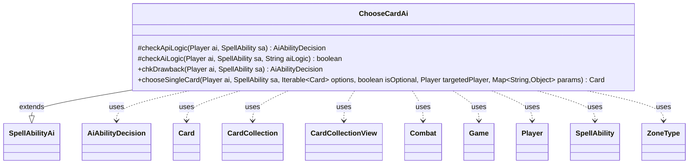

---
aliases:
  - ChooseCardAi
tags:
  - java/class
  - module/forge-ai
  - pkg/forge/ai/ability
fqn: forge.ai.ability.ChooseCardAi
package: forge.ai.ability
module: forge-ai
kind: Class
---

# ChooseCardAi

**Package:** `forge.ai.ability`   **Module:** `forge-ai`   **Kind:** Class



## Relationships
**Extends:**
- [[forge.ai.SpellAbilityAi|SpellAbilityAi]]
**Uses:**
- [[forge.ai.AiAbilityDecision|AiAbilityDecision]]
- [[forge.game.Game|Game]]
- [[forge.game.card.Card|Card]]
- [[forge.game.card.CardCollection|CardCollection]]
- [[forge.game.card.CardCollectionView|CardCollectionView]]
- [[forge.game.combat.Combat|Combat]]
- [[forge.game.player.Player|Player]]
- [[forge.game.spellability.SpellAbility|SpellAbility]]
- [[forge.game.zone.ZoneType|ZoneType]]

## Design Description

ChooseCardAi is the AI decision handler for the ChooseCard spell ability, deciding both whether the computer should activate such an ability and which single card it should pick. It extends `SpellAbilityAi`, overriding `checkApiLogic` to handle opponent targeting, `checkAiLogic` to gate playability per named AI logic, `chkDrawback` for sub-ability evaluation, and `chooseSingleCard` to make the actual selection. The class collaborates with the game model—`Player`, `Card`/`CardCollection`, `Combat`, `Game`, and `ZoneType`—and returns its play decisions as `AiAbilityDecision` values.

Its dominant design intent is a large dispatch over string-keyed `AILogic` values, letting individual cards (Duneblast, Ashiok, TangleWire, Phylactery, Orzhov Advokist, and many generic strategies like "WorstCard" or "BestBlocker") plug card-specific heuristics into one shared handler rather than each needing bespoke AI code. It defaults to choosing the "best" card and falls back gracefully, logging a warning on unrecognized logic.

## Source
`forge-ai/src/main/java/forge/ai/ability/ChooseCardAi.java`

```java
package forge.ai.ability;

import com.google.common.collect.Iterables;
import com.google.common.collect.Lists;
import forge.ai.*;
import forge.game.Game;
import forge.game.card.*;
import forge.game.combat.Combat;
import forge.game.keyword.Keyword;
import forge.game.phase.PhaseType;
import forge.game.player.Player;
import forge.game.player.PlayerPredicates;
import forge.game.spellability.SpellAbility;
import forge.game.zone.ZoneType;
import forge.util.Aggregates;
import forge.util.IterableUtil;

import java.util.List;
import java.util.Map;

public class ChooseCardAi extends SpellAbilityAi {

    /**
     * The rest of the logic not covered by the canPlayAI template is defined here
     */
    @Override
    protected AiAbilityDecision checkApiLogic(final Player ai, final SpellAbility sa) {
        if (sa.usesTargeting()) {
            sa.resetTargets();
            // search targetable Opponents
            final List<Player> oppList = ai.getOpponents().filter(PlayerPredicates.isTargetableBy(sa));

            if (oppList.isEmpty()) {
                return new AiAbilityDecision(0, AiPlayDecision.CantPlayAi);
            }

            sa.getTargets().add(Iterables.getFirst(oppList, null));
        }
        return new AiAbilityDecision(100, AiPlayDecision.WillPlay);
    }

    /**
     * Checks if the AI will play a SpellAbility with the specified AiLogic
     */
    @Override
    protected boolean checkAiLogic(final Player ai, final SpellAbility sa, final String aiLogic) {
        final Card host = sa.getHostCard();
        final Game game = ai.getGame();

        List<ZoneType> choiceZone;
        if (sa.hasParam("ChoiceZone")) {
            choiceZone = ZoneType.listValueOf(sa.getParam("ChoiceZone"));
        } else {
            choiceZone = Lists.newArrayList(ZoneType.Battlefield);
        }
        CardCollectionView choices = game.getCardsIn(choiceZone);

        if (sa.hasParam("Choices")) {
            choices = CardLists.getValidCards(choices, sa.getParam("Choices"), host.getController(), host, sa);
        }
        if (sa.hasParam("TargetControls")) {
            choices = CardLists.filterControlledBy(choices, ai.getOpponents());
        }
        if (aiLogic.equals("AtLeast1") || aiLogic.equals("OppPreferred")) {
            return !choices.isEmpty();
        } else if (aiLogic.equals("AtLeast2") || aiLogic.equals("BestBlocker")) {
            return choices.size() >= 2;
        } else if (aiLogic.equals("Clone")) {
            final String filter = "Permanent.YouDontCtrl,Permanent.nonLegendary";
            choices = CardLists.getValidCards(choices, filter, host.getController(), host, sa);
            return !choices.isEmpty();
        } else if (aiLogic.equals("Never")) {
            return false;
        } else if (aiLogic.equals("NeedsPrevention")) {
            if (!game.getPhaseHandler().is(PhaseType.COMBAT_DECLARE_BLOCKERS)) {
                return false;
            }
            final Combat combat = game.getCombat();
            choices = CardLists.filter(choices, c -> {
                if (!combat.isAttacking(c, ai) || !combat.isUnblocked(c)) {
                    return false;
                }
                int ref = ComputerUtilAbility.getAbilitySourceName(sa).equals("Forcefield") ? 1 : 0;
                return ComputerUtilCombat.damageIfUnblocked(c, ai, combat, true) > ref;
            });
            return !choices.isEmpty();
        } else if (aiLogic.equals("Ashiok")) {
            final int loyalty = host.getCounters(CounterEnumType.LOYALTY) - 1;
            for (int i = loyalty; i >= 0; i--) {
                sa.setXManaCostPaid(i);
                choices = game.getCardsIn(choiceZone);
                choices = CardLists.getValidCards(choices, sa.getParam("Choices"), host.getController(), host, sa);
                if (!choices.isEmpty()) {
                    return true;
                }
            }

            return !choices.isEmpty();
        } else if (aiLogic.equals("RandomNonLand")) {
            return !CardLists.getValidCards(choices, "Card.nonLand", host.getController(), host, sa).isEmpty();
        } else if (aiLogic.equals("Duneblast")) {
            CardCollection aiCreatures = ai.getCreaturesInPlay();
            CardCollection oppCreatures = AiAttackController.choosePreferredDefenderPlayer(ai).getCreaturesInPlay();
            aiCreatures = CardLists.getNotKeyword(aiCreatures, Keyword.INDESTRUCTIBLE);
            oppCreatures = CardLists.getNotKeyword(oppCreatures, Keyword.INDESTRUCTIBLE);

            // Use it as a wrath, when the human creatures threat the ai's life
            if (aiCreatures.isEmpty() && ComputerUtilCombat.sumDamageIfUnblocked(oppCreatures, ai) >= ai.getLife()) {
                return true;
            }

            Card chosen = ComputerUtilCard.getBestCreatureAI(aiCreatures);
            aiCreatures.remove(chosen);
            int minGain = 200;

            return (ComputerUtilCard.evaluateCreatureList(aiCreatures) + minGain) < ComputerUtilCard
                    .evaluateCreatureList(oppCreatures);
        } else if (aiLogic.equals("OwnCard")) {
            CardCollectionView ownChoices = CardLists.filter(choices, CardPredicates.isController(ai));
            if (ownChoices.isEmpty()) {
                ownChoices = CardLists.filter(choices, CardPredicates.isControlledByAnyOf(ai.getAllies()));
            }
            return !ownChoices.isEmpty();
        } else if (aiLogic.equals("GoodCreature")) {
            for (Card choice : choices) {
                if (choice.isCreature() && ComputerUtilCard.evaluateCreature(choice) >= 250) {
                    return true;
                }
            }
            return false;
        }
        return true;
    }

    @Override
    public AiAbilityDecision chkDrawback(Player ai, SpellAbility sa) {
        if (sa.hasParam("AILogic") && !checkAiLogic(ai, sa, sa.getParam("AILogic"))) {
            return new AiAbilityDecision(0, AiPlayDecision.CantPlayAi);
        }

        return checkApiLogic(ai, sa);
    }

    /* (non-Javadoc)
     * @see forge.card.ability.SpellAbilityAi#chooseSingleCard(forge.card.spellability.SpellAbility, java.util.List, boolean)
     */
    @Override
    public Card chooseSingleCard(final Player ai, final SpellAbility sa, Iterable<Card> options, boolean isOptional, Player targetedPlayer, Map<String, Object> params) {
        final Card host = sa.getHostCard();
        final Player ctrl = host.getController();
        String logic = sa.getParamOrDefault("AILogic", "");
        if (logic.contains("NotSelf")) {
            CardCollection opt = (CardCollection) options;
            if (opt.contains(host)) {
                opt.remove(host);
            }
            options = opt;
            logic = logic.replace("NotSelf", "");
        }
        Card choice = null;
        if (logic.isEmpty()) {
            // Base Logic is choose "best"
            choice = ComputerUtilCard.getBestAI(options);
        } else if ("WorstCard".equals(logic)) {
            choice = ComputerUtilCard.getWorstAI(options);
        } else if ("OwnCard".equals(logic)) {
            CardCollectionView ownChoices = CardLists.filter(options, CardPredicates.isController(ai));
            if (ownChoices.isEmpty()) {
                ownChoices = CardLists.filter(options, CardPredicates.isControlledByAnyOf(ai.getAllies()));
            }
            choice = ComputerUtilCard.getBestAI(ownChoices);
        } else if ("BestBlocker".equals(logic)) {
            if (IterableUtil.any(options, CardPredicates.UNTAPPED)) {
                options = CardLists.filter(options, CardPredicates.UNTAPPED);
            }
            choice = ComputerUtilCard.getBestCreatureAI(options);
        } else if ("Clone".equals(logic)) {
            final String filter = "Permanent.YouDontCtrl,Permanent.nonLegendary";
            CardCollection newOptions = CardLists.getValidCards(options, filter, ctrl, host, sa);
            if (!newOptions.isEmpty()) {
                options = newOptions;
            }
            choice = ComputerUtilCard.getBestAI(options);
        } else if ("RandomNonLand".equals(logic)) {
            options = CardLists.getValidCards(options, "Card.nonLand", host.getController(), host, sa);
            choice = Aggregates.random(options);
        } else if ("NeedsPrevention".equals(logic)) {
            final Game game = ai.getGame();
            final Combat combat = game.getCombat();
            CardCollectionView better = CardLists.filter(options, c -> {
                if (combat == null || !combat.isAttacking(c, ai) || !combat.isUnblocked(c)) {
                    return false;
                }
                int ref = ComputerUtilAbility.getAbilitySourceName(sa).equals("Forcefield") ? 1 : 0;
                return ComputerUtilCombat.damageIfUnblocked(c, ai, combat, true) > ref;
            });
            if (!better.isEmpty()) {
                choice = ComputerUtilCard.getBestAI(better);
            } else {
                choice = ComputerUtilCard.getBestAI(options);
            }
        } else if ("OppPreferred".equals(logic)) {
            CardCollectionView oppControlled = CardLists.filterControlledBy(options, ai.getOpponents());
            if (!oppControlled.isEmpty()) {
                choice = ComputerUtilCard.getBestAI(oppControlled);
            } else {
                CardCollectionView aiControlled = CardLists.filterControlledBy(options, ai);
                choice = ComputerUtilCard.getWorstAI(aiControlled);
            }
        } else if ("LowestCMCCreature".equals(logic)) {
            CardCollection creats = CardLists.filter(options, CardPredicates.CREATURES);
            creats = CardLists.filterToughness(creats, 1);
            if (creats.isEmpty()) {
                choice = ComputerUtilCard.getWorstAI(options);
            } else {
                creats.sort(CardLists.CmcComparator);
                choice = creats.get(0);
            }
        } else if ("NegativePowerFirst".equals(logic)) {
            Card lowest = Aggregates.itemWithMin(options, Card::getNetPower);
            if (lowest.getNetPower() <= 0) {
                choice = lowest;
            } else {
                choice = ComputerUtilCard.getBestCreatureAI(options);
            }
        } else if ("TangleWire".equals(logic)) {
            CardCollectionView betterList = CardLists.filter(options, c -> {
                if (c.isCreature()) {
                    return false;
                }
                for (SpellAbility sa1 : c.getAllSpellAbilities()) {
                    if (sa1.getPayCosts().hasTapCost()) {
                        return false;
                    }
                }
                return true;
            });
            if (!betterList.isEmpty()) {
                choice = betterList.get(0);
            } else {
                choice = ComputerUtilCard.getWorstPermanentAI(options, false, false, false, false);
            }
        } else if ("Duneblast".equals(logic)) {
            CardCollectionView aiCreatures = ai.getCreaturesInPlay();
            aiCreatures = CardLists.getNotKeyword(aiCreatures, Keyword.INDESTRUCTIBLE);

            if (aiCreatures.isEmpty()) {
                return null;
            }

            Card chosen = ComputerUtilCard.getBestCreatureAI(aiCreatures);
            return chosen;
        } else if ("OrzhovAdvokist".equals(logic)) {
            if (ai.equals(sa.getActivatingPlayer()) || // who cares if you can't attack yourself
                    (ai.getOpponents().size() > 1 && // if there is another opponent good to attack, take the counters
                    !AiAttackController.choosePreferredDefenderPlayer(ai).equals(sa.getActivatingPlayer()))) {
                choice = ComputerUtilCard.getBestAI(options);
                // TODO: would also be nice to take the counters if not in a good position to attack anyway
                //  – might also be good to do a separate AI for Noble Heritage
            }
        } else if ("Phylactery".equals(logic)) {
            CardCollection aiArtifacts = CardLists.filter(ai.getCardsIn(ZoneType.Battlefield), CardPredicates.ARTIFACTS);
            CardCollection indestructibles = CardLists.filter(aiArtifacts, CardPredicates.hasKeyword(Keyword.INDESTRUCTIBLE));
            CardCollection nonCreatures = CardLists.filter(aiArtifacts, CardPredicates.NON_CREATURES);
            CardCollection creatures = CardLists.filter(aiArtifacts, CardPredicates.CREATURES);
            if (!indestructibles.isEmpty()) {
                // Choose the worst (smallest) indestructible artifact so that the opponent would have to waste
                // removal on something unpreferred
                choice = ComputerUtilCard.getWorstAI(indestructibles);
            } else if (!nonCreatures.isEmpty()) {
                // The same as above, but for non-indestructible non-creature artifacts (they can't die in combat)
                choice = ComputerUtilCard.getWorstAI(nonCreatures);
            } else if (!creatures.isEmpty()) {
                // Choose the best (hopefully the fattest, whatever) creature so that hopefully it won't die too easily
                choice = ComputerUtilCard.getBestAI(creatures);
            }
        } else if ("NextTurnAttacker".equals(logic)) {
            choice = ComputerUtilCard.getBestCreatureToAttackNextTurnAI(ai, options);
        } else {
            choice = ComputerUtilCard.getBestAI(options);
            System.err.println("Bad ChooseCard AILogic value for " + host.getName() + " - reverting to default");
        }
        return choice;
    }
}
```

## Python
`forge/ai/ability/ChooseCardAi.py`

```python
from __future__ import annotations

from typing import Iterable, List, Map

from forge.ai.SpellAbilityAi import SpellAbilityAi
from forge.ai.AiAbilityDecision import AiAbilityDecision
from forge.ai.AiPlayDecision import AiPlayDecision
from forge.ai.ComputerUtilAbility import ComputerUtilAbility
from forge.ai.ComputerUtilCard import ComputerUtilCard
from forge.ai.ComputerUtilCombat import ComputerUtilCombat
from forge.ai.AiAttackController import AiAttackController
from forge.game.Game import Game
from forge.game.card.Card import Card
from forge.game.card.CardCollection import CardCollection
from forge.game.card.CardCollectionView import CardCollectionView
from forge.game.card.CardLists import CardLists
from forge.game.card.CardPredicates import CardPredicates
from forge.game.card.CounterEnumType import CounterEnumType
from forge.game.combat.Combat import Combat
from forge.game.keyword.Keyword import Keyword
from forge.game.phase.PhaseType import PhaseType
from forge.game.player.Player import Player
from forge.game.player.PlayerPredicates import PlayerPredicates
from forge.game.spellability.SpellAbility import SpellAbility
from forge.game.zone.ZoneType import ZoneType
from forge.util.Aggregates import Aggregates
from forge.util.IterableUtil import IterableUtil


class ChooseCardAi(SpellAbilityAi):

    # The rest of the logic not covered by the canPlayAI template is defined here
    def checkApiLogic(self, ai: Player, sa: SpellAbility) -> AiAbilityDecision:
        if sa.usesTargeting():
            sa.resetTargets()
            # search targetable Opponents
            oppList: List[Player] = ai.getOpponents().filter(PlayerPredicates.isTargetableBy(sa))

            if oppList.isEmpty():
                return AiAbilityDecision(0, AiPlayDecision.CantPlayAi)

            sa.getTargets().add(oppList[0] if oppList else None)
        return AiAbilityDecision(100, AiPlayDecision.WillPlay)

    # Checks if the AI will play a SpellAbility with the specified AiLogic
    def checkAiLogic(self, ai: Player, sa: SpellAbility, aiLogic: str) -> bool:
        host = sa.getHostCard()
        game = ai.getGame()

        if sa.hasParam("ChoiceZone"):
            choiceZone = ZoneType.listValueOf(sa.getParam("ChoiceZone"))
        else:
            choiceZone = [ZoneType.Battlefield]
        choices: CardCollectionView = game.getCardsIn(choiceZone)

        if sa.hasParam("Choices"):
            choices = CardLists.getValidCards(choices, sa.getParam("Choices"), host.getController(), host, sa)
        if sa.hasParam("TargetControls"):
            choices = CardLists.filterControlledBy(choices, ai.getOpponents())
        if aiLogic == "AtLeast1" or aiLogic == "OppPreferred":
            return not choices.isEmpty()
        elif aiLogic == "AtLeast2" or aiLogic == "BestBlocker":
            return choices.size() >= 2
        elif aiLogic == "Clone":
            filter = "Permanent.YouDontCtrl,Permanent.nonLegendary"
            choices = CardLists.getValidCards(choices, filter, host.getController(), host, sa)
            return not choices.isEmpty()
        elif aiLogic == "Never":
            return False
        elif aiLogic == "NeedsPrevention":
            if not game.getPhaseHandler().is_(PhaseType.COMBAT_DECLARE_BLOCKERS):
                return False
            combat = game.getCombat()

            def _needsPrevention(c):
                if not combat.isAttacking(c, ai) or not combat.isUnblocked(c):
                    return False
                ref = 1 if ComputerUtilAbility.getAbilitySourceName(sa) == "Forcefield" else 0
                return ComputerUtilCombat.damageIfUnblocked(c, ai, combat, True) > ref

            choices = CardLists.filter(choices, _needsPrevention)
            return not choices.isEmpty()
        elif aiLogic == "Ashiok":
            loyalty = host.getCounters(CounterEnumType.LOYALTY) - 1
            for i in range(loyalty, -1, -1):
                sa.setXManaCostPaid(i)
                choices = game.getCardsIn(choiceZone)
                choices = CardLists.getValidCards(choices, sa.getParam("Choices"), host.getController(), host, sa)
                if not choices.isEmpty():
                    return True

            return not choices.isEmpty()
        elif aiLogic == "RandomNonLand":
            return not CardLists.getValidCards(choices, "Card.nonLand", host.getController(), host, sa).isEmpty()
        elif aiLogic == "Duneblast":
            aiCreatures = ai.getCreaturesInPlay()
            oppCreatures = AiAttackController.choosePreferredDefenderPlayer(ai).getCreaturesInPlay()
            aiCreatures = CardLists.getNotKeyword(aiCreatures, Keyword.INDESTRUCTIBLE)
            oppCreatures = CardLists.getNotKeyword(oppCreatures, Keyword.INDESTRUCTIBLE)

            # Use it as a wrath, when the human creatures threat the ai's life
            if aiCreatures.isEmpty() and ComputerUtilCombat.sumDamageIfUnblocked(oppCreatures, ai) >= ai.getLife():
                return True

            chosen = ComputerUtilCard.getBestCreatureAI(aiCreatures)
            aiCreatures.remove(chosen)
            minGain = 200

            return (ComputerUtilCard.evaluateCreatureList(aiCreatures) + minGain) < ComputerUtilCard.evaluateCreatureList(oppCreatures)
        elif aiLogic == "OwnCard":
            ownChoices: CardCollectionView = CardLists.filter(choices, CardPredicates.isController(ai))
            if ownChoices.isEmpty():
                ownChoices = CardLists.filter(choices, CardPredicates.isControlledByAnyOf(ai.getAllies()))
            return not ownChoices.isEmpty()
        elif aiLogic == "GoodCreature":
            for choice in choices:
                if choice.isCreature() and ComputerUtilCard.evaluateCreature(choice) >= 250:
                    return True
            return False
        return True

    def chkDrawback(self, ai: Player, sa: SpellAbility) -> AiAbilityDecision:
        if sa.hasParam("AILogic") and not self.checkAiLogic(ai, sa, sa.getParam("AILogic")):
            return AiAbilityDecision(0, AiPlayDecision.CantPlayAi)

        return self.checkApiLogic(ai, sa)

    # (non-Javadoc)
    # @see forge.card.ability.SpellAbilityAi#chooseSingleCard(forge.card.spellability.SpellAbility, java.util.List, boolean)
    def chooseSingleCard(self, ai: Player, sa: SpellAbility, options: Iterable[Card], isOptional: bool, targetedPlayer: Player, params: Map[str, object]) -> Card:
        host = sa.getHostCard()
        ctrl = host.getController()
        logic = sa.getParamOrDefault("AILogic", "")
        if "NotSelf" in logic:
            opt: CardCollection = options
            if opt.contains(host):
                opt.remove(host)
            options = opt
            logic = logic.replace("NotSelf", "")
        choice = None
        if logic == "":
            # Base Logic is choose "best"
            choice = ComputerUtilCard.getBestAI(options)
        elif "WorstCard" == logic:
            choice = ComputerUtilCard.getWorstAI(options)
        elif "OwnCard" == logic:
            ownChoices: CardCollectionView = CardLists.filter(options, CardPredicates.isController(ai))
            if ownChoices.isEmpty():
                ownChoices = CardLists.filter(options, CardPredicates.isControlledByAnyOf(ai.getAllies()))
            choice = ComputerUtilCard.getBestAI(ownChoices)
        elif "BestBlocker" == logic:
            if IterableUtil.any(options, CardPredicates.UNTAPPED):
                options = CardLists.filter(options, CardPredicates.UNTAPPED)
            choice = ComputerUtilCard.getBestCreatureAI(options)
        elif "Clone" == logic:
            filter = "Permanent.YouDontCtrl,Permanent.nonLegendary"
            newOptions: CardCollection = CardLists.getValidCards(options, filter, ctrl, host, sa)
            if not newOptions.isEmpty():
                options = newOptions
            choice = ComputerUtilCard.getBestAI(options)
        elif "RandomNonLand" == logic:
            options = CardLists.getValidCards(options, "Card.nonLand", host.getController(), host, sa)
            choice = Aggregates.random(options)
        elif "NeedsPrevention" == logic:
            game = ai.getGame()
            combat = game.getCombat()

            def _needsPrevention(c):
                if combat is None or not combat.isAttacking(c, ai) or not combat.isUnblocked(c):
                    return False
                ref = 1 if ComputerUtilAbility.getAbilitySourceName(sa) == "Forcefield" else 0
                return ComputerUtilCombat.damageIfUnblocked(c, ai, combat, True) > ref

            better: CardCollectionView = CardLists.filter(options, _needsPrevention)
            if not better.isEmpty():
                choice = ComputerUtilCard.getBestAI(better)
            else:
                choice = ComputerUtilCard.getBestAI(options)
        elif "OppPreferred" == logic:
            oppControlled: CardCollectionView = CardLists.filterControlledBy(options, ai.getOpponents())
            if not oppControlled.isEmpty():
                choice = ComputerUtilCard.getBestAI(oppControlled)
            else:
                aiControlled: CardCollectionView = CardLists.filterControlledBy(options, ai)
                choice = ComputerUtilCard.getWorstAI(aiControlled)
        elif "LowestCMCCreature" == logic:
            creats: CardCollection = CardLists.filter(options, CardPredicates.CREATURES)
            creats = CardLists.filterToughness(creats, 1)
            if creats.isEmpty():
                choice = ComputerUtilCard.getWorstAI(options)
            else:
                creats.sort(CardLists.CmcComparator)
                choice = creats.get(0)
        elif "NegativePowerFirst" == logic:
            lowest = Aggregates.itemWithMin(options, Card.getNetPower)
            if lowest.getNetPower() <= 0:
                choice = lowest
            else:
                choice = ComputerUtilCard.getBestCreatureAI(options)
        elif "TangleWire" == logic:
            def _tangleWire(c):
                if c.isCreature():
                    return False
                for sa1 in c.getAllSpellAbilities():
                    if sa1.getPayCosts().hasTapCost():
                        return False
                return True

            betterList: CardCollectionView = CardLists.filter(options, _tangleWire)
            if not betterList.isEmpty():
                choice = betterList.get(0)
            else:
                choice = ComputerUtilCard.getWorstPermanentAI(options, False, False, False, False)
        elif "Duneblast" == logic:
            aiCreatures: CardCollectionView = ai.getCreaturesInPlay()
            aiCreatures = CardLists.getNotKeyword(aiCreatures, Keyword.INDESTRUCTIBLE)

            if aiCreatures.isEmpty():
                return None

            chosen = ComputerUtilCard.getBestCreatureAI(aiCreatures)
            return chosen
        elif "OrzhovAdvokist" == logic:
            if ai == sa.getActivatingPlayer() or (  # who cares if you can't attack yourself
                    ai.getOpponents().size() > 1 and  # if there is another opponent good to attack, take the counters
                    AiAttackController.choosePreferredDefenderPlayer(ai) != sa.getActivatingPlayer()):
                choice = ComputerUtilCard.getBestAI(options)
                # TODO: would also be nice to take the counters if not in a good position to attack anyway
                #  ΓÇô might also be good to do a separate AI for Noble Heritage
        elif "Phylactery" == logic:
            aiArtifacts: CardCollection = CardLists.filter(ai.getCardsIn(ZoneType.Battlefield), CardPredicates.ARTIFACTS)
            indestructibles: CardCollection = CardLists.filter(aiArtifacts, CardPredicates.hasKeyword(Keyword.INDESTRUCTIBLE))
            nonCreatures: CardCollection = CardLists.filter(aiArtifacts, CardPredicates.NON_CREATURES)
            creatures: CardCollection = CardLists.filter(aiArtifacts, CardPredicates.CREATURES)
            if not indestructibles.isEmpty():
                # Choose the worst (smallest) indestructible artifact so that the opponent would have to waste
                # removal on something unpreferred
                choice = ComputerUtilCard.getWorstAI(indestructibles)
            elif not nonCreatures.isEmpty():
                # The same as above, but for non-indestructible non-creature artifacts (they can't die in combat)
                choice = ComputerUtilCard.getWorstAI(nonCreatures)
            elif not creatures.isEmpty():
                # Choose the best (hopefully the fattest, whatever) creature so that hopefully it won't die too easily
                choice = ComputerUtilCard.getBestAI(creatures)
        elif "NextTurnAttacker" == logic:
            choice = ComputerUtilCard.getBestCreatureToAttackNextTurnAI(ai, options)
        else:
            choice = ComputerUtilCard.getBestAI(options)
            import sys
            print("Bad ChooseCard AILogic value for " + host.getName() + " - reverting to default", file=sys.stderr)
        return choice
```
