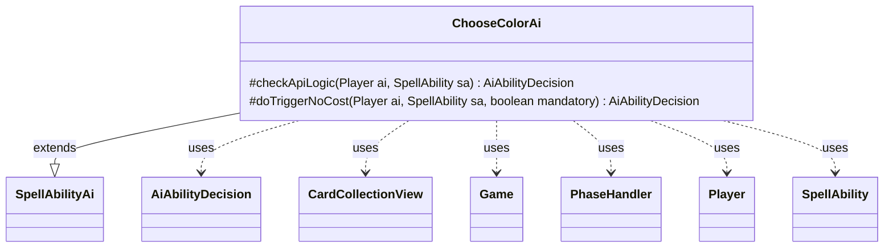

---
aliases:
  - ChooseColorAi
tags:
  - java/class
  - module/forge-ai
  - pkg/forge/ai/ability
fqn: forge.ai.ability.ChooseColorAi
package: forge.ai.ability
module: forge-ai
kind: Class
---

# ChooseColorAi

**Package:** `forge.ai.ability` &nbsp; **Module:** `forge-ai` &nbsp; **Kind:** Class



## Relationships
**Extends:**
- [[forge.ai.SpellAbilityAi|SpellAbilityAi]]
**Uses:**
- [[forge.ai.AiAbilityDecision|AiAbilityDecision]]
- [[forge.game.Game|Game]]
- [[forge.game.card.CardCollectionView|CardCollectionView]]
- [[forge.game.phase.PhaseHandler|PhaseHandler]]
- [[forge.game.player.Player|Player]]
- [[forge.game.spellability.SpellAbility|SpellAbility]]

## Design Description

ChooseColorAi supplies the AI engine's decision logic for spell abilities that ask a player to choose a color. As a concrete subclass of `SpellAbilityAi`, it overrides `checkApiLogic` to judge whether the computer should activate such an ability and `doTriggerNoCost` to resolve mandatory or triggered cases, returning an `AiAbilityDecision` that pairs a confidence score with an `AiPlayDecision` outcome.

Its design centers on dispatching by named `AILogic` parameter and by source-card name, hardcoding bespoke heuristics for specific cards (Nykthos, Oona, Addle, Astral Cornucopia) and general strategies such as `MostExcessOpponentControls` or `HighestDevotionToColor`. To evaluate these, it collaborates with the `Game` and its `PhaseHandler` for timing gates, inspects `Player` card collections via `CardCollectionView`, and delegates to helper utilities like `ComputerUtilCard` and `SpecialCardAi`. The inline TODOs and per-card branches reveal an incrementally grown, card-specific rules engine rather than a uniform policy.

## Source
`forge-ai/src/main/java/forge/ai/ability/ChooseColorAi.java`

```java
package forge.ai.ability;

import forge.ai.*;
import forge.card.MagicColor;
import forge.game.Game;
import forge.game.card.CardCollectionView;
import forge.game.card.CardLists;
import forge.game.card.CardPredicates;
import forge.game.phase.PhaseHandler;
import forge.game.phase.PhaseType;
import forge.game.player.Player;
import forge.game.spellability.SpellAbility;
import forge.game.zone.ZoneType;

public class ChooseColorAi extends SpellAbilityAi {

    @Override
    protected AiAbilityDecision checkApiLogic(Player ai, SpellAbility sa) {
        final Game game = ai.getGame();
        final String sourceName = ComputerUtilAbility.getAbilitySourceName(sa);
        final PhaseHandler ph = game.getPhaseHandler();

        if (!sa.hasParam("AILogic")) {
            return new AiAbilityDecision(0, AiPlayDecision.MissingLogic);
        }
        final String logic = sa.getParam("AILogic");

        if ("Nykthos, Shrine to Nyx".equals(sourceName)) {
            if (SpecialCardAi.NykthosShrineToNyx.consider(ai, sa)) {
                return new AiAbilityDecision(100, AiPlayDecision.WillPlay);
            }
            return new AiAbilityDecision(0, AiPlayDecision.CantPlayAi);
        }

        if ("Oona, Queen of the Fae".equals(sourceName)) {
            if (ph.isPlayerTurn(ai) || ph.getPhase().isBefore(PhaseType.COMBAT_DECLARE_ATTACKERS)) {
                return new AiAbilityDecision(0, AiPlayDecision.AnotherTime);
            }
            ComputerUtilCost.setMaxXValue(sa, ai, false);
            return new AiAbilityDecision(100, AiPlayDecision.WillPlay);
        }

        if ("Addle".equals(sourceName)) {
            // TODO Why is this not in the AI logic?
            // Why are we specifying the weakest opponent?
            if (!ph.getPhase().isBefore(PhaseType.COMBAT_DECLARE_ATTACKERS) && !ai.getWeakestOpponent().getCardsIn(ZoneType.Hand).isEmpty()) {
                return new AiAbilityDecision(100, AiPlayDecision.WillPlay);
            } else {
                return new AiAbilityDecision(0, AiPlayDecision.AnotherTime);
            }
        }

        if (logic.equals("MostExcessOpponentControls")) {
            for (byte color : MagicColor.WUBRG) {
                CardCollectionView ailist = ai.getColoredCardsInPlay(color);
                CardCollectionView opplist = ai.getStrongestOpponent().getColoredCardsInPlay(color);

                int excess = ComputerUtilCard.evaluatePermanentList(opplist) - ComputerUtilCard.evaluatePermanentList(ailist);
                if (excess > 4) {
                    return new AiAbilityDecision(100, AiPlayDecision.WillPlay);
                }
            }
            return new AiAbilityDecision(0, AiPlayDecision.CantPlayAi);
        } else if (logic.equals("MostProminentInComputerDeck")) {
            if ("Astral Cornucopia".equals(sourceName)) {
                // activate in Main 2 hoping that the extra mana surplus will make a difference
                // if there are some nonland permanents in hand
                CardCollectionView permanents = CardLists.filter(ai.getCardsIn(ZoneType.Hand), 
                        CardPredicates.NONLAND_PERMANENTS);

                if (!permanents.isEmpty() && ph.is(PhaseType.MAIN2, ai)) {
                    return new AiAbilityDecision(100, AiPlayDecision.WillPlay);
                } else {
                    return new AiAbilityDecision(0, AiPlayDecision.WaitForMain2);
                }
            }
        } else if (logic.equals("HighestDevotionToColor")) {
            // currently only works more or less reliably in Main2 to cast own spells
            if (!ph.is(PhaseType.MAIN2, ai)) {
                return new AiAbilityDecision(0, AiPlayDecision.WaitForMain2);
            }
        }

        return new AiAbilityDecision(100, AiPlayDecision.WillPlay);
    }

    @Override
    protected AiAbilityDecision doTriggerNoCost(Player ai, SpellAbility sa, boolean mandatory) {
        if (mandatory) {
            return new AiAbilityDecision(100, AiPlayDecision.WillPlay);
        }
        return canPlay(ai, sa);
    }

}
```
