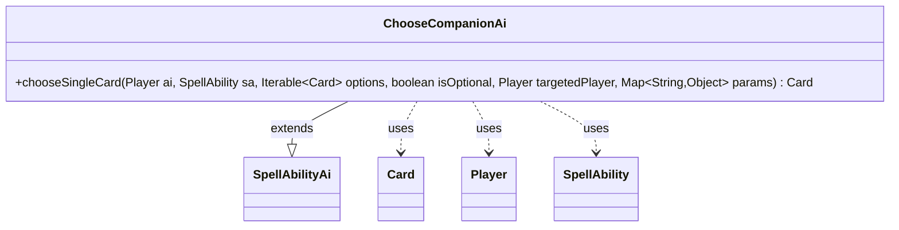

---
aliases:
  - ChooseCompanionAi
tags:
  - java/class
  - module/forge-ai
  - pkg/forge/ai/ability
fqn: forge.ai.ability.ChooseCompanionAi
package: forge.ai.ability
module: forge-ai
kind: Class
---

# ChooseCompanionAi

**Package:** `forge.ai.ability` &nbsp; **Module:** `forge-ai` &nbsp; **Kind:** Class



## Relationships
**Extends:**
- [[forge.ai.SpellAbilityAi|SpellAbilityAi]]
**Uses:**
- [[forge.game.card.Card|Card]]
- [[forge.game.player.Player|Player]]
- [[forge.game.spellability.SpellAbility|SpellAbility]]

## Design Description

ChooseCompanionAi is the forge-ai decision handler for selecting a companion card, plugging into Forge's AI ability framework by extending `SpellAbilityAi` and overriding its `chooseSingleCard` hook. When the engine asks the AI to pick a single card from a set of companion options, this class supplies that choice on behalf of a `Player`, working with the `SpellAbility` being resolved and the candidate `Card` objects.

Its design intent is deliberately minimal: it materializes the `Iterable<Card>` options into a list, returns `null` when none are available, and otherwise shuffles and returns the first element — effectively a random pick. This placeholder strategy satisfies the contract without encoding any real evaluation of companion deck-building restrictions, leaving room for smarter selection logic later while keeping the AI functional.

## Source
`forge-ai/src/main/java/forge/ai/ability/ChooseCompanionAi.java`

```java
package forge.ai.ability;

import com.google.common.collect.Lists;
import forge.ai.SpellAbilityAi;
import forge.game.card.Card;
import forge.game.player.Player;
import forge.game.spellability.SpellAbility;

import java.util.Collections;
import java.util.List;
import java.util.Map;

public class ChooseCompanionAi extends SpellAbilityAi {

    /* (non-Javadoc)
     * @see forge.card.ability.SpellAbilityAi#chooseSingleCard(forge.card.spellability.SpellAbility, java.util.List, boolean)
     */
    @Override
    public Card chooseSingleCard(final Player ai, final SpellAbility sa, Iterable<Card> options, boolean isOptional, Player targetedPlayer, Map<String, Object> params) {
        List<Card> cards = Lists.newArrayList(options);
        if (cards.isEmpty()) {
            return null;
        }

        Collections.shuffle(cards);
        return cards.get(0);
    }
}
```
