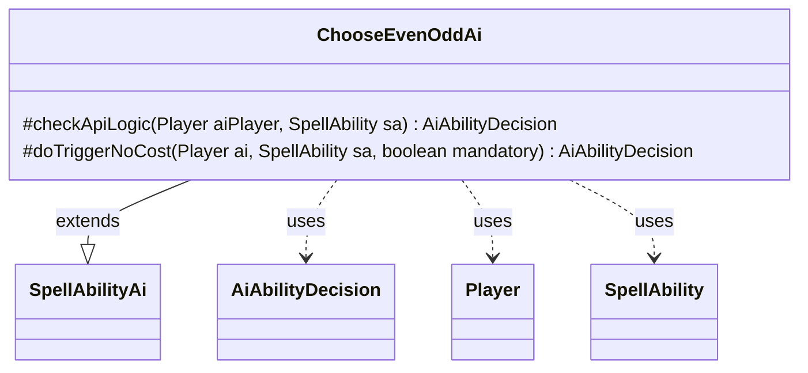

---
aliases:
  - ChooseEvenOddAi
tags:
  - java/class
  - module/forge-ai
  - pkg/forge/ai/ability
fqn: forge.ai.ability.ChooseEvenOddAi
package: forge.ai.ability
module: forge-ai
kind: Class
---

# ChooseEvenOddAi

**Package:** `forge.ai.ability`   **Module:** `forge-ai`   **Kind:** Class



## Relationships
**Extends:**
- [[forge.ai.SpellAbilityAi|SpellAbilityAi]]
**Uses:**
- [[forge.ai.AiAbilityDecision|AiAbilityDecision]]
- [[forge.game.player.Player|Player]]
- [[forge.game.spellability.SpellAbility|SpellAbility]]

## Design Description

Forge's AI handler for the Choose-Even-Odd ability, `ChooseEvenOddAi` extends `SpellAbilityAi` to decide whether and how the computer player should activate an effect that names "even" or "odd." Overriding `checkApiLogic`, it refuses the ability when no `AILogic` parameter is configured, and—when the ability targets—resets and aims it at the AI's preferred opponent (via `AiAttackController`), returning an `AiAbilityDecision` weighted to play or signalling targeting failure. Its `doTriggerNoCost` override always plays mandatory triggers and otherwise defers to the inherited `canPlay`.

The design keeps the class a thin, stateless decision strategy: it delegates opponent selection and base playability to collaborators, encoding only the data-driven guard and targeting rules specific to this ability while communicating outcomes through the shared `AiAbilityDecision`/`AiPlayDecision` vocabulary.

## Source
`forge-ai/src/main/java/forge/ai/ability/ChooseEvenOddAi.java`

```java
package forge.ai.ability;

import forge.ai.AiAbilityDecision;
import forge.ai.AiAttackController;
import forge.ai.AiPlayDecision;
import forge.ai.SpellAbilityAi;
import forge.game.player.Player;
import forge.game.spellability.SpellAbility;

public class ChooseEvenOddAi extends SpellAbilityAi {

    @Override
    protected AiAbilityDecision checkApiLogic(Player aiPlayer, SpellAbility sa) {
        if (!sa.hasParam("AILogic")) {
            return new AiAbilityDecision(0, AiPlayDecision.MissingLogic);
        }
        if (sa.usesTargeting()) {
            sa.resetTargets();
            Player opp = AiAttackController.choosePreferredDefenderPlayer(aiPlayer);
            if (sa.canTarget(opp)) {
                sa.getTargets().add(opp);
            } else {
                return new AiAbilityDecision(0, AiPlayDecision.TargetingFailed);
            }
        }
        return new AiAbilityDecision(100, AiPlayDecision.WillPlay);
    }

    @Override
    protected AiAbilityDecision doTriggerNoCost(Player ai, SpellAbility sa, boolean mandatory) {
        if (mandatory) {
            return new AiAbilityDecision(100, AiPlayDecision.WillPlay);
        }
        return canPlay(ai, sa);
    }
}
```

## Python
`forge/ai/ability/ChooseEvenOddAi.py`

```python
from forge.ai.AiAbilityDecision import AiAbilityDecision
from forge.ai.AiAttackController import AiAttackController
from forge.ai.AiPlayDecision import AiPlayDecision
from forge.ai.SpellAbilityAi import SpellAbilityAi
from forge.game.player.Player import Player
from forge.game.spellability.SpellAbility import SpellAbility


class ChooseEvenOddAi(SpellAbilityAi):

    def checkApiLogic(self, aiPlayer: Player, sa: SpellAbility) -> AiAbilityDecision:
        if not sa.hasParam("AILogic"):
            return AiAbilityDecision(0, AiPlayDecision.MissingLogic)
        if sa.usesTargeting():
            sa.resetTargets()
            opp = AiAttackController.choosePreferredDefenderPlayer(aiPlayer)
            if sa.canTarget(opp):
                sa.getTargets().add(opp)
            else:
                return AiAbilityDecision(0, AiPlayDecision.TargetingFailed)
        return AiAbilityDecision(100, AiPlayDecision.WillPlay)

    def doTriggerNoCost(self, ai: Player, sa: SpellAbility, mandatory: bool) -> AiAbilityDecision:
        if mandatory:
            return AiAbilityDecision(100, AiPlayDecision.WillPlay)
        return self.canPlay(ai, sa)
```
