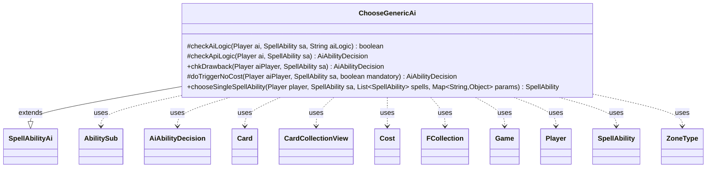

---
aliases:
  - ChooseGenericAi
tags:
  - java/class
  - module/forge-ai
  - pkg/forge/ai/ability
fqn: forge.ai.ability.ChooseGenericAi
package: forge.ai.ability
module: forge-ai
kind: Class
---

# ChooseGenericAi

**Package:** `forge.ai.ability`   **Module:** `forge-ai`   **Kind:** Class



## Relationships
**Extends:**
- [[forge.ai.SpellAbilityAi|SpellAbilityAi]]
**Uses:**
- [[forge.ai.AiAbilityDecision|AiAbilityDecision]]
- [[forge.game.Game|Game]]
- [[forge.game.card.Card|Card]]
- [[forge.game.card.CardCollectionView|CardCollectionView]]
- [[forge.game.cost.Cost|Cost]]
- [[forge.game.player.Player|Player]]
- [[forge.game.spellability.AbilitySub|AbilitySub]]
- [[forge.game.spellability.SpellAbility|SpellAbility]]
- [[forge.game.zone.ZoneType|ZoneType]]
- [[forge.util.collect.FCollection|FCollection]]

## Design Description

ChooseGenericAi is the AI decision handler for the generic "Choose" spell ability, extending `SpellAbilityAi` to plug into Forge's AI dispatch framework. Its core responsibility is deciding whether the computer should activate a Choose ability and, when it does, selecting which of the candidate `SpellAbility` options to take. It overrides the standard hooks—`checkAiLogic`, `checkApiLogic`, `doTriggerNoCost`, and `chkDrawback`—to gate playability, and implements `chooseSingleSpellAbility` to pick among the offered modes.

The dominant design intent is a large `AILogic`-keyed dispatch: rather than per-card AI subclasses, a single class branches on a string parameter (e.g. "Random", "Phasing", "SinProdder", "CombustibleGearhulk") to encode card-specific heuristics, falling back to the first choice when no logic matches. It collaborates with `Player`, `Card`, `Game`, `Cost`, and zone/collection types to evaluate board state, life totals, and reveal outcomes, delegating cost and sub-ability checks to helper converters like `SpellApiToAi`.

## Source
`forge-ai/src/main/java/forge/ai/ability/ChooseGenericAi.java`

```java
package forge.ai.ability;

import com.google.common.collect.Lists;
import forge.ai.*;
import forge.card.MagicColor;
import forge.game.Game;
import forge.game.card.Card;
import forge.game.card.CardCollectionView;
import forge.game.cost.Cost;
import forge.game.phase.PhaseType;
import forge.game.player.Player;
import forge.game.spellability.AbilitySub;
import forge.game.spellability.SpellAbility;
import forge.game.zone.ZoneType;
import forge.util.Aggregates;
import forge.util.collect.FCollection;

import java.util.List;
import java.util.Map;
import java.util.stream.Collectors;

public class ChooseGenericAi extends SpellAbilityAi {

    @Override
    protected boolean checkAiLogic(final Player ai, final SpellAbility sa, final String aiLogic) {
        if ("Khans".equals(aiLogic) || "Dragons".equals(aiLogic)) {
            return true;
        } else if ("Pump".equals(aiLogic) || "BestOption".equals(aiLogic)) {
            for (AbilitySub sb : sa.getAdditionalAbilityList("Choices")) {
                if (SpellApiToAi.Converter.get(sb).canPlayWithSubs(ai, sb).willingToPlay()) {
                    return true;
                }
            }
        } else if ("Always".equals(aiLogic)) {
            return true;
        }
        return false;
    }

    @Override
    protected AiAbilityDecision checkApiLogic(final Player ai, final SpellAbility sa) {
        if (sa.hasParam("AILogic")) {
            // This is equivalent to what was here before but feels bad
            return new AiAbilityDecision(100, AiPlayDecision.WillPlay);
        }

        return new AiAbilityDecision(0, AiPlayDecision.CantPlayAi);
    }

    /* (non-Javadoc)
     * @see forge.card.abilityfactory.SpellAiLogic#chkAIDrawback(java.util.Map, forge.card.spellability.SpellAbility, forge.game.player.Player)
     */
    @Override
    public AiAbilityDecision chkDrawback(Player aiPlayer, SpellAbility sa) {
        AiAbilityDecision decision;
        if (sa.isTrigger()) {
            decision = doTriggerNoCost(aiPlayer, sa, sa.isMandatory());
        } else {
            decision = checkApiLogic(aiPlayer, sa);
        }

        return decision;
    }

    @Override
    protected AiAbilityDecision doTriggerNoCost(final Player aiPlayer, final SpellAbility sa, final boolean mandatory) {
        if ("CombustibleGearhulk".equals(sa.getParam("AILogic")) || "SoulEcho".equals(sa.getParam("AILogic"))) {
            for (final Player p : aiPlayer.getOpponents()) {
                if (p.canBeTargetedBy(sa)) {
                    sa.resetTargets();
                    sa.getTargets().add(p);
                    return new AiAbilityDecision(100, AiPlayDecision.WillPlay);
                }
            }
            return new AiAbilityDecision(100, AiPlayDecision.WillPlay); // perhaps the opponent(s) had Sigarda, Heron's Grace or another effect giving hexproof in play, still play the creature as 6/6
        }
        if (ComputerUtilAbility.getAbilitySourceName(sa).equals("Deathmist Raptor")) {
            return new AiAbilityDecision(100, AiPlayDecision.WillPlay);
        }
        return super.doTriggerNoCost(aiPlayer, sa, mandatory);
    }

    @Override
    public SpellAbility chooseSingleSpellAbility(Player player, SpellAbility sa, List<SpellAbility> spells, Map<String, Object> params) {
        Card host = sa.getHostCard();
        final Game game = host.getGame();
        final String logic = sa.getParam("AILogic");
        if (logic == null) {
            return spells.get(0);
        } else if ("Random".equals(logic)) {
            return Aggregates.random(spells);
        } else if ("Phasing".equals(logic)) { // Teferi's Realm : keep aggressive
            List<SpellAbility> filtered = spells.stream()
                    .filter(sp -> !sp.getDescription().contains("Creature") && !sp.getDescription().contains("Land"))
                    .collect(Collectors.toList());
            return Aggregates.random(filtered);
        } else if ("PayUnlessCost".equals(logic)) {
            for (final SpellAbility sp : spells) {
                String unlessCost = sp.getParam("UnlessCost");
                sp.setActivatingPlayer(sa.getActivatingPlayer());
                Cost unless = new Cost(unlessCost, false);
                if (SpellApiToAi.Converter.get(sp).willPayUnlessCost(player, sp, unless, false, new FCollection<>(player))
                        && ComputerUtilCost.canPayCost(unless, sp, player, true)) {
                    return sp;
                }
            }
            return spells.get(0);
        } else if ("Khans".equals(logic) || "Dragons".equals(logic)) { // Fate Reforged sieges
            for (final SpellAbility sp : spells) {
                if (sp.getDescription().equals(logic)) {
                    return sp;
                }
            }
        } else if ("SelfOthers".equals(logic)) {
            SpellAbility self = null, others = null;
            for (final SpellAbility sp : spells) {
                if (sp.getDescription().equals("Self")) {
                    self = sp;
                } else {
                    others = sp;
                }
            }
            String hostname = host.getName();
            if (hostname.equals("May Civilization Collapse")) {
                if (player.getLandsInPlay().isEmpty()) {
                    return self;
                }
            } else if (hostname.equals("Feed the Machine")) {
                if (player.getCreaturesInPlay().isEmpty()) {
                    return self;
                }
            } else if (hostname.equals("Surrender Your Thoughts")) {
                if (player.getCardsIn(ZoneType.Hand).isEmpty()) {
                    return self;
                }
            } else if (hostname.equals("The Fate of the Flammable")) {
                if (!player.canLoseLife()) {
                    return self;
                }
            }
            return others;
        } else if ("Counters".equals(logic)) {
            // TODO: this code will need generalization if this logic is used for cards other
            // than Elspeth Conquers Death with different choice parameters
            SpellAbility p1p1 = null, loyalty = null;
            for (final SpellAbility sp : spells) {
                if (("P1P1").equals(sp.getParam("CounterType"))) {
                    p1p1 = sp;
                } else {
                    loyalty = sp;
                }
            }
            if (sa.getParent().getTargetCard() != null && sa.getParent().getTargetCard().isPlaneswalker()) {
                return loyalty;
            } else {
                return p1p1;
            }
        } else if ("Fatespinner".equals(logic)) {
            SpellAbility skipDraw = null, /*skipMain = null,*/ skipCombat = null;
            for (final SpellAbility sp : spells) {
                if (sp.getDescription().equals("FatespinnerSkipDraw")) {
                    skipDraw = sp;
                } else if (sp.getDescription().equals("FatespinnerSkipMain")) {
                    //skipMain = sp;
                } else {
                    skipCombat = sp;
                }
            }
            // FatespinnerSkipDraw,FatespinnerSkipMain,FatespinnerSkipCombat
            if (game.getReplacementHandler().wouldPhaseBeSkipped(player, PhaseType.DRAW)) {
                return skipDraw;
            }
            if (game.getReplacementHandler().wouldPhaseBeSkipped(player, PhaseType.COMBAT_BEGIN)) {
                return skipCombat;
            }

            // TODO If combat is poor, Skip Combat
            // Todo if hand is empty or mostly empty, skip main phase
            // Todo if hand has gas, skip draw
            return Aggregates.random(spells);
        } else if ("SinProdder".equals(logic)) {
            SpellAbility allow = null, deny = null;
            for (final SpellAbility sp : spells) {
                if (sp.getDescription().equals("No")) {
                    allow = sp;
                } else {
                    deny = sp;
                }
            }

            Card imprinted = host.getImprintedCards().getFirst();
            int dmg = imprinted.getCMC();
            Player owner = imprinted.getOwner();

            //useless cards in hand
            if (imprinted.getName().equals("Bridge from Below") ||
                    imprinted.getName().equals("Haakon, Stromgald Scourge")) {
                return allow;
            }

            //bad cards when are thrown from the library to the graveyard, but Yixlid can prevent that
            if (!player.getGame().isCardInPlay("Yixlid Jailer") && (
                    imprinted.getName().equals("Gaea's Blessing") ||
                    imprinted.getName().equals("Narcomoeba"))) {
                return allow;
            }

            // milling against Tamiyo is pointless
            if (owner.isCardInCommand("Emblem — Tamiyo, the Moon Sage")) {
                return allow;
            }

            // milling a land against Gitrog result in card draw
            if (imprinted.isLand() && owner.isCardInPlay("The Gitrog Monster")) {
                // try to mill owner
                if (owner.getCardsIn(ZoneType.Library).size() < 5) {
                    return deny;
                }
                return allow;
            }

            // milling a creature against Sidisi result in more creatures
            if (imprinted.isCreature() && owner.isCardInPlay("Sidisi, Brood Tyrant")) {
                return allow;
            }

            //if Iona does prevent from casting, allow it to draw
            for (final Card io : player.getCardsIn(ZoneType.Battlefield, "Iona, Shield of Emeria")) {
                if (imprinted.getColor().hasAnyColor(MagicColor.fromName(io.getChosenColor()))) {
                    return allow;
                }
            }

            if (dmg == 0) {
                // If CMC = 0, mill it!
                return deny;
            } else if (dmg + 3 > player.getLife()) {
                // if low on life, do nothing.
                return allow;
            } else if (player.getLife() - dmg > 15) {
                // TODO Check "danger" level of card
                // If lots of life, and card might be dangerous? Mill it!
                return deny;
            }
            // if unsure, random?
            return Aggregates.random(spells);
        } else if ("CombustibleGearhulk".equals(logic)) {
            Player controller = sa.getActivatingPlayer();
            List<ZoneType> zones = ZoneType.listValueOf("Graveyard, Battlefield, Exile");
            int life = player.getLife();
            CardCollectionView revealedCards = controller.getCardsIn(zones);

            if (revealedCards.size() < 5) {
                // Not very many revealed cards, just guess based on lifetotal
                return life < 7 ? spells.get(0) : spells.get(1);
            }

            int totalCMC = 0;
            for (Card c : revealedCards) {
                totalCMC += c.getCMC();
            }

            int bestGuessDamage = totalCMC * 3 / revealedCards.size();
            return life <= bestGuessDamage ? spells.get(0) : spells.get(1);
        }  else if ("SoulEcho".equals(logic)) {
            return sa.getHostCard().getController().getLife() < 10 ? spells.get(0) : Aggregates.random(spells);
        } else if ("Pump".equals(logic) || "BestOption".equals(logic)) {
            List<SpellAbility> filtered = Lists.newArrayList();
            // filter first for the spells which can be done
            for (SpellAbility sp : spells) {
                if (SpellApiToAi.Converter.get(sp).canPlayWithSubs(player, sp).willingToPlay()) {
                    filtered.add(sp);
                }
            }

            // TODO find better way to check
            if (!filtered.isEmpty()) {
                return filtered.get(0);
            }
        } else if ("FoodOrTreasure".equals(logic)) {
            // Tireless Provisioner
            // TODO: implement a better way to check for possible benefits in each case. If made generic, replace
            // fixed spells.get(N) with a way to detect which SA creates which token
            return ComputerUtil.aiLifeInDanger(player, false, 0) ? spells.get(0) : spells.get(1);
        }
        return spells.get(0);   // return first choice if no logic found
    }
}
```

## Python
`forge/ai/ability/ChooseGenericAi.py`

```python
from forge.ai.SpellAbilityAi import SpellAbilityAi
from forge.ai.AiAbilityDecision import AiAbilityDecision
from forge.ai.AiPlayDecision import AiPlayDecision
from forge.ai.SpellApiToAi import SpellApiToAi
from forge.ai.ComputerUtilAbility import ComputerUtilAbility
from forge.ai.ComputerUtilCost import ComputerUtilCost
from forge.ai.ComputerUtil import ComputerUtil
from forge.card.MagicColor import MagicColor
from forge.game.Game import Game
from forge.game.card.Card import Card
from forge.game.card.CardCollectionView import CardCollectionView
from forge.game.cost.Cost import Cost
from forge.game.phase.PhaseType import PhaseType
from forge.game.player.Player import Player
from forge.game.spellability.AbilitySub import AbilitySub
from forge.game.spellability.SpellAbility import SpellAbility
from forge.game.zone.ZoneType import ZoneType
from forge.util.Aggregates import Aggregates
from forge.util.collect.FCollection import FCollection

from typing import List, Map


class ChooseGenericAi(SpellAbilityAi):

    def checkAiLogic(self, ai: Player, sa: SpellAbility, aiLogic: str) -> bool:
        if "Khans" == aiLogic or "Dragons" == aiLogic:
            return True
        elif "Pump" == aiLogic or "BestOption" == aiLogic:
            for sb in sa.getAdditionalAbilityList("Choices"):
                if SpellApiToAi.Converter.get(sb).canPlayWithSubs(ai, sb).willingToPlay():
                    return True
        elif "Always" == aiLogic:
            return True
        return False

    def checkApiLogic(self, ai: Player, sa: SpellAbility) -> AiAbilityDecision:
        if sa.hasParam("AILogic"):
            # This is equivalent to what was here before but feels bad
            return AiAbilityDecision(100, AiPlayDecision.WillPlay)

        return AiAbilityDecision(0, AiPlayDecision.CantPlayAi)

    # (non-Javadoc)
    # @see forge.card.abilityfactory.SpellAiLogic#chkAIDrawback(java.util.Map, forge.card.spellability.SpellAbility, forge.game.player.Player)
    def chkDrawback(self, aiPlayer: Player, sa: SpellAbility) -> AiAbilityDecision:
        if sa.isTrigger():
            decision = self.doTriggerNoCost(aiPlayer, sa, sa.isMandatory())
        else:
            decision = self.checkApiLogic(aiPlayer, sa)

        return decision

    def doTriggerNoCost(self, aiPlayer: Player, sa: SpellAbility, mandatory: bool) -> AiAbilityDecision:
        if "CombustibleGearhulk" == sa.getParam("AILogic") or "SoulEcho" == sa.getParam("AILogic"):
            for p in aiPlayer.getOpponents():
                if p.canBeTargetedBy(sa):
                    sa.resetTargets()
                    sa.getTargets().add(p)
                    return AiAbilityDecision(100, AiPlayDecision.WillPlay)
            return AiAbilityDecision(100, AiPlayDecision.WillPlay)  # perhaps the opponent(s) had Sigarda, Heron's Grace or another effect giving hexproof in play, still play the creature as 6/6
        if ComputerUtilAbility.getAbilitySourceName(sa) == "Deathmist Raptor":
            return AiAbilityDecision(100, AiPlayDecision.WillPlay)
        return super().doTriggerNoCost(aiPlayer, sa, mandatory)

    def chooseSingleSpellAbility(self, player: Player, sa: SpellAbility, spells: List[SpellAbility], params: Map[str, object]) -> SpellAbility:
        host = sa.getHostCard()
        game = host.getGame()
        logic = sa.getParam("AILogic")
        if logic is None:
            return spells[0]
        elif "Random" == logic:
            return Aggregates.random(spells)
        elif "Phasing" == logic:  # Teferi's Realm : keep aggressive
            filtered = [sp for sp in spells
                        if "Creature" not in sp.getDescription() and "Land" not in sp.getDescription()]
            return Aggregates.random(filtered)
        elif "PayUnlessCost" == logic:
            for sp in spells:
                unlessCost = sp.getParam("UnlessCost")
                sp.setActivatingPlayer(sa.getActivatingPlayer())
                unless = Cost(unlessCost, False)
                if SpellApiToAi.Converter.get(sp).willPayUnlessCost(player, sp, unless, False, FCollection(player)) \
                        and ComputerUtilCost.canPayCost(unless, sp, player, True):
                    return sp
            return spells[0]
        elif "Khans" == logic or "Dragons" == logic:  # Fate Reforged sieges
            for sp in spells:
                if sp.getDescription() == logic:
                    return sp
        elif "SelfOthers" == logic:
            self_sa = None
            others = None
            for sp in spells:
                if sp.getDescription() == "Self":
                    self_sa = sp
                else:
                    others = sp
            hostname = host.getName()
            if hostname == "May Civilization Collapse":
                if player.getLandsInPlay().isEmpty():
                    return self_sa
            elif hostname == "Feed the Machine":
                if player.getCreaturesInPlay().isEmpty():
                    return self_sa
            elif hostname == "Surrender Your Thoughts":
                if player.getCardsIn(ZoneType.Hand).isEmpty():
                    return self_sa
            elif hostname == "The Fate of the Flammable":
                if not player.canLoseLife():
                    return self_sa
            return others
        elif "Counters" == logic:
            # TODO: this code will need generalization if this logic is used for cards other
            # than Elspeth Conquers Death with different choice parameters
            p1p1 = None
            loyalty = None
            for sp in spells:
                if "P1P1" == sp.getParam("CounterType"):
                    p1p1 = sp
                else:
                    loyalty = sp
            if sa.getParent().getTargetCard() is not None and sa.getParent().getTargetCard().isPlaneswalker():
                return loyalty
            else:
                return p1p1
        elif "Fatespinner" == logic:
            skipDraw = None
            # skipMain = None
            skipCombat = None
            for sp in spells:
                if sp.getDescription() == "FatespinnerSkipDraw":
                    skipDraw = sp
                elif sp.getDescription() == "FatespinnerSkipMain":
                    pass  # skipMain = sp
                else:
                    skipCombat = sp
            # FatespinnerSkipDraw,FatespinnerSkipMain,FatespinnerSkipCombat
            if game.getReplacementHandler().wouldPhaseBeSkipped(player, PhaseType.DRAW):
                return skipDraw
            if game.getReplacementHandler().wouldPhaseBeSkipped(player, PhaseType.COMBAT_BEGIN):
                return skipCombat

            # TODO If combat is poor, Skip Combat
            # Todo if hand is empty or mostly empty, skip main phase
            # Todo if hand has gas, skip draw
            return Aggregates.random(spells)
        elif "SinProdder" == logic:
            allow = None
            deny = None
            for sp in spells:
                if sp.getDescription() == "No":
                    allow = sp
                else:
                    deny = sp

            imprinted = host.getImprintedCards().getFirst()
            dmg = imprinted.getCMC()
            owner = imprinted.getOwner()

            # useless cards in hand
            if imprinted.getName() == "Bridge from Below" or \
                    imprinted.getName() == "Haakon, Stromgald Scourge":
                return allow

            # bad cards when are thrown from the library to the graveyard, but Yixlid can prevent that
            if not player.getGame().isCardInPlay("Yixlid Jailer") and (
                    imprinted.getName() == "Gaea's Blessing" or
                    imprinted.getName() == "Narcomoeba"):
                return allow

            # milling against Tamiyo is pointless
            if owner.isCardInCommand("Emblem ΓÇö Tamiyo, the Moon Sage"):
                return allow

            # milling a land against Gitrog result in card draw
            if imprinted.isLand() and owner.isCardInPlay("The Gitrog Monster"):
                # try to mill owner
                if owner.getCardsIn(ZoneType.Library).size() < 5:
                    return deny
                return allow

            # milling a creature against Sidisi result in more creatures
            if imprinted.isCreature() and owner.isCardInPlay("Sidisi, Brood Tyrant"):
                return allow

            # if Iona does prevent from casting, allow it to draw
            for io in player.getCardsIn(ZoneType.Battlefield, "Iona, Shield of Emeria"):
                if imprinted.getColor().hasAnyColor(MagicColor.fromName(io.getChosenColor())):
                    return allow

            if dmg == 0:
                # If CMC = 0, mill it!
                return deny
            elif dmg + 3 > player.getLife():
                # if low on life, do nothing.
                return allow
            elif player.getLife() - dmg > 15:
                # TODO Check "danger" level of card
                # If lots of life, and card might be dangerous? Mill it!
                return deny
            # if unsure, random?
            return Aggregates.random(spells)
        elif "CombustibleGearhulk" == logic:
            controller = sa.getActivatingPlayer()
            zones = ZoneType.listValueOf("Graveyard, Battlefield, Exile")
            life = player.getLife()
            revealedCards = controller.getCardsIn(zones)

            if revealedCards.size() < 5:
                # Not very many revealed cards, just guess based on lifetotal
                return spells[0] if life < 7 else spells[1]

            totalCMC = 0
            for c in revealedCards:
                totalCMC += c.getCMC()

            bestGuessDamage = totalCMC * 3 // revealedCards.size()
            return spells[0] if life <= bestGuessDamage else spells[1]
        elif "SoulEcho" == logic:
            return spells[0] if sa.getHostCard().getController().getLife() < 10 else Aggregates.random(spells)
        elif "Pump" == logic or "BestOption" == logic:
            filtered = []
            # filter first for the spells which can be done
            for sp in spells:
                if SpellApiToAi.Converter.get(sp).canPlayWithSubs(player, sp).willingToPlay():
                    filtered.append(sp)

            # TODO find better way to check
            if filtered:
                return filtered[0]
        elif "FoodOrTreasure" == logic:
            # Tireless Provisioner
            # TODO: implement a better way to check for possible benefits in each case. If made generic, replace
            # fixed spells.get(N) with a way to detect which SA creates which token
            return spells[0] if ComputerUtil.aiLifeInDanger(player, False, 0) else spells[1]
        return spells[0]  # return first choice if no logic found
```
