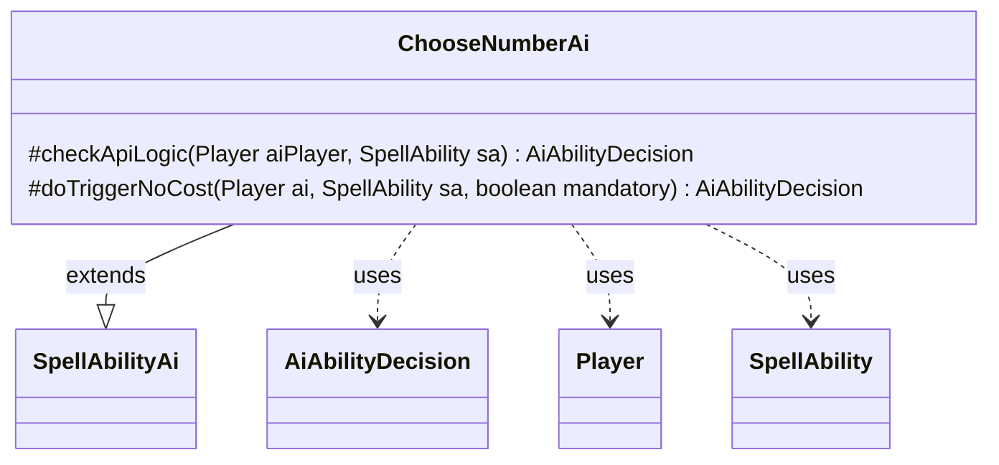

---
aliases:
  - ChooseNumberAi
tags:
  - java/class
  - module/forge-ai
  - pkg/forge/ai/ability
fqn: forge.ai.ability.ChooseNumberAi
package: forge.ai.ability
module: forge-ai
kind: Class
---

# ChooseNumberAi

**Package:** `forge.ai.ability`   **Module:** `forge-ai`   **Kind:** Class



## Relationships
**Extends:**
- [[forge.ai.SpellAbilityAi|SpellAbilityAi]]
**Uses:**
- [[forge.ai.AiAbilityDecision|AiAbilityDecision]]
- [[forge.game.player.Player|Player]]
- [[forge.game.spellability.SpellAbility|SpellAbility]]

## Design Description

ChooseNumberAi supplies the AI decision logic for "ChooseNumber" spell abilities, determining whether and how the computer player should activate effects that ask a player to pick a number. As a concrete subclass of `SpellAbilityAi`, it overrides `checkApiLogic` to evaluate playability and `doTriggerNoCost` to handle triggered activations, returning `AiAbilityDecision` objects that pair a confidence score with an `AiPlayDecision` enum. It collaborates with `Player` and `SpellAbility` to inspect game state, dispatching on the ability's `AILogic` parameter.

The class's notable design intent is its special-casing of the "SweepCreatures" logic: it weighs the AI's creature count and board evaluation against the strongest opponent's, declining when the AI is unpressured and ahead, and committing only when the board math favors a sweep. Absent recognized logic it reports `MissingLogic`, and when targeting is required it picks a preferred defender—reflecting a conservative, situational approach to a generic numeric-choice effect.

## Source
`forge-ai/src/main/java/forge/ai/ability/ChooseNumberAi.java`

```java
package forge.ai.ability;

import forge.ai.*;
import forge.game.ability.AbilityUtils;
import forge.game.player.Player;
import forge.game.spellability.SpellAbility;

public class ChooseNumberAi extends SpellAbilityAi {

    @Override
    protected AiAbilityDecision checkApiLogic(Player aiPlayer, SpellAbility sa) {
        String aiLogic = sa.getParamOrDefault("AILogic", "");

        if (aiLogic.isEmpty()) {
            return new AiAbilityDecision(0, AiPlayDecision.MissingLogic);
        } else if (aiLogic.equals("SweepCreatures")) {
            int maxChoiceLimit = AbilityUtils.calculateAmount(sa.getHostCard(), sa.getParam("Max"), sa);
            int ownCreatureCount = aiPlayer.getCreaturesInPlay().size();
            int oppMaxCreatureCount = 0;
            Player refOpp = null;
            for (Player opp : aiPlayer.getOpponents()) {
                int oppCreatureCount = Math.max(oppMaxCreatureCount, opp.getCreaturesInPlay().size());
                if (oppCreatureCount > oppMaxCreatureCount) {
                    oppMaxCreatureCount = oppCreatureCount;
                    refOpp = opp;
                }
            }

            if (refOpp == null) {
                return new AiAbilityDecision(0, AiPlayDecision.CantPlayAi);
            }

            int evalAI = ComputerUtilCard.evaluateCreatureList(aiPlayer.getCreaturesInPlay());
            int evalOpp = ComputerUtilCard.evaluateCreatureList(refOpp.getCreaturesInPlay());

            if (aiPlayer.getLifeLostLastTurn() + aiPlayer.getLifeLostThisTurn() == 0 && evalAI > evalOpp) {
                // we're not pressured and our stuff seems better, don't do it yet
                return new AiAbilityDecision(0, AiPlayDecision.AnotherTime);
            }

            if (ownCreatureCount > oppMaxCreatureCount + 2 || ownCreatureCount < Math.min(oppMaxCreatureCount, maxChoiceLimit)) {
                // we have more creatures than the opponent, or we have less than the opponent but more than the max choice limit
                return new AiAbilityDecision(100, AiPlayDecision.WillPlay);
            } else {
                // we have less creatures than the opponent and less than the max choice limit
                return new AiAbilityDecision(0, AiPlayDecision.CantPlayAi);
            }
        }

        if (sa.usesTargeting()) {
            sa.resetTargets();
            Player opp = AiAttackController.choosePreferredDefenderPlayer(aiPlayer);
            if (sa.canTarget(opp)) {
                sa.getTargets().add(opp);
            } else {
                return new AiAbilityDecision(0, AiPlayDecision.CantPlayAi);
            }
        }
        return new AiAbilityDecision(100, AiPlayDecision.WillPlay);
    }

    @Override
    protected AiAbilityDecision doTriggerNoCost(Player ai, SpellAbility sa, boolean mandatory) {
        if (mandatory) {
            return new AiAbilityDecision(100, AiPlayDecision.WillPlay);
        }
        return canPlay(ai, sa);
    }
}
```

## Python
`forge/ai/ability/ChooseNumberAi.py`

```python
from forge.ai.SpellAbilityAi import SpellAbilityAi
from forge.ai.AiAbilityDecision import AiAbilityDecision
from forge.ai.AiPlayDecision import AiPlayDecision
from forge.ai.ComputerUtilCard import ComputerUtilCard
from forge.ai.AiAttackController import AiAttackController
from forge.game.ability.AbilityUtils import AbilityUtils
from forge.game.player.Player import Player
from forge.game.spellability.SpellAbility import SpellAbility


class ChooseNumberAi(SpellAbilityAi):

    def checkApiLogic(self, aiPlayer: Player, sa: SpellAbility) -> AiAbilityDecision:
        aiLogic = sa.getParamOrDefault("AILogic", "")

        if aiLogic == "":
            return AiAbilityDecision(0, AiPlayDecision.MissingLogic)
        elif aiLogic == "SweepCreatures":
            maxChoiceLimit = AbilityUtils.calculateAmount(sa.getHostCard(), sa.getParam("Max"), sa)
            ownCreatureCount = len(aiPlayer.getCreaturesInPlay())
            oppMaxCreatureCount = 0
            refOpp = None
            for opp in aiPlayer.getOpponents():
                oppCreatureCount = max(oppMaxCreatureCount, len(opp.getCreaturesInPlay()))
                if oppCreatureCount > oppMaxCreatureCount:
                    oppMaxCreatureCount = oppCreatureCount
                    refOpp = opp

            if refOpp is None:
                return AiAbilityDecision(0, AiPlayDecision.CantPlayAi)

            evalAI = ComputerUtilCard.evaluateCreatureList(aiPlayer.getCreaturesInPlay())
            evalOpp = ComputerUtilCard.evaluateCreatureList(refOpp.getCreaturesInPlay())

            if aiPlayer.getLifeLostLastTurn() + aiPlayer.getLifeLostThisTurn() == 0 and evalAI > evalOpp:
                # we're not pressured and our stuff seems better, don't do it yet
                return AiAbilityDecision(0, AiPlayDecision.AnotherTime)

            if ownCreatureCount > oppMaxCreatureCount + 2 or ownCreatureCount < min(oppMaxCreatureCount, maxChoiceLimit):
                # we have more creatures than the opponent, or we have less than the opponent but more than the max choice limit
                return AiAbilityDecision(100, AiPlayDecision.WillPlay)
            else:
                # we have less creatures than the opponent and less than the max choice limit
                return AiAbilityDecision(0, AiPlayDecision.CantPlayAi)

        if sa.usesTargeting():
            sa.resetTargets()
            opp = AiAttackController.choosePreferredDefenderPlayer(aiPlayer)
            if sa.canTarget(opp):
                sa.getTargets().add(opp)
            else:
                return AiAbilityDecision(0, AiPlayDecision.CantPlayAi)
        return AiAbilityDecision(100, AiPlayDecision.WillPlay)

    def doTriggerNoCost(self, ai: Player, sa: SpellAbility, mandatory: bool) -> AiAbilityDecision:
        if mandatory:
            return AiAbilityDecision(100, AiPlayDecision.WillPlay)
        return self.canPlay(ai, sa)
```
