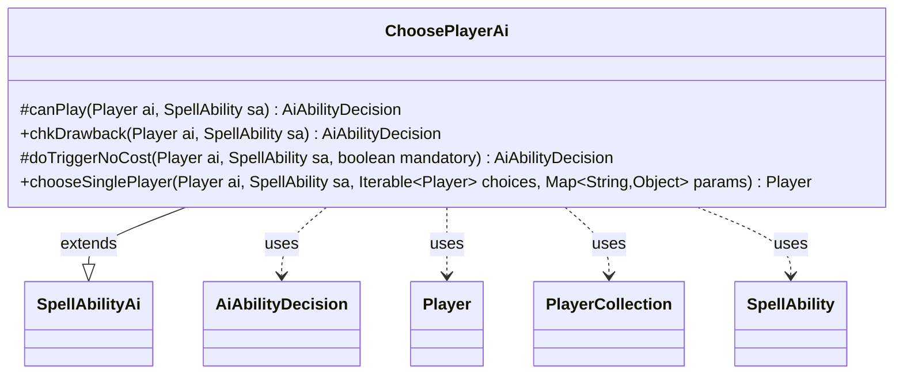

---
aliases:
  - ChoosePlayerAi
tags:
  - java/class
  - module/forge-ai
  - pkg/forge/ai/ability
fqn: forge.ai.ability.ChoosePlayerAi
package: forge.ai.ability
module: forge-ai
kind: Class
---

# ChoosePlayerAi

**Package:** `forge.ai.ability` &nbsp; **Module:** `forge-ai` &nbsp; **Kind:** Class



## Relationships
**Extends:**
- [[forge.ai.SpellAbilityAi|SpellAbilityAi]]
**Uses:**
- [[forge.ai.AiAbilityDecision|AiAbilityDecision]]
- [[forge.game.player.Player|Player]]
- [[forge.game.player.PlayerCollection|PlayerCollection]]
- [[forge.game.spellability.SpellAbility|SpellAbility]]

## Design Description

`ChoosePlayerAi` is the AI decision handler for spell abilities whose effect is to choose a player, extending `SpellAbilityAi` and slotting into Forge's ability-AI dispatch framework. It overrides the standard play-evaluation hooks (`canPlay`, `chkDrawback`, `doTriggerNoCost`) to unconditionally endorse the ability via an `AiAbilityDecision`, reflecting that the choice itself, rather than whether to act, carries the strategic weight.

That weight lives in `chooseSinglePlayer`, which selects a target from the candidate `Player` set according to the ability's `AILogic` parameter—protecting the lowest-life ally, cursing the strongest opponent, pumping itself, or picking by board position, cards in hand, or fewest creatures. It leans on `PlayerCollection` plus `PlayerPredicates`/`AiPlayerPredicates` for filtering and comparison, and degrades gracefully to a sensible default (self or first available) when no logic matches or no good choice exists.

## Source
`forge-ai/src/main/java/forge/ai/ability/ChoosePlayerAi.java`

```java
package forge.ai.ability;

import com.google.common.collect.Iterables;

import forge.ai.AiAbilityDecision;
import forge.ai.AiPlayDecision;
import forge.ai.AiPlayerPredicates;
import forge.ai.SpellAbilityAi;
import forge.game.player.Player;
import forge.game.player.PlayerCollection;
import forge.game.player.PlayerPredicates;
import forge.game.spellability.SpellAbility;
import forge.game.zone.ZoneType;

import java.util.Map;

public class ChoosePlayerAi extends SpellAbilityAi {
    @Override
    protected AiAbilityDecision canPlay(Player ai, SpellAbility sa) {
        return new AiAbilityDecision(100, AiPlayDecision.WillPlay);
    }

    @Override
    public AiAbilityDecision chkDrawback(Player ai, SpellAbility sa) {
        return canPlay(ai, sa);
    }

    @Override
    protected AiAbilityDecision doTriggerNoCost(Player ai, SpellAbility sa, boolean mandatory) {
        return canPlay(ai, sa);
    }

    @Override
    public Player chooseSinglePlayer(Player ai, SpellAbility sa, Iterable<Player> choices, Map<String, Object> params) {
        Player chosen = null;
        if (sa.hasParam("Protect")) {
            chosen = new PlayerCollection(choices).min(PlayerPredicates.compareByLife());
        }
        else if ("Curse".equals(sa.getParam("AILogic"))) {
            PlayerCollection curseChoices = new PlayerCollection(choices).filter(PlayerPredicates.isOpponentOf(ai));
            if (!curseChoices.isEmpty()) {
                chosen = curseChoices.max(AiPlayerPredicates.compareByBoardPosition);
            }
            if (chosen == null) {
                chosen = Iterables.getFirst(choices, null);
                System.out.println("No good curse choices. Picking first available: " + chosen);
            }
        }
        else if ("Pump".equals(sa.getParam("AILogic"))) {
            chosen = Iterables.contains(choices, ai) ? ai : Iterables.getFirst(choices, null);
        }
        else if ("BestAllyBoardPosition".equals(sa.getParam("AILogic"))) {
            PlayerCollection prefChoices = new PlayerCollection(choices);
            prefChoices.removeAll(ai.getOpponents());
            if (!prefChoices.isEmpty()) {
                chosen = prefChoices.max(AiPlayerPredicates.compareByBoardPosition);
            }
            if (chosen == null) {
                chosen = Iterables.getFirst(choices, null);
                System.out.println("No good curse choices. Picking first available: " + chosen);
            }
        } else if ("MostCardsInHand".equals(sa.getParam("AILogic"))) {
            int cardsInHand = 0;
            for (final Player p : choices) {
                int hand = p.getCardsIn(ZoneType.Hand).size();
                if (hand >= cardsInHand) {
                    chosen = p;
                    cardsInHand = hand;
                }
            }
        } else if ("LeastCreatures".equals(sa.getParam("AILogic"))) {
            int creats = 50;
            for (final Player p : choices) {
                int curr = p.getCreaturesInPlay().size();
                if (curr <= creats) {
                    chosen = p;
                    creats = curr;
                }
            }
        } else {
            System.out.println("Default player choice logic.");
            chosen = Iterables.contains(choices, ai) ? ai : Iterables.getFirst(choices, null);
        }
        return chosen;
    }
}
```
