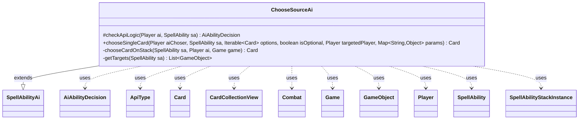

---
aliases:
  - ChooseSourceAi
tags:
  - java/class
  - module/forge-ai
  - pkg/forge/ai/ability
fqn: forge.ai.ability.ChooseSourceAi
package: forge.ai.ability
module: forge-ai
kind: Class
---

# ChooseSourceAi

**Package:** `forge.ai.ability`   **Module:** `forge-ai`   **Kind:** Class



## Relationships
**Extends:**
- [[forge.ai.SpellAbilityAi|SpellAbilityAi]]
**Uses:**
- [[forge.ai.AiAbilityDecision|AiAbilityDecision]]
- [[forge.game.Game|Game]]
- [[forge.game.GameObject|GameObject]]
- [[forge.game.ability.ApiType|ApiType]]
- [[forge.game.card.Card|Card]]
- [[forge.game.card.CardCollectionView|CardCollectionView]]
- [[forge.game.combat.Combat|Combat]]
- [[forge.game.player.Player|Player]]
- [[forge.game.spellability.SpellAbility|SpellAbility]]
- [[forge.game.spellability.SpellAbilityStackInstance|SpellAbilityStackInstance]]

## Design Description

ChooseSourceAi is the forge-ai decision handler for the "ChooseSource" ability, supplying the AI's logic for selecting a damage source — typically a Curtain/Circle-of-Protection-style prevention effect. Extending `SpellAbilityAi`, it overrides `checkApiLogic` to decide whether and how to play the ability (favoring the `NeedsPrevention` AILogic during the declare-blockers step or against a damaging spell on the stack) and `chooseSingleCard` to pick the actual source. Its private helpers `chooseCardOnStack` and `getTargets` inspect the stack and resolve targets, collaborating with `Game`, `Combat`, `SpellAbility`, `SpellAbilityStackInstance`, `Card`, and `ApiType` to identify which `DealDamage`/`DamageAll` effect threatens the AI.

Design intent is candidly transitional: a header TODO notes the logic is copied from `ChooseCard` pending proper AI support, so it prioritizes the unblocked attacker dealing the most damage, then falls back through progressively broader choices to guarantee a non-null selection and avoid hanging the game.

## Source
`forge-ai/src/main/java/forge/ai/ability/ChooseSourceAi.java`

```java
package forge.ai.ability;

import com.google.common.collect.Iterables;
import forge.ai.*;
import forge.game.Game;
import forge.game.GameObject;
import forge.game.ability.AbilityUtils;
import forge.game.ability.ApiType;
import forge.game.card.Card;
import forge.game.card.CardCollectionView;
import forge.game.card.CardLists;
import forge.game.card.CardPredicates;
import forge.game.combat.Combat;
import forge.game.phase.PhaseType;
import forge.game.player.Player;
import forge.game.spellability.SpellAbility;
import forge.game.spellability.SpellAbilityStackInstance;
import forge.game.zone.ZoneType;
import forge.util.Aggregates;

import java.util.List;
import java.util.Map;
import java.util.function.Predicate;

public class ChooseSourceAi extends SpellAbilityAi {

    /* (non-Javadoc)
     * @see forge.card.abilityfactory.SpellAiLogic#canPlayAI(forge.game.player.Player, java.util.Map, forge.card.spellability.SpellAbility)
     */
    @Override
    protected AiAbilityDecision checkApiLogic(final Player ai, SpellAbility sa) {
        // TODO: AI Support! Currently this is copied from AF ChooseCard.
        //       When implementing AI, I believe AI also needs to be made aware of the damage sources chosen
        //       to be prevented (e.g. so the AI doesn't attack with a creature that will not deal any damage
        //       to the player because a CoP was pre-activated on it - unless, of course, there's another
        //       possible reason to attack with that creature).
        final Card host = sa.getHostCard();

        if (sa.usesTargeting()) {
            sa.resetTargets();
            Player opp = AiAttackController.choosePreferredDefenderPlayer(ai);
            if (sa.canTarget(opp)) {
                sa.getTargets().add(opp);
            } else {
                return new AiAbilityDecision(0, AiPlayDecision.TargetingFailed);
            }
        }
        if (sa.hasParam("AILogic")) {
            final Game game = ai.getGame();
            if (sa.getParam("AILogic").equals("NeedsPrevention")) {
                if (!game.getStack().isEmpty()) {
                    final SpellAbility topStack = game.getStack().peekAbility();
                    if (sa.hasParam("Choices") && !topStack.matchesValid(topStack.getHostCard(), sa.getParam("Choices").split(","))) {
                        return new AiAbilityDecision(0, AiPlayDecision.TargetingFailed);
                    }
                    final ApiType threatApi = topStack.getApi();
                    if (threatApi != ApiType.DealDamage && threatApi != ApiType.DamageAll) {
                        return new AiAbilityDecision(0, AiPlayDecision.TargetingFailed);
                    }

                    final Card threatSource = topStack.getHostCard();
                    List<? extends GameObject> objects;
                    if (!topStack.usesTargeting() && topStack.hasParam("ValidPlayers") && !topStack.hasParam("Defined")) {
                        objects = AbilityUtils.getDefinedPlayers(threatSource, topStack.getParam("ValidPlayers"), topStack);
                    } else {
                        objects = getTargets(topStack);
                    }

                    if (!objects.contains(ai) || topStack.hasParam("NoPrevention")) {
                        return new AiAbilityDecision(0, AiPlayDecision.CantPlayAi);
                    }
                    int dmg = AbilityUtils.calculateAmount(threatSource, topStack.getParam("NumDmg"), topStack);
                    if (ComputerUtilCombat.predictDamageTo(ai, dmg, threatSource, false) > 0) {
                        return new AiAbilityDecision(100, AiPlayDecision.WillPlay);
                    } else {
                        return new AiAbilityDecision(0, AiPlayDecision.CantPlayAi);
                    }
                }
                if (game.getPhaseHandler().getPhase() != PhaseType.COMBAT_DECLARE_BLOCKERS) {
                    return new AiAbilityDecision(0, AiPlayDecision.AnotherTime);
                }
                CardCollectionView choices = game.getCardsIn(ZoneType.Battlefield);
                if (sa.hasParam("Choices")) {
                    choices = CardLists.getValidCards(choices, sa.getParam("Choices"), host.getController(), host, sa);
                }
                final Combat combat = game.getCombat();
                choices = CardLists.filter(choices, c -> {
                    if (combat == null || !combat.isAttacking(c, ai) || !combat.isUnblocked(c)) {
                        return false;
                    }
                    return ComputerUtilCombat.damageIfUnblocked(c, ai, combat, true) > 0;
                });
                if (choices.isEmpty()) {
                    return new AiAbilityDecision(0, AiPlayDecision.CantPlayAi);
                }
            }
        }

        return new AiAbilityDecision(100, AiPlayDecision.WillPlay);
    }

    @Override
    public Card chooseSingleCard(final Player aiChoser, SpellAbility sa, Iterable<Card> options, boolean isOptional, Player targetedPlayer, Map<String, Object> params) {
        if ("NeedsPrevention".equals(sa.getParam("AILogic"))) {
            final Player ai = sa.getActivatingPlayer();
            final Game game = ai.getGame();
            if (!game.getStack().isEmpty()) {
                Card chosenCard = chooseCardOnStack(sa, ai, game);
                if (chosenCard != null) {
                    return chosenCard;
                }
            }

            final Combat combat = game.getCombat();

            List<Card> permanentSources = CardLists.filter(options, c -> {
                if (c == null || c.getZone() == null || c.getZone().getZoneType() != ZoneType.Battlefield
                        || combat == null || !combat.isAttacking(c, ai) || !combat.isUnblocked(c)) {
                    return false;
                }
                return ComputerUtilCombat.damageIfUnblocked(c, ai, combat, true) > 0;
            });

            // Try to choose the best creature for damage prevention.
            Card bestCreature = ComputerUtilCard.getBestCreatureAI(permanentSources);
            if (bestCreature != null) {
                return bestCreature;
            }
            // No optimal creature was found above, so try to broaden the choice.
            if (!Iterables.isEmpty(options)) {
                List<Card> oppCreatures = CardLists.filter(options, Predicate.not(
                        CardPredicates.CREATURES.and(CardPredicates.isOwner(aiChoser))
                ));
                List<Card> aiNonCreatures = CardLists.filter(options,
                        CardPredicates.NON_CREATURES
                                .and(CardPredicates.PERMANENTS)
                                .and(CardPredicates.isOwner(aiChoser))
                );

                if (!oppCreatures.isEmpty()) {
                    return ComputerUtilCard.getBestCreatureAI(oppCreatures);
                } else if (!aiNonCreatures.isEmpty()) {
                    return Aggregates.random(aiNonCreatures);
                } else {
                    return Aggregates.random(options);
                }
            } else if (!game.getStack().isEmpty()) {
                // No permanent for the AI to choose. Should normally not happen unless using dev mode or something,
                // but when it does happen, choose the top card on stack if possible (generally it'll be the SA
                // source) in order to choose at least something, or the game will hang.
                return game.getStack().peekAbility().getHostCard();
            }

            // Should never get here
            System.err.println("Unexpected behavior: The AI was unable to choose anything for AF ChooseSource in "
                    + sa.getHostCard() + ", the game will likely hang.");
            return null;
        } else {
            return ComputerUtilCard.getBestAI(options);
        }
    }

    private Card chooseCardOnStack(SpellAbility sa, Player ai, Game game) {
        for (SpellAbilityStackInstance si : game.getStack()) {
            final Card source = si.getSourceCard();
            final SpellAbility abilityOnStack = si.getSpellAbility();

            if (sa.hasParam("Choices") && !abilityOnStack.matchesValid(source, sa.getParam("Choices").split(","))) {
                continue;
            }
            final ApiType threatApi = abilityOnStack.getApi();
            if (threatApi != ApiType.DealDamage && threatApi != ApiType.DamageAll) {
                continue;
            }

            List<? extends GameObject> objects = getTargets(abilityOnStack);

            if (!abilityOnStack.usesTargeting() && !abilityOnStack.hasParam("Defined") && abilityOnStack.hasParam("ValidPlayers"))
                objects = AbilityUtils.getDefinedPlayers(source, abilityOnStack.getParam("ValidPlayers"), abilityOnStack);

            if (!objects.contains(ai) || abilityOnStack.hasParam("NoPrevention")) {
                continue;
            }
            int dmg = AbilityUtils.calculateAmount(source, abilityOnStack.getParam("NumDmg"), abilityOnStack);
            if (ComputerUtilCombat.predictDamageTo(ai, dmg, source, false) <= 0) {
                continue;
            }
            return source;
        }
        return null;
    }

    private static List<GameObject> getTargets(final SpellAbility sa) {
        return sa.usesTargeting() && (!sa.hasParam("Defined"))
                ? sa.getTargets()
                : AbilityUtils.getDefinedObjects(sa.getHostCard(), sa.getParam("Defined"), sa);
    }
}
```

## Python
`forge/ai/ability/ChooseSourceAi.py`

```python
from com.google.common.collect.Iterables import Iterables
from forge.ai.SpellAbilityAi import SpellAbilityAi
from forge.ai.AiAbilityDecision import AiAbilityDecision
from forge.ai.AiPlayDecision import AiPlayDecision
from forge.ai.AiAttackController import AiAttackController
from forge.ai.ComputerUtilCombat import ComputerUtilCombat
from forge.ai.ComputerUtilCard import ComputerUtilCard
from forge.game.Game import Game
from forge.game.GameObject import GameObject
from forge.game.ability.AbilityUtils import AbilityUtils
from forge.game.ability.ApiType import ApiType
from forge.game.card.Card import Card
from forge.game.card.CardCollectionView import CardCollectionView
from forge.game.card.CardLists import CardLists
from forge.game.card.CardPredicates import CardPredicates
from forge.game.combat.Combat import Combat
from forge.game.phase.PhaseType import PhaseType
from forge.game.player.Player import Player
from forge.game.spellability.SpellAbility import SpellAbility
from forge.game.spellability.SpellAbilityStackInstance import SpellAbilityStackInstance
from forge.game.zone.ZoneType import ZoneType
from forge.util.Aggregates import Aggregates

import sys
from typing import Iterable, List, Map


class ChooseSourceAi(SpellAbilityAi):

    # (non-Javadoc)
    # @see forge.card.abilityfactory.SpellAiLogic#canPlayAI(forge.game.player.Player, java.util.Map, forge.card.spellability.SpellAbility)
    def checkApiLogic(self, ai: Player, sa: SpellAbility) -> AiAbilityDecision:
        # TODO: AI Support! Currently this is copied from AF ChooseCard.
        #       When implementing AI, I believe AI also needs to be made aware of the damage sources chosen
        #       to be prevented (e.g. so the AI doesn't attack with a creature that will not deal any damage
        #       to the player because a CoP was pre-activated on it - unless, of course, there's another
        #       possible reason to attack with that creature).
        host = sa.getHostCard()

        if sa.usesTargeting():
            sa.resetTargets()
            opp = AiAttackController.choosePreferredDefenderPlayer(ai)
            if sa.canTarget(opp):
                sa.getTargets().add(opp)
            else:
                return AiAbilityDecision(0, AiPlayDecision.TargetingFailed)
        if sa.hasParam("AILogic"):
            game = ai.getGame()
            if sa.getParam("AILogic") == "NeedsPrevention":
                if not game.getStack().isEmpty():
                    topStack = game.getStack().peekAbility()
                    if sa.hasParam("Choices") and not topStack.matchesValid(topStack.getHostCard(), sa.getParam("Choices").split(",")):
                        return AiAbilityDecision(0, AiPlayDecision.TargetingFailed)
                    threatApi = topStack.getApi()
                    if threatApi != ApiType.DealDamage and threatApi != ApiType.DamageAll:
                        return AiAbilityDecision(0, AiPlayDecision.TargetingFailed)

                    threatSource = topStack.getHostCard()
                    if not topStack.usesTargeting() and topStack.hasParam("ValidPlayers") and not topStack.hasParam("Defined"):
                        objects = AbilityUtils.getDefinedPlayers(threatSource, topStack.getParam("ValidPlayers"), topStack)
                    else:
                        objects = self.getTargets(topStack)

                    if ai not in objects or topStack.hasParam("NoPrevention"):
                        return AiAbilityDecision(0, AiPlayDecision.CantPlayAi)
                    dmg = AbilityUtils.calculateAmount(threatSource, topStack.getParam("NumDmg"), topStack)
                    if ComputerUtilCombat.predictDamageTo(ai, dmg, threatSource, False) > 0:
                        return AiAbilityDecision(100, AiPlayDecision.WillPlay)
                    else:
                        return AiAbilityDecision(0, AiPlayDecision.CantPlayAi)
                if game.getPhaseHandler().getPhase() != PhaseType.COMBAT_DECLARE_BLOCKERS:
                    return AiAbilityDecision(0, AiPlayDecision.AnotherTime)
                choices = game.getCardsIn(ZoneType.Battlefield)
                if sa.hasParam("Choices"):
                    choices = CardLists.getValidCards(choices, sa.getParam("Choices"), host.getController(), host, sa)
                combat = game.getCombat()

                def _filterAttackers(c):
                    if combat is None or not combat.isAttacking(c, ai) or not combat.isUnblocked(c):
                        return False
                    return ComputerUtilCombat.damageIfUnblocked(c, ai, combat, True) > 0

                choices = CardLists.filter(choices, _filterAttackers)
                if choices.isEmpty():
                    return AiAbilityDecision(0, AiPlayDecision.CantPlayAi)

        return AiAbilityDecision(100, AiPlayDecision.WillPlay)

    def chooseSingleCard(self, aiChoser: Player, sa: SpellAbility, options: Iterable[Card], isOptional: bool, targetedPlayer: Player, params: Map[str, object]) -> Card:
        if "NeedsPrevention" == sa.getParam("AILogic"):
            ai = sa.getActivatingPlayer()
            game = ai.getGame()
            if not game.getStack().isEmpty():
                chosenCard = self.chooseCardOnStack(sa, ai, game)
                if chosenCard is not None:
                    return chosenCard

            combat = game.getCombat()

            def _filterPermanentSources(c):
                if (c is None or c.getZone() is None or c.getZone().getZoneType() != ZoneType.Battlefield
                        or combat is None or not combat.isAttacking(c, ai) or not combat.isUnblocked(c)):
                    return False
                return ComputerUtilCombat.damageIfUnblocked(c, ai, combat, True) > 0

            permanentSources = CardLists.filter(options, _filterPermanentSources)

            # Try to choose the best creature for damage prevention.
            bestCreature = ComputerUtilCard.getBestCreatureAI(permanentSources)
            if bestCreature is not None:
                return bestCreature
            # No optimal creature was found above, so try to broaden the choice.
            if not Iterables.isEmpty(options):
                oppCreatures = CardLists.filter(options, lambda c: not (CardPredicates.CREATURES(c) and CardPredicates.isOwner(aiChoser)(c)))
                aiNonCreatures = CardLists.filter(options, lambda c: CardPredicates.NON_CREATURES(c) and CardPredicates.PERMANENTS(c) and CardPredicates.isOwner(aiChoser)(c))

                if oppCreatures:
                    return ComputerUtilCard.getBestCreatureAI(oppCreatures)
                elif aiNonCreatures:
                    return Aggregates.random(aiNonCreatures)
                else:
                    return Aggregates.random(options)
            elif not game.getStack().isEmpty():
                # No permanent for the AI to choose. Should normally not happen unless using dev mode or something,
                # but when it does happen, choose the top card on stack if possible (generally it'll be the SA
                # source) in order to choose at least something, or the game will hang.
                return game.getStack().peekAbility().getHostCard()

            # Should never get here
            print("Unexpected behavior: The AI was unable to choose anything for AF ChooseSource in "
                  + str(sa.getHostCard()) + ", the game will likely hang.", file=sys.stderr)
            return None
        else:
            return ComputerUtilCard.getBestAI(options)

    def chooseCardOnStack(self, sa: SpellAbility, ai: Player, game: Game) -> Card:
        for si in game.getStack():
            source = si.getSourceCard()
            abilityOnStack = si.getSpellAbility()

            if sa.hasParam("Choices") and not abilityOnStack.matchesValid(source, sa.getParam("Choices").split(",")):
                continue
            threatApi = abilityOnStack.getApi()
            if threatApi != ApiType.DealDamage and threatApi != ApiType.DamageAll:
                continue

            objects = self.getTargets(abilityOnStack)

            if not abilityOnStack.usesTargeting() and not abilityOnStack.hasParam("Defined") and abilityOnStack.hasParam("ValidPlayers"):
                objects = AbilityUtils.getDefinedPlayers(source, abilityOnStack.getParam("ValidPlayers"), abilityOnStack)

            if ai not in objects or abilityOnStack.hasParam("NoPrevention"):
                continue
            dmg = AbilityUtils.calculateAmount(source, abilityOnStack.getParam("NumDmg"), abilityOnStack)
            if ComputerUtilCombat.predictDamageTo(ai, dmg, source, False) <= 0:
                continue
            return source
        return None

    @staticmethod
    def getTargets(sa: SpellAbility) -> List[GameObject]:
        return (sa.getTargets()
                if sa.usesTargeting() and (not sa.hasParam("Defined"))
                else AbilityUtils.getDefinedObjects(sa.getHostCard(), sa.getParam("Defined"), sa))
```
