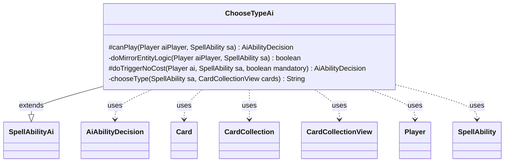

---
aliases:
  - ChooseTypeAi
tags:
  - java/class
  - module/forge-ai
  - pkg/forge/ai/ability
fqn: forge.ai.ability.ChooseTypeAi
package: forge.ai.ability
module: forge-ai
kind: Class
---

# ChooseTypeAi

**Package:** `forge.ai.ability`   **Module:** `forge-ai`   **Kind:** Class



## Relationships
**Extends:**
- [[forge.ai.SpellAbilityAi|SpellAbilityAi]]
**Uses:**
- [[forge.ai.AiAbilityDecision|AiAbilityDecision]]
- [[forge.game.card.Card|Card]]
- [[forge.game.card.CardCollection|CardCollection]]
- [[forge.game.card.CardCollectionView|CardCollectionView]]
- [[forge.game.player.Player|Player]]
- [[forge.game.spellability.SpellAbility|SpellAbility]]

## Design Description

ChooseTypeAi supplies the AI's decision logic for the ChooseType ability, deciding whether the computer should activate effects that name a creature type and which type to pick. As a concrete `SpellAbilityAi` subclass, it overrides `canPlay` to dispatch on the ability's `AILogic` parameter—evaluating prominence among cards the AI controls, owns, or that opponents control—and `doTriggerNoCost` to resolve targeting for curse versus beneficial effects. It collaborates with `Player`, `SpellAbility`, and the `Card`/`CardCollection` types to inspect the board, returning weighted `AiAbilityDecision` results.

The private helpers reveal deeper design intent: `chooseType` delegates to `ComputerUtilCard.getMostProminentType`, with special handling for changelings and toughness-based pump curses, while `doMirrorEntityLogic` encodes a card-specific heuristic that gauges board state, conserves mana unless overpowering, and uses `AiCardMemory` to avoid re-animating in the same turn.

## Source
`forge-ai/src/main/java/forge/ai/ability/ChooseTypeAi.java`

```java
package forge.ai.ability;

import com.google.common.collect.Iterables;
import forge.ai.*;
import forge.card.CardType;
import forge.game.ability.AbilityUtils;
import forge.game.ability.ApiType;
import forge.game.card.*;
import forge.game.keyword.Keyword;
import forge.game.phase.PhaseType;
import forge.game.player.Player;
import forge.game.player.PlayerPredicates;
import forge.game.spellability.SpellAbility;
import forge.game.zone.ZoneType;
import forge.util.Aggregates;

import java.util.Arrays;
import java.util.HashSet;
import java.util.List;
import java.util.Set;

public class ChooseTypeAi extends SpellAbilityAi {
    @Override
    protected AiAbilityDecision canPlay(Player aiPlayer, SpellAbility sa) {
        String aiLogic = sa.getParamOrDefault("AILogic", "");

        if (aiLogic.isEmpty()) {
            return new AiAbilityDecision(0, AiPlayDecision.MissingLogic);
        } else if ("MostProminentComputerControls".equals(aiLogic)) {
            if (ComputerUtilAbility.getAbilitySourceName(sa).equals("Mirror Entity Avatar")) {
                if (doMirrorEntityLogic(aiPlayer, sa)) {
                    return new AiAbilityDecision(100, AiPlayDecision.WillPlay);
                } else {
                    return new AiAbilityDecision(0, AiPlayDecision.CantPlayAi);
                }
            }


            if (!chooseType(sa, aiPlayer.getCardsIn(ZoneType.Battlefield)).isEmpty()) {
                return new AiAbilityDecision(100, AiPlayDecision.WillPlay);
            } else {
                return new AiAbilityDecision(0, AiPlayDecision.CantPlayAi);
            }
        } else if ("MostProminentComputerControlsOrOwns".equals(aiLogic)) {
            return !chooseType(sa, aiPlayer.getCardsIn(Arrays.asList(ZoneType.Hand, ZoneType.Battlefield))).isEmpty()
                    ? new AiAbilityDecision(100, AiPlayDecision.WillPlay)
                    : new AiAbilityDecision(0, AiPlayDecision.CantPlayAi);
        } else if ("MostProminentOppControls".equals(aiLogic)) {
            return !chooseType(sa, aiPlayer.getOpponents().getCardsIn(ZoneType.Battlefield)).isEmpty()
                    ? new AiAbilityDecision(100, AiPlayDecision.WillPlay)
                    : new AiAbilityDecision(0, AiPlayDecision.CantPlayAi);
        }

        return doTriggerNoCost(aiPlayer, sa, false);
    }

    private boolean doMirrorEntityLogic(Player aiPlayer, SpellAbility sa) {
        if (AiCardMemory.isRememberedCard(aiPlayer, sa.getHostCard(), AiCardMemory.MemorySet.ANIMATED_THIS_TURN)) {
            return false;
        }
        if (!aiPlayer.getGame().getPhaseHandler().is(PhaseType.MAIN1, aiPlayer)) {
            return false;
        }
        
        String chosenType = chooseType(sa, aiPlayer.getCardsIn(ZoneType.Battlefield));
        if (chosenType.isEmpty()) {
            return false;
        }

        int maxX = ComputerUtilMana.determineLeftoverMana(sa, aiPlayer, false);
        int avgPower = 0;
        
        // predict the opposition
        CardCollection oppCreatures = CardLists.filter(aiPlayer.getOpponents().getCreaturesInPlay(), CardPredicates.UNTAPPED);
        int maxOppPower = 0;
        int maxOppToughness = 0;
        int oppUsefulCreatures = 0;
        
        for (Card oppCre : oppCreatures) {
            if (ComputerUtilCard.isUselessCreature(aiPlayer, oppCre)) {
                continue;
            }
            if (oppCre.getNetPower() > maxOppPower) {
                maxOppPower = oppCre.getNetPower();
            }
            if (oppCre.getNetToughness() > maxOppToughness) {
                maxOppToughness = oppCre.getNetToughness();
            }
            oppUsefulCreatures++;
        }

        if (maxX > 1) {
            CardCollection cre = CardLists.filter(aiPlayer.getCardsIn(ZoneType.Battlefield),
                    CardPredicates.isType(chosenType), CardPredicates.UNTAPPED);
            if (!cre.isEmpty()) {
                for (Card c: cre) {
                    avgPower += c.getNetPower();
                }
                avgPower /= cre.size();
                
                boolean overpower = cre.size() > oppUsefulCreatures;
                if (!overpower) {
                    maxX = Math.max(0, maxX - 3); // conserve some mana unless the board position looks overpowering
                }

                if (maxX > avgPower && maxX > maxOppPower && maxX >= maxOppToughness) {
                    sa.setXManaCostPaid(maxX);
                    AiCardMemory.rememberCard(aiPlayer, sa.getHostCard(), AiCardMemory.MemorySet.ANIMATED_THIS_TURN);
                    return true;
                }
            }
        }
        
        return false;
    }

    @Override
    protected AiAbilityDecision doTriggerNoCost(Player ai, SpellAbility sa, boolean mandatory) {
        boolean isCurse = sa.isCurse();

        if (sa.usesTargeting()) {
            final List<Player> oppList = ai.getOpponents().filter(PlayerPredicates.isTargetableBy(sa));
            final List<Player> alliesList = ai.getAllies().filter(PlayerPredicates.isTargetableBy(sa));

            sa.resetTargets();

            if (isCurse) {
                if (!oppList.isEmpty()) {
                    sa.getTargets().add(Iterables.getFirst(oppList, null));
                } else if (mandatory) {
                    if (!alliesList.isEmpty()) {
                        sa.getTargets().add(Iterables.getFirst(alliesList, null));
                    } else if (ai.canBeTargetedBy(sa)) {
                        sa.getTargets().add(ai);
                    }
                }
            } else {
                if (ai.canBeTargetedBy(sa)) {
                    sa.getTargets().add(ai);
                } else {
                    if (!alliesList.isEmpty()) {
                        sa.getTargets().add(Iterables.getFirst(alliesList, null));
                    } else if (!oppList.isEmpty() && mandatory) {
                        sa.getTargets().add(Iterables.getFirst(oppList, null));
                    }
                }
            }

            if (!sa.isTargetNumberValid()) {
                return new AiAbilityDecision(0, AiPlayDecision.TargetingFailed);
            }
        } else {
            for (final Player p : AbilityUtils.getDefinedPlayers(sa.getHostCard(), sa.getParam("Defined"), sa)) {
                if (p.isOpponentOf(ai) && !mandatory && !isCurse) {
                    return new AiAbilityDecision(0, AiPlayDecision.CantPlayAi);
                }
            }
        }
        return new AiAbilityDecision(100, AiPlayDecision.WillPlay);
    }

    private String chooseType(SpellAbility sa, CardCollectionView cards) {
        Set<String> valid = new HashSet<>();

        if (sa.getSubAbility() != null && sa.getSubAbility().getApi() == ApiType.PumpAll
                && sa.getSubAbility().isCurse() && sa.getSubAbility().hasParam("NumDef")) {
            final SpellAbility pumpSa = sa.getSubAbility();
            final int defense = AbilityUtils.calculateAmount(sa.getHostCard(), pumpSa.getParam("NumDef"), pumpSa);
            for (Card c : cards) {
                if (c.isCreature() && c.getNetToughness() <= -defense) {
                    valid.addAll(c.getType().getCreatureTypes());
                }
            }
        } else {
            valid.addAll(CardType.getAllCreatureTypes());
        }

        String chosenType = ComputerUtilCard.getMostProminentType(cards, valid);
        if (chosenType.isEmpty()) {
            // Account for the situation when only changelings are on the battlefield
            boolean allChangeling = false;
            for (Card c : cards) {
                if (c.isCreature() && c.hasKeyword(Keyword.CHANGELING)) {
                    chosenType = Aggregates.random(valid); // just choose a random type for changelings
                    allChangeling = true;
                    break;
                }
            }

            if (!allChangeling) {
                // Still empty, probably no creatures on board
                return "";
            }
        }

        return chosenType;
    }
}
```

## Python
`forge/ai/ability/ChooseTypeAi.py`

````python
package forge.ai.ability -> module path. Let me just output the Python.

Let me map dependencies:
- forge.ai.SpellAbilityAi -> SpellAbilityAi (extends)
- forge.ai.AiAbilityDecision
- forge.ai.AiPlayDecision (used)
- forge.ai.ComputerUtilAbility
- forge.ai.AiCardMemory
- forge.ai.ComputerUtilMana
- forge.ai.ComputerUtilCard
- forge.card.CardType
- forge.game.ability.AbilityUtils
- forge.game.ability.ApiType
- forge.game.card.Card, CardCollection, CardLists, CardPredicates
- forge.game.keyword.Keyword
- forge.game.phase.PhaseType
- forge.game.player.Player, PlayerPredicates
- forge.game.spellability.SpellAbility
- forge.game.zone.ZoneType
- forge.util.Aggregates
- com.google.common.collect.Iterables -> translate idiomatically
- CardCollectionView

I'll preserve faithfully.

AiCardMemory.MemorySet.ANIMATED_THIS_TURN -> need MemorySet. It's a nested enum. I'll reference AiCardMemory.MemorySet.ANIMATED_THIS_TURN.

Now write Python.

```python
from forge.ai.SpellAbilityAi import SpellAbilityAi
from forge.ai.AiAbilityDecision import AiAbilityDecision
from forge.ai.AiPlayDecision import AiPlayDecision
from forge.ai.ComputerUtilAbility import ComputerUtilAbility
from forge.ai.AiCardMemory import AiCardMemory
from forge.ai.ComputerUtilMana import ComputerUtilMana
from forge.ai.ComputerUtilCard import ComputerUtilCard
from forge.card.CardType import CardType
from forge.game.ability.AbilityUtils import AbilityUtils
from forge.game.ability.ApiType import ApiType
from forge.game.card.Card import Card
from forge.game.card.CardCollection import CardCollection
from forge.game.card.CardCollectionView import CardCollectionView
from forge.game.card.CardLists import CardLists
from forge.game.card.CardPredicates import CardPredicates
from forge.game.keyword.Keyword import Keyword
from forge.game.phase.PhaseType import PhaseType
from forge.game.player.Player import Player
from forge.game.player.PlayerPredicates import PlayerPredicates
from forge.game.spellability.SpellAbility import SpellAbility
from forge.game.zone.ZoneType import ZoneType
from forge.util.Aggregates import Aggregates
```

Now bodies. CardCollectionView and Card used in type hints. Relationships lists Card, CardCollection, CardCollectionView - import them. Also CardLists, CardPredicates from wildcard forge.game.card.* ΓÇö not in relationships but in source. The rules say import specific symbols from FQN. CardLists is forge.game.card.CardLists. I'll import them too even though not in relationships, since needed.

Let me write.from forge.ai.SpellAbilityAi import SpellAbilityAi
from forge.ai.AiAbilityDecision import AiAbilityDecision
from forge.ai.AiPlayDecision import AiPlayDecision
from forge.ai.ComputerUtilAbility import ComputerUtilAbility
from forge.ai.AiCardMemory import AiCardMemory
from forge.ai.ComputerUtilMana import ComputerUtilMana
from forge.ai.ComputerUtilCard import ComputerUtilCard
from forge.card.CardType import CardType
from forge.game.ability.AbilityUtils import AbilityUtils
from forge.game.ability.ApiType import ApiType
from forge.game.card.Card import Card
from forge.game.card.CardCollection import CardCollection
from forge.game.card.CardCollectionView import CardCollectionView
from forge.game.card.CardLists import CardLists
from forge.game.card.CardPredicates import CardPredicates
from forge.game.keyword.Keyword import Keyword
from forge.game.phase.PhaseType import PhaseType
from forge.game.player.Player import Player
from forge.game.player.PlayerPredicates import PlayerPredicates
from forge.game.spellability.SpellAbility import SpellAbility
from forge.game.zone.ZoneType import ZoneType
from forge.util.Aggregates import Aggregates


class ChooseTypeAi(SpellAbilityAi):
    def canPlay(self, aiPlayer: Player, sa: SpellAbility) -> AiAbilityDecision:
        aiLogic = sa.getParamOrDefault("AILogic", "")

        if aiLogic == "":
            return AiAbilityDecision(0, AiPlayDecision.MissingLogic)
        elif aiLogic == "MostProminentComputerControls":
            if ComputerUtilAbility.getAbilitySourceName(sa) == "Mirror Entity Avatar":
                if self.doMirrorEntityLogic(aiPlayer, sa):
                    return AiAbilityDecision(100, AiPlayDecision.WillPlay)
                else:
                    return AiAbilityDecision(0, AiPlayDecision.CantPlayAi)

            if self.chooseType(sa, aiPlayer.getCardsIn(ZoneType.Battlefield)) != "":
                return AiAbilityDecision(100, AiPlayDecision.WillPlay)
            else:
                return AiAbilityDecision(0, AiPlayDecision.CantPlayAi)
        elif aiLogic == "MostProminentComputerControlsOrOwns":
            return (AiAbilityDecision(100, AiPlayDecision.WillPlay)
                    if self.chooseType(sa, aiPlayer.getCardsIn([ZoneType.Hand, ZoneType.Battlefield])) != ""
                    else AiAbilityDecision(0, AiPlayDecision.CantPlayAi))
        elif aiLogic == "MostProminentOppControls":
            return (AiAbilityDecision(100, AiPlayDecision.WillPlay)
                    if self.chooseType(sa, aiPlayer.getOpponents().getCardsIn(ZoneType.Battlefield)) != ""
                    else AiAbilityDecision(0, AiPlayDecision.CantPlayAi))

        return self.doTriggerNoCost(aiPlayer, sa, False)

    def doMirrorEntityLogic(self, aiPlayer: Player, sa: SpellAbility) -> bool:
        if AiCardMemory.isRememberedCard(aiPlayer, sa.getHostCard(), AiCardMemory.MemorySet.ANIMATED_THIS_TURN):
            return False
        if not aiPlayer.getGame().getPhaseHandler().is_(PhaseType.MAIN1, aiPlayer):
            return False

        chosenType = self.chooseType(sa, aiPlayer.getCardsIn(ZoneType.Battlefield))
        if chosenType == "":
            return False

        maxX = ComputerUtilMana.determineLeftoverMana(sa, aiPlayer, False)
        avgPower = 0

        # predict the opposition
        oppCreatures = CardLists.filter(aiPlayer.getOpponents().getCreaturesInPlay(), CardPredicates.UNTAPPED)
        maxOppPower = 0
        maxOppToughness = 0
        oppUsefulCreatures = 0

        for oppCre in oppCreatures:
            if ComputerUtilCard.isUselessCreature(aiPlayer, oppCre):
                continue
            if oppCre.getNetPower() > maxOppPower:
                maxOppPower = oppCre.getNetPower()
            if oppCre.getNetToughness() > maxOppToughness:
                maxOppToughness = oppCre.getNetToughness()
            oppUsefulCreatures += 1

        if maxX > 1:
            cre = CardLists.filter(aiPlayer.getCardsIn(ZoneType.Battlefield),
                                   CardPredicates.isType(chosenType), CardPredicates.UNTAPPED)
            if not cre.isEmpty():
                for c in cre:
                    avgPower += c.getNetPower()
                avgPower //= cre.size()

                overpower = cre.size() > oppUsefulCreatures
                if not overpower:
                    maxX = max(0, maxX - 3)  # conserve some mana unless the board position looks overpowering

                if maxX > avgPower and maxX > maxOppPower and maxX >= maxOppToughness:
                    sa.setXManaCostPaid(maxX)
                    AiCardMemory.rememberCard(aiPlayer, sa.getHostCard(), AiCardMemory.MemorySet.ANIMATED_THIS_TURN)
                    return True

        return False

    def doTriggerNoCost(self, ai: Player, sa: SpellAbility, mandatory: bool) -> AiAbilityDecision:
        isCurse = sa.isCurse()

        if sa.usesTargeting():
            oppList = ai.getOpponents().filter(PlayerPredicates.isTargetableBy(sa))
            alliesList = ai.getAllies().filter(PlayerPredicates.isTargetableBy(sa))

            sa.resetTargets()

            if isCurse:
                if oppList:
                    sa.getTargets().add(oppList[0] if oppList else None)
                elif mandatory:
                    if alliesList:
                        sa.getTargets().add(alliesList[0] if alliesList else None)
                    elif ai.canBeTargetedBy(sa):
                        sa.getTargets().add(ai)
            else:
                if ai.canBeTargetedBy(sa):
                    sa.getTargets().add(ai)
                else:
                    if alliesList:
                        sa.getTargets().add(alliesList[0] if alliesList else None)
                    elif oppList and mandatory:
                        sa.getTargets().add(oppList[0] if oppList else None)

            if not sa.isTargetNumberValid():
                return AiAbilityDecision(0, AiPlayDecision.TargetingFailed)
        else:
            for p in AbilityUtils.getDefinedPlayers(sa.getHostCard(), sa.getParam("Defined"), sa):
                if p.isOpponentOf(ai) and not mandatory and not isCurse:
                    return AiAbilityDecision(0, AiPlayDecision.CantPlayAi)
        return AiAbilityDecision(100, AiPlayDecision.WillPlay)

    def chooseType(self, sa: SpellAbility, cards: CardCollectionView) -> str:
        valid: set[str] = set()

        if (sa.getSubAbility() is not None and sa.getSubAbility().getApi() == ApiType.PumpAll
                and sa.getSubAbility().isCurse() and sa.getSubAbility().hasParam("NumDef")):
            pumpSa = sa.getSubAbility()
            defense = AbilityUtils.calculateAmount(sa.getHostCard(), pumpSa.getParam("NumDef"), pumpSa)
            for c in cards:
                if c.isCreature() and c.getNetToughness() <= -defense:
                    valid.update(c.getType().getCreatureTypes())
        else:
            valid.update(CardType.getAllCreatureTypes())

        chosenType = ComputerUtilCard.getMostProminentType(cards, valid)
        if chosenType == "":
            # Account for the situation when only changelings are on the battlefield
            allChangeling = False
            for c in cards:
                if c.isCreature() and c.hasKeyword(Keyword.CHANGELING):
                    chosenType = Aggregates.random(valid)  # just choose a random type for changelings
                    allChangeling = True
                    break

            if not allChangeling:
                # Still empty, probably no creatures on board
                return ""

        return chosenType
````
