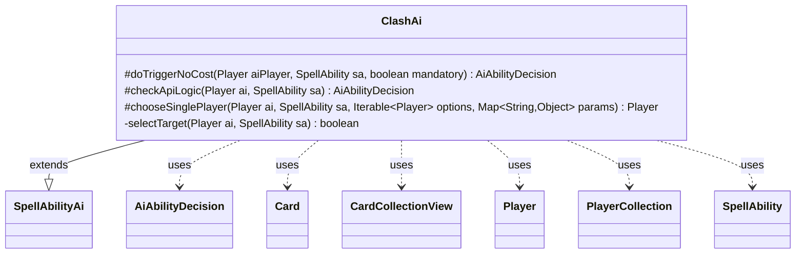

---
aliases:
  - ClashAi
tags:
  - java/class
  - module/forge-ai
  - pkg/forge/ai/ability
fqn: forge.ai.ability.ClashAi
package: forge.ai.ability
module: forge-ai
kind: Class
---

# ClashAi

**Package:** `forge.ai.ability`   **Module:** `forge-ai`   **Kind:** Class



## Relationships
**Extends:**
- [[forge.ai.SpellAbilityAi|SpellAbilityAi]]
**Uses:**
- [[forge.ai.AiAbilityDecision|AiAbilityDecision]]
- [[forge.game.card.Card|Card]]
- [[forge.game.card.CardCollectionView|CardCollectionView]]
- [[forge.game.player.Player|Player]]
- [[forge.game.player.PlayerCollection|PlayerCollection]]
- [[forge.game.spellability.SpellAbility|SpellAbility]]

## Design Description

ClashAi provides the AI decision logic for resolving "Clash" abilities, a Magic mechanic in which players compare the top cards of their libraries. As a concrete subtype of `SpellAbilityAi`, it overrides the framework's hook methods—`doTriggerNoCost` and `checkApiLogic`—to decide whether the computer should play the ability, returning an `AiAbilityDecision` that pairs a confidence score with a play verdict (e.g., `WillPlay` or `TargetingFailed`). When the ability targets, it delegates to `selectTarget`, which narrows the field to targetable opponents and, for creature-targeting variants, picks the best friendly or worst enemy creature via `ComputerUtilCard`.

Its core heuristic lives in `chooseSinglePlayer`, which prefers an opponent with an empty library, then—if the AI may look at library tops—an opponent whose top card has lower converted mana cost, maximizing the AI's chance of winning the clash. The design keeps targeting and player-selection concerns separate and reuses the shared decision/scoring conventions of the AI framework, while inline TODOs flag known gaps (split cards, trickier clash variants).

## Source
`forge-ai/src/main/java/forge/ai/ability/ClashAi.java`

```java
package forge.ai.ability;


import com.google.common.collect.Iterables;
import forge.ai.AiAbilityDecision;
import forge.ai.AiPlayDecision;
import forge.ai.ComputerUtilCard;
import forge.ai.SpellAbilityAi;
import forge.game.card.Card;
import forge.game.card.CardCollectionView;
import forge.game.card.CardLists;
import forge.game.card.CardPredicates;
import forge.game.player.Player;
import forge.game.player.PlayerCollection;
import forge.game.player.PlayerPredicates;
import forge.game.spellability.SpellAbility;
import forge.game.zone.ZoneType;

import java.util.Map;

public class ClashAi extends SpellAbilityAi {

    /* (non-Javadoc)
     * @see forge.card.abilityfactory.SpellAiLogic#doTriggerAINoCost(forge.game.player.Player, java.util.Map, forge.card.spellability.SpellAbility, boolean)
     */
    @Override
    protected AiAbilityDecision doTriggerNoCost(Player aiPlayer, SpellAbility sa, boolean mandatory) {
        boolean legalAction = true;

        if (sa.usesTargeting()) {
            legalAction = selectTarget(aiPlayer, sa);
        }

        return legalAction ? new AiAbilityDecision(100, AiPlayDecision.WillPlay)
                : new AiAbilityDecision(0, AiPlayDecision.TargetingFailed);
    }

    /*
     * (non-Javadoc)
     * 
     * @see forge.ai.SpellAbilityAi#checkApiLogic(forge.game.player.Player,
     * forge.game.spellability.SpellAbility)
     */
    @Override
    protected AiAbilityDecision checkApiLogic(Player ai, SpellAbility sa) {
        boolean legalAction = true;

        if (sa.usesTargeting()) {
            legalAction = selectTarget(ai, sa);
            if (!legalAction) {
                return new AiAbilityDecision(0, AiPlayDecision.TargetingFailed);
            }
        }

        return new AiAbilityDecision(100, AiPlayDecision.WillPlay);
    }

    /*
     * (non-Javadoc)
     * 
     * @see forge.ai.SpellAbilityAi#chooseSinglePlayer(forge.game.player.Player,
     * forge.game.spellability.SpellAbility, java.lang.Iterable)
     */
    @Override
    protected Player chooseSinglePlayer(Player ai, SpellAbility sa, Iterable<Player> options, Map<String, Object> params) {
        for (Player p : options) {
            if (p.getCardsIn(ZoneType.Library).isEmpty())
                return p;
        }

    	CardCollectionView col = ai.getCardsIn(ZoneType.Library);
        if (!col.isEmpty() && col.getFirst().mayPlayerLook(ai)) {
            final Card top = col.get(0);
            for (Player p : options) {
                final Card oppTop = p.getCardsIn(ZoneType.Library).getFirst();
                // TODO add logic for SplitCards
                if (top.getCMC() > oppTop.getCMC()) {
                    return p;
                }
            }
        }

        return Iterables.getFirst(options, null);
    }

    private boolean selectTarget(Player ai, SpellAbility sa) {
        String valid = sa.getParam("ValidTgts");

        PlayerCollection players = ai.getOpponents().filter(PlayerPredicates.isTargetableBy(sa));
        // use chooseSinglePlayer function to the select player
        Player chosen = chooseSinglePlayer(ai, sa, players, null);
        if (chosen != null) {
            sa.resetTargets();
            sa.getTargets().add(chosen);
        }

        if ("Creature".equals(valid)) {
            // Springjack Knight
            // TODO: Whirlpool Whelm also uses creature targeting but it's trickier to support
            CardCollectionView aiCreats = ai.getCreaturesInPlay();
            CardCollectionView oppCreats = CardLists.filter(ai.getOpponents().getCardsIn(ZoneType.Battlefield), CardPredicates.CREATURES);

            Card tgt = aiCreats.isEmpty() ? ComputerUtilCard.getWorstCreatureAI(oppCreats) : ComputerUtilCard.getBestCreatureAI(aiCreats);

            if (tgt != null) {
                sa.resetTargets();
                sa.getTargets().add(tgt);
            } else {
                return false; // cut short if this part of the clause is not satisfiable (with current card pool should never get here)
            }
        }

        return !sa.getTargets().isEmpty();
    }
}
```

## Python
`forge/ai/ability/ClashAi.py`

```python
from typing import Iterable, Map  # noqa
from forge.ai.AiAbilityDecision import AiAbilityDecision
from forge.ai.AiPlayDecision import AiPlayDecision
from forge.ai.ComputerUtilCard import ComputerUtilCard
from forge.ai.SpellAbilityAi import SpellAbilityAi
from forge.game.card.Card import Card
from forge.game.card.CardCollectionView import CardCollectionView
from forge.game.card.CardLists import CardLists
from forge.game.card.CardPredicates import CardPredicates
from forge.game.player.Player import Player
from forge.game.player.PlayerCollection import PlayerCollection
from forge.game.player.PlayerPredicates import PlayerPredicates
from forge.game.spellability.SpellAbility import SpellAbility
from forge.game.zone.ZoneType import ZoneType


class ClashAi(SpellAbilityAi):

    # (non-Javadoc)
    # @see forge.card.abilityfactory.SpellAiLogic#doTriggerAINoCost(forge.game.player.Player, java.util.Map, forge.card.spellability.SpellAbility, boolean)
    def doTriggerNoCost(self, aiPlayer: Player, sa: SpellAbility, mandatory: bool) -> AiAbilityDecision:
        legalAction = True

        if sa.usesTargeting():
            legalAction = self.selectTarget(aiPlayer, sa)

        return AiAbilityDecision(100, AiPlayDecision.WillPlay) if legalAction \
            else AiAbilityDecision(0, AiPlayDecision.TargetingFailed)

    #
    # (non-Javadoc)
    #
    # @see forge.ai.SpellAbilityAi#checkApiLogic(forge.game.player.Player,
    # forge.game.spellability.SpellAbility)
    #
    def checkApiLogic(self, ai: Player, sa: SpellAbility) -> AiAbilityDecision:
        legalAction = True

        if sa.usesTargeting():
            legalAction = self.selectTarget(ai, sa)
            if not legalAction:
                return AiAbilityDecision(0, AiPlayDecision.TargetingFailed)

        return AiAbilityDecision(100, AiPlayDecision.WillPlay)

    #
    # (non-Javadoc)
    #
    # @see forge.ai.SpellAbilityAi#chooseSinglePlayer(forge.game.player.Player,
    # forge.game.spellability.SpellAbility, java.lang.Iterable)
    #
    def chooseSinglePlayer(self, ai: Player, sa: SpellAbility, options: Iterable[Player], params: dict[str, object]) -> Player:
        for p in options:
            if p.getCardsIn(ZoneType.Library).isEmpty():
                return p

        col: CardCollectionView = ai.getCardsIn(ZoneType.Library)
        if not col.isEmpty() and col.getFirst().mayPlayerLook(ai):
            top: Card = col.get(0)
            for p in options:
                oppTop: Card = p.getCardsIn(ZoneType.Library).getFirst()
                # TODO add logic for SplitCards
                if top.getCMC() > oppTop.getCMC():
                    return p

        return next(iter(options), None)

    def selectTarget(self, ai: Player, sa: SpellAbility) -> bool:
        valid = sa.getParam("ValidTgts")

        players: PlayerCollection = ai.getOpponents().filter(PlayerPredicates.isTargetableBy(sa))
        # use chooseSinglePlayer function to the select player
        chosen = self.chooseSinglePlayer(ai, sa, players, None)
        if chosen is not None:
            sa.resetTargets()
            sa.getTargets().add(chosen)

        if "Creature" == valid:
            # Springjack Knight
            # TODO: Whirlpool Whelm also uses creature targeting but it's trickier to support
            aiCreats: CardCollectionView = ai.getCreaturesInPlay()
            oppCreats: CardCollectionView = CardLists.filter(ai.getOpponents().getCardsIn(ZoneType.Battlefield), CardPredicates.CREATURES)

            tgt: Card = ComputerUtilCard.getWorstCreatureAI(oppCreats) if aiCreats.isEmpty() else ComputerUtilCard.getBestCreatureAI(aiCreats)

            if tgt is not None:
                sa.resetTargets()
                sa.getTargets().add(tgt)
            else:
                return False  # cut short if this part of the clause is not satisfiable (with current card pool should never get here)

        return not sa.getTargets().isEmpty()
```
