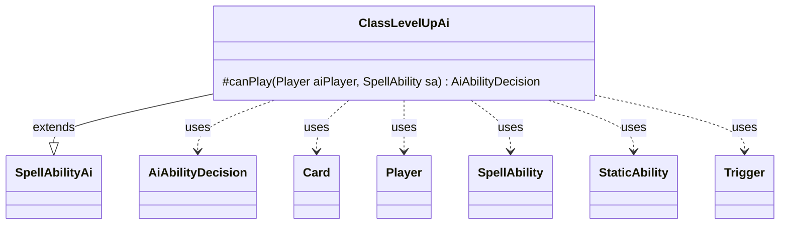

---
aliases:
  - ClassLevelUpAi
tags:
  - java/class
  - module/forge-ai
  - pkg/forge/ai/ability
fqn: forge.ai.ability.ClassLevelUpAi
package: forge.ai.ability
module: forge-ai
kind: Class
---

# ClassLevelUpAi

**Package:** `forge.ai.ability` &nbsp; **Module:** `forge-ai` &nbsp; **Kind:** Class



## Relationships
**Extends:**
- [[forge.ai.SpellAbilityAi|SpellAbilityAi]]
**Uses:**
- [[forge.ai.AiAbilityDecision|AiAbilityDecision]]
- [[forge.game.card.Card|Card]]
- [[forge.game.player.Player|Player]]
- [[forge.game.spellability.SpellAbility|SpellAbility]]
- [[forge.game.staticability.StaticAbility|StaticAbility]]
- [[forge.game.trigger.Trigger|Trigger]]

## Design Description

ClassLevelUpAi is the AI decision handler for the "class level-up" activated ability, governing how a computer-controlled player chooses to advance an Aftermath/Class-card's level. As a concrete subclass of `SpellAbilityAi`, it overrides `canPlay` to return an `AiAbilityDecision` weighing whether to activate the ability for the current `Player` and `SpellAbility`.

The implementation inspects the host `Card`'s next class level, scanning its `StaticAbility` set for the `AddTrigger` parameters tied to that level. For each `ClassLevelGained` `Trigger`, it delegates to the corresponding effect's AI via `SpellApiToAi`, refusing to play (a zero-weight `CantPlayAi` decision) if any triggered effect is judged unworthwhile, and otherwise committing to play. A lingering TODO about combat timing signals deliberately conservative scheduling intent, deferring level-ups toward the second main phase.

## Source
`forge-ai/src/main/java/forge/ai/ability/ClassLevelUpAi.java`

```java
package forge.ai.ability;

import forge.ai.AiAbilityDecision;
import forge.ai.AiPlayDecision;
import forge.ai.SpellAbilityAi;
import forge.ai.SpellApiToAi;
import forge.game.ability.AbilityUtils;
import forge.game.card.Card;
import forge.game.player.Player;
import forge.game.spellability.SpellAbility;
import forge.game.staticability.StaticAbility;
import forge.game.trigger.Trigger;
import forge.game.trigger.TriggerType;

public class ClassLevelUpAi extends SpellAbilityAi {
    @Override
    protected AiAbilityDecision canPlay(Player aiPlayer, SpellAbility sa) {
        // TODO does leveling up affect combat? Otherwise wait for Main2
        Card host = sa.getHostCard();
        final int level = host.getClassLevel() + 1;
        for (StaticAbility stAb : host.getStaticAbilities()) {
            if (!stAb.hasParam("AddTrigger") || !stAb.isClassLevelNAbility(level)) {
                continue;
            }
            for (String sTrig : stAb.getParam("AddTrigger").split(" & ")) {
                Trigger t = host.getTriggerForStaticAbility(AbilityUtils.getSVar(stAb, sTrig), stAb);
                if (t.getMode() != TriggerType.ClassLevelGained) {
                    continue;
                }
                SpellAbility effect = t.ensureAbility();
                if (!SpellApiToAi.Converter.get(effect).doTrigger(aiPlayer, effect, false)) {
                    return new AiAbilityDecision(0, AiPlayDecision.CantPlayAi);
                }
            }
        }
        return new AiAbilityDecision(100, AiPlayDecision.WillPlay);
    }

}
```

## Python
`forge/ai/ability/ClassLevelUpAi.py`

```python
from forge.ai.AiAbilityDecision import AiAbilityDecision
from forge.ai.AiPlayDecision import AiPlayDecision
from forge.ai.SpellAbilityAi import SpellAbilityAi
from forge.ai.SpellApiToAi import SpellApiToAi
from forge.game.ability.AbilityUtils import AbilityUtils
from forge.game.card.Card import Card
from forge.game.player.Player import Player
from forge.game.spellability.SpellAbility import SpellAbility
from forge.game.staticability.StaticAbility import StaticAbility
from forge.game.trigger.Trigger import Trigger
from forge.game.trigger.TriggerType import TriggerType


class ClassLevelUpAi(SpellAbilityAi):
    def canPlay(self, aiPlayer: Player, sa: SpellAbility) -> AiAbilityDecision:
        # TODO does leveling up affect combat? Otherwise wait for Main2
        host = sa.getHostCard()
        level = host.getClassLevel() + 1
        for stAb in host.getStaticAbilities():
            if not stAb.hasParam("AddTrigger") or not stAb.isClassLevelNAbility(level):
                continue
            for sTrig in stAb.getParam("AddTrigger").split(" & "):
                t = host.getTriggerForStaticAbility(AbilityUtils.getSVar(stAb, sTrig), stAb)
                if t.getMode() != TriggerType.ClassLevelGained:
                    continue
                effect = t.ensureAbility()
                if not SpellApiToAi.Converter.get(effect).doTrigger(aiPlayer, effect, False):
                    return AiAbilityDecision(0, AiPlayDecision.CantPlayAi)
        return AiAbilityDecision(100, AiPlayDecision.WillPlay)
```
