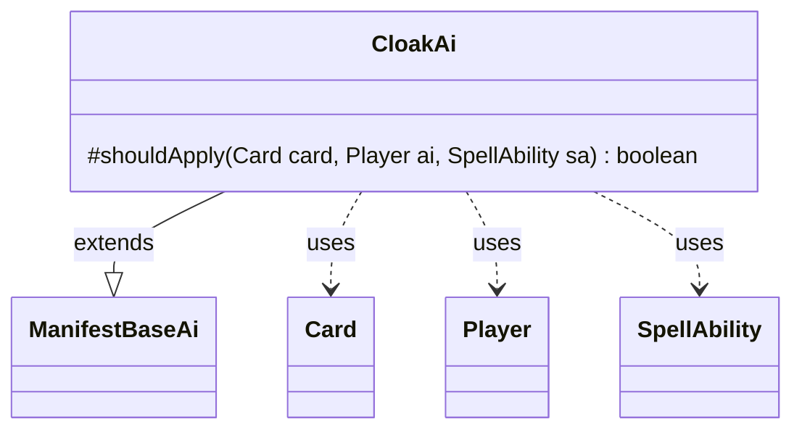

---
aliases:
  - CloakAi
tags:
  - java/class
  - module/forge-ai
  - pkg/forge/ai/ability
fqn: forge.ai.ability.CloakAi
package: forge.ai.ability
module: forge-ai
kind: Class
---

# CloakAi

**Package:** `forge.ai.ability`   **Module:** `forge-ai`   **Kind:** Class



## Relationships
**Extends:**
- [[forge.ai.ability.ManifestBaseAi|ManifestBaseAi]]
**Uses:**
- [[forge.game.card.Card|Card]]
- [[forge.game.player.Player|Player]]
- [[forge.game.spellability.SpellAbility|SpellAbility]]

## Design Description

CloakAi provides the computer-player decision logic for the Cloak keyword action, determining whether the AI should turn a given card face down as a 2/2 cloaked creature. As a concrete subtype of ManifestBaseAi, it overrides the single `shouldApply` hook while inheriting the broader manifest evaluation framework, reflecting a template-method design that shares behavior between the closely related Cloak and Manifest mechanics. The method collaborates with Card, Player, and SpellAbility, and uses CardCopyService and ComputerUtil to build a last-known-information copy of the prospective card so it can test ETB-prevention effects (e.g., Grafdigger's Cage) without mutating game state. Guarded by a visibility check, it further declines low-value or risky targets—non-permanents, X-cost cards, zero-toughness creatures, and cards carrying ETB triggers or replacements—encoding conservative heuristics for advantageous cloaking.

## Source
`forge-ai/src/main/java/forge/ai/ability/CloakAi.java`

```java
package forge.ai.ability;

import forge.ai.ComputerUtil;
import forge.game.card.Card;
import forge.game.card.CardCopyService;
import forge.game.player.Player;
import forge.game.spellability.SpellAbility;

public class CloakAi extends ManifestBaseAi {

    @Override
    protected boolean shouldApply(final Card card, final Player ai, final SpellAbility sa) {
        // check to ensure that there are no replacement effects that prevent creatures ETBing from library
        // (e.g. Grafdigger's Cage)
        Card topCopy = CardCopyService.getLKICopy(card);
        topCopy.turnFaceDownNoUpdate();
        topCopy.setCloaked(sa);

        if (ComputerUtil.isETBprevented(topCopy)) {
            return false;
        }

        if (card.getView().canBeShownTo(ai.getView())) {
            // try to avoid manifest a non Permanent
            if (!card.isPermanent())
                return false;

            // do not manifest a card with X in its cost
            if (card.getManaCost().countX() > 0)
                return false;

            // try to avoid manifesting a creature with zero or less toughness
            if (card.isCreature() && card.getNetToughness() <= 0)
                return false;

            // card has ETBTrigger or ETBReplacement
            if (card.hasETBTrigger(false) || card.hasETBReplacement()) {
                return false;
            }
        }
        return true;
    }
}
```

## Python
`forge/ai/ability/CloakAi.py`

```python
from forge.ai.ComputerUtil import ComputerUtil
from forge.game.card.Card import Card
from forge.game.card.CardCopyService import CardCopyService
from forge.game.player.Player import Player
from forge.game.spellability.SpellAbility import SpellAbility
from forge.ai.ability.ManifestBaseAi import ManifestBaseAi


class CloakAi(ManifestBaseAi):

    def shouldApply(self, card: Card, ai: Player, sa: SpellAbility) -> bool:
        # check to ensure that there are no replacement effects that prevent creatures ETBing from library
        # (e.g. Grafdigger's Cage)
        topCopy = CardCopyService.getLKICopy(card)
        topCopy.turnFaceDownNoUpdate()
        topCopy.setCloaked(sa)

        if ComputerUtil.isETBprevented(topCopy):
            return False

        if card.getView().canBeShownTo(ai.getView()):
            # try to avoid manifest a non Permanent
            if not card.isPermanent():
                return False

            # do not manifest a card with X in its cost
            if card.getManaCost().countX() > 0:
                return False

            # try to avoid manifesting a creature with zero or less toughness
            if card.isCreature() and card.getNetToughness() <= 0:
                return False

            # card has ETBTrigger or ETBReplacement
            if card.hasETBTrigger(False) or card.hasETBReplacement():
                return False

        return True
```
