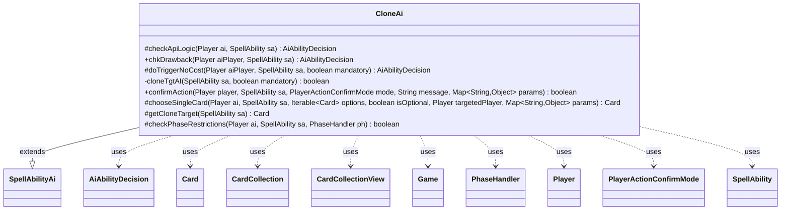

---
aliases:
  - CloneAi
tags:
  - java/class
  - module/forge-ai
  - pkg/forge/ai/ability
fqn: forge.ai.ability.CloneAi
package: forge.ai.ability
module: forge-ai
kind: Class
---

# CloneAi

**Package:** `forge.ai.ability`   **Module:** `forge-ai`   **Kind:** Class



## Relationships
**Extends:**
- [[forge.ai.SpellAbilityAi|SpellAbilityAi]]
**Uses:**
- [[forge.ai.AiAbilityDecision|AiAbilityDecision]]
- [[forge.game.Game|Game]]
- [[forge.game.card.Card|Card]]
- [[forge.game.card.CardCollection|CardCollection]]
- [[forge.game.card.CardCollectionView|CardCollectionView]]
- [[forge.game.phase.PhaseHandler|PhaseHandler]]
- [[forge.game.player.Player|Player]]
- [[forge.game.player.PlayerActionConfirmMode|PlayerActionConfirmMode]]
- [[forge.game.spellability.SpellAbility|SpellAbility]]

## Design Description

CloneAi supplies the AI decision logic for clone-style spell abilities, deciding whether the computer should cast or activate an effect that copies a creature or permanent. As a concrete subclass of `SpellAbilityAi`, it overrides the framework's hook methods—`checkApiLogic`, `chkDrawback`, `doTriggerNoCost`, `confirmAction`, `chooseSingleCard`, and `checkPhaseRestrictions`—returning `AiAbilityDecision` verdicts that the engine consumes. It collaborates with the game model (`Card`, `Player`, `Game`, `PhaseHandler`, `SpellAbility`) to inspect targets and timing, and delegates creature valuation to `ComputerUtilCard` so it clones the best available target (or the worst, when copying an opponent's permanent).

Notable design intent: it gates instant-speed clones to sensible combat phases, guards against infinite ETB-replacement loops when a cloned source re-triggers, and branches on card-specific `AILogic`/name cases (e.g. Vesuva, Sculpting Steel) to avoid degenerate self-copies. Several TODOs mark the heuristics as deliberately conservative placeholders.

## Source
`forge-ai/src/main/java/forge/ai/ability/CloneAi.java`

```java
package forge.ai.ability;

import forge.ai.AiAbilityDecision;
import forge.ai.AiPlayDecision;
import forge.ai.ComputerUtilCard;
import forge.ai.SpellAbilityAi;
import forge.game.Game;
import forge.game.ability.AbilityUtils;
import forge.game.card.*;
import forge.game.phase.PhaseHandler;
import forge.game.phase.PhaseType;
import forge.game.player.Player;
import forge.game.player.PlayerActionConfirmMode;
import forge.game.spellability.SpellAbility;
import forge.game.zone.ZoneType;

import java.util.List;
import java.util.Map;

public class CloneAi extends SpellAbilityAi {

    @Override
    protected AiAbilityDecision checkApiLogic(Player ai, SpellAbility sa) {
        final Card source = sa.getHostCard();
        final Game game = source.getGame();

        boolean useAbility = true;

        // TODO - add some kind of check to answer
        // "Am I going to attack with this?"
        // TODO - add some kind of check for during human turn to answer
        // "Can I use this to block something?"

        PhaseHandler phase = game.getPhaseHandler();

        if (sa.usesTargeting()) {
            sa.resetTargets();
            useAbility &= cloneTgtAI(sa, false);
        } else {
            final List<Card> defined = AbilityUtils.getDefinedCards(source, sa.getParam("Defined"), sa);

            boolean bFlag = false;
            for (final Card c : defined) {
                bFlag |= !c.isCreature() && !c.isTapped() && !(c.getTurnInZone() == phase.getTurn());

                // for creatures that could be improved (like Figure of Destiny)
                if (c.isCreature() && (!sa.hasParam("Duration") || (!c.isTapped() && !c.isSick()))) {
                    int power = -5;
                    if (sa.hasParam("Power")) {
                        power = AbilityUtils.calculateAmount(source, sa.getParam("Power"), sa);
                    }
                    int toughness = -5;
                    if (sa.hasParam("Toughness")) {
                        toughness = AbilityUtils.calculateAmount(source, sa.getParam("Toughness"), sa);
                    }
                    if ((power + toughness) > (c.getCurrentPower() + c.getCurrentToughness())) {
                        bFlag = true;
                    }
                }
            }

            if (!bFlag) { // All of the defined stuff is cloned, not very useful
                return new AiAbilityDecision(0, AiPlayDecision.MissingNeededCards);
            }
        }

        return useAbility ? new AiAbilityDecision(100, AiPlayDecision.WillPlay)
                : new AiAbilityDecision(0, AiPlayDecision.CantPlayAi);
    }

    @Override
    public AiAbilityDecision chkDrawback(Player aiPlayer, SpellAbility sa) {
        // AI should only activate this during Human's turn
        boolean chance = true;

        if (sa.usesTargeting()) {
            chance = cloneTgtAI(sa, false);
        }

        return chance ? new AiAbilityDecision(100, AiPlayDecision.WillPlay)
                : new AiAbilityDecision(0, AiPlayDecision.CantPlayAi);
    }

    @Override
    protected AiAbilityDecision doTriggerNoCost(Player aiPlayer, SpellAbility sa, boolean mandatory) {
        Card host = sa.getHostCard();
        boolean chance = true;

        if (sa.usesTargeting()) {
            chance = cloneTgtAI(sa, mandatory);
        } else {
            if (sa.isReplacementAbility() && host.isCloned()) {
                // prevent StackOverflow from infinite loop copying another ETB RE
                return new AiAbilityDecision(0, AiPlayDecision.StopRunawayActivations);
            }
            if (sa.hasParam("Choices")) {
                CardCollectionView choices = CardLists.getValidCards(host.getGame().getCardsIn(ZoneType.Battlefield),
                        sa.getParam("Choices"), host.getController(), host, sa);

                chance = !choices.isEmpty();
            }
        }

        // Improve AI for triggers. If source is a creature with:
        // When ETB, sacrifice a creature. Check to see if the AI has something
        // to sacrifice

        // Eventually, we can call the trigger of ETB abilities with
        // not mandatory as part of the checks to cast something

        if (mandatory || chance) {
            return new AiAbilityDecision(100, AiPlayDecision.WillPlay);
        }

        return new AiAbilityDecision(0, AiPlayDecision.CantPlayAi);
    }

    /**
     * <p>
     * cloneTgtAI.
     * </p>
     *
     * @param sa
     *            a {@link forge.game.spellability.SpellAbility} object.
     * @return a boolean.
     */
    private boolean cloneTgtAI(final SpellAbility sa, boolean mandatory) {
        // Specific logic for cards
        List<Card> targets = CardUtil.getValidCardsToTarget(sa);
        if (mandatory && targets.isEmpty()) {
            return false;
        }

        if (mandatory || "CloneBestCreature".equals(sa.getParam("AILogic"))) {
            sa.getTargets().add(ComputerUtilCard.getBestCreatureAI(targets));
            return true;
        }

        // Default:
        // This is reasonable for now. Kamahl, Fist of Krosa and a sorcery or
        // two are the only things that clone a target. Those can just use
        // AI:RemoveDeck:All until this can do a reasonably good job of picking
        // a good target
        return false;
    }

    /* (non-Javadoc)
     * @see forge.card.ability.SpellAbilityAi#confirmAction(forge.game.player.Player, forge.card.spellability.SpellAbility, forge.game.player.PlayerActionConfirmMode, java.lang.String)
     */
    @Override
    public boolean confirmAction(Player player, SpellAbility sa, PlayerActionConfirmMode mode, String message, Map<String, Object> params) {
        if (sa.hasParam("AILogic") && (!sa.usesTargeting() || sa.isTargetNumberValid())) {
            // Had a special logic for it and managed to target, so confirm if viable
            if ("CloneBestCreature".equals(sa.getParam("AILogic"))) {
                return ComputerUtilCard.evaluateCreature(sa.getTargetCard()) > ComputerUtilCard.evaluateCreature(sa.getHostCard());
            } else if ("IfDefinedCreatureIsBetter".equals(sa.getParam("AILogic"))) {
                List<Card> defined = AbilityUtils.getDefinedCards(sa.getHostCard(), sa.getParam("Defined"), sa);
                Card bestDefined = ComputerUtilCard.getBestCreatureAI(defined);
                return ComputerUtilCard.evaluateCreature(bestDefined) > ComputerUtilCard.evaluateCreature(sa.getHostCard());
            }
        }

        // Currently doesn't confirm anything that's not defined by AI logic
        return false;
    }

    /*
     * (non-Javadoc)
     *
     * @see forge.ai.SpellAbilityAi#chooseSingleCard(forge.game.player.Player,
     * forge.game.spellability.SpellAbility, java.lang.Iterable, boolean,
     * forge.game.player.Player)
     */
    @Override
    protected Card chooseSingleCard(Player ai, SpellAbility sa, Iterable<Card> options, boolean isOptional,
            Player targetedPlayer, Map<String, Object> params) {
        final Card host = sa.getHostCard();
        final String name = host.getName();
        final Player ctrl = host.getController();

        final Card cloneTarget = getCloneTarget(sa);
        final boolean isOpp = cloneTarget.getController().isOpponentOf(sa.getActivatingPlayer());

        final boolean isVesuva = "Vesuva".equals(name) || "Sculpting Steel".equals(name);
        final boolean canCloneLegendary = "True".equalsIgnoreCase(sa.getParam("NonLegendary"));

        String filter = !isVesuva ? "Permanent.YouDontCtrl,Permanent.nonLegendary"
                : "Permanent.YouDontCtrl+!named" + name + ",Permanent.nonLegendary+!named" + name;

        // TODO: rewrite this block so that this is done somehow more elegantly
        if (canCloneLegendary) {
            filter = filter.replace(".nonLegendary+", ".").replace(".nonLegendary", "");
        }

        CardCollection newOptions = CardLists.getValidCards(options, filter, ctrl, host, sa);
        if (!newOptions.isEmpty()) {
            options = newOptions;
        }

        if (sa.hasParam("AiChoiceLogic")) {
            final String logic = sa.getParam("AiChoiceLogic");
            if ("BestOppCtrl".equals(logic)) {
                options = CardLists.filterControlledBy(options, ctrl.getOpponents());
            }
        }

        // prevent loop of choosing copy of same card
        if (isVesuva) {
            options = CardLists.filter(options, CardPredicates.sharesNameWith(host).negate());
        }

        Card choice = isOpp ? ComputerUtilCard.getWorstAI(options) : ComputerUtilCard.getBestAI(options);

        return choice;
    }

    protected Card getCloneTarget(final SpellAbility sa) {
        final Card host = sa.getHostCard();
        Card tgtCard = host;
        if (sa.hasParam("CloneTarget")) {
            final List<Card> cloneTargets = AbilityUtils.getDefinedCards(host, sa.getParam("CloneTarget"), sa);
            if (!cloneTargets.isEmpty()) {
                tgtCard = cloneTargets.get(0);
            }
        } else if (sa.hasParam("Choices") && sa.usesTargeting()) {
            tgtCard = sa.getTargetCard();
        }

        return tgtCard;
    }

    /*
     * (non-Javadoc)
     * @see forge.ai.SpellAbilityAi#checkPhaseRestrictions(forge.game.player.Player, forge.game.spellability.SpellAbility, forge.game.phase.PhaseHandler)
     */
    protected boolean checkPhaseRestrictions(final Player ai, final SpellAbility sa, final PhaseHandler ph) {
        // don't use instant speed clone abilities outside computers
        // Combat_Begin step
        if (!ph.is(PhaseType.COMBAT_BEGIN)
                && ph.isPlayerTurn(ai) && !isSorcerySpeed(sa, ai)
                && !sa.hasParam("ActivationPhases") && sa.hasParam("Duration")) {
            return false;
        }

        // don't use instant speed clone abilities outside humans
        // Combat_Declare_Attackers_InstantAbility step
        if (!ph.is(PhaseType.COMBAT_DECLARE_ATTACKERS) || ph.isPlayerTurn(ai) || ph.getCombat().getAttackers().isEmpty()) {
            return false;
        }

        // don't activate during main2 unless this effect is permanent
        return !ph.is(PhaseType.MAIN2) || !sa.hasParam("Duration");
    }
}
```

## Python
`forge/ai/ability/CloneAi.py`

```python
from forge.ai.AiAbilityDecision import AiAbilityDecision
from forge.ai.AiPlayDecision import AiPlayDecision
from forge.ai.ComputerUtilCard import ComputerUtilCard
from forge.ai.SpellAbilityAi import SpellAbilityAi
from forge.game.Game import Game
from forge.game.ability.AbilityUtils import AbilityUtils
from forge.game.card.Card import Card
from forge.game.card.CardCollection import CardCollection
from forge.game.card.CardCollectionView import CardCollectionView
from forge.game.card.CardLists import CardLists
from forge.game.card.CardPredicates import CardPredicates
from forge.game.card.CardUtil import CardUtil
from forge.game.phase.PhaseHandler import PhaseHandler
from forge.game.phase.PhaseType import PhaseType
from forge.game.player.Player import Player
from forge.game.player.PlayerActionConfirmMode import PlayerActionConfirmMode
from forge.game.spellability.SpellAbility import SpellAbility
from forge.game.zone.ZoneType import ZoneType

from typing import Iterable, List, Map


class CloneAi(SpellAbilityAi):

    def checkApiLogic(self, ai: Player, sa: SpellAbility) -> AiAbilityDecision:
        source = sa.getHostCard()
        game = source.getGame()

        useAbility = True

        # TODO - add some kind of check to answer
        # "Am I going to attack with this?"
        # TODO - add some kind of check for during human turn to answer
        # "Can I use this to block something?"

        phase = game.getPhaseHandler()

        if sa.usesTargeting():
            sa.resetTargets()
            useAbility &= self.cloneTgtAI(sa, False)
        else:
            defined = AbilityUtils.getDefinedCards(source, sa.getParam("Defined"), sa)

            bFlag = False
            for c in defined:
                bFlag |= not c.isCreature() and not c.isTapped() and not (c.getTurnInZone() == phase.getTurn())

                # for creatures that could be improved (like Figure of Destiny)
                if c.isCreature() and (not sa.hasParam("Duration") or (not c.isTapped() and not c.isSick())):
                    power = -5
                    if sa.hasParam("Power"):
                        power = AbilityUtils.calculateAmount(source, sa.getParam("Power"), sa)
                    toughness = -5
                    if sa.hasParam("Toughness"):
                        toughness = AbilityUtils.calculateAmount(source, sa.getParam("Toughness"), sa)
                    if (power + toughness) > (c.getCurrentPower() + c.getCurrentToughness()):
                        bFlag = True

            if not bFlag:  # All of the defined stuff is cloned, not very useful
                return AiAbilityDecision(0, AiPlayDecision.MissingNeededCards)

        return AiAbilityDecision(100, AiPlayDecision.WillPlay) if useAbility \
            else AiAbilityDecision(0, AiPlayDecision.CantPlayAi)

    def chkDrawback(self, aiPlayer: Player, sa: SpellAbility) -> AiAbilityDecision:
        # AI should only activate this during Human's turn
        chance = True

        if sa.usesTargeting():
            chance = self.cloneTgtAI(sa, False)

        return AiAbilityDecision(100, AiPlayDecision.WillPlay) if chance \
            else AiAbilityDecision(0, AiPlayDecision.CantPlayAi)

    def doTriggerNoCost(self, aiPlayer: Player, sa: SpellAbility, mandatory: bool) -> AiAbilityDecision:
        host = sa.getHostCard()
        chance = True

        if sa.usesTargeting():
            chance = self.cloneTgtAI(sa, mandatory)
        else:
            if sa.isReplacementAbility() and host.isCloned():
                # prevent StackOverflow from infinite loop copying another ETB RE
                return AiAbilityDecision(0, AiPlayDecision.StopRunawayActivations)
            if sa.hasParam("Choices"):
                choices = CardLists.getValidCards(host.getGame().getCardsIn(ZoneType.Battlefield),
                        sa.getParam("Choices"), host.getController(), host, sa)

                chance = not choices.isEmpty()

        # Improve AI for triggers. If source is a creature with:
        # When ETB, sacrifice a creature. Check to see if the AI has something
        # to sacrifice

        # Eventually, we can call the trigger of ETB abilities with
        # not mandatory as part of the checks to cast something

        if mandatory or chance:
            return AiAbilityDecision(100, AiPlayDecision.WillPlay)

        return AiAbilityDecision(0, AiPlayDecision.CantPlayAi)

    def cloneTgtAI(self, sa: SpellAbility, mandatory: bool) -> bool:
        # Specific logic for cards
        targets = CardUtil.getValidCardsToTarget(sa)
        if mandatory and not targets:
            return False

        if mandatory or "CloneBestCreature" == sa.getParam("AILogic"):
            sa.getTargets().add(ComputerUtilCard.getBestCreatureAI(targets))
            return True

        # Default:
        # This is reasonable for now. Kamahl, Fist of Krosa and a sorcery or
        # two are the only things that clone a target. Those can just use
        # AI:RemoveDeck:All until this can do a reasonably good job of picking
        # a good target
        return False

    def confirmAction(self, player: Player, sa: SpellAbility, mode: PlayerActionConfirmMode, message: str, params: Map[str, object]) -> bool:
        if sa.hasParam("AILogic") and (not sa.usesTargeting() or sa.isTargetNumberValid()):
            # Had a special logic for it and managed to target, so confirm if viable
            if "CloneBestCreature" == sa.getParam("AILogic"):
                return ComputerUtilCard.evaluateCreature(sa.getTargetCard()) > ComputerUtilCard.evaluateCreature(sa.getHostCard())
            elif "IfDefinedCreatureIsBetter" == sa.getParam("AILogic"):
                defined = AbilityUtils.getDefinedCards(sa.getHostCard(), sa.getParam("Defined"), sa)
                bestDefined = ComputerUtilCard.getBestCreatureAI(defined)
                return ComputerUtilCard.evaluateCreature(bestDefined) > ComputerUtilCard.evaluateCreature(sa.getHostCard())

        # Currently doesn't confirm anything that's not defined by AI logic
        return False

    def chooseSingleCard(self, ai: Player, sa: SpellAbility, options: Iterable[Card], isOptional: bool,
            targetedPlayer: Player, params: Map[str, object]) -> Card:
        host = sa.getHostCard()
        name = host.getName()
        ctrl = host.getController()

        cloneTarget = self.getCloneTarget(sa)
        isOpp = cloneTarget.getController().isOpponentOf(sa.getActivatingPlayer())

        isVesuva = "Vesuva" == name or "Sculpting Steel" == name
        canCloneLegendary = "True".equalsIgnoreCase(sa.getParam("NonLegendary"))

        filter = "Permanent.YouDontCtrl,Permanent.nonLegendary" if not isVesuva \
            else "Permanent.YouDontCtrl+!named" + name + ",Permanent.nonLegendary+!named" + name

        # TODO: rewrite this block so that this is done somehow more elegantly
        if canCloneLegendary:
            filter = filter.replace(".nonLegendary+", ".").replace(".nonLegendary", "")

        newOptions = CardLists.getValidCards(options, filter, ctrl, host, sa)
        if not newOptions.isEmpty():
            options = newOptions

        if sa.hasParam("AiChoiceLogic"):
            logic = sa.getParam("AiChoiceLogic")
            if "BestOppCtrl" == logic:
                options = CardLists.filterControlledBy(options, ctrl.getOpponents())

        # prevent loop of choosing copy of same card
        if isVesuva:
            options = CardLists.filter(options, CardPredicates.sharesNameWith(host).negate())

        choice = ComputerUtilCard.getWorstAI(options) if isOpp else ComputerUtilCard.getBestAI(options)

        return choice

    def getCloneTarget(self, sa: SpellAbility) -> Card:
        host = sa.getHostCard()
        tgtCard = host
        if sa.hasParam("CloneTarget"):
            cloneTargets = AbilityUtils.getDefinedCards(host, sa.getParam("CloneTarget"), sa)
            if not cloneTargets.isEmpty():
                tgtCard = cloneTargets.get(0)
        elif sa.hasParam("Choices") and sa.usesTargeting():
            tgtCard = sa.getTargetCard()

        return tgtCard

    def checkPhaseRestrictions(self, ai: Player, sa: SpellAbility, ph: PhaseHandler) -> bool:
        # don't use instant speed clone abilities outside computers
        # Combat_Begin step
        if not ph.is_(PhaseType.COMBAT_BEGIN) \
                and ph.isPlayerTurn(ai) and not self.isSorcerySpeed(sa, ai) \
                and not sa.hasParam("ActivationPhases") and sa.hasParam("Duration"):
            return False

        # don't use instant speed clone abilities outside humans
        # Combat_Declare_Attackers_InstantAbility step
        if not ph.is_(PhaseType.COMBAT_DECLARE_ATTACKERS) or ph.isPlayerTurn(ai) or ph.getCombat().getAttackers().isEmpty():
            return False

        # don't activate during main2 unless this effect is permanent
        return not ph.is_(PhaseType.MAIN2) or not sa.hasParam("Duration")
```
