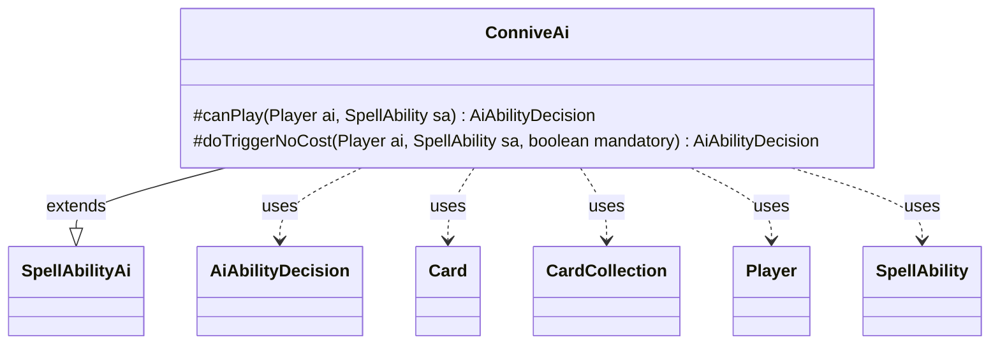

---
aliases:
  - ConniveAi
tags:
  - java/class
  - module/forge-ai
  - pkg/forge/ai/ability
fqn: forge.ai.ability.ConniveAi
package: forge.ai.ability
module: forge-ai
kind: Class
---

# ConniveAi

**Package:** `forge.ai.ability` &nbsp; **Module:** `forge-ai` &nbsp; **Kind:** Class



## Relationships
**Extends:**
- [[forge.ai.SpellAbilityAi|SpellAbilityAi]]
**Uses:**
- [[forge.ai.AiAbilityDecision|AiAbilityDecision]]
- [[forge.game.card.Card|Card]]
- [[forge.game.card.CardCollection|CardCollection]]
- [[forge.game.player.Player|Player]]
- [[forge.game.spellability.SpellAbility|SpellAbility]]

## Design Description

ConniveAi implements the AI control logic for the "Connive" keyword ability, extending `SpellAbilityAi` to override how the computer decides whether and how to play a connive effect. Because conniving draws and discards cards, `canPlay` first verifies the AI can draw, computes the connive count, and builds a `CardCollection` of legal targets from its battlefield, narrowing it with AI-specific target filters. When the target count scales with X, it sizes the payment to preserve a safety margin of cards in the library (and available mana) before greedily selecting the best creatures via `ComputerUtilCard`.

The two overrides separate proactive play from forced triggers: `doTriggerNoCost` honors a `mandatory` flag, first preferring the AI's own creatures, then falling back to opponents' and finally any legal target so a required trigger still resolves. Each path returns an `AiAbilityDecision` pairing a confidence score with an `AiPlayDecision`, expressing intent through Forge's standard decision protocol rather than raw booleans.

## Source
`forge-ai/src/main/java/forge/ai/ability/ConniveAi.java`

```java
package forge.ai.ability;

import forge.ai.*;
import forge.game.ability.AbilityUtils;
import forge.game.card.Card;
import forge.game.card.CardCollection;
import forge.game.card.CardLists;
import forge.game.player.Player;
import forge.game.spellability.SpellAbility;
import forge.game.zone.ZoneType;

public class ConniveAi extends SpellAbilityAi {
    @Override
    protected AiAbilityDecision canPlay(Player ai, SpellAbility sa) {
        if (!ai.canDraw()) {
            return new AiAbilityDecision(0, AiPlayDecision.CantPlayAi);
        }

        Card host = sa.getHostCard();

        final int num = AbilityUtils.calculateAmount(host, sa.getParamOrDefault("ConniveNum", "1"), sa);
        if (num == 0) {
            return new AiAbilityDecision(0, AiPlayDecision.CantPlayAi);
        }

        CardCollection list = CardLists.getTargetableCards(ai.getCardsIn(ZoneType.Battlefield), sa);

        // Filter AI-specific targets if provided
        list = ComputerUtil.filterAITgts(sa, ai, list, false);

        if ("X".equals(sa.getParam("TargetMax")) && "Count$xPaid".equals(sa.getSVar("X"))) {
            // TODO: consider making the library margin (currently hardcoded to 5) a configurable AI parameter
            int maxTargets = Math.min(list.size(), Math.max(0, ai.getCardsIn(ZoneType.Library).size() - 5));
            maxTargets = Math.min(maxTargets, ComputerUtilMana.getAvailableManaEstimate(ai));
            sa.setXManaCostPaid(maxTargets);
        }

        sa.resetTargets();
        while (sa.canAddMoreTarget()) {
            if ((list.isEmpty() && sa.isTargetNumberValid() && !sa.getTargets().isEmpty())) {
                return new AiAbilityDecision(100, AiPlayDecision.WillPlay);
            }

            if (list.isEmpty()) {
                // Still an empty list, but we have to choose something (mandatory); expand targeting to
                // include AI's own cards to see if there's anything targetable (e.g. Plague Belcher).
                list = CardLists.getTargetableCards(ai.getCardsIn(ZoneType.Battlefield), sa);
            }

            if (list.isEmpty()) {
                // Not mandatory, or the the list was regenerated and is still empty,
                // so return whether or not we found enough targets
                return new AiAbilityDecision(sa.isTargetNumberValid() ? 100 : 0, sa.isTargetNumberValid() ? AiPlayDecision.WillPlay : AiPlayDecision.CantPlayAi);
            }

            Card choice = ComputerUtilCard.getBestCreatureAI(list);

            if (choice != null) {
                sa.getTargets().add(choice);
                list.remove(choice);
            } else {
                // Didn't want to choose anything?
                list.clear();
            }
        }
        if (!sa.getTargets().isEmpty() && sa.isTargetNumberValid()) {
            return new AiAbilityDecision(100, AiPlayDecision.WillPlay);
        } else {
            return new AiAbilityDecision(0, AiPlayDecision.TargetingFailed);
        }
    }

    @Override
    protected AiAbilityDecision doTriggerNoCost(Player ai, SpellAbility sa, boolean mandatory) {
        if (!ai.canDraw() && !mandatory) {
            return new AiAbilityDecision(0, AiPlayDecision.CantPlayAi);
        }

        boolean preferred = true;
        CardCollection list = CardLists.getTargetableCards(ai.getCardsIn(ZoneType.Battlefield), sa);

        // Filter AI-specific targets if provided
        list = ComputerUtil.filterAITgts(sa, ai, list, false);

        sa.resetTargets();
        while (sa.canAddMoreTarget()) {
            if (mandatory) {
                if ((list.isEmpty() || !preferred) && sa.isTargetNumberValid()) {
                    return new AiAbilityDecision(100, AiPlayDecision.WillPlay);
                }

                if (list.isEmpty() && preferred) {
                    // If it's required to choose targets and the list is empty, get a new list
                    list = CardLists.getTargetableCards(ai.getOpponents().getCardsIn(ZoneType.Battlefield), sa);
                    preferred = false;
                }

                if (list.isEmpty()) {
                    // Still an empty list, but we have to choose something (mandatory); expand targeting to
                    // include AI's own cards to see if there's anything targetable (e.g. Plague Belcher).
                    list = CardLists.getTargetableCards(ai.getCardsIn(ZoneType.Battlefield), sa);
                }
            }

            if (list.isEmpty()) {
                // Not mandatory, or the the list was regenerated and is still empty,
                // so return whether or not we found enough targets
                return new AiAbilityDecision(sa.isTargetNumberValid() ? 100 : 0, sa.isTargetNumberValid() ? AiPlayDecision.WillPlay : AiPlayDecision.CantPlayAi);
            }

            Card choice = ComputerUtilCard.getBestCreatureAI(list);

            if (choice != null) {
                sa.getTargets().add(choice);
                list.remove(choice);
            } else {
                // Didn't want to choose anything?
                list.clear();
            }
        }
        return new AiAbilityDecision(
                sa.isTargetNumberValid() ? 100 : 0,
                sa.isTargetNumberValid() ? AiPlayDecision.WillPlay : AiPlayDecision.TargetingFailed
        );
    }

}
```

## Python
`forge/ai/ability/ConniveAi.py`

```python
from forge.ai.SpellAbilityAi import SpellAbilityAi
from forge.ai.AiAbilityDecision import AiAbilityDecision
from forge.ai.AiPlayDecision import AiPlayDecision
from forge.ai.ComputerUtil import ComputerUtil
from forge.ai.ComputerUtilCard import ComputerUtilCard
from forge.ai.ComputerUtilMana import ComputerUtilMana
from forge.game.ability.AbilityUtils import AbilityUtils
from forge.game.card.Card import Card
from forge.game.card.CardCollection import CardCollection
from forge.game.card.CardLists import CardLists
from forge.game.player.Player import Player
from forge.game.spellability.SpellAbility import SpellAbility
from forge.game.zone.ZoneType import ZoneType


class ConniveAi(SpellAbilityAi):
    def canPlay(self, ai: Player, sa: SpellAbility) -> AiAbilityDecision:
        if not ai.canDraw():
            return AiAbilityDecision(0, AiPlayDecision.CantPlayAi)

        host = sa.getHostCard()

        num = AbilityUtils.calculateAmount(host, sa.getParamOrDefault("ConniveNum", "1"), sa)
        if num == 0:
            return AiAbilityDecision(0, AiPlayDecision.CantPlayAi)

        list = CardLists.getTargetableCards(ai.getCardsIn(ZoneType.Battlefield), sa)

        # Filter AI-specific targets if provided
        list = ComputerUtil.filterAITgts(sa, ai, list, False)

        if "X" == sa.getParam("TargetMax") and "Count$xPaid" == sa.getSVar("X"):
            # TODO: consider making the library margin (currently hardcoded to 5) a configurable AI parameter
            maxTargets = min(list.size(), max(0, ai.getCardsIn(ZoneType.Library).size() - 5))
            maxTargets = min(maxTargets, ComputerUtilMana.getAvailableManaEstimate(ai))
            sa.setXManaCostPaid(maxTargets)

        sa.resetTargets()
        while sa.canAddMoreTarget():
            if list.isEmpty() and sa.isTargetNumberValid() and not sa.getTargets().isEmpty():
                return AiAbilityDecision(100, AiPlayDecision.WillPlay)

            if list.isEmpty():
                # Still an empty list, but we have to choose something (mandatory); expand targeting to
                # include AI's own cards to see if there's anything targetable (e.g. Plague Belcher).
                list = CardLists.getTargetableCards(ai.getCardsIn(ZoneType.Battlefield), sa)

            if list.isEmpty():
                # Not mandatory, or the the list was regenerated and is still empty,
                # so return whether or not we found enough targets
                return AiAbilityDecision(100 if sa.isTargetNumberValid() else 0, AiPlayDecision.WillPlay if sa.isTargetNumberValid() else AiPlayDecision.CantPlayAi)

            choice = ComputerUtilCard.getBestCreatureAI(list)

            if choice is not None:
                sa.getTargets().add(choice)
                list.remove(choice)
            else:
                # Didn't want to choose anything?
                list.clear()
        if not sa.getTargets().isEmpty() and sa.isTargetNumberValid():
            return AiAbilityDecision(100, AiPlayDecision.WillPlay)
        else:
            return AiAbilityDecision(0, AiPlayDecision.TargetingFailed)

    def doTriggerNoCost(self, ai: Player, sa: SpellAbility, mandatory: bool) -> AiAbilityDecision:
        if not ai.canDraw() and not mandatory:
            return AiAbilityDecision(0, AiPlayDecision.CantPlayAi)

        preferred = True
        list = CardLists.getTargetableCards(ai.getCardsIn(ZoneType.Battlefield), sa)

        # Filter AI-specific targets if provided
        list = ComputerUtil.filterAITgts(sa, ai, list, False)

        sa.resetTargets()
        while sa.canAddMoreTarget():
            if mandatory:
                if (list.isEmpty() or not preferred) and sa.isTargetNumberValid():
                    return AiAbilityDecision(100, AiPlayDecision.WillPlay)

                if list.isEmpty() and preferred:
                    # If it's required to choose targets and the list is empty, get a new list
                    list = CardLists.getTargetableCards(ai.getOpponents().getCardsIn(ZoneType.Battlefield), sa)
                    preferred = False

                if list.isEmpty():
                    # Still an empty list, but we have to choose something (mandatory); expand targeting to
                    # include AI's own cards to see if there's anything targetable (e.g. Plague Belcher).
                    list = CardLists.getTargetableCards(ai.getCardsIn(ZoneType.Battlefield), sa)

            if list.isEmpty():
                # Not mandatory, or the the list was regenerated and is still empty,
                # so return whether or not we found enough targets
                return AiAbilityDecision(100 if sa.isTargetNumberValid() else 0, AiPlayDecision.WillPlay if sa.isTargetNumberValid() else AiPlayDecision.CantPlayAi)

            choice = ComputerUtilCard.getBestCreatureAI(list)

            if choice is not None:
                sa.getTargets().add(choice)
                list.remove(choice)
            else:
                # Didn't want to choose anything?
                list.clear()
        return AiAbilityDecision(
            100 if sa.isTargetNumberValid() else 0,
            AiPlayDecision.WillPlay if sa.isTargetNumberValid() else AiPlayDecision.TargetingFailed
        )
```
