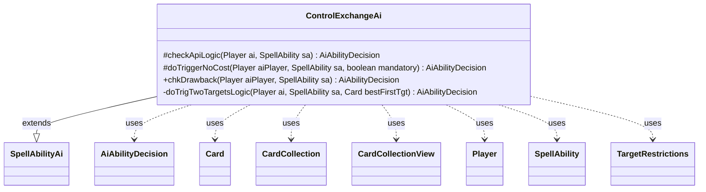

---
aliases:
  - ControlExchangeAi
tags:
  - java/class
  - module/forge-ai
  - pkg/forge/ai/ability
fqn: forge.ai.ability.ControlExchangeAi
package: forge.ai.ability
module: forge-ai
kind: Class
---

# ControlExchangeAi

**Package:** `forge.ai.ability` &nbsp; **Module:** `forge-ai` &nbsp; **Kind:** Class



## Relationships
**Extends:**
- [[forge.ai.SpellAbilityAi|SpellAbilityAi]]
**Uses:**
- [[forge.ai.AiAbilityDecision|AiAbilityDecision]]
- [[forge.game.card.Card|Card]]
- [[forge.game.card.CardCollection|CardCollection]]
- [[forge.game.card.CardCollectionView|CardCollectionView]]
- [[forge.game.player.Player|Player]]
- [[forge.game.spellability.SpellAbility|SpellAbility]]
- [[forge.game.spellability.TargetRestrictions|TargetRestrictions]]

## Design Description

ControlExchangeAi supplies the AI decision-making logic for control-exchange abilities (such as Magic's "swap control" effects), determining whether and how the computer player should target cards when resolving or casting them. As a concrete subclass of SpellAbilityAi, it overrides the framework's hooks—checkApiLogic for normal play, doTriggerNoCost for triggered use, and chkDrawback for sub-abilities—each returning an AiAbilityDecision that pairs a confidence score with a play verdict.

Its core intent is value-driven targeting: it filters battlefield cards through the SpellAbility's TargetRestrictions, evaluates candidates via ComputerUtilCard, and seeks the opponent's best card while giving away its own worst, only committing when the gain clears a margin (e.g. creature-evaluation or CMC thresholds). It branches on AILogic parameters ("PowerStruggle", "TrigTwoTargets") to delegate specialized two-target handling, and respects mandatory triggers by playing even unfavorable exchanges. Collaborators like Card, CardCollection, and Player are used transiently to build and assess these candidate lists.

## Source
`forge-ai/src/main/java/forge/ai/ability/ControlExchangeAi.java`

```java
package forge.ai.ability;

import com.google.common.collect.Lists;
import forge.ai.*;
import forge.game.ability.AbilityUtils;
import forge.game.card.Card;
import forge.game.card.CardCollection;
import forge.game.card.CardCollectionView;
import forge.game.card.CardLists;
import forge.game.player.Player;
import forge.game.spellability.SpellAbility;
import forge.game.spellability.TargetRestrictions;
import forge.game.zone.ZoneType;

public class ControlExchangeAi extends SpellAbilityAi {

/* (non-Javadoc)
 * @see forge.card.abilityfactory.SpellAiLogic#canPlayAI(forge.game.player.Player, java.util.Map, forge.card.spellability.SpellAbility)
 */
    @Override
    protected AiAbilityDecision checkApiLogic(Player ai, final SpellAbility sa) {
        Card object1 = null;
        Card object2 = null;
        final TargetRestrictions tgt = sa.getTargetRestrictions();
        sa.resetTargets();

        CardCollection list =
                CardLists.getValidCards(ai.getOpponents().getCardsIn(ZoneType.Battlefield), tgt.getValidTgts(), ai, sa.getHostCard(), sa);
        // AI won't try to grab cards that are filtered out of AI decks on purpose
        list = CardLists.filter(list, c -> !ComputerUtilCard.isCardRemAIDeck(c) && c.canBeTargetedBy(sa));
        object1 = ComputerUtilCard.getBestAI(list);
        if (sa.hasParam("Defined")) {
            object2 = AbilityUtils.getDefinedCards(sa.getHostCard(), sa.getParam("Defined"), sa).get(0);
        } else if (sa.getMinTargets() > 1) {
            CardCollectionView list2 = ai.getCardsIn(ZoneType.Battlefield);
            list2 = CardLists.getValidCards(list2, tgt.getValidTgts(), ai, sa.getHostCard(), sa);
            object2 = ComputerUtilCard.getWorstAI(list2);
            sa.getTargets().add(object2);
        }
        if (object1 == null || object2 == null) {
            return new AiAbilityDecision(0, AiPlayDecision.TargetingFailed);
        }
        if (ComputerUtilCard.evaluateCreature(object1) > ComputerUtilCard.evaluateCreature(object2) + 40) {
            sa.getTargets().add(object1);
            return new AiAbilityDecision(100, AiPlayDecision.WillPlay);
        }
        return new AiAbilityDecision(0, AiPlayDecision.TargetingFailed);
    }

    @Override
    protected AiAbilityDecision doTriggerNoCost(Player aiPlayer, SpellAbility sa, boolean mandatory) {
        if (!sa.usesTargeting()) {
            if (mandatory) {
                return new AiAbilityDecision(100, AiPlayDecision.WillPlay);
            }
        } else if (mandatory) {
            AiAbilityDecision decision = chkDrawback(aiPlayer, sa);
            if (sa.isTargetNumberValid()) {
                return new AiAbilityDecision(100, AiPlayDecision.WillPlay);
            }

            return decision;
        } else {
            return canPlay(aiPlayer, sa);
        }
        return new AiAbilityDecision(100, AiPlayDecision.WillPlay);
    }

    @Override
    public AiAbilityDecision chkDrawback(Player aiPlayer, SpellAbility sa) {
        if (!sa.usesTargeting()) {
            return new AiAbilityDecision(100, AiPlayDecision.WillPlay);
        }

        final TargetRestrictions tgt = sa.getTargetRestrictions();

        if ("PowerStruggle".equals(sa.getParam("AILogic"))) {
            return SpecialCardAi.PowerStruggle.considerSecondTarget(aiPlayer, sa);
        }

        // for TrigTwoTargets logic, only get the opponents' cards for the first target
        CardCollectionView unfilteredList = "TrigTwoTargets".equals(sa.getParam("AILogic")) ?
                aiPlayer.getOpponents().getCardsIn(ZoneType.Battlefield) :
                aiPlayer.getGame().getCardsIn(ZoneType.Battlefield);

        CardCollection list = CardLists.getValidCards(unfilteredList,
                tgt.getValidTgts(), aiPlayer, sa.getHostCard(), sa);

        // only select the cards that can be targeted
        list = CardLists.getTargetableCards(list, sa);

        if (list.isEmpty())
            return new AiAbilityDecision(0, AiPlayDecision.TargetingFailed);

        Card best = ComputerUtilCard.getBestAI(list);

        // add best Target:
        // do it here already even if we don't want to play this as it might be for targeting a trigger
        sa.getTargets().add(best);
        
        // if Param has Defined, check if the best Target is better than the Defined
        if (sa.hasParam("Defined") && (!sa.isTrigger() || sa.getRootAbility().isOptionalTrigger())) {
            final Card object = AbilityUtils.getDefinedCards(sa.getHostCard(), sa.getParam("Defined"), sa).get(0);
            // TODO add evaluate Land if able
            final Card realBest = ComputerUtilCard.getBestAI(Lists.newArrayList(best, object));

            // Defined card is better than this one, try to avoid trade
            if (!best.equals(realBest)) {
                return new AiAbilityDecision(0, AiPlayDecision.TargetingFailed);
            }
        }

        // second target needed (the AI's own worst)
        if ("TrigTwoTargets".equals(sa.getParam("AILogic"))) {
            return doTrigTwoTargetsLogic(aiPlayer, sa, best);
        }

        return new AiAbilityDecision(100, AiPlayDecision.WillPlay);
    }   

    private AiAbilityDecision doTrigTwoTargetsLogic(Player ai, SpellAbility sa, Card bestFirstTgt) {
        final TargetRestrictions tgt = sa.getTargetRestrictions();
        final int creatureThreshold = 100; // TODO: make this configurable from the AI profile
        final int nonCreatureThreshold = 2;

        CardCollection list = CardLists.getValidCards(ai.getCardsIn(ZoneType.Battlefield),
                tgt.getValidTgts(), ai, sa.getHostCard(), sa);

        // only select the cards that can be targeted
        list = CardLists.getTargetableCards(list, sa);

        if (list.isEmpty()) {
            return new AiAbilityDecision(0, AiPlayDecision.TargetingFailed);
        }

        Card aiWorst = ComputerUtilCard.getWorstAI(list);
        if (aiWorst == null) {
            return new AiAbilityDecision(0, AiPlayDecision.TargetingFailed);
        }

        if (aiWorst != bestFirstTgt) {
            if (bestFirstTgt.isCreature() && aiWorst.isCreature()) {
                if ((ComputerUtilCard.evaluateCreature(bestFirstTgt) > ComputerUtilCard.evaluateCreature(aiWorst) + creatureThreshold) || sa.isMandatory()) {
                    sa.getTargets().add(aiWorst);
                    return new AiAbilityDecision(100, AiPlayDecision.WillPlay);
                }
            } else {
                // TODO: compare non-creatures by CMC - can be improved, at least shouldn't give control of things like the Power Nine
                if ((bestFirstTgt.getCMC() > aiWorst.getCMC() + nonCreatureThreshold) || sa.isMandatory()) {
                    sa.getTargets().add(aiWorst);
                    return new AiAbilityDecision(100, AiPlayDecision.WillPlay);
                }
            }
        }

        sa.clearTargets();
        return new AiAbilityDecision(0, AiPlayDecision.CantPlayAi);
    }
}
```
