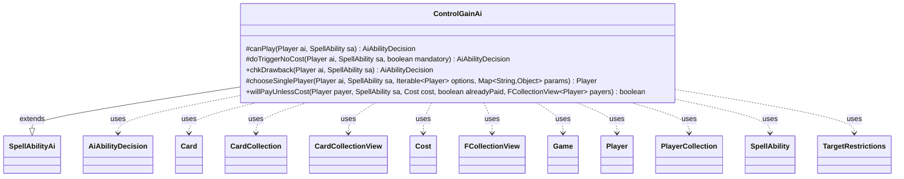

---
aliases:
  - ControlGainAi
tags:
  - java/class
  - module/forge-ai
  - pkg/forge/ai/ability
fqn: forge.ai.ability.ControlGainAi
package: forge.ai.ability
module: forge-ai
kind: Class
---

# ControlGainAi

**Package:** `forge.ai.ability`   **Module:** `forge-ai`   **Kind:** Class



## Relationships
**Extends:**
- [[forge.ai.SpellAbilityAi|SpellAbilityAi]]
**Uses:**
- [[forge.ai.AiAbilityDecision|AiAbilityDecision]]
- [[forge.game.Game|Game]]
- [[forge.game.card.Card|Card]]
- [[forge.game.card.CardCollection|CardCollection]]
- [[forge.game.card.CardCollectionView|CardCollectionView]]
- [[forge.game.cost.Cost|Cost]]
- [[forge.game.player.Player|Player]]
- [[forge.game.player.PlayerCollection|PlayerCollection]]
- [[forge.game.spellability.SpellAbility|SpellAbility]]
- [[forge.game.spellability.TargetRestrictions|TargetRestrictions]]
- [[forge.util.collect.FCollectionView|FCollectionView]]

## Design Description

ControlGainAi is the AI decision strategy for "gain control" spell abilities (e.g. Mind Control–style effects), part of Forge's `forge.ai.ability` family of per-effect AI handlers. Extending `SpellAbilityAi`, it overrides the standard hooks — `canPlay`, `doTriggerNoCost`, `chkDrawback`, `chooseSinglePlayer`, and `willPayUnlessCost` — to decide whether the AI should cast the effect and which permanents to seize, returning its verdict as an `AiAbilityDecision`.

Its core responsibility is target selection: it collects opponents' battlefield permanents (`CardCollection`/`PlayerCollection`), filters out cards it cannot usefully keep — non-attacking creatures, things leaving play end-of-turn when control is temporary, and cards flagged as removed-from-AI — then greedily picks the best target per type via `ComputerUtilCard` heuristics, respecting `TargetRestrictions` and must-target static abilities. Notable design intent includes avoiding control-theft that strands the AI mid-combat, special-casing Donate-style "give away" effects, and honoring `UnlessSwitched` payment logic so the AI only pays to retain genuinely controllable permanents.

## Source
`forge-ai/src/main/java/forge/ai/ability/ControlGainAi.java`

```java
/*
 * Forge: Play Magic: the Gathering.
 * Copyright (C) 2011  Forge Team
 *
 * This program is free software: you can redistribute it and/or modify
 * it under the terms of the GNU General Public License as published by
 * the Free Software Foundation, either version 3 of the License, or
 * (at your option) any later version.
 * 
 * This program is distributed in the hope that it will be useful,
 * but WITHOUT ANY WARRANTY; without even the implied warranty of
 * MERCHANTABILITY or FITNESS FOR A PARTICULAR PURPOSE.  See the
 * GNU General Public License for more details.
 * 
 * You should have received a copy of the GNU General Public License
 * along with this program.  If not, see <http://www.gnu.org/licenses/>.
 */
package forge.ai.ability;

import com.google.common.collect.Iterables;
import com.google.common.collect.Lists;
import forge.ai.*;
import forge.game.Game;
import forge.game.ability.AbilityUtils;
import forge.game.card.Card;
import forge.game.card.CardCollection;
import forge.game.card.CardCollectionView;
import forge.game.card.CardLists;
import forge.game.cost.Cost;
import forge.game.phase.PhaseType;
import forge.game.player.Player;
import forge.game.player.PlayerCollection;
import forge.game.player.PlayerPredicates;
import forge.game.spellability.SpellAbility;
import forge.game.spellability.TargetRestrictions;
import forge.game.staticability.StaticAbilityMustTarget;
import forge.game.zone.ZoneType;
import forge.util.Aggregates;
import forge.util.collect.FCollectionView;

import java.util.List;
import java.util.Map;

/**
 * <p>
 * AbilityFactory_GainControl class.
 * </p>
 * 
 * @author Forge
 * @version $Id: AbilityFactoryGainControl.java 17764 2012-10-29 11:04:18Z Sloth $
 */
public class ControlGainAi extends SpellAbilityAi {
    @Override
    protected AiAbilityDecision canPlay(final Player ai, final SpellAbility sa) {
        final List<String> lose = Lists.newArrayList();

        if (sa.hasParam("LoseControl")) {
            lose.addAll(Lists.newArrayList(sa.getParam("LoseControl").split(",")));
        }

        final TargetRestrictions tgt = sa.getTargetRestrictions();
        final Game game = ai.getGame();
        final PlayerCollection opponents = ai.getOpponents();

        // if Defined, then don't worry about targeting
        if (tgt == null) {
            if (sa.hasParam("AllValid")) {
                CardCollectionView tgtCards = opponents.getCardsIn(ZoneType.Battlefield);
                tgtCards = AbilityUtils.filterListByType(tgtCards, sa.getParam("AllValid"), sa);

                if (tgtCards.isEmpty()) {
                    return new AiAbilityDecision(0, AiPlayDecision.MissingNeededCards);
                }
            }
            return new AiAbilityDecision(100, AiPlayDecision.WillPlay);
        } else {
            sa.resetTargets();
            if (sa.hasParam("TargetingPlayer")) {
                Player targetingPlayer = AbilityUtils.getDefinedPlayers(sa.getHostCard(), sa.getParam("TargetingPlayer"), sa).get(0);
                sa.setTargetingPlayer(targetingPlayer);
                // TODO these blocks should continue checking with the worst
                // and if targetingPlayer is AI set the target directly (instead of using the Runnable)
                if (CardLists.getTargetableCards(ai.getGame().getCardsIn(sa.getTargetRestrictions().getZone()), sa).isEmpty()) {
                    return new AiAbilityDecision(0, AiPlayDecision.TargetingFailed);
                }
                return new AiAbilityDecision(100, AiPlayDecision.WillPlay);
            }

            if (tgt.canOnlyTgtOpponent()) {
                List<Player> oppList = opponents.filter(PlayerPredicates.isTargetableBy(sa));

                if (oppList.isEmpty()) {
                    return new AiAbilityDecision(0, AiPlayDecision.TargetingFailed);
                }

                if (tgt.isRandomTarget()) {
                    sa.getTargets().add(Aggregates.random(oppList));
                } else {
                    sa.getTargets().add(oppList.get(0));
                }
            }
        }

        // Don't steal something if I can't Attack without, or prevent it from blocking at least
        if (lose.contains("EOT")
                && game.getPhaseHandler().getPhase().isAfter(PhaseType.COMBAT_DECLARE_ATTACKERS)
                && !sa.isTrigger()) {
            return new AiAbilityDecision(0, AiPlayDecision.CantPlayAi);
        }

        if (sa.hasParam("Defined")) {
            // no need to target, we'll pick up the target from Defined
            return new AiAbilityDecision(100, AiPlayDecision.WillPlay);
        }

        CardCollection list = opponents.getCardsIn(ZoneType.Battlefield);

        // Filter AI-specific targets if provided
        list = ComputerUtil.filterAITgts(sa, ai, list, false);

        // AI won't try to grab cards that are filtered out of AI decks on purpose
        list = CardLists.filter(list, c -> {
            if (!sa.canTarget(c)) {
                return false;
            }
            if (sa.isTrigger()) {
                return true;
            }

            if (!c.canBeControlledBy(ai)) {
                return false;
            }

            // do not take perm control on something that leaves the play end of turn
            if (!lose.contains("EOT") && c.hasSVar("EndOfTurnLeavePlay")) {
                return false;
            }

            if (c.isCreature()) {
                if (c.getNetCombatDamage() <= 0) {
                    return false;
                }

                // can not attack any opponent
                boolean found = false;
                for (final Player opp : opponents) {
                    if (ComputerUtilCombat.canAttackNextTurn(c, opp)) {
                        found = true;
                        break;
                    }
                }
                if (!found) {
                    return false;
                }
            }

            // do not take control on something it doesn't know how to use
            return !ComputerUtilCard.isCardRemAIDeck(c);
        });

        if (list.isEmpty()) {
            return new AiAbilityDecision(0, AiPlayDecision.TargetingFailed);
        }

        int creatures = 0, artifacts = 0, planeswalkers = 0, lands = 0, enchantments = 0;

        for (final Card c : list) {
            if (c.isCreature()) {
                creatures++;
            }
            if (c.isArtifact()) {
                artifacts++;
            }
            if (c.isLand()) {
                lands++;
            }
            if (c.isEnchantment()) {
                enchantments++;
            }
            if (c.isPlaneswalker()) {
                planeswalkers++;
            }
        }

        while (sa.canAddMoreTarget()) {
            Card t = null;

            if (list.isEmpty()) {
                if (sa.getTargets().size() < sa.getMinTargets() || sa.getTargets().size() == 0) {
                    sa.resetTargets();
                    return new AiAbilityDecision(0, AiPlayDecision.TargetingFailed);
                } else {
                    // TODO is this good enough? for up to amounts?
                    break;
                }
            }

            // TODO check life of controller and consider stealing from another opponent so the risk of your army disappearing is spread out
            while (t == null) {
                // filter by MustTarget requirement
                CardCollection originalList = new CardCollection(list);

                list = CardLists.canSubsequentlyTarget(list, sa);

                boolean mustTargetFiltered = StaticAbilityMustTarget.filterMustTargetCards(ai, list, sa);

                if (planeswalkers > 0) {
                    t = ComputerUtilCard.getBestPlaneswalkerAI(list);
                } else if (creatures > 0) {
                    t = ComputerUtilCard.getBestCreatureAI(list);
                } else if (artifacts > 0) {
                    t = ComputerUtilCard.getBestArtifactAI(list);
                } else if (lands > 0) {
                    t = ComputerUtilCard.getBestLandAI(list);
                } else if (enchantments > 0) {
                    t = ComputerUtilCard.getBestEnchantmentAI(list, sa, false);
                } else {
                    t = ComputerUtilCard.getMostExpensivePermanentAI(list);
                }

                if (t != null) {
                    if (t.isCreature())
                        creatures--;
                    if (t.isPlaneswalker())
                        planeswalkers--;
                    if (t.isLand())
                        lands--;
                    if (t.isArtifact())
                        artifacts--;
                    if (t.isEnchantment())
                        enchantments--;
                }

                // Restore original list for next loop if filtered by MustTarget requirement
                if (mustTargetFiltered) {
                    list = originalList;
                }

                if (!sa.canTarget(t)) {
                    list.remove(t);
                    t = null;
                    if (list.isEmpty()) {
                        break;
                    }
                }
            }

            if (t != null) {
                sa.getTargets().add(t);
                list.remove(t);
            }
        }

        return new AiAbilityDecision(
                sa.isTargetNumberValid() ? 100 : 0,
                sa.isTargetNumberValid() ? AiPlayDecision.WillPlay : AiPlayDecision.TargetingFailed);
    }

    @Override
    protected AiAbilityDecision doTriggerNoCost(Player ai, SpellAbility sa, boolean mandatory) {
        if (!sa.usesTargeting()) {
            if (mandatory) {
                return new AiAbilityDecision(100, AiPlayDecision.WillPlay);
            }
        } else {
            if (sa.hasParam("TargetingPlayer") || (mandatory && !this.canPlay(ai, sa).willingToPlay())) {
                if (sa.getTargetRestrictions().canOnlyTgtOpponent()) {
                    List<Player> oppList = ai.getOpponents().filter(PlayerPredicates.isTargetableBy(sa));
                    if (oppList.isEmpty()) {
                        return new AiAbilityDecision(0, AiPlayDecision.TargetingFailed);
                    }
                    sa.getTargets().add(Aggregates.random(oppList));
                    return new AiAbilityDecision(100, AiPlayDecision.WillPlay);
                }

                List<Card> list = CardLists.getTargetableCards(ai.getCardsIn(ZoneType.Battlefield), sa);
                if (list.isEmpty()) {
                    return new AiAbilityDecision(0, AiPlayDecision.TargetingFailed);
                }
                sa.getTargets().add(ComputerUtilCard.getWorstAI(list));
            }
        }

        return new AiAbilityDecision(100, AiPlayDecision.WillPlay);
    }

    @Override
    public AiAbilityDecision chkDrawback(final Player ai, SpellAbility sa) {
        final Game game = ai.getGame();

        // Special card logic that is processed elsewhere
        if (sa.hasParam("AILogic")) {
            if ("DonateTargetPerm".equals(sa.getParam("AILogic"))) {
                // Donate step 2 - target a donatable permanent.
                return SpecialCardAi.Donate.considerDonatingPermanent(ai, sa);
            }
        }

        if (!sa.usesTargeting()) {
            if (sa.hasParam("AllValid")) {
                CardCollectionView tgtCards = ai.getOpponents().getCardsIn(ZoneType.Battlefield);
                tgtCards = AbilityUtils.filterListByType(tgtCards, sa.getParam("AllValid"), sa);
                if (tgtCards.isEmpty()) {
                    return new AiAbilityDecision(0, AiPlayDecision.MissingNeededCards);
                }
            }
            final List<String> lose = Lists.newArrayList();

            if (sa.hasParam("LoseControl")) {
                lose.addAll(Lists.newArrayList(sa.getParam("LoseControl").split(",")));
            }

            if (lose.contains("EOT")
                    && game.getPhaseHandler().getPhase().isAfter(PhaseType.COMBAT_DECLARE_ATTACKERS)) {
                return new AiAbilityDecision(0, AiPlayDecision.AnotherTime);
            } else {
                return new AiAbilityDecision(100, AiPlayDecision.WillPlay);
            }
        } else {
            return this.canPlay(ai, sa);
        }
    }

    @Override
    protected Player chooseSinglePlayer(Player ai, SpellAbility sa, Iterable<Player> options, Map<String, Object> params) {
        final List<Card> cards = Lists.newArrayList();
        for (Player p : options) {
            cards.addAll(p.getCreaturesInPlay());
        }
        Card chosen = ComputerUtilCard.getBestCreatureAI(cards);
        return chosen != null ? chosen.getController() : Iterables.getFirst(options, null);
    }

    @Override
    public boolean willPayUnlessCost(Player payer, SpellAbility sa, Cost cost, boolean alreadyPaid, FCollectionView<Player> payers) {
        // Pay to gain Control
        if (sa.hasParam("UnlessSwitched")) {
            final Card host = sa.getHostCard();

            final Card gameCard = host.getGame().getCardState(host, null);
            if (gameCard == null
                    || !gameCard.isInPlay() // not in play
                    || payer.equals(gameCard.getController()) // already in control
                    ) {
                return false;
            }
        }

        return super.willPayUnlessCost(payer, sa, cost, alreadyPaid, payers);
    }
}
```

## Python
`forge/ai/ability/ControlGainAi.py`

```python
from forge.ai.AiAbilityDecision import AiAbilityDecision
from forge.ai.AiPlayDecision import AiPlayDecision
from forge.ai.ComputerUtil import ComputerUtil
from forge.ai.ComputerUtilCard import ComputerUtilCard
from forge.ai.ComputerUtilCombat import ComputerUtilCombat
from forge.ai.SpecialCardAi import SpecialCardAi
from forge.ai.SpellAbilityAi import SpellAbilityAi
from forge.game.Game import Game
from forge.game.ability.AbilityUtils import AbilityUtils
from forge.game.card.Card import Card
from forge.game.card.CardCollection import CardCollection
from forge.game.card.CardCollectionView import CardCollectionView
from forge.game.card.CardLists import CardLists
from forge.game.cost.Cost import Cost
from forge.game.phase.PhaseType import PhaseType
from forge.game.player.Player import Player
from forge.game.player.PlayerCollection import PlayerCollection
from forge.game.player.PlayerPredicates import PlayerPredicates
from forge.game.spellability.SpellAbility import SpellAbility
from forge.game.spellability.TargetRestrictions import TargetRestrictions
from forge.game.staticability.StaticAbilityMustTarget import StaticAbilityMustTarget
from forge.game.zone.ZoneType import ZoneType
from forge.util.Aggregates import Aggregates
from forge.util.collect.FCollectionView import FCollectionView

from typing import Iterable, List, Map


class ControlGainAi(SpellAbilityAi):
    def canPlay(self, ai: Player, sa: SpellAbility) -> AiAbilityDecision:
        lose: list[str] = []

        if sa.hasParam("LoseControl"):
            lose.extend(sa.getParam("LoseControl").split(","))

        tgt = sa.getTargetRestrictions()
        game = ai.getGame()
        opponents = ai.getOpponents()

        # if Defined, then don't worry about targeting
        if tgt is None:
            if sa.hasParam("AllValid"):
                tgtCards = opponents.getCardsIn(ZoneType.Battlefield)
                tgtCards = AbilityUtils.filterListByType(tgtCards, sa.getParam("AllValid"), sa)

                if tgtCards.isEmpty():
                    return AiAbilityDecision(0, AiPlayDecision.MissingNeededCards)
            return AiAbilityDecision(100, AiPlayDecision.WillPlay)
        else:
            sa.resetTargets()
            if sa.hasParam("TargetingPlayer"):
                targetingPlayer = AbilityUtils.getDefinedPlayers(sa.getHostCard(), sa.getParam("TargetingPlayer"), sa).get(0)
                sa.setTargetingPlayer(targetingPlayer)
                # TODO these blocks should continue checking with the worst
                # and if targetingPlayer is AI set the target directly (instead of using the Runnable)
                if CardLists.getTargetableCards(ai.getGame().getCardsIn(sa.getTargetRestrictions().getZone()), sa).isEmpty():
                    return AiAbilityDecision(0, AiPlayDecision.TargetingFailed)
                return AiAbilityDecision(100, AiPlayDecision.WillPlay)

            if tgt.canOnlyTgtOpponent():
                oppList = opponents.filter(PlayerPredicates.isTargetableBy(sa))

                if oppList.isEmpty():
                    return AiAbilityDecision(0, AiPlayDecision.TargetingFailed)

                if tgt.isRandomTarget():
                    sa.getTargets().add(Aggregates.random(oppList))
                else:
                    sa.getTargets().add(oppList.get(0))

        # Don't steal something if I can't Attack without, or prevent it from blocking at least
        if (lose.__contains__("EOT")
                and game.getPhaseHandler().getPhase().isAfter(PhaseType.COMBAT_DECLARE_ATTACKERS)
                and not sa.isTrigger()):
            return AiAbilityDecision(0, AiPlayDecision.CantPlayAi)

        if sa.hasParam("Defined"):
            # no need to target, we'll pick up the target from Defined
            return AiAbilityDecision(100, AiPlayDecision.WillPlay)

        list = opponents.getCardsIn(ZoneType.Battlefield)

        # Filter AI-specific targets if provided
        list = ComputerUtil.filterAITgts(sa, ai, list, False)

        # AI won't try to grab cards that are filtered out of AI decks on purpose
        def _keep(c: Card) -> bool:
            if not sa.canTarget(c):
                return False
            if sa.isTrigger():
                return True

            if not c.canBeControlledBy(ai):
                return False

            # do not take perm control on something that leaves the play end of turn
            if "EOT" not in lose and c.hasSVar("EndOfTurnLeavePlay"):
                return False

            if c.isCreature():
                if c.getNetCombatDamage() <= 0:
                    return False

                # can not attack any opponent
                found = False
                for opp in opponents:
                    if ComputerUtilCombat.canAttackNextTurn(c, opp):
                        found = True
                        break
                if not found:
                    return False

            # do not take control on something it doesn't know how to use
            return not ComputerUtilCard.isCardRemAIDeck(c)

        list = CardLists.filter(list, _keep)

        if list.isEmpty():
            return AiAbilityDecision(0, AiPlayDecision.TargetingFailed)

        creatures = 0
        artifacts = 0
        planeswalkers = 0
        lands = 0
        enchantments = 0

        for c in list:
            if c.isCreature():
                creatures += 1
            if c.isArtifact():
                artifacts += 1
            if c.isLand():
                lands += 1
            if c.isEnchantment():
                enchantments += 1
            if c.isPlaneswalker():
                planeswalkers += 1

        while sa.canAddMoreTarget():
            t = None

            if list.isEmpty():
                if sa.getTargets().size() < sa.getMinTargets() or sa.getTargets().size() == 0:
                    sa.resetTargets()
                    return AiAbilityDecision(0, AiPlayDecision.TargetingFailed)
                else:
                    # TODO is this good enough? for up to amounts?
                    break

            # TODO check life of controller and consider stealing from another opponent so the risk of your army disappearing is spread out
            while t is None:
                # filter by MustTarget requirement
                originalList = CardCollection(list)

                list = CardLists.canSubsequentlyTarget(list, sa)

                mustTargetFiltered = StaticAbilityMustTarget.filterMustTargetCards(ai, list, sa)

                if planeswalkers > 0:
                    t = ComputerUtilCard.getBestPlaneswalkerAI(list)
                elif creatures > 0:
                    t = ComputerUtilCard.getBestCreatureAI(list)
                elif artifacts > 0:
                    t = ComputerUtilCard.getBestArtifactAI(list)
                elif lands > 0:
                    t = ComputerUtilCard.getBestLandAI(list)
                elif enchantments > 0:
                    t = ComputerUtilCard.getBestEnchantmentAI(list, sa, False)
                else:
                    t = ComputerUtilCard.getMostExpensivePermanentAI(list)

                if t is not None:
                    if t.isCreature():
                        creatures -= 1
                    if t.isPlaneswalker():
                        planeswalkers -= 1
                    if t.isLand():
                        lands -= 1
                    if t.isArtifact():
                        artifacts -= 1
                    if t.isEnchantment():
                        enchantments -= 1

                # Restore original list for next loop if filtered by MustTarget requirement
                if mustTargetFiltered:
                    list = originalList

                if not sa.canTarget(t):
                    list.remove(t)
                    t = None
                    if list.isEmpty():
                        break

            if t is not None:
                sa.getTargets().add(t)
                list.remove(t)

        return AiAbilityDecision(
            100 if sa.isTargetNumberValid() else 0,
            AiPlayDecision.WillPlay if sa.isTargetNumberValid() else AiPlayDecision.TargetingFailed)

    def doTriggerNoCost(self, ai: Player, sa: SpellAbility, mandatory: bool) -> AiAbilityDecision:
        if not sa.usesTargeting():
            if mandatory:
                return AiAbilityDecision(100, AiPlayDecision.WillPlay)
        else:
            if sa.hasParam("TargetingPlayer") or (mandatory and not self.canPlay(ai, sa).willingToPlay()):
                if sa.getTargetRestrictions().canOnlyTgtOpponent():
                    oppList = ai.getOpponents().filter(PlayerPredicates.isTargetableBy(sa))
                    if oppList.isEmpty():
                        return AiAbilityDecision(0, AiPlayDecision.TargetingFailed)
                    sa.getTargets().add(Aggregates.random(oppList))
                    return AiAbilityDecision(100, AiPlayDecision.WillPlay)

                list = CardLists.getTargetableCards(ai.getCardsIn(ZoneType.Battlefield), sa)
                if list.isEmpty():
                    return AiAbilityDecision(0, AiPlayDecision.TargetingFailed)
                sa.getTargets().add(ComputerUtilCard.getWorstAI(list))

        return AiAbilityDecision(100, AiPlayDecision.WillPlay)

    def chkDrawback(self, ai: Player, sa: SpellAbility) -> AiAbilityDecision:
        game = ai.getGame()

        # Special card logic that is processed elsewhere
        if sa.hasParam("AILogic"):
            if "DonateTargetPerm" == sa.getParam("AILogic"):
                # Donate step 2 - target a donatable permanent.
                return SpecialCardAi.Donate.considerDonatingPermanent(ai, sa)

        if not sa.usesTargeting():
            if sa.hasParam("AllValid"):
                tgtCards = ai.getOpponents().getCardsIn(ZoneType.Battlefield)
                tgtCards = AbilityUtils.filterListByType(tgtCards, sa.getParam("AllValid"), sa)
                if tgtCards.isEmpty():
                    return AiAbilityDecision(0, AiPlayDecision.MissingNeededCards)
            lose: list[str] = []

            if sa.hasParam("LoseControl"):
                lose.extend(sa.getParam("LoseControl").split(","))

            if ("EOT" in lose
                    and game.getPhaseHandler().getPhase().isAfter(PhaseType.COMBAT_DECLARE_ATTACKERS)):
                return AiAbilityDecision(0, AiPlayDecision.AnotherTime)
            else:
                return AiAbilityDecision(100, AiPlayDecision.WillPlay)
        else:
            return self.canPlay(ai, sa)

    def chooseSinglePlayer(self, ai: Player, sa: SpellAbility, options: Iterable[Player], params: Map[str, object]) -> Player:
        cards: list[Card] = []
        for p in options:
            cards.extend(p.getCreaturesInPlay())
        chosen = ComputerUtilCard.getBestCreatureAI(cards)
        return chosen.getController() if chosen is not None else next(iter(options), None)

    def willPayUnlessCost(self, payer: Player, sa: SpellAbility, cost: Cost, alreadyPaid: bool, payers: FCollectionView[Player]) -> bool:
        # Pay to gain Control
        if sa.hasParam("UnlessSwitched"):
            host = sa.getHostCard()

            gameCard = host.getGame().getCardState(host, None)
            if (gameCard is None
                    or not gameCard.isInPlay()  # not in play
                    or payer.equals(gameCard.getController())  # already in control
                    ):
                return False

        return super().willPayUnlessCost(payer, sa, cost, alreadyPaid, payers)
```
