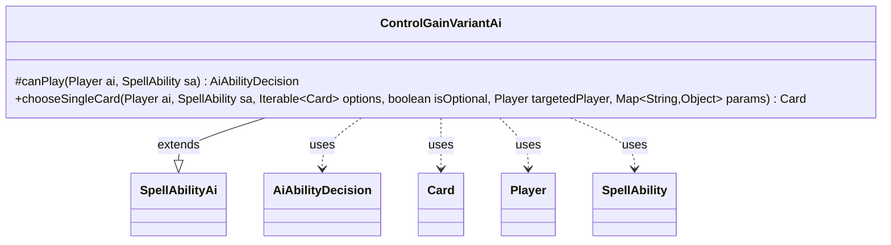

---
aliases:
  - ControlGainVariantAi
tags:
  - java/class
  - module/forge-ai
  - pkg/forge/ai/ability
fqn: forge.ai.ability.ControlGainVariantAi
package: forge.ai.ability
module: forge-ai
kind: Class
---

# ControlGainVariantAi

**Package:** `forge.ai.ability` &nbsp; **Module:** `forge-ai` &nbsp; **Kind:** Class



## Relationships
**Extends:**
- [[forge.ai.SpellAbilityAi|SpellAbilityAi]]
**Uses:**
- [[forge.ai.AiAbilityDecision|AiAbilityDecision]]
- [[forge.game.card.Card|Card]]
- [[forge.game.player.Player|Player]]
- [[forge.game.spellability.SpellAbility|SpellAbility]]

## Design Description

`ControlGainVariantAi` is the AI decision-helper for spell abilities that variantly gain control of permanents (e.g., the "GainControlOwns" logic). As a concrete subclass of `SpellAbilityAi`, it overrides two hooks to inject control-gain-specific reasoning into Forge's generic AI ability-resolution pipeline. `canPlay` gates casting: under the `GainControlOwns` logic it scans the battlefield for creatures whose controller differs from their owner, declining the ability when none exist or when the AI already controls them, and otherwise reports an eager willingness to play.

Its `chooseSingleCard` override picks the best target among cards the AI does not already control, falling back to the worst available card when only its own permanents qualify. The class holds no state, collaborating instead with `Card`, `Player`, and `SpellAbility` game objects and returning `AiAbilityDecision` verdicts, reflecting a deliberately thin, stateless strategy object plugged into the broader ability framework.

## Source
`forge-ai/src/main/java/forge/ai/ability/ControlGainVariantAi.java`

```java
/*
 * Forge: Play Magic: the Gathering.
 * Copyright (C) 2011  Forge Team
 *
 * This program is free software: you can redistribute it and/or modify
 * it under the terms of the GNU General Public License as published by
 * the Free Software Foundation, either version 3 of the License, or
 * (at your option) any later version.
 * 
 * This program is distributed in the hope that it will be useful,
 * but WITHOUT ANY WARRANTY; without even the implied warranty of
 * MERCHANTABILITY or FITNESS FOR A PARTICULAR PURPOSE.  See the
 * GNU General Public License for more details.
 * 
 * You should have received a copy of the GNU General Public License
 * along with this program.  If not, see <http://www.gnu.org/licenses/>.
 */
package forge.ai.ability;

import com.google.common.collect.Iterables;
import forge.ai.AiAbilityDecision;
import forge.ai.AiPlayDecision;
import forge.ai.ComputerUtilCard;
import forge.ai.SpellAbilityAi;
import forge.game.card.Card;
import forge.game.card.CardLists;
import forge.game.card.CardPredicates;
import forge.game.player.Player;
import forge.game.spellability.SpellAbility;
import forge.game.zone.ZoneType;

import java.util.List;
import java.util.Map;


/**
 * <p>
 * AbilityFactory_GainControlVariant class.
 * </p>
 * 
 * @author Forge
 * @version $Id: AbilityFactoryGainControl.java 17764 2012-10-29 11:04:18Z Sloth $
 */
public class ControlGainVariantAi extends SpellAbilityAi {
    @Override
    protected AiAbilityDecision canPlay(final Player ai, final SpellAbility sa) {
        String logic = sa.getParam("AILogic");

        if ("GainControlOwns".equals(logic)) {
            List<Card> list = CardLists.filter(ai.getGame().getCardsIn(ZoneType.Battlefield), crd -> crd.isCreature() && !crd.getController().equals(crd.getOwner()));
            if (list.isEmpty()) {
                return new AiAbilityDecision(0, AiPlayDecision.TargetingFailed);
            }
            for (final Card c : list) {
                if (ai.equals(c.getController())) {
                    return new AiAbilityDecision(0, AiPlayDecision.MissingNeededCards);
                }
            }
        }

        return new AiAbilityDecision(100, AiPlayDecision.WillPlay);
    }

    @Override
    public Card chooseSingleCard(Player ai, SpellAbility sa, Iterable<Card> options, boolean isOptional, Player targetedPlayer, Map<String, Object> params) {
        Iterable<Card> otherCtrl = CardLists.filter(options, CardPredicates.isController(ai).negate());
        if (Iterables.isEmpty(otherCtrl)) {
            return ComputerUtilCard.getWorstAI(options);
        } else {
            return ComputerUtilCard.getBestAI(otherCtrl);
        }
    }

}
```
