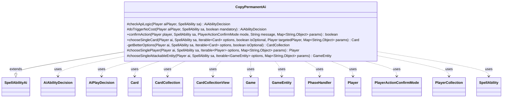

---
aliases:
  - CopyPermanentAi
tags:
  - java/class
  - module/forge-ai
  - pkg/forge/ai/ability
fqn: forge.ai.ability.CopyPermanentAi
package: forge.ai.ability
module: forge-ai
kind: Class
---

# CopyPermanentAi

**Package:** `forge.ai.ability`   **Module:** `forge-ai`   **Kind:** Class



## Relationships
**Extends:**
- [[forge.ai.SpellAbilityAi|SpellAbilityAi]]
**Uses:**
- [[forge.ai.AiAbilityDecision|AiAbilityDecision]]
- [[forge.ai.AiPlayDecision|AiPlayDecision]]
- [[forge.game.Game|Game]]
- [[forge.game.GameEntity|GameEntity]]
- [[forge.game.card.Card|Card]]
- [[forge.game.card.CardCollection|CardCollection]]
- [[forge.game.card.CardCollectionView|CardCollectionView]]
- [[forge.game.phase.PhaseHandler|PhaseHandler]]
- [[forge.game.player.Player|Player]]
- [[forge.game.player.PlayerActionConfirmMode|PlayerActionConfirmMode]]
- [[forge.game.player.PlayerCollection|PlayerCollection]]
- [[forge.game.spellability.SpellAbility|SpellAbility]]

## Design Description

`CopyPermanentAi` supplies the AI decision-making for Forge's "copy permanent" effect, encapsulating how the computer player evaluates, targets, and commits to abilities that duplicate permanents (clones, tokens, embalm/eternalize, Mimic Vat, Momir Vig Avatar, and Saheeli Rai combos). Extending `SpellAbilityAi`, it overrides the framework hooks — `checkApiLogic` and `doTriggerNoCost` for play evaluation, and the `chooseSingle*`/`confirmAction` callbacks for selection — returning `AiAbilityDecision`/`AiPlayDecision` values that signal whether and how strongly the AI wants to act.

Its design intent centers on choosing worthwhile copy targets: it filters out RemAIDeck and disallowed-legendary cards, prefers opponents' or the best/most-expensive permanents, and branches on per-card `AILogic` and phase/targeting context (e.g. waiting for end-of-turn or main phase). It collaborates broadly with the game model (`Card`, `CardCollection`, `Player`, `Game`, `PhaseHandler`) and delegates heuristic scoring to shared `ComputerUtil*` helpers, keeping this class focused on copy-specific strategy rather than general evaluation.

## Source
`forge-ai/src/main/java/forge/ai/ability/CopyPermanentAi.java`

```java
package forge.ai.ability;

import com.google.common.collect.Iterables;
import forge.ai.*;
import forge.game.Game;
import forge.game.GameEntity;
import forge.game.ability.AbilityKey;
import forge.game.ability.AbilityUtils;
import forge.game.card.*;
import forge.game.phase.PhaseHandler;
import forge.game.phase.PhaseType;
import forge.game.player.Player;
import forge.game.player.PlayerActionConfirmMode;
import forge.game.player.PlayerCollection;
import forge.game.spellability.SpellAbility;
import forge.game.zone.ZoneType;

import java.util.Collection;
import java.util.List;
import java.util.Map;
import java.util.function.Predicate;

public class CopyPermanentAi extends SpellAbilityAi {
    @Override
    protected AiAbilityDecision checkApiLogic(Player aiPlayer, SpellAbility sa) {
        Card source = sa.getHostCard();
        PhaseHandler ph = aiPlayer.getGame().getPhaseHandler();
        String aiLogic = sa.getParamOrDefault("AILogic", "");

        if ("MomirAvatar".equals(aiLogic)) {
            return SpecialCardAi.MomirVigAvatar.consider(aiPlayer, sa);
        } else if ("MimicVat".equals(aiLogic)) {
            return SpecialCardAi.MimicVat.considerCopy(aiPlayer, sa);
        } else if ("AtEOT".equals(aiLogic)) {
            if (ph.is(PhaseType.END_OF_TURN)) {
                if (ph.getPlayerTurn() == aiPlayer) {
                    // If it's the AI's turn, it can activate at EOT
                    return new AiAbilityDecision(100, AiPlayDecision.WillPlay);
                } else {
                    // If it's not the AI's turn, it can't activate at EOT
                    return new AiAbilityDecision(0, AiPlayDecision.CantPlayAi);
                }
            } else {
                // Not at EOT phase
                return new AiAbilityDecision(0, AiPlayDecision.WaitForEndOfTurn);
            }
        } else if ("DuplicatePerms".equals(aiLogic)) {
            final List<Card> valid = AbilityUtils.getDefinedCards(source, sa.getParam("Defined"), sa);
            if (valid.size() < 2) {
                return new AiAbilityDecision(0, AiPlayDecision.MissingNeededCards);
            }
        }

        if (sa.hasParam("AtEOT") && !ph.is(PhaseType.MAIN1)) {
            return new AiAbilityDecision(0, AiPlayDecision.AnotherTime);
        }

        if (sa.hasParam("Defined")) {
            // If there needs to be an imprinted card, don't activate the ability if nothing was imprinted yet (e.g. Mimic Vat)
            if (sa.getParam("Defined").equals("Imprinted.ExiledWithSource") && source.getImprintedCards().isEmpty()) {
                return new AiAbilityDecision(0, AiPlayDecision.MissingNeededCards);
            }
        }

        if (sa.isEmbalm() || sa.isEternalize()) {
            // E.g. Vizier of Many Faces: check to make sure it makes sense to make the token now
            AiPlayDecision decision = ComputerUtilCard.checkNeedsToPlayReqs(sa.getHostCard(), sa);

            if (decision != AiPlayDecision.WillPlay) {
                return new AiAbilityDecision(0, decision);
            }
        }

        if (sa.costHasManaX()) {
            // Set PayX here to maximum value. (Osgir)
            ComputerUtilCost.setMaxXValue(sa, aiPlayer, sa.isTrigger());
        }

        if (sa.usesTargeting() && sa.hasParam("TargetingPlayer")) {
            sa.resetTargets();
            Player targetingPlayer = AbilityUtils.getDefinedPlayers(source, sa.getParam("TargetingPlayer"), sa).get(0);
            sa.setTargetingPlayer(targetingPlayer);
            if (CardLists.getTargetableCards(aiPlayer.getGame().getCardsIn(sa.getTargetRestrictions().getZone()), sa).isEmpty()) {
                return new AiAbilityDecision(0, AiPlayDecision.TargetingFailed);
            }
            return new AiAbilityDecision(100, AiPlayDecision.WillPlay);
        } else if (sa.usesTargeting() && sa.getTargetRestrictions().canTgtPlayer()) {
                if (!sa.isCurse()) {
                    if (sa.canTarget(aiPlayer)) {
                        sa.getTargets().add(aiPlayer);
                        return new AiAbilityDecision(100, AiPlayDecision.WillPlay);
                    } else {
                        for (Player p : aiPlayer.getYourTeam()) {
                            if (sa.canTarget(p)) {
                                sa.getTargets().add(p);
                                return new AiAbilityDecision(100, AiPlayDecision.WillPlay);
                            }
                        }
                        return new AiAbilityDecision(0, AiPlayDecision.TargetingFailed);
                    }
                } else {
                    for (Player p : aiPlayer.getOpponents()) {
                        if (sa.canTarget(p)) {
                            sa.getTargets().add(p);
                            return new AiAbilityDecision(100, AiPlayDecision.WillPlay);
                        }
                    }
                    return new AiAbilityDecision(0, AiPlayDecision.TargetingFailed);
                }
        } else {
            return doTriggerNoCost(aiPlayer, sa, false);
        }
    }

    @Override
    protected AiAbilityDecision doTriggerNoCost(final Player aiPlayer, SpellAbility sa, boolean mandatory) {
        final Card host = sa.getHostCard();
        final Player activator = sa.getActivatingPlayer();
        final Game game = host.getGame();
        final String sourceName = ComputerUtilAbility.getAbilitySourceName(sa);
        final String aiLogic = sa.getParamOrDefault("AILogic", "");
        final boolean canCopyLegendary = sa.hasParam("NonLegendary");

        if (sa.usesTargeting()) {
            sa.resetTargets();

            CardCollection list = CardUtil.getValidCardsToTarget(sa);

            if (aiLogic.equals("Different")) {
                // TODO: possibly improve the check, currently only checks if the name is the same
                // Possibly also check if the card is threatened, and then allow to copy (this will, however, require a bit
                // of a rewrite in canPlayAI to allow a response form of CopyPermanentAi)
                Predicate<Card> nameEquals = CardPredicates.nameEquals(host.getName());
                list = CardLists.filter(list, nameEquals.negate());
            }

            //Nothing to target
            if (list.isEmpty()) {
            	return new AiAbilityDecision(0, AiPlayDecision.TargetingFailed);
            }

            CardCollection betterList = CardLists.filter(list, CardPredicates.isRemAIDeck().negate());
            if (betterList.isEmpty()) {
                if (!mandatory) {
                    return new AiAbilityDecision(0, AiPlayDecision.CantPlayAi);
                }
            } else {
                list = betterList;
            }

            // Saheeli Rai + Felidar Guardian combo support
            if ("Saheeli Rai".equals(sourceName)) {
                CardCollection felidarGuardian = CardLists.filter(list, CardPredicates.nameEquals("Felidar Guardian"));
                if (felidarGuardian.size() > 0) {
                    // can copy a Felidar Guardian and combo off, so let's do it
                    sa.getTargets().add(felidarGuardian.get(0));
                    return new AiAbilityDecision(100, AiPlayDecision.WillPlay);
                }
            }

            // target loop
            while (sa.canAddMoreTarget()) {
                list = CardLists.canSubsequentlyTarget(list, sa);

                if (list.isEmpty()) {
                    if (!sa.isTargetNumberValid() || sa.getTargets().isEmpty()) {
                        sa.resetTargets();
                        return new AiAbilityDecision(0, AiPlayDecision.TargetingFailed);
                    } else {
                        // TODO is this good enough? for up to amounts?
                        break;
                    }
                }

                list = CardLists.filter(list, c -> (!c.getType().isLegendary() || canCopyLegendary) || !c.getController().equals(aiPlayer));
                Card choice;
                if (list.stream().anyMatch(CardPredicates.CREATURES)) {
                    if (sa.hasParam("TargetingPlayer")) {
                        choice = ComputerUtilCard.getWorstCreatureAI(list);
                    } else {
                        choice = ComputerUtilCard.getBestCreatureAI(list);
                    }
                } else {
                    choice = ComputerUtilCard.getMostExpensivePermanentAI(list);
                }

                if (choice == null) { // can't find anything left
                    if (!sa.isTargetNumberValid() || sa.getTargets().isEmpty()) {
                        sa.resetTargets();
                        return new AiAbilityDecision(0, AiPlayDecision.TargetingFailed);
                    } else {
                        // TODO is this good enough? for up to amounts?
                        break;
                    }
                }
                list.remove(choice);
                sa.getTargets().add(choice);
            }
        } else if (sa.hasParam("Choices")) {
            // only check for options, does not select there
            CardCollectionView choices = game.getCardsIn(ZoneType.Battlefield);
            choices = CardLists.getValidCards(choices, sa.getParam("Choices"), activator, host, sa);
            Collection<Card> betterChoices = getBetterOptions(aiPlayer, sa, choices, !mandatory);
            if (betterChoices.isEmpty()) {
                if (mandatory) {
                    return new AiAbilityDecision(100, AiPlayDecision.WillPlay);
                }
                return new AiAbilityDecision(0, AiPlayDecision.MissingNeededCards);
            }
        }

        if ("TriggeredCardController".equals(sa.getParam("Controller"))) {
            Card trigCard = (Card)sa.getTriggeringObject(AbilityKey.Card);
            if (!mandatory && trigCard != null && trigCard.getController().isOpponentOf(aiPlayer)) {
                return new AiAbilityDecision(0, AiPlayDecision.CantPlayAi);
            }
        }

        return new AiAbilityDecision(100, AiPlayDecision.WillPlay);
    }
    
    /* (non-Javadoc)
     * @see forge.card.ability.SpellAbilityAi#confirmAction(forge.game.player.Player, forge.card.spellability.SpellAbility, forge.game.player.PlayerActionConfirmMode, java.lang.String)
     */
    @Override
    public boolean confirmAction(Player player, SpellAbility sa, PlayerActionConfirmMode mode, String message, Map<String, Object> params) {
        //TODO: add logic here
        return true;
    }
    
    /* (non-Javadoc)
     * @see forge.card.ability.SpellAbilityAi#chooseSingleCard(forge.game.player.Player, forge.card.spellability.SpellAbility, java.util.List, boolean)
     */
    @Override
    public Card chooseSingleCard(Player ai, SpellAbility sa, Iterable<Card> options, boolean isOptional, Player targetedPlayer, Map<String, Object> params) {
        // Select a card to attach to
        CardCollection betterOptions = getBetterOptions(ai, sa, options, isOptional);
        if (!betterOptions.isEmpty()) {
            options = betterOptions;
        }
        return ComputerUtilCard.getBestAI(options);
    }

    private CardCollection getBetterOptions(Player ai, SpellAbility sa, Iterable<Card> options, boolean isOptional) {
        final Card host = sa.getHostCard();
        final Player ctrl = host.getController();
        final boolean canCopyLegendary = sa.hasParam("NonLegendary");
        final String filter = canCopyLegendary ? "Permanent" : "Permanent.YouDontCtrl,Permanent.nonLegendary";
        // TODO add filter to not select Legendary from Other Player when ai already have a Legendary with that name
        return CardLists.getValidCards(options, filter, ctrl, host, sa);
    }

    @Override
    protected Player chooseSinglePlayer(Player ai, SpellAbility sa, Iterable<Player> options, Map<String, Object> params) {
        if (params != null && params.containsKey("Attacker")) {
            return (Player) ComputerUtilCombat.addAttackerToCombat(sa, (Card) params.get("Attacker"), options);
        }
        final List<Card> cards = new PlayerCollection(options).getCreaturesInPlay();
        Card chosen = ComputerUtilCard.getBestCreatureAI(cards);
        return chosen != null ? chosen.getController() : Iterables.getFirst(options, null);
    }

    @Override
    protected GameEntity chooseSingleAttackableEntity(Player ai, SpellAbility sa, Iterable<GameEntity> options, Map<String, Object> params) {
        if (params != null && params.containsKey("Attacker")) {
            return ComputerUtilCombat.addAttackerToCombat(sa, (Card) params.get("Attacker"), options);
        }
        // should not be reached
        return super.chooseSingleAttackableEntity(ai, sa, options, params);
    }

}
```

## Python
`forge/ai/ability/CopyPermanentAi.py`

```python
from forge.ai.AiAbilityDecision import AiAbilityDecision
from forge.ai.AiPlayDecision import AiPlayDecision
from forge.ai.SpellAbilityAi import SpellAbilityAi
from forge.ai.SpecialCardAi import SpecialCardAi
from forge.ai.ComputerUtilAbility import ComputerUtilAbility
from forge.ai.ComputerUtilCard import ComputerUtilCard
from forge.ai.ComputerUtilCombat import ComputerUtilCombat
from forge.ai.ComputerUtilCost import ComputerUtilCost
from forge.game.Game import Game
from forge.game.GameEntity import GameEntity
from forge.game.ability.AbilityKey import AbilityKey
from forge.game.ability.AbilityUtils import AbilityUtils
from forge.game.card.Card import Card
from forge.game.card.CardCollection import CardCollection
from forge.game.card.CardCollectionView import CardCollectionView
from forge.game.card.CardLists import CardLists
from forge.game.card.CardPredicates import CardPredicates
from forge.game.card.CardUtil import CardUtil
from forge.game.phase.PhaseHandler import PhaseHandler
from forge.game.phase.PhaseType import PhaseType
from forge.game.player.Player import Player
from forge.game.player.PlayerActionConfirmMode import PlayerActionConfirmMode
from forge.game.player.PlayerCollection import PlayerCollection
from forge.game.spellability.SpellAbility import SpellAbility
from forge.game.zone.ZoneType import ZoneType


class CopyPermanentAi(SpellAbilityAi):
    def checkApiLogic(self, aiPlayer: Player, sa: SpellAbility) -> AiAbilityDecision:
        source = sa.getHostCard()
        ph = aiPlayer.getGame().getPhaseHandler()
        aiLogic = sa.getParamOrDefault("AILogic", "")

        if "MomirAvatar" == aiLogic:
            return SpecialCardAi.MomirVigAvatar.consider(aiPlayer, sa)
        elif "MimicVat" == aiLogic:
            return SpecialCardAi.MimicVat.considerCopy(aiPlayer, sa)
        elif "AtEOT" == aiLogic:
            if ph.is_(PhaseType.END_OF_TURN):
                if ph.getPlayerTurn() == aiPlayer:
                    # If it's the AI's turn, it can activate at EOT
                    return AiAbilityDecision(100, AiPlayDecision.WillPlay)
                else:
                    # If it's not the AI's turn, it can't activate at EOT
                    return AiAbilityDecision(0, AiPlayDecision.CantPlayAi)
            else:
                # Not at EOT phase
                return AiAbilityDecision(0, AiPlayDecision.WaitForEndOfTurn)
        elif "DuplicatePerms" == aiLogic:
            valid = AbilityUtils.getDefinedCards(source, sa.getParam("Defined"), sa)
            if len(valid) < 2:
                return AiAbilityDecision(0, AiPlayDecision.MissingNeededCards)

        if sa.hasParam("AtEOT") and not ph.is_(PhaseType.MAIN1):
            return AiAbilityDecision(0, AiPlayDecision.AnotherTime)

        if sa.hasParam("Defined"):
            # If there needs to be an imprinted card, don't activate the ability if nothing was imprinted yet (e.g. Mimic Vat)
            if sa.getParam("Defined") == "Imprinted.ExiledWithSource" and source.getImprintedCards().isEmpty():
                return AiAbilityDecision(0, AiPlayDecision.MissingNeededCards)

        if sa.isEmbalm() or sa.isEternalize():
            # E.g. Vizier of Many Faces: check to make sure it makes sense to make the token now
            decision = ComputerUtilCard.checkNeedsToPlayReqs(sa.getHostCard(), sa)

            if decision != AiPlayDecision.WillPlay:
                return AiAbilityDecision(0, decision)

        if sa.costHasManaX():
            # Set PayX here to maximum value. (Osgir)
            ComputerUtilCost.setMaxXValue(sa, aiPlayer, sa.isTrigger())

        if sa.usesTargeting() and sa.hasParam("TargetingPlayer"):
            sa.resetTargets()
            targetingPlayer = AbilityUtils.getDefinedPlayers(source, sa.getParam("TargetingPlayer"), sa).get(0)
            sa.setTargetingPlayer(targetingPlayer)
            if CardLists.getTargetableCards(aiPlayer.getGame().getCardsIn(sa.getTargetRestrictions().getZone()), sa).isEmpty():
                return AiAbilityDecision(0, AiPlayDecision.TargetingFailed)
            return AiAbilityDecision(100, AiPlayDecision.WillPlay)
        elif sa.usesTargeting() and sa.getTargetRestrictions().canTgtPlayer():
            if not sa.isCurse():
                if sa.canTarget(aiPlayer):
                    sa.getTargets().add(aiPlayer)
                    return AiAbilityDecision(100, AiPlayDecision.WillPlay)
                else:
                    for p in aiPlayer.getYourTeam():
                        if sa.canTarget(p):
                            sa.getTargets().add(p)
                            return AiAbilityDecision(100, AiPlayDecision.WillPlay)
                    return AiAbilityDecision(0, AiPlayDecision.TargetingFailed)
            else:
                for p in aiPlayer.getOpponents():
                    if sa.canTarget(p):
                        sa.getTargets().add(p)
                        return AiAbilityDecision(100, AiPlayDecision.WillPlay)
                return AiAbilityDecision(0, AiPlayDecision.TargetingFailed)
        else:
            return self.doTriggerNoCost(aiPlayer, sa, False)

    def doTriggerNoCost(self, aiPlayer: Player, sa: SpellAbility, mandatory: bool) -> AiAbilityDecision:
        host = sa.getHostCard()
        activator = sa.getActivatingPlayer()
        game = host.getGame()
        sourceName = ComputerUtilAbility.getAbilitySourceName(sa)
        aiLogic = sa.getParamOrDefault("AILogic", "")
        canCopyLegendary = sa.hasParam("NonLegendary")

        if sa.usesTargeting():
            sa.resetTargets()

            list_ = CardUtil.getValidCardsToTarget(sa)

            if aiLogic == "Different":
                # TODO: possibly improve the check, currently only checks if the name is the same
                # Possibly also check if the card is threatened, and then allow to copy (this will, however, require a bit
                # of a rewrite in canPlayAI to allow a response form of CopyPermanentAi)
                nameEquals = CardPredicates.nameEquals(host.getName())
                list_ = CardLists.filter(list_, nameEquals.negate())

            # Nothing to target
            if list_.isEmpty():
                return AiAbilityDecision(0, AiPlayDecision.TargetingFailed)

            betterList = CardLists.filter(list_, CardPredicates.isRemAIDeck().negate())
            if betterList.isEmpty():
                if not mandatory:
                    return AiAbilityDecision(0, AiPlayDecision.CantPlayAi)
            else:
                list_ = betterList

            # Saheeli Rai + Felidar Guardian combo support
            if "Saheeli Rai" == sourceName:
                felidarGuardian = CardLists.filter(list_, CardPredicates.nameEquals("Felidar Guardian"))
                if felidarGuardian.size() > 0:
                    # can copy a Felidar Guardian and combo off, so let's do it
                    sa.getTargets().add(felidarGuardian.get(0))
                    return AiAbilityDecision(100, AiPlayDecision.WillPlay)

            # target loop
            while sa.canAddMoreTarget():
                list_ = CardLists.canSubsequentlyTarget(list_, sa)

                if list_.isEmpty():
                    if not sa.isTargetNumberValid() or sa.getTargets().isEmpty():
                        sa.resetTargets()
                        return AiAbilityDecision(0, AiPlayDecision.TargetingFailed)
                    else:
                        # TODO is this good enough? for up to amounts?
                        break

                list_ = CardLists.filter(list_, lambda c: (not c.getType().isLegendary() or canCopyLegendary) or c.getController() != aiPlayer)
                if any(CardPredicates.CREATURES(c) for c in list_):
                    if sa.hasParam("TargetingPlayer"):
                        choice = ComputerUtilCard.getWorstCreatureAI(list_)
                    else:
                        choice = ComputerUtilCard.getBestCreatureAI(list_)
                else:
                    choice = ComputerUtilCard.getMostExpensivePermanentAI(list_)

                if choice is None:  # can't find anything left
                    if not sa.isTargetNumberValid() or sa.getTargets().isEmpty():
                        sa.resetTargets()
                        return AiAbilityDecision(0, AiPlayDecision.TargetingFailed)
                    else:
                        # TODO is this good enough? for up to amounts?
                        break
                list_.remove(choice)
                sa.getTargets().add(choice)
        elif sa.hasParam("Choices"):
            # only check for options, does not select there
            choices = game.getCardsIn(ZoneType.Battlefield)
            choices = CardLists.getValidCards(choices, sa.getParam("Choices"), activator, host, sa)
            betterChoices = self.getBetterOptions(aiPlayer, sa, choices, not mandatory)
            if betterChoices.isEmpty():
                if mandatory:
                    return AiAbilityDecision(100, AiPlayDecision.WillPlay)
                return AiAbilityDecision(0, AiPlayDecision.MissingNeededCards)

        if "TriggeredCardController" == sa.getParam("Controller"):
            trigCard = sa.getTriggeringObject(AbilityKey.Card)
            if not mandatory and trigCard is not None and trigCard.getController().isOpponentOf(aiPlayer):
                return AiAbilityDecision(0, AiPlayDecision.CantPlayAi)

        return AiAbilityDecision(100, AiPlayDecision.WillPlay)

    # (non-Javadoc)
    # @see forge.card.ability.SpellAbilityAi#confirmAction(forge.game.player.Player, forge.card.spellability.SpellAbility, forge.game.player.PlayerActionConfirmMode, java.lang.String)
    def confirmAction(self, player: Player, sa: SpellAbility, mode: PlayerActionConfirmMode, message: str, params: dict[str, object]) -> bool:
        # TODO: add logic here
        return True

    # (non-Javadoc)
    # @see forge.card.ability.SpellAbilityAi#chooseSingleCard(forge.game.player.Player, forge.card.spellability.SpellAbility, java.util.List, boolean)
    def chooseSingleCard(self, ai: Player, sa: SpellAbility, options, isOptional: bool, targetedPlayer: Player, params: dict[str, object]) -> Card:
        # Select a card to attach to
        betterOptions = self.getBetterOptions(ai, sa, options, isOptional)
        if not betterOptions.isEmpty():
            options = betterOptions
        return ComputerUtilCard.getBestAI(options)

    def getBetterOptions(self, ai: Player, sa: SpellAbility, options, isOptional: bool) -> CardCollection:
        host = sa.getHostCard()
        ctrl = host.getController()
        canCopyLegendary = sa.hasParam("NonLegendary")
        filter_ = "Permanent" if canCopyLegendary else "Permanent.YouDontCtrl,Permanent.nonLegendary"
        # TODO add filter to not select Legendary from Other Player when ai already have a Legendary with that name
        return CardLists.getValidCards(options, filter_, ctrl, host, sa)

    def chooseSinglePlayer(self, ai: Player, sa: SpellAbility, options, params: dict[str, object]) -> Player:
        if params is not None and "Attacker" in params:
            return ComputerUtilCombat.addAttackerToCombat(sa, params.get("Attacker"), options)
        cards = PlayerCollection(options).getCreaturesInPlay()
        chosen = ComputerUtilCard.getBestCreatureAI(cards)
        return chosen.getController() if chosen is not None else next(iter(options), None)

    def chooseSingleAttackableEntity(self, ai: Player, sa: SpellAbility, options, params: dict[str, object]) -> GameEntity:
        if params is not None and "Attacker" in params:
            return ComputerUtilCombat.addAttackerToCombat(sa, params.get("Attacker"), options)
        # should not be reached
        return super().chooseSingleAttackableEntity(ai, sa, options, params)
```
