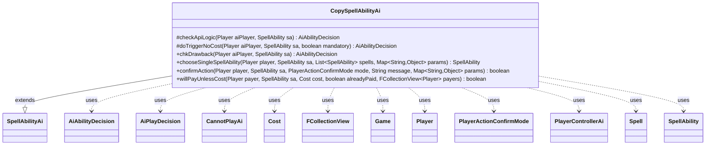

---
aliases:
  - CopySpellAbilityAi
tags:
  - java/class
  - module/forge-ai
  - pkg/forge/ai/ability
fqn: forge.ai.ability.CopySpellAbilityAi
package: forge.ai.ability
module: forge-ai
kind: Class
---

# CopySpellAbilityAi

**Package:** `forge.ai.ability`   **Module:** `forge-ai`   **Kind:** Class



## Relationships
**Extends:**
- [[forge.ai.SpellAbilityAi|SpellAbilityAi]]
**Uses:**
- [[forge.ai.AiAbilityDecision|AiAbilityDecision]]
- [[forge.ai.AiPlayDecision|AiPlayDecision]]
- [[forge.ai.PlayerControllerAi|PlayerControllerAi]]
- [[forge.ai.ability.CannotPlayAi|CannotPlayAi]]
- [[forge.game.Game|Game]]
- [[forge.game.cost.Cost|Cost]]
- [[forge.game.player.Player|Player]]
- [[forge.game.player.PlayerActionConfirmMode|PlayerActionConfirmMode]]
- [[forge.game.spellability.Spell|Spell]]
- [[forge.game.spellability.SpellAbility|SpellAbility]]
- [[forge.util.collect.FCollectionView|FCollectionView]]

## Design Description

`CopySpellAbilityAi` is the AI controller for the `CopySpellAbility` API, deciding when and how the computer should play spells and abilities that duplicate another object on the stack. Extending `SpellAbilityAi`, it overrides the standard decision hooks—`checkApiLogic`, `doTriggerNoCost`, `chkDrawback`, `confirmAction`, and `willPayUnlessCost`—to return `AiAbilityDecision`/`AiPlayDecision` verdicts that the broader AI framework consumes. Its core logic inspects the current `Game` stack, weighing the top `SpellAbility`'s mana value, ownership, and `ApiType` against profile-driven probabilities to judge whether a copy is worthwhile.

The design emphasizes defensive safety: it refuses to copy abilities the AI cannot model (those mapped to `CannotPlayAi`, mana, or nested copy effects), and clones the targeted spell to test playability before committing, avoiding fizzles. Collaboration with `PlayerControllerAi`, `SpecialCardAi`, and `Cost` lets it delegate card-specific reasoning (e.g., Chain of Smog/Acid/Vapor) and cost-payment decisions, isolating the quirks of copy effects from the generic AI evaluation pipeline.

## Source
`forge-ai/src/main/java/forge/ai/ability/CopySpellAbilityAi.java`

```java
package forge.ai.ability;

import forge.ai.*;
import forge.game.Game;
import forge.game.ability.ApiType;
import forge.game.cost.Cost;
import forge.game.player.Player;
import forge.game.player.PlayerActionConfirmMode;
import forge.game.spellability.Spell;
import forge.game.spellability.SpellAbility;
import forge.util.MyRandom;
import forge.util.collect.FCollectionView;

import java.util.List;
import java.util.Map;

public class CopySpellAbilityAi extends SpellAbilityAi {

    @Override
    protected AiAbilityDecision checkApiLogic(Player aiPlayer, SpellAbility sa) {
        Game game = aiPlayer.getGame();
        int chance = AiProfileUtil.getIntProperty(aiPlayer, AiProps.CHANCE_TO_COPY_OWN_SPELL_WHILE_ON_STACK);
        int diff = AiProfileUtil.getIntProperty(aiPlayer, AiProps.ALWAYS_COPY_SPELL_IF_CMC_DIFF);
        String logic = sa.getParamOrDefault("AILogic", "");

        if (game.getStack().isEmpty()) {
            boolean result = sa.isMandatory() || "Always".equals(logic);
            return result ? new AiAbilityDecision(100, AiPlayDecision.WillPlay) : new AiAbilityDecision(0, AiPlayDecision.CantPlayAi);
        }

        final SpellAbility top = game.getStack().peekAbility();
        if (top != null
                && top.getPayCosts().getCostMana() != null
                && sa.getPayCosts().getCostMana() != null
                && top.getPayCosts().getCostMana().getMana().getCMC() >= sa.getPayCosts().getCostMana().getMana().getCMC() + diff) {
            // The copied spell has a significantly higher CMC than the copy spell, consider copying
            chance = 100;
        }

        if (top.getActivatingPlayer().isOpponentOf(aiPlayer)) {
            chance = 100; // currently the AI will always copy the opponent's spell if viable
        }

        if (!MyRandom.percentTrue(chance)
                && !"Always".equals(logic)
                && !"AlwaysCopyActivatedAbilities".equals(logic)) {
            return new AiAbilityDecision(0, AiPlayDecision.CantPlayAi);
        }

        if (sa.usesTargeting()) {
            // Filter AI-specific targets if provided
            if ("OnlyOwned".equals(sa.getParam("AITgts"))) {
                if (!top.getActivatingPlayer().equals(aiPlayer)) {
                    return new AiAbilityDecision(0, AiPlayDecision.CantPlayAi);
                }
            }

            if (top.isWrapper() || top.isActivatedAbility()) {
                // Shouldn't even try with triggered or wrapped abilities at this time, will crash
                return new AiAbilityDecision(0, AiPlayDecision.CantPlayAi);
            } else if (top.getApi() == ApiType.CopySpellAbility) {
                // Don't try to copy a copy ability, too complex for the AI to handle
                return new AiAbilityDecision(0, AiPlayDecision.CantPlayAi);
            } else if (top.getApi() == ApiType.Mana) {
                // would lead to Stack Overflow by trying to play this again
                return new AiAbilityDecision(0, AiPlayDecision.CantPlayAi);
            } else if (top.getApi() == ApiType.DestroyAll || top.getApi() == ApiType.SacrificeAll || top.getApi() == ApiType.ChangeZoneAll || top.getApi() == ApiType.TapAll) {
                if (!top.usesTargeting() || top.getActivatingPlayer().equals(aiPlayer)) {
                    // If we activated a mass removal / mass tap / mass bounce / etc. spell, or if the opponent activated it but
                    // it can't be retargeted, no reason to copy this spell since it'll probably do the same thing and is useless as a copy
                    return new AiAbilityDecision(0, AiPlayDecision.CantPlayAi);
                }
            } else if (top.hasParam("ConditionManaSpent") || top.getHostCard().hasSVar("AINoCopy")) {
                // Mana spent is not copied, so these spells generally do nothing when copied.
                return new AiAbilityDecision(0, AiPlayDecision.CantPlayAi);
            } else if (SpellApiToAi.Converter.get(top.getApi()) instanceof CannotPlayAi || ComputerUtilCard.isCardRemAIDeck(top.getHostCard())) {
                // Don't try to copy anything you can't understand how to handle
                return new AiAbilityDecision(0, AiPlayDecision.CantPlayAi);
            }

            // A copy is necessary to properly test the SA before targeting the copied spell, otherwise the copy SA will fizzle.
            final SpellAbility topCopy = top.copy(aiPlayer);
            topCopy.clearManaPaid();
            topCopy.resetTargets();

            if (top.canBeTargetedBy(sa)) {
                AiPlayDecision decision = AiPlayDecision.CantPlaySa;
                if (top instanceof Spell) {
                    decision = ((PlayerControllerAi) aiPlayer.getController()).getAi().canPlayFromEffectAI((Spell) topCopy, false, true);
                } else if (top.isActivatedAbility() && top.getActivatingPlayer().equals(aiPlayer)
                        && logic.contains("CopyActivatedAbilities")) {
                    decision = AiPlayDecision.WillPlay; // FIXME: we activated it once, why not again? Or bad idea?
                }
                if (decision == AiPlayDecision.WillPlay) {
                    sa.getTargets().add(top);
                    return new AiAbilityDecision(100, AiPlayDecision.WillPlay);
                }
                return new AiAbilityDecision(0, decision);
            }
        }

        // the AI should not miss mandatory activations
        boolean result = sa.isMandatory() || "Always".equals(logic);
        return result ? new AiAbilityDecision(100, AiPlayDecision.WillPlay) : new AiAbilityDecision(0, AiPlayDecision.CantPlayAi);
    }

    @Override
    protected AiAbilityDecision doTriggerNoCost(Player aiPlayer, SpellAbility sa, boolean mandatory) {
        // the AI should not miss mandatory activations (e.g. Precursor Golem trigger)
        String logic = sa.getParamOrDefault("AILogic", "");

        if (mandatory) {
            return new AiAbilityDecision(100, AiPlayDecision.WillPlay);
        }

        if (logic.contains("Always")) {
            return new AiAbilityDecision(100, AiPlayDecision.WillPlay);
        }

        return new AiAbilityDecision(0, AiPlayDecision.CantPlayAi);
    }

    @Override
    public AiAbilityDecision chkDrawback(final Player aiPlayer, final SpellAbility sa) {
        if ("ChainOfSmog".equals(sa.getParam("AILogic"))) {
            return SpecialCardAi.ChainOfSmog.consider(aiPlayer, sa);
        }
        if ("ChainOfAcid".equals(sa.getParam("AILogic"))) {
            return SpecialCardAi.ChainOfAcid.consider(aiPlayer, sa);
        }

        AiAbilityDecision decision = canPlay(aiPlayer, sa);
        if (!decision.willingToPlay()) {
            if (sa.isMandatory()) {
                return super.chkDrawback(aiPlayer, sa);
            }
        }
        return decision;
    }

    @Override
    public SpellAbility chooseSingleSpellAbility(Player player, SpellAbility sa, List<SpellAbility> spells,
            Map<String, Object> params) {
        return spells.get(0);
    }

    @Override
    public boolean confirmAction(Player player, SpellAbility sa, PlayerActionConfirmMode mode, String message, Map<String, Object> params) {
        // Chain of Acid requires special attention here since otherwise the AI will confirm the copy and then
        // run into the necessity of confirming a mandatory Destroy, thus destroying all of its own permanents.
        if ("ChainOfAcid".equals(sa.getParam("AILogic"))) {
            return SpecialCardAi.ChainOfAcid.consider(player, sa).willingToPlay();
        }

        return true;
    }

    @Override
    public boolean willPayUnlessCost(Player payer, SpellAbility sa, Cost cost, boolean alreadyPaid, FCollectionView<Player> payers) {
        final String aiLogic = sa.getParam("UnlessAI");
        if ("Never".equals(aiLogic)) { return false; }

        if (sa.hasParam("UnlessSwitched")) {
            // TODO try without AI Logic flag
            if ("ChainOfVapor".equals(aiLogic)) {
                if (payer.getLandsInPlay().size() < 3) {
                    return false;
                }
                // TODO make better logic in to pick which opponent
                if (payer.getOpponents().getCreaturesInPlay().size() < 0) {
                    return false;
                }
            }
        }
        return super.willPayUnlessCost(payer, sa, cost, alreadyPaid, payers);
    }
}
```

## Python
`forge/ai/ability/CopySpellAbilityAi.py`

```python
from forge.ai.SpellAbilityAi import SpellAbilityAi
from forge.ai.AiAbilityDecision import AiAbilityDecision
from forge.ai.AiPlayDecision import AiPlayDecision
from forge.ai.PlayerControllerAi import PlayerControllerAi
from forge.ai.AiProfileUtil import AiProfileUtil
from forge.ai.AiProps import AiProps
from forge.ai.SpellApiToAi import SpellApiToAi
from forge.ai.ComputerUtilCard import ComputerUtilCard
from forge.ai.SpecialCardAi import SpecialCardAi
from forge.ai.ability.CannotPlayAi import CannotPlayAi
from forge.game.Game import Game
from forge.game.ability.ApiType import ApiType
from forge.game.cost.Cost import Cost
from forge.game.player.Player import Player
from forge.game.player.PlayerActionConfirmMode import PlayerActionConfirmMode
from forge.game.spellability.Spell import Spell
from forge.game.spellability.SpellAbility import SpellAbility
from forge.util.MyRandom import MyRandom
from forge.util.collect.FCollectionView import FCollectionView

from typing import List, Map


class CopySpellAbilityAi(SpellAbilityAi):

    def checkApiLogic(self, aiPlayer: Player, sa: SpellAbility) -> AiAbilityDecision:
        game = aiPlayer.getGame()
        chance = AiProfileUtil.getIntProperty(aiPlayer, AiProps.CHANCE_TO_COPY_OWN_SPELL_WHILE_ON_STACK)
        diff = AiProfileUtil.getIntProperty(aiPlayer, AiProps.ALWAYS_COPY_SPELL_IF_CMC_DIFF)
        logic = sa.getParamOrDefault("AILogic", "")

        if game.getStack().isEmpty():
            result = sa.isMandatory() or "Always" == logic
            return AiAbilityDecision(100, AiPlayDecision.WillPlay) if result else AiAbilityDecision(0, AiPlayDecision.CantPlayAi)

        top = game.getStack().peekAbility()
        if (top is not None
                and top.getPayCosts().getCostMana() is not None
                and sa.getPayCosts().getCostMana() is not None
                and top.getPayCosts().getCostMana().getMana().getCMC() >= sa.getPayCosts().getCostMana().getMana().getCMC() + diff):
            # The copied spell has a significantly higher CMC than the copy spell, consider copying
            chance = 100

        if top.getActivatingPlayer().isOpponentOf(aiPlayer):
            chance = 100  # currently the AI will always copy the opponent's spell if viable

        if (not MyRandom.percentTrue(chance)
                and "Always" != logic
                and "AlwaysCopyActivatedAbilities" != logic):
            return AiAbilityDecision(0, AiPlayDecision.CantPlayAi)

        if sa.usesTargeting():
            # Filter AI-specific targets if provided
            if "OnlyOwned" == sa.getParam("AITgts"):
                if not top.getActivatingPlayer().equals(aiPlayer):
                    return AiAbilityDecision(0, AiPlayDecision.CantPlayAi)

            if top.isWrapper() or top.isActivatedAbility():
                # Shouldn't even try with triggered or wrapped abilities at this time, will crash
                return AiAbilityDecision(0, AiPlayDecision.CantPlayAi)
            elif top.getApi() == ApiType.CopySpellAbility:
                # Don't try to copy a copy ability, too complex for the AI to handle
                return AiAbilityDecision(0, AiPlayDecision.CantPlayAi)
            elif top.getApi() == ApiType.Mana:
                # would lead to Stack Overflow by trying to play this again
                return AiAbilityDecision(0, AiPlayDecision.CantPlayAi)
            elif top.getApi() == ApiType.DestroyAll or top.getApi() == ApiType.SacrificeAll or top.getApi() == ApiType.ChangeZoneAll or top.getApi() == ApiType.TapAll:
                if not top.usesTargeting() or top.getActivatingPlayer().equals(aiPlayer):
                    # If we activated a mass removal / mass tap / mass bounce / etc. spell, or if the opponent activated it but
                    # it can't be retargeted, no reason to copy this spell since it'll probably do the same thing and is useless as a copy
                    return AiAbilityDecision(0, AiPlayDecision.CantPlayAi)
            elif top.hasParam("ConditionManaSpent") or top.getHostCard().hasSVar("AINoCopy"):
                # Mana spent is not copied, so these spells generally do nothing when copied.
                return AiAbilityDecision(0, AiPlayDecision.CantPlayAi)
            elif isinstance(SpellApiToAi.Converter.get(top.getApi()), CannotPlayAi) or ComputerUtilCard.isCardRemAIDeck(top.getHostCard()):
                # Don't try to copy anything you can't understand how to handle
                return AiAbilityDecision(0, AiPlayDecision.CantPlayAi)

            # A copy is necessary to properly test the SA before targeting the copied spell, otherwise the copy SA will fizzle.
            topCopy = top.copy(aiPlayer)
            topCopy.clearManaPaid()
            topCopy.resetTargets()

            if top.canBeTargetedBy(sa):
                decision = AiPlayDecision.CantPlaySa
                if isinstance(top, Spell):
                    decision = aiPlayer.getController().getAi().canPlayFromEffectAI(topCopy, False, True)
                elif (top.isActivatedAbility() and top.getActivatingPlayer().equals(aiPlayer)
                        and "CopyActivatedAbilities" in logic):
                    decision = AiPlayDecision.WillPlay  # FIXME: we activated it once, why not again? Or bad idea?
                if decision == AiPlayDecision.WillPlay:
                    sa.getTargets().add(top)
                    return AiAbilityDecision(100, AiPlayDecision.WillPlay)
                return AiAbilityDecision(0, decision)

        # the AI should not miss mandatory activations
        result = sa.isMandatory() or "Always" == logic
        return AiAbilityDecision(100, AiPlayDecision.WillPlay) if result else AiAbilityDecision(0, AiPlayDecision.CantPlayAi)

    def doTriggerNoCost(self, aiPlayer: Player, sa: SpellAbility, mandatory: bool) -> AiAbilityDecision:
        # the AI should not miss mandatory activations (e.g. Precursor Golem trigger)
        logic = sa.getParamOrDefault("AILogic", "")

        if mandatory:
            return AiAbilityDecision(100, AiPlayDecision.WillPlay)

        if "Always" in logic:
            return AiAbilityDecision(100, AiPlayDecision.WillPlay)

        return AiAbilityDecision(0, AiPlayDecision.CantPlayAi)

    def chkDrawback(self, aiPlayer: Player, sa: SpellAbility) -> AiAbilityDecision:
        if "ChainOfSmog" == sa.getParam("AILogic"):
            return SpecialCardAi.ChainOfSmog.consider(aiPlayer, sa)
        if "ChainOfAcid" == sa.getParam("AILogic"):
            return SpecialCardAi.ChainOfAcid.consider(aiPlayer, sa)

        decision = self.canPlay(aiPlayer, sa)
        if not decision.willingToPlay():
            if sa.isMandatory():
                return super().chkDrawback(aiPlayer, sa)
        return decision

    def chooseSingleSpellAbility(self, player: Player, sa: SpellAbility, spells: List[SpellAbility],
            params: Map[str, object]) -> SpellAbility:
        return spells.get(0)

    def confirmAction(self, player: Player, sa: SpellAbility, mode: PlayerActionConfirmMode, message: str, params: Map[str, object]) -> bool:
        # Chain of Acid requires special attention here since otherwise the AI will confirm the copy and then
        # run into the necessity of confirming a mandatory Destroy, thus destroying all of its own permanents.
        if "ChainOfAcid" == sa.getParam("AILogic"):
            return SpecialCardAi.ChainOfAcid.consider(player, sa).willingToPlay()

        return True

    def willPayUnlessCost(self, payer: Player, sa: SpellAbility, cost: Cost, alreadyPaid: bool, payers: FCollectionView[Player]) -> bool:
        aiLogic = sa.getParam("UnlessAI")
        if "Never" == aiLogic:
            return False

        if sa.hasParam("UnlessSwitched"):
            # TODO try without AI Logic flag
            if "ChainOfVapor" == aiLogic:
                if payer.getLandsInPlay().size() < 3:
                    return False
                # TODO make better logic in to pick which opponent
                if payer.getOpponents().getCreaturesInPlay().size() < 0:
                    return False
        return super().willPayUnlessCost(payer, sa, cost, alreadyPaid, payers)
```
