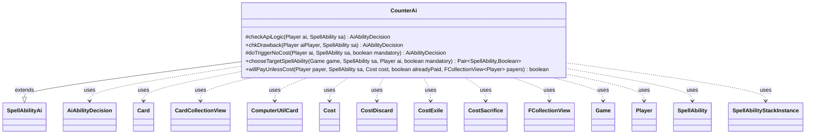

---
aliases:
  - CounterAi
tags:
  - java/class
  - module/forge-ai
  - pkg/forge/ai/ability
fqn: forge.ai.ability.CounterAi
package: forge.ai.ability
module: forge-ai
kind: Class
---

# CounterAi

**Package:** `forge.ai.ability`   **Module:** `forge-ai`   **Kind:** Class



## Relationships
**Extends:**
- [[forge.ai.SpellAbilityAi|SpellAbilityAi]]
**Uses:**
- [[forge.ai.AiAbilityDecision|AiAbilityDecision]]
- [[forge.ai.ComputerUtilCard|ComputerUtilCard]]
- [[forge.game.Game|Game]]
- [[forge.game.card.Card|Card]]
- [[forge.game.card.CardCollectionView|CardCollectionView]]
- [[forge.game.cost.Cost|Cost]]
- [[forge.game.cost.CostDiscard|CostDiscard]]
- [[forge.game.cost.CostExile|CostExile]]
- [[forge.game.cost.CostSacrifice|CostSacrifice]]
- [[forge.game.player.Player|Player]]
- [[forge.game.spellability.SpellAbility|SpellAbility]]
- [[forge.game.spellability.SpellAbilityStackInstance|SpellAbilityStackInstance]]
- [[forge.util.collect.FCollectionView|FCollectionView]]

## Design Description

CounterAi is the AI decision module for spell- and ability-based counter effects in Forge, mapping the engine's Counter API to computer-controlled play. Extending SpellAbilityAi, it overrides the standard hooks—checkApiLogic for proactive casting, doTriggerNoCost/chkDrawback for triggered or sub-ability use, and willPayUnlessCost for responding to "unless you pay" clauses. It inspects the game stack via SpellAbilityStackInstance, validating that a top spell is counterable and belongs to an opponent before targeting it through SpellAbility, and estimates the target's effective CMC to weigh whether countering is worthwhile.

Its design intent centers on configurable, profile-driven heuristics: AiProfileUtil properties and randomized chances tune which spell categories (damage, removal, pumps, auras, mana permanents) and CMC tiers are always or sometimes countered, while special cases (Force of Will, Null Brooch) defer to SpecialCardAi. It also reasons about opportunity cost—favoring counters that spend no card—and compares hand value against the threatened spell when deciding to pay discard-based unless costs.

## Source
`forge-ai/src/main/java/forge/ai/ability/CounterAi.java`

```java
package forge.ai.ability;

import java.util.Iterator;
import java.util.List;

import org.apache.commons.lang3.StringUtils;
import org.apache.commons.lang3.tuple.ImmutablePair;
import org.apache.commons.lang3.tuple.Pair;

import forge.ai.*;
import forge.game.Game;
import forge.game.ability.AbilityUtils;
import forge.game.ability.ApiType;
import forge.game.ability.effects.CounterEffect;
import forge.game.card.Card;
import forge.game.card.CardCollectionView;
import forge.game.card.CardPredicates;
import forge.game.cost.Cost;
import forge.game.cost.CostDiscard;
import forge.game.cost.CostExile;
import forge.game.cost.CostSacrifice;
import forge.game.player.Player;
import forge.game.spellability.SpellAbility;
import forge.game.spellability.SpellAbilityStackInstance;
import forge.game.zone.ZoneType;
import forge.util.MyRandom;
import forge.util.collect.FCollectionView;

public class CounterAi extends SpellAbilityAi {

    @Override
    protected AiAbilityDecision checkApiLogic(Player ai, SpellAbility sa) {
        final Card source = sa.getHostCard();
        final String sourceName = ComputerUtilAbility.getAbilitySourceName(sa);
        final Game game = ai.getGame();
        int tgtCMC = 0;
        SpellAbility tgtSA = null;

        if (game.getStack().isEmpty()) {
            return new AiAbilityDecision(0, AiPlayDecision.TargetingFailed);
        }

        if ("Force of Will".equals(sourceName)) {
            if (!SpecialCardAi.ForceOfWill.consider(ai, sa)) {
                return new AiAbilityDecision(0, AiPlayDecision.CantPlayAi);
            }
        }

        if (sa.usesTargeting()) {
            final SpellAbility topSA = ComputerUtilAbility.getTopSpellAbilityOnStack(game, sa);
            if ((topSA.isSpell() && !topSA.isCounterableBy(sa)) || ai.getYourTeam().contains(topSA.getActivatingPlayer())) {
                // might as well check for player's friendliness
                return new AiAbilityDecision(0, AiPlayDecision.CantPlayAi);
            }
            if (sa.hasParam("ConditionWouldDestroy") && !CounterEffect.checkForConditionWouldDestroy(sa, topSA)) {
                return new AiAbilityDecision(0, AiPlayDecision.CantPlaySa);
            }

            // check if the top ability on the stack corresponds to the AI-specific targeting declaration, if provided
            if (sa.hasParam("AITgts") && (topSA.getHostCard() == null
                    || !topSA.getHostCard().isValid(sa.getParam("AITgts"), sa.getActivatingPlayer(), source, sa))) {
                return new AiAbilityDecision(0, AiPlayDecision.TargetingFailed);
            }

            if (sa.hasParam("UnlessCost") && "TargetedController".equals(sa.getParamOrDefault("UnlessPayer", "TargetedController"))) {
                Cost unlessCost = AbilityUtils.calculateUnlessCost(sa, sa.getParam("UnlessCost"), false);
                if (unlessCost.hasSpecificCostType(CostDiscard.class)) {
                    CostDiscard discardCost = unlessCost.getCostPartByType(CostDiscard.class);
                    if ("Hand".equals(discardCost.getType())) {
                        if (topSA.getActivatingPlayer().getCardsIn(ZoneType.Hand).size() < 2) {
                            return new AiAbilityDecision(0, AiPlayDecision.CantPlayAi);
                        }
                    }
                }
                // TODO check if Player can pay the unless cost?
            }

            sa.resetTargets();
            if (sa.canTargetSpellAbility(topSA)) {
                sa.getTargets().add(topSA);
                if (topSA.getPayCosts().getTotalMana() != null) {
                    tgtSA = topSA;
                    tgtCMC = topSA.getPayCosts().getTotalMana().getCMC();
                    tgtCMC += topSA.getPayCosts().getTotalMana().countX() > 0 ? 3 : 0; // TODO: somehow determine the value of X paid and account for it?
                }
            } else {
                return new AiAbilityDecision(0, AiPlayDecision.TargetingFailed);
            }
        } else {
            // This spell doesn't target. Must be a "Counter All" or "Counter trigger" type of ability.
            return new AiAbilityDecision(0, AiPlayDecision.CantPlayAi);
        }

        String unlessCost = sa.hasParam("UnlessCost") ? sa.getParam("UnlessCost").trim() : null;

        if (unlessCost != null && !unlessCost.endsWith(">")) {
            Player opp = tgtSA.getActivatingPlayer();
            int usableManaSources = ComputerUtilMana.getAvailableManaEstimate(opp);

            int toPay = 0;
            boolean setPayX = false;
            if (unlessCost.equals("X") && sa.getSVar(unlessCost).equals("Count$xPaid")) {
                setPayX = true;
                toPay = Math.min(ComputerUtilCost.setMaxXValue(sa, ai, true), usableManaSources + 1);
            } else {
                toPay = AbilityUtils.calculateAmount(source, unlessCost, sa);
            }

            if (toPay == 0) {
                return new AiAbilityDecision(0, AiPlayDecision.CantAffordX);
            }

            if (toPay <= usableManaSources) {
                // If this is a reusable Resource, feel free to play it most of the time
                if (!playReusable(ai, sa)) {
                    return new AiAbilityDecision(0, AiPlayDecision.CantAfford);
                }
            }

            if (setPayX) {
                sa.setXManaCostPaid(toPay);
            }
        }

        // TODO Improve AI

        // Will return true if this spell can counter (or is Reusable and can
        // force the Human into making decisions)

        // But really it should be more picky about how it counters things

        if (sa.hasParam("AILogic")) {
            String logic = sa.getParam("AILogic");
            if (logic.startsWith("MinCMC.")) { // TODO fix Daze and fold into AITgts
                int minCMC = Integer.parseInt(logic.substring(7));
                if (tgtCMC < minCMC) {
                    return new AiAbilityDecision(0, AiPlayDecision.CantPlayAi);
                }
            } else if ("NullBrooch".equals(logic)) {
                if (!SpecialCardAi.NullBrooch.consider(ai, sa)) {
                    return new AiAbilityDecision(0, AiPlayDecision.CantPlayAi);
                }
            }
        }

        // Specific constraints for the AI to use/not use counterspells against specific groups of spells
        boolean ctrCmc0ManaPerms = AiProfileUtil.getBoolProperty(ai, AiProps.ALWAYS_COUNTER_CMC_0_MANA_MAKING_PERMS);
        boolean ctrDamageSpells = AiProfileUtil.getBoolProperty(ai, AiProps.ALWAYS_COUNTER_DAMAGE_SPELLS);
        boolean ctrRemovalSpells = AiProfileUtil.getBoolProperty(ai, AiProps.ALWAYS_COUNTER_REMOVAL_SPELLS);
        boolean ctrPumpSpells = AiProfileUtil.getBoolProperty(ai, AiProps.ALWAYS_COUNTER_PUMP_SPELLS);
        boolean ctrAuraSpells = AiProfileUtil.getBoolProperty(ai, AiProps.ALWAYS_COUNTER_AURAS);
        boolean ctrOtherCounters = AiProfileUtil.getBoolProperty(ai, AiProps.ALWAYS_COUNTER_OTHER_COUNTERSPELLS);
        int ctrChanceCMC1 = AiProfileUtil.getIntProperty(ai, AiProps.CHANCE_TO_COUNTER_CMC_1);
        int ctrChanceCMC2 = AiProfileUtil.getIntProperty(ai, AiProps.CHANCE_TO_COUNTER_CMC_2);
        int ctrChanceCMC3 = AiProfileUtil.getIntProperty(ai, AiProps.CHANCE_TO_COUNTER_CMC_3);
        String ctrNamed = AiProfileUtil.getProperty(ai, AiProps.ALWAYS_COUNTER_SPELLS_FROM_NAMED_CARDS);
        boolean dontCounter = false;

        if (tgtCMC == 1 && !MyRandom.percentTrue(ctrChanceCMC1)) {
            dontCounter = true;
        } else if (tgtCMC == 2 && !MyRandom.percentTrue(ctrChanceCMC2)) {
            dontCounter = true;
        } else if (tgtCMC == 3 && !MyRandom.percentTrue(ctrChanceCMC3)) {
            dontCounter = true;
        }

        // TODO check against game changers

        if (tgtSA != null && tgtCMC < AiProfileUtil.getIntProperty(ai, AiProps.MIN_SPELL_CMC_TO_COUNTER)) {
            dontCounter = true;
            Card tgtSource = tgtSA.getHostCard();
            if ((tgtSource != null && tgtCMC == 0 && tgtSource.isPermanent() && !tgtSource.getManaAbilities().isEmpty() && ctrCmc0ManaPerms)
                    || (tgtSA.getApi() == ApiType.DealDamage || tgtSA.getApi() == ApiType.LoseLife || tgtSA.getApi() == ApiType.DamageAll && ctrDamageSpells)
                    || (tgtSA.getApi() == ApiType.Counter && ctrOtherCounters)
                    || ((tgtSA.getApi() == ApiType.Pump || tgtSA.getApi() == ApiType.PumpAll) && ctrPumpSpells)
                    || (tgtSA.getApi() == ApiType.Attach && ctrAuraSpells)
                    || (tgtSA.getApi() == ApiType.Destroy || tgtSA.getApi() == ApiType.DestroyAll || tgtSA.getApi() == ApiType.Sacrifice
                       || tgtSA.getApi() == ApiType.SacrificeAll && ctrRemovalSpells)) {
                dontCounter = false;
            }

            if (tgtSource != null && !ctrNamed.isEmpty() && !"none".equalsIgnoreCase(ctrNamed)) {
                for (String name : StringUtils.split(ctrNamed, ";")) {
                    if (name.equals(tgtSource.getName())) {
                        dontCounter = false;
                    }
                }
            }

            // should not refrain from countering a CMC X spell if that's the only CMC
            // counterable with that particular counterspell type (e.g. Mental Misstep vs. CMC 1 spells)
            if (sa.getParamOrDefault("ValidTgts", "").startsWith("Card.cmcEQ")) {
                int validTgtCMC = AbilityUtils.calculateAmount(source, sa.getParam("ValidTgts").substring(10), sa);
                if (tgtCMC == validTgtCMC) {
                    dontCounter = false;
                }
            }
        }

        // Should ALWAYS counter if it doesn't spend a card, otherwise it wastes an opportunity
        // to gain card advantage
        if (sa.isAbility()
                && (!sa.getPayCosts().hasSpecificCostType(CostDiscard.class))
                && (!sa.getPayCosts().hasSpecificCostType(CostSacrifice.class))
                && (!sa.getPayCosts().hasSpecificCostType(CostExile.class))) {
            // TODO: maybe also disallow CostPayLife?
            dontCounter = false;
        }

        // Null Brooch is special - it has a discard cost, but the AI will be
        // discarding no cards, or is playing a deck where discarding is a benefit
        // as defined in SpecialCardAi.NullBrooch
        if (sa.hasParam("AILogic")) {
            if ("NullBrooch".equals(sa.getParam("AILogic"))) {
                dontCounter = false;
            }
        }

        if (dontCounter) {
            return new AiAbilityDecision(0, AiPlayDecision.CantPlayAi);
        }

        return new AiAbilityDecision(100, AiPlayDecision.WillPlay);
    }

    @Override
    public AiAbilityDecision chkDrawback(Player aiPlayer, SpellAbility sa) {
        return doTriggerNoCost(aiPlayer, sa, true);
    }

    @Override
    protected AiAbilityDecision doTriggerNoCost(Player ai, SpellAbility sa, boolean mandatory) {
        final Game game = ai.getGame();

        if (sa.usesTargeting()) {
            if (game.getStack().isEmpty()) {
                return new AiAbilityDecision(0, AiPlayDecision.TargetingFailed);
            }

            sa.resetTargets();
            if (mandatory && !sa.canAddMoreTarget()) {
                return new AiAbilityDecision(100, AiPlayDecision.WillPlay);
            }
            Pair<SpellAbility, Boolean> pair = chooseTargetSpellAbility(game, sa, ai, mandatory);
            SpellAbility tgtSA = pair.getLeft();

            if (tgtSA == null) {
                return new AiAbilityDecision(0, AiPlayDecision.TargetingFailed);
            }
            sa.getTargets().add(tgtSA);
            if (!mandatory && !pair.getRight()) {
                // If not mandatory and not preferred, bail out after setting target
                return new AiAbilityDecision(0, AiPlayDecision.CantPlayAi);
            }

            String unlessCost = sa.hasParam("UnlessCost") ? sa.getParam("UnlessCost").trim() : null;

            final Card source = sa.getHostCard();
            if (unlessCost != null) {
                Player opp = tgtSA.getActivatingPlayer();
                int usableManaSources = ComputerUtilMana.getAvailableManaEstimate(opp);

                int toPay = 0;
                boolean setPayX = false;
                if (unlessCost.equals("X") && sa.getSVar(unlessCost).equals("Count$xPaid")) {
                    setPayX = true;
                    toPay = ComputerUtilCost.setMaxXValue(sa, ai, true);
                } else {
                    toPay = AbilityUtils.calculateAmount(source, unlessCost, sa);
                }

                if (!mandatory) {
                    if (toPay == 0) {
                        return new AiAbilityDecision(0, AiPlayDecision.CantAffordX);
                    }

                    if (toPay <= usableManaSources) {
                        // If this is a reusable Resource, feel free to play it most of the time
                        if (!playReusable(ai,sa) || (MyRandom.getRandom().nextFloat() < .4)) {
                            return new AiAbilityDecision(0, AiPlayDecision.CantAfford);
                        }
                    }
                }

                if (setPayX) {
                    sa.setXManaCostPaid(toPay);
                }
            }
        }

        // TODO Improve AI

        // Will return true if this spell can counter (or is Reusable and can
        // force the Human into making decisions)

        // But really it should be more picky about how it counters things
        return new AiAbilityDecision(100, AiPlayDecision.WillPlay);
    }

    public Pair<SpellAbility, Boolean> chooseTargetSpellAbility(Game game, SpellAbility sa, Player ai, boolean mandatory) {
        SpellAbility tgtSA;
        SpellAbility leastBadOption = null;
        SpellAbility bestOption = null;

        Iterator<SpellAbilityStackInstance> it = game.getStack().iterator();
        SpellAbilityStackInstance si = null;
        while (it.hasNext()) {
            si = it.next();
            tgtSA = si.getSpellAbility();
            if (!sa.canTargetSpellAbility(tgtSA)) {
                continue;
            }
            if (leastBadOption == null) {
                leastBadOption = tgtSA;
            }

            if ((tgtSA.isSpell() && !tgtSA.isCounterableBy(sa)) ||
                tgtSA.getActivatingPlayer() == ai ||
                !tgtSA.getActivatingPlayer().isOpponentOf(ai)) {
                // Is this a "better" least bad option
                if (leastBadOption.getActivatingPlayer().isOpponentOf(ai)) {
                    // NOOP
                } else if (sa.getActivatingPlayer().isOpponentOf(ai)) {
                    // Target opponents uncounterable stuff, before our own stuff
                    leastBadOption = tgtSA;
                }
                continue;
            }

            if (bestOption == null) {
                bestOption = tgtSA;
            } else {
                // TODO Determine if this option is better than the current best option
                boolean betterThanBest = false;
                if (betterThanBest) {
                    bestOption = tgtSA;
                }
                // Don't really need to keep updating leastBadOption once we have a bestOption
            }
        }

        return new ImmutablePair<>(bestOption != null ? bestOption : leastBadOption, bestOption != null);
    }

    @Override
    public boolean willPayUnlessCost(Player payer, SpellAbility sa, Cost cost, boolean alreadyPaid, FCollectionView<Player> payers) {
        final Card source = sa.getHostCard();
        final Game game = source.getGame();
        List<SpellAbility> spells = AbilityUtils.getDefinedSpellAbilities(source, sa.getParamOrDefault("Defined", "Targeted"), sa);
        for (SpellAbility toBeCountered : spells) {
            // ward or human misplay
            if (!toBeCountered.isCounterableBy(sa)) {
                return false;
            }

            if (toBeCountered.isSpell()) {
                Card spellHost = toBeCountered.getHostCard();
                Card gameCard = game.getCardState(spellHost, null);
                // Spell Host already left the Stack Zone
                if (gameCard == null || !gameCard.isInZone(ZoneType.Stack) || !gameCard.equalsWithGameTimestamp(spellHost)) {
                    return false;
                }
            }

            // no reason to pay if we don't plan to confirm
            if (toBeCountered.isOptionalTrigger() && !SpellApiToAi.Converter.get(toBeCountered).doTriggerNoCostWithSubs(payer, toBeCountered, false).willingToPlay()) {
                return false;
            }
            // TODO check hasFizzled
        }
        CardCollectionView hand = payer.getCardsIn(ZoneType.Hand);
        if (cost.hasSpecificCostType(CostDiscard.class)) {
            CostDiscard discard = cost.getCostPartByType(CostDiscard.class);
            String type = discard.getType();
            if (type.equals("Hand")) {
                if (hand.isEmpty()) {
                    return true;
                }

                // TODO how to check if the Spell on the Stack is more valuable than the Cards in Hand?
                int spellSum = spells.stream().map(SpellAbility::getHostCard).filter(CardPredicates.CREATURES).mapToInt(ComputerUtilCard::evaluateCreature).sum();
                int handSum = hand.stream().filter(CardPredicates.CREATURES).mapToInt(ComputerUtilCard::evaluateCreature).sum();
                if (spellSum <= handSum) {
                    return false;
                }
            }
        }

        return super.willPayUnlessCost(payer, sa, cost, alreadyPaid, payers);
    }
}
```

## Python
`forge/ai/ability/CounterAi.py`

```python
from forge.ai.SpellAbilityAi import SpellAbilityAi
from forge.ai.AiAbilityDecision import AiAbilityDecision
from forge.ai.AiPlayDecision import AiPlayDecision
from forge.ai.ComputerUtilAbility import ComputerUtilAbility
from forge.ai.ComputerUtilCard import ComputerUtilCard
from forge.ai.ComputerUtilCost import ComputerUtilCost
from forge.ai.ComputerUtilMana import ComputerUtilMana
from forge.ai.SpecialCardAi import SpecialCardAi
from forge.ai.AiProfileUtil import AiProfileUtil
from forge.ai.AiProps import AiProps
from forge.ai.SpellApiToAi import SpellApiToAi
from forge.game.Game import Game
from forge.game.ability.AbilityUtils import AbilityUtils
from forge.game.ability.ApiType import ApiType
from forge.game.ability.effects.CounterEffect import CounterEffect
from forge.game.card.Card import Card
from forge.game.card.CardCollectionView import CardCollectionView
from forge.game.card.CardPredicates import CardPredicates
from forge.game.cost.Cost import Cost
from forge.game.cost.CostDiscard import CostDiscard
from forge.game.cost.CostExile import CostExile
from forge.game.cost.CostSacrifice import CostSacrifice
from forge.game.player.Player import Player
from forge.game.spellability.SpellAbility import SpellAbility
from forge.game.spellability.SpellAbilityStackInstance import SpellAbilityStackInstance
from forge.game.zone.ZoneType import ZoneType
from forge.util.MyRandom import MyRandom
from forge.util.collect.FCollectionView import FCollectionView


class CounterAi(SpellAbilityAi):

    def checkApiLogic(self, ai: Player, sa: SpellAbility) -> AiAbilityDecision:
        source = sa.getHostCard()
        sourceName = ComputerUtilAbility.getAbilitySourceName(sa)
        game = ai.getGame()
        tgtCMC = 0
        tgtSA = None

        if game.getStack().isEmpty():
            return AiAbilityDecision(0, AiPlayDecision.TargetingFailed)

        if "Force of Will" == sourceName:
            if not SpecialCardAi.ForceOfWill.consider(ai, sa):
                return AiAbilityDecision(0, AiPlayDecision.CantPlayAi)

        if sa.usesTargeting():
            topSA = ComputerUtilAbility.getTopSpellAbilityOnStack(game, sa)
            if (topSA.isSpell() and not topSA.isCounterableBy(sa)) or ai.getYourTeam().contains(topSA.getActivatingPlayer()):
                # might as well check for player's friendliness
                return AiAbilityDecision(0, AiPlayDecision.CantPlayAi)
            if sa.hasParam("ConditionWouldDestroy") and not CounterEffect.checkForConditionWouldDestroy(sa, topSA):
                return AiAbilityDecision(0, AiPlayDecision.CantPlaySa)

            # check if the top ability on the stack corresponds to the AI-specific targeting declaration, if provided
            if sa.hasParam("AITgts") and (topSA.getHostCard() is None
                    or not topSA.getHostCard().isValid(sa.getParam("AITgts"), sa.getActivatingPlayer(), source, sa)):
                return AiAbilityDecision(0, AiPlayDecision.TargetingFailed)

            if sa.hasParam("UnlessCost") and "TargetedController" == sa.getParamOrDefault("UnlessPayer", "TargetedController"):
                unlessCost = AbilityUtils.calculateUnlessCost(sa, sa.getParam("UnlessCost"), False)
                if unlessCost.hasSpecificCostType(CostDiscard):
                    discardCost = unlessCost.getCostPartByType(CostDiscard)
                    if "Hand" == discardCost.getType():
                        if topSA.getActivatingPlayer().getCardsIn(ZoneType.Hand).size() < 2:
                            return AiAbilityDecision(0, AiPlayDecision.CantPlayAi)
                # TODO check if Player can pay the unless cost?

            sa.resetTargets()
            if sa.canTargetSpellAbility(topSA):
                sa.getTargets().add(topSA)
                if topSA.getPayCosts().getTotalMana() is not None:
                    tgtSA = topSA
                    tgtCMC = topSA.getPayCosts().getTotalMana().getCMC()
                    tgtCMC += 3 if topSA.getPayCosts().getTotalMana().countX() > 0 else 0  # TODO: somehow determine the value of X paid and account for it?
            else:
                return AiAbilityDecision(0, AiPlayDecision.TargetingFailed)
        else:
            # This spell doesn't target. Must be a "Counter All" or "Counter trigger" type of ability.
            return AiAbilityDecision(0, AiPlayDecision.CantPlayAi)

        unlessCost = sa.getParam("UnlessCost").trim() if sa.hasParam("UnlessCost") else None

        if unlessCost is not None and not unlessCost.endswith(">"):
            opp = tgtSA.getActivatingPlayer()
            usableManaSources = ComputerUtilMana.getAvailableManaEstimate(opp)

            toPay = 0
            setPayX = False
            if unlessCost == "X" and sa.getSVar(unlessCost) == "Count$xPaid":
                setPayX = True
                toPay = min(ComputerUtilCost.setMaxXValue(sa, ai, True), usableManaSources + 1)
            else:
                toPay = AbilityUtils.calculateAmount(source, unlessCost, sa)

            if toPay == 0:
                return AiAbilityDecision(0, AiPlayDecision.CantAffordX)

            if toPay <= usableManaSources:
                # If this is a reusable Resource, feel free to play it most of the time
                if not self.playReusable(ai, sa):
                    return AiAbilityDecision(0, AiPlayDecision.CantAfford)

            if setPayX:
                sa.setXManaCostPaid(toPay)

        # TODO Improve AI

        # Will return true if this spell can counter (or is Reusable and can
        # force the Human into making decisions)

        # But really it should be more picky about how it counters things

        if sa.hasParam("AILogic"):
            logic = sa.getParam("AILogic")
            if logic.startswith("MinCMC."):  # TODO fix Daze and fold into AITgts
                minCMC = int(logic[7:])
                if tgtCMC < minCMC:
                    return AiAbilityDecision(0, AiPlayDecision.CantPlayAi)
            elif "NullBrooch" == logic:
                if not SpecialCardAi.NullBrooch.consider(ai, sa):
                    return AiAbilityDecision(0, AiPlayDecision.CantPlayAi)

        # Specific constraints for the AI to use/not use counterspells against specific groups of spells
        ctrCmc0ManaPerms = AiProfileUtil.getBoolProperty(ai, AiProps.ALWAYS_COUNTER_CMC_0_MANA_MAKING_PERMS)
        ctrDamageSpells = AiProfileUtil.getBoolProperty(ai, AiProps.ALWAYS_COUNTER_DAMAGE_SPELLS)
        ctrRemovalSpells = AiProfileUtil.getBoolProperty(ai, AiProps.ALWAYS_COUNTER_REMOVAL_SPELLS)
        ctrPumpSpells = AiProfileUtil.getBoolProperty(ai, AiProps.ALWAYS_COUNTER_PUMP_SPELLS)
        ctrAuraSpells = AiProfileUtil.getBoolProperty(ai, AiProps.ALWAYS_COUNTER_AURAS)
        ctrOtherCounters = AiProfileUtil.getBoolProperty(ai, AiProps.ALWAYS_COUNTER_OTHER_COUNTERSPELLS)
        ctrChanceCMC1 = AiProfileUtil.getIntProperty(ai, AiProps.CHANCE_TO_COUNTER_CMC_1)
        ctrChanceCMC2 = AiProfileUtil.getIntProperty(ai, AiProps.CHANCE_TO_COUNTER_CMC_2)
        ctrChanceCMC3 = AiProfileUtil.getIntProperty(ai, AiProps.CHANCE_TO_COUNTER_CMC_3)
        ctrNamed = AiProfileUtil.getProperty(ai, AiProps.ALWAYS_COUNTER_SPELLS_FROM_NAMED_CARDS)
        dontCounter = False

        if tgtCMC == 1 and not MyRandom.percentTrue(ctrChanceCMC1):
            dontCounter = True
        elif tgtCMC == 2 and not MyRandom.percentTrue(ctrChanceCMC2):
            dontCounter = True
        elif tgtCMC == 3 and not MyRandom.percentTrue(ctrChanceCMC3):
            dontCounter = True

        # TODO check against game changers

        if tgtSA is not None and tgtCMC < AiProfileUtil.getIntProperty(ai, AiProps.MIN_SPELL_CMC_TO_COUNTER):
            dontCounter = True
            tgtSource = tgtSA.getHostCard()
            if ((tgtSource is not None and tgtCMC == 0 and tgtSource.isPermanent() and not tgtSource.getManaAbilities().isEmpty() and ctrCmc0ManaPerms)
                    or (tgtSA.getApi() == ApiType.DealDamage or tgtSA.getApi() == ApiType.LoseLife or tgtSA.getApi() == ApiType.DamageAll and ctrDamageSpells)
                    or (tgtSA.getApi() == ApiType.Counter and ctrOtherCounters)
                    or ((tgtSA.getApi() == ApiType.Pump or tgtSA.getApi() == ApiType.PumpAll) and ctrPumpSpells)
                    or (tgtSA.getApi() == ApiType.Attach and ctrAuraSpells)
                    or (tgtSA.getApi() == ApiType.Destroy or tgtSA.getApi() == ApiType.DestroyAll or tgtSA.getApi() == ApiType.Sacrifice
                       or tgtSA.getApi() == ApiType.SacrificeAll and ctrRemovalSpells)):
                dontCounter = False

            if tgtSource is not None and not ctrNamed.isEmpty() and not "none".equalsIgnoreCase(ctrNamed):
                for name in StringUtils.split(ctrNamed, ";"):
                    if name == tgtSource.getName():
                        dontCounter = False

            # should not refrain from countering a CMC X spell if that's the only CMC
            # counterable with that particular counterspell type (e.g. Mental Misstep vs. CMC 1 spells)
            if sa.getParamOrDefault("ValidTgts", "").startswith("Card.cmcEQ"):
                validTgtCMC = AbilityUtils.calculateAmount(source, sa.getParam("ValidTgts")[10:], sa)
                if tgtCMC == validTgtCMC:
                    dontCounter = False

        # Should ALWAYS counter if it doesn't spend a card, otherwise it wastes an opportunity
        # to gain card advantage
        if (sa.isAbility()
                and (not sa.getPayCosts().hasSpecificCostType(CostDiscard))
                and (not sa.getPayCosts().hasSpecificCostType(CostSacrifice))
                and (not sa.getPayCosts().hasSpecificCostType(CostExile))):
            # TODO: maybe also disallow CostPayLife?
            dontCounter = False

        # Null Brooch is special - it has a discard cost, but the AI will be
        # discarding no cards, or is playing a deck where discarding is a benefit
        # as defined in SpecialCardAi.NullBrooch
        if sa.hasParam("AILogic"):
            if "NullBrooch" == sa.getParam("AILogic"):
                dontCounter = False

        if dontCounter:
            return AiAbilityDecision(0, AiPlayDecision.CantPlayAi)

        return AiAbilityDecision(100, AiPlayDecision.WillPlay)

    def chkDrawback(self, aiPlayer: Player, sa: SpellAbility) -> AiAbilityDecision:
        return self.doTriggerNoCost(aiPlayer, sa, True)

    def doTriggerNoCost(self, ai: Player, sa: SpellAbility, mandatory: bool) -> AiAbilityDecision:
        game = ai.getGame()

        if sa.usesTargeting():
            if game.getStack().isEmpty():
                return AiAbilityDecision(0, AiPlayDecision.TargetingFailed)

            sa.resetTargets()
            if mandatory and not sa.canAddMoreTarget():
                return AiAbilityDecision(100, AiPlayDecision.WillPlay)
            pair = self.chooseTargetSpellAbility(game, sa, ai, mandatory)
            tgtSA = pair.getLeft()

            if tgtSA is None:
                return AiAbilityDecision(0, AiPlayDecision.TargetingFailed)
            sa.getTargets().add(tgtSA)
            if not mandatory and not pair.getRight():
                # If not mandatory and not preferred, bail out after setting target
                return AiAbilityDecision(0, AiPlayDecision.CantPlayAi)

            unlessCost = sa.getParam("UnlessCost").trim() if sa.hasParam("UnlessCost") else None

            source = sa.getHostCard()
            if unlessCost is not None:
                opp = tgtSA.getActivatingPlayer()
                usableManaSources = ComputerUtilMana.getAvailableManaEstimate(opp)

                toPay = 0
                setPayX = False
                if unlessCost == "X" and sa.getSVar(unlessCost) == "Count$xPaid":
                    setPayX = True
                    toPay = ComputerUtilCost.setMaxXValue(sa, ai, True)
                else:
                    toPay = AbilityUtils.calculateAmount(source, unlessCost, sa)

                if not mandatory:
                    if toPay == 0:
                        return AiAbilityDecision(0, AiPlayDecision.CantAffordX)

                    if toPay <= usableManaSources:
                        # If this is a reusable Resource, feel free to play it most of the time
                        if not self.playReusable(ai, sa) or (MyRandom.getRandom().nextFloat() < .4):
                            return AiAbilityDecision(0, AiPlayDecision.CantAfford)

                if setPayX:
                    sa.setXManaCostPaid(toPay)

        # TODO Improve AI

        # Will return true if this spell can counter (or is Reusable and can
        # force the Human into making decisions)

        # But really it should be more picky about how it counters things
        return AiAbilityDecision(100, AiPlayDecision.WillPlay)

    def chooseTargetSpellAbility(self, game: Game, sa: SpellAbility, ai: Player, mandatory: bool) -> "Pair[SpellAbility, bool]":
        leastBadOption = None
        bestOption = None

        it = game.getStack().iterator()
        si = None
        while it.hasNext():
            si = it.next()
            tgtSA = si.getSpellAbility()
            if not sa.canTargetSpellAbility(tgtSA):
                continue
            if leastBadOption is None:
                leastBadOption = tgtSA

            if ((tgtSA.isSpell() and not tgtSA.isCounterableBy(sa)) or
                    tgtSA.getActivatingPlayer() == ai or
                    not tgtSA.getActivatingPlayer().isOpponentOf(ai)):
                # Is this a "better" least bad option
                if leastBadOption.getActivatingPlayer().isOpponentOf(ai):
                    # NOOP
                    pass
                elif sa.getActivatingPlayer().isOpponentOf(ai):
                    # Target opponents uncounterable stuff, before our own stuff
                    leastBadOption = tgtSA
                continue

            if bestOption is None:
                bestOption = tgtSA
            else:
                # TODO Determine if this option is better than the current best option
                betterThanBest = False
                if betterThanBest:
                    bestOption = tgtSA
                # Don't really need to keep updating leastBadOption once we have a bestOption

        return ImmutablePair(bestOption if bestOption is not None else leastBadOption, bestOption is not None)

    def willPayUnlessCost(self, payer: Player, sa: SpellAbility, cost: Cost, alreadyPaid: bool, payers: FCollectionView[Player]) -> bool:
        source = sa.getHostCard()
        game = source.getGame()
        spells = AbilityUtils.getDefinedSpellAbilities(source, sa.getParamOrDefault("Defined", "Targeted"), sa)
        for toBeCountered in spells:
            # ward or human misplay
            if not toBeCountered.isCounterableBy(sa):
                return False

            if toBeCountered.isSpell():
                spellHost = toBeCountered.getHostCard()
                gameCard = game.getCardState(spellHost, None)
                # Spell Host already left the Stack Zone
                if gameCard is None or not gameCard.isInZone(ZoneType.Stack) or not gameCard.equalsWithGameTimestamp(spellHost):
                    return False

            # no reason to pay if we don't plan to confirm
            if toBeCountered.isOptionalTrigger() and not SpellApiToAi.Converter.get(toBeCountered).doTriggerNoCostWithSubs(payer, toBeCountered, False).willingToPlay():
                return False
            # TODO check hasFizzled
        hand = payer.getCardsIn(ZoneType.Hand)
        if cost.hasSpecificCostType(CostDiscard):
            discard = cost.getCostPartByType(CostDiscard)
            type = discard.getType()
            if type == "Hand":
                if hand.isEmpty():
                    return True

                # TODO how to check if the Spell on the Stack is more valuable than the Cards in Hand?
                spellSum = sum(ComputerUtilCard.evaluateCreature(c) for c in (s.getHostCard() for s in spells) if CardPredicates.CREATURES(c))
                handSum = sum(ComputerUtilCard.evaluateCreature(c) for c in hand if CardPredicates.CREATURES(c))
                if spellSum <= handSum:
                    return False

        return super().willPayUnlessCost(payer, sa, cost, alreadyPaid, payers)
```
