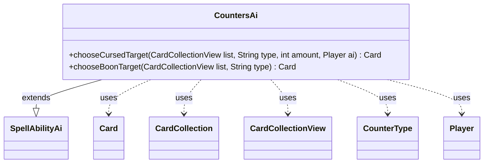

---
aliases:
  - CountersAi
tags:
  - java/class
  - module/forge-ai
  - pkg/forge/ai/ability
fqn: forge.ai.ability.CountersAi
package: forge.ai.ability
module: forge-ai
kind: Class
---

# CountersAi

**Package:** `forge.ai.ability` &nbsp; **Module:** `forge-ai` &nbsp; **Kind:** Class



## Relationships
**Extends:**
- [[forge.ai.SpellAbilityAi|SpellAbilityAi]]
**Uses:**
- [[forge.game.card.Card|Card]]
- [[forge.game.card.CardCollection|CardCollection]]
- [[forge.game.card.CardCollectionView|CardCollectionView]]
- [[forge.game.card.CounterType|CounterType]]
- [[forge.game.player.Player|Player]]

## Design Description

CountersAi is an abstract AI helper in the forge-ai module that extends `SpellAbilityAi` to encapsulate the computer player's target-selection logic for counter-related spells and abilities. It exposes two static utility methods: `chooseCursedTarget`, which picks an opponent's creature to weaken or kill with harmful counters (notably -1/-1 counters, preferring lethal reductions while avoiding wasted effort on Undying creatures), and `chooseBoonTarget`, which selects the AI's own permanent to benefit from positive counters.

The design intent is heuristic prioritization by counter type: +1/+1 counters favor the best creature (falling back to an animatable land), charge counters target the most expensive eligible permanent, and protective counters like DIVINITY/SHIELD prefer valuable destructible permanents. It collaborates with `Card`, `CardCollection(View)`, `CounterType`, and `Player`, delegating valuation to `ComputerUtilCard` and falling back to random choice when no informed heuristic applies. Being abstract with only static helpers, it functions as a shared toolkit consumed by concrete counter ability AIs rather than instantiated directly.

## Source
`forge-ai/src/main/java/forge/ai/ability/CountersAi.java`

```java
/*
 * Forge: Play Magic: the Gathering.
 * Copyright (C) 2011  Forge Team
 *
 * This program is free software: you can redistribute it and/or modify
 * it under the terms of the GNU General Public License as published by
 * the Free Software Foundation, either version 3 of the License, or
 * (at your option) any later version.
 *
 * This program is distributed in the hope that it will be useful,
 * but WITHOUT ANY WARRANTY; without even the implied warranty of
 * MERCHANTABILITY or FITNESS FOR A PARTICULAR PURPOSE.  See the
 * GNU General Public License for more details.
 *
 * You should have received a copy of the GNU General Public License
 * along with this program.  If not, see <http://www.gnu.org/licenses/>.
 */
package forge.ai.ability;

import forge.ai.ComputerUtilCard;
import forge.ai.SpellAbilityAi;
import forge.game.card.*;
import forge.game.keyword.Keyword;
import forge.game.player.Player;
import forge.game.zone.ZoneType;
import forge.util.Aggregates;

import java.util.List;

/**
 * <p>
 * AbilityFactory_Counters class.
 * </p>
 *
 * @author Forge
 * @version $Id$
 */
public abstract class CountersAi extends SpellAbilityAi {

    /**
     * <p>
     * chooseCursedTarget.
     * </p>
     *
     * @param list
     *            a {@link CardCollectionView} object.
     * @param type
     *            a {@link String} object.
     * @param amount
     *            a int.
     * @param ai a {@link Player} object.
     * @return a {@link Card} object.
     */
    public static Card chooseCursedTarget(final CardCollectionView list, final String type, final int amount, final Player ai) {
        Card choice;

        // opponent can always order it so that he gets 0
        if (amount == 1 && ai.getOpponents().getCardsIn(ZoneType.Battlefield).anyMatch(CardPredicates.nameEquals("Vorinclex, Monstrous Raider"))) {
            return null;
        }

        if (type.equals("M1M1")) {
            // try to kill the best killable creature, or reduce the best one
            // but try not to target a Undying Creature
            final List<Card> killable = CardLists.getNotKeyword(CardLists.filterToughness(list, amount), Keyword.UNDYING);
            if (!killable.isEmpty()) {
                choice = ComputerUtilCard.getBestCreatureAI(killable);
            } else {
                choice = ComputerUtilCard.getBestCreatureAI(list);
            }
        } else {
            // improve random choice here
            choice = Aggregates.random(list);
        }
        return choice;
    }

    /**
     * <p>
     * chooseBoonTarget.
     * </p>
     *
     * @param list
     *            a {@link CardCollectionView} object.
     * @param type
     *            a {@link String} object.
     * @return a {@link Card} object.
     */
    public static Card chooseBoonTarget(final CardCollectionView list, final String type) {
        Card choice;
        CounterType counterType = CounterType.getType(type);
        if (counterType == null) {
            return Aggregates.random(list);
        }

        if (counterType.is(CounterEnumType.P1P1)) {
            // TODO look for modified
            choice = ComputerUtilCard.getBestCreatureAI(list);

            if (choice == null) {
                // We'd only get here if list isn't empty, maybe we're trying to animate a land?
                choice = ComputerUtilCard.getBestLandToAnimate(list);
            }
        } else if (counterType.is(CounterEnumType.CHARGE)) {
            final CardCollection boon = CardLists.filter(list, c -> c.getCounters(CounterEnumType.CHARGE) < c.getKeywordMagnitude(Keyword.STATION) || c.getOracleText().matches(".*(for|number|emove) \\w+ (?:charge )counter.*"));
            choice = ComputerUtilCard.getMostExpensivePermanentAI(boon);
        } else if (counterType.isKeywordCounter()) {
            choice = ComputerUtilCard.getBestCreatureAI(CardLists.getNotKeyword(list, type));
        } else {
            CardCollectionView pref = CardLists.filter(list, c -> c.getCounters(counterType) == 0);
            if (type.equals("DIVINITY") || type.equals("SHIELD")) {
                choice = ComputerUtilCard.getMostExpensivePermanentAI(CardLists.filter(pref, Card::canBeDestroyed));
            } else if (pref.isEmpty()) {
                choice = Aggregates.random(list);
            } else {
                choice = ComputerUtilCard.getMostExpensivePermanentAI(pref);
            }
        }
        return choice;
    }

}
```

## Python
`forge/ai/ability/CountersAi.py`

```python
from forge.ai.ComputerUtilCard import ComputerUtilCard
from forge.ai.SpellAbilityAi import SpellAbilityAi
from forge.game.card.Card import Card
from forge.game.card.CardCollection import CardCollection
from forge.game.card.CardCollectionView import CardCollectionView
from forge.game.card.CardLists import CardLists
from forge.game.card.CardPredicates import CardPredicates
from forge.game.card.CounterType import CounterType
from forge.game.card.CounterEnumType import CounterEnumType
from forge.game.keyword.Keyword import Keyword
from forge.game.player.Player import Player
from forge.game.zone.ZoneType import ZoneType
from forge.util.Aggregates import Aggregates

from typing import List


class CountersAi(SpellAbilityAi):
    """
    AbilityFactory_Counters class.

    @author Forge
    @version $Id$
    """

    @staticmethod
    def chooseCursedTarget(list: CardCollectionView, type: str, amount: int, ai: Player) -> Card:
        """
        chooseCursedTarget.

        @param list a CardCollectionView object.
        @param type a String object.
        @param amount a int.
        @param ai a Player object.
        @return a Card object.
        """
        choice: Card

        # opponent can always order it so that he gets 0
        if amount == 1 and ai.getOpponents().getCardsIn(ZoneType.Battlefield).anyMatch(CardPredicates.nameEquals("Vorinclex, Monstrous Raider")):
            return None

        if type == "M1M1":
            # try to kill the best killable creature, or reduce the best one
            # but try not to target a Undying Creature
            killable: List[Card] = CardLists.getNotKeyword(CardLists.filterToughness(list, amount), Keyword.UNDYING)
            if killable:
                choice = ComputerUtilCard.getBestCreatureAI(killable)
            else:
                choice = ComputerUtilCard.getBestCreatureAI(list)
        else:
            # improve random choice here
            choice = Aggregates.random(list)
        return choice

    @staticmethod
    def chooseBoonTarget(list: CardCollectionView, type: str) -> Card:
        """
        chooseBoonTarget.

        @param list a CardCollectionView object.
        @param type a String object.
        @return a Card object.
        """
        choice: Card
        counterType = CounterType.getType(type)
        if counterType is None:
            return Aggregates.random(list)

        if counterType.is_(CounterEnumType.P1P1):
            # TODO look for modified
            choice = ComputerUtilCard.getBestCreatureAI(list)

            if choice is None:
                # We'd only get here if list isn't empty, maybe we're trying to animate a land?
                choice = ComputerUtilCard.getBestLandToAnimate(list)
        elif counterType.is_(CounterEnumType.CHARGE):
            boon: CardCollection = CardLists.filter(list, lambda c: c.getCounters(CounterEnumType.CHARGE) < c.getKeywordMagnitude(Keyword.STATION) or c.getOracleText().matches(r".*(for|number|emove) \w+ (?:charge )counter.*"))
            choice = ComputerUtilCard.getMostExpensivePermanentAI(boon)
        elif counterType.isKeywordCounter():
            choice = ComputerUtilCard.getBestCreatureAI(CardLists.getNotKeyword(list, type))
        else:
            pref: CardCollectionView = CardLists.filter(list, lambda c: c.getCounters(counterType) == 0)
            if type == "DIVINITY" or type == "SHIELD":
                choice = ComputerUtilCard.getMostExpensivePermanentAI(CardLists.filter(pref, Card.canBeDestroyed))
            elif not pref:
                choice = Aggregates.random(list)
            else:
                choice = ComputerUtilCard.getMostExpensivePermanentAI(pref)
        return choice
```
