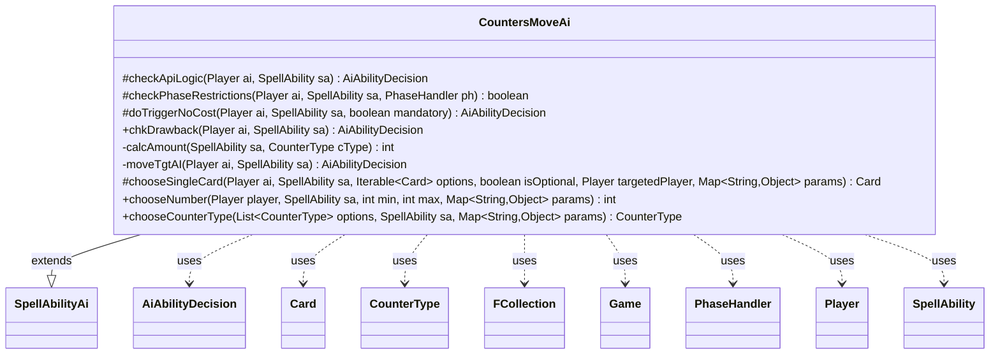

---
aliases:
  - CountersMoveAi
tags:
  - java/class
  - module/forge-ai
  - pkg/forge/ai/ability
fqn: forge.ai.ability.CountersMoveAi
package: forge.ai.ability
module: forge-ai
kind: Class
---

# CountersMoveAi

**Package:** `forge.ai.ability`   **Module:** `forge-ai`   **Kind:** Class



## Relationships
**Extends:**
- [[forge.ai.SpellAbilityAi|SpellAbilityAi]]
**Uses:**
- [[forge.ai.AiAbilityDecision|AiAbilityDecision]]
- [[forge.game.Game|Game]]
- [[forge.game.card.Card|Card]]
- [[forge.game.card.CounterType|CounterType]]
- [[forge.game.phase.PhaseHandler|PhaseHandler]]
- [[forge.game.player.Player|Player]]
- [[forge.game.spellability.SpellAbility|SpellAbility]]
- [[forge.util.collect.FCollection|FCollection]]

## Design Description

CountersMoveAi is the AI decision-making strategy for spell abilities that relocate counters between cards. Extending the abstract `SpellAbilityAi` base, it overrides the standard AI hooks—`checkApiLogic`, `checkPhaseRestrictions`, `doTriggerNoCost`, and `chkDrawback`—plus the player-choice callbacks (`chooseSingleCard`, `chooseNumber`, `chooseCounterType`) to govern when and how the computer player moves counters, most centrally +1/+1 and -1/-1 counters.

Its core responsibility, concentrated in the private `moveTgtAI` helper, is to evaluate whether moving counters is advantageous: it collaborates with `Card`, `CounterType`, `Player`, and `PhaseHandler` to inspect the battlefield, and uses last-known-information copies of cards to simulate the result before committing. The design intent is consistently self-interested—steal counters from opponents (especially to kill attackers in combat), shed negative counters onto enemy creatures, and avoid harming useful or undying creatures—with evaluation-based comparisons (`ComputerUtilCard.evaluateCreature`) ensuring each move yields net gain. Every decision is returned as a weighted `AiAbilityDecision`.

## Source
`forge-ai/src/main/java/forge/ai/ability/CountersMoveAi.java`

```java
package forge.ai.ability;

import com.google.common.collect.Iterables;
import forge.ai.*;
import forge.game.Game;
import forge.game.ability.AbilityUtils;
import forge.game.card.*;
import forge.game.keyword.Keyword;
import forge.game.phase.PhaseHandler;
import forge.game.phase.PhaseType;
import forge.game.player.Player;
import forge.game.spellability.SpellAbility;
import forge.game.zone.ZoneType;
import forge.util.MyRandom;
import forge.util.collect.FCollection;

import java.util.List;
import java.util.Map;

public class CountersMoveAi extends SpellAbilityAi {
    @Override
    protected AiAbilityDecision checkApiLogic(final Player ai, final SpellAbility sa) {
        AiAbilityDecision decision = new AiAbilityDecision(100, AiPlayDecision.WillPlay);
        if (sa.usesTargeting()) {
            sa.resetTargets();
            decision = moveTgtAI(ai, sa);
            if (!decision.willingToPlay()) {
                return decision;
            }
        }

        if (!playReusable(ai, sa)) {
            return new AiAbilityDecision(0, AiPlayDecision.CantPlayAi);
        }

        if (MyRandom.getRandom().nextFloat() < .8f) {
            return decision;
        }

        return new AiAbilityDecision(0, AiPlayDecision.CantPlayAi);
    }

    @Override
    protected boolean checkPhaseRestrictions(final Player ai, final SpellAbility sa, final PhaseHandler ph) {
        final Card host = sa.getHostCard();
        final String type = sa.getParam("CounterType");
        final CounterType cType = "Any".equals(type) ? null : CounterType.getType(type);

        // Don't tap creatures that may be able to block
        if (ComputerUtil.waitForBlocking(sa)) {
            return false;
        }

        if (cType != null && cType.is(CounterEnumType.P1P1) && sa.hasParam("Source")) {
            int amount = calcAmount(sa, cType);
            final List<Card> srcCards = AbilityUtils.getDefinedCards(host, sa.getParam("Source"), sa);
            if (ph.getPlayerTurn().isOpponentOf(ai)) {
                // opponent Creature with +1/+1 counter does attack
                // try to steal counter from it to kill it
                if (ph.inCombat() && ph.getPhase().isBefore(PhaseType.COMBAT_DECLARE_BLOCKERS)) {
                    for (final Card c : srcCards) {
                        // source is not controlled by current player
                        if (!ph.isPlayerTurn(c.getController())) {
                            continue;
                        }

                        int a = c.getCounters(cType);
                        if (a < amount) {
                            continue;
                        }
                        if (ph.getCombat().isAttacking(c)) {
                            // get copy of creature with removed Counter
                            final Card cpy = CardCopyService.getLKICopy(c);
                            // can't use subtract on Copy
                            cpy.setCounters(cType, a - amount);

                            // a removed counter would kill it
                            if (cpy.getNetToughness() <= cpy.getDamage()) {
                                return true;
                            }

                            // something you can't block, try to reduce its attack
                            if (!ComputerUtilCard.canBeBlockedProfitably(ai, cpy, false)) {
                                return true;
                            }
                        }
                    }
                    return false;
                }

            }

            // for Simic Fluxmage and other
            return ph.getNextTurn().equals(ai) && !ph.getPhase().isBefore(PhaseType.END_OF_TURN);

        } else if (cType != null && cType.is(CounterEnumType.P1P1) && sa.hasParam("Defined")) {
            // something like Cyptoplast Root-kin
            if (ph.getPlayerTurn().isOpponentOf(ai)) {
                if (ph.inCombat() && ph.getPhase().isBefore(PhaseType.COMBAT_DECLARE_BLOCKERS)) {

                }
            }
            // for Simic Fluxmage and other
            if (!ph.getNextTurn().equals(ai) || ph.getPhase().isBefore(PhaseType.END_OF_TURN)) {
                return false;
            }
            // Make sure that removing the last counter doesn't kill the creature
            if ("Self".equals(sa.getParam("Source"))) {
                return host == null || host.getNetToughness() - 1 > 0;
            }
        }
        return true;
    }

    @Override
    protected AiAbilityDecision doTriggerNoCost(final Player ai, SpellAbility sa, boolean mandatory) {
        if (sa.usesTargeting()) {
            sa.resetTargets();

            AiAbilityDecision decision = moveTgtAI(ai, sa);
            if (!decision.willingToPlay() && !mandatory) {
                return new AiAbilityDecision(0, AiPlayDecision.TargetingFailed);
            }

            if (!sa.isTargetNumberValid() && mandatory) {
                final Game game = ai.getGame();
                List<Card> tgtCards = CardLists.getTargetableCards(game.getCardsIn(ZoneType.Battlefield), sa);

                if (tgtCards.isEmpty()) {
                    return new AiAbilityDecision(0, AiPlayDecision.TargetingFailed);
                }

                final Card card = ComputerUtilCard.getWorstAI(tgtCards);
                sa.getTargets().add(card);
            }
            return new AiAbilityDecision(100, AiPlayDecision.WillPlay);
        } else {
            // no target Probably something like Graft

            if (mandatory) {
                return new AiAbilityDecision(100, AiPlayDecision.WillPlay);
            }

            final Card host = sa.getHostCard();

            final String type = sa.getParam("CounterType");
            final CounterType cType = "Any".equals(type) ? null : CounterType.getType(type);

            final List<Card> srcCards = AbilityUtils.getDefinedCards(host, sa.getParam("Source"), sa);
            final List<Card> destCards = AbilityUtils.getDefinedCards(host, sa.getParam("Defined"), sa);

            if (srcCards.isEmpty() || destCards.isEmpty()) {
                return new AiAbilityDecision(0, AiPlayDecision.MissingNeededCards);
            }

            final Card src = srcCards.get(0);
            final Card dest = destCards.get(0);

            // for such Trigger, do not move counter to another players creature
            if (!dest.getController().equals(ai)) {
                return new AiAbilityDecision(0, AiPlayDecision.CantPlayAi);
            } else if (ComputerUtilCard.isUselessCreature(ai, dest)) {
                return new AiAbilityDecision(0, AiPlayDecision.CantPlayAi);
            } else if (dest.hasSVar("EndOfTurnLeavePlay")) {
                return new AiAbilityDecision(0, AiPlayDecision.CantPlayAi);
            }

            if (cType != null) {
                if (!dest.canReceiveCounters(cType)) {
                    return new AiAbilityDecision(0, AiPlayDecision.CantPlayAi);
                }
                final int amount = calcAmount(sa, cType);
                int a = src.getCounters(cType);
                if (a < amount) {
                    return new AiAbilityDecision(0, AiPlayDecision.CantPlayAi);
                }

                final Card srcCopy = CardCopyService.getLKICopy(src);
                // can't use subtract on Copy
                srcCopy.setCounters(cType, a - amount);

                final Card destCopy = CardCopyService.getLKICopy(dest);
                destCopy.setCounters(cType, dest.getCounters(cType) + amount);

                int oldEval = ComputerUtilCard.evaluateCreature(src) + ComputerUtilCard.evaluateCreature(dest);
                int newEval = ComputerUtilCard.evaluateCreature(srcCopy) + ComputerUtilCard.evaluateCreature(destCopy);

                if (newEval < oldEval) {
                    return new AiAbilityDecision(0, AiPlayDecision.MissingNeededCards);
                }

                // check for some specific AI preferences
                if ("DontMoveCounterIfLethal".equals(sa.getParam("AILogic"))) {
                    if  (!cType.is(CounterEnumType.P1P1) || src.getNetToughness() - src.getTempToughnessBoost() - 1 > 0) {
                        return new AiAbilityDecision(100, AiPlayDecision.WillPlay);
                    } else {
                        return new AiAbilityDecision(0, AiPlayDecision.CantPlayAi);
                    }
                }
            }
            // no target
            return new AiAbilityDecision(0, AiPlayDecision.CantPlayAi);
        }
    }

    @Override
    public AiAbilityDecision chkDrawback(Player ai, SpellAbility sa) {
        if (sa.usesTargeting()) {
            sa.resetTargets();
            return moveTgtAI(ai, sa);
        }

        return new AiAbilityDecision(100, AiPlayDecision.WillPlay);
    }

    private static int calcAmount(final SpellAbility sa, final CounterType cType) {
        final Card host = sa.getHostCard();

        final String amountStr = sa.getParamOrDefault("CounterNum", "1");

        // TODO handle proper calculation of X values based on Cost
        int amount = 0;

        if (amountStr.equals("All") || amountStr.equals("Any")) {
            // sa has Source, otherwise Source is the Target
            if (sa.hasParam("Source")) {
                final List<Card> srcCards = AbilityUtils.getDefinedCards(host, sa.getParam("Source"), sa);
                for (final Card c : srcCards) {
                    amount += c.getCounters(cType);
                }
            }
        } else {
            amount = AbilityUtils.calculateAmount(host, amountStr, sa);
        }
        return amount;
    }

    private AiAbilityDecision moveTgtAI(final Player ai, final SpellAbility sa) {
        final Card host = sa.getHostCard();
        final Game game = ai.getGame();
        final String type = sa.getParam("CounterType");
        final CounterType cType = "Any".equals(type) || "All".equals(type) ? null : CounterType.getType(type);

        List<Card> tgtCards = CardLists.getTargetableCards(game.getCardsIn(ZoneType.Battlefield), sa);

        if (sa.hasParam("Defined")) {
            final int amount = calcAmount(sa, cType);
            tgtCards = CardLists.filter(tgtCards, CardPredicates.hasCounter(cType));

            // SA uses target for Source
            // Target => Defined
            final List<Card> destCards = AbilityUtils.getDefinedCards(host, sa.getParam("Defined"), sa);

            if (destCards.isEmpty()) {
                // something went wrong
                return new AiAbilityDecision(0, AiPlayDecision.MissingNeededCards);
            }

            final Card dest = destCards.get(0);

            // remove dest from targets, because move doesn't work that way
            tgtCards.remove(dest);

            if (cType != null && !dest.canReceiveCounters(cType)) {
                return new AiAbilityDecision(0, AiPlayDecision.CantPlayAi);
            }

            // preferred logic for this: try to steal counter
            List<Card> oppList = CardLists.filterControlledBy(tgtCards, ai.getOpponents());
            if (!oppList.isEmpty()) {
                List<Card> best = CardLists.filter(oppList, card -> {
                    // do not weak a useless creature if able
                    if (ComputerUtilCard.isUselessCreature(ai, card)) {
                        return false;
                    }

                    final Card srcCardCpy = CardCopyService.getLKICopy(card);
                    // can't use subtract on Copy
                    srcCardCpy.setCounters(cType, srcCardCpy.getCounters(cType) - amount);

                    // do not steal a P1P1 from Undying if it would die this way
                    if (cType != null && cType.is(CounterEnumType.P1P1) && srcCardCpy.getNetToughness() <= 0) {
                        return srcCardCpy.getCounters(cType) > 0 || !card.hasKeyword(Keyword.UNDYING) || card.isToken();
                    }
                    return true;
                });

                // if no Preferred found, try normal list
                if (best.isEmpty()) {
                    best = oppList;
                }

                Card card = ComputerUtilCard.getBestCreatureAI(best);

                if (card != null) {
                    sa.getTargets().add(card);
                    return new AiAbilityDecision(100, AiPlayDecision.WillPlay);
                }

            }

            // from your creature, try to take from the weakest
            FCollection<Player> ally = ai.getAllies();
            ally.add(ai);

            List<Card> aiList = CardLists.filterControlledBy(tgtCards, ally);
            if (!aiList.isEmpty()) {
                List<Card> best = CardLists.filter(aiList, card -> {
                    // gain from useless
                    if (ComputerUtilCard.isUselessCreature(ai, card)) {
                        return true;
                    }

                    // source would leave the game
                    if (card.hasSVar("EndOfTurnLeavePlay")) {
                        return true;
                    }

                    // try to remove P1P1 from undying or evolve
                    if (cType != null && cType.is(CounterEnumType.P1P1)) {
                        if (card.hasKeyword(Keyword.UNDYING) || card.hasKeyword(Keyword.EVOLVE)
                                || card.getNonManaAbilities().anyMatch(ab -> ab.hasParam("Adapt"))) {
                            return true;
                        }
                    }
                    if (cType != null && cType.is(CounterEnumType.M1M1) && card.hasKeyword(Keyword.PERSIST)) {
                        return true;
                    }

                    return false;
                });

                if (best.isEmpty()) {
                    best = aiList;
                }

                Card card = ComputerUtilCard.getWorstCreatureAI(best);

                if (card != null) {
                    sa.getTargets().add(card);
                    return new AiAbilityDecision(100, AiPlayDecision.WillPlay);
                }
            }

            return new AiAbilityDecision(0, AiPlayDecision.TargetingFailed);
        } else if (sa.getMaxTargets() == 2) {
            // TODO
            return new AiAbilityDecision(0, AiPlayDecision.TargetingFailed);
        } else {
            // SA uses target for Defined
            // Source => Targeted
            final List<Card> srcCards = AbilityUtils.getDefinedCards(host, sa.getParam("Source"), sa);

            if (srcCards.isEmpty()) {
                // something went wrong
                return new AiAbilityDecision(0, AiPlayDecision.MissingNeededCards);
            }

            final Card src = srcCards.get(0);
            if (cType != null && src.getCounters(cType) <= 0) {
                return new AiAbilityDecision(0, AiPlayDecision.CantPlayAi);
            }

            Card lkiWithCounters = CardCopyService.getLKICopy(src);
            Card lkiWithoutCounters = CardCopyService.getLKICopy(src);
            if (cType == null) {
                lkiWithoutCounters.clearCounters();
            } else {
                lkiWithoutCounters.setCounters(cType, 0);
            }

            // need to fake animate it for P/T
            lkiWithCounters.addType("Creature");
            lkiWithoutCounters.addType("Creature");

            // go for opponent when higher value implies debuff
            if (ComputerUtilCard.evaluateCreature(lkiWithCounters) > ComputerUtilCard.evaluateCreature(lkiWithoutCounters)) {
                List<Card> aiList = CardLists.filterControlledBy(tgtCards, ai);
                if (!aiList.isEmpty()) {
                    List<Card> best = CardLists.filter(aiList, card -> {
                        // gain from useless
                        if (ComputerUtilCard.isUselessCreature(ai, card)) {
                            return false;
                        }

                        // source would leave the game
                        if (card.hasSVar("EndOfTurnLeavePlay")) {
                            return false;
                        }

                        if (cType != null) {
                            if (cType.is(CounterEnumType.P1P1) && card.hasKeyword(Keyword.UNDYING)) {
                                return false;
                            }
                            if (cType.is(CounterEnumType.M1M1)) {
                                return false;
                            }

                            if (!card.canReceiveCounters(cType)) {
                                return false;
                            }
                        }
                        return true;
                    });

                    if (best.isEmpty()) {
                        best = aiList;
                    }

                    Card card = ComputerUtilCard.getBestCreatureAI(best);

                    if (card != null) {
                        sa.getTargets().add(card);
                        return new AiAbilityDecision(100, AiPlayDecision.WillPlay);
                    }
                }
                final boolean isMandatoryTrigger = (sa.isTrigger() && !sa.isOptionalTrigger())
                        || (sa.getRootAbility().isTrigger() && !sa.getRootAbility().isOptionalTrigger());
                if (!isMandatoryTrigger) {
                    // no good target
                    return new AiAbilityDecision(0, AiPlayDecision.TargetingFailed);
                }
            }

            // move counter to opponents creature but only if you can not steal them
            // try to move to something useless or something that would leave play
            boolean isNegative = cType != null && ComputerUtil.isNegativeCounter(cType, src);
            List<Card> filteredTgtList;
            filteredTgtList = isNegative ? CardLists.filterControlledBy(tgtCards, ai.getOpponents()) :
                CardLists.filterControlledBy(tgtCards, ai.getYourTeam());

            if (!filteredTgtList.isEmpty()) {
                List<Card> best = CardLists.filter(filteredTgtList, card -> {
                    // gain from useless
                    if (isNegative && !ComputerUtilCard.isUselessCreature(ai, card)) {
                        return true;
                    }

                    // source would leave the game
                    if (isNegative && !card.hasSVar("EndOfTurnLeavePlay")) {
                        return true;
                    }

                    return false;
                });

                if (best.isEmpty()) {
                    best = filteredTgtList;
                }

                Card card = ComputerUtilCard.getBestCreatureAI(best);

                if (card != null) {
                    sa.getTargets().add(card);
                    return new AiAbilityDecision(100, AiPlayDecision.WillPlay);
                }
            }
            return new AiAbilityDecision(0, AiPlayDecision.TargetingFailed);
        }
    }

    // used for multiple sources -> defined
    // or for source -> multiple defined
    @Override
    protected Card chooseSingleCard(Player ai, SpellAbility sa, Iterable<Card> options, boolean isOptional,
            Player targetedPlayer, Map<String, Object> params) {
        if (sa.hasParam("AILogic")) {
            String logic = sa.getParam("AILogic");

            if ("ToValid".equals(logic)) {
                // cards like Forgotten Ancient
                // can put counter on any creature, but should only put one on
                // Ai controlled ones
                List<Card> aiCards = CardLists.filterControlledBy(options, ai);
                return ComputerUtilCard.getBestCreatureAI(aiCards);
            } else if ("FromValid".equals(logic)) {
                // cards like Aetherborn Marauder
                return ComputerUtilCard.getWorstCreatureAI(options);
            }
        }
        return Iterables.getFirst(options, null);
    }

    // used when selecting how many counters to move
    @Override
    public int chooseNumber(Player player, SpellAbility sa, int min, int max, Map<String, Object> params) {
        // TODO improve logic behind it
        // like keeping the last counter on a 0/0 creature
        return max;
    }

    @Override
    public CounterType chooseCounterType(List<CounterType> options, SpellAbility sa, Map<String, Object> params) {
        // TODO
        return super.chooseCounterType(options, sa, params);
    }
}
```

## Python
`forge/ai/ability/CountersMoveAi.py`

```python
from forge.ai.AiAbilityDecision import AiAbilityDecision
from forge.ai.AiPlayDecision import AiPlayDecision
from forge.ai.ComputerUtil import ComputerUtil
from forge.ai.ComputerUtilCard import ComputerUtilCard
from forge.ai.SpellAbilityAi import SpellAbilityAi
from forge.game.Game import Game
from forge.game.ability.AbilityUtils import AbilityUtils
from forge.game.card.Card import Card
from forge.game.card.CardCopyService import CardCopyService
from forge.game.card.CardLists import CardLists
from forge.game.card.CardPredicates import CardPredicates
from forge.game.card.CounterEnumType import CounterEnumType
from forge.game.card.CounterType import CounterType
from forge.game.keyword.Keyword import Keyword
from forge.game.phase.PhaseHandler import PhaseHandler
from forge.game.phase.PhaseType import PhaseType
from forge.game.player.Player import Player
from forge.game.spellability.SpellAbility import SpellAbility
from forge.game.zone.ZoneType import ZoneType
from forge.util.MyRandom import MyRandom
from forge.util.collect.FCollection import FCollection

from typing import List, Map


class CountersMoveAi(SpellAbilityAi):
    def checkApiLogic(self, ai: Player, sa: SpellAbility) -> AiAbilityDecision:
        decision = AiAbilityDecision(100, AiPlayDecision.WillPlay)
        if sa.usesTargeting():
            sa.resetTargets()
            decision = self.moveTgtAI(ai, sa)
            if not decision.willingToPlay():
                return decision

        if not self.playReusable(ai, sa):
            return AiAbilityDecision(0, AiPlayDecision.CantPlayAi)

        if MyRandom.getRandom().nextFloat() < 0.8:
            return decision

        return AiAbilityDecision(0, AiPlayDecision.CantPlayAi)

    def checkPhaseRestrictions(self, ai: Player, sa: SpellAbility, ph: PhaseHandler) -> bool:
        host = sa.getHostCard()
        type = sa.getParam("CounterType")
        cType = None if "Any" == type else CounterType.getType(type)

        # Don't tap creatures that may be able to block
        if ComputerUtil.waitForBlocking(sa):
            return False

        if cType is not None and cType.is_(CounterEnumType.P1P1) and sa.hasParam("Source"):
            amount = self.calcAmount(sa, cType)
            srcCards = AbilityUtils.getDefinedCards(host, sa.getParam("Source"), sa)
            if ph.getPlayerTurn().isOpponentOf(ai):
                # opponent Creature with +1/+1 counter does attack
                # try to steal counter from it to kill it
                if ph.inCombat() and ph.getPhase().isBefore(PhaseType.COMBAT_DECLARE_BLOCKERS):
                    for c in srcCards:
                        # source is not controlled by current player
                        if not ph.isPlayerTurn(c.getController()):
                            continue

                        a = c.getCounters(cType)
                        if a < amount:
                            continue
                        if ph.getCombat().isAttacking(c):
                            # get copy of creature with removed Counter
                            cpy = CardCopyService.getLKICopy(c)
                            # can't use subtract on Copy
                            cpy.setCounters(cType, a - amount)

                            # a removed counter would kill it
                            if cpy.getNetToughness() <= cpy.getDamage():
                                return True

                            # something you can't block, try to reduce its attack
                            if not ComputerUtilCard.canBeBlockedProfitably(ai, cpy, False):
                                return True
                    return False

            # for Simic Fluxmage and other
            return ph.getNextTurn().equals(ai) and not ph.getPhase().isBefore(PhaseType.END_OF_TURN)

        elif cType is not None and cType.is_(CounterEnumType.P1P1) and sa.hasParam("Defined"):
            # something like Cyptoplast Root-kin
            if ph.getPlayerTurn().isOpponentOf(ai):
                if ph.inCombat() and ph.getPhase().isBefore(PhaseType.COMBAT_DECLARE_BLOCKERS):
                    pass
            # for Simic Fluxmage and other
            if not ph.getNextTurn().equals(ai) or ph.getPhase().isBefore(PhaseType.END_OF_TURN):
                return False
            # Make sure that removing the last counter doesn't kill the creature
            if "Self" == sa.getParam("Source"):
                return host is None or host.getNetToughness() - 1 > 0
        return True

    def doTriggerNoCost(self, ai: Player, sa: SpellAbility, mandatory: bool) -> AiAbilityDecision:
        if sa.usesTargeting():
            sa.resetTargets()

            decision = self.moveTgtAI(ai, sa)
            if not decision.willingToPlay() and not mandatory:
                return AiAbilityDecision(0, AiPlayDecision.TargetingFailed)

            if not sa.isTargetNumberValid() and mandatory:
                game = ai.getGame()
                tgtCards = CardLists.getTargetableCards(game.getCardsIn(ZoneType.Battlefield), sa)

                if not tgtCards:
                    return AiAbilityDecision(0, AiPlayDecision.TargetingFailed)

                card = ComputerUtilCard.getWorstAI(tgtCards)
                sa.getTargets().add(card)
            return AiAbilityDecision(100, AiPlayDecision.WillPlay)
        else:
            # no target Probably something like Graft

            if mandatory:
                return AiAbilityDecision(100, AiPlayDecision.WillPlay)

            host = sa.getHostCard()

            type = sa.getParam("CounterType")
            cType = None if "Any" == type else CounterType.getType(type)

            srcCards = AbilityUtils.getDefinedCards(host, sa.getParam("Source"), sa)
            destCards = AbilityUtils.getDefinedCards(host, sa.getParam("Defined"), sa)

            if not srcCards or not destCards:
                return AiAbilityDecision(0, AiPlayDecision.MissingNeededCards)

            src = srcCards[0]
            dest = destCards[0]

            # for such Trigger, do not move counter to another players creature
            if not dest.getController().equals(ai):
                return AiAbilityDecision(0, AiPlayDecision.CantPlayAi)
            elif ComputerUtilCard.isUselessCreature(ai, dest):
                return AiAbilityDecision(0, AiPlayDecision.CantPlayAi)
            elif dest.hasSVar("EndOfTurnLeavePlay"):
                return AiAbilityDecision(0, AiPlayDecision.CantPlayAi)

            if cType is not None:
                if not dest.canReceiveCounters(cType):
                    return AiAbilityDecision(0, AiPlayDecision.CantPlayAi)
                amount = self.calcAmount(sa, cType)
                a = src.getCounters(cType)
                if a < amount:
                    return AiAbilityDecision(0, AiPlayDecision.CantPlayAi)

                srcCopy = CardCopyService.getLKICopy(src)
                # can't use subtract on Copy
                srcCopy.setCounters(cType, a - amount)

                destCopy = CardCopyService.getLKICopy(dest)
                destCopy.setCounters(cType, dest.getCounters(cType) + amount)

                oldEval = ComputerUtilCard.evaluateCreature(src) + ComputerUtilCard.evaluateCreature(dest)
                newEval = ComputerUtilCard.evaluateCreature(srcCopy) + ComputerUtilCard.evaluateCreature(destCopy)

                if newEval < oldEval:
                    return AiAbilityDecision(0, AiPlayDecision.MissingNeededCards)

                # check for some specific AI preferences
                if "DontMoveCounterIfLethal" == sa.getParam("AILogic"):
                    if not cType.is_(CounterEnumType.P1P1) or src.getNetToughness() - src.getTempToughnessBoost() - 1 > 0:
                        return AiAbilityDecision(100, AiPlayDecision.WillPlay)
                    else:
                        return AiAbilityDecision(0, AiPlayDecision.CantPlayAi)
            # no target
            return AiAbilityDecision(0, AiPlayDecision.CantPlayAi)

    def chkDrawback(self, ai: Player, sa: SpellAbility) -> AiAbilityDecision:
        if sa.usesTargeting():
            sa.resetTargets()
            return self.moveTgtAI(ai, sa)

        return AiAbilityDecision(100, AiPlayDecision.WillPlay)

    @staticmethod
    def calcAmount(sa: SpellAbility, cType: CounterType) -> int:
        host = sa.getHostCard()

        amountStr = sa.getParamOrDefault("CounterNum", "1")

        # TODO handle proper calculation of X values based on Cost
        amount = 0

        if amountStr == "All" or amountStr == "Any":
            # sa has Source, otherwise Source is the Target
            if sa.hasParam("Source"):
                srcCards = AbilityUtils.getDefinedCards(host, sa.getParam("Source"), sa)
                for c in srcCards:
                    amount += c.getCounters(cType)
        else:
            amount = AbilityUtils.calculateAmount(host, amountStr, sa)
        return amount

    def moveTgtAI(self, ai: Player, sa: SpellAbility) -> AiAbilityDecision:
        host = sa.getHostCard()
        game = ai.getGame()
        type = sa.getParam("CounterType")
        cType = None if "Any" == type or "All" == type else CounterType.getType(type)

        tgtCards = CardLists.getTargetableCards(game.getCardsIn(ZoneType.Battlefield), sa)

        if sa.hasParam("Defined"):
            amount = self.calcAmount(sa, cType)
            tgtCards = CardLists.filter(tgtCards, CardPredicates.hasCounter(cType))

            # SA uses target for Source
            # Target => Defined
            destCards = AbilityUtils.getDefinedCards(host, sa.getParam("Defined"), sa)

            if not destCards:
                # something went wrong
                return AiAbilityDecision(0, AiPlayDecision.MissingNeededCards)

            dest = destCards[0]

            # remove dest from targets, because move doesn't work that way
            tgtCards.remove(dest)

            if cType is not None and not dest.canReceiveCounters(cType):
                return AiAbilityDecision(0, AiPlayDecision.CantPlayAi)

            # preferred logic for this: try to steal counter
            oppList = CardLists.filterControlledBy(tgtCards, ai.getOpponents())
            if oppList:
                def stealPred(card):
                    # do not weak a useless creature if able
                    if ComputerUtilCard.isUselessCreature(ai, card):
                        return False

                    srcCardCpy = CardCopyService.getLKICopy(card)
                    # can't use subtract on Copy
                    srcCardCpy.setCounters(cType, srcCardCpy.getCounters(cType) - amount)

                    # do not steal a P1P1 from Undying if it would die this way
                    if cType is not None and cType.is_(CounterEnumType.P1P1) and srcCardCpy.getNetToughness() <= 0:
                        return srcCardCpy.getCounters(cType) > 0 or not card.hasKeyword(Keyword.UNDYING) or card.isToken()
                    return True

                best = CardLists.filter(oppList, stealPred)

                # if no Preferred found, try normal list
                if not best:
                    best = oppList

                card = ComputerUtilCard.getBestCreatureAI(best)

                if card is not None:
                    sa.getTargets().add(card)
                    return AiAbilityDecision(100, AiPlayDecision.WillPlay)

            # from your creature, try to take from the weakest
            ally = ai.getAllies()
            ally.add(ai)

            aiList = CardLists.filterControlledBy(tgtCards, ally)
            if aiList:
                def weakestPred(card):
                    # gain from useless
                    if ComputerUtilCard.isUselessCreature(ai, card):
                        return True

                    # source would leave the game
                    if card.hasSVar("EndOfTurnLeavePlay"):
                        return True

                    # try to remove P1P1 from undying or evolve
                    if cType is not None and cType.is_(CounterEnumType.P1P1):
                        if (card.hasKeyword(Keyword.UNDYING) or card.hasKeyword(Keyword.EVOLVE)
                                or card.getNonManaAbilities().anyMatch(lambda ab: ab.hasParam("Adapt"))):
                            return True
                    if cType is not None and cType.is_(CounterEnumType.M1M1) and card.hasKeyword(Keyword.PERSIST):
                        return True

                    return False

                best = CardLists.filter(aiList, weakestPred)

                if not best:
                    best = aiList

                card = ComputerUtilCard.getWorstCreatureAI(best)

                if card is not None:
                    sa.getTargets().add(card)
                    return AiAbilityDecision(100, AiPlayDecision.WillPlay)

            return AiAbilityDecision(0, AiPlayDecision.TargetingFailed)
        elif sa.getMaxTargets() == 2:
            # TODO
            return AiAbilityDecision(0, AiPlayDecision.TargetingFailed)
        else:
            # SA uses target for Defined
            # Source => Targeted
            srcCards = AbilityUtils.getDefinedCards(host, sa.getParam("Source"), sa)

            if not srcCards:
                # something went wrong
                return AiAbilityDecision(0, AiPlayDecision.MissingNeededCards)

            src = srcCards[0]
            if cType is not None and src.getCounters(cType) <= 0:
                return AiAbilityDecision(0, AiPlayDecision.CantPlayAi)

            lkiWithCounters = CardCopyService.getLKICopy(src)
            lkiWithoutCounters = CardCopyService.getLKICopy(src)
            if cType is None:
                lkiWithoutCounters.clearCounters()
            else:
                lkiWithoutCounters.setCounters(cType, 0)

            # need to fake animate it for P/T
            lkiWithCounters.addType("Creature")
            lkiWithoutCounters.addType("Creature")

            # go for opponent when higher value implies debuff
            if ComputerUtilCard.evaluateCreature(lkiWithCounters) > ComputerUtilCard.evaluateCreature(lkiWithoutCounters):
                aiList = CardLists.filterControlledBy(tgtCards, ai)
                if aiList:
                    def debuffPred(card):
                        # gain from useless
                        if ComputerUtilCard.isUselessCreature(ai, card):
                            return False

                        # source would leave the game
                        if card.hasSVar("EndOfTurnLeavePlay"):
                            return False

                        if cType is not None:
                            if cType.is_(CounterEnumType.P1P1) and card.hasKeyword(Keyword.UNDYING):
                                return False
                            if cType.is_(CounterEnumType.M1M1):
                                return False

                            if not card.canReceiveCounters(cType):
                                return False
                        return True

                    best = CardLists.filter(aiList, debuffPred)

                    if not best:
                        best = aiList

                    card = ComputerUtilCard.getBestCreatureAI(best)

                    if card is not None:
                        sa.getTargets().add(card)
                        return AiAbilityDecision(100, AiPlayDecision.WillPlay)
                isMandatoryTrigger = ((sa.isTrigger() and not sa.isOptionalTrigger())
                        or (sa.getRootAbility().isTrigger() and not sa.getRootAbility().isOptionalTrigger()))
                if not isMandatoryTrigger:
                    # no good target
                    return AiAbilityDecision(0, AiPlayDecision.TargetingFailed)

            # move counter to opponents creature but only if you can not steal them
            # try to move to something useless or something that would leave play
            isNegative = cType is not None and ComputerUtil.isNegativeCounter(cType, src)
            filteredTgtList = (CardLists.filterControlledBy(tgtCards, ai.getOpponents()) if isNegative
                else CardLists.filterControlledBy(tgtCards, ai.getYourTeam()))

            if filteredTgtList:
                def movePred(card):
                    # gain from useless
                    if isNegative and not ComputerUtilCard.isUselessCreature(ai, card):
                        return True

                    # source would leave the game
                    if isNegative and not card.hasSVar("EndOfTurnLeavePlay"):
                        return True

                    return False

                best = CardLists.filter(filteredTgtList, movePred)

                if not best:
                    best = filteredTgtList

                card = ComputerUtilCard.getBestCreatureAI(best)

                if card is not None:
                    sa.getTargets().add(card)
                    return AiAbilityDecision(100, AiPlayDecision.WillPlay)
            return AiAbilityDecision(0, AiPlayDecision.TargetingFailed)

    # used for multiple sources -> defined
    # or for source -> multiple defined
    def chooseSingleCard(self, ai: Player, sa: SpellAbility, options, isOptional: bool,
            targetedPlayer: Player, params: Map[str, object]) -> Card:
        if sa.hasParam("AILogic"):
            logic = sa.getParam("AILogic")

            if "ToValid" == logic:
                # cards like Forgotten Ancient
                # can put counter on any creature, but should only put one on
                # Ai controlled ones
                aiCards = CardLists.filterControlledBy(options, ai)
                return ComputerUtilCard.getBestCreatureAI(aiCards)
            elif "FromValid" == logic:
                # cards like Aetherborn Marauder
                return ComputerUtilCard.getWorstCreatureAI(options)
        return next(iter(options), None)

    # used when selecting how many counters to move
    def chooseNumber(self, player: Player, sa: SpellAbility, min: int, max: int, params: Map[str, object]) -> int:
        # TODO improve logic behind it
        # like keeping the last counter on a 0/0 creature
        return max

    def chooseCounterType(self, options: List[CounterType], sa: SpellAbility, params: Map[str, object]) -> CounterType:
        # TODO
        return super().chooseCounterType(options, sa, params)
```
