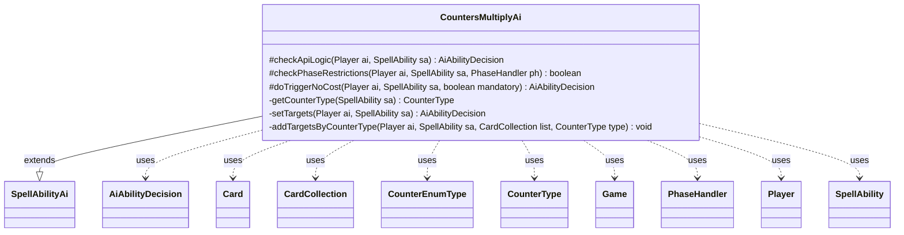

---
aliases:
  - CountersMultiplyAi
tags:
  - java/class
  - module/forge-ai
  - pkg/forge/ai/ability
fqn: forge.ai.ability.CountersMultiplyAi
package: forge.ai.ability
module: forge-ai
kind: Class
---

# CountersMultiplyAi

**Package:** `forge.ai.ability`   **Module:** `forge-ai`   **Kind:** Class



## Relationships
**Extends:**
- [[forge.ai.SpellAbilityAi|SpellAbilityAi]]
**Uses:**
- [[forge.ai.AiAbilityDecision|AiAbilityDecision]]
- [[forge.game.Game|Game]]
- [[forge.game.card.Card|Card]]
- [[forge.game.card.CardCollection|CardCollection]]
- [[forge.game.card.CounterEnumType|CounterEnumType]]
- [[forge.game.card.CounterType|CounterType]]
- [[forge.game.phase.PhaseHandler|PhaseHandler]]
- [[forge.game.player.Player|Player]]
- [[forge.game.spellability.SpellAbility|SpellAbility]]

## Design Description

CountersMultiplyAi supplies the AI's decision-making for spell/ability effects that multiply existing counters on permanents. Extending SpellAbilityAi, it overrides the standard hooks—`checkApiLogic` to confirm worthwhile counter-bearing cards exist, `checkPhaseRestrictions` to time non-P1P1 activations toward main phase two and sorcery speed, and `doTriggerNoCost` to handle forced triggers—while delegating to its private `setTargets` helper.

Its core design intent is value-driven targeting: it prefers doubling beneficial counters on the AI's own cards (prioritizing loyalty, then +1/+1, then charge) and detrimental −1/−1 counters on opponents, avoiding cards bearing negative counters when no specific type is named. `setTargets` and `addTargetsByCounterType` sort candidates by counter quantity and respect Strive cost limits, collaborating with Card, CardCollection, CounterType, and SpellAbility to assemble an optimal target set and return an AiAbilityDecision conveying its willingness to act.

## Source
`forge-ai/src/main/java/forge/ai/ability/CountersMultiplyAi.java`

```java
package forge.ai.ability;

import com.google.common.collect.Lists;
import forge.ai.*;
import forge.game.Game;
import forge.game.ability.AbilityUtils;
import forge.game.card.*;
import forge.game.keyword.Keyword;
import forge.game.phase.PhaseHandler;
import forge.game.phase.PhaseType;
import forge.game.player.Player;
import forge.game.spellability.SpellAbility;
import forge.game.zone.ZoneType;

import java.util.Collections;
import java.util.List;
import java.util.Map;

public class CountersMultiplyAi extends SpellAbilityAi {

    @Override
    protected AiAbilityDecision checkApiLogic(Player ai, SpellAbility sa) {
        if (sa.usesTargeting()) {
            return setTargets(ai, sa);
        }

        final CounterType counterType = getCounterType(sa);
        // defined are mostly Self or Creatures you control
        CardCollection list = AbilityUtils.getDefinedCards(sa.getHostCard(), sa.getParam("Defined"), sa);

        list = CardLists.filter(list, c -> {
            if (!c.hasCounters()) {
                return false;
            }

            if (counterType != null) {
                if (c.getCounters(counterType) <= 0) {
                    return false;
                }
                if (!c.canReceiveCounters(counterType)) {
                    return false;
                }
            } else {
                for (Map.Entry<CounterType, Integer> e : c.getCounters().entrySet()) {
                    // has negative counter it would double
                    if (ComputerUtil.isNegativeCounter(e.getKey(), c)) {
                        return false;
                    }
                }
            }

            return true;
        });

        if (list.isEmpty()) {
            return new AiAbilityDecision(0, AiPlayDecision.MissingNeededCards);
        }

        return super.checkApiLogic(ai, sa);
    }

    @Override
    protected boolean checkPhaseRestrictions(final Player ai, final SpellAbility sa, final PhaseHandler ph) {
        final CounterType counterType = getCounterType(sa);

        if (counterType != null && !counterType.is(CounterEnumType.P1P1)) {
            if (!sa.hasParam("ActivationPhases")) {
                // Don't use non P1P1/M1M1 counters before main 2 if possible
                if (ph.getPhase().isBefore(PhaseType.MAIN2) && !ComputerUtil.castSpellInMain1(ai, sa)) {
                    return false;
                }
                if (ph.isPlayerTurn(ai) && !isSorcerySpeed(sa, ai)) {
                    return false;
                }
            }
        }
        if (ComputerUtil.waitForBlocking(sa)) {
            return false;
        }

        return true;
    }

    @Override
    protected AiAbilityDecision doTriggerNoCost(Player ai, SpellAbility sa, boolean mandatory) {
        if (!sa.usesTargeting()) {
            return new AiAbilityDecision(100, AiPlayDecision.WillPlay);
        }

        AiAbilityDecision decision = setTargets(ai, sa);
        if (decision.willingToPlay()) {
            return decision;
        } else if (mandatory) {
            CardCollection list = CardLists.getTargetableCards(ai.getGame().getCardsIn(ZoneType.Battlefield), sa);
            if (list.isEmpty()) {
                return new AiAbilityDecision(0, AiPlayDecision.TargetingFailed);
            }
            Card safeMatch = list.stream()
                    .filter(CardPredicates.hasCounters().negate())
                    .findFirst().orElse(null);
            sa.getTargets().add(safeMatch == null ? list.getFirst() : safeMatch);
            return new AiAbilityDecision(50, AiPlayDecision.MandatoryPlay);
        }

        return new AiAbilityDecision(0, AiPlayDecision.CantPlayAi);
    }

    private CounterType getCounterType(SpellAbility sa) {
        if (sa.hasParam("CounterType")) {
            try {
                return CounterType.getType(sa.getParam("CounterType"));
            } catch (Exception e) {
                System.out.println("Counter type doesn't match, nor does an SVar exist with the type name.");
                return null;
            }
        }
        return null;
    }

    private AiAbilityDecision setTargets(Player ai, SpellAbility sa) {
        final CounterType counterType = getCounterType(sa);

        final Game game = ai.getGame();

        CardCollection list = CardLists.getTargetableCards(game.getCardsIn(ZoneType.Battlefield), sa);

        // pre filter targetable cards with counters and can receive one of them
        list = CardLists.filter(list, c -> {
            if (!c.hasCounters()) {
                return false;
            }

            if (counterType != null) {
                if (c.getCounters(counterType) <= 0) {
                    return false;
                }
                if (!c.canReceiveCounters(counterType)) {
                    return false;
                }
            }

            return true;
        });

        CardCollection aiList = CardLists.filterControlledBy(list, ai);
        if (!aiList.isEmpty()) {
            // counter type list to check
            // first loyalty, then P1P1, then Charge Counter
            List<CounterEnumType> typeList = Lists.newArrayList(CounterEnumType.LOYALTY, CounterEnumType.P1P1, CounterEnumType.CHARGE);
            for (CounterEnumType type : typeList) {
                // enough targets
                if (!sa.canAddMoreTarget()) {
                    break;
                }

                if (counterType == null || counterType.is(type)) {
                    addTargetsByCounterType(ai, sa, aiList, type);
                }
            }
        }

        CardCollection oppList = CardLists.filterControlledBy(list, ai.getOpponents());
        if (!oppList.isEmpty()) {
            // not enough targets
            if (sa.canAddMoreTarget()) {
                final CounterType type = CounterEnumType.M1M1;
                if (counterType == null || counterType == type) {
                    addTargetsByCounterType(ai, sa, oppList, type);
                }
            }
        }

        // targeting does failed
        if (!sa.isTargetNumberValid() || sa.getTargets().size() == 0) {
            sa.resetTargets();
            return new AiAbilityDecision(0, AiPlayDecision.TargetingFailed);
        }

        return new AiAbilityDecision(100, AiPlayDecision.WillPlay);
    }

    private void addTargetsByCounterType(final Player ai, final SpellAbility sa, final CardCollection list,
            final CounterType type) {
        CardCollection newList = CardLists.filter(list, CardPredicates.hasCounter(type));
        if (newList.isEmpty()) {
            return;
        }

        newList.sort(Collections.reverseOrder(CardPredicates.compareByCounterType(type)));
        while (sa.canAddMoreTarget()) {
            if (newList.isEmpty()) {
                break;
            }

            Card c = newList.remove(0);
            sa.getTargets().add(c);

            // check if Spell with Strive is still playable
            if (sa.isSpell() && sa.getHostCard().hasKeyword(Keyword.STRIVE)) {
                // if not remove target again and break list
                if (!ComputerUtilCost.canPayCost(sa, ai, false)) {
                    sa.getTargets().remove(c);
                    break;
                }
            }
        }
    }
}
```

## Python
`forge/ai/ability/CountersMultiplyAi.py`

```python
from forge.ai.SpellAbilityAi import SpellAbilityAi
from forge.ai.AiAbilityDecision import AiAbilityDecision
from forge.ai.AiPlayDecision import AiPlayDecision
from forge.ai.ComputerUtil import ComputerUtil
from forge.ai.ComputerUtilCost import ComputerUtilCost
from forge.game.Game import Game
from forge.game.ability.AbilityUtils import AbilityUtils
from forge.game.card.Card import Card
from forge.game.card.CardCollection import CardCollection
from forge.game.card.CardLists import CardLists
from forge.game.card.CardPredicates import CardPredicates
from forge.game.card.CounterEnumType import CounterEnumType
from forge.game.card.CounterType import CounterType
from forge.game.keyword.Keyword import Keyword
from forge.game.phase.PhaseHandler import PhaseHandler
from forge.game.phase.PhaseType import PhaseType
from forge.game.player.Player import Player
from forge.game.spellability.SpellAbility import SpellAbility
from forge.game.zone.ZoneType import ZoneType

from functools import cmp_to_key


class CountersMultiplyAi(SpellAbilityAi):

    def checkApiLogic(self, ai: Player, sa: SpellAbility) -> AiAbilityDecision:
        if sa.usesTargeting():
            return self.setTargets(ai, sa)

        counterType = self.getCounterType(sa)
        # defined are mostly Self or Creatures you control
        list = AbilityUtils.getDefinedCards(sa.getHostCard(), sa.getParam("Defined"), sa)

        def _filter(c: Card) -> bool:
            if not c.hasCounters():
                return False

            if counterType is not None:
                if c.getCounters(counterType) <= 0:
                    return False
                if not c.canReceiveCounters(counterType):
                    return False
            else:
                for key, value in c.getCounters().items():
                    # has negative counter it would double
                    if ComputerUtil.isNegativeCounter(key, c):
                        return False

            return True

        list = CardLists.filter(list, _filter)

        if list.isEmpty():
            return AiAbilityDecision(0, AiPlayDecision.MissingNeededCards)

        return super().checkApiLogic(ai, sa)

    def checkPhaseRestrictions(self, ai: Player, sa: SpellAbility, ph: PhaseHandler) -> bool:
        counterType = self.getCounterType(sa)

        if counterType is not None and not counterType.is_(CounterEnumType.P1P1):
            if not sa.hasParam("ActivationPhases"):
                # Don't use non P1P1/M1M1 counters before main 2 if possible
                if ph.getPhase().isBefore(PhaseType.MAIN2) and not ComputerUtil.castSpellInMain1(ai, sa):
                    return False
                if ph.isPlayerTurn(ai) and not self.isSorcerySpeed(sa, ai):
                    return False
        if ComputerUtil.waitForBlocking(sa):
            return False

        return True

    def doTriggerNoCost(self, ai: Player, sa: SpellAbility, mandatory: bool) -> AiAbilityDecision:
        if not sa.usesTargeting():
            return AiAbilityDecision(100, AiPlayDecision.WillPlay)

        decision = self.setTargets(ai, sa)
        if decision.willingToPlay():
            return decision
        elif mandatory:
            list = CardLists.getTargetableCards(ai.getGame().getCardsIn(ZoneType.Battlefield), sa)
            if list.isEmpty():
                return AiAbilityDecision(0, AiPlayDecision.TargetingFailed)
            notHasCounters = CardPredicates.hasCounters().negate()
            safeMatch = next((c for c in list if notHasCounters(c)), None)
            sa.getTargets().add(list.getFirst() if safeMatch is None else safeMatch)
            return AiAbilityDecision(50, AiPlayDecision.MandatoryPlay)

        return AiAbilityDecision(0, AiPlayDecision.CantPlayAi)

    def getCounterType(self, sa: SpellAbility) -> CounterType:
        if sa.hasParam("CounterType"):
            try:
                return CounterType.getType(sa.getParam("CounterType"))
            except Exception as e:
                print("Counter type doesn't match, nor does an SVar exist with the type name.")
                return None
        return None

    def setTargets(self, ai: Player, sa: SpellAbility) -> AiAbilityDecision:
        counterType = self.getCounterType(sa)

        game = ai.getGame()

        list = CardLists.getTargetableCards(game.getCardsIn(ZoneType.Battlefield), sa)

        # pre filter targetable cards with counters and can receive one of them
        def _filter(c: Card) -> bool:
            if not c.hasCounters():
                return False

            if counterType is not None:
                if c.getCounters(counterType) <= 0:
                    return False
                if not c.canReceiveCounters(counterType):
                    return False

            return True

        list = CardLists.filter(list, _filter)

        aiList = CardLists.filterControlledBy(list, ai)
        if not aiList.isEmpty():
            # counter type list to check
            # first loyalty, then P1P1, then Charge Counter
            typeList = [CounterEnumType.LOYALTY, CounterEnumType.P1P1, CounterEnumType.CHARGE]
            for type in typeList:
                # enough targets
                if not sa.canAddMoreTarget():
                    break

                if counterType is None or counterType.is_(type):
                    self.addTargetsByCounterType(ai, sa, aiList, type)

        oppList = CardLists.filterControlledBy(list, ai.getOpponents())
        if not oppList.isEmpty():
            # not enough targets
            if sa.canAddMoreTarget():
                type = CounterEnumType.M1M1
                if counterType is None or counterType == type:
                    self.addTargetsByCounterType(ai, sa, oppList, type)

        # targeting does failed
        if not sa.isTargetNumberValid() or sa.getTargets().size() == 0:
            sa.resetTargets()
            return AiAbilityDecision(0, AiPlayDecision.TargetingFailed)

        return AiAbilityDecision(100, AiPlayDecision.WillPlay)

    def addTargetsByCounterType(self, ai: Player, sa: SpellAbility, list: CardCollection,
            type: CounterType) -> None:
        newList = CardLists.filter(list, CardPredicates.hasCounter(type))
        if newList.isEmpty():
            return

        newList.sort(key=cmp_to_key(CardPredicates.compareByCounterType(type)), reverse=True)
        while sa.canAddMoreTarget():
            if newList.isEmpty():
                break

            c = newList.remove(0)
            sa.getTargets().add(c)

            # check if Spell with Strive is still playable
            if sa.isSpell() and sa.getHostCard().hasKeyword(Keyword.STRIVE):
                # if not remove target again and break list
                if not ComputerUtilCost.canPayCost(sa, ai, False):
                    sa.getTargets().remove(c)
                    break
```
