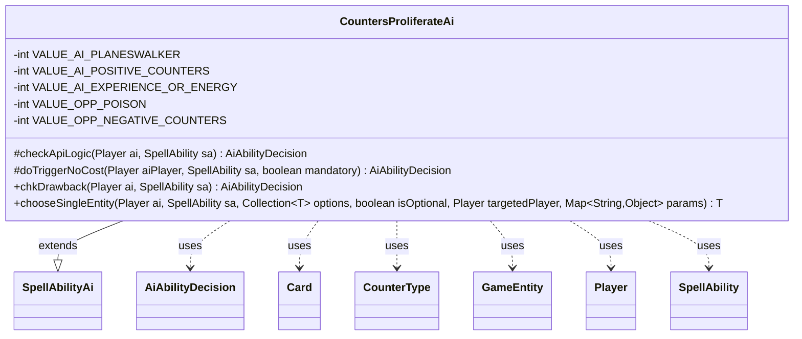

---
aliases:
  - CountersProliferateAi
tags:
  - java/class
  - module/forge-ai
  - pkg/forge/ai/ability
fqn: forge.ai.ability.CountersProliferateAi
package: forge.ai.ability
module: forge-ai
kind: Class
---

# CountersProliferateAi

**Package:** `forge.ai.ability`   **Module:** `forge-ai`   **Kind:** Class



## Relationships
**Extends:**
- [[forge.ai.SpellAbilityAi|SpellAbilityAi]]
**Uses:**
- [[forge.ai.AiAbilityDecision|AiAbilityDecision]]
- [[forge.game.GameEntity|GameEntity]]
- [[forge.game.card.Card|Card]]
- [[forge.game.card.CounterType|CounterType]]
- [[forge.game.player.Player|Player]]
- [[forge.game.spellability.SpellAbility|SpellAbility]]

## Design Description

CountersProliferateAi implements the AI decision logic for the Proliferate ability, determining when and how the computer player should activate effects that add another counter to each permanent and player already bearing one. Extending SpellAbilityAi, it overrides the standard hooks—checkApiLogic, doTriggerNoCost, chkDrawback, and chooseSingleEntity—to plug into Forge's ability-AI framework and returns AiAbilityDecision verdicts.

Its central design intent is a value heuristic: weighted constants score friendly planeswalkers, positive counters, experience/energy, and opponent poison or negative counters, and proliferate is only deemed worthwhile when the summed value justifies the mana cost, with an instant-win shortcut at lethal poison. Collaborating with Player, Card, CounterType, and GameEntity, it inspects battlefield counters per team and, in chooseSingleEntity, uses last-known-information copies and creature evaluation to pick targets that benefit allies while denying opponents.

## Source
`forge-ai/src/main/java/forge/ai/ability/CountersProliferateAi.java`

```java
package forge.ai.ability;

import com.google.common.collect.Lists;
import forge.ai.*;
import forge.game.GameEntity;
import forge.game.card.*;
import forge.game.player.GameLossReason;
import forge.game.player.Player;
import forge.game.spellability.SpellAbility;
import forge.game.zone.ZoneType;
import forge.util.IterableUtil;

import java.util.Collection;
import java.util.List;
import java.util.Map;

public class CountersProliferateAi extends SpellAbilityAi {

    // Values assigned to each proliferate target to calculate total benefit.
    // The AI will only activate proliferate if the total value meets or exceeds the mana cost.
    // Example: Karn's Bastion costs 4 mana, so AI needs value >= 4 to activate.
    // One planeswalker (3) + one creature with +1/+1 counter (1) = 4, which meets the cost.
    private static final int VALUE_AI_PLANESWALKER = 3;
    private static final int VALUE_AI_POSITIVE_COUNTERS = 1;
    private static final int VALUE_AI_EXPERIENCE_OR_ENERGY = 1;
    private static final int VALUE_OPP_POISON = 2;
    private static final int VALUE_OPP_NEGATIVE_COUNTERS = 1;

    @Override
    protected AiAbilityDecision checkApiLogic(Player ai, SpellAbility sa) {
        final List<Card> cperms = Lists.newArrayList();
        boolean allyExpOrEnergy = false;

        for (final Player p : ai.getYourTeam()) {
            // player has experience or energy counter
            if (p.getCounters(CounterEnumType.EXPERIENCE) + p.getCounters(CounterEnumType.ENERGY) >= 1) {
                allyExpOrEnergy = true;
            }
            cperms.addAll(CardLists.filter(p.getCardsIn(ZoneType.Battlefield), crd -> {
                if (!crd.hasCounters()) {
                    return false;
                }

                if (crd.isPlaneswalker()) {
                    return true;
                }

                // iterate only over existing counters
                for (final Map.Entry<CounterType, Integer> e : crd.getCounters().entrySet()) {
                    if (e.getValue() >= 1 && !ComputerUtil.isNegativeCounter(e.getKey(), crd)) {
                        return true;
                    }
                }
                return false;
            }));
        }

        final List<Card> hperms = Lists.newArrayList();
        boolean opponentPoison = false;

        for (final Player o : ai.getOpponents()) {
            // Lethal poison - proliferating would win the game
            if (o.getPoisonCounters() >= 9 && o.canReceiveCounters(CounterEnumType.POISON)
                    && !o.cantLoseCheck(GameLossReason.Poisoned)) {
                return new AiAbilityDecision(100, AiPlayDecision.WillPlay);
            }
            opponentPoison |= o.getPoisonCounters() > 0 && o.canReceiveCounters(CounterEnumType.POISON);
            hperms.addAll(CardLists.filter(o.getCardsIn(ZoneType.Battlefield), crd -> {
                if (!crd.hasCounters()) {
                    return false;
                }

                if (crd.isPlaneswalker()) {
                    return false;
                }

                // iterate only over existing counters
                for (final Map.Entry<CounterType, Integer> e : crd.getCounters().entrySet()) {
                    if (e.getValue() >= 1 && ComputerUtil.isNegativeCounter(e.getKey(), crd)) {
                        return true;
                    }
                }
                return false;
            }));
        }

        int value = CardLists.count(cperms, Card::isPlaneswalker) * VALUE_AI_PLANESWALKER
                + CardLists.count(cperms, c -> !c.isPlaneswalker()) * VALUE_AI_POSITIVE_COUNTERS
                + hperms.size() * VALUE_OPP_NEGATIVE_COUNTERS
                + (opponentPoison ? VALUE_OPP_POISON : 0)
                + (allyExpOrEnergy ? VALUE_AI_EXPERIENCE_OR_ENERGY : 0);

        int manaCost = sa.getPayCosts().getTotalMana().getCMC();
        // calculate a rating from 0 to 100 based on value vs mana cost
        // if value >= mana cost, rating is 100
        // if value is half mana cost, rating is 50, etc.
        int rating = manaCost == 0 ? value : Math.min(100, value / manaCost * 100);
        if (value > 0) {
            return new AiAbilityDecision(rating, AiPlayDecision.WillPlay);
        }
        return new AiAbilityDecision(rating, AiPlayDecision.CantPlayAi);
    }

    @Override
    protected AiAbilityDecision doTriggerNoCost(Player aiPlayer, SpellAbility sa, boolean mandatory) {
        boolean chance = true;

        // TODO Make sure Human has poison counters or there are some counters
        // we want to proliferate
        return new AiAbilityDecision(
                chance ? 100 : 0,
                chance ? AiPlayDecision.WillPlay : AiPlayDecision.CantPlayAi
        );
    }

    /* (non-Javadoc)
     * @see forge.card.abilityfactory.SpellAiLogic#chkAIDrawback(java.util.Map, forge.card.spellability.SpellAbility, forge.game.player.Player)
     */
    @Override
    public AiAbilityDecision chkDrawback(Player ai, SpellAbility sa) {
        if ("Always".equals(sa.getParam("AILogic"))) {
            return new AiAbilityDecision(100, AiPlayDecision.WillPlay);
        }

        return checkApiLogic(ai, sa);
    }

    /*
     * (non-Javadoc)
     * @see forge.ai.SpellAbilityAi#chooseSingleEntity(forge.game.player.Player, forge.game.spellability.SpellAbility, java.util.Collection, boolean, forge.game.player.Player)
     */
    @SuppressWarnings("unchecked")
    @Override
    public <T extends GameEntity> T chooseSingleEntity(Player ai, SpellAbility sa, Collection<T> options, boolean isOptional, Player targetedPlayer, Map<String, Object> params) {
        // Proliferate is always optional for all, no need to select best
        final CounterType poison = CounterEnumType.POISON;

        boolean aggroAI = AiProfileUtil.getBoolProperty(ai, AiProps.PLAY_AGGRO);
        // because countertype can't be chosen anymore, only look for poison counters
        for (final Player p : IterableUtil.filter(options, Player.class)) {
            if (p.isOpponentOf(ai)) {
                if (p.getCounters(poison) > 0 && p.canReceiveCounters(poison)) {
                    return (T) p;
                }
            } else if ((((p.getCounters(poison) <= 5 && aggroAI) || (p.getCounters(poison) == 0)) && p.getCounters(CounterEnumType.EXPERIENCE) + p.getCounters(CounterEnumType.ENERGY) >= 1) || !p.canReceiveCounters(poison)) {
                // poison is risky, should not proliferate them in most cases
                return (T) p;
            }
        }

        for (final Card c : IterableUtil.filter(options, Card.class)) {
            // AI planeswalker always, opponent planeswalkers never
            if (c.isPlaneswalker()) {
                if (c.getController().isOpponentOf(ai)) {
                    continue;
                }
                return (T) c;
            }

            if (c.isBattle()) {
                if (c.getProtectingPlayer().isOpponentOf(ai)) {
                    // TODO in multiplayer we might sometimes want to do it anyway?
                    continue;
                }
                return (T) c;
            }

            final Card lki = CardCopyService.getLKICopy(c);
            // update all the counters there
            boolean hasNegative = false;
            for (final CounterType ct : c.getCounters().keySet()) {
                hasNegative = hasNegative || ComputerUtil.isNegativeCounter(ct, c);
                lki.setCounters(ct, lki.getCounters(ct) + 1);
            }

            // TODO need more logic there?
            // it tries to evaluate the creatures
            if (c.isCreature()) {
                if (c.getController().isOpponentOf(ai) ==
                        (ComputerUtilCard.evaluateCreature(lki, true, false)
                                < ComputerUtilCard.evaluateCreature(c, true, false))) {
                    return (T) c;
                }
            } else {
                if (!c.getController().isOpponentOf(ai) && !hasNegative) {
                    return (T) c;
                }
            }
        }

        return null;
    }
}
```

## Python
`forge/ai/ability/CountersProliferateAi.py`

```python
from forge.ai.SpellAbilityAi import SpellAbilityAi
from forge.ai.AiAbilityDecision import AiAbilityDecision
from forge.ai.AiPlayDecision import AiPlayDecision
from forge.ai.ComputerUtil import ComputerUtil
from forge.ai.ComputerUtilCard import ComputerUtilCard
from forge.ai.AiProfileUtil import AiProfileUtil
from forge.ai.AiProps import AiProps
from forge.game.GameEntity import GameEntity
from forge.game.card.Card import Card
from forge.game.card.CardLists import CardLists
from forge.game.card.CardCopyService import CardCopyService
from forge.game.card.CounterType import CounterType
from forge.game.card.CounterEnumType import CounterEnumType
from forge.game.player.GameLossReason import GameLossReason
from forge.game.player.Player import Player
from forge.game.spellability.SpellAbility import SpellAbility
from forge.game.zone.ZoneType import ZoneType
from forge.util.IterableUtil import IterableUtil

from typing import Collection, List, Map, TypeVar

T = TypeVar("T", bound=GameEntity)


class CountersProliferateAi(SpellAbilityAi):

    # Values assigned to each proliferate target to calculate total benefit.
    # The AI will only activate proliferate if the total value meets or exceeds the mana cost.
    # Example: Karn's Bastion costs 4 mana, so AI needs value >= 4 to activate.
    # One planeswalker (3) + one creature with +1/+1 counter (1) = 4, which meets the cost.
    VALUE_AI_PLANESWALKER = 3
    VALUE_AI_POSITIVE_COUNTERS = 1
    VALUE_AI_EXPERIENCE_OR_ENERGY = 1
    VALUE_OPP_POISON = 2
    VALUE_OPP_NEGATIVE_COUNTERS = 1

    def checkApiLogic(self, ai: Player, sa: SpellAbility) -> AiAbilityDecision:
        cperms: list[Card] = []
        allyExpOrEnergy = False

        for p in ai.getYourTeam():
            # player has experience or energy counter
            if p.getCounters(CounterEnumType.EXPERIENCE) + p.getCounters(CounterEnumType.ENERGY) >= 1:
                allyExpOrEnergy = True

            def cfilter(crd):
                if not crd.hasCounters():
                    return False

                if crd.isPlaneswalker():
                    return True

                # iterate only over existing counters
                for e in crd.getCounters().entrySet():
                    if e.getValue() >= 1 and not ComputerUtil.isNegativeCounter(e.getKey(), crd):
                        return True
                return False

            cperms.extend(CardLists.filter(p.getCardsIn(ZoneType.Battlefield), cfilter))

        hperms: list[Card] = []
        opponentPoison = False

        for o in ai.getOpponents():
            # Lethal poison - proliferating would win the game
            if o.getPoisonCounters() >= 9 and o.canReceiveCounters(CounterEnumType.POISON) \
                    and not o.cantLoseCheck(GameLossReason.Poisoned):
                return AiAbilityDecision(100, AiPlayDecision.WillPlay)

            opponentPoison |= o.getPoisonCounters() > 0 and o.canReceiveCounters(CounterEnumType.POISON)

            def hfilter(crd):
                if not crd.hasCounters():
                    return False

                if crd.isPlaneswalker():
                    return False

                # iterate only over existing counters
                for e in crd.getCounters().entrySet():
                    if e.getValue() >= 1 and ComputerUtil.isNegativeCounter(e.getKey(), crd):
                        return True
                return False

            hperms.extend(CardLists.filter(o.getCardsIn(ZoneType.Battlefield), hfilter))

        value = CardLists.count(cperms, lambda c: c.isPlaneswalker()) * self.VALUE_AI_PLANESWALKER \
            + CardLists.count(cperms, lambda c: not c.isPlaneswalker()) * self.VALUE_AI_POSITIVE_COUNTERS \
            + len(hperms) * self.VALUE_OPP_NEGATIVE_COUNTERS \
            + (self.VALUE_OPP_POISON if opponentPoison else 0) \
            + (self.VALUE_AI_EXPERIENCE_OR_ENERGY if allyExpOrEnergy else 0)

        manaCost = sa.getPayCosts().getTotalMana().getCMC()
        # calculate a rating from 0 to 100 based on value vs mana cost
        # if value >= mana cost, rating is 100
        # if value is half mana cost, rating is 50, etc.
        rating = value if manaCost == 0 else min(100, value // manaCost * 100)
        if value > 0:
            return AiAbilityDecision(rating, AiPlayDecision.WillPlay)
        return AiAbilityDecision(rating, AiPlayDecision.CantPlayAi)

    def doTriggerNoCost(self, aiPlayer: Player, sa: SpellAbility, mandatory: bool) -> AiAbilityDecision:
        chance = True

        # TODO Make sure Human has poison counters or there are some counters
        # we want to proliferate
        return AiAbilityDecision(
            100 if chance else 0,
            AiPlayDecision.WillPlay if chance else AiPlayDecision.CantPlayAi
        )

    # (non-Javadoc)
    # @see forge.card.abilityfactory.SpellAiLogic#chkAIDrawback(java.util.Map, forge.card.spellability.SpellAbility, forge.game.player.Player)
    def chkDrawback(self, ai: Player, sa: SpellAbility) -> AiAbilityDecision:
        if "Always" == sa.getParam("AILogic"):
            return AiAbilityDecision(100, AiPlayDecision.WillPlay)

        return self.checkApiLogic(ai, sa)

    #
    # (non-Javadoc)
    # @see forge.ai.SpellAbilityAi#chooseSingleEntity(forge.game.player.Player, forge.game.spellability.SpellAbility, java.util.Collection, boolean, forge.game.player.Player)
    def chooseSingleEntity(self, ai: Player, sa: SpellAbility, options: Collection[T], isOptional: bool, targetedPlayer: Player, params: Map[str, object]) -> T:
        # Proliferate is always optional for all, no need to select best
        poison = CounterEnumType.POISON

        aggroAI = AiProfileUtil.getBoolProperty(ai, AiProps.PLAY_AGGRO)
        # because countertype can't be chosen anymore, only look for poison counters
        for p in IterableUtil.filter(options, Player):
            if p.isOpponentOf(ai):
                if p.getCounters(poison) > 0 and p.canReceiveCounters(poison):
                    return p
            elif (((p.getCounters(poison) <= 5 and aggroAI) or (p.getCounters(poison) == 0)) and p.getCounters(CounterEnumType.EXPERIENCE) + p.getCounters(CounterEnumType.ENERGY) >= 1) or not p.canReceiveCounters(poison):
                # poison is risky, should not proliferate them in most cases
                return p

        for c in IterableUtil.filter(options, Card):
            # AI planeswalker always, opponent planeswalkers never
            if c.isPlaneswalker():
                if c.getController().isOpponentOf(ai):
                    continue
                return c

            if c.isBattle():
                if c.getProtectingPlayer().isOpponentOf(ai):
                    # TODO in multiplayer we might sometimes want to do it anyway?
                    continue
                return c

            lki = CardCopyService.getLKICopy(c)
            # update all the counters there
            hasNegative = False
            for ct in c.getCounters().keySet():
                hasNegative = hasNegative or ComputerUtil.isNegativeCounter(ct, c)
                lki.setCounters(ct, lki.getCounters(ct) + 1)

            # TODO need more logic there?
            # it tries to evaluate the creatures
            if c.isCreature():
                if c.getController().isOpponentOf(ai) == \
                        (ComputerUtilCard.evaluateCreature(lki, True, False)
                         < ComputerUtilCard.evaluateCreature(c, True, False)):
                    return c
            else:
                if not c.getController().isOpponentOf(ai) and not hasNegative:
                    return c

        return None
```
