---
aliases:
  - CountersPutAi
tags:
  - java/class
  - module/forge-ai
  - pkg/forge/ai/ability
fqn: forge.ai.ability.CountersPutAi
package: forge.ai.ability
module: forge-ai
kind: Class
---

# CountersPutAi

**Package:** `forge.ai.ability`   **Module:** `forge-ai`   **Kind:** Class



```mermaid
classDiagram
    class CountersPutAi {
        #willPayCosts(Player payer, SpellAbility sa, Cost cost, Card source) boolean
        #checkPhaseRestrictions(Player ai, SpellAbility sa, PhaseHandler ph) boolean
        #checkApiLogic(Player ai, SpellAbility sa) AiAbilityDecision
        +chkDrawback(Player ai, SpellAbility sa) AiAbilityDecision
        #doTriggerNoCost(Player ai, SpellAbility sa, boolean mandatory) AiAbilityDecision
        +confirmAction(Player player, SpellAbility sa, PlayerActionConfirmMode mode, String message, Map~String,Object~ params) boolean
        +chooseSinglePlayer(Player ai, SpellAbility sa, Iterable~Player~ options, Map~String,Object~ params) Player
        #chooseSingleCard(Player ai, SpellAbility sa, Iterable~Card~ options, boolean isOptional, Player targetedPlayer, Map~String,Object~ params) Card
        +chooseCounterType(List~CounterType~ options, SpellAbility sa, Map~String,Object~ params) CounterType
        -doMoveCounterLogic(Player ai, SpellAbility sa, PhaseHandler ph) AiAbilityDecision
        -doCombatAdaptLogic(Card source, int amount, Combat combat) AiAbilityDecision
        +chooseNumber(Player player, SpellAbility sa, int min, int max, Map~String,Object~ params) int
        -doChargeToCMCLogic(Player ai, SpellAbility sa) AiAbilityDecision
        -doChargeToOppCtrlCMCLogic(Player ai, SpellAbility sa) AiAbilityDecision
        -doStationAi(Player ai, SpellAbility sa) AiAbilityDecision
    }
    CountersPutAi --|> CountersAi : extends
    CountersPutAi ..> AbilitySub : uses
    CountersPutAi ..> AiAbilityDecision : uses
    CountersPutAi ..> Card : uses
    CountersPutAi ..> CardCollection : uses
    CountersPutAi ..> CardCollectionView : uses
    CountersPutAi ..> Combat : uses
    CountersPutAi ..> Cost : uses
    CountersPutAi ..> CostPart : uses
    CountersPutAi ..> CostPutCounter : uses
    CountersPutAi ..> CostRemoveCounter : uses
    CountersPutAi ..> CostSacrifice : uses
    CountersPutAi ..> CounterType : uses
    CountersPutAi ..> Game : uses
    CountersPutAi ..> GameEntity : uses
    CountersPutAi ..> PhaseHandler : uses
    CountersPutAi ..> Player : uses
    CountersPutAi ..> PlayerActionConfirmMode : uses
    CountersPutAi ..> PlayerCollection : uses
    CountersPutAi ..> SpellAbility : uses
    CountersPutAi ..> StaticAbility : uses
    CountersPutAi ..> TargetRestrictions : uses
    CountersPutAi ..> Trigger : uses
```

## Relationships
**Extends:**
- [[forge.ai.ability.CountersAi|CountersAi]]
**Uses:**
- [[forge.ai.AiAbilityDecision|AiAbilityDecision]]
- [[forge.game.Game|Game]]
- [[forge.game.GameEntity|GameEntity]]
- [[forge.game.card.Card|Card]]
- [[forge.game.card.CardCollection|CardCollection]]
- [[forge.game.card.CardCollectionView|CardCollectionView]]
- [[forge.game.card.CounterType|CounterType]]
- [[forge.game.combat.Combat|Combat]]
- [[forge.game.cost.Cost|Cost]]
- [[forge.game.cost.CostPart|CostPart]]
- [[forge.game.cost.CostPutCounter|CostPutCounter]]
- [[forge.game.cost.CostRemoveCounter|CostRemoveCounter]]
- [[forge.game.cost.CostSacrifice|CostSacrifice]]
- [[forge.game.phase.PhaseHandler|PhaseHandler]]
- [[forge.game.player.Player|Player]]
- [[forge.game.player.PlayerActionConfirmMode|PlayerActionConfirmMode]]
- [[forge.game.player.PlayerCollection|PlayerCollection]]
- [[forge.game.spellability.AbilitySub|AbilitySub]]
- [[forge.game.spellability.SpellAbility|SpellAbility]]
- [[forge.game.spellability.TargetRestrictions|TargetRestrictions]]
- [[forge.game.staticability.StaticAbility|StaticAbility]]
- [[forge.game.trigger.Trigger|Trigger]]

## Design Description

CountersPutAi is the forge-ai decision module that drives how the computer player evaluates and executes "put counters" spell abilities. Extending CountersAi (which supplies shared counter-targeting helpers like chooseBoonTarget and chooseCursedTarget), it overrides the SpellAbilityAi hook methods—willPayCosts, checkPhaseRestrictions, checkApiLogic, chkDrawback, and doTriggerNoCost—to decide whether playing the ability is worthwhile and to select beneficial or cursed targets among Cards and Players. Its central responsibility is computing counter amounts and target choices across a large catalog of special cases, dispatched primarily through an "AILogic" parameter (MoveCounter, ChargeToBestCMC, Station, energy conservation, named-card behaviors), with combat-aware reasoning via Combat, PhaseHandler, and CounterType.

The design intent is a single, heavily branched policy class that centralizes counter heuristics rather than scattering them: it favors P1P1/M1M1 timing rules, guards against self-destructive or wasted counters, defers non-combat counters until Main 2, and delegates the most idiosyncratic cards to dedicated private helpers and SpecialCardAi/SpecialAiLogic collaborators.

## Source
`forge-ai/src/main/java/forge/ai/ability/CountersPutAi.java`

```java
package forge.ai.ability;

import com.google.common.collect.Iterables;
import com.google.common.collect.Lists;
import forge.ai.*;
import forge.game.Game;
import forge.game.GameEntity;
import forge.game.ability.AbilityUtils;
import forge.game.ability.ApiType;
import forge.game.card.*;
import forge.game.combat.Combat;
import forge.game.combat.CombatUtil;
import forge.game.cost.*;
import forge.game.keyword.Keyword;
import forge.game.phase.PhaseHandler;
import forge.game.phase.PhaseType;
import forge.game.player.Player;
import forge.game.player.PlayerActionConfirmMode;
import forge.game.player.PlayerCollection;
import forge.game.player.PlayerPredicates;
import forge.game.spellability.AbilitySub;
import forge.game.spellability.SpellAbility;
import forge.game.spellability.TargetRestrictions;
import forge.game.staticability.StaticAbility;
import forge.game.trigger.Trigger;
import forge.game.trigger.TriggerType;
import forge.game.zone.ZoneType;
import forge.util.Aggregates;
import forge.util.IterableUtil;
import forge.util.MyRandom;

import java.util.Collections;
import java.util.List;
import java.util.Map;
import java.util.function.Predicate;

public class CountersPutAi extends CountersAi {

    /*
     * (non-Javadoc)
     *
     * @see forge.ai.SpellAbilityAi#willPayCosts(forge.game.player.Player,
     * forge.game.spellability.SpellAbility, forge.game.cost.Cost,
     * forge.game.card.Card)
     */
    @Override
    protected boolean willPayCosts(Player payer, SpellAbility sa, Cost cost, Card source) {
        final String type = sa.getParam("CounterType");
        final String aiLogic = sa.getParamOrDefault("AILogic", "");

        if (!super.willPayCosts(payer, sa, cost, source)) {
            return false;
        }

        // disable moving counters (unless a specialized AI logic supports it)
        for (final CostPart part : cost.getCostParts()) {
            if (part instanceof CostRemoveCounter remCounter) {
                final CounterType counterType = remCounter.counter;
                if (counterType.getName().equals(type) && !aiLogic.startsWith("MoveCounter")) {
                    return false;
                }
                if (!part.payCostFromSource()) {
                    if (counterType.is(CounterEnumType.P1P1)) {
                        return false;
                    }
                    continue;
                }
                // don't kill the creature
                if (counterType.is(CounterEnumType.P1P1) && source.getLethalDamage() <= 1) {
                    return false;
                }
            }
        }

        return true;
    }

    /*
     * (non-Javadoc)
     *
     * @see
     * forge.ai.SpellAbilityAi#checkPhaseRestrictions(forge.game.player.Player,
     * forge.game.spellability.SpellAbility, forge.game.phase.PhaseHandler)
     */
    @Override
    protected boolean checkPhaseRestrictions(Player ai, SpellAbility sa, PhaseHandler ph) {
        final Card source = sa.getHostCard();

        if (sa.isOutlast()) {
            if (ph.is(PhaseType.MAIN2, ai)) { // applicable to non-attackers only
                float chance = 0.8f;
                if (ComputerUtilCard.doesSpecifiedCreatureBlock(ai, source)) {
                    return false;
                }
                return chance > MyRandom.getRandom().nextFloat();
            }
            return false;
        }

        if (sa.isKeyword(Keyword.LEVEL_UP)) {
            // creatures enchanted by curse auras have low priority
            if (ph.getPhase().isBefore(PhaseType.MAIN2)) {
                for (Card aura : source.getEnchantedBy()) {
                    if (aura.getController().isOpponentOf(ai)) {
                        return false;
                    }
                }
            }
            int maxLevel = 0;
            for (StaticAbility st : source.getStaticAbilities()) {
                if (st.toString().startsWith("LEVEL ")) {
                    maxLevel = Math.max(maxLevel, Integer.parseInt(st.toString().substring(6, 7)));
                }
            }
            return source.getCounters(CounterEnumType.LEVEL) < maxLevel;
        }

        if ("CrawlingBarrens".equals(sa.getParam("AILogic"))) {
            return true;
        }

        return super.checkPhaseRestrictions(ai, sa, ph);
    }

    @Override
    protected AiAbilityDecision checkApiLogic(Player ai, final SpellAbility sa) {
        // AI needs to be expanded, since this function can be pretty complex
        // based on what the expected targets could be
        final Cost abCost = sa.getPayCosts();
        final Card source = sa.getHostCard();
        final Game game = ai.getGame();
        final String sourceName = ComputerUtilAbility.getAbilitySourceName(sa);
        Card choice = null;
        final String amountStr = sa.getParamOrDefault("CounterNum", "1");
        final boolean divided = sa.isDividedAsYouChoose();
        final String logic = sa.getParamOrDefault("AILogic", "");
        PhaseHandler ph = game.getPhaseHandler();
        final String[] types;
        if (sa.hasParam("CounterType")) {
            // TODO some cards let you choose types, should check each
            types = sa.getParam("CounterType").split(",");
        } else {
            // all types will be added
            types = sa.getParam("CounterTypes").split(",");
        }
        final String type = types[0];

        final boolean isClockwork = "True".equals(sa.getParam("UpTo")) && "Self".equals(sa.getParam("Defined"))
                && "P1P0".equals(sa.getParam("CounterType")) && "Count$xPaid".equals(source.getSVar("X"))
                && sa.hasParam("MaxFromEffect");
        boolean playAggro = AiProfileUtil.getBoolProperty(ai, AiProps.PLAY_AGGRO);

        if ("ExistingCounter".equals(type)) {
            final boolean eachExisting = sa.hasParam("EachExistingCounter");
            // Prevent animation module from crashing for now
            // TODO needs AI for targeting with this type

            if (sa.usesTargeting()) {
                sa.resetTargets();
                final TargetRestrictions abTgt = sa.getTargetRestrictions();
                if (abTgt.canTgtPlayer()) {
                    // try to kill opponent with Poison
                    PlayerCollection oppList = ai.getOpponents().filter(PlayerPredicates.isTargetableBy(sa));
                    PlayerCollection poisonList = oppList.filter(PlayerPredicates.hasCounter(CounterEnumType.POISON, 9));
                    if (!poisonList.isEmpty()) {
                        sa.getTargets().add(poisonList.max(PlayerPredicates.compareByLife()));
                        return new AiAbilityDecision(1000, AiPlayDecision.WillPlay);
                    }
                }

                if (abTgt.canTgtCreature()) {
                    // try to kill creature with -1/-1 counters if it can
                    // receive counters, except it has undying
                    CardCollection oppCreat = CardLists.getTargetableCards(ai.getOpponents().getCreaturesInPlay(), sa);
                    CardCollection oppCreatM1 = CardLists.filter(oppCreat, CardPredicates.hasCounter(CounterEnumType.M1M1));
                    oppCreatM1 = CardLists.getNotKeyword(oppCreatM1, Keyword.UNDYING);

                    oppCreatM1 = CardLists.filter(oppCreatM1, input -> input.getNetToughness() <= 1 && input.canReceiveCounters(CounterEnumType.M1M1));

                    Card best = ComputerUtilCard.getBestAI(oppCreatM1);
                    if (best != null) {
                        sa.getTargets().add(best);
                        return new AiAbilityDecision(100, AiPlayDecision.WillPlay);
                    }

                    CardCollection aiCreat = CardLists.getTargetableCards(ai.getCreaturesInPlay(), sa);
                    aiCreat = CardLists.filter(aiCreat, CardPredicates.hasCounters());

                    aiCreat = CardLists.filter(aiCreat, input -> {
                        for (CounterType counterType : input.getCounters().keySet()) {
                            if (!ComputerUtil.isNegativeCounter(counterType, input)
                                    && input.canReceiveCounters(counterType)) {
                                return true;
                            }
                        }
                        return false;
                    });

                    // TODO check whole state which creature would be the best
                    best = ComputerUtilCard.getBestAI(aiCreat);
                    if (best != null) {
                        sa.getTargets().add(best);
                        return new AiAbilityDecision(100, AiPlayDecision.WillPlay);
                    }
                }

                if (sa.canTarget(ai)) {
                    // don't target itself when its forced to add poison counters too
                    if (!ai.getCounters().isEmpty()) {
                        if (!eachExisting || ai.getPoisonCounters() < 5) {
                            sa.getTargets().add(ai);
                            return new AiAbilityDecision(100, AiPlayDecision.WillPlay);
                        }
                    }
                }

            }

            return new AiAbilityDecision(0, AiPlayDecision.CantPlayAi);
        }

        if ("AlwaysWithNoTgt".equals(logic)) {
            return new AiAbilityDecision(100, AiPlayDecision.WillPlay);
        } else if ("AristocratCounters".equals(logic)) {
            return SpecialAiLogic.doAristocratWithCountersLogic(ai, sa);
        } else if ("PayEnergy".equals(logic)) {
            return new AiAbilityDecision(100, AiPlayDecision.WillPlay);
        } else if ("PayEnergyConservatively".equals(logic)) {
            boolean onlyInCombat = AiProfileUtil.getBoolProperty(ai, AiProps.CONSERVATIVE_ENERGY_PAYMENT_ONLY_IN_COMBAT);
            boolean onlyDefensive = AiProfileUtil.getBoolProperty(ai, AiProps.CONSERVATIVE_ENERGY_PAYMENT_ONLY_DEFENSIVELY);

            if (playAggro) {
                // aggro profiles ignore conservative play for this AI logic
                return new AiAbilityDecision(100, AiPlayDecision.WillPlay);
            } else if (ph.inCombat() && source != null) {
                if (ai.getGame().getCombat().isAttacking(source) && !onlyDefensive) {
                    return new AiAbilityDecision(100, AiPlayDecision.ImpactCombat);
                } else if (ai.getGame().getCombat().isBlocking(source)) {
                    // when blocking, consider this if it's possible to save the blocker and/or kill at least one attacker
                    CardCollection blocked = ai.getGame().getCombat().getAttackersBlockedBy(source);
                    int totBlkPower = Aggregates.sum(blocked, Card::getNetPower);
                    int totBlkToughness = Aggregates.min(blocked, Card::getNetToughness);

                    int numActivations = ai.getCounters(CounterEnumType.ENERGY) / sa.getPayCosts().getCostEnergy().convertAmount();
                    if (source.getNetToughness() + numActivations > totBlkPower
                            || source.getNetPower() + numActivations >= totBlkToughness) {
                        return new AiAbilityDecision(100, AiPlayDecision.ImpactCombat);
                    }
                }
            } else if (sa.getSubAbility() != null
                        && "Self".equals(sa.getSubAbility().getParam("Defined"))
                        && sa.getSubAbility().getParamOrDefault("KW", "").contains("Hexproof")
                        && !source.getAbilityActivatedThisTurn().getActivators(sa).contains(ai)) {
                    // Bristling Hydra: save from death using a ping activation
                    if (ComputerUtil.predictThreatenedObjects(sa.getActivatingPlayer(), sa).contains(source)) {
                        return new AiAbilityDecision(100, AiPlayDecision.WillPlay);
                    }
            } else if (ai.getCounters(CounterEnumType.ENERGY) > ComputerUtilCard.getMaxSAEnergyCostOnBattlefield(ai) + sa.getPayCosts().getCostEnergy().convertAmount()) {
                // outside of combat, this logic only works if the relevant AI profile option is enabled
                // and if there is enough energy saved
                if (!onlyInCombat) {
                    return new AiAbilityDecision(100, AiPlayDecision.WillPlay);
                }
            }
        } else if (logic.equals("MarkOppCreature")) {
            if (!ph.is(PhaseType.END_OF_TURN)) {
                return new AiAbilityDecision(0, AiPlayDecision.WaitForEndOfTurn);
            }

            Predicate<Card> predicate = CardPredicates.hasCounter(CounterType.getType(type));
            CardCollection oppCreats = CardLists.filter(ai.getOpponents().getCreaturesInPlay(),
                    predicate.negate(),
                            CardPredicates.isTargetableBy(sa));

            if (!oppCreats.isEmpty()) {
                Card bestCreat = ComputerUtilCard.getBestCreatureAI(oppCreats);
                sa.resetTargets();
                sa.getTargets().add(bestCreat);
                return new AiAbilityDecision(100, AiPlayDecision.WillPlay);
            }
        } else if (logic.equals("CheckDFC")) {
            // for cards like Ludevic's Test Subject
            if (!source.canTransform(null)) {
                return new AiAbilityDecision(0, AiPlayDecision.CantPlayAi);
            }
        } else if (logic.startsWith("MoveCounter")) {
            return doMoveCounterLogic(ai, sa, ph);
        } else if (logic.equals("CrawlingBarrens")) {
            boolean willActivate = SpecialCardAi.CrawlingBarrens.consider(ai, sa);
            if (willActivate && ph.getPhase().isBefore(PhaseType.MAIN2)) {
                // don't use this for mana until after combat
                AiCardMemory.rememberCard(ai, source, AiCardMemory.MemorySet.HELD_MANA_SOURCES_FOR_MAIN2);
                return new AiAbilityDecision(25, AiPlayDecision.WaitForMain2);
            }

            if (willActivate) {
                return new AiAbilityDecision(100, AiPlayDecision.WillPlay);
            }
            return new AiAbilityDecision(0, AiPlayDecision.CantPlayAi);
        } else if (logic.equals("ChargeToBestCMC")) {
            return doChargeToCMCLogic(ai, sa);
        } else if (logic.equals("ChargeToBestOppControlledCMC")) {
            return doChargeToOppCtrlCMCLogic(ai, sa);
        } else if (logic.equals("TheOneRing")) {
            return SpecialCardAi.TheOneRing.consider(ai, sa);
        } else if (sa.isKeyword(Keyword.STATION)) {
            return doStationAi(ai, sa);
        }

        if (sourceName.equals("Feat of Resistance")) { // sub-ability should take precedence
            CardCollection prot = ProtectAi.getProtectCreatures(ai, sa.getSubAbility());
            if (!prot.isEmpty()) {
                sa.getTargets().add(prot.get(0));
                return new AiAbilityDecision(100, AiPlayDecision.ImpactCombat);
            }
        }

        if (sa.hasParam("Bolster")) {
            CardCollection creatsYouCtrl = ai.getCreaturesInPlay();
            List<Card> leastToughness = Aggregates.listWithMin(creatsYouCtrl, Card::getNetToughness);
            if (leastToughness.isEmpty()) {
                return new AiAbilityDecision(0, AiPlayDecision.MissingNeededCards);
            }
            // TODO If Creature that would be Bolstered for some reason is useless, also return False
        }

        if (sa.hasParam("Monstrosity") && source.isMonstrous()) {
            return new AiAbilityDecision(0, AiPlayDecision.CantPlayAi);
        }

        // TODO handle proper calculation of X values based on Cost
        int amount = AbilityUtils.calculateAmount(source, amountStr, sa);

        if (amount == 0 && logic.equals("FromDiceRoll")) {
            amount = 1; // TODO: improve this to possibly account for some variability depending on the roll outcome (e.g. 4 for 1d8, perhaps)
        }

        if (sa.hasParam("Adapt") &&
                (!source.canReceiveCounters(CounterEnumType.P1P1) || source.getCounters(CounterEnumType.P1P1) > 0)) {
            return new AiAbilityDecision(0, AiPlayDecision.CantPlayAi);
        }

        if (ph.is(PhaseType.COMBAT_DECLARE_BLOCKERS) &&
                (sa.hasParam("Adapt") || sourceName.equals("Psychic Frog"))) {
            return doCombatAdaptLogic(source, amount, game.getCombat());
        }

        if ("Fight".equals(logic) || "PowerDmg".equals(logic)) {
            int nPump = 0;
            if (type.equals("P1P1")) {
                nPump = amount;
            }
            return FightAi.canFight(ai, sa, nPump, nPump);
        }

        if (amountStr.equals("X")) {
            if (sa.getSVar(amountStr).equals("Count$xPaid")) {
                // By default, set PayX here to maximum value (used for most SAs of this type).
                amount = ComputerUtilCost.setMaxXValue(sa, ai, sa.isTrigger());

                if (isClockwork) {
                    // Clockwork Avian and other similar cards: do not tap all mana for X,
                    // instead only rewind to max allowed value when the power gets low enough.
                    int curCtrs = source.getCounters(CounterEnumType.P1P0);
                    int maxCtrs = Integer.parseInt(sa.getParam("MaxFromEffect"));

                    // This will "rewind" clockwork cards when they fall to 50% power or below, consider improving
                    if (curCtrs > Math.ceil(maxCtrs / 2.0)) {
                        return new AiAbilityDecision(0, AiPlayDecision.CantPlayAi);
                    }

                    amount = Math.min(amount, maxCtrs - curCtrs);
                    if (amount <= 0) {
                        return new AiAbilityDecision(0, AiPlayDecision.CantPlayAi);
                    }
                }

                sa.setXManaCostPaid(amount);
            } else if ("ExiledCreatureFromGraveCMC".equals(logic)) {
                // e.g. Necropolis
                amount = ai.getCardsIn(ZoneType.Graveyard).stream()
                        .filter(CardPredicates.CREATURES)
                        .mapToInt(Card::getCMC)
                        .max().orElse(0);
                if (amount > 0 && ph.is(PhaseType.END_OF_TURN)) {
                    return new AiAbilityDecision(100, AiPlayDecision.WillPlay);
                }
            }
        }

        // don't use it if no counters to add
        if (amount <= 0) {
            return new AiAbilityDecision(0, AiPlayDecision.CantPlayAi);
        }

        if ("Polukranos".equals(logic)) {
            boolean found = false;
            for (Trigger tr : source.getTriggers()) {
                if (!tr.getMode().equals(TriggerType.BecomeMonstrous)) {
                    continue;
                }
                SpellAbility oa = tr.ensureAbility();
                if (oa == null) {
                    continue;
                }

                // need to set Activating player
                oa.setActivatingPlayer(ai);
                CardCollection targets = CardLists.getTargetableCards(ai.getOpponents().getCreaturesInPlay(), oa);

                if (!targets.isEmpty()) {
                    boolean canSurvive = false;
                    for (Card humanCreature : targets) {
                        if (!FightAi.canKill(humanCreature, source, 0)) {
                            canSurvive = true;
                            break;
                        }
                    }
                    if (!canSurvive) {
                        return new AiAbilityDecision(0, AiPlayDecision.CantPlayAi);
                    }
                }
                found = true;
                break;
            }
            if (!found) {
                return new AiAbilityDecision(0, AiPlayDecision.CantPlayAi);
            }
        }

        final boolean hasSacCost = abCost.hasSpecificCostType(CostSacrifice.class);
        final boolean sacSelf = ComputerUtilCost.isSacrificeSelfCost(abCost);

        if (sa.usesTargeting()) {
            if (!game.getStack().isEmpty() && !isSorcerySpeed(sa, ai)) {
                // only evaluates case where all tokens are placed on a single target
                if (sa.getMinTargets() < 2) {
                    AiAbilityDecision decision = ComputerUtilCard.canPumpAgainstRemoval(ai, sa);
                    if (decision.willingToPlay()) {
                        Card c = sa.getTargetCard();
                        if (sa.getTargets().size() > 1) {
                            sa.resetTargets();
                            sa.getTargets().add(c);
                        }
                        sa.addDividedAllocation(c, amount);
                        return decision;
                    } else if (!hasSacCost) {
                        // for Sacrifice costs, evaluate further to see if it's worth using the ability before the card dies
                        return decision;
                    }
                }
            }

            sa.resetTargets();

            CardCollection list;
            if (sa.isCurse()) {
                list = ai.getOpponents().getCardsIn(ZoneType.Battlefield);
            } else {
                list = ComputerUtil.getSafeTargets(ai, sa, ai.getCardsIn(ZoneType.Battlefield));
            }

            list = CardLists.filter(list, c -> {
                // don't put the counter on the dead creature
                if (sacSelf && c.equals(source)) {
                    return false;
                } else if (hasSacCost && !ComputerUtil.shouldSacrificeThreatenedCard(ai, c, sa)) {
                    return false;
                }
                if ("NoCounterOfType".equals(sa.getParam("AILogic"))) {
                    for (String ctrType : types) {
                        if (c.getCounters(CounterType.getType(ctrType)) > 0) {
                            return false;
                        }
                    }
                }
                return sa.canTarget(c) && c.canReceiveCounters(CounterType.getType(type));
            });

            // Filter AI-specific targets if provided
            list = ComputerUtil.filterAITgts(sa, ai, list, false);

            if (abCost.hasSpecificCostType(CostSacrifice.class)) {
                Card sacTarget = ComputerUtil.getCardPreference(ai, source, "SacCost", list);
                // this card is planned to be sacrificed during cost payment, so don't target it
                // (otherwise the AI can cheat by activating this SA and not paying the sac cost, e.g. Extruder)
                // TODO needs update if amount > 1 gets printed,
                // maybe also check putting the counter on that exact creature is more important than sacrificing it (though unlikely?)
                list.remove(sacTarget);
            }

            if (list.size() < sa.getMinTargets()) {
                return new AiAbilityDecision(0, AiPlayDecision.TargetingFailed);
            }

            // Activate +Loyalty planeswalker abilities even if they have no target (e.g. Vivien of the Arkbow),
            // but try to do it in Main 2 then so that the AI has a chance to play creatures first.
            if (list.isEmpty()
                    && sa.isPwAbility()
                    && sa.getPayCosts().hasOnlySpecificCostType(CostPutCounter.class)
                    && sa.isTargetNumberValid()
                    && sa.getTargets().isEmpty()
                    && ph.is(PhaseType.MAIN2, ai)) {
                return new AiAbilityDecision(100, AiPlayDecision.WillPlay);
            }

            if (sourceName.equals("Abzan Charm")) {
                // specific AI for instant with distribute two +1/+1 counters
                ComputerUtilCard.sortByEvaluateCreature(list);
                // maximise the number of targets
                for (int i = 1; i < amount + 1; i++) {
                    int left = amount;
                    for (Card c : list) {
                        if (ComputerUtilCard.shouldPumpCard(ai, sa, c, i, i, Lists.newArrayList())) {
                            sa.getTargets().add(c);
                            sa.addDividedAllocation(c, i);
                            left -= i;
                        }
                        if (left < i || sa.getTargets().size() == sa.getMaxTargets()) {
                            sa.addDividedAllocation(sa.getTargets().getFirstTargetedCard(), left + i);
                            left = 0;
                            break;
                        }
                    }
                    if (left == 0) {
                        return new AiAbilityDecision(100, AiPlayDecision.WillPlay);
                    }
                    sa.resetTargets();
                }
                return new AiAbilityDecision(0, AiPlayDecision.TargetingFailed);
            }

            // target loop
            while (sa.canAddMoreTarget()) {
                if (list.isEmpty()) {
                    if (!sa.isTargetNumberValid() || sa.getTargets().isEmpty()) {
                        sa.resetTargets();
                        return new AiAbilityDecision(0, AiPlayDecision.TargetingFailed);
                    } else {
                        // TODO is this good enough? for up to amounts?
                        break;
                    }
                }

                if (sa.isCurse()) {
                    choice = chooseCursedTarget(list, type, amount, ai);
                } else {
                    if (type.equals("P1P1") && !isSorcerySpeed(sa, ai)) {
                        for (Card c : list) {
                            if (ComputerUtilCard.shouldPumpCard(ai, sa, c, amount, amount, Lists.newArrayList())) {
                                choice = c;
                                break;
                            }
                        }

                        if (choice == null) {
                            // try to use as cheap kill
                            choice =  ComputerUtil.getKilledByTargeting(sa, CardLists.getTargetableCards(ai.getOpponents().getCreaturesInPlay(), sa));
                        }

                        if (choice == null) {
                            // find generic target
                            boolean increasesCharmOutcome = false;
                            if (sa.getRootAbility().getApi() == ApiType.Charm && source.getStaticAbilities().isEmpty()) {
                                List<AbilitySub> choices = Lists.newArrayList(sa.getRootAbility().getAdditionalAbilityList("Choices"));
                                choices.remove(sa);
                                // check if other choice will already be played
                                increasesCharmOutcome = !choices.get(0).getTargets().isEmpty(); 
                            }
                            if (source != null && !source.isSpell() || increasesCharmOutcome // does not cost a card or can buff charm for no expense
                                    || ph.getTurn() - source.getTurnInZone() >= game.getPlayers().size() * 2) {
                                if (abCost == Cost.Zero || ph.is(PhaseType.END_OF_TURN) && ph.getPlayerTurn().isOpponentOf(ai)) {
                                    // only use at opponent EOT unless it is free
                                    choice = chooseBoonTarget(list, type);
                                }
                            }
                        }
                    } else {
                        choice = chooseBoonTarget(list, type);
                    }
                }

                if (choice == null) { // can't find anything left
                    if (!sa.isTargetNumberValid() || sa.getTargets().isEmpty()) {
                        sa.resetTargets();
                        return new AiAbilityDecision(0, AiPlayDecision.TargetingFailed);
                    } else {
                        // TODO is this good enough? for up to amounts?
                        break;
                    }
                }

                list.remove(choice);
                sa.getTargets().add(choice);
                if (divided) {
                    sa.addDividedAllocation(choice, amount);
                    break;
                }
                choice = null;
            }
            if (sa.getTargets().isEmpty()) {
                return new AiAbilityDecision(0, AiPlayDecision.TargetingFailed);
            }
        } else {
            final List<Card> cards = AbilityUtils.getDefinedCards(source, sa.getParam("Defined"), sa);
            // Don't activate Curse abilities on my cards and non-curse abilities
            // on my opponents
            if (cards.isEmpty() || (cards.get(0).getController().isOpponentOf(ai) && !sa.isCurse())) {
                return new AiAbilityDecision(0, AiPlayDecision.MissingNeededCards);
            }

            final int currCounters = cards.get(0).getCounters(CounterType.getType(type));

            // adding counters would cause counter amount to overflow
            if (Integer.MAX_VALUE - currCounters <= amount) {
                return new AiAbilityDecision(0, AiPlayDecision.CantPlayAi);
            }
            if (type.equals("P1P1")) {
                if (Integer.MAX_VALUE - cards.get(0).getNetPower() <= amount) {
                    return new AiAbilityDecision(0, AiPlayDecision.CantPlayAi);
                }
                if (Integer.MAX_VALUE - cards.get(0).getNetToughness() <= amount) {
                    return new AiAbilityDecision(0, AiPlayDecision.CantPlayAi);
                }
            }

            // each non +1/+1 counter on the card is a 10% chance of not
            // activating this ability.

            if (!(type.equals("P1P1") || type.equals("M1M1") || type.equals("ICE")) && (MyRandom.getRandom().nextFloat() < (.1 * currCounters))) {
                return new AiAbilityDecision(0, AiPlayDecision.CantPlayAi);
            }
            // Instant +1/+1
            if (type.equals("P1P1") && !isSorcerySpeed(sa, ai)) {
                if (!hasSacCost && !(ph.getNextTurn() == ai && ph.is(PhaseType.END_OF_TURN) && abCost.isReusuableResource())) {
                    return new AiAbilityDecision(0, AiPlayDecision.CantPlayAi);
                }
            }

            // Useless since the card already has the keyword (or for another reason)
            if (ComputerUtil.isUselessCounter(CounterType.getType(type), cards.get(0))) {
                return new AiAbilityDecision(0, AiPlayDecision.CantPlayAi);
            }
        }

        boolean immediately = ComputerUtil.playImmediately(ai, sa);

        if (!ComputerUtilCost.checkSacrificeCost(ai, abCost, source, sa, immediately)) {
            return new AiAbilityDecision(0, AiPlayDecision.CantAfford);
        }

        if (immediately) {
            return new AiAbilityDecision(100, AiPlayDecision.WillPlay);
        }

        if (!type.equals("P1P1") && !type.equals("M1M1") && !sa.hasParam("ActivationPhases")) {
            // Don't use non P1P1/M1M1 counters before main 2 if possible
            if (ph.getPhase().isBefore(PhaseType.MAIN2) && !ComputerUtil.castSpellInMain1(ai, sa)) {
                return new AiAbilityDecision(0, AiPlayDecision.WaitForMain2);
            }
            if (ph.isPlayerTurn(ai) && !isSorcerySpeed(sa, ai)) {
                return new AiAbilityDecision(0, AiPlayDecision.AnotherTime);
            }
        }

        if (ComputerUtil.waitForBlocking(sa)) {
            return new AiAbilityDecision(0, AiPlayDecision.WaitForCombat);
        }

        return new AiAbilityDecision(100, AiPlayDecision.WillPlay);
    }

    @Override
    public AiAbilityDecision chkDrawback(Player ai, final SpellAbility sa) {
        final Game game = ai.getGame();
        Card choice = null;
        final String type = sa.getParam("CounterType");
        final String logic = sa.getParamOrDefault("AILogic", "");

        final String amountStr = sa.getParamOrDefault("CounterNum", "1");
        final boolean divided = sa.isDividedAsYouChoose();
        final int amount = AbilityUtils.calculateAmount(sa.getHostCard(), amountStr, sa);

        final boolean isMandatoryTrigger = (sa.isTrigger() && !sa.isOptionalTrigger())
                || (sa.getRootAbility().isTrigger() && !sa.getRootAbility().isOptionalTrigger());

        if (sa.usesTargeting()) {
            CardCollection list;
            if (sa.isCurse()) {
                list = ai.getOpponents().getCardsIn(ZoneType.Battlefield);
            } else {
                list = new CardCollection(ai.getCardsIn(ZoneType.Battlefield));
            }
            list = CardLists.getTargetableCards(list, sa);

            if (list.isEmpty() && isMandatoryTrigger) {
                // broaden the scope of possible targets if we are resolving a mandatory trigger
                list = CardLists.getTargetableCards(game.getCardsIn(ZoneType.Battlefield), sa);
            }

            sa.resetTargets();
            // target loop
            while (sa.canAddMoreTarget()) {
                if (list.isEmpty()) {
                    if (!sa.isTargetNumberValid()
                            || sa.getTargets().isEmpty()) {
                        sa.resetTargets();
                        return new AiAbilityDecision(0, AiPlayDecision.TargetingFailed);
                    }
                    break;
                }

                if (sa.isCurse()) {
                    choice = chooseCursedTarget(list, type, amount, ai);
                } else {
                    CardCollection lands = CardLists.filter(list, CardPredicates.LANDS);
                    SpellAbility animate = sa.findSubAbilityByType(ApiType.Animate);
                    if (!lands.isEmpty() && animate != null) {
                        choice = ComputerUtilCard.getWorstLand(lands);
                    } else if ("BoonCounterOnOppCreature".equals(logic)) {
                        choice = ComputerUtilCard.getWorstCreatureAI(list);
                    } else {
                        choice = chooseBoonTarget(list, type);
                    }
                }

                if (choice == null) { // can't find anything left
                    if ((!sa.isTargetNumberValid()) || (sa.getTargets().isEmpty())) {
                        sa.resetTargets();
                        return new AiAbilityDecision(0, AiPlayDecision.TargetingFailed);
                    } else {
                        // TODO is this good enough? for up to amounts?
                        break;
                    }
                }
                list.remove(choice);
                sa.getTargets().add(choice);
                if (divided) {
                    sa.addDividedAllocation(choice, amount);
                    break;
                }
            }
        }

        return new AiAbilityDecision(100, AiPlayDecision.WillPlay);
    }

    @Override
    protected AiAbilityDecision doTriggerNoCost(Player ai, SpellAbility sa, boolean mandatory) {
        final SpellAbility root = sa.getRootAbility();
        final Card source = sa.getHostCard();
        final String aiLogic = sa.getParam("AILogic");
        final String amountStr = sa.getParamOrDefault("CounterNum", "1");
        final boolean divided = sa.isDividedAsYouChoose();
        final int amount = AbilityUtils.calculateAmount(source, amountStr, sa);
        int left = amount;

        final String[] types;
        String type = "";
        if (sa.hasParam("CounterType")) {
            // TODO some cards let you choose types, should check each
            types = sa.getParam("CounterType").split(",");
            type = types[0];
        } else if (sa.hasParam("CounterTypes")) {
            // all types will be added
            types = sa.getParam("CounterTypes").split(",");
            type = types[0];
        }

        if ("ChargeToBestCMC".equals(aiLogic)) {
            if (mandatory) {
                return new AiAbilityDecision(50, AiPlayDecision.MandatoryPlay);
            }
            return doChargeToCMCLogic(ai, sa);
        }

        if (!sa.usesTargeting()) {
            // No target. So must be defined. (Unused at the moment)
            // list = AbilityUtils.getDefinedCards(source, sa.getParam("Defined"), sa);

            if (amountStr.equals("X")
                    && root.getXManaCostPaid() == null
                    && source.getXManaCostPaid() == 0 // SubAbility on something that already had set PayX, e.g. Endless One ETB counters
                    && amount == 0 // And counter amount wasn't set previously by something (e.g. Wildborn Preserver)
                    && sa.hasSVar(amountStr) && sa.getSVar(amountStr).equals("Count$xPaid")) {
                // Spend all remaining mana to add X counters (eg. Hero of Leina Tower)
                int payX = ComputerUtilCost.setMaxXValue(sa, ai, true);

                root.setXManaCostPaid(payX);
            }

            if (!mandatory) {
                // TODO - If Trigger isn't mandatory, when wouldn't we want to
                // put a counter?
                // things like Powder Keg, which are way too complex for the AI
            }
        } else if (sa.getTargetRestrictions().canOnlyTgtOpponent() && !sa.getTargetRestrictions().canTgtCreature()) {
            PlayerCollection playerList = new PlayerCollection(IterableUtil.filter(
                    sa.getTargetRestrictions().getAllCandidates(sa, true, true), Player.class));

            if (playerList.isEmpty()) {
                return new AiAbilityDecision(0, AiPlayDecision.TargetingFailed);
            }

            // try to choose player with less creatures
            Player choice = playerList.min(PlayerPredicates.compareByZoneSize(ZoneType.Battlefield, CardPredicates.CREATURES));

            if (choice != null) {
                sa.getTargets().add(choice);
            }
        } else {
            if ("Fight".equals(aiLogic) || "PowerDmg".equals(aiLogic)) {
                int nPump = 0;
                if (type.equals("P1P1")) {
                    nPump = amount;
                }
                AiAbilityDecision decision = FightAi.canFight(ai, sa, nPump, nPump);
                if (decision.willingToPlay()) {
                    return decision;
                }
            }

            sa.resetTargets();

            CardCollection targetables = CardLists.getTargetableCards(ai.getGame().getCardsIn(ZoneType.Battlefield), sa);
            CardCollection list = ComputerUtil.filterAITgts(sa, ai, targetables, true);
            if (list.isEmpty() || list.equals(targetables)) {
                if (sa.isCurse()) {
                    list = CardLists.filterControlledBy(targetables, ai.getOpponents());
                } else {
                    list = CardLists.filterControlledBy(targetables, ai);
                }
            }
            int totalTargets = list.size();
            boolean preferred = true;

            while (sa.canAddMoreTarget()) {
                if (mandatory) {
                    if ((list.isEmpty() || !preferred) && sa.isTargetNumberValid()) {
                        return new AiAbilityDecision(50, AiPlayDecision.MandatoryPlay);
                    }

                    if (list.isEmpty() && preferred) {
                        // If it's required to choose targets and the list is empty, get a new list
                        list = CardLists.filterControlledBy(targetables, ai.getOpponents());
                        preferred = false;
                    }

                    if (list.isEmpty()) {
                        // Still an empty list, but we have to choose something (mandatory); expand targeting to
                        // include AI's own cards to see if there's anything targetable (e.g. Plague Belcher).
                        list = CardLists.filterControlledBy(targetables, ai.getYourTeam());
                        preferred = false;
                    }
                }

                if (list.isEmpty()) {
                    // Not mandatory, or the the list was regenerated and is still empty,
                    // so return whether or not we found enough targets
                    return new AiAbilityDecision(sa.isTargetNumberValid() ? 100 : 0, sa.isTargetNumberValid() ? AiPlayDecision.WillPlay : AiPlayDecision.CantPlayAi);
                }

                Card choice;

                // Choose targets here:
                if (sa.isCurse()) {
                    if (preferred) {
                        choice = chooseCursedTarget(list, type, amount, ai);
                        if (choice == null && mandatory) {
                            choice = Aggregates.random(list);
                        }
                    } else if (type.equals("M1M1")) {
                        choice = ComputerUtilCard.getWorstCreatureAI(list);
                    } else {
                        choice = Aggregates.random(list);
                    }
                } else if (preferred) {
                    list = ComputerUtil.getSafeTargets(ai, sa, list);
                    choice = chooseBoonTarget(list, type);
                    if (choice == null && mandatory) {
                        choice = Aggregates.random(list);
                    }
                } else if (type.equals("P1P1")) {
                    choice = ComputerUtilCard.getWorstCreatureAI(list);
                } else {
                    choice = Aggregates.random(list);
                }
                if (choice != null && divided) {
                    if (sa.getTargets().size() == Math.min(totalTargets, sa.getMaxTargets()) - 1) {
                        sa.addDividedAllocation(choice, left);
                    } else {
                        int alloc = Math.max(amount / totalTargets, 1);
                        sa.addDividedAllocation(choice, alloc);
                        left -= alloc;
                    }
                }
                if (choice != null) {
                    sa.getTargets().add(choice);
                    list.remove(choice);
                } else {
                    // Didn't want to choose anything?
                    list.clear();
                }
            }
        }

        return new AiAbilityDecision(100, AiPlayDecision.WillPlay);
    }

    @Override
    public boolean confirmAction(Player player, SpellAbility sa, PlayerActionConfirmMode mode, String message, Map<String, Object> params) {
        final Card source = sa.getHostCard();
        if (mode == PlayerActionConfirmMode.Tribute) {
            // add counter if that opponent has a giant creature
            final List<Card> creats = player.getCreaturesInPlay();
            final String amountStr = sa.getParamOrDefault("CounterNum", "1");
            final int tributeAmount = AbilityUtils.calculateAmount(source, amountStr, sa);

            final boolean isHaste = source.hasKeyword(Keyword.HASTE);
            List<Card> threatening = CardLists.filter(creats, c -> CombatUtil.canBlock(source, c, !isHaste)
                    && (c.getNetToughness() > source.getNetPower() + tributeAmount || c.hasKeyword(Keyword.DEATHTOUCH))
            );
            if (!threatening.isEmpty()) {
                return true;
            }
            if (source.hasSVar("TributeAILogic")) {
                final String logic = source.getSVar("TributeAILogic");
                if (logic.equals("Always")) {
                    return true;
                } else if (logic.equals("Never")) {
                    return false;
                } else if (logic.equals("CanBlockThisTurn")) {
                    // pump haste
                    List<Card> canBlock = CardLists.filter(creats, c -> CombatUtil.canBlock(source, c)
                            && (c.getNetToughness() > source.getNetPower() || c.hasKeyword(Keyword.DEATHTOUCH))
                    );
                    if (!canBlock.isEmpty()) {
                        return false;
                    }
                } else if (logic.equals("DontControlCreatures")) {
                    return !creats.isEmpty();
                } else if (logic.equals("OppHasCardsInHand")) {
                    return sa.getActivatingPlayer().getCardsIn(ZoneType.Hand).isEmpty();
                }
            }
        }
        return MyRandom.getRandom().nextBoolean();
    }

    @Override
    public Player chooseSinglePlayer(Player ai, SpellAbility sa, Iterable<Player> options, Map<String, Object> params) {
        // used by Tribute, select player with lowest Life
        // TODO add more logic using TributeAILogic
        List<Player> list = Lists.newArrayList(options);
        return Collections.min(list, PlayerPredicates.compareByLife());
    }

    @Override
    protected Card chooseSingleCard(final Player ai, SpellAbility sa, Iterable<Card> options, boolean isOptional, Player targetedPlayer, Map<String, Object> params) {
        // Bolster does use this
        // TODO need more or less logic there?
        final CounterType m1m1 = CounterEnumType.M1M1;
        final CounterType p1p1 = CounterEnumType.P1P1;

        // no logic if there is no options or no to choice
        if (!isOptional && Iterables.size(options) <= 1) {
            return Iterables.getFirst(options, null);
        }

        List<CounterType> types = Lists.newArrayList();
        if (params.containsKey("CounterType")) {
            types.add((CounterType)params.get("CounterType"));
        } else {
            for (String s : sa.getParam("CounterType").split(",")) {
                types.add(CounterType.getType(s));
            }
        }

        final String amountStr = sa.getParamOrDefault("CounterNum", "1");
        final int amount = AbilityUtils.calculateAmount(sa.getHostCard(), amountStr, sa);

        if (sa.isCurse()) {
            final CardCollection opponents = CardLists.filterControlledBy(options, ai.getOpponents());

            if (!opponents.isEmpty()) {
                final CardCollection negative = CardLists.filter(opponents, input -> {
                    if (input.hasSVar("EndOfTurnLeavePlay"))
                        return false;
                    if (ComputerUtilCard.isUselessCreature(ai, input))
                        return false;
                    for (CounterType type : types) {
                        if (type.is(CounterEnumType.M1M1) && amount >= input.getNetToughness())
                            return true;
                        if (ComputerUtil.isNegativeCounter(type, input)) {
                            return true;
                        }
                    }
                    return false;
                });
                if (!negative.isEmpty()) {
                    return ComputerUtilCard.getBestAI(negative);
                }
                if (!isOptional) {
                    return ComputerUtilCard.getBestAI(opponents);
                }
            }
        }

        final CardCollection mine = CardLists.filterControlledBy(options, ai);
        // none of mine?
        if (mine.isEmpty()) {
            // Try to Benefit Ally if possible
            final CardCollection ally = CardLists.filterControlledBy(options, ai.getAllies());
            if (!ally.isEmpty()) {
                return ComputerUtilCard.getBestAI(ally);
            }
            return isOptional ? null : ComputerUtilCard.getWorstAI(options);
        }

        CardCollection filtered = mine;

        // Try to filter out keywords that we already have on cards
        CardCollection doNotHaveKeyword = new CardCollection();
        for (CounterType type : types) {
            if (type.isKeywordCounter()) {
                doNotHaveKeyword.addAll(CardLists.getNotKeyword(filtered, Keyword.smartValueOf(type.getName())));
            }
        }

        if (doNotHaveKeyword.size() > 0)
            filtered = doNotHaveKeyword;

        final CardCollection notUseless = CardLists.filter(filtered, input -> {
            if (input.hasSVar("EndOfTurnLeavePlay"))
                return false;
            return !ComputerUtilCard.isUselessCreature(ai, input);
        });

        if (!notUseless.isEmpty()) {
            filtered = notUseless;
        }

        // some special logic to reload Persist/Undying
        for (CounterType type : types) {
            if (p1p1.equals(type)) {
                final CardCollection persist = CardLists.filter(filtered, input -> {
                    if (!input.hasKeyword(Keyword.PERSIST))
                        return false;
                    return input.getCounters(m1m1) <= amount;
                });

                if (!persist.isEmpty()) {
                    filtered = persist;
                }
            } else if (m1m1.equals(type)) {
                final CardCollection undying = CardLists.filter(filtered, input -> {
                    if (!input.hasKeyword(Keyword.UNDYING))
                        return false;
                    return input.getCounters(p1p1) <= amount && input.getNetToughness() > amount;
                });

                if (!undying.isEmpty()) {
                    filtered = undying;
                }
            }
        }

        return ComputerUtilCard.getBestAI(filtered);
    }

    /**
     * used for ExistingCounterType
     */
    @Override
    public CounterType chooseCounterType(List<CounterType> options, SpellAbility sa, Map<String, Object> params) {
        Player ai = sa.getActivatingPlayer();
        GameEntity e = (GameEntity) params.get("Target");

        if (e == null) {
            List<Card> list = AbilityUtils.getDefinedCards(sa.getHostCard(), sa.getParam("Defined"), sa);
            if (list.isEmpty()) {
                return Iterables.getFirst(options, null);
            }
            e = list.get(0);
        }

        // for Card try to select not useless counter
        if (e instanceof Card c) {
            if (c.getController().isOpponentOf(ai)) {
                if (options.contains(CounterEnumType.M1M1) && !c.hasKeyword(Keyword.UNDYING)) {
                    return CounterEnumType.M1M1;
                }
                for (CounterType type : options) {
                    if (ComputerUtil.isNegativeCounter(type, c)) {
                        return type;
                    }
                }
            } else {
                for (CounterType type : options) {
                    if (!ComputerUtil.isNegativeCounter(type, c) && !ComputerUtil.isUselessCounter(type, c)) {
                        return type;
                    }
                }
            }
        } else if (e instanceof Player p) {
            if (p.isOpponentOf(ai)) {
                if (options.contains(CounterEnumType.POISON)) {
                    return CounterEnumType.POISON;
                }
            } else {
                if (options.contains(CounterEnumType.EXPERIENCE)) {
                    return CounterEnumType.EXPERIENCE;
                }
            }

        }
        return Iterables.getFirst(options, null);
    }

    private AiAbilityDecision doMoveCounterLogic(final Player ai, SpellAbility sa, PhaseHandler ph) {
        // Spikes (Tempest)

        // Try not to do it unless at the end of opponent's turn or the creature is threatened
        final int creatDiff = sa.getParam("AILogic").contains("IsCounterUser") ? 450 : 1;
        final Combat combat = ai.getGame().getCombat();
        final Card source = sa.getHostCard();

        final boolean threatened = ComputerUtil.predictThreatenedObjects(ai, null, true).contains(source)
                || (combat != null && (((combat.isBlocked(source) && ComputerUtilCombat.attackerWouldBeDestroyed(ai, source, combat)) && !ComputerUtilCombat.willKillAtLeastOne(ai, source, combat))
                || (combat.isBlocking(source) && ComputerUtilCombat.blockerWouldBeDestroyed(ai, source, combat) && !ComputerUtilCombat.willKillAtLeastOne(ai, source, combat))));

        if (!(threatened || (ph.is(PhaseType.END_OF_TURN) && ph.getNextTurn() == ai))) {
            return new AiAbilityDecision(0, AiPlayDecision.AnotherTime);
        }

        CardCollection targets = CardLists.getTargetableCards(ai.getCreaturesInPlay(), sa);
        targets.remove(source);

        targets = CardLists.filter(targets, card -> {
            boolean tgtThreatened = ComputerUtil.predictThreatenedObjects(ai, null, true).contains(card)
                    || (combat != null && ((combat.isBlocked(card) && ComputerUtilCombat.attackerWouldBeDestroyed(ai, card, combat))
                    || (combat.isBlocking(card) && ComputerUtilCombat.blockerWouldBeDestroyed(ai, card, combat))));
            // when threatened, any non-threatened target is good to preserve the counter
            return !tgtThreatened && (threatened || ComputerUtilCard.evaluateCreature(card, false, false) > ComputerUtilCard.evaluateCreature(source, false, false) + creatDiff);
        });

        Card bestTgt = ComputerUtilCard.getBestCreatureAI(targets);

        if (bestTgt != null) {
            sa.getTargets().add(bestTgt);
            return new AiAbilityDecision(100, AiPlayDecision.WillPlay);
        }

        return new AiAbilityDecision(0, AiPlayDecision.TargetingFailed);
    }

    private AiAbilityDecision doCombatAdaptLogic(Card source, int amount, Combat combat) {
        // TODO use smarter ComputerUtilCombat checks
        if (combat.isAttacking(source)) {
            if (!combat.isBlocked(source)) {
                return new AiAbilityDecision(100, AiPlayDecision.WillPlay);
            } else {
                for (Card blockedBy : combat.getBlockers(source)) {
                    if (blockedBy.getNetToughness() > source.getNetPower()
                            && blockedBy.getNetToughness() <= source.getNetPower() + amount) {
                        return new AiAbilityDecision(100, AiPlayDecision.WillPlay);
                    }
                }

                int totBlkPower = Aggregates.sum(combat.getBlockers(source), Card::getNetPower);
                if (source.getNetToughness() <= totBlkPower
                        && source.getNetToughness() + amount > totBlkPower) {
                    return new AiAbilityDecision(100, AiPlayDecision.ImpactCombat);
                }
            }
        } else if (combat.isBlocking(source)) {
            for (Card blocked : combat.getAttackersBlockedBy(source)) {
                if (blocked.getNetToughness() > source.getNetPower()
                        && blocked.getNetToughness() <= source.getNetPower() + amount) {
                    return new AiAbilityDecision(100, AiPlayDecision.ImpactCombat);
                }
            }

            int totAtkPower = Aggregates.sum(combat.getAttackersBlockedBy(source), Card::getNetPower);
            if (source.getNetToughness() <= totAtkPower
                    && source.getNetToughness() + amount > totAtkPower) {
                return new AiAbilityDecision(100, AiPlayDecision.WillPlay);
            }
        }
        return new AiAbilityDecision(0, AiPlayDecision.CantPlayAi);
    }

    @Override
    public int chooseNumber(Player player, SpellAbility sa, int min, int max, Map<String, Object> params) {
        if (sa.isKeyword(Keyword.READ_AHEAD)) {
            return 1;
        }
        return max;
    }

    private AiAbilityDecision doChargeToCMCLogic(Player ai, SpellAbility sa) {
        Card source = sa.getHostCard();
        CardCollectionView ownLib = CardLists.filter(ai.getCardsIn(ZoneType.Library), CardPredicates.CREATURES);
        int numCtrs = source.getCounters(CounterEnumType.CHARGE);
        int maxCMC = Aggregates.max(ownLib, Card::getCMC);
        int optimalCMC = 0;
        int curAmount = 0;
        // Assume the AI knows its deck list and realizes what it has left in its library. Could be improved to make this less cheat-y.
        for (int cmc = numCtrs; cmc <= maxCMC; cmc++) {
            int numPerCMC = CardLists.filter(ownLib, CardPredicates.hasCMC(cmc)).size();
            if (numPerCMC >= curAmount) {
                curAmount = numPerCMC;
                optimalCMC = cmc;
            }
        }
        if (numCtrs < optimalCMC) {
            return new AiAbilityDecision(100, AiPlayDecision.WillPlay);
        }
        return new AiAbilityDecision(0, AiPlayDecision.CantPlayAi);
    }

    private AiAbilityDecision doChargeToOppCtrlCMCLogic(Player ai, SpellAbility sa) {
        Card source = sa.getHostCard();
        CardCollectionView oppInPlay = CardLists.filter(ai.getOpponents().getCardsIn(ZoneType.Battlefield), CardPredicates.NONLAND_PERMANENTS);
        int numCtrs = source.getCounters(CounterEnumType.CHARGE);
        int maxCMC = Aggregates.max(oppInPlay, Card::getCMC);
        int optimalCMC = 0;
        int curAmount = 0;
        for (int cmc = numCtrs; cmc <= maxCMC; cmc++) {
            int numPerCMC = CardLists.filter(oppInPlay, CardPredicates.hasCMC(cmc)).size();
            if (numPerCMC >= curAmount) {
                curAmount = numPerCMC;
                optimalCMC = cmc;
            }
        }
        if (numCtrs < optimalCMC) {
            // If the AI has less counters than the optimal CMC, it should play the ability.
            return new AiAbilityDecision(100, AiPlayDecision.WillPlay);
        }
        // If the AI has enough counters or more than the optimal CMC, it should not play the ability.
        return new AiAbilityDecision(0, AiPlayDecision.CantPlayAi);
    }

    private AiAbilityDecision doStationAi(Player ai, SpellAbility sa) {
        Card source = sa.getHostCard();
        PhaseHandler ph = source.getGame().getPhaseHandler();

        int numStation = source.getKeywordMagnitude(Keyword.STATION);
        int numCharge = source.getCounters(CounterEnumType.CHARGE);
        CardCollection canTap = CardLists.filter(ai.getCreaturesInPlay(), c -> c.getNetPower() > 0 && c.isUntapped());
        if (canTap.isEmpty()) {
            return new AiAbilityDecision(0, AiPlayDecision.CantPlayAi);
        }

        CardLists.sortByPowerAsc(canTap); // Note: matches the way chooseTapType sorts them; maybe worth sorting in descending order for Station?

        // TODO: make this smarter so that the AI is better at predicting conditions when this is safe
        // (also needs a modification to willPayCosts and ComputerUtil.chooseTapType to make better choices for what exactly to tap)

        // If a single creature is enough to turn an untapped station into a creature, allow it
        if (ph.is(PhaseType.MAIN1, ai)) {
            Card firstToTap = canTap.getFirst();
            if (source.getType().hasSubtype("Spacecraft") && !source.isCreature() && source.isUntapped()) {
                if (numCharge < numStation && numCharge + firstToTap.getNetPower() >= numStation
                        && firstToTap.getNetPower() <= source.getBasePower()) {
                    return new AiAbilityDecision(100, AiPlayDecision.WillPlay);
                }
            }
        }

        // If there's nothing to possibly block next turn, or we can reasonably stay on high enough life, go for it
        if (ph.is(PhaseType.MAIN2, ai)) {
            List<Card> nextTurnAttackers = CardLists.filter(ai.getStrongestOpponent().getCreaturesInPlay(), c -> CombatUtil.canAttackNextTurn(c, ai));
            CardCollection blockerList = CardLists.filter(canTap, CardPredicates.possibleBlockerForAtLeastOne(nextTurnAttackers));

            if (numCharge < numStation) {
                if (blockerList.isEmpty() || ComputerUtil.predictNextCombatsRemainingLife(ai, false, true, 0, blockerList) > ai.getStartingLife() * 2 / 3) {
                    return new AiAbilityDecision(100, AiPlayDecision.WillPlay);
                }
            }
        }

        return new AiAbilityDecision(0, AiPlayDecision.AnotherTime);
    }
}
```

## Python
`forge/ai/ability/CountersPutAi.py`

```python
from typing import Iterable
import functools
import math

from forge.ai.ability.CountersAi import CountersAi
from forge.ai.AiAbilityDecision import AiAbilityDecision
from forge.ai.AiPlayDecision import AiPlayDecision
from forge.ai.AiProfileUtil import AiProfileUtil
from forge.ai.AiProps import AiProps
from forge.ai.AiCardMemory import AiCardMemory
from forge.ai.ComputerUtil import ComputerUtil
from forge.ai.ComputerUtilAbility import ComputerUtilAbility
from forge.ai.ComputerUtilCard import ComputerUtilCard
from forge.ai.ComputerUtilCombat import ComputerUtilCombat
from forge.ai.ComputerUtilCost import ComputerUtilCost
from forge.ai.SpecialAiLogic import SpecialAiLogic
from forge.ai.SpecialCardAi import SpecialCardAi
from forge.ai.ability.FightAi import FightAi
from forge.ai.ability.ProtectAi import ProtectAi
from forge.game.Game import Game
from forge.game.GameEntity import GameEntity
from forge.game.ability.AbilityUtils import AbilityUtils
from forge.game.ability.ApiType import ApiType
from forge.game.card.Card import Card
from forge.game.card.CardCollection import CardCollection
from forge.game.card.CardCollectionView import CardCollectionView
from forge.game.card.CardLists import CardLists
from forge.game.card.CardPredicates import CardPredicates
from forge.game.card.CounterEnumType import CounterEnumType
from forge.game.card.CounterType import CounterType
from forge.game.combat.Combat import Combat
from forge.game.combat.CombatUtil import CombatUtil
from forge.game.cost.Cost import Cost
from forge.game.cost.CostPart import CostPart
from forge.game.cost.CostPutCounter import CostPutCounter
from forge.game.cost.CostRemoveCounter import CostRemoveCounter
from forge.game.cost.CostSacrifice import CostSacrifice
from forge.game.keyword.Keyword import Keyword
from forge.game.phase.PhaseHandler import PhaseHandler
from forge.game.phase.PhaseType import PhaseType
from forge.game.player.Player import Player
from forge.game.player.PlayerActionConfirmMode import PlayerActionConfirmMode
from forge.game.player.PlayerCollection import PlayerCollection
from forge.game.player.PlayerPredicates import PlayerPredicates
from forge.game.spellability.AbilitySub import AbilitySub
from forge.game.spellability.SpellAbility import SpellAbility
from forge.game.spellability.TargetRestrictions import TargetRestrictions
from forge.game.staticability.StaticAbility import StaticAbility
from forge.game.trigger.Trigger import Trigger
from forge.game.trigger.TriggerType import TriggerType
from forge.game.zone.ZoneType import ZoneType
from forge.util.Aggregates import Aggregates
from forge.util.IterableUtil import IterableUtil
from forge.util.MyRandom import MyRandom

INTEGER_MAX_VALUE = 2147483647


class CountersPutAi(CountersAi):

    def willPayCosts(self, payer: Player, sa: SpellAbility, cost: Cost, source: Card) -> bool:
        type = sa.getParam("CounterType")
        aiLogic = sa.getParamOrDefault("AILogic", "")

        if not super().willPayCosts(payer, sa, cost, source):
            return False

        # disable moving counters (unless a specialized AI logic supports it)
        for part in cost.getCostParts():
            if isinstance(part, CostRemoveCounter):
                remCounter = part
                counterType = remCounter.counter
                if counterType.getName() == type and not aiLogic.startswith("MoveCounter"):
                    return False
                if not part.payCostFromSource():
                    if counterType.is_(CounterEnumType.P1P1):
                        return False
                    continue
                # don't kill the creature
                if counterType.is_(CounterEnumType.P1P1) and source.getLethalDamage() <= 1:
                    return False

        return True

    def checkPhaseRestrictions(self, ai: Player, sa: SpellAbility, ph: PhaseHandler) -> bool:
        source = sa.getHostCard()

        if sa.isOutlast():
            if ph.is_(PhaseType.MAIN2, ai):  # applicable to non-attackers only
                chance = 0.8
                if ComputerUtilCard.doesSpecifiedCreatureBlock(ai, source):
                    return False
                return chance > MyRandom.getRandom().nextFloat()
            return False

        if sa.isKeyword(Keyword.LEVEL_UP):
            # creatures enchanted by curse auras have low priority
            if ph.getPhase().isBefore(PhaseType.MAIN2):
                for aura in source.getEnchantedBy():
                    if aura.getController().isOpponentOf(ai):
                        return False
            maxLevel = 0
            for st in source.getStaticAbilities():
                if str(st).startswith("LEVEL "):
                    maxLevel = max(maxLevel, int(str(st)[6:7]))
            return source.getCounters(CounterEnumType.LEVEL) < maxLevel

        if "CrawlingBarrens" == sa.getParam("AILogic"):
            return True

        return super().checkPhaseRestrictions(ai, sa, ph)

    def checkApiLogic(self, ai: Player, sa: SpellAbility) -> AiAbilityDecision:
        # AI needs to be expanded, since this function can be pretty complex
        # based on what the expected targets could be
        abCost = sa.getPayCosts()
        source = sa.getHostCard()
        game = ai.getGame()
        sourceName = ComputerUtilAbility.getAbilitySourceName(sa)
        choice = None
        amountStr = sa.getParamOrDefault("CounterNum", "1")
        divided = sa.isDividedAsYouChoose()
        logic = sa.getParamOrDefault("AILogic", "")
        ph = game.getPhaseHandler()
        if sa.hasParam("CounterType"):
            # TODO some cards let you choose types, should check each
            types = sa.getParam("CounterType").split(",")
        else:
            # all types will be added
            types = sa.getParam("CounterTypes").split(",")
        type = types[0]

        isClockwork = ("True" == sa.getParam("UpTo") and "Self" == sa.getParam("Defined")
                       and "P1P0" == sa.getParam("CounterType") and "Count$xPaid" == source.getSVar("X")
                       and sa.hasParam("MaxFromEffect"))
        playAggro = AiProfileUtil.getBoolProperty(ai, AiProps.PLAY_AGGRO)

        if "ExistingCounter" == type:
            eachExisting = sa.hasParam("EachExistingCounter")
            # Prevent animation module from crashing for now
            # TODO needs AI for targeting with this type

            if sa.usesTargeting():
                sa.resetTargets()
                abTgt = sa.getTargetRestrictions()
                if abTgt.canTgtPlayer():
                    # try to kill opponent with Poison
                    oppList = ai.getOpponents().filter(PlayerPredicates.isTargetableBy(sa))
                    poisonList = oppList.filter(PlayerPredicates.hasCounter(CounterEnumType.POISON, 9))
                    if not poisonList.isEmpty():
                        sa.getTargets().add(poisonList.max(PlayerPredicates.compareByLife()))
                        return AiAbilityDecision(1000, AiPlayDecision.WillPlay)

                if abTgt.canTgtCreature():
                    # try to kill creature with -1/-1 counters if it can
                    # receive counters, except it has undying
                    oppCreat = CardLists.getTargetableCards(ai.getOpponents().getCreaturesInPlay(), sa)
                    oppCreatM1 = CardLists.filter(oppCreat, CardPredicates.hasCounter(CounterEnumType.M1M1))
                    oppCreatM1 = CardLists.getNotKeyword(oppCreatM1, Keyword.UNDYING)

                    oppCreatM1 = CardLists.filter(oppCreatM1, lambda input: input.getNetToughness() <= 1 and input.canReceiveCounters(CounterEnumType.M1M1))

                    best = ComputerUtilCard.getBestAI(oppCreatM1)
                    if best is not None:
                        sa.getTargets().add(best)
                        return AiAbilityDecision(100, AiPlayDecision.WillPlay)

                    aiCreat = CardLists.getTargetableCards(ai.getCreaturesInPlay(), sa)
                    aiCreat = CardLists.filter(aiCreat, CardPredicates.hasCounters())

                    def _hasUsablePositiveCounter(input):
                        for counterType in input.getCounters().keySet():
                            if (not ComputerUtil.isNegativeCounter(counterType, input)
                                    and input.canReceiveCounters(counterType)):
                                return True
                        return False

                    aiCreat = CardLists.filter(aiCreat, _hasUsablePositiveCounter)

                    # TODO check whole state which creature would be the best
                    best = ComputerUtilCard.getBestAI(aiCreat)
                    if best is not None:
                        sa.getTargets().add(best)
                        return AiAbilityDecision(100, AiPlayDecision.WillPlay)

                if sa.canTarget(ai):
                    # don't target itself when its forced to add poison counters too
                    if not ai.getCounters().isEmpty():
                        if not eachExisting or ai.getPoisonCounters() < 5:
                            sa.getTargets().add(ai)
                            return AiAbilityDecision(100, AiPlayDecision.WillPlay)

            return AiAbilityDecision(0, AiPlayDecision.CantPlayAi)

        if "AlwaysWithNoTgt" == logic:
            return AiAbilityDecision(100, AiPlayDecision.WillPlay)
        elif "AristocratCounters" == logic:
            return SpecialAiLogic.doAristocratWithCountersLogic(ai, sa)
        elif "PayEnergy" == logic:
            return AiAbilityDecision(100, AiPlayDecision.WillPlay)
        elif "PayEnergyConservatively" == logic:
            onlyInCombat = AiProfileUtil.getBoolProperty(ai, AiProps.CONSERVATIVE_ENERGY_PAYMENT_ONLY_IN_COMBAT)
            onlyDefensive = AiProfileUtil.getBoolProperty(ai, AiProps.CONSERVATIVE_ENERGY_PAYMENT_ONLY_DEFENSIVELY)

            if playAggro:
                # aggro profiles ignore conservative play for this AI logic
                return AiAbilityDecision(100, AiPlayDecision.WillPlay)
            elif ph.inCombat() and source is not None:
                if ai.getGame().getCombat().isAttacking(source) and not onlyDefensive:
                    return AiAbilityDecision(100, AiPlayDecision.ImpactCombat)
                elif ai.getGame().getCombat().isBlocking(source):
                    # when blocking, consider this if it's possible to save the blocker and/or kill at least one attacker
                    blocked = ai.getGame().getCombat().getAttackersBlockedBy(source)
                    totBlkPower = Aggregates.sum(blocked, Card.getNetPower)
                    totBlkToughness = Aggregates.min(blocked, Card.getNetToughness)

                    numActivations = ai.getCounters(CounterEnumType.ENERGY) // sa.getPayCosts().getCostEnergy().convertAmount()
                    if (source.getNetToughness() + numActivations > totBlkPower
                            or source.getNetPower() + numActivations >= totBlkToughness):
                        return AiAbilityDecision(100, AiPlayDecision.ImpactCombat)
            elif (sa.getSubAbility() is not None
                    and "Self" == sa.getSubAbility().getParam("Defined")
                    and "Hexproof" in sa.getSubAbility().getParamOrDefault("KW", "")
                    and ai not in source.getAbilityActivatedThisTurn().getActivators(sa)):
                # Bristling Hydra: save from death using a ping activation
                if source in ComputerUtil.predictThreatenedObjects(sa.getActivatingPlayer(), sa):
                    return AiAbilityDecision(100, AiPlayDecision.WillPlay)
            elif ai.getCounters(CounterEnumType.ENERGY) > ComputerUtilCard.getMaxSAEnergyCostOnBattlefield(ai) + sa.getPayCosts().getCostEnergy().convertAmount():
                # outside of combat, this logic only works if the relevant AI profile option is enabled
                # and if there is enough energy saved
                if not onlyInCombat:
                    return AiAbilityDecision(100, AiPlayDecision.WillPlay)
        elif logic == "MarkOppCreature":
            if not ph.is_(PhaseType.END_OF_TURN):
                return AiAbilityDecision(0, AiPlayDecision.WaitForEndOfTurn)

            predicate = CardPredicates.hasCounter(CounterType.getType(type))
            oppCreats = CardLists.filter(ai.getOpponents().getCreaturesInPlay(),
                                         predicate.negate(),
                                         CardPredicates.isTargetableBy(sa))

            if not oppCreats.isEmpty():
                bestCreat = ComputerUtilCard.getBestCreatureAI(oppCreats)
                sa.resetTargets()
                sa.getTargets().add(bestCreat)
                return AiAbilityDecision(100, AiPlayDecision.WillPlay)
        elif logic == "CheckDFC":
            # for cards like Ludevic's Test Subject
            if not source.canTransform(None):
                return AiAbilityDecision(0, AiPlayDecision.CantPlayAi)
        elif logic.startswith("MoveCounter"):
            return self.doMoveCounterLogic(ai, sa, ph)
        elif logic == "CrawlingBarrens":
            willActivate = SpecialCardAi.CrawlingBarrens.consider(ai, sa)
            if willActivate and ph.getPhase().isBefore(PhaseType.MAIN2):
                # don't use this for mana until after combat
                AiCardMemory.rememberCard(ai, source, AiCardMemory.MemorySet.HELD_MANA_SOURCES_FOR_MAIN2)
                return AiAbilityDecision(25, AiPlayDecision.WaitForMain2)

            if willActivate:
                return AiAbilityDecision(100, AiPlayDecision.WillPlay)
            return AiAbilityDecision(0, AiPlayDecision.CantPlayAi)
        elif logic == "ChargeToBestCMC":
            return self.doChargeToCMCLogic(ai, sa)
        elif logic == "ChargeToBestOppControlledCMC":
            return self.doChargeToOppCtrlCMCLogic(ai, sa)
        elif logic == "TheOneRing":
            return SpecialCardAi.TheOneRing.consider(ai, sa)
        elif sa.isKeyword(Keyword.STATION):
            return self.doStationAi(ai, sa)

        if sourceName == "Feat of Resistance":  # sub-ability should take precedence
            prot = ProtectAi.getProtectCreatures(ai, sa.getSubAbility())
            if not prot.isEmpty():
                sa.getTargets().add(prot.get(0))
                return AiAbilityDecision(100, AiPlayDecision.ImpactCombat)

        if sa.hasParam("Bolster"):
            creatsYouCtrl = ai.getCreaturesInPlay()
            leastToughness = Aggregates.listWithMin(creatsYouCtrl, Card.getNetToughness)
            if leastToughness.isEmpty():
                return AiAbilityDecision(0, AiPlayDecision.MissingNeededCards)
            # TODO If Creature that would be Bolstered for some reason is useless, also return False

        if sa.hasParam("Monstrosity") and source.isMonstrous():
            return AiAbilityDecision(0, AiPlayDecision.CantPlayAi)

        # TODO handle proper calculation of X values based on Cost
        amount = AbilityUtils.calculateAmount(source, amountStr, sa)

        if amount == 0 and logic == "FromDiceRoll":
            amount = 1  # TODO: improve this to possibly account for some variability depending on the roll outcome (e.g. 4 for 1d8, perhaps)

        if (sa.hasParam("Adapt") and
                (not source.canReceiveCounters(CounterEnumType.P1P1) or source.getCounters(CounterEnumType.P1P1) > 0)):
            return AiAbilityDecision(0, AiPlayDecision.CantPlayAi)

        if (ph.is_(PhaseType.COMBAT_DECLARE_BLOCKERS) and
                (sa.hasParam("Adapt") or sourceName == "Psychic Frog")):
            return self.doCombatAdaptLogic(source, amount, game.getCombat())

        if "Fight" == logic or "PowerDmg" == logic:
            nPump = 0
            if type == "P1P1":
                nPump = amount
            return FightAi.canFight(ai, sa, nPump, nPump)

        if amountStr == "X":
            if sa.getSVar(amountStr) == "Count$xPaid":
                # By default, set PayX here to maximum value (used for most SAs of this type).
                amount = ComputerUtilCost.setMaxXValue(sa, ai, sa.isTrigger())

                if isClockwork:
                    # Clockwork Avian and other similar cards: do not tap all mana for X,
                    # instead only rewind to max allowed value when the power gets low enough.
                    curCtrs = source.getCounters(CounterEnumType.P1P0)
                    maxCtrs = int(sa.getParam("MaxFromEffect"))

                    # This will "rewind" clockwork cards when they fall to 50% power or below, consider improving
                    if curCtrs > math.ceil(maxCtrs / 2.0):
                        return AiAbilityDecision(0, AiPlayDecision.CantPlayAi)

                    amount = min(amount, maxCtrs - curCtrs)
                    if amount <= 0:
                        return AiAbilityDecision(0, AiPlayDecision.CantPlayAi)

                sa.setXManaCostPaid(amount)
            elif "ExiledCreatureFromGraveCMC" == logic:
                # e.g. Necropolis
                amount = max((c.getCMC() for c in ai.getCardsIn(ZoneType.Graveyard)
                              if CardPredicates.CREATURES.test(c)), default=0)
                if amount > 0 and ph.is_(PhaseType.END_OF_TURN):
                    return AiAbilityDecision(100, AiPlayDecision.WillPlay)

        # don't use it if no counters to add
        if amount <= 0:
            return AiAbilityDecision(0, AiPlayDecision.CantPlayAi)

        if "Polukranos" == logic:
            found = False
            for tr in source.getTriggers():
                if not tr.getMode() == TriggerType.BecomeMonstrous:
                    continue
                oa = tr.ensureAbility()
                if oa is None:
                    continue

                # need to set Activating player
                oa.setActivatingPlayer(ai)
                targets = CardLists.getTargetableCards(ai.getOpponents().getCreaturesInPlay(), oa)

                if not targets.isEmpty():
                    canSurvive = False
                    for humanCreature in targets:
                        if not FightAi.canKill(humanCreature, source, 0):
                            canSurvive = True
                            break
                    if not canSurvive:
                        return AiAbilityDecision(0, AiPlayDecision.CantPlayAi)
                found = True
                break
            if not found:
                return AiAbilityDecision(0, AiPlayDecision.CantPlayAi)

        hasSacCost = abCost.hasSpecificCostType(CostSacrifice)
        sacSelf = ComputerUtilCost.isSacrificeSelfCost(abCost)

        if sa.usesTargeting():
            if not game.getStack().isEmpty() and not self.isSorcerySpeed(sa, ai):
                # only evaluates case where all tokens are placed on a single target
                if sa.getMinTargets() < 2:
                    decision = ComputerUtilCard.canPumpAgainstRemoval(ai, sa)
                    if decision.willingToPlay():
                        c = sa.getTargetCard()
                        if sa.getTargets().size() > 1:
                            sa.resetTargets()
                            sa.getTargets().add(c)
                        sa.addDividedAllocation(c, amount)
                        return decision
                    elif not hasSacCost:
                        # for Sacrifice costs, evaluate further to see if it's worth using the ability before the card dies
                        return decision

            sa.resetTargets()

            if sa.isCurse():
                list = ai.getOpponents().getCardsIn(ZoneType.Battlefield)
            else:
                list = ComputerUtil.getSafeTargets(ai, sa, ai.getCardsIn(ZoneType.Battlefield))

            def _filterTarget(c):
                # don't put the counter on the dead creature
                if sacSelf and c.equals(source):
                    return False
                elif hasSacCost and not ComputerUtil.shouldSacrificeThreatenedCard(ai, c, sa):
                    return False
                if "NoCounterOfType" == sa.getParam("AILogic"):
                    for ctrType in types:
                        if c.getCounters(CounterType.getType(ctrType)) > 0:
                            return False
                return sa.canTarget(c) and c.canReceiveCounters(CounterType.getType(type))

            list = CardLists.filter(list, _filterTarget)

            # Filter AI-specific targets if provided
            list = ComputerUtil.filterAITgts(sa, ai, list, False)

            if abCost.hasSpecificCostType(CostSacrifice):
                sacTarget = ComputerUtil.getCardPreference(ai, source, "SacCost", list)
                # this card is planned to be sacrificed during cost payment, so don't target it
                # (otherwise the AI can cheat by activating this SA and not paying the sac cost, e.g. Extruder)
                # TODO needs update if amount > 1 gets printed,
                # maybe also check putting the counter on that exact creature is more important than sacrificing it (though unlikely?)
                list.remove(sacTarget)

            if list.size() < sa.getMinTargets():
                return AiAbilityDecision(0, AiPlayDecision.TargetingFailed)

            # Activate +Loyalty planeswalker abilities even if they have no target (e.g. Vivien of the Arkbow),
            # but try to do it in Main 2 then so that the AI has a chance to play creatures first.
            if (list.isEmpty()
                    and sa.isPwAbility()
                    and sa.getPayCosts().hasOnlySpecificCostType(CostPutCounter)
                    and sa.isTargetNumberValid()
                    and sa.getTargets().isEmpty()
                    and ph.is_(PhaseType.MAIN2, ai)):
                return AiAbilityDecision(100, AiPlayDecision.WillPlay)

            if sourceName == "Abzan Charm":
                # specific AI for instant with distribute two +1/+1 counters
                ComputerUtilCard.sortByEvaluateCreature(list)
                # maximise the number of targets
                for i in range(1, amount + 1):
                    left = amount
                    for c in list:
                        if ComputerUtilCard.shouldPumpCard(ai, sa, c, i, i, []):
                            sa.getTargets().add(c)
                            sa.addDividedAllocation(c, i)
                            left -= i
                        if left < i or sa.getTargets().size() == sa.getMaxTargets():
                            sa.addDividedAllocation(sa.getTargets().getFirstTargetedCard(), left + i)
                            left = 0
                            break
                    if left == 0:
                        return AiAbilityDecision(100, AiPlayDecision.WillPlay)
                    sa.resetTargets()
                return AiAbilityDecision(0, AiPlayDecision.TargetingFailed)

            # target loop
            while sa.canAddMoreTarget():
                if list.isEmpty():
                    if not sa.isTargetNumberValid() or sa.getTargets().isEmpty():
                        sa.resetTargets()
                        return AiAbilityDecision(0, AiPlayDecision.TargetingFailed)
                    else:
                        # TODO is this good enough? for up to amounts?
                        break

                if sa.isCurse():
                    choice = self.chooseCursedTarget(list, type, amount, ai)
                else:
                    if type == "P1P1" and not self.isSorcerySpeed(sa, ai):
                        for c in list:
                            if ComputerUtilCard.shouldPumpCard(ai, sa, c, amount, amount, []):
                                choice = c
                                break

                        if choice is None:
                            # try to use as cheap kill
                            choice = ComputerUtil.getKilledByTargeting(sa, CardLists.getTargetableCards(ai.getOpponents().getCreaturesInPlay(), sa))

                        if choice is None:
                            # find generic target
                            increasesCharmOutcome = False
                            if sa.getRootAbility().getApi() == ApiType.Charm and source.getStaticAbilities().isEmpty():
                                choices = list(sa.getRootAbility().getAdditionalAbilityList("Choices"))
                                choices.remove(sa)
                                # check if other choice will already be played
                                increasesCharmOutcome = not choices[0].getTargets().isEmpty()
                            if (source is not None and not source.isSpell() or increasesCharmOutcome  # does not cost a card or can buff charm for no expense
                                    or ph.getTurn() - source.getTurnInZone() >= game.getPlayers().size() * 2):
                                if abCost == Cost.Zero or ph.is_(PhaseType.END_OF_TURN) and ph.getPlayerTurn().isOpponentOf(ai):
                                    # only use at opponent EOT unless it is free
                                    choice = self.chooseBoonTarget(list, type)
                    else:
                        choice = self.chooseBoonTarget(list, type)

                if choice is None:  # can't find anything left
                    if not sa.isTargetNumberValid() or sa.getTargets().isEmpty():
                        sa.resetTargets()
                        return AiAbilityDecision(0, AiPlayDecision.TargetingFailed)
                    else:
                        # TODO is this good enough? for up to amounts?
                        break

                list.remove(choice)
                sa.getTargets().add(choice)
                if divided:
                    sa.addDividedAllocation(choice, amount)
                    break
                choice = None
            if sa.getTargets().isEmpty():
                return AiAbilityDecision(0, AiPlayDecision.TargetingFailed)
        else:
            cards = AbilityUtils.getDefinedCards(source, sa.getParam("Defined"), sa)
            # Don't activate Curse abilities on my cards and non-curse abilities
            # on my opponents
            if cards.isEmpty() or (cards.get(0).getController().isOpponentOf(ai) and not sa.isCurse()):
                return AiAbilityDecision(0, AiPlayDecision.MissingNeededCards)

            currCounters = cards.get(0).getCounters(CounterType.getType(type))

            # adding counters would cause counter amount to overflow
            if INTEGER_MAX_VALUE - currCounters <= amount:
                return AiAbilityDecision(0, AiPlayDecision.CantPlayAi)
            if type == "P1P1":
                if INTEGER_MAX_VALUE - cards.get(0).getNetPower() <= amount:
                    return AiAbilityDecision(0, AiPlayDecision.CantPlayAi)
                if INTEGER_MAX_VALUE - cards.get(0).getNetToughness() <= amount:
                    return AiAbilityDecision(0, AiPlayDecision.CantPlayAi)

            # each non +1/+1 counter on the card is a 10% chance of not
            # activating this ability.

            if not (type == "P1P1" or type == "M1M1" or type == "ICE") and (MyRandom.getRandom().nextFloat() < (.1 * currCounters)):
                return AiAbilityDecision(0, AiPlayDecision.CantPlayAi)
            # Instant +1/+1
            if type == "P1P1" and not self.isSorcerySpeed(sa, ai):
                if not hasSacCost and not (ph.getNextTurn() == ai and ph.is_(PhaseType.END_OF_TURN) and abCost.isReusuableResource()):
                    return AiAbilityDecision(0, AiPlayDecision.CantPlayAi)

            # Useless since the card already has the keyword (or for another reason)
            if ComputerUtil.isUselessCounter(CounterType.getType(type), cards.get(0)):
                return AiAbilityDecision(0, AiPlayDecision.CantPlayAi)

        immediately = ComputerUtil.playImmediately(ai, sa)

        if not ComputerUtilCost.checkSacrificeCost(ai, abCost, source, sa, immediately):
            return AiAbilityDecision(0, AiPlayDecision.CantAfford)

        if immediately:
            return AiAbilityDecision(100, AiPlayDecision.WillPlay)

        if type != "P1P1" and type != "M1M1" and not sa.hasParam("ActivationPhases"):
            # Don't use non P1P1/M1M1 counters before main 2 if possible
            if ph.getPhase().isBefore(PhaseType.MAIN2) and not ComputerUtil.castSpellInMain1(ai, sa):
                return AiAbilityDecision(0, AiPlayDecision.WaitForMain2)
            if ph.isPlayerTurn(ai) and not self.isSorcerySpeed(sa, ai):
                return AiAbilityDecision(0, AiPlayDecision.AnotherTime)

        if ComputerUtil.waitForBlocking(sa):
            return AiAbilityDecision(0, AiPlayDecision.WaitForCombat)

        return AiAbilityDecision(100, AiPlayDecision.WillPlay)

    def chkDrawback(self, ai: Player, sa: SpellAbility) -> AiAbilityDecision:
        game = ai.getGame()
        choice = None
        type = sa.getParam("CounterType")
        logic = sa.getParamOrDefault("AILogic", "")

        amountStr = sa.getParamOrDefault("CounterNum", "1")
        divided = sa.isDividedAsYouChoose()
        amount = AbilityUtils.calculateAmount(sa.getHostCard(), amountStr, sa)

        isMandatoryTrigger = ((sa.isTrigger() and not sa.isOptionalTrigger())
                              or (sa.getRootAbility().isTrigger() and not sa.getRootAbility().isOptionalTrigger()))

        if sa.usesTargeting():
            if sa.isCurse():
                list = ai.getOpponents().getCardsIn(ZoneType.Battlefield)
            else:
                list = CardCollection(ai.getCardsIn(ZoneType.Battlefield))
            list = CardLists.getTargetableCards(list, sa)

            if list.isEmpty() and isMandatoryTrigger:
                # broaden the scope of possible targets if we are resolving a mandatory trigger
                list = CardLists.getTargetableCards(game.getCardsIn(ZoneType.Battlefield), sa)

            sa.resetTargets()
            # target loop
            while sa.canAddMoreTarget():
                if list.isEmpty():
                    if not sa.isTargetNumberValid() or sa.getTargets().isEmpty():
                        sa.resetTargets()
                        return AiAbilityDecision(0, AiPlayDecision.TargetingFailed)
                    break

                if sa.isCurse():
                    choice = self.chooseCursedTarget(list, type, amount, ai)
                else:
                    lands = CardLists.filter(list, CardPredicates.LANDS)
                    animate = sa.findSubAbilityByType(ApiType.Animate)
                    if not lands.isEmpty() and animate is not None:
                        choice = ComputerUtilCard.getWorstLand(lands)
                    elif "BoonCounterOnOppCreature" == logic:
                        choice = ComputerUtilCard.getWorstCreatureAI(list)
                    else:
                        choice = self.chooseBoonTarget(list, type)

                if choice is None:  # can't find anything left
                    if (not sa.isTargetNumberValid()) or (sa.getTargets().isEmpty()):
                        sa.resetTargets()
                        return AiAbilityDecision(0, AiPlayDecision.TargetingFailed)
                    else:
                        # TODO is this good enough? for up to amounts?
                        break
                list.remove(choice)
                sa.getTargets().add(choice)
                if divided:
                    sa.addDividedAllocation(choice, amount)
                    break

        return AiAbilityDecision(100, AiPlayDecision.WillPlay)

    def doTriggerNoCost(self, ai: Player, sa: SpellAbility, mandatory: bool) -> AiAbilityDecision:
        root = sa.getRootAbility()
        source = sa.getHostCard()
        aiLogic = sa.getParam("AILogic")
        amountStr = sa.getParamOrDefault("CounterNum", "1")
        divided = sa.isDividedAsYouChoose()
        amount = AbilityUtils.calculateAmount(source, amountStr, sa)
        left = amount

        type = ""
        if sa.hasParam("CounterType"):
            # TODO some cards let you choose types, should check each
            types = sa.getParam("CounterType").split(",")
            type = types[0]
        elif sa.hasParam("CounterTypes"):
            # all types will be added
            types = sa.getParam("CounterTypes").split(",")
            type = types[0]

        if "ChargeToBestCMC" == aiLogic:
            if mandatory:
                return AiAbilityDecision(50, AiPlayDecision.MandatoryPlay)
            return self.doChargeToCMCLogic(ai, sa)

        if not sa.usesTargeting():
            # No target. So must be defined. (Unused at the moment)
            # list = AbilityUtils.getDefinedCards(source, sa.getParam("Defined"), sa);

            if (amountStr == "X"
                    and root.getXManaCostPaid() is None
                    and source.getXManaCostPaid() == 0  # SubAbility on something that already had set PayX, e.g. Endless One ETB counters
                    and amount == 0  # And counter amount wasn't set previously by something (e.g. Wildborn Preserver)
                    and sa.hasSVar(amountStr) and sa.getSVar(amountStr) == "Count$xPaid"):
                # Spend all remaining mana to add X counters (eg. Hero of Leina Tower)
                payX = ComputerUtilCost.setMaxXValue(sa, ai, True)

                root.setXManaCostPaid(payX)

            if not mandatory:
                # TODO - If Trigger isn't mandatory, when wouldn't we want to
                # put a counter?
                # things like Powder Keg, which are way too complex for the AI
                pass
        elif sa.getTargetRestrictions().canOnlyTgtOpponent() and not sa.getTargetRestrictions().canTgtCreature():
            playerList = PlayerCollection(IterableUtil.filter(
                sa.getTargetRestrictions().getAllCandidates(sa, True, True), Player))

            if playerList.isEmpty():
                return AiAbilityDecision(0, AiPlayDecision.TargetingFailed)

            # try to choose player with less creatures
            choice = playerList.min(PlayerPredicates.compareByZoneSize(ZoneType.Battlefield, CardPredicates.CREATURES))

            if choice is not None:
                sa.getTargets().add(choice)
        else:
            if "Fight" == aiLogic or "PowerDmg" == aiLogic:
                nPump = 0
                if type == "P1P1":
                    nPump = amount
                decision = FightAi.canFight(ai, sa, nPump, nPump)
                if decision.willingToPlay():
                    return decision

            sa.resetTargets()

            targetables = CardLists.getTargetableCards(ai.getGame().getCardsIn(ZoneType.Battlefield), sa)
            list = ComputerUtil.filterAITgts(sa, ai, targetables, True)
            if list.isEmpty() or list.equals(targetables):
                if sa.isCurse():
                    list = CardLists.filterControlledBy(targetables, ai.getOpponents())
                else:
                    list = CardLists.filterControlledBy(targetables, ai)
            totalTargets = list.size()
            preferred = True

            while sa.canAddMoreTarget():
                if mandatory:
                    if (list.isEmpty() or not preferred) and sa.isTargetNumberValid():
                        return AiAbilityDecision(50, AiPlayDecision.MandatoryPlay)

                    if list.isEmpty() and preferred:
                        # If it's required to choose targets and the list is empty, get a new list
                        list = CardLists.filterControlledBy(targetables, ai.getOpponents())
                        preferred = False

                    if list.isEmpty():
                        # Still an empty list, but we have to choose something (mandatory); expand targeting to
                        # include AI's own cards to see if there's anything targetable (e.g. Plague Belcher).
                        list = CardLists.filterControlledBy(targetables, ai.getYourTeam())
                        preferred = False

                if list.isEmpty():
                    # Not mandatory, or the the list was regenerated and is still empty,
                    # so return whether or not we found enough targets
                    return AiAbilityDecision(100 if sa.isTargetNumberValid() else 0, AiPlayDecision.WillPlay if sa.isTargetNumberValid() else AiPlayDecision.CantPlayAi)

                # Choose targets here:
                if sa.isCurse():
                    if preferred:
                        choice = self.chooseCursedTarget(list, type, amount, ai)
                        if choice is None and mandatory:
                            choice = Aggregates.random(list)
                    elif type == "M1M1":
                        choice = ComputerUtilCard.getWorstCreatureAI(list)
                    else:
                        choice = Aggregates.random(list)
                elif preferred:
                    list = ComputerUtil.getSafeTargets(ai, sa, list)
                    choice = self.chooseBoonTarget(list, type)
                    if choice is None and mandatory:
                        choice = Aggregates.random(list)
                elif type == "P1P1":
                    choice = ComputerUtilCard.getWorstCreatureAI(list)
                else:
                    choice = Aggregates.random(list)
                if choice is not None and divided:
                    if sa.getTargets().size() == min(totalTargets, sa.getMaxTargets()) - 1:
                        sa.addDividedAllocation(choice, left)
                    else:
                        alloc = max(amount // totalTargets, 1)
                        sa.addDividedAllocation(choice, alloc)
                        left -= alloc
                if choice is not None:
                    sa.getTargets().add(choice)
                    list.remove(choice)
                else:
                    # Didn't want to choose anything?
                    list.clear()

        return AiAbilityDecision(100, AiPlayDecision.WillPlay)

    def confirmAction(self, player: Player, sa: SpellAbility, mode: PlayerActionConfirmMode, message: str, params: dict[str, object]) -> bool:
        source = sa.getHostCard()
        if mode == PlayerActionConfirmMode.Tribute:
            # add counter if that opponent has a giant creature
            creats = player.getCreaturesInPlay()
            amountStr = sa.getParamOrDefault("CounterNum", "1")
            tributeAmount = AbilityUtils.calculateAmount(source, amountStr, sa)

            isHaste = source.hasKeyword(Keyword.HASTE)
            threatening = CardLists.filter(creats, lambda c: CombatUtil.canBlock(source, c, not isHaste)
                                           and (c.getNetToughness() > source.getNetPower() + tributeAmount or c.hasKeyword(Keyword.DEATHTOUCH)))
            if not threatening.isEmpty():
                return True
            if source.hasSVar("TributeAILogic"):
                logic = source.getSVar("TributeAILogic")
                if logic == "Always":
                    return True
                elif logic == "Never":
                    return False
                elif logic == "CanBlockThisTurn":
                    # pump haste
                    canBlock = CardLists.filter(creats, lambda c: CombatUtil.canBlock(source, c)
                                                and (c.getNetToughness() > source.getNetPower() or c.hasKeyword(Keyword.DEATHTOUCH)))
                    if not canBlock.isEmpty():
                        return False
                elif logic == "DontControlCreatures":
                    return not creats.isEmpty()
                elif logic == "OppHasCardsInHand":
                    return sa.getActivatingPlayer().getCardsIn(ZoneType.Hand).isEmpty()
        return MyRandom.getRandom().nextBoolean()

    def chooseSinglePlayer(self, ai: Player, sa: SpellAbility, options: Iterable[Player], params: dict[str, object]) -> Player:
        # used by Tribute, select player with lowest Life
        # TODO add more logic using TributeAILogic
        list = list(options) if not isinstance(options, list) else __import__("builtins").list(options)
        return min(list, key=functools.cmp_to_key(PlayerPredicates.compareByLife()))

    def chooseSingleCard(self, ai: Player, sa: SpellAbility, options: Iterable[Card], isOptional: bool, targetedPlayer: Player, params: dict[str, object]) -> Card:
        # Bolster does use this
        # TODO need more or less logic there?
        m1m1 = CounterEnumType.M1M1
        p1p1 = CounterEnumType.P1P1

        # no logic if there is no options or no to choice
        if not isOptional and sum(1 for _ in options) <= 1:
            return next(iter(options), None)

        types = []
        if "CounterType" in params:
            types.append(params["CounterType"])
        else:
            for s in sa.getParam("CounterType").split(","):
                types.append(CounterType.getType(s))

        amountStr = sa.getParamOrDefault("CounterNum", "1")
        amount = AbilityUtils.calculateAmount(sa.getHostCard(), amountStr, sa)

        if sa.isCurse():
            opponents = CardLists.filterControlledBy(options, ai.getOpponents())

            if not opponents.isEmpty():
                def _isNegative(input):
                    if input.hasSVar("EndOfTurnLeavePlay"):
                        return False
                    if ComputerUtilCard.isUselessCreature(ai, input):
                        return False
                    for type in types:
                        if type.is_(CounterEnumType.M1M1) and amount >= input.getNetToughness():
                            return True
                        if ComputerUtil.isNegativeCounter(type, input):
                            return True
                    return False

                negative = CardLists.filter(opponents, _isNegative)
                if not negative.isEmpty():
                    return ComputerUtilCard.getBestAI(negative)
                if not isOptional:
                    return ComputerUtilCard.getBestAI(opponents)

        mine = CardLists.filterControlledBy(options, ai)
        # none of mine?
        if mine.isEmpty():
            # Try to Benefit Ally if possible
            ally = CardLists.filterControlledBy(options, ai.getAllies())
            if not ally.isEmpty():
                return ComputerUtilCard.getBestAI(ally)
            return None if isOptional else ComputerUtilCard.getWorstAI(options)

        filtered = mine

        # Try to filter out keywords that we already have on cards
        doNotHaveKeyword = CardCollection()
        for type in types:
            if type.isKeywordCounter():
                doNotHaveKeyword.addAll(CardLists.getNotKeyword(filtered, Keyword.smartValueOf(type.getName())))

        if doNotHaveKeyword.size() > 0:
            filtered = doNotHaveKeyword

        def _notUseless(input):
            if input.hasSVar("EndOfTurnLeavePlay"):
                return False
            return not ComputerUtilCard.isUselessCreature(ai, input)

        notUseless = CardLists.filter(filtered, _notUseless)

        if not notUseless.isEmpty():
            filtered = notUseless

        # some special logic to reload Persist/Undying
        for type in types:
            if p1p1 == type:
                def _persist(input):
                    if not input.hasKeyword(Keyword.PERSIST):
                        return False
                    return input.getCounters(m1m1) <= amount

                persist = CardLists.filter(filtered, _persist)
                if not persist.isEmpty():
                    filtered = persist
            elif m1m1 == type:
                def _undying(input):
                    if not input.hasKeyword(Keyword.UNDYING):
                        return False
                    return input.getCounters(p1p1) <= amount and input.getNetToughness() > amount

                undying = CardLists.filter(filtered, _undying)
                if not undying.isEmpty():
                    filtered = undying

        return ComputerUtilCard.getBestAI(filtered)

    def chooseCounterType(self, options: list[CounterType], sa: SpellAbility, params: dict[str, object]) -> CounterType:
        ai = sa.getActivatingPlayer()
        e = params.get("Target")

        if e is None:
            list = AbilityUtils.getDefinedCards(sa.getHostCard(), sa.getParam("Defined"), sa)
            if list.isEmpty():
                return next(iter(options), None)
            e = list.get(0)

        # for Card try to select not useless counter
        if isinstance(e, Card):
            c = e
            if c.getController().isOpponentOf(ai):
                if CounterEnumType.M1M1 in options and not c.hasKeyword(Keyword.UNDYING):
                    return CounterEnumType.M1M1
                for type in options:
                    if ComputerUtil.isNegativeCounter(type, c):
                        return type
            else:
                for type in options:
                    if not ComputerUtil.isNegativeCounter(type, c) and not ComputerUtil.isUselessCounter(type, c):
                        return type
        elif isinstance(e, Player):
            p = e
            if p.isOpponentOf(ai):
                if CounterEnumType.POISON in options:
                    return CounterEnumType.POISON
            else:
                if CounterEnumType.EXPERIENCE in options:
                    return CounterEnumType.EXPERIENCE

        return next(iter(options), None)

    def doMoveCounterLogic(self, ai: Player, sa: SpellAbility, ph: PhaseHandler) -> AiAbilityDecision:
        # Spikes (Tempest)

        # Try not to do it unless at the end of opponent's turn or the creature is threatened
        creatDiff = 450 if "IsCounterUser" in sa.getParam("AILogic") else 1
        combat = ai.getGame().getCombat()
        source = sa.getHostCard()

        threatened = (source in ComputerUtil.predictThreatenedObjects(ai, None, True)
                      or (combat is not None and (((combat.isBlocked(source) and ComputerUtilCombat.attackerWouldBeDestroyed(ai, source, combat)) and not ComputerUtilCombat.willKillAtLeastOne(ai, source, combat))
                          or (combat.isBlocking(source) and ComputerUtilCombat.blockerWouldBeDestroyed(ai, source, combat) and not ComputerUtilCombat.willKillAtLeastOne(ai, source, combat)))))

        if not (threatened or (ph.is_(PhaseType.END_OF_TURN) and ph.getNextTurn() == ai)):
            return AiAbilityDecision(0, AiPlayDecision.AnotherTime)

        targets = CardLists.getTargetableCards(ai.getCreaturesInPlay(), sa)
        targets.remove(source)

        def _filter(card):
            tgtThreatened = (card in ComputerUtil.predictThreatenedObjects(ai, None, True)
                             or (combat is not None and ((combat.isBlocked(card) and ComputerUtilCombat.attackerWouldBeDestroyed(ai, card, combat))
                                 or (combat.isBlocking(card) and ComputerUtilCombat.blockerWouldBeDestroyed(ai, card, combat)))))
            # when threatened, any non-threatened target is good to preserve the counter
            return not tgtThreatened and (threatened or ComputerUtilCard.evaluateCreature(card, False, False) > ComputerUtilCard.evaluateCreature(source, False, False) + creatDiff)

        targets = CardLists.filter(targets, _filter)

        bestTgt = ComputerUtilCard.getBestCreatureAI(targets)

        if bestTgt is not None:
            sa.getTargets().add(bestTgt)
            return AiAbilityDecision(100, AiPlayDecision.WillPlay)

        return AiAbilityDecision(0, AiPlayDecision.TargetingFailed)

    def doCombatAdaptLogic(self, source: Card, amount: int, combat: Combat) -> AiAbilityDecision:
        # TODO use smarter ComputerUtilCombat checks
        if combat.isAttacking(source):
            if not combat.isBlocked(source):
                return AiAbilityDecision(100, AiPlayDecision.WillPlay)
            else:
                for blockedBy in combat.getBlockers(source):
                    if (blockedBy.getNetToughness() > source.getNetPower()
                            and blockedBy.getNetToughness() <= source.getNetPower() + amount):
                        return AiAbilityDecision(100, AiPlayDecision.WillPlay)

                totBlkPower = Aggregates.sum(combat.getBlockers(source), Card.getNetPower)
                if (source.getNetToughness() <= totBlkPower
                        and source.getNetToughness() + amount > totBlkPower):
                    return AiAbilityDecision(100, AiPlayDecision.ImpactCombat)
        elif combat.isBlocking(source):
            for blocked in combat.getAttackersBlockedBy(source):
                if (blocked.getNetToughness() > source.getNetPower()
                        and blocked.getNetToughness() <= source.getNetPower() + amount):
                    return AiAbilityDecision(100, AiPlayDecision.ImpactCombat)

            totAtkPower = Aggregates.sum(combat.getAttackersBlockedBy(source), Card.getNetPower)
            if (source.getNetToughness() <= totAtkPower
                    and source.getNetToughness() + amount > totAtkPower):
                return AiAbilityDecision(100, AiPlayDecision.WillPlay)
        return AiAbilityDecision(0, AiPlayDecision.CantPlayAi)

    def chooseNumber(self, player: Player, sa: SpellAbility, min: int, max: int, params: dict[str, object]) -> int:
        if sa.isKeyword(Keyword.READ_AHEAD):
            return 1
        return max

    def doChargeToCMCLogic(self, ai: Player, sa: SpellAbility) -> AiAbilityDecision:
        source = sa.getHostCard()
        ownLib = CardLists.filter(ai.getCardsIn(ZoneType.Library), CardPredicates.CREATURES)
        numCtrs = source.getCounters(CounterEnumType.CHARGE)
        maxCMC = Aggregates.max(ownLib, Card.getCMC)
        optimalCMC = 0
        curAmount = 0
        # Assume the AI knows its deck list and realizes what it has left in its library. Could be improved to make this less cheat-y.
        for cmc in range(numCtrs, maxCMC + 1):
            numPerCMC = CardLists.filter(ownLib, CardPredicates.hasCMC(cmc)).size()
            if numPerCMC >= curAmount:
                curAmount = numPerCMC
                optimalCMC = cmc
        if numCtrs < optimalCMC:
            return AiAbilityDecision(100, AiPlayDecision.WillPlay)
        return AiAbilityDecision(0, AiPlayDecision.CantPlayAi)

    def doChargeToOppCtrlCMCLogic(self, ai: Player, sa: SpellAbility) -> AiAbilityDecision:
        source = sa.getHostCard()
        oppInPlay = CardLists.filter(ai.getOpponents().getCardsIn(ZoneType.Battlefield), CardPredicates.NONLAND_PERMANENTS)
        numCtrs = source.getCounters(CounterEnumType.CHARGE)
        maxCMC = Aggregates.max(oppInPlay, Card.getCMC)
        optimalCMC = 0
        curAmount = 0
        for cmc in range(numCtrs, maxCMC + 1):
            numPerCMC = CardLists.filter(oppInPlay, CardPredicates.hasCMC(cmc)).size()
            if numPerCMC >= curAmount:
                curAmount = numPerCMC
                optimalCMC = cmc
        if numCtrs < optimalCMC:
            # If the AI has less counters than the optimal CMC, it should play the ability.
            return AiAbilityDecision(100, AiPlayDecision.WillPlay)
        # If the AI has enough counters or more than the optimal CMC, it should not play the ability.
        return AiAbilityDecision(0, AiPlayDecision.CantPlayAi)

    def doStationAi(self, ai: Player, sa: SpellAbility) -> AiAbilityDecision:
        source = sa.getHostCard()
        ph = source.getGame().getPhaseHandler()

        numStation = source.getKeywordMagnitude(Keyword.STATION)
        numCharge = source.getCounters(CounterEnumType.CHARGE)
        canTap = CardLists.filter(ai.getCreaturesInPlay(), lambda c: c.getNetPower() > 0 and c.isUntapped())
        if canTap.isEmpty():
            return AiAbilityDecision(0, AiPlayDecision.CantPlayAi)

        CardLists.sortByPowerAsc(canTap)  # Note: matches the way chooseTapType sorts them; maybe worth sorting in descending order for Station?

        # TODO: make this smarter so that the AI is better at predicting conditions when this is safe
        # (also needs a modification to willPayCosts and ComputerUtil.chooseTapType to make better choices for what exactly to tap)

        # If a single creature is enough to turn an untapped station into a creature, allow it
        if ph.is_(PhaseType.MAIN1, ai):
            firstToTap = canTap.getFirst()
            if source.getType().hasSubtype("Spacecraft") and not source.isCreature() and source.isUntapped():
                if (numCharge < numStation and numCharge + firstToTap.getNetPower() >= numStation
                        and firstToTap.getNetPower() <= source.getBasePower()):
                    return AiAbilityDecision(100, AiPlayDecision.WillPlay)

        # If there's nothing to possibly block next turn, or we can reasonably stay on high enough life, go for it
        if ph.is_(PhaseType.MAIN2, ai):
            nextTurnAttackers = CardLists.filter(ai.getStrongestOpponent().getCreaturesInPlay(), lambda c: CombatUtil.canAttackNextTurn(c, ai))
            blockerList = CardLists.filter(canTap, CardPredicates.possibleBlockerForAtLeastOne(nextTurnAttackers))

            if numCharge < numStation:
                if blockerList.isEmpty() or ComputerUtil.predictNextCombatsRemainingLife(ai, False, True, 0, blockerList) > ai.getStartingLife() * 2 // 3:
                    return AiAbilityDecision(100, AiPlayDecision.WillPlay)

        return AiAbilityDecision(0, AiPlayDecision.AnotherTime)
```
