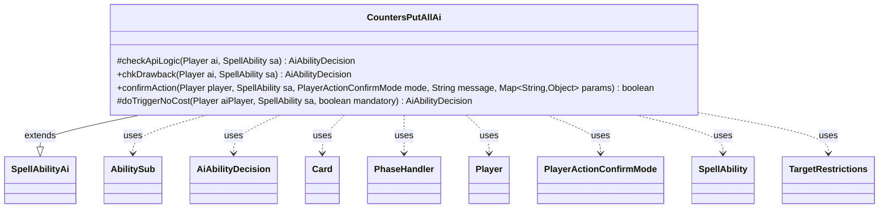

---
aliases:
  - CountersPutAllAi
tags:
  - java/class
  - module/forge-ai
  - pkg/forge/ai/ability
fqn: forge.ai.ability.CountersPutAllAi
package: forge.ai.ability
module: forge-ai
kind: Class
---

# CountersPutAllAi

**Package:** `forge.ai.ability`   **Module:** `forge-ai`   **Kind:** Class



## Relationships
**Extends:**
- [[forge.ai.SpellAbilityAi|SpellAbilityAi]]
**Uses:**
- [[forge.ai.AiAbilityDecision|AiAbilityDecision]]
- [[forge.game.card.Card|Card]]
- [[forge.game.phase.PhaseHandler|PhaseHandler]]
- [[forge.game.player.Player|Player]]
- [[forge.game.player.PlayerActionConfirmMode|PlayerActionConfirmMode]]
- [[forge.game.spellability.AbilitySub|AbilitySub]]
- [[forge.game.spellability.SpellAbility|SpellAbility]]
- [[forge.game.spellability.TargetRestrictions|TargetRestrictions]]

## Design Description

CountersPutAllAi is the AI controller for the "CountersPutAll" spell ability, deciding when and how the computer player should mass-distribute counters across all qualifying permanents on the battlefield. Extending SpellAbilityAi, it overrides the framework hooks—checkApiLogic for primary evaluation, chkDrawback and doTriggerNoCost for sub-ability and triggered contexts, and confirmAction for in-resolution prompts—so the engine can invoke it polymorphically by API type. Its core responsibility is a cost/benefit comparison: using CardLists and TargetRestrictions it partitions affected permanents into the AI's own (cList) versus the weakest opponent's (hList), then refuses to play when a beneficial effect would help opponents more than itself, or a curse (e.g. -1/-1) would harm its own board. Notable design intent includes special-case AILogic branches (OwnCreatsAndOtherPWs, AtEOTOrBlock), PhaseHandler-aware timing for tap-cost +1/+1 abilities, and X-value maximization—with explicit TODOs flagging the heuristics as still rudimentary.

## Source
`forge-ai/src/main/java/forge/ai/ability/CountersPutAllAi.java`

```java
package forge.ai.ability;

import com.google.common.collect.Lists;
import forge.ai.AiAbilityDecision;
import forge.ai.AiPlayDecision;
import forge.ai.ComputerUtilCost;
import forge.ai.SpellAbilityAi;
import forge.game.ability.AbilityUtils;
import forge.game.card.Card;
import forge.game.card.CardLists;
import forge.game.phase.PhaseHandler;
import forge.game.phase.PhaseType;
import forge.game.player.Player;
import forge.game.player.PlayerActionConfirmMode;
import forge.game.spellability.AbilitySub;
import forge.game.spellability.SpellAbility;
import forge.game.spellability.TargetRestrictions;
import forge.game.zone.ZoneType;

import java.util.List;
import java.util.Map;

public class CountersPutAllAi extends SpellAbilityAi {
    @Override
    protected AiAbilityDecision checkApiLogic(Player ai, SpellAbility sa) {
        // AI needs to be expanded, since this function can be pretty complex
        // based on what the expected targets could be
        final Card source = sa.getHostCard();
        List<Card> hList;
        List<Card> cList;
        final String type = sa.getParam("CounterType");
        final String amountStr = sa.getParamOrDefault("CounterNum", "1");
        final String valid = sa.getParam("ValidCards");
        final String logic = sa.getParamOrDefault("AILogic", "");
        final boolean curse = sa.isCurse();
        final TargetRestrictions tgt = sa.getTargetRestrictions();

        if ("OwnCreatsAndOtherPWs".equals(logic)) {
            hList = CardLists.getValidCards(ai.getWeakestOpponent().getCardsIn(ZoneType.Battlefield), "Creature.YouCtrl,Planeswalker.YouCtrl+Other", source.getController(), source, sa);
            cList = CardLists.getValidCards(ai.getCardsIn(ZoneType.Battlefield), "Creature.YouCtrl,Planeswalker.YouCtrl+Other", source.getController(), source, sa);
        } else {
            hList = CardLists.getValidCards(ai.getWeakestOpponent().getCardsIn(ZoneType.Battlefield), valid, source.getController(), source, sa);
            cList = CardLists.getValidCards(ai.getCardsIn(ZoneType.Battlefield), valid, source.getController(), source, sa);
        }

        if (logic.equals("AtEOTOrBlock")) {
            if (!ai.getGame().getPhaseHandler().is(PhaseType.END_OF_TURN) && !ai.getGame().getPhaseHandler().is(PhaseType.COMBAT_DECLARE_BLOCKERS)) {
                return new AiAbilityDecision(0, AiPlayDecision.AnotherTime);
            }
        }

        if (tgt != null) {
            Player pl = curse ? ai.getWeakestOpponent() : ai;
            sa.getTargets().add(pl);

            hList = CardLists.filterControlledBy(hList, pl);
            cList = CardLists.filterControlledBy(cList, pl);
        }

        // TODO improve X value to don't overpay when extra mana won't do
        // anything more useful
        final int amount;
        if (amountStr.equals("X") && sa.getSVar(amountStr).equals("Count$xPaid")) {
            amount = ComputerUtilCost.setMaxXValue(sa, ai, sa.isTrigger());
        } else {
            amount = AbilityUtils.calculateAmount(source, amountStr, sa);
        }

        if (curse) {
            if (type.equals("M1M1")) {
                final List<Card> killable = CardLists.filter(hList, c -> c.getNetToughness() <= amount);
                if (killable.size() <= 2) {
                    return new AiAbilityDecision(0, AiPlayDecision.CantPlayAi);
                }
            } else {
                // make sure compy doesn't harm his stuff more than human's
                // stuff
                if (cList.size() > hList.size()) {
                    return new AiAbilityDecision(0, AiPlayDecision.CantPlayAi);
                }
            }
        } else {
            // human has more things that will benefit, don't play
            if (hList.size() >= cList.size()) {
                return new AiAbilityDecision(0, AiPlayDecision.CantPlayAi);
            }

            //Check for cards that could profit from the ability
            PhaseHandler phase = ai.getGame().getPhaseHandler();
            if (type.equals("P1P1") && sa.isAbility() && source.isCreature()
                    && sa.getPayCosts().hasTapCost()
                    && sa instanceof AbilitySub
                    && (!phase.getNextTurn().equals(ai)
                    || phase.getPhase().isBefore(PhaseType.COMBAT_DECLARE_BLOCKERS))) {
                boolean combatants = false;
                for (Card c : hList) {
                    if (!c.equals(source) && c.isUntapped()) {
                        combatants = true;
                        break;
                    }
                }
                if (!combatants) {
                    return new AiAbilityDecision(0, AiPlayDecision.CantPlayAi);
                }
            }
        }

        if (playReusable(ai, sa)) {
            return new AiAbilityDecision(100, AiPlayDecision.WillPlay);
        }

        return super.checkApiLogic(ai, sa);
    }

    @Override
    public AiAbilityDecision chkDrawback(Player ai, SpellAbility sa) {
        return canPlay(ai, sa);
    }
    /* (non-Javadoc)
     * @see forge.card.ability.SpellAbilityAi#confirmAction(forge.game.player.Player, forge.card.spellability.SpellAbility, forge.game.player.PlayerActionConfirmMode, java.lang.String)
     */
    @Override
    public boolean confirmAction(Player player, SpellAbility sa, PlayerActionConfirmMode mode, String message, Map<String, Object> params) {
        return player.getCreaturesInPlay().size() >= player.getWeakestOpponent().getCreaturesInPlay().size();
    }

    @Override
    protected AiAbilityDecision doTriggerNoCost(final Player aiPlayer, final SpellAbility sa, final boolean mandatory) {
        if (sa.usesTargeting()) {
            List<Player> players = Lists.newArrayList();
            if (!sa.isCurse()) {
                players.add(aiPlayer);
            }
            players.addAll(aiPlayer.getOpponents());
            players.addAll(aiPlayer.getAllies());
            if (sa.isCurse()) {
                players.add(aiPlayer);
            }

            for (final Player p : players) {
                if (sa.canTarget(p)) {
                    boolean preferred = (sa.isCurse() && p.isOpponentOf(aiPlayer)) || (!sa.isCurse() && p == aiPlayer);
                    sa.resetTargets();
                    sa.getTargets().add(p);
                    if (preferred) {
                        return new AiAbilityDecision(100, AiPlayDecision.WillPlay);
                    }

                    if (mandatory) {
                        return new AiAbilityDecision(100, AiPlayDecision.WillPlay);
                    }
                    return new AiAbilityDecision(0, AiPlayDecision.CantPlayAi);
                }
            }
        }

        if (mandatory) {
            return new AiAbilityDecision(100, AiPlayDecision.WillPlay);
        }

        return canPlay(aiPlayer, sa);
    }
}
```

## Python
`forge/ai/ability/CountersPutAllAi.py`

```python
from forge.ai.AiAbilityDecision import AiAbilityDecision
from forge.ai.AiPlayDecision import AiPlayDecision
from forge.ai.ComputerUtilCost import ComputerUtilCost
from forge.ai.SpellAbilityAi import SpellAbilityAi
from forge.game.ability.AbilityUtils import AbilityUtils
from forge.game.card.Card import Card
from forge.game.card.CardLists import CardLists
from forge.game.phase.PhaseHandler import PhaseHandler
from forge.game.phase.PhaseType import PhaseType
from forge.game.player.Player import Player
from forge.game.player.PlayerActionConfirmMode import PlayerActionConfirmMode
from forge.game.spellability.AbilitySub import AbilitySub
from forge.game.spellability.SpellAbility import SpellAbility
from forge.game.spellability.TargetRestrictions import TargetRestrictions
from forge.game.zone.ZoneType import ZoneType

from typing import List, Map


class CountersPutAllAi(SpellAbilityAi):
    def checkApiLogic(self, ai: Player, sa: SpellAbility) -> AiAbilityDecision:
        # AI needs to be expanded, since this function can be pretty complex
        # based on what the expected targets could be
        source = sa.getHostCard()
        hList: list[Card]
        cList: list[Card]
        type = sa.getParam("CounterType")
        amountStr = sa.getParamOrDefault("CounterNum", "1")
        valid = sa.getParam("ValidCards")
        logic = sa.getParamOrDefault("AILogic", "")
        curse = sa.isCurse()
        tgt = sa.getTargetRestrictions()

        if "OwnCreatsAndOtherPWs" == logic:
            hList = CardLists.getValidCards(ai.getWeakestOpponent().getCardsIn(ZoneType.Battlefield), "Creature.YouCtrl,Planeswalker.YouCtrl+Other", source.getController(), source, sa)
            cList = CardLists.getValidCards(ai.getCardsIn(ZoneType.Battlefield), "Creature.YouCtrl,Planeswalker.YouCtrl+Other", source.getController(), source, sa)
        else:
            hList = CardLists.getValidCards(ai.getWeakestOpponent().getCardsIn(ZoneType.Battlefield), valid, source.getController(), source, sa)
            cList = CardLists.getValidCards(ai.getCardsIn(ZoneType.Battlefield), valid, source.getController(), source, sa)

        if logic == "AtEOTOrBlock":
            if not ai.getGame().getPhaseHandler().is_(PhaseType.END_OF_TURN) and not ai.getGame().getPhaseHandler().is_(PhaseType.COMBAT_DECLARE_BLOCKERS):
                return AiAbilityDecision(0, AiPlayDecision.AnotherTime)

        if tgt is not None:
            pl = ai.getWeakestOpponent() if curse else ai
            sa.getTargets().add(pl)

            hList = CardLists.filterControlledBy(hList, pl)
            cList = CardLists.filterControlledBy(cList, pl)

        # TODO improve X value to don't overpay when extra mana won't do
        # anything more useful
        amount: int
        if amountStr == "X" and sa.getSVar(amountStr) == "Count$xPaid":
            amount = ComputerUtilCost.setMaxXValue(sa, ai, sa.isTrigger())
        else:
            amount = AbilityUtils.calculateAmount(source, amountStr, sa)

        if curse:
            if type == "M1M1":
                killable = CardLists.filter(hList, lambda c: c.getNetToughness() <= amount)
                if len(killable) <= 2:
                    return AiAbilityDecision(0, AiPlayDecision.CantPlayAi)
            else:
                # make sure compy doesn't harm his stuff more than human's
                # stuff
                if len(cList) > len(hList):
                    return AiAbilityDecision(0, AiPlayDecision.CantPlayAi)
        else:
            # human has more things that will benefit, don't play
            if len(hList) >= len(cList):
                return AiAbilityDecision(0, AiPlayDecision.CantPlayAi)

            # Check for cards that could profit from the ability
            phase = ai.getGame().getPhaseHandler()
            if type == "P1P1" and sa.isAbility() and source.isCreature() \
                    and sa.getPayCosts().hasTapCost() \
                    and isinstance(sa, AbilitySub) \
                    and (not phase.getNextTurn() == ai
                         or phase.getPhase().isBefore(PhaseType.COMBAT_DECLARE_BLOCKERS)):
                combatants = False
                for c in hList:
                    if not c == source and c.isUntapped():
                        combatants = True
                        break
                if not combatants:
                    return AiAbilityDecision(0, AiPlayDecision.CantPlayAi)

        if self.playReusable(ai, sa):
            return AiAbilityDecision(100, AiPlayDecision.WillPlay)

        return super().checkApiLogic(ai, sa)

    def chkDrawback(self, ai: Player, sa: SpellAbility) -> AiAbilityDecision:
        return self.canPlay(ai, sa)

    # (non-Javadoc)
    # @see forge.card.ability.SpellAbilityAi#confirmAction(forge.game.player.Player, forge.card.spellability.SpellAbility, forge.game.player.PlayerActionConfirmMode, java.lang.String)
    def confirmAction(self, player: Player, sa: SpellAbility, mode: PlayerActionConfirmMode, message: str, params: dict[str, object]) -> bool:
        return len(player.getCreaturesInPlay()) >= len(player.getWeakestOpponent().getCreaturesInPlay())

    def doTriggerNoCost(self, aiPlayer: Player, sa: SpellAbility, mandatory: bool) -> AiAbilityDecision:
        if sa.usesTargeting():
            players: list[Player] = []
            if not sa.isCurse():
                players.append(aiPlayer)
            players.extend(aiPlayer.getOpponents())
            players.extend(aiPlayer.getAllies())
            if sa.isCurse():
                players.append(aiPlayer)

            for p in players:
                if sa.canTarget(p):
                    preferred = (sa.isCurse() and p.isOpponentOf(aiPlayer)) or (not sa.isCurse() and p == aiPlayer)
                    sa.resetTargets()
                    sa.getTargets().add(p)
                    if preferred:
                        return AiAbilityDecision(100, AiPlayDecision.WillPlay)

                    if mandatory:
                        return AiAbilityDecision(100, AiPlayDecision.WillPlay)
                    return AiAbilityDecision(0, AiPlayDecision.CantPlayAi)

        if mandatory:
            return AiAbilityDecision(100, AiPlayDecision.WillPlay)

        return self.canPlay(aiPlayer, sa)
```
