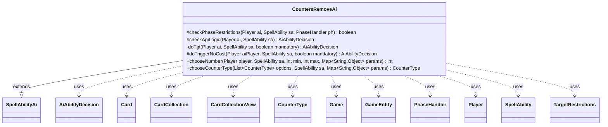

---
aliases:
  - CountersRemoveAi
tags:
  - java/class
  - module/forge-ai
  - pkg/forge/ai/ability
fqn: forge.ai.ability.CountersRemoveAi
package: forge.ai.ability
module: forge-ai
kind: Class
---

# CountersRemoveAi

**Package:** `forge.ai.ability`   **Module:** `forge-ai`   **Kind:** Class



## Relationships
**Extends:**
- [[forge.ai.SpellAbilityAi|SpellAbilityAi]]
**Uses:**
- [[forge.ai.AiAbilityDecision|AiAbilityDecision]]
- [[forge.game.Game|Game]]
- [[forge.game.GameEntity|GameEntity]]
- [[forge.game.card.Card|Card]]
- [[forge.game.card.CardCollection|CardCollection]]
- [[forge.game.card.CardCollectionView|CardCollectionView]]
- [[forge.game.card.CounterType|CounterType]]
- [[forge.game.phase.PhaseHandler|PhaseHandler]]
- [[forge.game.player.Player|Player]]
- [[forge.game.spellability.SpellAbility|SpellAbility]]
- [[forge.game.spellability.TargetRestrictions|TargetRestrictions]]

## Design Description

CountersRemoveAi is the AI decision-maker for spell abilities that remove counters, implementing Forge's heuristics for when and how the computer player should use such effects. As a concrete subclass of SpellAbilityAi, it overrides the framework's hooks—`checkPhaseRestrictions` to defer most removals until the second main phase, `checkApiLogic` to validate counter availability, and `doTriggerNoCost` for triggered uses—while centralizing target selection in the private `doTgt` helper.

Its core responsibility is choosing the best target and counter type by reasoning over game state: it collaborates with Card, CardCollection, Player, Game, and TargetRestrictions to scan eligible permanents, and branches on counter type ("All", "Any", "M1M1", "P1P1", "TIME") to encode card-specific tactics—comboing off Dark Depths' ice counters, depleting opposing planeswalker loyalty, and exploiting Persist/Undying creatures. The `chooseNumber` and `chooseCounterType` overrides extend this intent, favoring removal that helps the AI (clearing negative counters from its own cards, stripping beneficial ones from opponents) and returning AiAbilityDecision objects that signal confidence to the engine.

## Source
`forge-ai/src/main/java/forge/ai/ability/CountersRemoveAi.java`

```java
package forge.ai.ability;

import com.google.common.collect.Iterables;
import forge.ai.AiAbilityDecision;
import forge.ai.AiPlayDecision;
import forge.ai.ComputerUtil;
import forge.ai.ComputerUtilCard;
import forge.ai.ComputerUtilCost;
import forge.ai.SpellAbilityAi;
import forge.game.Game;
import forge.game.GameEntity;
import forge.game.ability.AbilityUtils;
import forge.game.card.*;
import forge.game.keyword.Keyword;
import forge.game.phase.PhaseHandler;
import forge.game.phase.PhaseType;
import forge.game.player.Player;
import forge.game.spellability.SpellAbility;
import forge.game.spellability.TargetRestrictions;
import forge.game.zone.ZoneType;

import java.util.List;
import java.util.Map;
import java.util.function.Predicate;

public class CountersRemoveAi extends SpellAbilityAi {

    /*
     * (non-Javadoc)
     *
     * @see
     * forge.ai.SpellAbilityAi#checkPhaseRestrictions(forge.game.player.Player,
     * forge.game.spellability.SpellAbility, forge.game.phase.PhaseHandler)
     */
    @Override
    protected boolean checkPhaseRestrictions(Player ai, SpellAbility sa, PhaseHandler ph) {
        final String type = sa.getParam("CounterType");

        if (ph.getPhase().isBefore(PhaseType.MAIN2) && !sa.hasParam("ActivationPhases") && !type.equals("M1M1")) {
            return false;
        }
        return super.checkPhaseRestrictions(ai, sa, ph);
    }

    /*
     * (non-Javadoc)
     *
     * @see forge.ai.SpellAbilityAi#checkApiLogic(forge.game.player.Player,
     * forge.game.spellability.SpellAbility)
     */
    @Override
    protected AiAbilityDecision checkApiLogic(Player ai, SpellAbility sa) {
        final String type = sa.getParam("CounterType");

        if (sa.usesTargeting()) {
            return doTgt(ai, sa, false);
        }

        if (!type.matches("Any") && !type.matches("All")) {
            final int currCounters = sa.getHostCard().getCounters(CounterType.getType(type));
            if (currCounters < 1) {
                return new AiAbilityDecision(0, AiPlayDecision.CantPlayAi);
            }
        }

        return super.checkApiLogic(ai, sa);
    }

    private AiAbilityDecision doTgt(Player ai, SpellAbility sa, boolean mandatory) {
        final Card source = sa.getHostCard();
        final Game game = ai.getGame();

        final String type = sa.getParam("CounterType");
        final String amountStr = sa.getParamOrDefault("CounterNum", "1");

        // remove counter with Time might use Exile Zone too
        final TargetRestrictions tgt = sa.getTargetRestrictions();
        // need to targetable
        CardCollection list = CardLists.getTargetableCards(game.getCardsIn(tgt.getZone()), sa);

        if (list.isEmpty()) {
            return new AiAbilityDecision(0, AiPlayDecision.TargetingFailed);
        }

        // Filter AI-specific targets if provided
        list = ComputerUtil.filterAITgts(sa, ai, list, false);

        CardCollectionView marit = ai.getCardsIn(ZoneType.Battlefield, "Marit Lage");
        boolean maritEmpty = marit.isEmpty() || Iterables.contains(marit, (Predicate<Card>) Card::ignoreLegendRule);

        CounterType iceType = CounterType.getType("ICE");

        if (type.matches("All")) {
            // Logic Part for Vampire Hexmage
            // Break Dark Depths
            if (maritEmpty) {
                CardCollectionView depthsList = ai.getCardsIn(ZoneType.Battlefield, "Dark Depths");
                depthsList = CardLists.filter(depthsList, CardPredicates.isTargetableBy(sa),
                        CardPredicates.hasCounter(iceType, 3));
                if (!depthsList.isEmpty()) {
                    sa.getTargets().add(depthsList.getFirst());
                    return new AiAbilityDecision(100, AiPlayDecision.WillPlay);
                }
            }

            // Get rid of Planeswalkers:
            list = ai.getOpponents().getCardsIn(ZoneType.Battlefield);
            list = CardLists.filter(list, CardPredicates.isTargetableBy(sa));

            CardCollection planeswalkerList = CardLists.filter(list, CardPredicates.PLANESWALKERS,
                    CardPredicates.hasCounter(CounterEnumType.LOYALTY, 5));

            if (!planeswalkerList.isEmpty()) {
                sa.getTargets().add(ComputerUtilCard.getBestPlaneswalkerAI(planeswalkerList));
                return new AiAbilityDecision(100, AiPlayDecision.WillPlay);
            }
        } else if (type.matches("Any")) {
            // variable amount for Hex Parasite
            int amount;
            boolean xPay = false;
            if (amountStr.equals("X") && sa.getSVar("X").equals("Count$xPaid")) {
                final int manaLeft = ComputerUtilCost.setMaxXValue(sa, ai, sa.isTrigger());

                if (manaLeft == 0) {
                    return new AiAbilityDecision(0, AiPlayDecision.CantAffordX);
                }
                amount = manaLeft;
                xPay = true;
            } else {
                amount = AbilityUtils.calculateAmount(source, amountStr, sa);
            }
            // try to remove them from Dark Depths and Planeswalkers too

            if (maritEmpty) {
                CardCollectionView depthsList = CardLists.filter(
                    ai.getCardsIn(ZoneType.Battlefield, "Dark Depths"),
                    CardPredicates.isTargetableBy(sa), CardPredicates.hasCounter(iceType));

                if (!depthsList.isEmpty()) {
                    Card depth = depthsList.getFirst();
                    int ice = depth.getCounters(iceType);
                    if (amount >= ice) {
                        sa.getTargets().add(depth);
                        if (xPay) {
                            sa.setXManaCostPaid(ice);
                        }
                        return new AiAbilityDecision(100, AiPlayDecision.WillPlay);
                    }
                }
            }

            // Get rid of Planeswalkers:
            list = game.getPlayers().getCardsIn(ZoneType.Battlefield);
            list = CardLists.filter(list, CardPredicates.isTargetableBy(sa));

            CardCollection planeswalkerList = CardLists.filter(list,
                    CardPredicates.PLANESWALKERS.and(CardPredicates.isControlledByAnyOf(ai.getOpponents())),
                    CardPredicates.hasLessCounter(CounterEnumType.LOYALTY, amount));

            if (!planeswalkerList.isEmpty()) {
                Card best = ComputerUtilCard.getBestPlaneswalkerAI(planeswalkerList);
                sa.getTargets().add(best);
                if (xPay) {
                    sa.setXManaCostPaid(best.getCurrentLoyalty());
                }
                return new AiAbilityDecision(100, AiPlayDecision.WillPlay);
            }

            // some rules only for amount = 1
            if (!xPay) {
                // do as M1M1 part
                CardCollection aiList = CardLists.filterControlledBy(list, ai);

                CardCollection aiM1M1List = CardLists.filter(aiList, CardPredicates.hasCounter(CounterEnumType.M1M1));

                CardCollection aiPersistList = CardLists.getKeyword(aiM1M1List, Keyword.PERSIST);
                if (!aiPersistList.isEmpty()) {
                    aiM1M1List = aiPersistList;
                }

                if (!aiM1M1List.isEmpty()) {
                    sa.getTargets().add(ComputerUtilCard.getBestCreatureAI(aiM1M1List));
                    return new AiAbilityDecision(100, AiPlayDecision.WillPlay);
                }

                // do as P1P1 part
                CardCollection aiP1P1List = CardLists.filter(aiList, CardPredicates.hasLessCounter(CounterEnumType.P1P1, amount));
                CardCollection aiUndyingList = CardLists.getKeyword(aiP1P1List, Keyword.UNDYING);

                if (!aiUndyingList.isEmpty()) {
                    sa.getTargets().add(ComputerUtilCard.getBestCreatureAI(aiUndyingList));
                    return new AiAbilityDecision(100, AiPlayDecision.WillPlay);
                }
  
                // TODO stun counters with canRemoveCounters check

                // remove P1P1 counters from opposing creatures
                CardCollection oppP1P1List = CardLists.filter(list,
                        CardPredicates.CREATURES.and(CardPredicates.isControlledByAnyOf(ai.getOpponents())),
                        CardPredicates.hasCounter(CounterEnumType.P1P1));
                if (!oppP1P1List.isEmpty()) {
                    sa.getTargets().add(ComputerUtilCard.getBestCreatureAI(oppP1P1List));
                    return new AiAbilityDecision(100, AiPlayDecision.WillPlay);
                }

                // fallback to remove any counter from opponent
                CardCollection oppList = CardLists.filterControlledBy(list, ai.getOpponents());
                oppList = CardLists.filter(oppList, CardPredicates.hasCounters());
                if (!oppList.isEmpty()) {
                    final Card best = ComputerUtilCard.getBestAI(oppList);

                    for (final CounterType aType : best.getCounters().keySet()) {
                        if (!ComputerUtil.isNegativeCounter(aType, best)) {
                            sa.getTargets().add(best);
                            return new AiAbilityDecision(100, AiPlayDecision.WillPlay);
                        }
                    }
                }
            }
        } else if (type.equals("M1M1")) {
            // no special amount for that one yet
            int amount = AbilityUtils.calculateAmount(source, amountStr, sa);
            CardCollection aiList = CardLists.filterControlledBy(list, ai);
            aiList = CardLists.filter(aiList, CardPredicates.hasCounter(CounterEnumType.M1M1, amount));

            CardCollection aiPersist = CardLists.getKeyword(aiList, Keyword.PERSIST);
            if (!aiPersist.isEmpty()) {
                aiList = aiPersist;
            }

            // TODO do not remove -1/-1 counters from cards which does need
            // them for abilities

            if (!aiList.isEmpty()) {
                sa.getTargets().add(ComputerUtilCard.getBestCreatureAI(aiList));
                return new AiAbilityDecision(100, AiPlayDecision.WillPlay);
            }
        } else if (type.equals("P1P1")) {
            // no special amount for that one yet
            int amount = AbilityUtils.calculateAmount(source, amountStr, sa);

            list = CardLists.filter(list, CardPredicates.hasCounter(CounterEnumType.P1P1, amount));

            // currently only logic for Bloodcrazed Hoplite, but add logic for
            // targeting ai creatures too
            CardCollection aiList = CardLists.filterControlledBy(list, ai);
            if (!aiList.isEmpty()) {
                CardCollection aiListUndying = CardLists.getKeyword(aiList, Keyword.UNDYING);
                if (!aiListUndying.isEmpty()) {
                    aiList = aiListUndying;
                }
                if (!aiList.isEmpty()) {
                    sa.getTargets().add(ComputerUtilCard.getBestCreatureAI(aiList));
                    return new AiAbilityDecision(100, AiPlayDecision.WillPlay);
                }
            }

            // need to target opponent creatures
            CardCollection oppList = CardLists.filterControlledBy(list, ai.getOpponents());
            if (!oppList.isEmpty()) {
                CardCollection oppListNotUndying = CardLists.getNotKeyword(oppList, Keyword.UNDYING);
                if (!oppListNotUndying.isEmpty()) {
                    oppList = oppListNotUndying;
                }

                if (!oppList.isEmpty()) {
                    sa.getTargets().add(ComputerUtilCard.getWorstCreatureAI(oppList));
                    return new AiAbilityDecision(100, AiPlayDecision.WillPlay);
                }
            }
        } else if (type.equals("TIME")) {
            int amount;
            boolean xPay = false;
            // Timecrafting has X R
            if (amountStr.equals("X") && sa.getSVar("X").equals("Count$xPaid")) {
                final int manaLeft = ComputerUtilCost.setMaxXValue(sa, ai, sa.isTrigger());

                if (manaLeft == 0) {
                    return new AiAbilityDecision(0, AiPlayDecision.CantAffordX);
                }
                amount = manaLeft;
                xPay = true;
            } else {
                amount = AbilityUtils.calculateAmount(source, amountStr, sa);
            }

            CardCollection timeList = CardLists.filter(list, CardPredicates.hasLessCounter(CounterEnumType.TIME, amount));

            if (!timeList.isEmpty()) {
                Card best = ComputerUtilCard.getBestAI(timeList);

                int timeCount = best.getCounters(CounterEnumType.TIME);
                sa.getTargets().add(best);
                if (xPay) {
                    sa.setXManaCostPaid(timeCount);
                }
                return new AiAbilityDecision(100, AiPlayDecision.WillPlay);
            }
        }
        if (mandatory) {
            if (type.equals("P1P1")) {
                // Try to target creatures with Adapt or similar
                CardCollection adaptCreats = CardLists.filter(list, c -> c.getNonManaAbilities().anyMatch(ab -> ab.hasParam("Adapt")));
                if (!adaptCreats.isEmpty()) {
                    sa.getTargets().add(ComputerUtilCard.getWorstAI(adaptCreats));
                    return new AiAbilityDecision(100, AiPlayDecision.WillPlay);
                }

                // Outlast nice target
                CardCollection outlastCreats = CardLists.filter(list, CardPredicates.hasKeyword(Keyword.OUTLAST));
                if (!outlastCreats.isEmpty()) {
                    // outlast cards often benefit from having +1/+1 counters, try not to remove last one
                    CardCollection betterTargets = CardLists.filter(outlastCreats, CardPredicates.hasCounter(CounterEnumType.P1P1, 2));

                    if (!betterTargets.isEmpty()) {
                        sa.getTargets().add(ComputerUtilCard.getWorstAI(betterTargets));
                        return new AiAbilityDecision(100, AiPlayDecision.WillPlay);
                    }

                    sa.getTargets().add(ComputerUtilCard.getWorstAI(outlastCreats));
                    return new AiAbilityDecision(100, AiPlayDecision.WillPlay);
                }
            }

            sa.getTargets().add(ComputerUtilCard.getWorstAI(list));
            return new AiAbilityDecision(100, AiPlayDecision.WillPlay);
        }
        return new AiAbilityDecision(0, AiPlayDecision.TargetingFailed);
    }

    @Override
    protected AiAbilityDecision doTriggerNoCost(Player aiPlayer, SpellAbility sa, boolean mandatory) {
        if (sa.usesTargeting()) {
            return doTgt(aiPlayer, sa, mandatory);
        }
        return mandatory ? new AiAbilityDecision(100, AiPlayDecision.MandatoryPlay)
                         : new AiAbilityDecision(0, AiPlayDecision.CantPlaySa);
    }

    /*
     * (non-Javadoc)
     *
     * @see forge.ai.SpellAbilityAi#chooseNumber(forge.game.player.Player,
     * forge.game.spellability.SpellAbility, int, int, java.util.Map)
     */
    @Override
    public int chooseNumber(Player player, SpellAbility sa, int min, int max, Map<String, Object> params) {
        GameEntity target = (GameEntity) params.get("Target");
        CounterType type = (CounterType) params.get("CounterType");

        if (target instanceof Card targetCard) {
            if (targetCard.getController().isOpponentOf(player)) {
                return !ComputerUtil.isNegativeCounter(type, targetCard) ? max : min;
            } else {
                if (targetCard.hasKeyword(Keyword.UNDYING) && type.is(CounterEnumType.P1P1)
                        && targetCard.getCounters(CounterEnumType.P1P1) >= max) {
                    return max;
                }

                return ComputerUtil.isNegativeCounter(type, targetCard) ? max : min;
            }
        } else if (target instanceof Player targetPlayer) {
            if (targetPlayer.isOpponentOf(player)) {
                return !type.is(CounterEnumType.POISON) ? max : min;
            } else {
                return type.is(CounterEnumType.POISON) ? max : min;
            }
        }

        return super.chooseNumber(player, sa, min, max, params);
    }

    /*
     * (non-Javadoc)
     *
     * @see forge.ai.SpellAbilityAi#chooseCounterType(java.util.List,
     * forge.game.spellability.SpellAbility, java.util.Map)
     */
    @Override
    public CounterType chooseCounterType(List<CounterType> options, SpellAbility sa, Map<String, Object> params) {
        Player ai = sa.getActivatingPlayer();
        GameEntity target = (GameEntity) params.get("Target");

        if (target instanceof Card) {
            Card targetCard = (Card) target;
            if (targetCard.getController().isOpponentOf(ai)) {
                // if its a Planeswalker try to remove Loyality first
                if (targetCard.isPlaneswalker()) {
                    return CounterEnumType.LOYALTY;
                }
                for (CounterType type : options) {
                    if (!ComputerUtil.isNegativeCounter(type, targetCard)) {
                        return type;
                    }
                }
            } else {
                if (options.contains(CounterEnumType.M1M1) && targetCard.hasKeyword(Keyword.PERSIST)) {
                    return CounterEnumType.M1M1;
                } else if (options.contains(CounterEnumType.P1P1) && targetCard.hasKeyword(Keyword.UNDYING)) {
                    return CounterEnumType.P1P1;
                }
                for (CounterType type : options) {
                    if (ComputerUtil.isNegativeCounter(type, targetCard)) {
                        return type;
                    }
                }
            }
        } else if (target instanceof Player) {
            Player targetPlayer = (Player) target;
            if (targetPlayer.isOpponentOf(ai)) {
                for (CounterType type : options) {
                    if (!type.is(CounterEnumType.POISON)) {
                        return type;
                    }
                }
            } else {
                for (CounterType type : options) {
                    if (type.is(CounterEnumType.POISON)) {
                        return type;
                    }
                }
            }
        }

        return super.chooseCounterType(options, sa, params);
    }
}
```

## Python
`forge/ai/ability/CountersRemoveAi.py`

```python
from forge.ai.AiAbilityDecision import AiAbilityDecision
from forge.ai.AiPlayDecision import AiPlayDecision
from forge.ai.ComputerUtil import ComputerUtil
from forge.ai.ComputerUtilCard import ComputerUtilCard
from forge.ai.ComputerUtilCost import ComputerUtilCost
from forge.ai.SpellAbilityAi import SpellAbilityAi
from forge.game.Game import Game
from forge.game.GameEntity import GameEntity
from forge.game.ability.AbilityUtils import AbilityUtils
from forge.game.card.Card import Card
from forge.game.card.CardCollection import CardCollection
from forge.game.card.CardCollectionView import CardCollectionView
from forge.game.card.CardLists import CardLists
from forge.game.card.CardPredicates import CardPredicates
from forge.game.card.CounterType import CounterType
from forge.game.card.CounterEnumType import CounterEnumType
from forge.game.keyword.Keyword import Keyword
from forge.game.phase.PhaseHandler import PhaseHandler
from forge.game.phase.PhaseType import PhaseType
from forge.game.player.Player import Player
from forge.game.spellability.SpellAbility import SpellAbility
from forge.game.spellability.TargetRestrictions import TargetRestrictions
from forge.game.zone.ZoneType import ZoneType

from typing import List, Map


class CountersRemoveAi(SpellAbilityAi):

    def checkPhaseRestrictions(self, ai: Player, sa: SpellAbility, ph: PhaseHandler) -> bool:
        type = sa.getParam("CounterType")

        if ph.getPhase().isBefore(PhaseType.MAIN2) and not sa.hasParam("ActivationPhases") and type != "M1M1":
            return False
        return super().checkPhaseRestrictions(ai, sa, ph)

    def checkApiLogic(self, ai: Player, sa: SpellAbility) -> AiAbilityDecision:
        type = sa.getParam("CounterType")

        if sa.usesTargeting():
            return self.doTgt(ai, sa, False)

        if not type == "Any" and not type == "All":
            currCounters = sa.getHostCard().getCounters(CounterType.getType(type))
            if currCounters < 1:
                return AiAbilityDecision(0, AiPlayDecision.CantPlayAi)

        return super().checkApiLogic(ai, sa)

    def doTgt(self, ai: Player, sa: SpellAbility, mandatory: bool) -> AiAbilityDecision:
        source = sa.getHostCard()
        game = ai.getGame()

        type = sa.getParam("CounterType")
        amountStr = sa.getParamOrDefault("CounterNum", "1")

        # remove counter with Time might use Exile Zone too
        tgt = sa.getTargetRestrictions()
        # need to targetable
        list = CardLists.getTargetableCards(game.getCardsIn(tgt.getZone()), sa)

        if list.isEmpty():
            return AiAbilityDecision(0, AiPlayDecision.TargetingFailed)

        # Filter AI-specific targets if provided
        list = ComputerUtil.filterAITgts(sa, ai, list, False)

        marit = ai.getCardsIn(ZoneType.Battlefield, "Marit Lage")
        maritEmpty = marit.isEmpty() or any(c.ignoreLegendRule() for c in marit)

        iceType = CounterType.getType("ICE")

        if type == "All":
            # Logic Part for Vampire Hexmage
            # Break Dark Depths
            if maritEmpty:
                depthsList = ai.getCardsIn(ZoneType.Battlefield, "Dark Depths")
                depthsList = CardLists.filter(depthsList, CardPredicates.isTargetableBy(sa),
                        CardPredicates.hasCounter(iceType, 3))
                if not depthsList.isEmpty():
                    sa.getTargets().add(depthsList.getFirst())
                    return AiAbilityDecision(100, AiPlayDecision.WillPlay)

            # Get rid of Planeswalkers:
            list = ai.getOpponents().getCardsIn(ZoneType.Battlefield)
            list = CardLists.filter(list, CardPredicates.isTargetableBy(sa))

            planeswalkerList = CardLists.filter(list, CardPredicates.PLANESWALKERS,
                    CardPredicates.hasCounter(CounterEnumType.LOYALTY, 5))

            if not planeswalkerList.isEmpty():
                sa.getTargets().add(ComputerUtilCard.getBestPlaneswalkerAI(planeswalkerList))
                return AiAbilityDecision(100, AiPlayDecision.WillPlay)
        elif type == "Any":
            # variable amount for Hex Parasite
            xPay = False
            if amountStr == "X" and sa.getSVar("X") == "Count$xPaid":
                manaLeft = ComputerUtilCost.setMaxXValue(sa, ai, sa.isTrigger())

                if manaLeft == 0:
                    return AiAbilityDecision(0, AiPlayDecision.CantAffordX)
                amount = manaLeft
                xPay = True
            else:
                amount = AbilityUtils.calculateAmount(source, amountStr, sa)
            # try to remove them from Dark Depths and Planeswalkers too

            if maritEmpty:
                depthsList = CardLists.filter(
                    ai.getCardsIn(ZoneType.Battlefield, "Dark Depths"),
                    CardPredicates.isTargetableBy(sa), CardPredicates.hasCounter(iceType))

                if not depthsList.isEmpty():
                    depth = depthsList.getFirst()
                    ice = depth.getCounters(iceType)
                    if amount >= ice:
                        sa.getTargets().add(depth)
                        if xPay:
                            sa.setXManaCostPaid(ice)
                        return AiAbilityDecision(100, AiPlayDecision.WillPlay)

            # Get rid of Planeswalkers:
            list = game.getPlayers().getCardsIn(ZoneType.Battlefield)
            list = CardLists.filter(list, CardPredicates.isTargetableBy(sa))

            planeswalkerList = CardLists.filter(list,
                    CardPredicates.PLANESWALKERS.and_(CardPredicates.isControlledByAnyOf(ai.getOpponents())),
                    CardPredicates.hasLessCounter(CounterEnumType.LOYALTY, amount))

            if not planeswalkerList.isEmpty():
                best = ComputerUtilCard.getBestPlaneswalkerAI(planeswalkerList)
                sa.getTargets().add(best)
                if xPay:
                    sa.setXManaCostPaid(best.getCurrentLoyalty())
                return AiAbilityDecision(100, AiPlayDecision.WillPlay)

            # some rules only for amount = 1
            if not xPay:
                # do as M1M1 part
                aiList = CardLists.filterControlledBy(list, ai)

                aiM1M1List = CardLists.filter(aiList, CardPredicates.hasCounter(CounterEnumType.M1M1))

                aiPersistList = CardLists.getKeyword(aiM1M1List, Keyword.PERSIST)
                if not aiPersistList.isEmpty():
                    aiM1M1List = aiPersistList

                if not aiM1M1List.isEmpty():
                    sa.getTargets().add(ComputerUtilCard.getBestCreatureAI(aiM1M1List))
                    return AiAbilityDecision(100, AiPlayDecision.WillPlay)

                # do as P1P1 part
                aiP1P1List = CardLists.filter(aiList, CardPredicates.hasLessCounter(CounterEnumType.P1P1, amount))
                aiUndyingList = CardLists.getKeyword(aiP1P1List, Keyword.UNDYING)

                if not aiUndyingList.isEmpty():
                    sa.getTargets().add(ComputerUtilCard.getBestCreatureAI(aiUndyingList))
                    return AiAbilityDecision(100, AiPlayDecision.WillPlay)

                # TODO stun counters with canRemoveCounters check

                # remove P1P1 counters from opposing creatures
                oppP1P1List = CardLists.filter(list,
                        CardPredicates.CREATURES.and_(CardPredicates.isControlledByAnyOf(ai.getOpponents())),
                        CardPredicates.hasCounter(CounterEnumType.P1P1))
                if not oppP1P1List.isEmpty():
                    sa.getTargets().add(ComputerUtilCard.getBestCreatureAI(oppP1P1List))
                    return AiAbilityDecision(100, AiPlayDecision.WillPlay)

                # fallback to remove any counter from opponent
                oppList = CardLists.filterControlledBy(list, ai.getOpponents())
                oppList = CardLists.filter(oppList, CardPredicates.hasCounters())
                if not oppList.isEmpty():
                    best = ComputerUtilCard.getBestAI(oppList)

                    for aType in best.getCounters().keySet():
                        if not ComputerUtil.isNegativeCounter(aType, best):
                            sa.getTargets().add(best)
                            return AiAbilityDecision(100, AiPlayDecision.WillPlay)
        elif type == "M1M1":
            # no special amount for that one yet
            amount = AbilityUtils.calculateAmount(source, amountStr, sa)
            aiList = CardLists.filterControlledBy(list, ai)
            aiList = CardLists.filter(aiList, CardPredicates.hasCounter(CounterEnumType.M1M1, amount))

            aiPersist = CardLists.getKeyword(aiList, Keyword.PERSIST)
            if not aiPersist.isEmpty():
                aiList = aiPersist

            # TODO do not remove -1/-1 counters from cards which does need
            # them for abilities

            if not aiList.isEmpty():
                sa.getTargets().add(ComputerUtilCard.getBestCreatureAI(aiList))
                return AiAbilityDecision(100, AiPlayDecision.WillPlay)
        elif type == "P1P1":
            # no special amount for that one yet
            amount = AbilityUtils.calculateAmount(source, amountStr, sa)

            list = CardLists.filter(list, CardPredicates.hasCounter(CounterEnumType.P1P1, amount))

            # currently only logic for Bloodcrazed Hoplite, but add logic for
            # targeting ai creatures too
            aiList = CardLists.filterControlledBy(list, ai)
            if not aiList.isEmpty():
                aiListUndying = CardLists.getKeyword(aiList, Keyword.UNDYING)
                if not aiListUndying.isEmpty():
                    aiList = aiListUndying
                if not aiList.isEmpty():
                    sa.getTargets().add(ComputerUtilCard.getBestCreatureAI(aiList))
                    return AiAbilityDecision(100, AiPlayDecision.WillPlay)

            # need to target opponent creatures
            oppList = CardLists.filterControlledBy(list, ai.getOpponents())
            if not oppList.isEmpty():
                oppListNotUndying = CardLists.getNotKeyword(oppList, Keyword.UNDYING)
                if not oppListNotUndying.isEmpty():
                    oppList = oppListNotUndying

                if not oppList.isEmpty():
                    sa.getTargets().add(ComputerUtilCard.getWorstCreatureAI(oppList))
                    return AiAbilityDecision(100, AiPlayDecision.WillPlay)
        elif type == "TIME":
            xPay = False
            # Timecrafting has X R
            if amountStr == "X" and sa.getSVar("X") == "Count$xPaid":
                manaLeft = ComputerUtilCost.setMaxXValue(sa, ai, sa.isTrigger())

                if manaLeft == 0:
                    return AiAbilityDecision(0, AiPlayDecision.CantAffordX)
                amount = manaLeft
                xPay = True
            else:
                amount = AbilityUtils.calculateAmount(source, amountStr, sa)

            timeList = CardLists.filter(list, CardPredicates.hasLessCounter(CounterEnumType.TIME, amount))

            if not timeList.isEmpty():
                best = ComputerUtilCard.getBestAI(timeList)

                timeCount = best.getCounters(CounterEnumType.TIME)
                sa.getTargets().add(best)
                if xPay:
                    sa.setXManaCostPaid(timeCount)
                return AiAbilityDecision(100, AiPlayDecision.WillPlay)

        if mandatory:
            if type == "P1P1":
                # Try to target creatures with Adapt or similar
                adaptCreats = CardLists.filter(list, lambda c: c.getNonManaAbilities().anyMatch(lambda ab: ab.hasParam("Adapt")))
                if not adaptCreats.isEmpty():
                    sa.getTargets().add(ComputerUtilCard.getWorstAI(adaptCreats))
                    return AiAbilityDecision(100, AiPlayDecision.WillPlay)

                # Outlast nice target
                outlastCreats = CardLists.filter(list, CardPredicates.hasKeyword(Keyword.OUTLAST))
                if not outlastCreats.isEmpty():
                    # outlast cards often benefit from having +1/+1 counters, try not to remove last one
                    betterTargets = CardLists.filter(outlastCreats, CardPredicates.hasCounter(CounterEnumType.P1P1, 2))

                    if not betterTargets.isEmpty():
                        sa.getTargets().add(ComputerUtilCard.getWorstAI(betterTargets))
                        return AiAbilityDecision(100, AiPlayDecision.WillPlay)

                    sa.getTargets().add(ComputerUtilCard.getWorstAI(outlastCreats))
                    return AiAbilityDecision(100, AiPlayDecision.WillPlay)

            sa.getTargets().add(ComputerUtilCard.getWorstAI(list))
            return AiAbilityDecision(100, AiPlayDecision.WillPlay)
        return AiAbilityDecision(0, AiPlayDecision.TargetingFailed)

    def doTriggerNoCost(self, aiPlayer: Player, sa: SpellAbility, mandatory: bool) -> AiAbilityDecision:
        if sa.usesTargeting():
            return self.doTgt(aiPlayer, sa, mandatory)
        return AiAbilityDecision(100, AiPlayDecision.MandatoryPlay) if mandatory \
            else AiAbilityDecision(0, AiPlayDecision.CantPlaySa)

    def chooseNumber(self, player: Player, sa: SpellAbility, min: int, max: int, params: Map[str, object]) -> int:
        target = params.get("Target")
        type = params.get("CounterType")

        if isinstance(target, Card):
            targetCard = target
            if targetCard.getController().isOpponentOf(player):
                return max if not ComputerUtil.isNegativeCounter(type, targetCard) else min
            else:
                if targetCard.hasKeyword(Keyword.UNDYING) and type.is_(CounterEnumType.P1P1) \
                        and targetCard.getCounters(CounterEnumType.P1P1) >= max:
                    return max

                return max if ComputerUtil.isNegativeCounter(type, targetCard) else min
        elif isinstance(target, Player):
            targetPlayer = target
            if targetPlayer.isOpponentOf(player):
                return max if not type.is_(CounterEnumType.POISON) else min
            else:
                return max if type.is_(CounterEnumType.POISON) else min

        return super().chooseNumber(player, sa, min, max, params)

    def chooseCounterType(self, options: List[CounterType], sa: SpellAbility, params: Map[str, object]) -> CounterType:
        ai = sa.getActivatingPlayer()
        target = params.get("Target")

        if isinstance(target, Card):
            targetCard = target
            if targetCard.getController().isOpponentOf(ai):
                # if its a Planeswalker try to remove Loyality first
                if targetCard.isPlaneswalker():
                    return CounterEnumType.LOYALTY
                for type in options:
                    if not ComputerUtil.isNegativeCounter(type, targetCard):
                        return type
            else:
                if CounterEnumType.M1M1 in options and targetCard.hasKeyword(Keyword.PERSIST):
                    return CounterEnumType.M1M1
                elif CounterEnumType.P1P1 in options and targetCard.hasKeyword(Keyword.UNDYING):
                    return CounterEnumType.P1P1
                for type in options:
                    if ComputerUtil.isNegativeCounter(type, targetCard):
                        return type
        elif isinstance(target, Player):
            targetPlayer = target
            if targetPlayer.isOpponentOf(ai):
                for type in options:
                    if not type.is_(CounterEnumType.POISON):
                        return type
            else:
                for type in options:
                    if type.is_(CounterEnumType.POISON):
                        return type

        return super().chooseCounterType(options, sa, params)
```
