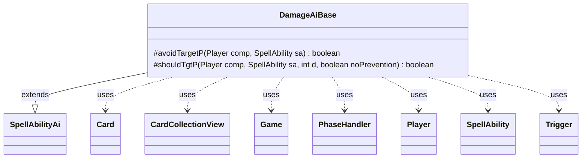

---
aliases:
  - DamageAiBase
tags:
  - java/class
  - module/forge-ai
  - pkg/forge/ai/ability
fqn: forge.ai.ability.DamageAiBase
package: forge.ai.ability
module: forge-ai
kind: Class
---

# DamageAiBase

**Package:** `forge.ai.ability` &nbsp; **Module:** `forge-ai` &nbsp; **Kind:** Class



## Relationships
**Extends:**
- [[forge.ai.SpellAbilityAi|SpellAbilityAi]]
**Uses:**
- [[forge.game.Game|Game]]
- [[forge.game.card.Card|Card]]
- [[forge.game.card.CardCollectionView|CardCollectionView]]
- [[forge.game.phase.PhaseHandler|PhaseHandler]]
- [[forge.game.player.Player|Player]]
- [[forge.game.spellability.SpellAbility|SpellAbility]]
- [[forge.game.trigger.Trigger|Trigger]]

## Design Description

DamageAiBase is an abstract AI helper that centralizes the decision logic for evaluating whether to aim damage-dealing spells and abilities at an opposing player. Extending `SpellAbilityAi`, it serves as a shared base for concrete damage-ability AI classes, supplying two protected predicates: `avoidTargetP`, which guards against self-damaging effects (e.g. Fireslinger) unless lifelink or a lifelink-like enchantment offsets the cost, and `shouldTgtP`, which weighs whether burning the weakest opponent is worthwhile.

The design encodes considerable heuristic intent: it respects targeting legality and life-loss prevention, exploits on-damage triggers, predicts post-replacement damage via `ComputerUtilCombat`, and prioritizes lethal-range hits. For non-lethal cases it factors in phase timing, hand size, sorcery-versus-instant speed, and cards-in-hand scaling (Blood Oath, Sudden Impact), ultimately gating marginal plays behind a randomized probability with a hard floor. It collaborates with `Game`, `PhaseHandler`, `Player`, `Card`, `CardCollectionView`, `SpellAbility`, and `Trigger` to gather this contextual state.

## Source
`forge-ai/src/main/java/forge/ai/ability/DamageAiBase.java`

```java
package forge.ai.ability;

import forge.ai.ComputerUtil;
import forge.ai.ComputerUtilCombat;
import forge.ai.SpellAbilityAi;
import forge.game.Game;
import forge.game.card.Card;
import forge.game.card.CardCollectionView;
import forge.game.keyword.Keyword;
import forge.game.phase.PhaseHandler;
import forge.game.phase.PhaseType;
import forge.game.player.Player;
import forge.game.spellability.SpellAbility;
import forge.game.trigger.Trigger;
import forge.game.trigger.TriggerType;
import forge.game.zone.ZoneType;
import forge.util.MyRandom;

public abstract class DamageAiBase extends SpellAbilityAi {
    protected boolean avoidTargetP(final Player comp, final SpellAbility sa) {
        Player enemy = comp.getWeakestOpponent();
        // Logic for cards that damage owner, like Fireslinger
        // Do not target a player if they aren't below 75% of our health.
        // Unless Lifelink will cancel the damage to us
        Card hostcard = sa.getHostCard();
        boolean lifelink = hostcard.hasKeyword(Keyword.LIFELINK);
        if (!lifelink) {
            for (Card ench : hostcard.getEnchantedBy()) {
                // Treat cards enchanted by older cards with "when enchanted creature deals damage, gain life" as if they had lifelink.
                if (ench.hasSVar("LikeLifeLink")) {
                    if ("True".equals(ench.getSVar("LikeLifeLink"))) {
                        lifelink = true;
                    }
                }
            }
        }
        if ("SelfDamage".equals(sa.getParam("AILogic"))) {
            if (comp.getLife() * 0.75 < enemy.getLife()) {
                return !lifelink;
            }
        }
        return false;
    }

    protected boolean shouldTgtP(final Player comp, final SpellAbility sa, final int d, final boolean noPrevention) {
        int restDamage = d;
        final Game game = comp.getGame();
        Player enemy = comp.getWeakestOpponent();
        boolean dmgByCardsInHand = false;
        Card hostcard = sa.getHostCard();

        if ("X".equals(sa.getParam("NumDmg")) && hostcard != null && sa.hasSVar(sa.getParam("NumDmg")) &&
                sa.getSVar(sa.getParam("NumDmg")).equals("TargetedPlayer$CardsInHand")) {
            dmgByCardsInHand = true;
        }
        // Not sure if type choice implemented for the AI yet but it should at least recognize this spell hits harder on larger enemy hand size
        if ("Blood Oath".equals(hostcard.getName())) {
            dmgByCardsInHand = true;
        }

        if (!sa.canTarget(enemy)) {
            return false;
        }
        if (sa.getTargets() != null && sa.getTargets().contains(enemy)) {
            return false;
        }

        // If the opponent will gain life (ex. Fiery Justice), not beneficial unless life gain is harmful or ignored
        if ("OpponentGainLife".equals(sa.getParam("AILogic")) && ComputerUtil.lifegainPositive(enemy, hostcard)) {
            return false;
        }

        // Benefits hitting players?
        // If has triggered ability on dealing damage to an opponent, go for it!
        for (Trigger trig : hostcard.getTriggers()) {
            if (trig.getMode() == TriggerType.DamageDone) {
                if ("Opponent".equals(trig.getParam("ValidTarget"))
                        && !"True".equals(trig.getParam("CombatDamage"))) {
                    return true;
                }
            }
        }

        if (avoidTargetP(comp, sa)) {
            return false;
        }

        if (!enemy.canLoseLife()) {
            return false;
        }

        if (!noPrevention) {
            restDamage = ComputerUtilCombat.predictDamageTo(enemy, restDamage, hostcard, false);
        } else {
            restDamage = enemy.staticReplaceDamage(restDamage, hostcard, false);
        }
        if (restDamage == 0) {
            return false;
        }

        if ((enemy.getLife() - restDamage) < 5) {
            // drop the human to less than 5 life
            return true;
        }

        if (sa.isSpell()) {
            final CardCollectionView hand = comp.getCardsIn(ZoneType.Hand);
            PhaseHandler phase = game.getPhaseHandler();
            // If this is a spell, cast it instead of discarding
            if ((phase.is(PhaseType.END_OF_TURN) || phase.is(PhaseType.MAIN2))
                    && phase.isPlayerTurn(comp) && hand.size() > comp.getMaxHandSize()) {
                return true;
            }

            // chance to burn player based on current hand size
            if (hand.size() > 2) {
                float value = 0;
                if (isSorcerySpeed(sa, comp)) {
                    //lower chance for sorcery as other spells may be cast in main2
                    if (phase.isPlayerTurn(comp) && phase.is(PhaseType.MAIN2)) {
                        value = 1.0f * restDamage / enemy.getLife();
                    }
                } else {
                    // If Sudden Impact type spell, and can hit at least 3 cards during draw phase
                    // have a 100% chance to go for it, enemy hand will only lose cards over time!
                    // But if 3 or less cards, use normal rules, just in case enemy starts holding card or plays a draw spell or we need mana for other instants.
                    if (phase.isPlayerTurn(enemy)) {
                        if (dmgByCardsInHand
                                && (phase.is(PhaseType.DRAW))
                                && (enemy.getCardsIn(ZoneType.Hand).size() > 3)) {
                            value = 1;
                        } else if (phase.is(PhaseType.END_OF_TURN)
                                || ((dmgByCardsInHand && phase.getPhase().isAfter(PhaseType.UPKEEP)))) {
                            value = 1.5f * restDamage / enemy.getLife();
                        }
                    }
                }
                if (value > 0) { //more likely to burn with larger hand
                    for (int i = 3; i < hand.size(); i++) {
                        value *= 1.1f;
                    }
                }
                if (value < 0.2f) { //hard floor to reduce ridiculous odds for instants over time
                    return false;
                }
                final float chance = MyRandom.getRandom().nextFloat();
                return chance < value;
            }
        }

        return false;
    }
}
```

## Python
`forge/ai/ability/DamageAiBase.py`

```python
from forge.ai.ComputerUtil import ComputerUtil
from forge.ai.ComputerUtilCombat import ComputerUtilCombat
from forge.ai.SpellAbilityAi import SpellAbilityAi
from forge.game.Game import Game
from forge.game.card.Card import Card
from forge.game.card.CardCollectionView import CardCollectionView
from forge.game.keyword.Keyword import Keyword
from forge.game.phase.PhaseHandler import PhaseHandler
from forge.game.phase.PhaseType import PhaseType
from forge.game.player.Player import Player
from forge.game.spellability.SpellAbility import SpellAbility
from forge.game.trigger.Trigger import Trigger
from forge.game.trigger.TriggerType import TriggerType
from forge.game.zone.ZoneType import ZoneType
from forge.util.MyRandom import MyRandom


class DamageAiBase(SpellAbilityAi):
    def avoidTargetP(self, comp: Player, sa: SpellAbility) -> bool:
        enemy = comp.getWeakestOpponent()
        # Logic for cards that damage owner, like Fireslinger
        # Do not target a player if they aren't below 75% of our health.
        # Unless Lifelink will cancel the damage to us
        hostcard = sa.getHostCard()
        lifelink = hostcard.hasKeyword(Keyword.LIFELINK)
        if not lifelink:
            for ench in hostcard.getEnchantedBy():
                # Treat cards enchanted by older cards with "when enchanted creature deals damage, gain life" as if they had lifelink.
                if ench.hasSVar("LikeLifeLink"):
                    if "True" == ench.getSVar("LikeLifeLink"):
                        lifelink = True
        if "SelfDamage" == sa.getParam("AILogic"):
            if comp.getLife() * 0.75 < enemy.getLife():
                return not lifelink
        return False

    def shouldTgtP(self, comp: Player, sa: SpellAbility, d: int, noPrevention: bool) -> bool:
        restDamage = d
        game = comp.getGame()
        enemy = comp.getWeakestOpponent()
        dmgByCardsInHand = False
        hostcard = sa.getHostCard()

        if ("X" == sa.getParam("NumDmg") and hostcard is not None and sa.hasSVar(sa.getParam("NumDmg")) and
                sa.getSVar(sa.getParam("NumDmg")) == "TargetedPlayer$CardsInHand"):
            dmgByCardsInHand = True
        # Not sure if type choice implemented for the AI yet but it should at least recognize this spell hits harder on larger enemy hand size
        if "Blood Oath" == hostcard.getName():
            dmgByCardsInHand = True

        if not sa.canTarget(enemy):
            return False
        if sa.getTargets() is not None and sa.getTargets().contains(enemy):
            return False

        # If the opponent will gain life (ex. Fiery Justice), not beneficial unless life gain is harmful or ignored
        if "OpponentGainLife" == sa.getParam("AILogic") and ComputerUtil.lifegainPositive(enemy, hostcard):
            return False

        # Benefits hitting players?
        # If has triggered ability on dealing damage to an opponent, go for it!
        for trig in hostcard.getTriggers():
            if trig.getMode() == TriggerType.DamageDone:
                if ("Opponent" == trig.getParam("ValidTarget")
                        and "True" != trig.getParam("CombatDamage")):
                    return True

        if self.avoidTargetP(comp, sa):
            return False

        if not enemy.canLoseLife():
            return False

        if not noPrevention:
            restDamage = ComputerUtilCombat.predictDamageTo(enemy, restDamage, hostcard, False)
        else:
            restDamage = enemy.staticReplaceDamage(restDamage, hostcard, False)
        if restDamage == 0:
            return False

        if (enemy.getLife() - restDamage) < 5:
            # drop the human to less than 5 life
            return True

        if sa.isSpell():
            hand = comp.getCardsIn(ZoneType.Hand)
            phase = game.getPhaseHandler()
            # If this is a spell, cast it instead of discarding
            if ((phase.is_(PhaseType.END_OF_TURN) or phase.is_(PhaseType.MAIN2))
                    and phase.isPlayerTurn(comp) and hand.size() > comp.getMaxHandSize()):
                return True

            # chance to burn player based on current hand size
            if hand.size() > 2:
                value = 0
                if self.isSorcerySpeed(sa, comp):
                    # lower chance for sorcery as other spells may be cast in main2
                    if phase.isPlayerTurn(comp) and phase.is_(PhaseType.MAIN2):
                        value = 1.0 * restDamage / enemy.getLife()
                else:
                    # If Sudden Impact type spell, and can hit at least 3 cards during draw phase
                    # have a 100% chance to go for it, enemy hand will only lose cards over time!
                    # But if 3 or less cards, use normal rules, just in case enemy starts holding card or plays a draw spell or we need mana for other instants.
                    if phase.isPlayerTurn(enemy):
                        if (dmgByCardsInHand
                                and phase.is_(PhaseType.DRAW)
                                and enemy.getCardsIn(ZoneType.Hand).size() > 3):
                            value = 1
                        elif (phase.is_(PhaseType.END_OF_TURN)
                                or (dmgByCardsInHand and phase.getPhase().isAfter(PhaseType.UPKEEP))):
                            value = 1.5 * restDamage / enemy.getLife()
                if value > 0:  # more likely to burn with larger hand
                    for i in range(3, hand.size()):
                        value *= 1.1
                if value < 0.2:  # hard floor to reduce ridiculous odds for instants over time
                    return False
                chance = MyRandom.getRandom().nextFloat()
                return chance < value

        return False
```
