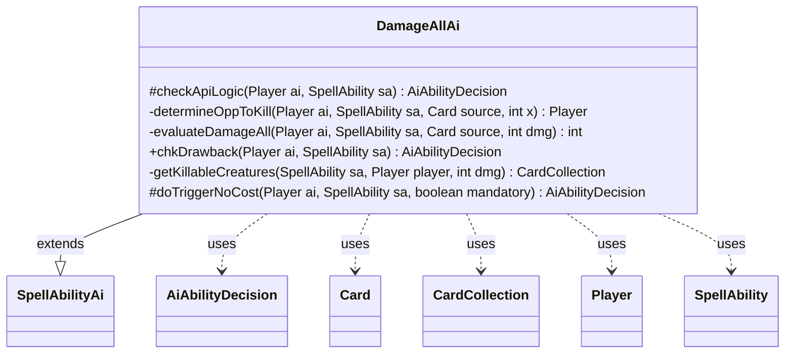

---
aliases:
  - DamageAllAi
tags:
  - java/class
  - module/forge-ai
  - pkg/forge/ai/ability
fqn: forge.ai.ability.DamageAllAi
package: forge.ai.ability
module: forge-ai
kind: Class
---

# DamageAllAi

**Package:** `forge.ai.ability` &nbsp; **Module:** `forge-ai` &nbsp; **Kind:** Class



## Relationships
**Extends:**
- [[forge.ai.SpellAbilityAi|SpellAbilityAi]]
**Uses:**
- [[forge.ai.AiAbilityDecision|AiAbilityDecision]]
- [[forge.game.card.Card|Card]]
- [[forge.game.card.CardCollection|CardCollection]]
- [[forge.game.player.Player|Player]]
- [[forge.game.spellability.SpellAbility|SpellAbility]]

## Design Description

DamageAllAi is the AI controller for "damage all" effects (e.g., Pyroclasm, Pestilence), extending `SpellAbilityAi` to supply Forge's computer player with decision logic for casting, chaining onto drawbacks, and resolving mandatory triggers. Its core responsibility is judging whether a board-wide damage effect is worthwhile: it scans `Player` opponents for a lethal finish via `determineOppToKill`, weighs the trade in destroyed creatures through `evaluateDamageAll`, and computes which creatures would die with `getKillableCreatures`, returning each verdict as an `AiAbilityDecision`.

The design centers on net value: it collaborates with combat/card evaluators to compare friendly versus hostile `CardCollection` losses against a tunable minimum gain, and refuses plays that would kill the AI itself. Notable intent includes deferring until the stack is empty, special-casing X-cost optimization (searching for the best X) and repeatable Pestilence-style effects with end-of-turn timing, reflecting careful guarding against self-destruction and wasted activations.

## Source
`forge-ai/src/main/java/forge/ai/ability/DamageAllAi.java`

```java
package forge.ai.ability;

import forge.ai.*;
import forge.game.ability.AbilityUtils;
import forge.game.card.Card;
import forge.game.card.CardCollection;
import forge.game.card.CardLists;
import forge.game.keyword.Keyword;
import forge.game.phase.PhaseType;
import forge.game.player.Player;
import forge.game.spellability.SpellAbility;
import forge.game.zone.ZoneType;

import java.util.function.Predicate;

public class  DamageAllAi extends SpellAbilityAi {
    @Override
    protected AiAbilityDecision checkApiLogic(Player ai, SpellAbility sa) {
        // AI needs to be expanded, since this function can be pretty complex
        // based on what the expected targets could be
        final Card source = sa.getHostCard();

        // wait until stack is empty (prevents duplicate kills)
        if (!ai.getGame().getStack().isEmpty()) {
            return new AiAbilityDecision(0, AiPlayDecision.StackNotEmpty);
        }

        int x = -1;
        final String damage = sa.getParam("NumDmg");
        int dmg = AbilityUtils.calculateAmount(source, damage, sa);
        if (damage.equals("X") && sa.getSVar(damage).equals("Count$Converge")) {
        	dmg = ComputerUtilMana.getConvergeCount(sa, ai);
        }
        if (damage.equals("X") && sa.getSVar(damage).equals("Count$xPaid")) {
            x = ComputerUtilCost.setMaxXValue(sa, ai, sa.isTrigger());
        }
        if (x == -1) {
            if (determineOppToKill(ai, sa, source, dmg) != null) {
                // we already know we can kill a player, so go for it
                return new AiAbilityDecision(100, AiPlayDecision.WillPlay);
            }
            // look for other value in this (damaging creatures or
            // creatures + player, e.g. Pestilence, etc.)
             if (evaluateDamageAll(ai, sa, source, dmg) > 0) {
                 return new AiAbilityDecision(100, AiPlayDecision.WillPlay);
             }
             return new AiAbilityDecision(0, AiPlayDecision.CantPlayAi);
        } else {
            int best = -1, best_x = -1;
            Player bestOpp = determineOppToKill(ai, sa, source, x);
            if (bestOpp != null) {
                // we can finish off a player, so go for it

                // TODO: improve this by possibly damaging more creatures
                // on the battlefield belonging to other opponents at the same
                // time, if viable
                best_x = bestOpp.getLife();
            } else {
                // see if it's possible to get value from killing off creatures
                for (int i = 0; i <= x; i++) {
                    final int value = evaluateDamageAll(ai, sa, source, i);
                    if (value > best) {
                        best = value;
                        best_x = i;
                    }
                }
            }

            if (best_x > 0) {
                if (sa.getSVar(damage).equals("Count$xPaid")) {
                    sa.setXManaCostPaid(best_x);
                }
                return new AiAbilityDecision(100, AiPlayDecision.WillPlay);
            }
            return new AiAbilityDecision(0, AiPlayDecision.CantPlayAi);
        }
    }

    private Player determineOppToKill(Player ai, SpellAbility sa, Card source, int x) {
        // Attempt to determine which opponent can be finished off such that the most players
        // are killed at the same time, given X damage tops
        final String validP = sa.getParamOrDefault("ValidPlayers", "");
        int aiLife = ai.getLife();
        Player bestOpp = null; // default opponent, if all else fails

        for (int dmg = 1; dmg <= x; dmg++) {
            // Don't kill yourself in the process
            if (validP.equals("Player") && aiLife <= ComputerUtilCombat.predictDamageTo(ai, dmg, source, false)) {
                break;
            }
            for (Player opp : ai.getOpponents()) {
                if ((validP.equals("Player") || validP.contains("Opponent"))
                        && (opp.getLife() <= ComputerUtilCombat.predictDamageTo(opp, dmg, source, false))) {
                    bestOpp = opp;
                }
            }
        }

        return bestOpp;
    }

    private int evaluateDamageAll(Player ai, SpellAbility sa, final Card source, int dmg) {
        final Player opp = ai.getWeakestOpponent();
        final CardCollection humanList = getKillableCreatures(sa, opp, dmg);
        CardCollection computerList = getKillableCreatures(sa, ai, dmg);

        if (sa.usesTargeting() && sa.canTarget(opp)) {
            sa.resetTargets();
            sa.getTargets().add(opp);
            computerList.clear();
        }

        final String validP = sa.getParamOrDefault("ValidPlayers", "");
        // TODO: if damage is dependent on mana paid, maybe have X be human's max life
        // Don't kill yourself
        if (validP.equals("Player") && (ai.getLife() <= ComputerUtilCombat.predictDamageTo(ai, dmg, source, false))) {
            return -1;
        }

        int minGain = 200; // The minimum gain in destroyed creatures
        if (sa.getPayCosts().isReusuableResource()) {
            if (computerList.isEmpty()) {
                minGain = 10; // nothing to lose
                // no creatures to lose and player can be damaged
                // so do it if it's helping!
                // ----------------------------
                // needs future improvement on pestilence :
                // what if we lose creatures but can win by repeated activations?
                // that tactic only works if there are creatures left to keep pestilence in play
                // and can kill the player in a reasonable amount of time (no more than 2-3 turns?)
                if (validP.equals("Player")) {
                    if (ComputerUtilCombat.predictDamageTo(opp, dmg, source, false) > 0) {
                        // When using Pestilence to hurt players, do it at
                        // the end of the opponent's turn only
                        if (!"DmgAllCreaturesAndPlayers".equals(sa.getParam("AILogic"))
                                || (ai.getGame().getPhaseHandler().is(PhaseType.END_OF_TURN)
                                && !ai.getGame().getPhaseHandler().isPlayerTurn(ai)))
                        // Need further improvement : if able to kill immediately with repeated activations, do not wait
                        // for phases! Will also need to implement considering repeated activations for killed creatures!
                        // || (ai.sa.getPayCosts(). ??? )
                        {
                            // would take zero damage, and hurt opponent, do it!
                            if (ComputerUtilCombat.predictDamageTo(ai, dmg, source, false) < 1) {
                                return 1;
                            }
                            // enemy is expected to die faster than AI from damage if repeated
                            if (ai.getLife() > ComputerUtilCombat.predictDamageTo(ai, dmg, source, false)
                                    * ((opp.getLife() + ComputerUtilCombat.predictDamageTo(opp, dmg, source, false) - 1)
                                    / ComputerUtilCombat.predictDamageTo(opp, dmg, source, false))) {
                                // enemy below 10 life, go for it!
                                if ((opp.getLife() < 10)
                                        && (ComputerUtilCombat.predictDamageTo(opp, dmg, source, false) >= 1)) {
                                    return 1;
                                }
                                // At least half enemy remaining life can be removed in one go
                                // worth doing even if enemy still has high health - one more copy of spell to win!
                                if (opp.getLife() <= 2 * ComputerUtilCombat.predictDamageTo(opp, dmg, source, false)) {
                                    return 1;
                                }
                            }
                        }
                    }
                }
            } else {
                minGain = 100; // safety for errors in evaluate creature
            }
        } else if (sa.getSubAbility() != null && ai.getGame().getPhaseHandler().is(PhaseType.MAIN1) && computerList.isEmpty()
                && opp.getCreaturesInPlay().size() > 1 && !ai.getCreaturesInPlay().isEmpty()) {
            minGain = 126; // prepare for attack
        }

        return ComputerUtilCard.evaluateCreatureList(humanList) - ComputerUtilCard.evaluateCreatureList(computerList)
                - minGain;
    }

    @Override
    public AiAbilityDecision chkDrawback(Player ai, SpellAbility sa) {
        final Card source = sa.getHostCard();
        final String validP = sa.getParamOrDefault("ValidPlayers", "");

        final String damage = sa.getParam("NumDmg");
        int dmg;
        if (damage.equals("X") && sa.getSVar(damage).equals("Count$xPaid")) {
            dmg = ComputerUtilCost.setMaxXValue(sa, ai, sa.isTrigger());
        } else {
            dmg = AbilityUtils.calculateAmount(source, damage, sa);
        }

        // Evaluate creatures getting killed
        Player enemy = ai.getWeakestOpponent();
        final CardCollection humanList = getKillableCreatures(sa, enemy, dmg);
        CardCollection computerList = getKillableCreatures(sa, ai, dmg);

        if (sa.usesTargeting() && sa.canTarget(enemy)) {
            sa.resetTargets();
            sa.getTargets().add(enemy);
            computerList.clear();
        }
        // Don't get yourself killed
        if (validP.equals("Player") && (ai.getLife() <= ComputerUtilCombat.predictDamageTo(ai, dmg, source, false))) {
            return new AiAbilityDecision(0, AiPlayDecision.CantPlayAi);
        }

        // if we can kill human, do it
        if ((validP.equals("Player") || validP.equals("Opponent") || validP.contains("Targeted"))
                && (enemy.getLife() <= ComputerUtilCombat.predictDamageTo(enemy, dmg, source, false))) {
            return new AiAbilityDecision(100, AiPlayDecision.WillPlay);
        }

        if (!computerList.isEmpty() && ComputerUtilCard.evaluateCreatureList(computerList) > ComputerUtilCard
                .evaluateCreatureList(humanList)) {
            return new AiAbilityDecision(0, AiPlayDecision.CantPlayAi);
        }

        return new AiAbilityDecision(100, AiPlayDecision.WillPlay);
    }

    /**
     * <p>
     * getKillableCreatures.
     * </p>
     *
     * @param sa
     *            a {@link forge.game.spellability.SpellAbility} object.
     * @param player
     *            a {@link forge.game.player.Player} object.
     * @param dmg
     *            a int.
     * @return a {@link forge.game.card.CardCollection} object.
     */
    private CardCollection getKillableCreatures(final SpellAbility sa, final Player player, final int dmg) {
        final Card source = sa.getHostCard();
        String validC = sa.getParamOrDefault("ValidCards", "");

        // TODO: X may be something different than X paid
        CardCollection list =
                CardLists.getValidCards(player.getCardsIn(ZoneType.Battlefield), validC, source.getController(), source, sa);

        final Predicate<Card> filterKillable = c -> ComputerUtilCombat.predictDamageTo(c, dmg, source, false) >= ComputerUtilCombat.getDamageToKill(c, false);

        list = CardLists.getNotKeyword(list, Keyword.INDESTRUCTIBLE);
        list = CardLists.filter(list, filterKillable);

        return list;
    }

    @Override
    protected AiAbilityDecision doTriggerNoCost(Player ai, SpellAbility sa, boolean mandatory) {
        final Card source = sa.getHostCard();
        final String validP = sa.getParamOrDefault("ValidPlayers", "");

        final String damage = sa.getParam("NumDmg");
        int dmg;

        if (damage.equals("X") && sa.getSVar(damage).equals("Count$xPaid")
                && sa.getPayCosts() != null && sa.getPayCosts().hasXInAnyCostPart()) {
            // Set PayX here to maximum value.
            dmg = ComputerUtilCost.setMaxXValue(sa, ai, true);
            sa.setXManaCostPaid(dmg);
        } else {
            dmg = AbilityUtils.calculateAmount(source, damage, sa);
        }

        // Evaluate creatures getting killed
        Player enemy = ai.getWeakestOpponent();
        final CardCollection humanList = getKillableCreatures(sa, enemy, dmg);
        CardCollection computerList = getKillableCreatures(sa, ai, dmg);

        if (sa.usesTargeting() && sa.canTarget(enemy)) {
            sa.resetTargets();
            sa.getTargets().add(enemy);
            computerList.clear();
        }

        // If it's not mandatory check a few things
        if (mandatory) {
            return new AiAbilityDecision(100, AiPlayDecision.WillPlay);
        }
        // Don't get yourself killed
        if (validP.equals("Player") && (ai.getLife() <= ComputerUtilCombat.predictDamageTo(ai, dmg, source, false))) {
            return new AiAbilityDecision(0, AiPlayDecision.CantPlayAi);
        }

        // if we can kill human, do it
        if ((validP.equals("Player") || validP.contains("Opponent") || validP.contains("Targeted"))
                && (enemy.getLife() <= ComputerUtilCombat.predictDamageTo(enemy, dmg, source, false))) {
            return new AiAbilityDecision(100, AiPlayDecision.WillPlay);
        }

        if (!computerList.isEmpty() && ComputerUtilCard.evaluateCreatureList(computerList) + 50 >= ComputerUtilCard
                .evaluateCreatureList(humanList)) {
            return new AiAbilityDecision(0, AiPlayDecision.CantPlayAi);
        }

        return new AiAbilityDecision(100, AiPlayDecision.WillPlay);
    }
}
```

## Python
`forge/ai/ability/DamageAllAi.py`

```python
from forge.ai.SpellAbilityAi import SpellAbilityAi
from forge.ai.AiAbilityDecision import AiAbilityDecision
from forge.ai.AiPlayDecision import AiPlayDecision
from forge.ai.ComputerUtilMana import ComputerUtilMana
from forge.ai.ComputerUtilCost import ComputerUtilCost
from forge.ai.ComputerUtilCombat import ComputerUtilCombat
from forge.ai.ComputerUtilCard import ComputerUtilCard
from forge.game.ability.AbilityUtils import AbilityUtils
from forge.game.card.Card import Card
from forge.game.card.CardCollection import CardCollection
from forge.game.card.CardLists import CardLists
from forge.game.keyword.Keyword import Keyword
from forge.game.phase.PhaseType import PhaseType
from forge.game.player.Player import Player
from forge.game.spellability.SpellAbility import SpellAbility
from forge.game.zone.ZoneType import ZoneType


class DamageAllAi(SpellAbilityAi):
    def checkApiLogic(self, ai: Player, sa: SpellAbility) -> AiAbilityDecision:
        # AI needs to be expanded, since this function can be pretty complex
        # based on what the expected targets could be
        source = sa.getHostCard()

        # wait until stack is empty (prevents duplicate kills)
        if not ai.getGame().getStack().isEmpty():
            return AiAbilityDecision(0, AiPlayDecision.StackNotEmpty)

        x = -1
        damage = sa.getParam("NumDmg")
        dmg = AbilityUtils.calculateAmount(source, damage, sa)
        if damage == "X" and sa.getSVar(damage) == "Count$Converge":
            dmg = ComputerUtilMana.getConvergeCount(sa, ai)
        if damage == "X" and sa.getSVar(damage) == "Count$xPaid":
            x = ComputerUtilCost.setMaxXValue(sa, ai, sa.isTrigger())
        if x == -1:
            if self.determineOppToKill(ai, sa, source, dmg) is not None:
                # we already know we can kill a player, so go for it
                return AiAbilityDecision(100, AiPlayDecision.WillPlay)
            # look for other value in this (damaging creatures or
            # creatures + player, e.g. Pestilence, etc.)
            if self.evaluateDamageAll(ai, sa, source, dmg) > 0:
                return AiAbilityDecision(100, AiPlayDecision.WillPlay)
            return AiAbilityDecision(0, AiPlayDecision.CantPlayAi)
        else:
            best, best_x = -1, -1
            bestOpp = self.determineOppToKill(ai, sa, source, x)
            if bestOpp is not None:
                # we can finish off a player, so go for it

                # TODO: improve this by possibly damaging more creatures
                # on the battlefield belonging to other opponents at the same
                # time, if viable
                best_x = bestOpp.getLife()
            else:
                # see if it's possible to get value from killing off creatures
                for i in range(0, x + 1):
                    value = self.evaluateDamageAll(ai, sa, source, i)
                    if value > best:
                        best = value
                        best_x = i

            if best_x > 0:
                if sa.getSVar(damage) == "Count$xPaid":
                    sa.setXManaCostPaid(best_x)
                return AiAbilityDecision(100, AiPlayDecision.WillPlay)
            return AiAbilityDecision(0, AiPlayDecision.CantPlayAi)

    def determineOppToKill(self, ai: Player, sa: SpellAbility, source: Card, x: int) -> Player:
        # Attempt to determine which opponent can be finished off such that the most players
        # are killed at the same time, given X damage tops
        validP = sa.getParamOrDefault("ValidPlayers", "")
        aiLife = ai.getLife()
        bestOpp = None  # default opponent, if all else fails

        for dmg in range(1, x + 1):
            # Don't kill yourself in the process
            if validP == "Player" and aiLife <= ComputerUtilCombat.predictDamageTo(ai, dmg, source, False):
                break
            for opp in ai.getOpponents():
                if (validP == "Player" or "Opponent" in validP) \
                        and (opp.getLife() <= ComputerUtilCombat.predictDamageTo(opp, dmg, source, False)):
                    bestOpp = opp

        return bestOpp

    def evaluateDamageAll(self, ai: Player, sa: SpellAbility, source: Card, dmg: int) -> int:
        opp = ai.getWeakestOpponent()
        humanList = self.getKillableCreatures(sa, opp, dmg)
        computerList = self.getKillableCreatures(sa, ai, dmg)

        if sa.usesTargeting() and sa.canTarget(opp):
            sa.resetTargets()
            sa.getTargets().add(opp)
            computerList.clear()

        validP = sa.getParamOrDefault("ValidPlayers", "")
        # TODO: if damage is dependent on mana paid, maybe have X be human's max life
        # Don't kill yourself
        if validP == "Player" and (ai.getLife() <= ComputerUtilCombat.predictDamageTo(ai, dmg, source, False)):
            return -1

        minGain = 200  # The minimum gain in destroyed creatures
        if sa.getPayCosts().isReusuableResource():
            if computerList.isEmpty():
                minGain = 10  # nothing to lose
                # no creatures to lose and player can be damaged
                # so do it if it's helping!
                # ----------------------------
                # needs future improvement on pestilence :
                # what if we lose creatures but can win by repeated activations?
                # that tactic only works if there are creatures left to keep pestilence in play
                # and can kill the player in a reasonable amount of time (no more than 2-3 turns?)
                if validP == "Player":
                    if ComputerUtilCombat.predictDamageTo(opp, dmg, source, False) > 0:
                        # When using Pestilence to hurt players, do it at
                        # the end of the opponent's turn only
                        if not ("DmgAllCreaturesAndPlayers" == sa.getParam("AILogic")) \
                                or (ai.getGame().getPhaseHandler().is_(PhaseType.END_OF_TURN)
                                    and not ai.getGame().getPhaseHandler().isPlayerTurn(ai)):
                            # Need further improvement : if able to kill immediately with repeated activations, do not wait
                            # for phases! Will also need to implement considering repeated activations for killed creatures!
                            # || (ai.sa.getPayCosts(). ??? )

                            # would take zero damage, and hurt opponent, do it!
                            if ComputerUtilCombat.predictDamageTo(ai, dmg, source, False) < 1:
                                return 1
                            # enemy is expected to die faster than AI from damage if repeated
                            if ai.getLife() > ComputerUtilCombat.predictDamageTo(ai, dmg, source, False) \
                                    * ((opp.getLife() + ComputerUtilCombat.predictDamageTo(opp, dmg, source, False) - 1)
                                       // ComputerUtilCombat.predictDamageTo(opp, dmg, source, False)):
                                # enemy below 10 life, go for it!
                                if (opp.getLife() < 10) \
                                        and (ComputerUtilCombat.predictDamageTo(opp, dmg, source, False) >= 1):
                                    return 1
                                # At least half enemy remaining life can be removed in one go
                                # worth doing even if enemy still has high health - one more copy of spell to win!
                                if opp.getLife() <= 2 * ComputerUtilCombat.predictDamageTo(opp, dmg, source, False):
                                    return 1
            else:
                minGain = 100  # safety for errors in evaluate creature
        elif sa.getSubAbility() is not None and ai.getGame().getPhaseHandler().is_(PhaseType.MAIN1) and computerList.isEmpty() \
                and opp.getCreaturesInPlay().size() > 1 and not ai.getCreaturesInPlay().isEmpty():
            minGain = 126  # prepare for attack

        return ComputerUtilCard.evaluateCreatureList(humanList) - ComputerUtilCard.evaluateCreatureList(computerList) \
            - minGain

    def chkDrawback(self, ai: Player, sa: SpellAbility) -> AiAbilityDecision:
        source = sa.getHostCard()
        validP = sa.getParamOrDefault("ValidPlayers", "")

        damage = sa.getParam("NumDmg")
        if damage == "X" and sa.getSVar(damage) == "Count$xPaid":
            dmg = ComputerUtilCost.setMaxXValue(sa, ai, sa.isTrigger())
        else:
            dmg = AbilityUtils.calculateAmount(source, damage, sa)

        # Evaluate creatures getting killed
        enemy = ai.getWeakestOpponent()
        humanList = self.getKillableCreatures(sa, enemy, dmg)
        computerList = self.getKillableCreatures(sa, ai, dmg)

        if sa.usesTargeting() and sa.canTarget(enemy):
            sa.resetTargets()
            sa.getTargets().add(enemy)
            computerList.clear()
        # Don't get yourself killed
        if validP == "Player" and (ai.getLife() <= ComputerUtilCombat.predictDamageTo(ai, dmg, source, False)):
            return AiAbilityDecision(0, AiPlayDecision.CantPlayAi)

        # if we can kill human, do it
        if (validP == "Player" or validP == "Opponent" or "Targeted" in validP) \
                and (enemy.getLife() <= ComputerUtilCombat.predictDamageTo(enemy, dmg, source, False)):
            return AiAbilityDecision(100, AiPlayDecision.WillPlay)

        if not computerList.isEmpty() and ComputerUtilCard.evaluateCreatureList(computerList) > ComputerUtilCard \
                .evaluateCreatureList(humanList):
            return AiAbilityDecision(0, AiPlayDecision.CantPlayAi)

        return AiAbilityDecision(100, AiPlayDecision.WillPlay)

    def getKillableCreatures(self, sa: SpellAbility, player: Player, dmg: int) -> CardCollection:
        """
        getKillableCreatures.

        :param sa: a forge.game.spellability.SpellAbility object.
        :param player: a forge.game.player.Player object.
        :param dmg: a int.
        :return: a forge.game.card.CardCollection object.
        """
        source = sa.getHostCard()
        validC = sa.getParamOrDefault("ValidCards", "")

        # TODO: X may be something different than X paid
        list = CardLists.getValidCards(player.getCardsIn(ZoneType.Battlefield), validC, source.getController(), source, sa)

        filterKillable = lambda c: ComputerUtilCombat.predictDamageTo(c, dmg, source, False) >= ComputerUtilCombat.getDamageToKill(c, False)

        list = CardLists.getNotKeyword(list, Keyword.INDESTRUCTIBLE)
        list = CardLists.filter(list, filterKillable)

        return list

    def doTriggerNoCost(self, ai: Player, sa: SpellAbility, mandatory: bool) -> AiAbilityDecision:
        source = sa.getHostCard()
        validP = sa.getParamOrDefault("ValidPlayers", "")

        damage = sa.getParam("NumDmg")

        if damage == "X" and sa.getSVar(damage) == "Count$xPaid" \
                and sa.getPayCosts() is not None and sa.getPayCosts().hasXInAnyCostPart():
            # Set PayX here to maximum value.
            dmg = ComputerUtilCost.setMaxXValue(sa, ai, True)
            sa.setXManaCostPaid(dmg)
        else:
            dmg = AbilityUtils.calculateAmount(source, damage, sa)

        # Evaluate creatures getting killed
        enemy = ai.getWeakestOpponent()
        humanList = self.getKillableCreatures(sa, enemy, dmg)
        computerList = self.getKillableCreatures(sa, ai, dmg)

        if sa.usesTargeting() and sa.canTarget(enemy):
            sa.resetTargets()
            sa.getTargets().add(enemy)
            computerList.clear()

        # If it's not mandatory check a few things
        if mandatory:
            return AiAbilityDecision(100, AiPlayDecision.WillPlay)
        # Don't get yourself killed
        if validP == "Player" and (ai.getLife() <= ComputerUtilCombat.predictDamageTo(ai, dmg, source, False)):
            return AiAbilityDecision(0, AiPlayDecision.CantPlayAi)

        # if we can kill human, do it
        if (validP == "Player" or "Opponent" in validP or "Targeted" in validP) \
                and (enemy.getLife() <= ComputerUtilCombat.predictDamageTo(enemy, dmg, source, False)):
            return AiAbilityDecision(100, AiPlayDecision.WillPlay)

        if not computerList.isEmpty() and ComputerUtilCard.evaluateCreatureList(computerList) + 50 >= ComputerUtilCard \
                .evaluateCreatureList(humanList):
            return AiAbilityDecision(0, AiPlayDecision.CantPlayAi)

        return AiAbilityDecision(100, AiPlayDecision.WillPlay)
```
