---
aliases:
  - DamageDealAi
tags:
  - java/class
  - module/forge-ai
  - pkg/forge/ai/ability
fqn: forge.ai.ability.DamageDealAi
package: forge.ai.ability
module: forge-ai
kind: Class
---

# DamageDealAi

**Package:** `forge.ai.ability`   **Module:** `forge-ai`   **Kind:** Class



```mermaid
classDiagram
    class DamageDealAi {
        +chkDrawback(Player ai, SpellAbility sa) AiAbilityDecision
        #canPlay(Player ai, SpellAbility sa) AiAbilityDecision
        -dealDamageChooseTgtC(Player ai, SpellAbility sa, int d, boolean noPrevention, Player pl, boolean mandatory) Card
        -dealDamageChooseTgtPW(Player ai, SpellAbility sa, int d, boolean noPrevention, Player pl, boolean mandatory) Card
        -getTargetableCards(Player ai, SpellAbility sa, Player pl, TargetRestrictions tgt, Player activator, Card source, Game game) List~Card~
        -damageTargetAI(Player ai, SpellAbility saMe, int dmg, boolean immediately) boolean
        -damageChoosingTargets(Player ai, SpellAbility sa, TargetRestrictions tgt, int dmg, boolean mandatory, boolean immediately) boolean
        -damageChooseNontargeted(Player ai, SpellAbility saMe, int dmg) boolean
        -damageChooseRequiredTargets(Player ai, SpellAbility sa, TargetRestrictions tgt, int dmg) boolean
        #doTriggerNoCost(Player ai, SpellAbility sa, boolean mandatory) AiAbilityDecision
        -calculateDamageAmount(SpellAbility sa, Card source, String damage) int
        -doXLifeDrainLogic(Player ai, SpellAbility sa) boolean
        +getDamagingSAToChain(Player ai, SpellAbility sa, String damage) Pair~SpellAbility,Integer~
        +willPayUnlessCost(Player payer, SpellAbility sa, Cost cost, boolean alreadyPaid, FCollectionView~Player~ payers) boolean
        +chooseSingleEntity(Player ai, SpellAbility sa, Collection~T~ options, boolean isOptional, Player targetedPlayer, Map~String,Object~ params) T
    }
    DamageDealAi --|> DamageAiBase : extends
    DamageDealAi ..> AbilitySub : uses
    DamageDealAi ..> AiAbilityDecision : uses
    DamageDealAi ..> AiController : uses
    DamageDealAi ..> Card : uses
    DamageDealAi ..> CardCollection : uses
    DamageDealAi ..> Cost : uses
    DamageDealAi ..> CostPartMana : uses
    DamageDealAi ..> CostPutCounter : uses
    DamageDealAi ..> FCollectionView : uses
    DamageDealAi ..> Game : uses
    DamageDealAi ..> GameEntity : uses
    DamageDealAi ..> GameObject : uses
    DamageDealAi ..> ManaCost : uses
    DamageDealAi ..> PhaseHandler : uses
    DamageDealAi ..> Player : uses
    DamageDealAi ..> PlayerCollection : uses
    DamageDealAi ..> PlayerControllerAi : uses
    DamageDealAi ..> SpellAbility : uses
    DamageDealAi ..> TargetChoices : uses
    DamageDealAi ..> TargetRestrictions : uses
```

## Relationships
**Extends:**
- [[forge.ai.ability.DamageAiBase|DamageAiBase]]
**Uses:**
- [[forge.ai.AiAbilityDecision|AiAbilityDecision]]
- [[forge.ai.AiController|AiController]]
- [[forge.ai.PlayerControllerAi|PlayerControllerAi]]
- [[forge.card.mana.ManaCost|ManaCost]]
- [[forge.game.Game|Game]]
- [[forge.game.GameEntity|GameEntity]]
- [[forge.game.GameObject|GameObject]]
- [[forge.game.card.Card|Card]]
- [[forge.game.card.CardCollection|CardCollection]]
- [[forge.game.cost.Cost|Cost]]
- [[forge.game.cost.CostPartMana|CostPartMana]]
- [[forge.game.cost.CostPutCounter|CostPutCounter]]
- [[forge.game.phase.PhaseHandler|PhaseHandler]]
- [[forge.game.player.Player|Player]]
- [[forge.game.player.PlayerCollection|PlayerCollection]]
- [[forge.game.spellability.AbilitySub|AbilitySub]]
- [[forge.game.spellability.SpellAbility|SpellAbility]]
- [[forge.game.spellability.TargetChoices|TargetChoices]]
- [[forge.game.spellability.TargetRestrictions|TargetRestrictions]]
- [[forge.util.collect.FCollectionView|FCollectionView]]

## Design Description

DamageDealAi is the AI decision-maker for the DealDamage spell ability, deciding whether and how an AI player should cast or activate damage-dealing effects. Extending DamageAiBase (which supplies shared helpers like `shouldTgtP` and `avoidTargetP`), it implements the standard AI hooks—`canPlay`, `chkDrawback`, `doTriggerNoCost`, `willPayUnlessCost`, and `chooseSingleEntity`—and orchestrates target selection through a layered set of private helpers that pick creatures, planeswalkers, or players, handling divided damage, mandatory triggers, and non-targeted effects.

Its central design intent is maximizing damage value: it computes effective damage via SpellAbility/Card state, prefers lethal removal of opponent creatures and planeswalkers, minimizes X-mana spent to secure a kill, and can chain or reserve mana for a second damage spell. Numerous card-specific `AILogic` branches (Triskelion, Sorin, Soul Burn, Polukranos) special-case unusual effects, collaborating heavily with ComputerUtil* evaluators and the AiController to integrate timing, cost, and threat assessment.

## Source
`forge-ai/src/main/java/forge/ai/ability/DamageDealAi.java`

```java
package forge.ai.ability;

import com.google.common.collect.Lists;
import com.google.common.collect.Maps;
import forge.ai.*;
import forge.card.MagicColor;
import forge.card.mana.ManaCost;
import forge.game.Game;
import forge.game.GameEntity;
import forge.game.GameObject;
import forge.game.ability.AbilityUtils;
import forge.game.ability.ApiType;
import forge.game.card.*;
import forge.game.cost.Cost;
import forge.game.cost.CostPartMana;
import forge.game.cost.CostPutCounter;
import forge.game.keyword.Keyword;
import forge.game.phase.PhaseHandler;
import forge.game.phase.PhaseType;
import forge.game.player.Player;
import forge.game.player.PlayerCollection;
import forge.game.player.PlayerPredicates;
import forge.game.spellability.AbilitySub;
import forge.game.spellability.SpellAbility;
import forge.game.spellability.TargetChoices;
import forge.game.spellability.TargetRestrictions;
import forge.game.staticability.StaticAbilityMustTarget;
import forge.game.zone.ZoneType;
import forge.util.MyRandom;
import forge.util.collect.FCollectionView;

import org.apache.commons.lang3.StringUtils;
import org.apache.commons.lang3.tuple.Pair;

import java.util.Arrays;
import java.util.Collection;
import java.util.List;
import java.util.Map;

import forge.util.IterableUtil;

public class DamageDealAi extends DamageAiBase {
    @Override
    public AiAbilityDecision chkDrawback(Player ai, SpellAbility sa) {
        final SpellAbility root = sa.getRootAbility();
        final String damage = sa.getParam("NumDmg");
        Card source = sa.getHostCard();
        int dmg = calculateDamageAmount(sa, source, damage);
        final String logic = sa.getParam("AILogic");

        if ("MadSarkhanDigDmg".equals(logic)) {
            return SpecialCardAi.SarkhanTheMad.considerDig(ai, sa);
        }

        if (damage.equals("X")) {
            if (sa.getSVar(damage).equals("Count$ChosenNumber")) {
                int energy = ai.getCounters(CounterEnumType.ENERGY);
                for (SpellAbility s : source.getSpellAbilities()) {
                    if ("PayEnergy".equals(s.getParam("AILogic"))) {
                        energy += AbilityUtils.calculateAmount(source, s.getParam("CounterNum"), sa);
                        break;
                    }
                }
                for (; energy > 0; energy--) {
                    if (damageTargetAI(ai, sa, energy, false)) {
                        dmg = ComputerUtilCombat.getEnoughDamageToKill(sa.getTargetCard(), energy, source, false, false);
                        if (dmg > energy || dmg < 1) {
                            continue; // in case the calculation gets messed up somewhere
                        }
                        root.setSVar("EnergyToPay", "Number$" + dmg);
                        return new AiAbilityDecision(100, AiPlayDecision.WillPlay);
                    }
                }
                return new AiAbilityDecision(0, AiPlayDecision.CantPlayAi);
            }
            if (sa.getSVar(damage).equals("Count$xPaid")) {
                // Life Drain
                if ("XLifeDrain".equals(logic)) {
                    if (doXLifeDrainLogic(ai, sa)) {
                        return new AiAbilityDecision(100, AiPlayDecision.WillPlay);
                    }
                    return new AiAbilityDecision(0, AiPlayDecision.CantPlayAi);
                }

                dmg = ComputerUtilCost.setMaxXValue(sa, ai, sa.isTrigger());
            } else if (sa.getSVar(damage).equals("Count$CardsInYourHand") && source.isInZone(ZoneType.Hand)) {
                dmg--; // the card will be spent casting the spell, so actual damage is 1 less
            }
        }
        if (damageTargetAI(ai, sa, dmg, true)) {
            return new AiAbilityDecision(100, AiPlayDecision.WillPlay);
        }
        return new AiAbilityDecision(0, AiPlayDecision.TargetingFailed);
    }

    @Override
    protected AiAbilityDecision canPlay(Player ai, SpellAbility sa) {
        final Cost abCost = sa.getPayCosts();
        final Card source = sa.getHostCard();
        final String sourceName = ComputerUtilAbility.getAbilitySourceName(sa);

        final String damage = sa.getParam("NumDmg");
        int dmg = calculateDamageAmount(sa, source, damage);

        if (damage.equals("X") || (dmg == 0 && source.getSVar("X").equals("Count$xPaid"))) {
            if (sa.getSVar("X").equals("Count$xPaid") || sa.getSVar(damage).equals("Count$xPaid")) {
                dmg = ComputerUtilCost.setMaxXValue(sa, ai, sa.isTrigger());

                // Try not to waste spells like Blaze or Fireball on early targets, try to do more damage with them if possible
                int holdChance = AiProfileUtil.getIntProperty(ai, AiProps.HOLD_X_DAMAGE_SPELLS_FOR_MORE_DAMAGE_CHANCE);
                if (MyRandom.percentTrue(holdChance)) {
                    int threshold = AiProfileUtil.getIntProperty(ai, AiProps.HOLD_X_DAMAGE_SPELLS_THRESHOLD);
                    boolean inDanger = ComputerUtil.aiLifeInDanger(ai, false, 0);
                    boolean isLethal = sa.usesTargeting() && sa.getTargetRestrictions().canTgtPlayer() && dmg >= ai.getWeakestOpponent().getLife() && !ai.getWeakestOpponent().cantLoseForZeroOrLessLife();
                    if (dmg < threshold && ai.getGame().getPhaseHandler().getTurn() / 2 < threshold && !inDanger && !isLethal) {
                        return new AiAbilityDecision(0, AiPlayDecision.CantPlayAi);
                    }
                }
            } else if (sa.getSVar(damage).contains("InYourHand") && source.isInZone(ZoneType.Hand)) {
                dmg -= - 1; // the card will be spent casting the spell, so actual damage is 1 less
            } else if (sa.getSVar(damage).equals("TargetedPlayer$CardsInHand")) {
                // cards that deal damage by the number of cards in target player's hand, e.g. Sudden Impact
                if (sa.getTargetRestrictions().canTgtPlayer()) {
                    int maxDmg = 0;
                    Player maxDamaged = null;
                    for (Player p : ai.getOpponents()) {
                        if (p.canBeTargetedBy(sa)) {
                            if (p.getCardsIn(ZoneType.Hand).size() > maxDmg) {
                                maxDmg = p.getCardsIn(ZoneType.Hand).size();
                                maxDamaged = p;
                            }
                        }
                    }
                    if (maxDmg > 0 && maxDamaged != null) {
                        if (shouldTgtP(ai, sa, maxDmg, false)) {
                            sa.resetTargets();
                            sa.getTargets().add(maxDamaged);
                            return new AiAbilityDecision(100, AiPlayDecision.WillPlay);
                        }
                    } else {
                        return new AiAbilityDecision(0, AiPlayDecision.TargetingFailed);
                    }
                }
            }
        }

        if (sourceName.equals("Crater's Claws") && ai.hasFerocious()) {
            dmg += 2;
        }

        String logic = sa.getParamOrDefault("AILogic", "");
        if ("DiscardLands".equals(logic)) {
            dmg = 2;
        } else if (logic.startsWith("ProcRaid.")) {
            if (ai.getGame().getPhaseHandler().isPlayerTurn(ai) && ai.getGame().getPhaseHandler().getPhase().isBefore(PhaseType.COMBAT_DECLARE_BLOCKERS)) {
                for (Card potentialAtkr : ai.getCreaturesInPlay()) {
                    if (ComputerUtilCard.doesCreatureAttackAI(ai, potentialAtkr)) {
                        return new AiAbilityDecision(0, AiPlayDecision.CantPlayAi);
                    }
                }
            }
            if (!ai.getCreaturesAttackedThisTurn().isEmpty()) {
                dmg = Integer.parseInt(logic.substring(logic.indexOf(".") + 1));
            }
        } else if ("WildHunt".equals(logic)) {
            // This dummy ability will just deal 0 damage, but holds the logic for the AI for Master of Wild Hunt
            dmg = ai.getCardsIn(ZoneType.Battlefield).stream()
                    .filter(CardPredicates.restriction("Creature.Wolf+untapped+YouCtrl+Other", ai, source, sa))
                    .mapToInt(Card::getNetPower)
                    .sum();
        } else if ("Triskelion".equals(logic)) {
            final int n = source.getCounters(CounterEnumType.P1P1);
            if (n > 0) {
                if (ComputerUtil.playImmediately(ai, sa)) {
                    /*
                     * Mostly used to ping the player with remaining counters. The issue with
                     * stacked effects might appear here.
                     */
                     if (damageTargetAI(ai, sa, n, true)) {
                         return new AiAbilityDecision(100, AiPlayDecision.WillPlay);
                     }
                     return new AiAbilityDecision(0, AiPlayDecision.TargetingFailed);
                } else {
                    /*
                     * Only ping when stack is clear to avoid hassle of evaluating stacked effects
                     * like protection/pumps or over-killing target.
                     */
                    if (ai.getGame().getStack().isEmpty() && damageTargetAI(ai, sa, n, false)) {
                        return new AiAbilityDecision(100, AiPlayDecision.WillPlay);
                    }
                    return new AiAbilityDecision(0, AiPlayDecision.StackNotEmpty);
                }
            } else {
                return new AiAbilityDecision(0, AiPlayDecision.CantPlayAi);
            }
        } else if ("NinThePainArtist".equals(logic)) {
            // Make sure not to mana lock ourselves + make the opponent draw cards into an immediate discard
            if (ai.getGame().getPhaseHandler().is(PhaseType.END_OF_TURN)) {
                boolean doTarget = damageTargetAI(ai, sa, dmg, true);
                if (doTarget) {
                    Card tgt = sa.getTargetCard();
                    if (tgt != null) {
                        if (ai.getGame().getPhaseHandler().getPlayerTurn() == tgt.getController()) {
                            return new AiAbilityDecision(100, AiPlayDecision.WillPlay);
                        }
                        return new AiAbilityDecision(0, AiPlayDecision.WaitForEndOfTurn);
                    }
                }
            }
            return new AiAbilityDecision(0, AiPlayDecision.WaitForEndOfTurn);
        }

        if (sourceName.equals("Sorin, Grim Nemesis")) {
            int loyalty = source.getCounters(CounterEnumType.LOYALTY);
            for (; loyalty > 0; loyalty--) {
                if (damageTargetAI(ai, sa, loyalty, false)) {
                    dmg = ComputerUtilCombat.getEnoughDamageToKill(sa.getTargetCard(), loyalty, source, false, false);
                    if (dmg > loyalty || dmg < 1) {
                        continue;   // in case the calculation gets messed up somewhere
                    }
                    sa.setXManaCostPaid(dmg);
                    return new AiAbilityDecision(100, AiPlayDecision.WillPlay);
                }
            }
            return new AiAbilityDecision(0, AiPlayDecision.CantPlayAi);
        }

        if (dmg <= 0) {
            return new AiAbilityDecision(0, AiPlayDecision.CantPlayAi);
        }

        // temporarily disabled until better AI
        if (!ComputerUtilCost.checkLifeCost(ai, abCost, source, 4, sa)) {
            return new AiAbilityDecision(0, AiPlayDecision.CantAfford);
        }

        if (!ComputerUtilCost.checkSacrificeCost(ai, abCost, source, sa)) {
            return new AiAbilityDecision(0, AiPlayDecision.CantAfford);
        }

        if (!ComputerUtilCost.checkRemoveCounterCost(abCost, source, sa)) {
            return new AiAbilityDecision(0, AiPlayDecision.CantAfford);
        }

        if ("DiscardLands".equals(sa.getParam("AILogic")) && !ComputerUtilCost.checkDiscardCost(ai, abCost, source, sa)) {
            return new AiAbilityDecision(0, AiPlayDecision.CantAfford);
        }

        if (ComputerUtil.preventRunAwayActivations(sa)) {
            return new AiAbilityDecision(0, AiPlayDecision.CantPlayAi);
        }

        // Try to chain damage/debuff effects
        Pair<SpellAbility, Integer> chainDmg = getDamagingSAToChain(ai, sa, damage);

        // test what happens if we chain this to another damaging spell
        if (chainDmg != null) {
            int extraDmg = chainDmg.getValue();
            boolean willTargetIfChained = damageTargetAI(ai, sa, dmg + extraDmg, false);
            if (!willTargetIfChained) {
                return new AiAbilityDecision(0, AiPlayDecision.TargetingFailed); // won't play it even in chain
            } else if (willTargetIfChained && chainDmg.getKey().getApi() == ApiType.Pump && sa.getTargets().isTargetingAnyPlayer()) {
                // we're trying to chain a pump spell to a damage spell targeting a player, that won't work
                // so run an additional check to ensure that we want to cast the current spell separately
                sa.resetTargets();
                if (!damageTargetAI(ai, sa, dmg, false)) {
                    return new AiAbilityDecision(0, AiPlayDecision.TargetingFailed);
                }
            } else {
                // we are about to decide to play this damage spell; if there's something chained to it, reserve mana for
                // the second spell so we don't misplay
                AiController aic = ((PlayerControllerAi)ai.getController()).getAi();
                aic.reserveManaSourcesForNextSpell(chainDmg.getKey(), sa);
            }
        } else if (!damageTargetAI(ai, sa, dmg, false)) {
            // simple targeting when there is no spell chaining plan
            return new AiAbilityDecision(0, AiPlayDecision.TargetingFailed);
        }

        if ((damage.equals("X") && sa.getSVar(damage).equals("Count$xPaid")) ||
                sourceName.equals("Crater's Claws")) {
            // If I can kill my target by paying less mana, do it
            if (sa.usesTargeting() && !sa.getTargets().isTargetingAnyPlayer() && !sa.isDividedAsYouChoose()) {
                int actualPay = dmg;
                final boolean noPrevention = sa.hasParam("NoPrevention");
                for (final Card c : sa.getTargets().getTargetCards()) {
                    final int adjDamage = ComputerUtilCombat.getEnoughDamageToKill(c, dmg, source, false, noPrevention);
                    if (adjDamage < actualPay) {
                        actualPay = adjDamage;
                    }
                }
                if (sourceName.equals("Crater's Claws") && ai.hasFerocious()) {
                    actualPay = actualPay > 2 ? actualPay - 2 : 0;
                }
                sa.setXManaCostPaid(actualPay);
            }
        }

        if ("DiscardCMCX".equals(sa.getParam("AILogic"))) {
            final int cmc = sa.getXManaCostPaid();
             if (!ai.getZone(ZoneType.Hand).contains(CardPredicates.hasCMC(cmc))) {
                 return new AiAbilityDecision(0, AiPlayDecision.CantPlayAi);
             }
        }

        return new AiAbilityDecision(100, AiPlayDecision.WillPlay);
    }

    /**
     * <p>
     * dealDamageChooseTgtC.
     * </p>
     *
     * @param d
     *            a int.
     * @param noPrevention
     *            a boolean.
     * @param pl
     *            a {@link forge.game.player.Player} object.
     * @param mandatory
     *            a boolean.
     * @return a {@link forge.game.card.Card} object.
     */
    private Card dealDamageChooseTgtC(final Player ai, final SpellAbility sa, final int d, final boolean noPrevention,
            final Player pl, final boolean mandatory) {
        // wait until stack is empty (prevents duplicate kills)
        if (!sa.isTrigger() && !ai.getGame().getStack().isEmpty()) {
            //TODO:all removal APIs require a check to prevent duplicate kill/bounce/exile/etc.
            //      The original code is a blunt instrument that also blocks all use of removal as interrupts. The issue is
            //      with the AI not having code to consider what occurred previously in the stack thus it has no memory of
            //      removing a target already if something else is placed on top of the stack. A better solution is to place
            //      the checking mechanism after the target is chosen and determine if the topstack invalidates the earlier
            //      removal (shroud effect, pump against damage) so a new removal can/should be applied if possible.
            //return null;
        }
        final TargetRestrictions tgt = sa.getTargetRestrictions();
        final Player activator = sa.getActivatingPlayer();
        final Card source = sa.getHostCard();
        final Game game = source.getGame();
        List<Card> hPlay = getTargetableCards(ai, sa, pl, tgt, activator, source, game);

        // Filter MustTarget requirements
        StaticAbilityMustTarget.filterMustTargetCards(ai, hPlay, sa);

        CardCollection killables = CardLists.filter(hPlay, c -> c.getSVar("Targeting").equals("Dies")
                || (ComputerUtilCombat.getEnoughDamageToKill(c, d, source, false, noPrevention) <= d)
                    && !ComputerUtil.canRegenerate(ai, c)
                    && !c.hasSVar("SacMe")
                    && !ComputerUtilCard.hasActiveUndyingOrPersist(c));

        // Filter AI-specific targets if provided
        killables = ComputerUtil.filterAITgts(sa, ai, killables, true);

        // Try not to target anything which will already be dead by the time the spell resolves
        killables = ComputerUtil.filterCreaturesThatWillDieThisTurn(ai, killables, sa);

        Card targetCard = null;
        if (pl.isOpponentOf(ai) && activator.equals(ai) && !killables.isEmpty()) {
            return ComputerUtilCard.getBestRemovalTargetAI(ai, killables);
        }

        if (!mandatory) {
            return null;
        }

        // try unfiltered now
        hPlay = getTargetableCards(pl, sa, pl, tgt, activator, source, game);
        List<Card> controlledByOpps = CardLists.filterControlledBy(hPlay, ai.getOpponents());

        if (!hPlay.isEmpty()) {
            if (pl.isOpponentOf(ai) && activator.equals(ai)) {
                targetCard = ComputerUtilCard.getBestRemovalTargetAI(ai, controlledByOpps);
            }
            if (targetCard == null) {
                targetCard = ComputerUtilCard.getWorstCreatureAI(hPlay);
            }

            return targetCard;
        }

        return null;
    }

    /**
     * <p>
     * dealDamageChooseTgtPW.
     * </p>
     *
     * @param d
     *            a int.
     * @param noPrevention
     *            a boolean.
     * @param pl
     *            a {@link forge.game.player.Player} object.
     * @param mandatory
     *            a boolean.
     * @return a {@link forge.game.card.Card} object.
     */
    private Card dealDamageChooseTgtPW(final Player ai, final SpellAbility sa, final int d, final boolean noPrevention,
                                       final Player pl, final boolean mandatory) {
        final TargetRestrictions tgt = sa.getTargetRestrictions();
        final Player activator = sa.getActivatingPlayer();
        final Card source = sa.getHostCard();
        final Game game = source.getGame();
        List<Card> hPlay = CardLists.filter(getTargetableCards(ai, sa, pl, tgt, activator, source, game), CardPredicates.PLANESWALKERS);

        CardCollection killables = CardLists.filter(hPlay, c -> c.getSVar("Targeting").equals("Dies")
                || (ComputerUtilCombat.getEnoughDamageToKill(c, d, source, false, noPrevention) <= d)
                && !ComputerUtil.canRegenerate(ai, c)
                && !c.hasSVar("SacMe"));

        // Filter AI-specific targets if provided
        killables = ComputerUtil.filterAITgts(sa, ai, killables, true);

        // We can kill a planeswalker, so go for it
        if (pl.isOpponentOf(ai) && activator.equals(ai) && !killables.isEmpty()) {
            return ComputerUtilCard.getBestPlaneswalkerAI(killables);
        }

        // We can hurt a planeswalker, so rank the one which is the best target
        if (!hPlay.isEmpty() && pl.isOpponentOf(ai) && activator.equals(ai)) {
            Card pw = ComputerUtilCard.getBestPlaneswalkerToDamage(hPlay);
            return pw == null && mandatory ? hPlay.get(0) : pw;
        }

        return null;
    }

    private List<Card> getTargetableCards(Player ai, SpellAbility sa, Player pl, TargetRestrictions tgt, Player activator, Card source, Game game) {
        List<Card> hPlay = CardLists.getValidCards(game.getCardsIn(ZoneType.Battlefield), tgt.getValidTgts(), activator, source, sa);

        if (activator.equals(ai)) {
            hPlay = CardLists.filterControlledBy(hPlay, pl);
        }

        final List<GameObject> objects = Lists.newArrayList(sa.getTargets());
        if (sa.hasParam("TargetUnique")) {
            objects.addAll(sa.getUniqueTargets());
        }
        for (final Object o : objects) {
            if (o instanceof Card) {
                hPlay.remove(o);
            }
        }
        hPlay = CardLists.getTargetableCards(hPlay, sa);
        return hPlay;
    }

    /**
     * <p>
     * damageTargetAI.
     * </p>
     *
     * @param saMe
     *            a {@link forge.game.spellability.SpellAbility} object.
     * @param dmg
     *            a int.
     * @return a boolean.
     */
    private boolean damageTargetAI(final Player ai, final SpellAbility saMe, final int dmg, final boolean immediately) {
        final TargetRestrictions tgt = saMe.getTargetRestrictions();

        if (tgt == null) {
            return damageChooseNontargeted(ai, saMe, dmg);
        }

        if (tgt.isRandomTarget()) {
            return false;
        }

        return damageChoosingTargets(ai, saMe, tgt, dmg, saMe.isMandatory(), immediately);
    }

    /**
     * <p>
     * damageChoosingTargets.
     * </p>
     *
     * @param sa
     *            a {@link forge.game.spellability.SpellAbility} object.
     * @param tgt
     *            a {@link forge.game.spellability.TargetRestrictions} object.
     * @param dmg
     *            a int.
     * @param mandatory
     *            a boolean.
     * @return a boolean.
     */
    private boolean damageChoosingTargets(final Player ai, final SpellAbility sa, final TargetRestrictions tgt, int dmg,
            final boolean mandatory, boolean immediately) {
        final Card source = sa.getHostCard();
        final boolean noPrevention = sa.hasParam("NoPrevention");
        final Game game = source.getGame();
        final PhaseHandler phase = game.getPhaseHandler();
        final boolean divided = sa.isDividedAsYouChoose();
        final boolean oppTargetsChoice = sa.hasParam("TargetingPlayer");
        final String logic = sa.getParamOrDefault("AILogic", "");

        PlayerCollection targetableOpps = ai.getOpponents().filter(PlayerPredicates.isTargetableBy(sa));
        Player enemy = targetableOpps.min(PlayerPredicates.compareByLife());
        if (enemy == null) {
            enemy = ai.getWeakestOpponent();
        }

        if ("PowerDmg".equals(logic)) {
            // check if it is better to target the player instead, the original target is already set in PumpAi.pumpTgtAI()
            if (tgt.canTgtCreature() && tgt.canTgtPlayer() && shouldTgtP(ai, sa, dmg, noPrevention)) {
                sa.resetTargets();
                sa.getTargets().add(enemy);
            }
            return true;
        }

        // AssumeAtLeastOneTarget is used for cards with funky targeting implementation like Fight with Fire which would
        // otherwise confuse the AI by returning 0 unexpectedly during SA "AI can play" tests.
        if (sa.getMaxTargets() <= 0 && !logic.equals("AssumeAtLeastOneTarget")) {
            return false;
        }

        sa.resetTargets();
        TargetChoices tcs = sa.getTargets();

        // Do not use if would kill self
        if ("SelfDamage".equals(logic) && ai.getLife() <= Integer.parseInt(source.getSVar("SelfDamageAmount"))) {
            return false;
        }

        if ("Polukranos".equals(logic)) {
            int dmgTaken = 0;
            Card lastTgt = null;
            CardCollection humCreatures = CardLists.getTargetableCards(enemy.getCreaturesInPlay(), sa);
            ComputerUtilCard.sortByEvaluateCreature(humCreatures);
            // try to kill things without dying
            for (Card humanCreature : humCreatures) {
                if (FightAi.canKill(humanCreature, source, dmgTaken)) {
                    continue;
                }
                final int assignedDamage = ComputerUtilCombat.getEnoughDamageToKill(humanCreature, dmg, source, false, noPrevention);
                if (assignedDamage <= dmg
                        && humanCreature.getShieldCount() == 0 && !ComputerUtil.canRegenerate(humanCreature.getController(), humanCreature)) {
                    tcs.add(humanCreature);
                    sa.addDividedAllocation(humanCreature, assignedDamage);
                    lastTgt = humanCreature;
                    dmg -= assignedDamage;
                }
                // protection is already checked by target above
                dmgTaken += humanCreature.getNetPower();

                if (dmg == 0) {
                    return true;
                }
            }
            if (dmg > 0 && lastTgt != null) {
                sa.addDividedAllocation(lastTgt, sa.getDividedValue(lastTgt) + dmg);
                dmg = 0;
                return true;
            }
            // get safe target to dump damage
            for (Card humanCreature : humCreatures) {
                if (FightAi.canKill(humanCreature, source, 0)) {
                    continue;
                }
                tcs.add(humanCreature);
                sa.addDividedAllocation(humanCreature, dmg);
                dmg = 0;
                return true;
            }
        }

        immediately = immediately || ComputerUtil.playImmediately(ai, sa);

        int totalTargetedSoFar = -1;
        while (sa.canAddMoreTarget()) {
            if (totalTargetedSoFar == tcs.size()) {
                // Avoid looping endlessly when choosing targets for cards with variable target number and type
                // like Jaya's Immolating Inferno
                break;
            }
            totalTargetedSoFar = tcs.size();
            if (oppTargetsChoice && sa.getActivatingPlayer().equals(ai) && !sa.isTrigger()) {
                // canPlayAI (sa activated by ai)
                Player targetingPlayer = AbilityUtils.getDefinedPlayers(source, sa.getParam("TargetingPlayer"), sa).get(0);
                sa.setTargetingPlayer(targetingPlayer);
                if (CardLists.getTargetableCards(ai.getGame().getCardsIn(sa.getTargetRestrictions().getZone()), sa).isEmpty()) {
                    return false;
                }
                return true;
            }

            if (tgt.canTgtPlaneswalker()) {
                // We can damage planeswalkers with this, consider targeting.
                Card c = dealDamageChooseTgtPW(ai, sa, dmg, noPrevention, enemy, false);
                if (c != null && !shouldTgtP(ai, sa, dmg, noPrevention)) {
                    tcs.add(c);
                    if (divided) {
                        int assignedDamage = ComputerUtilCombat.getEnoughDamageToKill(c, dmg, source, false, noPrevention);
                        assignedDamage = Math.min(dmg, assignedDamage);
                        sa.addDividedAllocation(c, assignedDamage);
                        dmg = dmg - assignedDamage;
                        if (dmg <= 0) {
                            break;
                        }
                    }
                    continue;
                }
            }

            if (tgt.canTgtCreature() && tgt.canTgtPlayer()) {
                if (shouldTgtP(ai, sa, dmg, noPrevention)) {
                    tcs.add(enemy);
                    if (divided) {
                        sa.addDividedAllocation(enemy, dmg);
                        break;
                    }
                    continue;
                }
                if ("RoundedDown".equals(sa.getParam("DivideEvenly"))) {
                    dmg = dmg * sa.getTargets().size() / (sa.getTargets().size() +1);
                }

                // look for creature targets; currently also catches planeswalkers that can be killed immediately
                Card c = dealDamageChooseTgtC(ai, sa, dmg, noPrevention, enemy, false);
                if (c != null) {
                    //option to hold removal instead only applies for single targeted removal
                    if (sa.isSpell() && !divided && !immediately && sa.getMaxTargets() == 1) {
                        if (!ComputerUtilCard.useRemovalNow(sa, c, dmg, ZoneType.Graveyard)) {
                            return false;
                        }
                    }
                    tcs.add(c);
                    if (divided) {
                        final int assignedDamage = ComputerUtilCombat.getEnoughDamageToKill(c, dmg, source, false, noPrevention);
                        if (assignedDamage <= dmg) {
                            sa.addDividedAllocation(c, assignedDamage);
                        }
                        dmg = dmg - assignedDamage;
                        if (dmg <= 0) {
                            break;
                        }
                    }
                    continue;
                }

                // When giving priority to targeting Creatures for mandatory
                // triggers feel free to add the Human after we run out of good targets

                // TODO: add check here if card is about to die from something
                // on the stack or from taking combat damage
            } else if (tgt.canTgtCreature() || tgt.canTgtPlaneswalker()) {
                final Card c = dealDamageChooseTgtC(ai, sa, dmg, noPrevention, enemy, mandatory);
                if (c != null) {
                    //option to hold removal instead only applies for single targeted removal
                    if (!immediately && sa.getMaxTargets() == 1 && !divided) {
                        if (!ComputerUtilCard.useRemovalNow(sa, c, dmg, ZoneType.Graveyard)) {
                            return false;
                        }
                    }
                    tcs.add(c);
                    if (divided) {
                        // if only other legal targets hurt own stuff just dump all dmg into this
                        final Card nextTarget = dealDamageChooseTgtC(ai, sa, dmg, noPrevention, enemy, mandatory);
                        boolean dump = false;
                        if (nextTarget != null && nextTarget.getController().equals(ai)) {
                            dump = true;
                        }
                        final int assignedDamage = dump ? dmg : ComputerUtilCombat.getEnoughDamageToKill(c, dmg, source, false, noPrevention);
                        sa.addDividedAllocation(c, Math.min(assignedDamage, dmg));
                        dmg = dmg - assignedDamage;
                        if (dmg <= 0) {
                            break;
                        }
                    }
                    continue;
                }
            } else if ("OppAtTenLife".equals(logic)) {
                for (final Player p : ai.getOpponents()) {
                    if (sa.canTarget(p) && p.getLife() == 10) {
                        tcs.add(p);
                        return true;
                    }
                }
                return false;
            }
            if (sa.canTarget(enemy) && sa.canAddMoreTarget()) {
                boolean freePing = immediately || sa.getTargets().size() > 0;
                if (sa.isActivatedAbility()) {
                    if (phase.is(PhaseType.END_OF_TURN) && phase.getNextTurn().equals(ai) && sa.getPayCosts().isReusuableResource()) {
                        freePing = true;
                    }
                    if (phase.is(PhaseType.MAIN2) && source.hasSVar("EndOfTurnLeavePlay")) {
                        freePing = true;
                    }
                    if ("PingAfterAttack".equals(logic) && phase.getPhase().isAfter(PhaseType.COMBAT_DECLARE_ATTACKERS) && phase.isPlayerTurn(ai)) {
                        freePing = true;
                    }
                }

                if ((freePing && !avoidTargetP(ai, sa))
                        || (((phase.is(PhaseType.END_OF_TURN) && phase.getNextTurn().equals(ai))
                        || (isSorcerySpeed(sa, ai) && phase.is(PhaseType.MAIN2))
                        || ("BurnCreatures".equals(logic) && !enemy.getCreaturesInPlay().isEmpty()))
                        && ((sa.isPwAbility() && sa.getPayCosts().hasSpecificCostType(CostPutCounter.class))
                        || shouldTgtP(ai, sa, dmg, noPrevention)))) {
                    tcs.add(enemy);
                    if (divided) {
                        sa.addDividedAllocation(enemy, dmg);
                        break;
                    }
                }
            }
        }

        // fell through all the choices, no targets left?
        int minTgts = sa.getMinTargets();
        if (tcs.size() < minTgts || tcs.size() == 0) {
            if (mandatory) {
                // Sanity check: if there are any legal non-owned targets after the check (which may happen for complex cards like Rift Bolt),
                // choose a random opponent's target before forcing targeting of own stuff
                List<GameEntity> allTgtEntities = sa.getTargetRestrictions().getAllCandidates(sa, true);
                for (GameEntity ent : allTgtEntities) {
                    if ((ent instanceof Player && ((Player)ent).isOpponentOf(ai))
                            || (ent instanceof Card && ((Card)ent).getController().isOpponentOf(ai))) {
                        tcs.add(ent);
                    }
                    if (tcs.size() == minTgts) {
                        return true;
                    }
                }

                // If the trigger is mandatory, gotta choose my own stuff now
                return damageChooseRequiredTargets(ai, sa, tgt, dmg);
            }
            sa.resetTargets();
            return false;
        }

        // if opponent will gain life (ex. Fiery Justice), don't target only enemy player unless life gain is harmful or ignored
        if ("OpponentGainLife".equals(logic) && tcs.size() == 1 && tcs.contains(enemy) && ComputerUtil.lifegainPositive(enemy, source)) {
            sa.resetTargets();
            return false;
        }

        return true;
    }

    /**
     * <p>
     * damageChooseNontargeted.
     * </p>
     * @param ai
     *
     * @param saMe
     *            a {@link forge.game.spellability.SpellAbility} object.
     * @param dmg
     *            a int.
     * @return a boolean.
     */
    private boolean damageChooseNontargeted(Player ai, final SpellAbility saMe, final int dmg) {
        // TODO: Improve circumstances where the Defined Damage is unwanted
        final List<GameEntity> objects = AbilityUtils.getDefinedEntities(saMe.getHostCard(), saMe.getParam("Defined"), saMe);
        boolean urgent = false; // can it wait?
        boolean positive = false;

        for (final GameEntity o : objects) {
            if (o instanceof Card) {
                Card c = (Card) o;
                final int restDamage = ComputerUtilCombat.predictDamageTo(c, dmg, saMe.getHostCard(), false);
                if (!c.hasKeyword(Keyword.INDESTRUCTIBLE) && ComputerUtilCombat.getDamageToKill(c, false) <= restDamage) {
                    if (c.getController().equals(ai)) {
                        return false;
                    }
                    urgent = true;
                }
                if (c.getController().isOpponentOf(ai) ^ c.getName().equals("Stuffy Doll")) {
                    positive = true;
                }
            } else if (o instanceof Player) {
                final Player p = (Player) o;
                final int restDamage = ComputerUtilCombat.predictDamageTo(p, dmg, saMe.getHostCard(), false);
                if (restDamage > 0 && p.canLoseLife()) {
                    if (!p.isOpponentOf(ai) && restDamage + 3 >= p.getLife()) {
                        // from this spell will kill me
                        return false;
                    }
                    if (p.isOpponentOf(ai)) {
                        positive = true;
                        if (p.getLife() - 3 <= restDamage) {
                            urgent = true;
                        }
                    }
                }
            }
        }
        if ("Atarka's Command".equals(ComputerUtilAbility.getAbilitySourceName(saMe))) {
            // playReusable wrongly assumes that CharmEffect options are re-usable
            return positive;
        }
        if (!positive && !(saMe instanceof AbilitySub)) {
            return false;
        }
        if (!urgent && !playReusable(ai, saMe)) {
            return false;
        }
        return true;
    }

    /**
     * <p>
     * damageChooseRequiredTargets.
     * </p>
     *
     * @param sa
     *            a {@link forge.game.spellability.SpellAbility} object.
     * @param tgt
     *            a {@link forge.game.spellability.TargetRestrictions} object.
     * @param dmg
     *            a int.
     * @return a boolean.
     */
    private boolean damageChooseRequiredTargets(final Player ai, final SpellAbility sa, final TargetRestrictions tgt, final int dmg) {
        // this is for Triggered targets that are mandatory
        final boolean noPrevention = sa.hasParam("NoPrevention");
        final boolean divided = sa.isDividedAsYouChoose();
        PlayerCollection opps = ai.getOpponents();

        while (sa.canAddMoreTarget()) {
            if (tgt.canTgtPlaneswalker()) {
                final Card c = dealDamageChooseTgtPW(ai, sa, dmg, noPrevention, ai, true);
                if (c != null) {
                    sa.getTargets().add(c);
                    if (divided) {
                        sa.addDividedAllocation(c, dmg);
                        break;
                    }
                    continue;
                }
            }

            // TODO: This currently also catches planeswalkers that can be killed (still necessary? Or can be removed?)
            if (tgt.canTgtCreature()) {
                final Card c = dealDamageChooseTgtC(ai, sa, dmg, noPrevention, ai, true);
                if (c != null) {
                    sa.getTargets().add(c);
                    if (divided) {
                        sa.addDividedAllocation(c, dmg);
                        break;
                    }
                    continue;
                }
            }

            if (!opps.isEmpty()) {
                Player opp = opps.getFirst();
                opps.remove(opp);
                if (sa.canTarget(opp)) {
                    if (sa.getTargets().add(opp)) {
                        if (divided) {
                            sa.addDividedAllocation(opp, dmg);
                            break;
                        }
                    }
                }
                continue;
            }

            // See if there's an indestructible target that can be used
            CardCollection indestructible = CardLists.filter(ai.getCardsIn(ZoneType.Battlefield),
                    (CardPredicates.CREATURES.or(CardPredicates.PLANESWALKERS))
                            .and(CardPredicates.hasKeyword(Keyword.INDESTRUCTIBLE))
                            .and(CardPredicates.isTargetableBy(sa))
            );

            if (!indestructible.isEmpty()) {
                Card c = ComputerUtilCard.getWorstPermanentAI(indestructible, false, false, false, false);
                sa.getTargets().add(c);
                if (divided) {
                    sa.addDividedAllocation(c, dmg);
                    break;
                }
                continue;
            }
            else if (tgt.canTgtPlaneswalker()) {
                // Second pass for planeswalkers: choose AI's worst planeswalker
                final Card c = ComputerUtilCard.getWorstPlaneswalkerToDamage(CardLists.filter(ai.getCardsIn(ZoneType.Battlefield), CardPredicates.PLANESWALKERS, CardPredicates.isTargetableBy(sa)));
                if (c != null) {
                    sa.getTargets().add(c);
                    if (divided) {
                        sa.addDividedAllocation(c, dmg);
                        break;
                    }
                    continue;
                }
            }

            if (sa.canTarget(ai)) {
                if (sa.getTargets().add(ai)) {
                    if (divided) {
                        sa.addDividedAllocation(ai, dmg);
                        break;
                    }
                    continue;
                }
            }

            // if we get here then there isn't enough targets, this is the only
            // time we can return false
            return false;
        }
        return true;
    }

    @Override
    protected AiAbilityDecision doTriggerNoCost(Player ai, SpellAbility sa, boolean mandatory) {
        final Card source = sa.getHostCard();
        final String damage = sa.getParam("NumDmg");
        int dmg = calculateDamageAmount(sa, source, damage);

        // Remove all damage
        if (sa.hasParam("Remove")) {
            return new AiAbilityDecision(100, AiPlayDecision.WillPlay);
        }

        if (damage.equals("X") && sa.getSVar(damage).equals("Count$xPaid")) {
            dmg = ComputerUtilCost.setMaxXValue(sa, ai, true);
        }

        if (!sa.usesTargeting()) {
            // If it's not mandatory check a few things
            if (mandatory) {
                return new AiAbilityDecision(100, AiPlayDecision.WillPlay);
            }

            if (damageChooseNontargeted(ai, sa, dmg)) {
                return new AiAbilityDecision(100, AiPlayDecision.WillPlay);
            }
            return new AiAbilityDecision(0, AiPlayDecision.CantPlayAi);
        } else {
            if (!damageChoosingTargets(ai, sa, sa.getTargetRestrictions(), dmg, mandatory, true) && !mandatory) {
                return new AiAbilityDecision(0, AiPlayDecision.TargetingFailed);
            }

            if (damage.equals("X") && sa.getSVar(damage).equals("Count$xPaid") && !sa.isDividedAsYouChoose()) {
                // If I can kill my target by paying less mana, do it
                int actualPay = 0;
                final boolean noPrevention = sa.hasParam("NoPrevention");

                //target is a player
                if (!sa.getTargets().isTargetingAnyCard()) {
                    actualPay = dmg;
                }
                for (final Card c : sa.getTargets().getTargetCards()) {
                    final int adjDamage = ComputerUtilCombat.getEnoughDamageToKill(c, dmg, source, false, noPrevention);
                    if (adjDamage > actualPay) {
                        actualPay = adjDamage;
                    }
                }

                sa.setXManaCostPaid(actualPay);
            }
        }

        return new AiAbilityDecision(100, AiPlayDecision.WillPlay);
    }

    private static int calculateDamageAmount(SpellAbility sa, Card source, String damage) {
        if(damage == null)
            return 0;

        //Used when the value isn't yet known when making decisions, e.g. dice rolls.
        if(sa.hasParam("AIExpectAmount"))
            return AbilityUtils.calculateAmount(source, sa.getParam("AIExpectAmount"), sa);

        return AbilityUtils.calculateAmount(source, damage, sa);
    }

    private boolean doXLifeDrainLogic(Player ai, SpellAbility sa) {
        Card source = sa.getHostCard();
        String sourceName = ComputerUtilAbility.getAbilitySourceName(sa);

        // detect the top ability that actually targets in Drain Life and Soul Burn scripts
        SpellAbility saTgt = sa.getRootAbility();

        Player opponent = ai.getWeakestOpponent();

        // TODO: somehow account for the possible cost reduction?
        int dmg = ComputerUtilMana.determineLeftoverMana(sa, ai, MagicColor.toShortString(saTgt.getParam("XColor")), false);

        while (!ComputerUtilMana.canPayManaCost(sa, ai, dmg, false) && dmg > 0) {
            // TODO: ideally should never get here, currently put here as a precaution for complex mana base cases where the miscalculation might occur. Will remove later if it proves to never trigger.
            dmg--;
            System.out.println("Warning: AI could not pay mana cost for a XLifeDrain logic spell. Reducing X value to "+dmg);
        }

        // set the color map for black X for the purpose of Soul Burn
        // TODO: somehow generalize this calculation to allow other potential similar cards to function in the future
        if ("Soul Burn".equals(sourceName)) {
            Map<String, Integer> xByColor = Maps.newHashMap();
            xByColor.put("B", dmg - ComputerUtilMana.determineLeftoverMana(sa, ai, "R", false));
            source.setXManaCostPaidByColor(xByColor);
        }

        if (dmg < 3 && dmg < opponent.getLife()) {
            return false;
        }

        CardCollection creatures = ai.getOpponents().getCreaturesInPlay();

        Card tgtCreature = null;
        for (Card c : creatures) {
            int power = c.getNetPower();
            int toughness = c.getNetToughness();
            boolean canDie = !ComputerUtilCombat.combatantCantBeDestroyed(c.getController(), c);

            // Currently will target creatures with toughness 3+ (or power 5+)
            // and only if the creature can actually die, do not "underdrain"
            // unless the creature has high power
            if (canDie && toughness <= dmg && ((toughness == dmg && toughness >= 3) || power >= 5)) {
                tgtCreature = c;
                break;
            }
        }

        saTgt.resetTargets();
        saTgt.getTargets().add(tgtCreature != null && dmg < opponent.getLife() ? tgtCreature : opponent);

        saTgt.setXManaCostPaid(dmg);
        return true;
    }

    // Returns a pair of a SpellAbility (APIType DealDamage or Pump) and damage/debuff amount
    // The returned spell ability can be chained to "sa" to deal more damage (enough mana is available to cast both
    // and can be properly reserved).
    public static Pair<SpellAbility, Integer> getDamagingSAToChain(Player ai, SpellAbility sa, String damage) {
        if (!ai.getController().isAI()) {
            return null; // should only work for the actual AI player
        } else if (((PlayerControllerAi)ai.getController()).getAi().usesSimulation()) {
            // simulated AI shouldn't use paired decisions, it tries to find complex decisions on its own
            return null;
        }

        if (sa.getSubAbility() != null || sa.getParent() != null) {
            // Doesn't work yet for complex decisions where damage is only a part of the decision process
            return null;
        }

        // chaining to this could miscalculate
        if (sa.isDividedAsYouChoose()) {
            return null;
        }

        Game game = ai.getGame();
        int chance = AiProfileUtil.getIntProperty(ai, AiProps.CHANCE_TO_CHAIN_TWO_DAMAGE_SPELLS);

        if (chance > 0 && (ComputerUtilCombat.lifeInDanger(ai, game.getCombat()) || ComputerUtil.aiLifeInDanger(ai, true, 0))) {
            chance = 100; // in danger, do it even if normally the chance is low (unless chaining is completely disabled)
        }

        if (!MyRandom.percentTrue(chance)) {
            return null;
        }

        // Try to chain damage/debuff effects
        if (StringUtils.isNumeric(damage) || (damage.startsWith("-") && StringUtils.isNumeric(damage.substring(1)))) {
            // currently only works for predictable numeric damage
            CardCollection cards = new CardCollection();
            cards.addAll(ai.getCardsIn(ZoneType.Hand));
            cards.addAll(ai.getCardsIn(ZoneType.Battlefield));
            cards.addAll(ai.getCardsActivatableInExternalZones(true));
            for (Card c : cards) {
                if (c.getZone().getPlayer() != null && c.getZone().getPlayer() != ai && c.mayPlay(ai).isEmpty()) {
                    continue;
                }
                for (SpellAbility ab : c.getSpellAbilities()) {
                    if (ab.equals(sa) || ab.getSubAbility() != null) { // decisions for complex SAs with subs are not supported yet
                        continue;
                    }
                    if (!ab.canPlay()) {
                        continue;
                    }
                    // currently works only with cards that don't have additional costs (only mana is supported)
                    if (ab.getPayCosts().hasNoManaCost() || ab.getPayCosts().hasOnlySpecificCostType(CostPartMana.class)) {
                        String dmgDef = "";
                        if (ab.getApi() == ApiType.DealDamage) {
                            dmgDef = ab.getParamOrDefault("NumDmg", "0");
                        } else if (ab.getApi() == ApiType.Pump) {
                            dmgDef = ab.getParamOrDefault("NumDef", "0");
                            if (dmgDef.startsWith("-")) {
                                dmgDef = dmgDef.substring(1);
                            } else {
                                continue; // not a toughness debuff
                            }
                        }
                        if (StringUtils.isNumeric(dmgDef)) { // currently doesn't work for X and other dependent costs
                            if (sa.usesTargeting() && ab.usesTargeting()) {
                                // Ensure that the chained spell can target at least the same things (or more) as the current one
                                TargetRestrictions tgtSa = sa.getTargetRestrictions();
                                TargetRestrictions tgtAb = sa.getTargetRestrictions();
                                String[] validTgtsSa = tgtSa.getValidTgts();
                                String[] validTgtsAb = tgtAb.getValidTgts();
                                if (!Arrays.asList(validTgtsSa).containsAll(Arrays.asList(validTgtsAb))) {
                                    continue;
                                }

                                // FIXME: should it also check restrictions for targeting players?
                                ManaCost costSa = sa.getPayCosts().getTotalMana();
                                ManaCost costAb = ab.getPayCosts().getTotalMana(); // checked for null above
                                ManaCost total = ManaCost.combine(costSa, costAb);
                                SpellAbility combinedAb = ab.copyWithDefinedCost(new Cost(total, false));
                                // can we pay both costs?
                                if (ComputerUtilMana.canPayManaCost(combinedAb, ai, 0, false)) {
                                    return Pair.of(ab, Integer.parseInt(dmgDef));
                                }
                            }
                        }
                    }
                }
            }
        }

        return null;
    }

    @Override
    public boolean willPayUnlessCost(Player payer, SpellAbility sa, Cost cost, boolean alreadyPaid,
                                     FCollectionView<Player> payers) {
        if (!payer.canLoseLife() || payer.cantLoseForZeroOrLessLife()) {
            return false;
        }

        final Card hostCard = sa.getHostCard();

        final List<Card> definedSources = AbilityUtils.getDefinedCards(hostCard, sa.getParam("DamageSource"), sa);
        if (definedSources == null || definedSources.isEmpty()) {
            return false;
        }
        int dmg = AbilityUtils.calculateAmount(hostCard, sa.getParam("NumDmg"), sa);
        for (Card source : definedSources) {
            int predictedDamage = ComputerUtilCombat.predictDamageTo(payer, dmg, source, false);
            if (payer.getLife() < predictedDamage * 1.5) {
                return true;
            }
        }

        return super.willPayUnlessCost(payer, sa, cost, alreadyPaid, payers);
    }

    @Override
    @SuppressWarnings("unchecked")
    public <T extends GameEntity> T chooseSingleEntity(Player ai, SpellAbility sa, Collection<T> options,
            boolean isOptional, Player targetedPlayer, Map<String, Object> params) {
        final Card source = sa.getHostCard();
        final boolean noPrevention = sa.hasParam("NoPrevention");
        int dmg = calculateDamageAmount(sa, source, sa.getParam("NumDmg"));

        // Separate options into creatures and players
        List<Card> oppCreatures = CardLists.filterControlledBy(
                IterableUtil.filter(options, Card.class), ai.getOpponents());
        Iterable<Player> optionPlayers = IterableUtil.filter(options, Player.class);
        List<Player> oppPlayers = ai.getOpponents().filter(p -> IterableUtil.any(optionPlayers, p::equals));

        // First priority: kill opponent creatures
        if (!oppCreatures.isEmpty()) {
            CardCollection killables = CardLists.filter(oppCreatures, c ->
                    (ComputerUtilCombat.getEnoughDamageToKill(c, dmg, source, false, noPrevention) <= dmg)
                            && !ComputerUtil.canRegenerate(ai, c)
                            && !c.hasSVar("SacMe"));
            if (!killables.isEmpty()) {
                return (T) ComputerUtilCard.getBestCreatureAI(killables);
            }
        }

        // Second priority: target opponent player if beneficial
        if (!oppPlayers.isEmpty() && shouldTgtP(ai, sa, dmg, noPrevention)) {
            return (T) oppPlayers.get(0);
        }

        // Third priority: target any opponent creature (even if we can't kill it)
        if (!oppCreatures.isEmpty()) {
            return (T) ComputerUtilCard.getBestCreatureAI(oppCreatures);
        }

        // Fourth priority: target opponent player
        if (!oppPlayers.isEmpty()) {
            return (T) oppPlayers.get(0);
        }

        // If optional and only own stuff remains, don't choose
        if (isOptional) {
            return null;
        }

        // Mandatory: target teammate's worst creature before own
        List<Card> alliedCreatures = CardLists.filterControlledBy(
                IterableUtil.filter(options, Card.class), ai.getAllies());
        if (!alliedCreatures.isEmpty()) {
            return (T) ComputerUtilCard.getWorstCreatureAI(alliedCreatures);
        }

        // Mandatory: target own worst creature
        List<Card> ownCreatures = CardLists.filterControlledBy(
                IterableUtil.filter(options, Card.class), ai);
        if (!ownCreatures.isEmpty()) {
            return (T) ComputerUtilCard.getWorstCreatureAI(ownCreatures);
        }

        if (IterableUtil.any(optionPlayers, ai::equals)) {
            return (T) ai;
        }

        return null;
    }
}
```

## Python
`forge/ai/ability/DamageDealAi.py`

```python
from forge.ai.AiAbilityDecision import AiAbilityDecision
from forge.ai.AiPlayDecision import AiPlayDecision
from forge.ai.AiController import AiController
from forge.ai.PlayerControllerAi import PlayerControllerAi
from forge.ai.SpecialCardAi import SpecialCardAi
from forge.ai.ComputerUtil import ComputerUtil
from forge.ai.ComputerUtilAbility import ComputerUtilAbility
from forge.ai.ComputerUtilCard import ComputerUtilCard
from forge.ai.ComputerUtilCombat import ComputerUtilCombat
from forge.ai.ComputerUtilCost import ComputerUtilCost
from forge.ai.ComputerUtilMana import ComputerUtilMana
from forge.ai.AiProfileUtil import AiProfileUtil
from forge.ai.AiProps import AiProps
from forge.ai.FightAi import FightAi
from forge.ai.ability.DamageAiBase import DamageAiBase
from forge.card.MagicColor import MagicColor
from forge.card.mana.ManaCost import ManaCost
from forge.game.Game import Game
from forge.game.GameEntity import GameEntity
from forge.game.GameObject import GameObject
from forge.game.ability.AbilityUtils import AbilityUtils
from forge.game.ability.ApiType import ApiType
from forge.game.card.Card import Card
from forge.game.card.CardCollection import CardCollection
from forge.game.card.CardLists import CardLists
from forge.game.card.CardPredicates import CardPredicates
from forge.game.card.CounterEnumType import CounterEnumType
from forge.game.cost.Cost import Cost
from forge.game.cost.CostPartMana import CostPartMana
from forge.game.cost.CostPutCounter import CostPutCounter
from forge.game.keyword.Keyword import Keyword
from forge.game.phase.PhaseHandler import PhaseHandler
from forge.game.phase.PhaseType import PhaseType
from forge.game.player.Player import Player
from forge.game.player.PlayerCollection import PlayerCollection
from forge.game.player.PlayerPredicates import PlayerPredicates
from forge.game.spellability.AbilitySub import AbilitySub
from forge.game.spellability.SpellAbility import SpellAbility
from forge.game.spellability.TargetChoices import TargetChoices
from forge.game.spellability.TargetRestrictions import TargetRestrictions
from forge.game.staticability.StaticAbilityMustTarget import StaticAbilityMustTarget
from forge.game.zone.ZoneType import ZoneType
from forge.util.MyRandom import MyRandom
from forge.util.IterableUtil import IterableUtil
from forge.util.collect.FCollectionView import FCollectionView

from typing import Collection, List, TypeVar

T = TypeVar("T", bound=GameEntity)


def _isNumeric(s):
    return s is not None and len(s) > 0 and s.isdigit()


class DamageDealAi(DamageAiBase):
    def chkDrawback(self, ai: Player, sa: SpellAbility) -> AiAbilityDecision:
        root = sa.getRootAbility()
        damage = sa.getParam("NumDmg")
        source = sa.getHostCard()
        dmg = self.calculateDamageAmount(sa, source, damage)
        logic = sa.getParam("AILogic")

        if "MadSarkhanDigDmg" == logic:
            return SpecialCardAi.SarkhanTheMad.considerDig(ai, sa)

        if damage == "X":
            if sa.getSVar(damage) == "Count$ChosenNumber":
                energy = ai.getCounters(CounterEnumType.ENERGY)
                for s in source.getSpellAbilities():
                    if "PayEnergy" == s.getParam("AILogic"):
                        energy += AbilityUtils.calculateAmount(source, s.getParam("CounterNum"), sa)
                        break
                while energy > 0:
                    if self.damageTargetAI(ai, sa, energy, False):
                        dmg = ComputerUtilCombat.getEnoughDamageToKill(sa.getTargetCard(), energy, source, False, False)
                        if not (dmg > energy or dmg < 1):
                            root.setSVar("EnergyToPay", "Number$" + str(dmg))
                            return AiAbilityDecision(100, AiPlayDecision.WillPlay)
                    energy -= 1
                return AiAbilityDecision(0, AiPlayDecision.CantPlayAi)
            if sa.getSVar(damage) == "Count$xPaid":
                # Life Drain
                if "XLifeDrain" == logic:
                    if self.doXLifeDrainLogic(ai, sa):
                        return AiAbilityDecision(100, AiPlayDecision.WillPlay)
                    return AiAbilityDecision(0, AiPlayDecision.CantPlayAi)

                dmg = ComputerUtilCost.setMaxXValue(sa, ai, sa.isTrigger())
            elif sa.getSVar(damage) == "Count$CardsInYourHand" and source.isInZone(ZoneType.Hand):
                dmg -= 1  # the card will be spent casting the spell, so actual damage is 1 less

        if self.damageTargetAI(ai, sa, dmg, True):
            return AiAbilityDecision(100, AiPlayDecision.WillPlay)
        return AiAbilityDecision(0, AiPlayDecision.TargetingFailed)

    def canPlay(self, ai: Player, sa: SpellAbility) -> AiAbilityDecision:
        abCost = sa.getPayCosts()
        source = sa.getHostCard()
        sourceName = ComputerUtilAbility.getAbilitySourceName(sa)

        damage = sa.getParam("NumDmg")
        dmg = self.calculateDamageAmount(sa, source, damage)

        if damage == "X" or (dmg == 0 and source.getSVar("X") == "Count$xPaid"):
            if sa.getSVar("X") == "Count$xPaid" or sa.getSVar(damage) == "Count$xPaid":
                dmg = ComputerUtilCost.setMaxXValue(sa, ai, sa.isTrigger())

                # Try not to waste spells like Blaze or Fireball on early targets, try to do more damage with them if possible
                holdChance = AiProfileUtil.getIntProperty(ai, AiProps.HOLD_X_DAMAGE_SPELLS_FOR_MORE_DAMAGE_CHANCE)
                if MyRandom.percentTrue(holdChance):
                    threshold = AiProfileUtil.getIntProperty(ai, AiProps.HOLD_X_DAMAGE_SPELLS_THRESHOLD)
                    inDanger = ComputerUtil.aiLifeInDanger(ai, False, 0)
                    isLethal = sa.usesTargeting() and sa.getTargetRestrictions().canTgtPlayer() and dmg >= ai.getWeakestOpponent().getLife() and not ai.getWeakestOpponent().cantLoseForZeroOrLessLife()
                    if dmg < threshold and ai.getGame().getPhaseHandler().getTurn() // 2 < threshold and not inDanger and not isLethal:
                        return AiAbilityDecision(0, AiPlayDecision.CantPlayAi)
            elif "InYourHand" in sa.getSVar(damage) and source.isInZone(ZoneType.Hand):
                dmg -= -1  # the card will be spent casting the spell, so actual damage is 1 less
            elif sa.getSVar(damage) == "TargetedPlayer$CardsInHand":
                # cards that deal damage by the number of cards in target player's hand, e.g. Sudden Impact
                if sa.getTargetRestrictions().canTgtPlayer():
                    maxDmg = 0
                    maxDamaged = None
                    for p in ai.getOpponents():
                        if p.canBeTargetedBy(sa):
                            if p.getCardsIn(ZoneType.Hand).size() > maxDmg:
                                maxDmg = p.getCardsIn(ZoneType.Hand).size()
                                maxDamaged = p
                    if maxDmg > 0 and maxDamaged is not None:
                        if self.shouldTgtP(ai, sa, maxDmg, False):
                            sa.resetTargets()
                            sa.getTargets().add(maxDamaged)
                            return AiAbilityDecision(100, AiPlayDecision.WillPlay)
                    else:
                        return AiAbilityDecision(0, AiPlayDecision.TargetingFailed)

        if sourceName == "Crater's Claws" and ai.hasFerocious():
            dmg += 2

        logic = sa.getParamOrDefault("AILogic", "")
        if "DiscardLands" == logic:
            dmg = 2
        elif logic.startswith("ProcRaid."):
            if ai.getGame().getPhaseHandler().isPlayerTurn(ai) and ai.getGame().getPhaseHandler().getPhase().isBefore(PhaseType.COMBAT_DECLARE_BLOCKERS):
                for potentialAtkr in ai.getCreaturesInPlay():
                    if ComputerUtilCard.doesCreatureAttackAI(ai, potentialAtkr):
                        return AiAbilityDecision(0, AiPlayDecision.CantPlayAi)
            if not ai.getCreaturesAttackedThisTurn().isEmpty():
                dmg = int(logic[logic.index(".") + 1:])
        elif "WildHunt" == logic:
            # This dummy ability will just deal 0 damage, but holds the logic for the AI for Master of Wild Hunt
            restr = CardPredicates.restriction("Creature.Wolf+untapped+YouCtrl+Other", ai, source, sa)
            dmg = sum(c.getNetPower() for c in ai.getCardsIn(ZoneType.Battlefield) if restr.test(c))
        elif "Triskelion" == logic:
            n = source.getCounters(CounterEnumType.P1P1)
            if n > 0:
                if ComputerUtil.playImmediately(ai, sa):
                    #
                    # Mostly used to ping the player with remaining counters. The issue with
                    # stacked effects might appear here.
                    #
                    if self.damageTargetAI(ai, sa, n, True):
                        return AiAbilityDecision(100, AiPlayDecision.WillPlay)
                    return AiAbilityDecision(0, AiPlayDecision.TargetingFailed)
                else:
                    #
                    # Only ping when stack is clear to avoid hassle of evaluating stacked effects
                    # like protection/pumps or over-killing target.
                    #
                    if ai.getGame().getStack().isEmpty() and self.damageTargetAI(ai, sa, n, False):
                        return AiAbilityDecision(100, AiPlayDecision.WillPlay)
                    return AiAbilityDecision(0, AiPlayDecision.StackNotEmpty)
            else:
                return AiAbilityDecision(0, AiPlayDecision.CantPlayAi)
        elif "NinThePainArtist" == logic:
            # Make sure not to mana lock ourselves + make the opponent draw cards into an immediate discard
            if ai.getGame().getPhaseHandler().is_(PhaseType.END_OF_TURN):
                doTarget = self.damageTargetAI(ai, sa, dmg, True)
                if doTarget:
                    tgt = sa.getTargetCard()
                    if tgt is not None:
                        if ai.getGame().getPhaseHandler().getPlayerTurn() == tgt.getController():
                            return AiAbilityDecision(100, AiPlayDecision.WillPlay)
                        return AiAbilityDecision(0, AiPlayDecision.WaitForEndOfTurn)
            return AiAbilityDecision(0, AiPlayDecision.WaitForEndOfTurn)

        if sourceName == "Sorin, Grim Nemesis":
            loyalty = source.getCounters(CounterEnumType.LOYALTY)
            while loyalty > 0:
                if self.damageTargetAI(ai, sa, loyalty, False):
                    dmg = ComputerUtilCombat.getEnoughDamageToKill(sa.getTargetCard(), loyalty, source, False, False)
                    if not (dmg > loyalty or dmg < 1):
                        sa.setXManaCostPaid(dmg)
                        return AiAbilityDecision(100, AiPlayDecision.WillPlay)
                loyalty -= 1
            return AiAbilityDecision(0, AiPlayDecision.CantPlayAi)

        if dmg <= 0:
            return AiAbilityDecision(0, AiPlayDecision.CantPlayAi)

        # temporarily disabled until better AI
        if not ComputerUtilCost.checkLifeCost(ai, abCost, source, 4, sa):
            return AiAbilityDecision(0, AiPlayDecision.CantAfford)

        if not ComputerUtilCost.checkSacrificeCost(ai, abCost, source, sa):
            return AiAbilityDecision(0, AiPlayDecision.CantAfford)

        if not ComputerUtilCost.checkRemoveCounterCost(abCost, source, sa):
            return AiAbilityDecision(0, AiPlayDecision.CantAfford)

        if "DiscardLands" == sa.getParam("AILogic") and not ComputerUtilCost.checkDiscardCost(ai, abCost, source, sa):
            return AiAbilityDecision(0, AiPlayDecision.CantAfford)

        if ComputerUtil.preventRunAwayActivations(sa):
            return AiAbilityDecision(0, AiPlayDecision.CantPlayAi)

        # Try to chain damage/debuff effects
        chainDmg = self.getDamagingSAToChain(ai, sa, damage)

        # test what happens if we chain this to another damaging spell
        if chainDmg is not None:
            extraDmg = chainDmg[1]
            willTargetIfChained = self.damageTargetAI(ai, sa, dmg + extraDmg, False)
            if not willTargetIfChained:
                return AiAbilityDecision(0, AiPlayDecision.TargetingFailed)  # won't play it even in chain
            elif willTargetIfChained and chainDmg[0].getApi() == ApiType.Pump and sa.getTargets().isTargetingAnyPlayer():
                # we're trying to chain a pump spell to a damage spell targeting a player, that won't work
                # so run an additional check to ensure that we want to cast the current spell separately
                sa.resetTargets()
                if not self.damageTargetAI(ai, sa, dmg, False):
                    return AiAbilityDecision(0, AiPlayDecision.TargetingFailed)
            else:
                # we are about to decide to play this damage spell; if there's something chained to it, reserve mana for
                # the second spell so we don't misplay
                aic = ai.getController().getAi()
                aic.reserveManaSourcesForNextSpell(chainDmg[0], sa)
        elif not self.damageTargetAI(ai, sa, dmg, False):
            # simple targeting when there is no spell chaining plan
            return AiAbilityDecision(0, AiPlayDecision.TargetingFailed)

        if (damage == "X" and sa.getSVar(damage) == "Count$xPaid") or sourceName == "Crater's Claws":
            # If I can kill my target by paying less mana, do it
            if sa.usesTargeting() and not sa.getTargets().isTargetingAnyPlayer() and not sa.isDividedAsYouChoose():
                actualPay = dmg
                noPrevention = sa.hasParam("NoPrevention")
                for c in sa.getTargets().getTargetCards():
                    adjDamage = ComputerUtilCombat.getEnoughDamageToKill(c, dmg, source, False, noPrevention)
                    if adjDamage < actualPay:
                        actualPay = adjDamage
                if sourceName == "Crater's Claws" and ai.hasFerocious():
                    actualPay = actualPay - 2 if actualPay > 2 else 0
                sa.setXManaCostPaid(actualPay)

        if "DiscardCMCX" == sa.getParam("AILogic"):
            cmc = sa.getXManaCostPaid()
            if not ai.getZone(ZoneType.Hand).contains(CardPredicates.hasCMC(cmc)):
                return AiAbilityDecision(0, AiPlayDecision.CantPlayAi)

        return AiAbilityDecision(100, AiPlayDecision.WillPlay)

    def dealDamageChooseTgtC(self, ai: Player, sa: SpellAbility, d: int, noPrevention: bool,
                             pl: Player, mandatory: bool) -> Card:
        # wait until stack is empty (prevents duplicate kills)
        if not sa.isTrigger() and not ai.getGame().getStack().isEmpty():
            # TODO:all removal APIs require a check to prevent duplicate kill/bounce/exile/etc.
            #      The original code is a blunt instrument that also blocks all use of removal as interrupts. The issue is
            #      with the AI not having code to consider what occurred previously in the stack thus it has no memory of
            #      removing a target already if something else is placed on top of the stack. A better solution is to place
            #      the checking mechanism after the target is chosen and determine if the topstack invalidates the earlier
            #      removal (shroud effect, pump against damage) so a new removal can/should be applied if possible.
            # return null;
            pass
        tgt = sa.getTargetRestrictions()
        activator = sa.getActivatingPlayer()
        source = sa.getHostCard()
        game = source.getGame()
        hPlay = self.getTargetableCards(ai, sa, pl, tgt, activator, source, game)

        # Filter MustTarget requirements
        StaticAbilityMustTarget.filterMustTargetCards(ai, hPlay, sa)

        killables = CardLists.filter(hPlay, lambda c: c.getSVar("Targeting") == "Dies"
                                     or (ComputerUtilCombat.getEnoughDamageToKill(c, d, source, False, noPrevention) <= d)
                                     and not ComputerUtil.canRegenerate(ai, c)
                                     and not c.hasSVar("SacMe")
                                     and not ComputerUtilCard.hasActiveUndyingOrPersist(c))

        # Filter AI-specific targets if provided
        killables = ComputerUtil.filterAITgts(sa, ai, killables, True)

        # Try not to target anything which will already be dead by the time the spell resolves
        killables = ComputerUtil.filterCreaturesThatWillDieThisTurn(ai, killables, sa)

        targetCard = None
        if pl.isOpponentOf(ai) and activator.equals(ai) and not killables.isEmpty():
            return ComputerUtilCard.getBestRemovalTargetAI(ai, killables)

        if not mandatory:
            return None

        # try unfiltered now
        hPlay = self.getTargetableCards(pl, sa, pl, tgt, activator, source, game)
        controlledByOpps = CardLists.filterControlledBy(hPlay, ai.getOpponents())

        if not hPlay.isEmpty():
            if pl.isOpponentOf(ai) and activator.equals(ai):
                targetCard = ComputerUtilCard.getBestRemovalTargetAI(ai, controlledByOpps)
            if targetCard is None:
                targetCard = ComputerUtilCard.getWorstCreatureAI(hPlay)

            return targetCard

        return None

    def dealDamageChooseTgtPW(self, ai: Player, sa: SpellAbility, d: int, noPrevention: bool,
                              pl: Player, mandatory: bool) -> Card:
        tgt = sa.getTargetRestrictions()
        activator = sa.getActivatingPlayer()
        source = sa.getHostCard()
        game = source.getGame()
        hPlay = CardLists.filter(self.getTargetableCards(ai, sa, pl, tgt, activator, source, game), CardPredicates.PLANESWALKERS)

        killables = CardLists.filter(hPlay, lambda c: c.getSVar("Targeting") == "Dies"
                                     or (ComputerUtilCombat.getEnoughDamageToKill(c, d, source, False, noPrevention) <= d)
                                     and not ComputerUtil.canRegenerate(ai, c)
                                     and not c.hasSVar("SacMe"))

        # Filter AI-specific targets if provided
        killables = ComputerUtil.filterAITgts(sa, ai, killables, True)

        # We can kill a planeswalker, so go for it
        if pl.isOpponentOf(ai) and activator.equals(ai) and not killables.isEmpty():
            return ComputerUtilCard.getBestPlaneswalkerAI(killables)

        # We can hurt a planeswalker, so rank the one which is the best target
        if not hPlay.isEmpty() and pl.isOpponentOf(ai) and activator.equals(ai):
            pw = ComputerUtilCard.getBestPlaneswalkerToDamage(hPlay)
            return hPlay.get(0) if pw is None and mandatory else pw

        return None

    def getTargetableCards(self, ai: Player, sa: SpellAbility, pl: Player, tgt: TargetRestrictions,
                           activator: Player, source: Card, game: Game) -> List[Card]:
        hPlay = CardLists.getValidCards(game.getCardsIn(ZoneType.Battlefield), tgt.getValidTgts(), activator, source, sa)

        if activator.equals(ai):
            hPlay = CardLists.filterControlledBy(hPlay, pl)

        objects = list(sa.getTargets())
        if sa.hasParam("TargetUnique"):
            objects.extend(sa.getUniqueTargets())
        for o in objects:
            if isinstance(o, Card):
                hPlay.remove(o)
        hPlay = CardLists.getTargetableCards(hPlay, sa)
        return hPlay

    def damageTargetAI(self, ai: Player, saMe: SpellAbility, dmg: int, immediately: bool) -> bool:
        tgt = saMe.getTargetRestrictions()

        if tgt is None:
            return self.damageChooseNontargeted(ai, saMe, dmg)

        if tgt.isRandomTarget():
            return False

        return self.damageChoosingTargets(ai, saMe, tgt, dmg, saMe.isMandatory(), immediately)

    def damageChoosingTargets(self, ai: Player, sa: SpellAbility, tgt: TargetRestrictions, dmg: int,
                              mandatory: bool, immediately: bool) -> bool:
        source = sa.getHostCard()
        noPrevention = sa.hasParam("NoPrevention")
        game = source.getGame()
        phase = game.getPhaseHandler()
        divided = sa.isDividedAsYouChoose()
        oppTargetsChoice = sa.hasParam("TargetingPlayer")
        logic = sa.getParamOrDefault("AILogic", "")

        targetableOpps = ai.getOpponents().filter(PlayerPredicates.isTargetableBy(sa))
        enemy = targetableOpps.min(PlayerPredicates.compareByLife())
        if enemy is None:
            enemy = ai.getWeakestOpponent()

        if "PowerDmg" == logic:
            # check if it is better to target the player instead, the original target is already set in PumpAi.pumpTgtAI()
            if tgt.canTgtCreature() and tgt.canTgtPlayer() and self.shouldTgtP(ai, sa, dmg, noPrevention):
                sa.resetTargets()
                sa.getTargets().add(enemy)
            return True

        # AssumeAtLeastOneTarget is used for cards with funky targeting implementation like Fight with Fire which would
        # otherwise confuse the AI by returning 0 unexpectedly during SA "AI can play" tests.
        if sa.getMaxTargets() <= 0 and logic != "AssumeAtLeastOneTarget":
            return False

        sa.resetTargets()
        tcs = sa.getTargets()

        # Do not use if would kill self
        if "SelfDamage" == logic and ai.getLife() <= int(source.getSVar("SelfDamageAmount")):
            return False

        if "Polukranos" == logic:
            dmgTaken = 0
            lastTgt = None
            humCreatures = CardLists.getTargetableCards(enemy.getCreaturesInPlay(), sa)
            ComputerUtilCard.sortByEvaluateCreature(humCreatures)
            # try to kill things without dying
            for humanCreature in humCreatures:
                if FightAi.canKill(humanCreature, source, dmgTaken):
                    continue
                assignedDamage = ComputerUtilCombat.getEnoughDamageToKill(humanCreature, dmg, source, False, noPrevention)
                if assignedDamage <= dmg and humanCreature.getShieldCount() == 0 and not ComputerUtil.canRegenerate(humanCreature.getController(), humanCreature):
                    tcs.add(humanCreature)
                    sa.addDividedAllocation(humanCreature, assignedDamage)
                    lastTgt = humanCreature
                    dmg -= assignedDamage
                # protection is already checked by target above
                dmgTaken += humanCreature.getNetPower()

                if dmg == 0:
                    return True
            if dmg > 0 and lastTgt is not None:
                sa.addDividedAllocation(lastTgt, sa.getDividedValue(lastTgt) + dmg)
                dmg = 0
                return True
            # get safe target to dump damage
            for humanCreature in humCreatures:
                if FightAi.canKill(humanCreature, source, 0):
                    continue
                tcs.add(humanCreature)
                sa.addDividedAllocation(humanCreature, dmg)
                dmg = 0
                return True

        immediately = immediately or ComputerUtil.playImmediately(ai, sa)

        totalTargetedSoFar = -1
        while sa.canAddMoreTarget():
            if totalTargetedSoFar == tcs.size():
                # Avoid looping endlessly when choosing targets for cards with variable target number and type
                # like Jaya's Immolating Inferno
                break
            totalTargetedSoFar = tcs.size()
            if oppTargetsChoice and sa.getActivatingPlayer().equals(ai) and not sa.isTrigger():
                # canPlayAI (sa activated by ai)
                targetingPlayer = AbilityUtils.getDefinedPlayers(source, sa.getParam("TargetingPlayer"), sa).get(0)
                sa.setTargetingPlayer(targetingPlayer)
                if CardLists.getTargetableCards(ai.getGame().getCardsIn(sa.getTargetRestrictions().getZone()), sa).isEmpty():
                    return False
                return True

            if tgt.canTgtPlaneswalker():
                # We can damage planeswalkers with this, consider targeting.
                c = self.dealDamageChooseTgtPW(ai, sa, dmg, noPrevention, enemy, False)
                if c is not None and not self.shouldTgtP(ai, sa, dmg, noPrevention):
                    tcs.add(c)
                    if divided:
                        assignedDamage = ComputerUtilCombat.getEnoughDamageToKill(c, dmg, source, False, noPrevention)
                        assignedDamage = min(dmg, assignedDamage)
                        sa.addDividedAllocation(c, assignedDamage)
                        dmg = dmg - assignedDamage
                        if dmg <= 0:
                            break
                    continue

            if tgt.canTgtCreature() and tgt.canTgtPlayer():
                if self.shouldTgtP(ai, sa, dmg, noPrevention):
                    tcs.add(enemy)
                    if divided:
                        sa.addDividedAllocation(enemy, dmg)
                        break
                    continue
                if "RoundedDown" == sa.getParam("DivideEvenly"):
                    dmg = dmg * sa.getTargets().size() // (sa.getTargets().size() + 1)

                # look for creature targets; currently also catches planeswalkers that can be killed immediately
                c = self.dealDamageChooseTgtC(ai, sa, dmg, noPrevention, enemy, False)
                if c is not None:
                    # option to hold removal instead only applies for single targeted removal
                    if sa.isSpell() and not divided and not immediately and sa.getMaxTargets() == 1:
                        if not ComputerUtilCard.useRemovalNow(sa, c, dmg, ZoneType.Graveyard):
                            return False
                    tcs.add(c)
                    if divided:
                        assignedDamage = ComputerUtilCombat.getEnoughDamageToKill(c, dmg, source, False, noPrevention)
                        if assignedDamage <= dmg:
                            sa.addDividedAllocation(c, assignedDamage)
                        dmg = dmg - assignedDamage
                        if dmg <= 0:
                            break
                    continue

                # When giving priority to targeting Creatures for mandatory
                # triggers feel free to add the Human after we run out of good targets

                # TODO: add check here if card is about to die from something
                # on the stack or from taking combat damage
            elif tgt.canTgtCreature() or tgt.canTgtPlaneswalker():
                c = self.dealDamageChooseTgtC(ai, sa, dmg, noPrevention, enemy, mandatory)
                if c is not None:
                    # option to hold removal instead only applies for single targeted removal
                    if not immediately and sa.getMaxTargets() == 1 and not divided:
                        if not ComputerUtilCard.useRemovalNow(sa, c, dmg, ZoneType.Graveyard):
                            return False
                    tcs.add(c)
                    if divided:
                        # if only other legal targets hurt own stuff just dump all dmg into this
                        nextTarget = self.dealDamageChooseTgtC(ai, sa, dmg, noPrevention, enemy, mandatory)
                        dump = False
                        if nextTarget is not None and nextTarget.getController().equals(ai):
                            dump = True
                        assignedDamage = dmg if dump else ComputerUtilCombat.getEnoughDamageToKill(c, dmg, source, False, noPrevention)
                        sa.addDividedAllocation(c, min(assignedDamage, dmg))
                        dmg = dmg - assignedDamage
                        if dmg <= 0:
                            break
                    continue
            elif "OppAtTenLife" == logic:
                for p in ai.getOpponents():
                    if sa.canTarget(p) and p.getLife() == 10:
                        tcs.add(p)
                        return True
                return False
            if sa.canTarget(enemy) and sa.canAddMoreTarget():
                freePing = immediately or sa.getTargets().size() > 0
                if sa.isActivatedAbility():
                    if phase.is_(PhaseType.END_OF_TURN) and phase.getNextTurn().equals(ai) and sa.getPayCosts().isReusuableResource():
                        freePing = True
                    if phase.is_(PhaseType.MAIN2) and source.hasSVar("EndOfTurnLeavePlay"):
                        freePing = True
                    if "PingAfterAttack" == logic and phase.getPhase().isAfter(PhaseType.COMBAT_DECLARE_ATTACKERS) and phase.isPlayerTurn(ai):
                        freePing = True

                if (freePing and not self.avoidTargetP(ai, sa)) \
                        or (((phase.is_(PhaseType.END_OF_TURN) and phase.getNextTurn().equals(ai))
                             or (self.isSorcerySpeed(sa, ai) and phase.is_(PhaseType.MAIN2))
                             or ("BurnCreatures" == logic and not enemy.getCreaturesInPlay().isEmpty()))
                            and ((sa.isPwAbility() and sa.getPayCosts().hasSpecificCostType(CostPutCounter))
                                 or self.shouldTgtP(ai, sa, dmg, noPrevention))):
                    tcs.add(enemy)
                    if divided:
                        sa.addDividedAllocation(enemy, dmg)
                        break

        # fell through all the choices, no targets left?
        minTgts = sa.getMinTargets()
        if tcs.size() < minTgts or tcs.size() == 0:
            if mandatory:
                # Sanity check: if there are any legal non-owned targets after the check (which may happen for complex cards like Rift Bolt),
                # choose a random opponent's target before forcing targeting of own stuff
                allTgtEntities = sa.getTargetRestrictions().getAllCandidates(sa, True)
                for ent in allTgtEntities:
                    if (isinstance(ent, Player) and ent.isOpponentOf(ai)) \
                            or (isinstance(ent, Card) and ent.getController().isOpponentOf(ai)):
                        tcs.add(ent)
                    if tcs.size() == minTgts:
                        return True

                # If the trigger is mandatory, gotta choose my own stuff now
                return self.damageChooseRequiredTargets(ai, sa, tgt, dmg)
            sa.resetTargets()
            return False

        # if opponent will gain life (ex. Fiery Justice), don't target only enemy player unless life gain is harmful or ignored
        if "OpponentGainLife" == logic and tcs.size() == 1 and tcs.contains(enemy) and ComputerUtil.lifegainPositive(enemy, source):
            sa.resetTargets()
            return False

        return True

    def damageChooseNontargeted(self, ai: Player, saMe: SpellAbility, dmg: int) -> bool:
        # TODO: Improve circumstances where the Defined Damage is unwanted
        objects = AbilityUtils.getDefinedEntities(saMe.getHostCard(), saMe.getParam("Defined"), saMe)
        urgent = False  # can it wait?
        positive = False

        for o in objects:
            if isinstance(o, Card):
                c = o
                restDamage = ComputerUtilCombat.predictDamageTo(c, dmg, saMe.getHostCard(), False)
                if not c.hasKeyword(Keyword.INDESTRUCTIBLE) and ComputerUtilCombat.getDamageToKill(c, False) <= restDamage:
                    if c.getController().equals(ai):
                        return False
                    urgent = True
                if c.getController().isOpponentOf(ai) ^ (c.getName() == "Stuffy Doll"):
                    positive = True
            elif isinstance(o, Player):
                p = o
                restDamage = ComputerUtilCombat.predictDamageTo(p, dmg, saMe.getHostCard(), False)
                if restDamage > 0 and p.canLoseLife():
                    if not p.isOpponentOf(ai) and restDamage + 3 >= p.getLife():
                        # from this spell will kill me
                        return False
                    if p.isOpponentOf(ai):
                        positive = True
                        if p.getLife() - 3 <= restDamage:
                            urgent = True
        if "Atarka's Command" == ComputerUtilAbility.getAbilitySourceName(saMe):
            # playReusable wrongly assumes that CharmEffect options are re-usable
            return positive
        if not positive and not isinstance(saMe, AbilitySub):
            return False
        if not urgent and not self.playReusable(ai, saMe):
            return False
        return True

    def damageChooseRequiredTargets(self, ai: Player, sa: SpellAbility, tgt: TargetRestrictions, dmg: int) -> bool:
        # this is for Triggered targets that are mandatory
        noPrevention = sa.hasParam("NoPrevention")
        divided = sa.isDividedAsYouChoose()
        opps = ai.getOpponents()

        while sa.canAddMoreTarget():
            if tgt.canTgtPlaneswalker():
                c = self.dealDamageChooseTgtPW(ai, sa, dmg, noPrevention, ai, True)
                if c is not None:
                    sa.getTargets().add(c)
                    if divided:
                        sa.addDividedAllocation(c, dmg)
                        break
                    continue

            # TODO: This currently also catches planeswalkers that can be killed (still necessary? Or can be removed?)
            if tgt.canTgtCreature():
                c = self.dealDamageChooseTgtC(ai, sa, dmg, noPrevention, ai, True)
                if c is not None:
                    sa.getTargets().add(c)
                    if divided:
                        sa.addDividedAllocation(c, dmg)
                        break
                    continue

            if not opps.isEmpty():
                opp = opps.getFirst()
                opps.remove(opp)
                if sa.canTarget(opp):
                    if sa.getTargets().add(opp):
                        if divided:
                            sa.addDividedAllocation(opp, dmg)
                            break
                continue

            # See if there's an indestructible target that can be used
            indestructible = CardLists.filter(ai.getCardsIn(ZoneType.Battlefield),
                                              (CardPredicates.CREATURES.or_(CardPredicates.PLANESWALKERS))
                                              .and_(CardPredicates.hasKeyword(Keyword.INDESTRUCTIBLE))
                                              .and_(CardPredicates.isTargetableBy(sa)))

            if not indestructible.isEmpty():
                c = ComputerUtilCard.getWorstPermanentAI(indestructible, False, False, False, False)
                sa.getTargets().add(c)
                if divided:
                    sa.addDividedAllocation(c, dmg)
                    break
                continue
            elif tgt.canTgtPlaneswalker():
                # Second pass for planeswalkers: choose AI's worst planeswalker
                c = ComputerUtilCard.getWorstPlaneswalkerToDamage(CardLists.filter(ai.getCardsIn(ZoneType.Battlefield), CardPredicates.PLANESWALKERS, CardPredicates.isTargetableBy(sa)))
                if c is not None:
                    sa.getTargets().add(c)
                    if divided:
                        sa.addDividedAllocation(c, dmg)
                        break
                    continue

            if sa.canTarget(ai):
                if sa.getTargets().add(ai):
                    if divided:
                        sa.addDividedAllocation(ai, dmg)
                        break
                    continue

            # if we get here then there isn't enough targets, this is the only
            # time we can return false
            return False
        return True

    def doTriggerNoCost(self, ai: Player, sa: SpellAbility, mandatory: bool) -> AiAbilityDecision:
        source = sa.getHostCard()
        damage = sa.getParam("NumDmg")
        dmg = self.calculateDamageAmount(sa, source, damage)

        # Remove all damage
        if sa.hasParam("Remove"):
            return AiAbilityDecision(100, AiPlayDecision.WillPlay)

        if damage == "X" and sa.getSVar(damage) == "Count$xPaid":
            dmg = ComputerUtilCost.setMaxXValue(sa, ai, True)

        if not sa.usesTargeting():
            # If it's not mandatory check a few things
            if mandatory:
                return AiAbilityDecision(100, AiPlayDecision.WillPlay)

            if self.damageChooseNontargeted(ai, sa, dmg):
                return AiAbilityDecision(100, AiPlayDecision.WillPlay)
            return AiAbilityDecision(0, AiPlayDecision.CantPlayAi)
        else:
            if not self.damageChoosingTargets(ai, sa, sa.getTargetRestrictions(), dmg, mandatory, True) and not mandatory:
                return AiAbilityDecision(0, AiPlayDecision.TargetingFailed)

            if damage == "X" and sa.getSVar(damage) == "Count$xPaid" and not sa.isDividedAsYouChoose():
                # If I can kill my target by paying less mana, do it
                actualPay = 0
                noPrevention = sa.hasParam("NoPrevention")

                # target is a player
                if not sa.getTargets().isTargetingAnyCard():
                    actualPay = dmg
                for c in sa.getTargets().getTargetCards():
                    adjDamage = ComputerUtilCombat.getEnoughDamageToKill(c, dmg, source, False, noPrevention)
                    if adjDamage > actualPay:
                        actualPay = adjDamage

                sa.setXManaCostPaid(actualPay)

        return AiAbilityDecision(100, AiPlayDecision.WillPlay)

    @staticmethod
    def calculateDamageAmount(sa: SpellAbility, source: Card, damage: str) -> int:
        if damage is None:
            return 0

        # Used when the value isn't yet known when making decisions, e.g. dice rolls.
        if sa.hasParam("AIExpectAmount"):
            return AbilityUtils.calculateAmount(source, sa.getParam("AIExpectAmount"), sa)

        return AbilityUtils.calculateAmount(source, damage, sa)

    def doXLifeDrainLogic(self, ai: Player, sa: SpellAbility) -> bool:
        source = sa.getHostCard()
        sourceName = ComputerUtilAbility.getAbilitySourceName(sa)

        # detect the top ability that actually targets in Drain Life and Soul Burn scripts
        saTgt = sa.getRootAbility()

        opponent = ai.getWeakestOpponent()

        # TODO: somehow account for the possible cost reduction?
        dmg = ComputerUtilMana.determineLeftoverMana(sa, ai, MagicColor.toShortString(saTgt.getParam("XColor")), False)

        while not ComputerUtilMana.canPayManaCost(sa, ai, dmg, False) and dmg > 0:
            # TODO: ideally should never get here, currently put here as a precaution for complex mana base cases where the miscalculation might occur. Will remove later if it proves to never trigger.
            dmg -= 1
            print("Warning: AI could not pay mana cost for a XLifeDrain logic spell. Reducing X value to " + str(dmg))

        # set the color map for black X for the purpose of Soul Burn
        # TODO: somehow generalize this calculation to allow other potential similar cards to function in the future
        if "Soul Burn" == sourceName:
            xByColor = {}
            xByColor["B"] = dmg - ComputerUtilMana.determineLeftoverMana(sa, ai, "R", False)
            source.setXManaCostPaidByColor(xByColor)

        if dmg < 3 and dmg < opponent.getLife():
            return False

        creatures = ai.getOpponents().getCreaturesInPlay()

        tgtCreature = None
        for c in creatures:
            power = c.getNetPower()
            toughness = c.getNetToughness()
            canDie = not ComputerUtilCombat.combatantCantBeDestroyed(c.getController(), c)

            # Currently will target creatures with toughness 3+ (or power 5+)
            # and only if the creature can actually die, do not "underdrain"
            # unless the creature has high power
            if canDie and toughness <= dmg and ((toughness == dmg and toughness >= 3) or power >= 5):
                tgtCreature = c
                break

        saTgt.resetTargets()
        saTgt.getTargets().add(tgtCreature if tgtCreature is not None and dmg < opponent.getLife() else opponent)

        saTgt.setXManaCostPaid(dmg)
        return True

    # Returns a pair of a SpellAbility (APIType DealDamage or Pump) and damage/debuff amount
    # The returned spell ability can be chained to "sa" to deal more damage (enough mana is available to cast both
    # and can be properly reserved).
    @staticmethod
    def getDamagingSAToChain(ai: Player, sa: SpellAbility, damage: str):
        if not ai.getController().isAI():
            return None  # should only work for the actual AI player
        elif ai.getController().getAi().usesSimulation():
            # simulated AI shouldn't use paired decisions, it tries to find complex decisions on its own
            return None

        if sa.getSubAbility() is not None or sa.getParent() is not None:
            # Doesn't work yet for complex decisions where damage is only a part of the decision process
            return None

        # chaining to this could miscalculate
        if sa.isDividedAsYouChoose():
            return None

        game = ai.getGame()
        chance = AiProfileUtil.getIntProperty(ai, AiProps.CHANCE_TO_CHAIN_TWO_DAMAGE_SPELLS)

        if chance > 0 and (ComputerUtilCombat.lifeInDanger(ai, game.getCombat()) or ComputerUtil.aiLifeInDanger(ai, True, 0)):
            chance = 100  # in danger, do it even if normally the chance is low (unless chaining is completely disabled)

        if not MyRandom.percentTrue(chance):
            return None

        # Try to chain damage/debuff effects
        if _isNumeric(damage) or (damage.startswith("-") and _isNumeric(damage[1:])):
            # currently only works for predictable numeric damage
            cards = CardCollection()
            cards.addAll(ai.getCardsIn(ZoneType.Hand))
            cards.addAll(ai.getCardsIn(ZoneType.Battlefield))
            cards.addAll(ai.getCardsActivatableInExternalZones(True))
            for c in cards:
                if c.getZone().getPlayer() is not None and c.getZone().getPlayer() != ai and c.mayPlay(ai).isEmpty():
                    continue
                for ab in c.getSpellAbilities():
                    if ab.equals(sa) or ab.getSubAbility() is not None:  # decisions for complex SAs with subs are not supported yet
                        continue
                    if not ab.canPlay():
                        continue
                    # currently works only with cards that don't have additional costs (only mana is supported)
                    if ab.getPayCosts().hasNoManaCost() or ab.getPayCosts().hasOnlySpecificCostType(CostPartMana):
                        dmgDef = ""
                        if ab.getApi() == ApiType.DealDamage:
                            dmgDef = ab.getParamOrDefault("NumDmg", "0")
                        elif ab.getApi() == ApiType.Pump:
                            dmgDef = ab.getParamOrDefault("NumDef", "0")
                            if dmgDef.startswith("-"):
                                dmgDef = dmgDef[1:]
                            else:
                                continue  # not a toughness debuff
                        if _isNumeric(dmgDef):  # currently doesn't work for X and other dependent costs
                            if sa.usesTargeting() and ab.usesTargeting():
                                # Ensure that the chained spell can target at least the same things (or more) as the current one
                                tgtSa = sa.getTargetRestrictions()
                                tgtAb = sa.getTargetRestrictions()
                                validTgtsSa = tgtSa.getValidTgts()
                                validTgtsAb = tgtAb.getValidTgts()
                                if not all(x in validTgtsSa for x in validTgtsAb):
                                    continue

                                # FIXME: should it also check restrictions for targeting players?
                                costSa = sa.getPayCosts().getTotalMana()
                                costAb = ab.getPayCosts().getTotalMana()  # checked for null above
                                total = ManaCost.combine(costSa, costAb)
                                combinedAb = ab.copyWithDefinedCost(Cost(total, False))
                                # can we pay both costs?
                                if ComputerUtilMana.canPayManaCost(combinedAb, ai, 0, False):
                                    return (ab, int(dmgDef))

        return None

    def willPayUnlessCost(self, payer: Player, sa: SpellAbility, cost: Cost, alreadyPaid: bool,
                          payers: FCollectionView) -> bool:
        if not payer.canLoseLife() or payer.cantLoseForZeroOrLessLife():
            return False

        hostCard = sa.getHostCard()

        definedSources = AbilityUtils.getDefinedCards(hostCard, sa.getParam("DamageSource"), sa)
        if definedSources is None or definedSources.isEmpty():
            return False
        dmg = AbilityUtils.calculateAmount(hostCard, sa.getParam("NumDmg"), sa)
        for source in definedSources:
            predictedDamage = ComputerUtilCombat.predictDamageTo(payer, dmg, source, False)
            if payer.getLife() < predictedDamage * 1.5:
                return True

        return super().willPayUnlessCost(payer, sa, cost, alreadyPaid, payers)

    def chooseSingleEntity(self, ai: Player, sa: SpellAbility, options: Collection,
                           isOptional: bool, targetedPlayer: Player, params: dict) -> T:
        source = sa.getHostCard()
        noPrevention = sa.hasParam("NoPrevention")
        dmg = self.calculateDamageAmount(sa, source, sa.getParam("NumDmg"))

        # Separate options into creatures and players
        oppCreatures = CardLists.filterControlledBy(
            IterableUtil.filter(options, Card), ai.getOpponents())
        optionPlayers = IterableUtil.filter(options, Player)
        oppPlayers = ai.getOpponents().filter(lambda p: IterableUtil.any(optionPlayers, p.equals))

        # First priority: kill opponent creatures
        if not oppCreatures.isEmpty():
            killables = CardLists.filter(oppCreatures, lambda c:
                                         (ComputerUtilCombat.getEnoughDamageToKill(c, dmg, source, False, noPrevention) <= dmg)
                                         and not ComputerUtil.canRegenerate(ai, c)
                                         and not c.hasSVar("SacMe"))
            if not killables.isEmpty():
                return ComputerUtilCard.getBestCreatureAI(killables)

        # Second priority: target opponent player if beneficial
        if not oppPlayers.isEmpty() and self.shouldTgtP(ai, sa, dmg, noPrevention):
            return oppPlayers.get(0)

        # Third priority: target any opponent creature (even if we can't kill it)
        if not oppCreatures.isEmpty():
            return ComputerUtilCard.getBestCreatureAI(oppCreatures)

        # Fourth priority: target opponent player
        if not oppPlayers.isEmpty():
            return oppPlayers.get(0)

        # If optional and only own stuff remains, don't choose
        if isOptional:
            return None

        # Mandatory: target teammate's worst creature before own
        alliedCreatures = CardLists.filterControlledBy(
            IterableUtil.filter(options, Card), ai.getAllies())
        if not alliedCreatures.isEmpty():
            return ComputerUtilCard.getWorstCreatureAI(alliedCreatures)

        # Mandatory: target own worst creature
        ownCreatures = CardLists.filterControlledBy(
            IterableUtil.filter(options, Card), ai)
        if not ownCreatures.isEmpty():
            return ComputerUtilCard.getWorstCreatureAI(ownCreatures)

        if IterableUtil.any(optionPlayers, ai.equals):
            return ai

        return None
```
