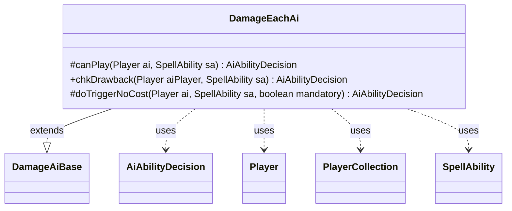

---
aliases:
  - DamageEachAi
tags:
  - java/class
  - module/forge-ai
  - pkg/forge/ai/ability
fqn: forge.ai.ability.DamageEachAi
package: forge.ai.ability
module: forge-ai
kind: Class
---

# DamageEachAi

**Package:** `forge.ai.ability` &nbsp; **Module:** `forge-ai` &nbsp; **Kind:** Class



## Relationships
**Extends:**
- [[forge.ai.ability.DamageAiBase|DamageAiBase]]
**Uses:**
- [[forge.ai.AiAbilityDecision|AiAbilityDecision]]
- [[forge.game.player.Player|Player]]
- [[forge.game.player.PlayerCollection|PlayerCollection]]
- [[forge.game.spellability.SpellAbility|SpellAbility]]

## Design Description

DamageEachAi supplies the AI decision logic for "deal damage to each" spell and ability effects, extending DamageAiBase to inherit shared damage-evaluation helpers such as `shouldTgtP`. As a casting-logic class, it implements the standard AI hooks—`canPlay`, `chkDrawback`, and `doTriggerNoCost`—each returning an AiAbilityDecision that pairs a confidence score with an AiPlayDecision verdict the engine consumes when choosing whether to cast.

Its core strategy collaborates with Player and PlayerCollection to filter targetable opponents and select the weakest by life, committing that target only when the opponent can actually lose life; otherwise it falls back to the inherited targeting heuristic for a computed damage amount. The design also accommodates special-case routing (e.g., delegating to SpecialCardAi for Sarkhan the Mad's ultimate) and treats mandatory triggers as unconditional plays, reflecting Forge's convention of separating optional evaluation from forced resolution.

## Source
`forge-ai/src/main/java/forge/ai/ability/DamageEachAi.java`

```java
package forge.ai.ability;


import forge.ai.AiAbilityDecision;
import forge.ai.AiPlayDecision;
import forge.ai.SpecialCardAi;
import forge.game.ability.AbilityUtils;
import forge.game.player.Player;
import forge.game.player.PlayerCollection;
import forge.game.player.PlayerPredicates;
import forge.game.spellability.SpellAbility;

public class DamageEachAi extends DamageAiBase {

    /* (non-Javadoc)
     * @see forge.card.abilityfactory.SpellAiLogic#canPlayAI(forge.game.player.Player, java.util.Map, forge.card.spellability.SpellAbility)
     */
    @Override
    protected AiAbilityDecision canPlay(Player ai, SpellAbility sa) {
        final String logic = sa.getParam("AILogic");

        PlayerCollection targetableOpps = ai.getOpponents().filter(PlayerPredicates.isTargetableBy(sa));
        Player weakestOpp = targetableOpps.min(PlayerPredicates.compareByLife());

        if (sa.usesTargeting() && weakestOpp != null) {
            if ("MadSarkhanUltimate".equals(logic) && !SpecialCardAi.SarkhanTheMad.considerUltimate(ai, sa, weakestOpp)) {
                return new AiAbilityDecision(0, AiPlayDecision.CantPlayAi);
            }
            sa.resetTargets();
            if (weakestOpp.canLoseLife() && !weakestOpp.cantLoseForZeroOrLessLife()) {
                sa.getTargets().add(weakestOpp);
                return new AiAbilityDecision(100, AiPlayDecision.WillPlay);
            }
        }
        
        final String damage = sa.getParam("NumDmg");
        final int iDmg = AbilityUtils.calculateAmount(sa.getHostCard(), damage, sa);

        if (shouldTgtP(ai, sa, iDmg, false)) {
            return new AiAbilityDecision(100, AiPlayDecision.WillPlay);
        }

        return new AiAbilityDecision(0, AiPlayDecision.CantPlayAi);
    }

    @Override
    public AiAbilityDecision chkDrawback(Player aiPlayer, SpellAbility sa) {
        // check AI life before playing this drawback?
        return new AiAbilityDecision(100, AiPlayDecision.WillPlay);
    }

    /* (non-Javadoc)
     * @see forge.card.abilityfactory.SpellAiLogic#doTriggerAINoCost(forge.game.player.Player, java.util.Map, forge.card.spellability.SpellAbility, boolean)
     */
    @Override
    protected AiAbilityDecision doTriggerNoCost(Player ai, SpellAbility sa, boolean mandatory) {
        if (mandatory) {
            return new AiAbilityDecision(100, AiPlayDecision.WillPlay);
        }

        return canPlay(ai, sa);
    }

}
```
