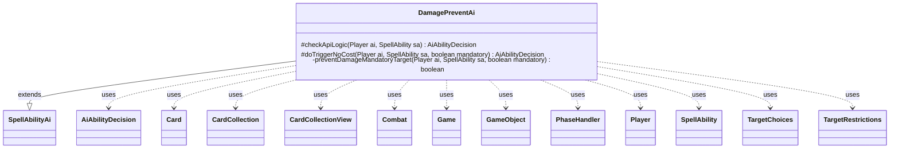

---
aliases:
  - DamagePreventAi
tags:
  - java/class
  - module/forge-ai
  - pkg/forge/ai/ability
fqn: forge.ai.ability.DamagePreventAi
package: forge.ai.ability
module: forge-ai
kind: Class
---

# DamagePreventAi

**Package:** `forge.ai.ability` &nbsp; **Module:** `forge-ai` &nbsp; **Kind:** Class



## Relationships
**Extends:**
- [[forge.ai.SpellAbilityAi|SpellAbilityAi]]
**Uses:**
- [[forge.ai.AiAbilityDecision|AiAbilityDecision]]
- [[forge.game.Game|Game]]
- [[forge.game.GameObject|GameObject]]
- [[forge.game.card.Card|Card]]
- [[forge.game.card.CardCollection|CardCollection]]
- [[forge.game.card.CardCollectionView|CardCollectionView]]
- [[forge.game.combat.Combat|Combat]]
- [[forge.game.phase.PhaseHandler|PhaseHandler]]
- [[forge.game.player.Player|Player]]
- [[forge.game.spellability.SpellAbility|SpellAbility]]
- [[forge.game.spellability.TargetChoices|TargetChoices]]
- [[forge.game.spellability.TargetRestrictions|TargetRestrictions]]

## Design Description

DamagePreventAi supplies the AI's decision logic for damage-prevention spells and abilities, extending `SpellAbilityAi` to override `checkApiLogic` (proactive activation) and `doTriggerNoCost` (forced/triggered resolution). Its responsibility is deciding whether playing a prevention effect is worthwhile and, when targeting is required, selecting the targets most worth protecting. It branches on game state: reacting to lethal threats on the stack via `ComputerUtil.predictThreatenedObjects`, and during the declare-blockers step consulting `Combat`, `PhaseHandler`, and `ComputerUtilCombat` to detect combatants that would die or life loss the AI should avoid. It returns its verdict as a scored `AiAbilityDecision`.

Notably, it collaborates heavily with the `ComputerUtil*` helpers and ranks candidates with `ComputerUtilCard.sortByEvaluateCreature`/`getBestCreatureAI` to save the most valuable creatures, handling divided-damage allocation and distinguishing mandatory from optional targeting so the AI never wastes prevention when no threat exists.

## Source
`forge-ai/src/main/java/forge/ai/ability/DamagePreventAi.java`

```java
package forge.ai.ability;

import forge.ai.*;
import forge.game.Game;
import forge.game.GameObject;
import forge.game.ability.AbilityUtils;
import forge.game.card.*;
import forge.game.combat.Combat;
import forge.game.phase.PhaseHandler;
import forge.game.phase.PhaseType;
import forge.game.player.Player;
import forge.game.spellability.SpellAbility;
import forge.game.spellability.TargetChoices;
import forge.game.spellability.TargetRestrictions;
import forge.game.zone.ZoneType;

import java.util.ArrayList;
import java.util.List;

public class DamagePreventAi extends SpellAbilityAi {

    @Override
    protected AiAbilityDecision checkApiLogic(Player ai, SpellAbility sa) {
        final Card hostCard = sa.getHostCard();
        final Game game = ai.getGame();
        final Combat combat = game.getCombat();
        boolean chance = false;

        final TargetRestrictions tgt = sa.getTargetRestrictions();
        if (tgt == null) {
            // As far as I can tell these Defined Cards will only have one of them
            final List<GameObject> objects = AbilityUtils.getDefinedObjects(hostCard, sa.getParam("Defined"), sa);

            // react to threats on the stack
            if (!game.getStack().isEmpty()) {
                final List<GameObject> threatenedObjects = ComputerUtil.predictThreatenedObjects(sa.getActivatingPlayer(), sa);
                for (final Object o : objects) {
                    if (threatenedObjects.contains(o)) {
                        chance = true;
                        break;
                    }
                }
            } else {
                PhaseHandler handler = game.getPhaseHandler();
                if (handler.is(PhaseType.COMBAT_DECLARE_BLOCKERS)) {
                    boolean flag = false;
                    for (final Object o : objects) {
                        if (o instanceof Card) {
                            flag = flag || ComputerUtilCombat.combatantWouldBeDestroyed(ai, (Card) o, combat);
                        } else if (o instanceof Player) {
                            // Don't need to worry about Combat Damage during AI's turn
                            final Player p = (Player) o;
                            if (!handler.isPlayerTurn(p)) {
                                flag = flag || (p == ai && ((ComputerUtilCombat.wouldLoseLife(ai, combat) && sa
                                        .isAbility()) || ComputerUtilCombat.lifeInDanger(ai, combat)));
                            }
                        }
                    }

                    chance = flag;
                } else { // if nothing on the stack, and it's not declare
                         // blockers. no need to prevent
                    return new AiAbilityDecision(0, AiPlayDecision.CantPlayAi);
                }
            }
        } // non-targeted

        // react to threats on the stack
        else if (!game.getStack().isEmpty()) {
            sa.resetTargets();
        	final TargetChoices tcs = sa.getTargets();
            // check stack for something on the stack will kill anything i control
            final List<GameObject> objects = ComputerUtil.predictThreatenedObjects(sa.getActivatingPlayer(), sa);

            if (objects.contains(ai) && sa.canTarget(ai)) {
            	tcs.add(ai);
                chance = true;
            }
            final List<Card> threatenedTargets = new ArrayList<>();
            // filter AIs battlefield by what I can target
            List<Card> targetables = CardLists.getTargetableCards(ai.getCardsIn(ZoneType.Battlefield), sa);

            for (final Card c : targetables) {
                if (objects.contains(c)) {
                    threatenedTargets.add(c);
                }
            }

            if (!threatenedTargets.isEmpty()) {
                // Choose "best" of the remaining to save
            	tcs.add(ComputerUtilCard.getBestCreatureAI(threatenedTargets));
                chance = true;
            }

        } // Protect combatants
        else if (game.getPhaseHandler().is(PhaseType.COMBAT_DECLARE_BLOCKERS)) {
            sa.resetTargets();
        	final TargetChoices tcs = sa.getTargets();
            if (sa.canTarget(ai) && ComputerUtilCombat.wouldLoseLife(ai, combat)
                    && (ComputerUtilCombat.lifeInDanger(ai, combat) || sa.isAbility() || sa.isTrigger())
                    // check if any of the incoming dmg is even preventable:
                    && (ComputerUtilCombat.sumDamageIfUnblocked(combat.getAttackers(), ai, true) > ai.getPreventNextDamageTotalShields())
                    && game.getPhaseHandler().getPlayerTurn().isOpponentOf(ai)) {
            	tcs.add(ai);
                chance = true;
            } else {
                // filter AIs battlefield by what I can target
                CardCollectionView targetables = ai.getCardsIn(ZoneType.Battlefield);
                targetables = CardLists.getValidCards(targetables, tgt.getValidTgts(), ai, hostCard, sa);
                targetables = CardLists.getTargetableCards(targetables, sa);

                if (targetables.isEmpty()) {
                    return new AiAbilityDecision(0, AiPlayDecision.TargetingFailed);
                }
                final CardCollection combatants = CardLists.filter(targetables, CardPredicates.CREATURES);
                ComputerUtilCard.sortByEvaluateCreature(combatants);

                for (final Card c : combatants) {
                    if (ComputerUtilCombat.combatantWouldBeDestroyed(ai, c, combat) && sa.canAddMoreTarget()) {
                    	tcs.add(c);
                        chance = true;
                    }
                }
            }
        }
        if (sa.usesTargeting() && sa.isDividedAsYouChoose() && !sa.getTargets().isEmpty()) {
            sa.addDividedAllocation(sa.getTargets().get(0), AbilityUtils.calculateAmount(hostCard, sa.getParam("Amount"), sa));
        }

        if (chance) {
            return new AiAbilityDecision(100, AiPlayDecision.WillPlay);
        } else {
            return new AiAbilityDecision(0, AiPlayDecision.CantPlayAi);
        }
    }

    @Override
    protected AiAbilityDecision doTriggerNoCost(Player ai, SpellAbility sa, boolean mandatory) {
        boolean chance = false;
        final TargetRestrictions tgt = sa.getTargetRestrictions();
        if (tgt == null) {
            // If there's no target on the trigger, just say yes.
            chance = true;
        } else {
            chance = preventDamageMandatoryTarget(ai, sa, mandatory);
        }

        if (chance) {
            return new AiAbilityDecision(100, AiPlayDecision.WillPlay);
        } else {
            return new AiAbilityDecision(0, AiPlayDecision.StopRunawayActivations);
        }
    }

    /**
     * <p>
     * preventDamageMandatoryTarget.
     * </p>
     *
     * @param sa
     *            a {@link forge.game.spellability.SpellAbility} object.
     * @param mandatory
     *            a boolean.
     * @return a boolean.
     */
    private boolean preventDamageMandatoryTarget(final Player ai, final SpellAbility sa, final boolean mandatory) {
        sa.resetTargets();
        // filter AIs battlefield by what I can target
        final Game game = ai.getGame();
        CardCollectionView targetables = game.getCardsIn(ZoneType.Battlefield);
        targetables = CardLists.getTargetableCards(targetables, sa);
        final List<Card> compTargetables = CardLists.filterControlledBy(targetables, ai);
        Card target = null;

        if (targetables.isEmpty()) {
            return false;
        }

        if (!mandatory && compTargetables.isEmpty()) {
            return false;
        }

        if (!compTargetables.isEmpty()) {
            final CardCollection combatants = CardLists.filter(compTargetables, CardPredicates.CREATURES);
            ComputerUtilCard.sortByEvaluateCreature(combatants);
            if (game.getPhaseHandler().is(PhaseType.COMBAT_DECLARE_BLOCKERS)) {
                Combat combat = game.getCombat();
                for (final Card c : combatants) {
                    if (ComputerUtilCombat.combatantWouldBeDestroyed(ai, c, combat)) {
                        target = c;
                        break;
                    }
                }
            }
            if (target == null) {
                target = combatants.get(0);
            }
        } else {
            target = ComputerUtilCard.getCheapestPermanentAI(targetables, sa, true);
        }
        sa.getTargets().add(target);
        if (sa.isDividedAsYouChoose()) {
            sa.addDividedAllocation(target, AbilityUtils.calculateAmount(sa.getHostCard(), sa.getParam("Amount"), sa));
        }
        return true;
    }

}
```

## Python
`forge/ai/ability/DamagePreventAi.py`

```python
from forge.ai.SpellAbilityAi import SpellAbilityAi
from forge.ai.AiAbilityDecision import AiAbilityDecision
from forge.ai.AiPlayDecision import AiPlayDecision
from forge.ai.ComputerUtil import ComputerUtil
from forge.ai.ComputerUtilCard import ComputerUtilCard
from forge.ai.ComputerUtilCombat import ComputerUtilCombat
from forge.game.Game import Game
from forge.game.GameObject import GameObject
from forge.game.ability.AbilityUtils import AbilityUtils
from forge.game.card.Card import Card
from forge.game.card.CardCollection import CardCollection
from forge.game.card.CardCollectionView import CardCollectionView
from forge.game.card.CardLists import CardLists
from forge.game.card.CardPredicates import CardPredicates
from forge.game.combat.Combat import Combat
from forge.game.phase.PhaseHandler import PhaseHandler
from forge.game.phase.PhaseType import PhaseType
from forge.game.player.Player import Player
from forge.game.spellability.SpellAbility import SpellAbility
from forge.game.spellability.TargetChoices import TargetChoices
from forge.game.spellability.TargetRestrictions import TargetRestrictions
from forge.game.zone.ZoneType import ZoneType


class DamagePreventAi(SpellAbilityAi):

    def checkApiLogic(self, ai: Player, sa: SpellAbility) -> AiAbilityDecision:
        hostCard = sa.getHostCard()
        game = ai.getGame()
        combat = game.getCombat()
        chance = False

        tgt = sa.getTargetRestrictions()
        if tgt is None:
            # As far as I can tell these Defined Cards will only have one of them
            objects = AbilityUtils.getDefinedObjects(hostCard, sa.getParam("Defined"), sa)

            # react to threats on the stack
            if not game.getStack().isEmpty():
                threatenedObjects = ComputerUtil.predictThreatenedObjects(sa.getActivatingPlayer(), sa)
                for o in objects:
                    if o in threatenedObjects:
                        chance = True
                        break
            else:
                handler = game.getPhaseHandler()
                if handler.is_(PhaseType.COMBAT_DECLARE_BLOCKERS):
                    flag = False
                    for o in objects:
                        if isinstance(o, Card):
                            flag = flag or ComputerUtilCombat.combatantWouldBeDestroyed(ai, o, combat)
                        elif isinstance(o, Player):
                            # Don't need to worry about Combat Damage during AI's turn
                            p = o
                            if not handler.isPlayerTurn(p):
                                flag = flag or (p == ai and ((ComputerUtilCombat.wouldLoseLife(ai, combat) and sa.isAbility()) or ComputerUtilCombat.lifeInDanger(ai, combat)))

                    chance = flag
                else:  # if nothing on the stack, and it's not declare
                       # blockers. no need to prevent
                    return AiAbilityDecision(0, AiPlayDecision.CantPlayAi)
        # non-targeted

        # react to threats on the stack
        elif not game.getStack().isEmpty():
            sa.resetTargets()
            tcs = sa.getTargets()
            # check stack for something on the stack will kill anything i control
            objects = ComputerUtil.predictThreatenedObjects(sa.getActivatingPlayer(), sa)

            if ai in objects and sa.canTarget(ai):
                tcs.add(ai)
                chance = True
            threatenedTargets = []
            # filter AIs battlefield by what I can target
            targetables = CardLists.getTargetableCards(ai.getCardsIn(ZoneType.Battlefield), sa)

            for c in targetables:
                if c in objects:
                    threatenedTargets.append(c)

            if threatenedTargets:
                # Choose "best" of the remaining to save
                tcs.add(ComputerUtilCard.getBestCreatureAI(threatenedTargets))
                chance = True

        # Protect combatants
        elif game.getPhaseHandler().is_(PhaseType.COMBAT_DECLARE_BLOCKERS):
            sa.resetTargets()
            tcs = sa.getTargets()
            if (sa.canTarget(ai) and ComputerUtilCombat.wouldLoseLife(ai, combat)
                    and (ComputerUtilCombat.lifeInDanger(ai, combat) or sa.isAbility() or sa.isTrigger())
                    # check if any of the incoming dmg is even preventable:
                    and (ComputerUtilCombat.sumDamageIfUnblocked(combat.getAttackers(), ai, True) > ai.getPreventNextDamageTotalShields())
                    and game.getPhaseHandler().getPlayerTurn().isOpponentOf(ai)):
                tcs.add(ai)
                chance = True
            else:
                # filter AIs battlefield by what I can target
                targetables = ai.getCardsIn(ZoneType.Battlefield)
                targetables = CardLists.getValidCards(targetables, tgt.getValidTgts(), ai, hostCard, sa)
                targetables = CardLists.getTargetableCards(targetables, sa)

                if targetables.isEmpty():
                    return AiAbilityDecision(0, AiPlayDecision.TargetingFailed)
                combatants = CardLists.filter(targetables, CardPredicates.CREATURES)
                ComputerUtilCard.sortByEvaluateCreature(combatants)

                for c in combatants:
                    if ComputerUtilCombat.combatantWouldBeDestroyed(ai, c, combat) and sa.canAddMoreTarget():
                        tcs.add(c)
                        chance = True

        if sa.usesTargeting() and sa.isDividedAsYouChoose() and not sa.getTargets().isEmpty():
            sa.addDividedAllocation(sa.getTargets().get(0), AbilityUtils.calculateAmount(hostCard, sa.getParam("Amount"), sa))

        if chance:
            return AiAbilityDecision(100, AiPlayDecision.WillPlay)
        else:
            return AiAbilityDecision(0, AiPlayDecision.CantPlayAi)

    def doTriggerNoCost(self, ai: Player, sa: SpellAbility, mandatory: bool) -> AiAbilityDecision:
        chance = False
        tgt = sa.getTargetRestrictions()
        if tgt is None:
            # If there's no target on the trigger, just say yes.
            chance = True
        else:
            chance = self.preventDamageMandatoryTarget(ai, sa, mandatory)

        if chance:
            return AiAbilityDecision(100, AiPlayDecision.WillPlay)
        else:
            return AiAbilityDecision(0, AiPlayDecision.StopRunawayActivations)

    def preventDamageMandatoryTarget(self, ai: Player, sa: SpellAbility, mandatory: bool) -> bool:
        sa.resetTargets()
        # filter AIs battlefield by what I can target
        game = ai.getGame()
        targetables = game.getCardsIn(ZoneType.Battlefield)
        targetables = CardLists.getTargetableCards(targetables, sa)
        compTargetables = CardLists.filterControlledBy(targetables, ai)
        target = None

        if targetables.isEmpty():
            return False

        if not mandatory and compTargetables.isEmpty():
            return False

        if not compTargetables.isEmpty():
            combatants = CardLists.filter(compTargetables, CardPredicates.CREATURES)
            ComputerUtilCard.sortByEvaluateCreature(combatants)
            if game.getPhaseHandler().is_(PhaseType.COMBAT_DECLARE_BLOCKERS):
                combat = game.getCombat()
                for c in combatants:
                    if ComputerUtilCombat.combatantWouldBeDestroyed(ai, c, combat):
                        target = c
                        break
            if target is None:
                target = combatants.get(0)
        else:
            target = ComputerUtilCard.getCheapestPermanentAI(targetables, sa, True)
        sa.getTargets().add(target)
        if sa.isDividedAsYouChoose():
            sa.addDividedAllocation(target, AbilityUtils.calculateAmount(sa.getHostCard(), sa.getParam("Amount"), sa))
        return True
```
