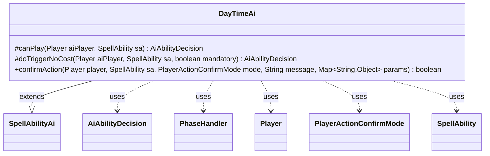

---
aliases:
  - DayTimeAi
tags:
  - java/class
  - module/forge-ai
  - pkg/forge/ai/ability
fqn: forge.ai.ability.DayTimeAi
package: forge.ai.ability
module: forge-ai
kind: Class
---

# DayTimeAi

**Package:** `forge.ai.ability` &nbsp; **Module:** `forge-ai` &nbsp; **Kind:** Class



## Relationships
**Extends:**
- [[forge.ai.SpellAbilityAi|SpellAbilityAi]]
**Uses:**
- [[forge.ai.AiAbilityDecision|AiAbilityDecision]]
- [[forge.game.phase.PhaseHandler|PhaseHandler]]
- [[forge.game.player.Player|Player]]
- [[forge.game.player.PlayerActionConfirmMode|PlayerActionConfirmMode]]
- [[forge.game.spellability.SpellAbility|SpellAbility]]

## Design Description

`DayTimeAi` is a specialized AI decision-maker for the Day/Night cycle ability in the Forge engine. Extending `SpellAbilityAi`, it overrides the standard hooks the AI framework uses to evaluate spells and abilities: `canPlay` decides whether the computer should activate the ability, `doTriggerNoCost` handles free triggered activations, and `confirmAction` answers yes/no prompts. Its responsibility is narrow—returning an `AiAbilityDecision` that scores and classifies each play opportunity.

The notable design intent lives in `canPlay`, which times the activation around cost. When activating carries a tap or mana cost, the AI consults the game's `PhaseHandler`: for instant-speed abilities it waits for the end step preceding its own turn, while sorcery-speed ones are held until its second main phase, otherwise deferring with `AnotherTime` or `CantPlayAi`. Cost-free activations and confirmations are always accepted, reflecting that flipping day/night is low-risk unless it commits resources at an inopportune moment.

## Source
`forge-ai/src/main/java/forge/ai/ability/DayTimeAi.java`

```java
package forge.ai.ability;

import forge.ai.AiAbilityDecision;
import forge.ai.AiPlayDecision;
import forge.ai.SpellAbilityAi;
import forge.game.phase.PhaseHandler;
import forge.game.phase.PhaseType;
import forge.game.player.Player;
import forge.game.player.PlayerActionConfirmMode;
import forge.game.spellability.SpellAbility;

import java.util.Map;

public class DayTimeAi extends SpellAbilityAi {
    @Override
    protected AiAbilityDecision canPlay(Player aiPlayer, SpellAbility sa) {
        PhaseHandler ph = aiPlayer.getGame().getPhaseHandler();

        if ((sa.getHostCard().isCreature() && sa.getPayCosts().hasTapCost()) || sa.getPayCosts().hasManaCost()) {
            // If it involves a cost that may put us at a disadvantage, better activate before own turn if possible
            if (!isSorcerySpeed(sa, aiPlayer)) {
                if (ph.is(PhaseType.END_OF_TURN) && ph.getNextTurn() == aiPlayer) {
                    return new AiAbilityDecision(100, AiPlayDecision.WillPlay);
                } else {
                    return new AiAbilityDecision(0, AiPlayDecision.AnotherTime);
                }
            } else {
                if (ph.is(PhaseType.MAIN2, aiPlayer)) {
                    return new AiAbilityDecision(100, AiPlayDecision.WillPlay);
                } else {
                    return new AiAbilityDecision(0, AiPlayDecision.CantPlayAi);
                }
            }
        }

        return new AiAbilityDecision(100, AiPlayDecision.WillPlay);

    }

    @Override
    protected AiAbilityDecision doTriggerNoCost(Player aiPlayer, SpellAbility sa, boolean mandatory) {
        return new AiAbilityDecision(100, AiPlayDecision.WillPlay);

    }

    @Override
    public boolean confirmAction(Player player, SpellAbility sa, PlayerActionConfirmMode mode, String message, Map<String, Object> params) {
        return true;
    }
}
```
