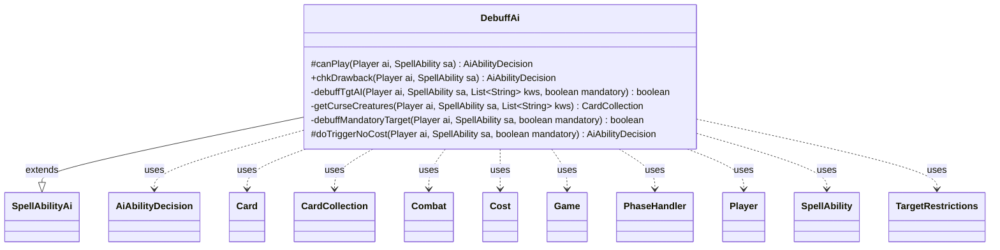

---
aliases:
  - DebuffAi
tags:
  - java/class
  - module/forge-ai
  - pkg/forge/ai/ability
fqn: forge.ai.ability.DebuffAi
package: forge.ai.ability
module: forge-ai
kind: Class
---

# DebuffAi

**Package:** `forge.ai.ability` &nbsp; **Module:** `forge-ai` &nbsp; **Kind:** Class



## Relationships
**Extends:**
- [[forge.ai.SpellAbilityAi|SpellAbilityAi]]
**Uses:**
- [[forge.ai.AiAbilityDecision|AiAbilityDecision]]
- [[forge.game.Game|Game]]
- [[forge.game.card.Card|Card]]
- [[forge.game.card.CardCollection|CardCollection]]
- [[forge.game.combat.Combat|Combat]]
- [[forge.game.cost.Cost|Cost]]
- [[forge.game.phase.PhaseHandler|PhaseHandler]]
- [[forge.game.player.Player|Player]]
- [[forge.game.spellability.SpellAbility|SpellAbility]]
- [[forge.game.spellability.TargetRestrictions|TargetRestrictions]]

## Design Description

Beyond targeting, `DebuffAi` is a `SpellAbilityAi` subclass that drives the AI's decision-making for "debuff" effects—spells and abilities that strip keywords (typically evasion such as Flying, Horsemanship, or Shadow, or protective keywords like Indestructible and Persist) from creatures. It overrides the standard AI hooks—`canPlay`, `chkDrawback`, and `doTriggerNoCost`—to decide when activation is worthwhile, layering in cost checks (sacrifice, life, counter removal via `ComputerUtilCost`) and phase restrictions that confine instant-speed use to combat.

Its private helpers encode the core intent: `getCurseCreatures` collects an opponent's targetable creatures that actually bear the keywords being removed (avoiding wasted, duplicate debuffs), `debuffTgtAI` greedily picks the best such creatures via `ComputerUtilCard`, and `debuffMandatoryTarget` handles forced-targeting fallbacks, preferring opponents' permanents but conceding own-controlled ones when required. It collaborates with `Game`, `PhaseHandler`, and `Combat` to time decisions around the combat phase, and returns `AiAbilityDecision` verdicts throughout.

## Source
`forge-ai/src/main/java/forge/ai/ability/DebuffAi.java`

```java
package forge.ai.ability;

import com.google.common.collect.Lists;
import forge.ai.*;
import forge.game.Game;
import forge.game.ability.AbilityUtils;
import forge.game.card.Card;
import forge.game.card.CardCollection;
import forge.game.card.CardLists;
import forge.game.card.CardUtil;
import forge.game.combat.Combat;
import forge.game.cost.Cost;
import forge.game.phase.PhaseHandler;
import forge.game.phase.PhaseType;
import forge.game.player.Player;
import forge.game.spellability.SpellAbility;
import forge.game.spellability.TargetRestrictions;

import java.util.ArrayList;
import java.util.Arrays;
import java.util.List;

public class DebuffAi extends SpellAbilityAi {

    @Override
    protected AiAbilityDecision canPlay(final Player ai, final SpellAbility sa) {
        // if there is no target and host card isn't in play, don't activate
        final Card source = sa.getHostCard();
        final Game game = ai.getGame(); 
        if (!sa.usesTargeting() && !source.isInPlay()) {
            return new AiAbilityDecision(0, AiPlayDecision.CantPlayAi);
        }

        final Cost cost = sa.getPayCosts();

        // temporarily disabled until AI is improved
        if (!ComputerUtilCost.checkCreatureSacrificeCost(ai, cost, source, sa)) {
            return new AiAbilityDecision(0, AiPlayDecision.CantAfford);
        }

        if (!ComputerUtilCost.checkLifeCost(ai, cost, source, 40, sa)) {
            return new AiAbilityDecision(0, AiPlayDecision.CantAfford);
        }

        if (!ComputerUtilCost.checkRemoveCounterCost(cost, source, sa)) {
            return new AiAbilityDecision(0, AiPlayDecision.CantAfford);
        }

        final PhaseHandler ph =  game.getPhaseHandler();

        // Phase Restrictions
        if (ph.getPhase().isBefore(PhaseType.COMBAT_DECLARE_ATTACKERS)
                || ph.getPhase().isAfter(PhaseType.COMBAT_DECLARE_BLOCKERS)
                || !game.getStack().isEmpty()) {
            // Instant-speed pumps should not be cast outside of combat when the
            // stack is empty, unless there are specific activation phase requirements
            if (!isSorcerySpeed(sa, ai) && !sa.hasParam("ActivationPhases")) {
                return new AiAbilityDecision(0, AiPlayDecision.AnotherTime);
            }
        }

        if (!sa.usesTargeting()) {
            List<Card> cards = AbilityUtils.getDefinedCards(source, sa.getParam("Defined"), sa);

            final Combat combat = game.getCombat();
            if (cards.stream().anyMatch(c -> {
                if (c.getController().equals(sa.getActivatingPlayer()) || combat == null)
                    return false;

                if (!combat.isBlocking(c) && !combat.isAttacking(c)) {
                    return false;
                }
                // don't add duplicate negative keywords
                return sa.hasParam("Keywords") && c.hasAnyKeyword(Arrays.asList(sa.getParam("Keywords").split(" & ")));
            })) {
                return new AiAbilityDecision(100, AiPlayDecision.WillPlay);
            } else {
                return new AiAbilityDecision(0, AiPlayDecision.CantPlayAi);
            }
        } else {
            if (debuffTgtAI(ai, sa, sa.hasParam("Keywords") ? Arrays.asList(sa.getParam("Keywords").split(" & ")) : null, false)) {
                return new AiAbilityDecision(100, AiPlayDecision.WillPlay);
            } else {
                return new AiAbilityDecision(0, AiPlayDecision.TargetingFailed);
            }
        }
    }

    @Override
    public AiAbilityDecision chkDrawback(Player ai, SpellAbility sa) {
        if (!sa.usesTargeting()) {
            // TODO - copied from AF_Pump.pumpDrawbackAI() - what should be here?
        } else {
            if (debuffTgtAI(ai, sa, sa.hasParam("Keywords") ? Arrays.asList(sa.getParam("Keywords").split(" & ")) : null, false)) {
                return new AiAbilityDecision(100, AiPlayDecision.WillPlay);
            } else {
                return new AiAbilityDecision(0, AiPlayDecision.TargetingFailed);
            }
        }

        return new AiAbilityDecision(100, AiPlayDecision.WillPlay);

    } // debuffDrawbackAI()

    /**
     * <p>
     * debuffTgtAI.
     * </p>
     *
     * @param sa
     *            a {@link forge.game.spellability.SpellAbility} object.
     * @param kws
     *            a {@link java.util.ArrayList} object.
     * @param mandatory
     *            a boolean.
     * @return a boolean.
     */
    private boolean debuffTgtAI(final Player ai, final SpellAbility sa, final List<String> kws, final boolean mandatory) {
        // this would be for evasive things like Flying, Unblockable, etc
        if (!mandatory && ai.getGame().getPhaseHandler().getPhase().isAfter(PhaseType.COMBAT_DECLARE_BLOCKERS)) {
            return false;
        }

        final TargetRestrictions tgt = sa.getTargetRestrictions();
        sa.resetTargets();
        CardCollection list = getCurseCreatures(ai, sa, kws == null ? Lists.newArrayList() : kws);

        // several uses here:
        // 1. make human creatures lose evasion when they are attacking
        // 2. make human creatures lose Flying/Horsemanship/Shadow/etc. when
        // Comp is attacking
        // 3. remove Indestructible keyword so it can be destroyed?
        // 3a. remove Persist?

        if (list.isEmpty()) {
            return mandatory && debuffMandatoryTarget(ai, sa, mandatory);
        }

        while (sa.canAddMoreTarget()) {
            Card t = null;

            if (list.isEmpty()) {
                if (sa.getTargets().size() < sa.getMinTargets() || sa.getTargets().size() == 0) {
                    if (mandatory) {
                        return debuffMandatoryTarget(ai, sa, mandatory);
                    }

                    sa.resetTargets();
                    return false;
                } else {
                    // TODO is this good enough? for up to amounts?
                    break;
                }
            }

            t = ComputerUtilCard.getBestCreatureAI(list);
            sa.getTargets().add(t);
            list.remove(t);
        }

        return true;
    } // pumpTgtAI()

    /**
     * <p>
     * getCurseCreatures.
     * </p>
     *
     * @param sa
     *            a {@link forge.game.spellability.SpellAbility} object.
     * @param kws
     *            a {@link java.util.ArrayList} object.
     * @return a CardCollection.
     */
    private CardCollection getCurseCreatures(final Player ai, final SpellAbility sa, final List<String> kws) {
        final Player opp = AiAttackController.choosePreferredDefenderPlayer(ai);
        CardCollection list = CardLists.getTargetableCards(opp.getCreaturesInPlay(), sa);
        if (!list.isEmpty()) {
            list = CardLists.filter(list, c -> {
                return c.hasAnyKeyword(kws); // don't add duplicate negative keywords
            });
        }
        return list;
    }

    /**
     * <p>
     * debuffMandatoryTarget.
     * </p>
     *
     * @param sa
     *            a {@link forge.game.spellability.SpellAbility} object.
     * @param mandatory
     *            a boolean.
     * @return a boolean.
     */
    private boolean debuffMandatoryTarget(final Player ai, final SpellAbility sa, final boolean mandatory) {
        List<Card> list = CardUtil.getValidCardsToTarget(sa);

        if (list.size() < sa.getMinTargets()) {
            sa.resetTargets();
            return false;
        }

        final CardCollection pref = CardLists.filterControlledBy(list, ai.getOpponents());
        final CardCollection forced = CardLists.filterControlledBy(list, ai);
        final Card source = sa.getHostCard();

        while (sa.canAddMoreTarget()) {
            if (pref.isEmpty()) {
                break;
            }

            Card c = ComputerUtilCard.getBestAI(pref);
            pref.remove(c);
            sa.getTargets().add(c);
        }

        while (!sa.isMinTargetChosen()) {
            if (forced.isEmpty()) {
                break;
            }

            // TODO - if forced targeting, just pick something without the given keyword
            Card c;
            if (CardLists.getNotType(forced, "Creature").size() == 0) {
                c = ComputerUtilCard.getWorstCreatureAI(forced);
            } else {
                c = ComputerUtilCard.getCheapestPermanentAI(forced, sa, false);
            }

            forced.remove(c);

            sa.getTargets().add(c);
        }

        if (!sa.isMinTargetChosen()) {
            sa.resetTargets();
            return false;
        }

        return true;
    }

    @Override
    protected AiAbilityDecision doTriggerNoCost(Player ai, SpellAbility sa, boolean mandatory) {
        final List<String> kws = sa.hasParam("Keywords") ? Arrays.asList(sa.getParam("Keywords").split(" & ")) : new ArrayList<>();

        if (!sa.usesTargeting()) {
            if (mandatory) {
                return new AiAbilityDecision(100, AiPlayDecision.WillPlay);

            }
        } else {
            if (debuffTgtAI(ai, sa, kws, mandatory)) {
                return new AiAbilityDecision(100, AiPlayDecision.WillPlay);
            } else {
                return new AiAbilityDecision(0, AiPlayDecision.TargetingFailed);
            }
        }

        return new AiAbilityDecision(100, AiPlayDecision.WillPlay);

    }

}
```
