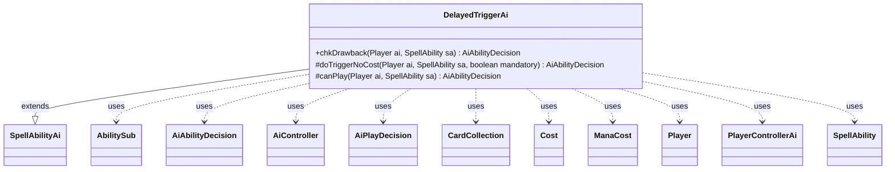

---
aliases:
  - DelayedTriggerAi
tags:
  - java/class
  - module/forge-ai
  - pkg/forge/ai/ability
fqn: forge.ai.ability.DelayedTriggerAi
package: forge.ai.ability
module: forge-ai
kind: Class
---

# DelayedTriggerAi

**Package:** `forge.ai.ability`   **Module:** `forge-ai`   **Kind:** Class



## Relationships
**Extends:**
- [[forge.ai.SpellAbilityAi|SpellAbilityAi]]
**Uses:**
- [[forge.ai.AiAbilityDecision|AiAbilityDecision]]
- [[forge.ai.AiController|AiController]]
- [[forge.ai.AiPlayDecision|AiPlayDecision]]
- [[forge.ai.PlayerControllerAi|PlayerControllerAi]]
- [[forge.card.mana.ManaCost|ManaCost]]
- [[forge.game.card.CardCollection|CardCollection]]
- [[forge.game.cost.Cost|Cost]]
- [[forge.game.player.Player|Player]]
- [[forge.game.spellability.AbilitySub|AbilitySub]]
- [[forge.game.spellability.SpellAbility|SpellAbility]]

## Design Description

DelayedTriggerAi supplies the AI's decision logic for the DelayedTrigger ability API, extending `SpellAbilityAi` to override `chkDrawback`, `doTriggerNoCost`, and `canPlay`. Its core responsibility is to evaluate whether the AI should schedule a delayed trigger, primarily by resolving the nested "Execute" sub-ability and delegating the real judgment back through `PlayerControllerAi`/`AiController`—either recursively via `chkDrawbackWithSubs` for `AbilitySub` payloads or through `canPlaySa`/`doTrigger`. Decisions are returned as `AiAbilityDecision` values pairing a score with an `AiPlayDecision`.

The class is notably card-specific: `canPlay` branches on an `AILogic` parameter to handle special cases like `SpellCopy`, `NarsetRebound`, and `SaveCreature`, scanning hand or battlefield via `CardCollection`/`CardLists` and checking affordability with combined `ManaCost`/`Cost` calculations. Guards against infinite recursion (skipping copy-of-copy and re-entrant mana abilities) reveal deliberate intent to keep the AI's lookahead bounded and tractable.

## Source
`forge-ai/src/main/java/forge/ai/ability/DelayedTriggerAi.java`

```java
package forge.ai.ability;

import forge.ai.*;
import forge.card.mana.ManaCost;
import forge.game.ability.ApiType;
import forge.game.card.CardCollection;
import forge.game.card.CardLists;
import forge.game.cost.Cost;
import forge.game.keyword.Keyword;
import forge.game.player.Player;
import forge.game.spellability.AbilitySub;
import forge.game.spellability.SpellAbility;
import forge.game.zone.ZoneType;

public class DelayedTriggerAi extends SpellAbilityAi {

    @Override
    public AiAbilityDecision chkDrawback(Player ai, SpellAbility sa) {
        if ("Always".equals(sa.getParam("AILogic"))) {
            return new AiAbilityDecision(100, AiPlayDecision.WillPlay);
        }
        SpellAbility trigsa = sa.getAdditionalAbility("Execute");
        if (trigsa == null) {
            return new AiAbilityDecision(0, AiPlayDecision.CantPlayAi);
        }
        trigsa.setActivatingPlayer(ai);

        if (trigsa instanceof AbilitySub) {
            return SpellApiToAi.Converter.get(trigsa).chkDrawbackWithSubs(ai, (AbilitySub)trigsa);
        } else {
            AiPlayDecision decision = ((PlayerControllerAi)ai.getController()).getAi().canPlaySa(trigsa);
            if (decision == AiPlayDecision.WillPlay) {
                return new AiAbilityDecision(100, AiPlayDecision.WillPlay);
            } else {
                return new AiAbilityDecision(0, AiPlayDecision.CantPlayAi);
            }
        }
    }

    @Override
    protected AiAbilityDecision doTriggerNoCost(Player ai, SpellAbility sa, boolean mandatory) {
        SpellAbility trigsa = sa.getAdditionalAbility("Execute");
        if (trigsa == null) {
            return new AiAbilityDecision(0, AiPlayDecision.CantPlayAi);
        }

        AiController aic = ((PlayerControllerAi)ai.getController()).getAi();
        trigsa.setActivatingPlayer(ai);

        if (!sa.hasParam("OptionalDecider")) {
            if (aic.doTrigger(trigsa, true)) {
                // If the trigger is mandatory, we can play it
                return new AiAbilityDecision(100, AiPlayDecision.WillPlay);
            } else {
                return new AiAbilityDecision(0, AiPlayDecision.CantPlayAi);
            }
        } else {
            if (aic.doTrigger(trigsa, !sa.getParam("OptionalDecider").equals("You"))) {
                return new AiAbilityDecision(100, AiPlayDecision.WillPlay);
            } else {
                return new AiAbilityDecision(0, AiPlayDecision.CantPlayAi);
            }
        }
    }

    @Override
    protected AiAbilityDecision canPlay(Player ai, SpellAbility sa) {
        // Card-specific logic
        String logic = sa.getParamOrDefault("AILogic", "");
        if (logic.equals("SpellCopy")) {
            // fetch Instant or Sorcery and AI has reason to play this turn
            // does not try to get itself
            final ManaCost costSa = sa.getPayCosts().getTotalMana();
            final int count = CardLists.count(ai.getCardsIn(ZoneType.Hand), c -> {
                if (!(c.isInstant() || c.isSorcery()) || c.equals(sa.getHostCard())) {
                    return false;
                }
                for (SpellAbility ab : c.getSpellAbilities()) {
                    if (ComputerUtilAbility.getAbilitySourceName(sa).equals(ComputerUtilAbility.getAbilitySourceName(ab))
                            || ab.hasParam("AINoRecursiveCheck")) {
                        // prevent infinitely recursing mana ritual and other abilities with reentry
                        continue;
                    } else if ("SpellCopy".equals(ab.getParam("AILogic")) && ab.getApi() == ApiType.DelayedTrigger) {
                        // don't copy another copy spell, too complex for the AI
                        continue;
                    }
                    if (!ab.canPlay()) {
                        continue;
                    }
                    AiPlayDecision decision = ((PlayerControllerAi)ai.getController()).getAi().canPlaySa(ab);
                    // see if we can pay both for this spell and for the Effect spell we're considering
                    if (decision == AiPlayDecision.WillPlay || decision == AiPlayDecision.WaitForMain2) {
                        ManaCost costAb = ab.getPayCosts().getTotalMana();
                        ManaCost total = ManaCost.combine(costSa, costAb);
                        SpellAbility combinedAb = ab.copyWithDefinedCost(new Cost(total, false));
                        // can we pay both costs?
                        if (ComputerUtilMana.canPayManaCost(combinedAb, ai, 0, true)) {
                            return true;
                        }
                    }
                }
                return false;
            });

            if (count == 0) {
                return new AiAbilityDecision(0, AiPlayDecision.CantPlayAi);
            }
            return new AiAbilityDecision(100, AiPlayDecision.WillPlay);
        } else if (logic.equals("NarsetRebound")) {
            // should be done in Main2, but it might broke for other cards
            //if (phase.getPhase().isBefore(PhaseType.MAIN2)) {
            //    return false;
            //}

            // fetch Instant or Sorcery without Rebound and AI has reason to play this turn
            // only need count, not the list
            final int count = CardLists.count(ai.getCardsIn(ZoneType.Hand), c -> {
                if (!(c.isInstant() || c.isSorcery()) || c.hasKeyword(Keyword.REBOUND)) {
                    return false;
                }
                for (SpellAbility ab : c.getSpellAbilities()) {
                    if (ComputerUtilAbility.getAbilitySourceName(sa).equals(ComputerUtilAbility.getAbilitySourceName(ab))
                            || ab.hasParam("AINoRecursiveCheck")) {
                        // prevent infinitely recursing mana ritual and other abilities with reentry
                        continue;
                    }
                    if (!ab.canPlay()) {
                        continue;
                    }
                    AiPlayDecision decision = ((PlayerControllerAi) ai.getController()).getAi().canPlaySa(ab);
                    if (decision == AiPlayDecision.WillPlay || decision == AiPlayDecision.WaitForMain2) {
                        if (ComputerUtilMana.canPayManaCost(ab, ai, 0, true)) {
                            return true;
                        }
                    }
                }
                return false;
            });

            if (count == 0) {
                return new AiAbilityDecision(0, AiPlayDecision.CantPlayAi);
            }

            return new AiAbilityDecision(100, AiPlayDecision.WillPlay);
        } else if (logic.equals("SaveCreature")) {
            CardCollection ownCreatures = ai.getCreaturesInPlay();

            ownCreatures = CardLists.filter(ownCreatures, card -> {
                if (ComputerUtilCard.isUselessCreature(ai, card)) {
                    return false;
                }

                return ComputerUtil.predictCreatureWillDieThisTurn(ai, card, sa);
            });

            if (!ownCreatures.isEmpty()) {
                sa.getTargets().add(ComputerUtilCard.getBestAI(ownCreatures));
                return new AiAbilityDecision(100, AiPlayDecision.WillPlay);
            }

            return new AiAbilityDecision(0, AiPlayDecision.TargetingFailed);
        }

        // Generic logic
        SpellAbility trigsa = sa.getAdditionalAbility("Execute");
        if (trigsa == null) {
            return new AiAbilityDecision(0, AiPlayDecision.CantPlayAi);
        }
        trigsa.setActivatingPlayer(ai);

        AiPlayDecision decision = ((PlayerControllerAi)ai.getController()).getAi().canPlaySa(trigsa);
        if (decision == AiPlayDecision.WillPlay) {
            return new AiAbilityDecision(100, AiPlayDecision.WillPlay);
        } else {
            return new AiAbilityDecision(0, AiPlayDecision.CantPlayAi);
        }
    }

}
```

## Python
`forge/ai/ability/DelayedTriggerAi.py`

```python
from forge.ai.SpellAbilityAi import SpellAbilityAi
from forge.ai.AiAbilityDecision import AiAbilityDecision
from forge.ai.AiPlayDecision import AiPlayDecision
from forge.ai.AiController import AiController
from forge.ai.PlayerControllerAi import PlayerControllerAi
from forge.ai.SpellApiToAi import SpellApiToAi
from forge.ai.ComputerUtil import ComputerUtil
from forge.ai.ComputerUtilAbility import ComputerUtilAbility
from forge.ai.ComputerUtilCard import ComputerUtilCard
from forge.ai.ComputerUtilMana import ComputerUtilMana
from forge.card.mana.ManaCost import ManaCost
from forge.game.ability.ApiType import ApiType
from forge.game.card.CardCollection import CardCollection
from forge.game.card.CardLists import CardLists
from forge.game.cost.Cost import Cost
from forge.game.keyword.Keyword import Keyword
from forge.game.player.Player import Player
from forge.game.spellability.AbilitySub import AbilitySub
from forge.game.spellability.SpellAbility import SpellAbility
from forge.game.zone.ZoneType import ZoneType


class DelayedTriggerAi(SpellAbilityAi):

    def chkDrawback(self, ai: Player, sa: SpellAbility) -> AiAbilityDecision:
        if "Always" == sa.getParam("AILogic"):
            return AiAbilityDecision(100, AiPlayDecision.WillPlay)
        trigsa = sa.getAdditionalAbility("Execute")
        if trigsa is None:
            return AiAbilityDecision(0, AiPlayDecision.CantPlayAi)
        trigsa.setActivatingPlayer(ai)

        if isinstance(trigsa, AbilitySub):
            return SpellApiToAi.Converter.get(trigsa).chkDrawbackWithSubs(ai, trigsa)
        else:
            decision = ai.getController().getAi().canPlaySa(trigsa)
            if decision == AiPlayDecision.WillPlay:
                return AiAbilityDecision(100, AiPlayDecision.WillPlay)
            else:
                return AiAbilityDecision(0, AiPlayDecision.CantPlayAi)

    def doTriggerNoCost(self, ai: Player, sa: SpellAbility, mandatory: bool) -> AiAbilityDecision:
        trigsa = sa.getAdditionalAbility("Execute")
        if trigsa is None:
            return AiAbilityDecision(0, AiPlayDecision.CantPlayAi)

        aic = ai.getController().getAi()
        trigsa.setActivatingPlayer(ai)

        if not sa.hasParam("OptionalDecider"):
            if aic.doTrigger(trigsa, True):
                # If the trigger is mandatory, we can play it
                return AiAbilityDecision(100, AiPlayDecision.WillPlay)
            else:
                return AiAbilityDecision(0, AiPlayDecision.CantPlayAi)
        else:
            if aic.doTrigger(trigsa, sa.getParam("OptionalDecider") != "You"):
                return AiAbilityDecision(100, AiPlayDecision.WillPlay)
            else:
                return AiAbilityDecision(0, AiPlayDecision.CantPlayAi)

    def canPlay(self, ai: Player, sa: SpellAbility) -> AiAbilityDecision:
        # Card-specific logic
        logic = sa.getParamOrDefault("AILogic", "")
        if logic == "SpellCopy":
            # fetch Instant or Sorcery and AI has reason to play this turn
            # does not try to get itself
            costSa = sa.getPayCosts().getTotalMana()

            def spellCopyPred(c):
                if not (c.isInstant() or c.isSorcery()) or c.equals(sa.getHostCard()):
                    return False
                for ab in c.getSpellAbilities():
                    if (ComputerUtilAbility.getAbilitySourceName(sa) == ComputerUtilAbility.getAbilitySourceName(ab)
                            or ab.hasParam("AINoRecursiveCheck")):
                        # prevent infinitely recursing mana ritual and other abilities with reentry
                        continue
                    elif "SpellCopy" == ab.getParam("AILogic") and ab.getApi() == ApiType.DelayedTrigger:
                        # don't copy another copy spell, too complex for the AI
                        continue
                    if not ab.canPlay():
                        continue
                    decision = ai.getController().getAi().canPlaySa(ab)
                    # see if we can pay both for this spell and for the Effect spell we're considering
                    if decision == AiPlayDecision.WillPlay or decision == AiPlayDecision.WaitForMain2:
                        costAb = ab.getPayCosts().getTotalMana()
                        total = ManaCost.combine(costSa, costAb)
                        combinedAb = ab.copyWithDefinedCost(Cost(total, False))
                        # can we pay both costs?
                        if ComputerUtilMana.canPayManaCost(combinedAb, ai, 0, True):
                            return True
                return False

            count = CardLists.count(ai.getCardsIn(ZoneType.Hand), spellCopyPred)

            if count == 0:
                return AiAbilityDecision(0, AiPlayDecision.CantPlayAi)
            return AiAbilityDecision(100, AiPlayDecision.WillPlay)
        elif logic == "NarsetRebound":
            # should be done in Main2, but it might broke for other cards
            # if (phase.getPhase().isBefore(PhaseType.MAIN2)) {
            #     return false;
            # }

            # fetch Instant or Sorcery without Rebound and AI has reason to play this turn
            # only need count, not the list
            def narsetReboundPred(c):
                if not (c.isInstant() or c.isSorcery()) or c.hasKeyword(Keyword.REBOUND):
                    return False
                for ab in c.getSpellAbilities():
                    if (ComputerUtilAbility.getAbilitySourceName(sa) == ComputerUtilAbility.getAbilitySourceName(ab)
                            or ab.hasParam("AINoRecursiveCheck")):
                        # prevent infinitely recursing mana ritual and other abilities with reentry
                        continue
                    if not ab.canPlay():
                        continue
                    decision = ai.getController().getAi().canPlaySa(ab)
                    if decision == AiPlayDecision.WillPlay or decision == AiPlayDecision.WaitForMain2:
                        if ComputerUtilMana.canPayManaCost(ab, ai, 0, True):
                            return True
                return False

            count = CardLists.count(ai.getCardsIn(ZoneType.Hand), narsetReboundPred)

            if count == 0:
                return AiAbilityDecision(0, AiPlayDecision.CantPlayAi)

            return AiAbilityDecision(100, AiPlayDecision.WillPlay)
        elif logic == "SaveCreature":
            ownCreatures = ai.getCreaturesInPlay()

            def saveCreaturePred(card):
                if ComputerUtilCard.isUselessCreature(ai, card):
                    return False
                return ComputerUtil.predictCreatureWillDieThisTurn(ai, card, sa)

            ownCreatures = CardLists.filter(ownCreatures, saveCreaturePred)

            if not ownCreatures.isEmpty():
                sa.getTargets().add(ComputerUtilCard.getBestAI(ownCreatures))
                return AiAbilityDecision(100, AiPlayDecision.WillPlay)

            return AiAbilityDecision(0, AiPlayDecision.TargetingFailed)

        # Generic logic
        trigsa = sa.getAdditionalAbility("Execute")
        if trigsa is None:
            return AiAbilityDecision(0, AiPlayDecision.CantPlayAi)
        trigsa.setActivatingPlayer(ai)

        decision = ai.getController().getAi().canPlaySa(trigsa)
        if decision == AiPlayDecision.WillPlay:
            return AiAbilityDecision(100, AiPlayDecision.WillPlay)
        else:
            return AiAbilityDecision(0, AiPlayDecision.CantPlayAi)
```
