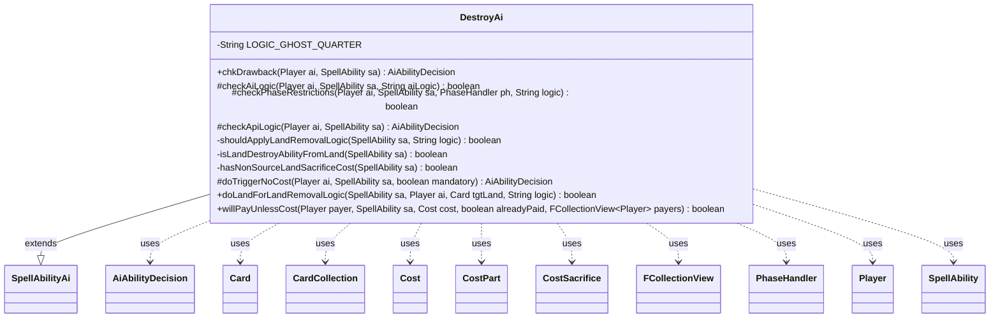

---
aliases:
  - DestroyAi
tags:
  - java/class
  - module/forge-ai
  - pkg/forge/ai/ability
fqn: forge.ai.ability.DestroyAi
package: forge.ai.ability
module: forge-ai
kind: Class
---

# DestroyAi

**Package:** `forge.ai.ability`   **Module:** `forge-ai`   **Kind:** Class



## Relationships
**Extends:**
- [[forge.ai.SpellAbilityAi|SpellAbilityAi]]
**Uses:**
- [[forge.ai.AiAbilityDecision|AiAbilityDecision]]
- [[forge.game.card.Card|Card]]
- [[forge.game.card.CardCollection|CardCollection]]
- [[forge.game.cost.Cost|Cost]]
- [[forge.game.cost.CostPart|CostPart]]
- [[forge.game.cost.CostSacrifice|CostSacrifice]]
- [[forge.game.phase.PhaseHandler|PhaseHandler]]
- [[forge.game.player.Player|Player]]
- [[forge.game.spellability.SpellAbility|SpellAbility]]
- [[forge.util.collect.FCollectionView|FCollectionView]]

## Design Description

DestroyAi is the forge-ai decision-making handler for the "Destroy" ability API, deciding when and how the computer player should cast or activate spells and abilities that destroy permanents. Extending SpellAbilityAi, it overrides the framework hooks — `checkAiLogic`, `checkApiLogic`, `checkPhaseRestrictions`, `doTriggerNoCost`, `chkDrawback`, and `willPayUnlessCost` — and returns AiAbilityDecision verdicts that signal both willingness to play and a confidence score. It collaborates with the game model (Card, CardCollection, Player, PhaseHandler, SpellAbility) and the cost system (Cost, CostPart, CostSacrifice) to build and validate target lists.

Its design intent is to encode pragmatic targeting heuristics: it filters out indestructible, regenerating, shield-counter, undying, and sacrifice-protected targets, prioritizes opponents' best removable creatures or lands, and avoids destroying its own permanents unless logic dictates. Named AI-logic strings (Polymorph, Pongify, GhostQuarter, OppDestroyYours) and AI-profile properties drive specialized behavior, notably an elaborate land-destruction routine weighing tempo, mana-locking, and color-locking before spending Strip Mine–style costs.

## Source
`forge-ai/src/main/java/forge/ai/ability/DestroyAi.java`

```java
package forge.ai.ability;

import java.util.function.Predicate;

import forge.ai.*;
import forge.game.ability.AbilityUtils;
import forge.game.ability.ApiType;
import forge.game.card.*;
import forge.game.cost.Cost;
import forge.game.cost.CostPart;
import forge.game.cost.CostSacrifice;
import forge.game.keyword.Keyword;
import forge.game.phase.PhaseHandler;
import forge.game.phase.PhaseType;
import forge.game.player.Player;
import forge.game.spellability.SpellAbility;
import forge.game.staticability.StaticAbilityMustTarget;
import forge.game.zone.ZoneType;
import forge.util.collect.FCollectionView;

public class DestroyAi extends SpellAbilityAi {
    private static final String LOGIC_GHOST_QUARTER = "GhostQuarter";

    @Override
    public AiAbilityDecision chkDrawback(Player ai, SpellAbility sa) {
        return checkApiLogic(ai, sa);
    }

    @Override
    protected boolean checkAiLogic(final Player ai, final SpellAbility sa, final String aiLogic) {
        final Card source = sa.getHostCard();
        if (sa.usesTargeting()) {
            sa.resetTargets();
            if (aiLogic.startsWith("MinLoyalty.")) {
                int minLoyalty = Integer.parseInt(aiLogic.substring(aiLogic.indexOf(".") + 1));
                if (source.getCounters(CounterEnumType.LOYALTY) < minLoyalty) {
                    return false;
                }
            } else if ("Polymorph".equals(aiLogic)) {
                CardCollection list = CardLists.getTargetableCards(ai.getCardsIn(ZoneType.Battlefield), sa);
                if (list.isEmpty()) {
                    return false;
                }
                for (Card c : list) {
                    if (c.hasKeyword(Keyword.INDESTRUCTIBLE)) {
                        sa.getTargets().add(c);
                        return true;
                    }
                }
                Card worst = ComputerUtilCard.getWorstAI(list);
                if (worst.isCreature() && ComputerUtilCard.evaluateCreature(worst) >= 200) {
                    return false;
                }
                if (!worst.isCreature() && worst.getCMC() > 1) {
                    return false;
                }
                sa.getTargets().add(worst);
                return true;
            } else if ("Pongify".equals(aiLogic)) {
                return SpecialAiLogic.doPongifyLogic(ai, sa);
            }
        }
        return super.checkAiLogic(ai, sa, aiLogic);
    }

    protected boolean checkPhaseRestrictions(final Player ai, final SpellAbility sa, final PhaseHandler ph, final String logic) {
        if ("AtOpponentsCombatOrAfter".equals(logic)) {
            if (ph.isPlayerTurn(ai) || ph.getPhase().isBefore(PhaseType.COMBAT_DECLARE_ATTACKERS)) {
                return false;
            }
        } else if ("AtEOT".equals(logic)) {
            if (!ph.is(PhaseType.END_OF_TURN)) {
                return false;
            }
        } else if ("AtEOTIfNotAttacking".equals(logic)) {
            if (!ph.is(PhaseType.END_OF_TURN) || !ai.getCreaturesAttackedThisTurn().isEmpty()) {
                return false;
            }
        } else if ("Pactivator".equals(logic)) {
            // Ability that's intended to destroy own useless token to trigger Grave Pacts
            // should be fired at end of turn or when under attack after blocking to make opponent sac something
            boolean havepact = false;

            // TODO replace it with look for a dies -> sacrifice trigger check
            havepact |= ai.isCardInPlay("Grave Pact");
            havepact |= ai.isCardInPlay("Butcher of Malakir");
            havepact |= ai.isCardInPlay("Dictate of Erebos");
            if (havepact) {
                if ((!ph.isPlayerTurn(ai))
                        && ((ph.is(PhaseType.END_OF_TURN)) || (ph.is(PhaseType.COMBAT_DECLARE_BLOCKERS)))
                        && (ai.getOpponents().getCreaturesInPlay().size() > 0)) {
                    CardCollection list = CardLists.getTargetableCards(ai.getCardsIn(ZoneType.Battlefield), sa);
                    Card worst = ComputerUtilCard.getWorstAI(list);
                    if (worst != null) {
                        sa.getTargets().add(worst);
                        return true;
                    }
                    return false;
                }
            }
        }

        return true;
    }

    @Override
    protected AiAbilityDecision checkApiLogic(final Player ai, final SpellAbility sa) {
        final Card source = sa.getHostCard();
        final boolean noRegen = sa.hasParam("NoRegen");
        final String logic = sa.getParam("AILogic");

        CardCollection list;

        if (sa.usesTargeting()) {
            // Assume there where already enough targets chosen by AI Logic Above
            if (sa.hasParam("AILogic") && !sa.canAddMoreTarget() && sa.isTargetNumberValid()) {
                return new AiAbilityDecision(100, AiPlayDecision.WillPlay);
            }

            // reset targets before AI Logic part
            sa.resetTargets();
            int maxTargets;

            // If there's X in payment costs and it's tied to targeting, make sure we set the XManaCostPaid first
            // (e.g. Heliod's Intervention)
            if (sa.getRootAbility().costHasManaX() ||
                    ("X".equals(sa.getTargetRestrictions().getMinTargets()) && sa.getSVar("X").equals("Count$xPaid"))) {
                // TODO: currently the AI will maximize mana spent on X, trying to maximize damage. This may need improvement.
                maxTargets = ComputerUtilCost.setMaxXValue(sa, ai, sa.isTrigger());
                // need to set XPaid to get the right number for
                sa.getRootAbility().setXManaCostPaid(maxTargets);
                // need to check for maxTargets
                maxTargets = Math.min(maxTargets, sa.getMaxTargets());
            } else {
                maxTargets = sa.getMaxTargets();
            }

            if (maxTargets == 0) {
                // can't afford X or otherwise target anything
                return new AiAbilityDecision(0, AiPlayDecision.CantAffordX);
            }

            if (sa.hasParam("TargetingPlayer")) {
                Player targetingPlayer = AbilityUtils.getDefinedPlayers(source, sa.getParam("TargetingPlayer"), sa).get(0);
                sa.setTargetingPlayer(targetingPlayer);
                if (CardLists.getTargetableCards(ai.getGame().getCardsIn(sa.getTargetRestrictions().getZone()), sa).isEmpty()) {
                    return new AiAbilityDecision(0, AiPlayDecision.TargetingFailed);
                }
                return new AiAbilityDecision(100, AiPlayDecision.WillPlay);
            }

            // AI doesn't destroy own cards if it isn't defined in AI logic
            list = CardLists.getTargetableCards(ai.getOpponents().getCardsIn(ZoneType.Battlefield), sa);

            list = ComputerUtil.filterAITgts(sa, ai, list, true);

            list = CardLists.getNotKeyword(list, Keyword.INDESTRUCTIBLE);
            if (CardLists.getNotType(list, "Creature").isEmpty()) {
                list = ComputerUtilCard.prioritizeCreaturesWorthRemovingNow(ai, list, false);
            }
            if (!playReusable(ai, sa)) {
                Predicate<Card> hasCounter = CardPredicates.hasCounter(CounterEnumType.SHIELD, 1);
                list = CardLists.filter(list, hasCounter.negate());

                list = CardLists.filter(list, c -> {
                    //Check for cards that can be sacrificed in response
                    for (final SpellAbility ability : c.getAllSpellAbilities()) {
                        if (ability.isActivatedAbility()) {
                            final Cost cost = ability.getPayCosts();
                            for (final CostPart part : cost.getCostParts()) {
                                if (!(part instanceof CostSacrifice)) {
                                    continue;
                                }
                                CostSacrifice sacCost = (CostSacrifice) part;
                                if (sacCost.payCostFromSource() && ComputerUtilCost.canPayCost(ability, c.getController(), false)) {
                                    return false;
                                }
                            }
                        }
                    }
                    if (c.hasSVar("SacMe")) {
                        return false;
                    }
                    //Check for undying
                    return !c.hasKeyword(Keyword.UNDYING) || c.getCounters(CounterEnumType.P1P1) > 0;
                });
            }

            // If NoRegen is not set, filter out creatures that have a
            // regeneration shield
            if (!noRegen) {
                // TODO filter out things that might be tougher?
                list = CardLists.filter(list, c -> c.getShieldCount() == 0 && !ComputerUtil.canRegenerate(ai, c));
            }

            // Try to avoid targeting creatures that are dead on board
            list = ComputerUtil.filterCreaturesThatWillDieThisTurn(ai, list, sa);
            if (list.isEmpty()) {
                return new AiAbilityDecision(0, AiPlayDecision.TargetingFailed);
            }

            // target loop
            // TODO use can add more Targets
            while (sa.getTargets().size() < maxTargets) {
                // filter by MustTarget requirement
                CardCollection originalList = new CardCollection(list);
                boolean mustTargetFiltered = StaticAbilityMustTarget.filterMustTargetCards(ai, list, sa);

                list = CardLists.canSubsequentlyTarget(list, sa);

                if (list.isEmpty()) {
                    if (!sa.isMinTargetChosen() || sa.isZeroTargets()) {
                        sa.resetTargets();
                        return new AiAbilityDecision(0, AiPlayDecision.TargetingFailed);
                    }
                    // TODO is this good enough? for up to amounts?
                    break;
                }

                Card choice;
                // If the targets are only of one type, take the best
                if (CardLists.getNotType(list, "Creature").isEmpty()) {
                    choice = ComputerUtilCard.getBestRemovalTargetAI(ai, list);
                    if ("OppDestroyYours".equals(logic)) {
                        Card aiBest = ComputerUtilCard.getBestCreatureAI(ai.getCreaturesInPlay());
                        if (ComputerUtilCard.evaluateCreature(aiBest) > ComputerUtilCard.evaluateCreature(choice) - 40) {
                            return new AiAbilityDecision(0, AiPlayDecision.CantPlayAi);
                        }
                    }
                } else if (CardLists.getNotType(list, "Land").isEmpty()) {
                    choice = ComputerUtilCard.getBestLandToRemoveAI(ai, list, sa);

                    if (shouldApplyLandRemovalLogic(sa, logic)) {
                        // Strip Mine, Wasteland, Dust Bowl, and similar lands.
                        if (!doLandForLandRemovalLogic(sa, ai, choice, logic)) {
                            return new AiAbilityDecision(0, AiPlayDecision.CantPlayAi);
                        }
                    }
                } else {
                    // TODO look for "exiled until leaves" of own stuff
                    choice = ComputerUtilCard.getBestRemovalTargetAI(ai, list);
                }
                //option to hold removal instead only applies for single targeted removal
                if (!sa.isTrigger() && sa.getMaxTargets() == 1) {
                    if (choice == null || !ComputerUtilCard.useRemovalNow(sa, choice, 0, ZoneType.Graveyard)) {
                        return new AiAbilityDecision(0, AiPlayDecision.TargetingFailed);
                    }
                }

                if (choice == null) { // can't find anything left
                    if (!sa.isMinTargetChosen() || sa.isZeroTargets()) {
                        sa.resetTargets();
                        return new AiAbilityDecision(0, AiPlayDecision.TargetingFailed);
                    } else {
                        // TODO is this good enough? for up to amounts?
                        break;
                    }
                } else {
                    // Don't destroy stolen permanents when the stealing aura can be destroyed
                    if (choice.getOwner() == ai) {
                        for (Card aura : choice.getEnchantedBy()) {
                            SpellAbility sp = aura.getFirstSpellAbility();
                            if (sp != null && "GainControl".equals(sp.getParam("AILogic"))
                                && aura.getController() != ai && sa.canTarget(aura)) {
                                list.remove(choice);
                                choice = aura;
                            }
                        }
                        // TODO What about stolen permanents we're getting back at the end of the turn?
                    }
                }

                // Restore original list for next loop if filtered by MustTarget requirement
                if (mustTargetFiltered) {
                    list = originalList;
                }

                list.remove(choice);
                if (sa.canTarget(choice)) {
                    sa.getTargets().add(choice);
                }
            }
        } else if (sa.hasParam("Defined")) {
            list = AbilityUtils.getDefinedCards(source, sa.getParam("Defined"), sa);
            if ("WillSkipTurn".equals(logic) && (source.getController().equals(ai)
                || ai.getCreaturesInPlay().size() < ai.getWeakestOpponent().getCreaturesInPlay().size()
                || !source.getGame().getPhaseHandler().isPlayerTurn(ai)
                || ai.getLife() <= 5)) {
                // Basic ai logic for Lethal Vapors
                return new AiAbilityDecision(0, AiPlayDecision.CantPlayAi);
            } else if ("Always".equals(logic)) {
                return new AiAbilityDecision(100, AiPlayDecision.WillPlay);
            }

            if (list.isEmpty()
                    || !CardLists.filterControlledBy(list, ai).isEmpty()
                    || CardLists.getNotKeyword(list, Keyword.INDESTRUCTIBLE).isEmpty()) {
                return new AiAbilityDecision(0, AiPlayDecision.CantPlayAi);
            }
        }
        return new AiAbilityDecision(100, AiPlayDecision.WillPlay);
    }

    private boolean shouldApplyLandRemovalLogic(SpellAbility sa, String logic) {
        return LOGIC_GHOST_QUARTER.equals(logic) || isLandDestroyAbilityFromLand(sa);
    }

    private boolean isLandDestroyAbilityFromLand(SpellAbility sa) {
        Cost cost = sa.getPayCosts();
        return sa.isActivatedAbility()
                && sa.getHostCard().getOriginalType().isLand()
                && cost != null
                && (cost.hasTapCost() || cost.hasManaCost()
                        || cost.hasSpecificCostType(CostSacrifice.class));
    }

    private boolean hasNonSourceLandSacrificeCost(SpellAbility sa) {
        Cost cost = sa.getPayCosts();
        if (cost == null) {
            return false;
        }
        for (CostPart part : cost.getCostParts()) {
            if (part instanceof CostSacrifice && !part.payCostFromSource()
                    && part.getType().contains("Land")) {
                return true;
            }
        }
        return false;
    }

    @Override
    protected AiAbilityDecision doTriggerNoCost(Player ai, SpellAbility sa, boolean mandatory) {
        final boolean noRegen = sa.hasParam("NoRegen");
        if (sa.usesTargeting()) {
            sa.resetTargets();

            CardCollection list = CardLists.getTargetableCards(ai.getGame().getCardsIn(ZoneType.Battlefield), sa);

            if (list.isEmpty() || list.size() < sa.getMinTargets()) {
                return new AiAbilityDecision(0, AiPlayDecision.CantPlayAi);
            }

            // Try to avoid targeting creatures that are dead on board
            list = ComputerUtil.filterCreaturesThatWillDieThisTurn(ai, list, sa);

            CardCollection preferred = CardLists.getNotKeyword(list, Keyword.INDESTRUCTIBLE);
            preferred = CardLists.filterControlledBy(preferred, ai.getOpponents());
            Predicate<Card> hasCounter = CardPredicates.hasCounter(CounterEnumType.SHIELD, 1);
            preferred = CardLists.filter(preferred, hasCounter.negate());
            if (CardLists.getNotType(preferred, "Creature").isEmpty()) {
                preferred = ComputerUtilCard.prioritizeCreaturesWorthRemovingNow(ai, preferred, false);
            }

            // If NoRegen is not set, filter out creatures that have a
            // regeneration shield
            if (!noRegen) {
                // TODO filter out things that could regenerate in response?
                // might be tougher?
                preferred = CardLists.filter(preferred, c -> c.getShieldCount() == 0);
            }

            // Filter AI-specific targets if provided
            preferred = ComputerUtil.filterAITgts(sa, ai, preferred, true);

            list.removeAll(preferred);

            if (preferred.isEmpty() && !mandatory) {
                return new AiAbilityDecision(0, AiPlayDecision.CantPlayAi);
            }

            while (sa.canAddMoreTarget()) {
                if (preferred.isEmpty()) {
                    if (!sa.isMinTargetChosen()) {
                        if (!mandatory) {
                            sa.resetTargets();
                            return new AiAbilityDecision(0, AiPlayDecision.TargetingFailed);
                        } else {
                            break;
                        }
                    } else {
                        return new AiAbilityDecision(100, AiPlayDecision.WillPlay);
                    }
                } else {
                    Card c = ComputerUtilCard.getBestRemovalTargetAI(ai, preferred);

                    if (sa.canTarget(c)) {
                        sa.getTargets().add(c);
                    }
                    preferred.remove(c);
                }
            }

            while (!sa.isMinTargetChosen()) {
                if (list.isEmpty()) {
                    break;
                } else {
                    Card c;
                    if (CardLists.getNotType(list, "Creature").isEmpty()) {
                        if (!sa.getUniqueTargets().isEmpty() && sa.getParent().getApi() == ApiType.Destroy
                                && sa.getUniqueTargets().get(0) instanceof Card) {
                            // basic ai for Diaochan
                            c = (Card) sa.getUniqueTargets().get(0);
                        } else {
                            c = ComputerUtilCard.getWorstCreatureAI(list);
                        }
                    } else {
                        c = ComputerUtilCard.getCheapestPermanentAI(list, sa, false);
                    }
                    if (sa.canTarget(c)) {
                        sa.getTargets().add(c);
                    }
                    list.remove(c);
                }
            }

            if (sa.isTargetNumberValid()) {
                return new AiAbilityDecision(100, AiPlayDecision.WillPlay);
            } else {
                sa.resetTargets();
                return new AiAbilityDecision(0, AiPlayDecision.TargetingFailed);
            }
        } else {
            if (mandatory) {
                return new AiAbilityDecision(100, AiPlayDecision.WillPlay);
            } else {
                return new AiAbilityDecision(0, AiPlayDecision.CantPlayAi);
            }
        }
    }

    public boolean doLandForLandRemovalLogic(SpellAbility sa, Player ai, Card tgtLand, String logic) {
        if (tgtLand == null) { return false; }

        Player tgtPlayer = tgtLand.getController();
        int oppLandsOTB = tgtPlayer.getLandsInPlay().size();

        // AI profile-dependent properties
        int amountNoTempoCheck = AiProfileUtil.getIntProperty(ai, AiProps.STRIPMINE_MIN_LANDS_OTB_FOR_NO_TEMPO_CHECK);
        int amountNoTimingCheck = AiProfileUtil.getIntProperty(ai, AiProps.STRIPMINE_MIN_LANDS_FOR_NO_TIMING_CHECK);
        int amountLandsInHand = AiProfileUtil.getIntProperty(ai, AiProps.STRIPMINE_MIN_LANDS_IN_HAND_TO_ACTIVATE);
        int amountLandsToManalock = AiProfileUtil.getIntProperty(ai, AiProps.STRIPMINE_MAX_LANDS_TO_ATTEMPT_MANALOCKING);
        boolean highPriorityIfNoLandDrop = AiProfileUtil.getBoolProperty(ai, AiProps.STRIPMINE_HIGH_PRIORITY_ON_SKIPPED_LANDDROP);

        // if the opponent didn't play a land and has few lands OTB, might be worth mana-locking him
        PhaseHandler ph = ai.getGame().getPhaseHandler();
        boolean oppSkippedLandDrop = (tgtPlayer.getLandsPlayedLastTurn() == 0 && ph.isPlayerTurn(ai))
                || (tgtPlayer.getLandsPlayedThisTurn() == 0 && ph.isPlayerTurn(tgtPlayer) && ph.getPhase().isAfter(PhaseType.MAIN2));
        boolean canManaLock = oppLandsOTB <= amountLandsToManalock && oppSkippedLandDrop;

        // Best target is a basic land, and there's only one of it, so destroying it may potentially color-lock the opponent
        // (triggers either if the opponent skipped a land drop or if there are quite a few lands already in play but only one of the given type)
        CardCollection oppLands = tgtPlayer.getLandsInPlay();
        boolean canColorLock = (oppSkippedLandDrop || oppLands.size() > 3)
                && tgtLand.isBasicLand() && CardLists.count(oppLands, CardPredicates.nameEquals(tgtLand.getName())) == 1;

        int targetPriority = ComputerUtilCard.evaluateLandRemovalPriority(ai, tgtLand, sa);
        boolean mediumPriorityTgt = targetPriority >= 50;
        boolean highPriorityTgt = targetPriority >= 150;

        // Try not to lose tempo too much and not to mana-screw yourself when considering this logic
        int numLandsInHand = CardLists.count(ai.getCardsIn(ZoneType.Hand), CardPredicates.LANDS_PRODUCING_MANA);
        int numLandsOTB = CardLists.count(ai.getCardsIn(ZoneType.Battlefield), CardPredicates.LANDS_PRODUCING_MANA);

        // If the opponent skipped a land drop, consider not looking at having the extra land in hand if the profile allows it
        boolean isHighPriority = highPriorityTgt || (highPriorityIfNoLandDrop && oppSkippedLandDrop);

        boolean timingCheck = canManaLock || canColorLock || mediumPriorityTgt;
        boolean tempoCheck = numLandsOTB >= amountNoTempoCheck
                || ((numLandsInHand >= amountLandsInHand || isHighPriority) && ((numLandsInHand + numLandsOTB >= amountNoTimingCheck) || timingCheck));

        // Dust Bowl-style costs are not a simple land-for-land exchange: the
        // AI spends mana, taps a mana source, and sacrifices another land. Only
        // accept that rate for a real lock or a high-priority land.
        int manaCost = sa.getPayCosts() == null ? 0 : sa.getPayCosts().getTotalMana().getCMC();
        if ((hasNonSourceLandSacrificeCost(sa) || manaCost >= 2)
                && !highPriorityTgt && !canManaLock && !canColorLock) {
            return false;
        }

        // Tectonic Edge, Strip Mine, and Wasteland should not cash in a large
        // share of the AI's own mana base for a merely medium utility target.
        boolean sacrificesSourceLand = sa.getHostCard().isLand()
                && ComputerUtilCost.isSacrificeSelfCost(sa.getPayCosts());
        if (sacrificesSourceLand && !highPriorityTgt && !canManaLock && !canColorLock && numLandsOTB <= 3) {
            return false;
        }

        if (!mediumPriorityTgt && ai.getGame().getPlayers().size() > 2 && !canManaLock && !canColorLock) {
            return false;
        }

        // For Ghost Quarter, only use it if you have either more lands in play than your opponent
        // or the same number of lands but an extra land in hand (otherwise the AI plays too suboptimally)
        if (LOGIC_GHOST_QUARTER.equals(logic)) {
            return tempoCheck && (numLandsOTB > oppLands.size() || (numLandsOTB == oppLands.size() && numLandsInHand > 0));
        } else {
            return tempoCheck;
        }
    }

    @Override
    public boolean willPayUnlessCost(Player payer, SpellAbility sa, Cost cost, boolean alreadyPaid, FCollectionView<Player> payers) {
        final Card host = sa.getHostCard();
        if (alreadyPaid) {
            return false;
        }

        if (sa.hasParam("Defined")) {
            CardCollection cards = AbilityUtils.getDefinedCards(host, sa.getParam("Defined"), sa);
            if (!cards.anyMatch(CardPredicates.isController(payer))) {
                return false;
            }
        }

        return super.willPayUnlessCost(payer, sa, cost, alreadyPaid, payers);
    }
}
```

## Python
`forge/ai/ability/DestroyAi.py`

```python
from forge.ai.SpellAbilityAi import SpellAbilityAi
from forge.ai.AiAbilityDecision import AiAbilityDecision
from forge.ai.AiPlayDecision import AiPlayDecision
from forge.ai.ComputerUtil import ComputerUtil
from forge.ai.ComputerUtilCard import ComputerUtilCard
from forge.ai.ComputerUtilCost import ComputerUtilCost
from forge.ai.SpecialAiLogic import SpecialAiLogic
from forge.ai.AiProfileUtil import AiProfileUtil
from forge.ai.AiProps import AiProps
from forge.game.ability.AbilityUtils import AbilityUtils
from forge.game.ability.ApiType import ApiType
from forge.game.card.Card import Card
from forge.game.card.CardCollection import CardCollection
from forge.game.card.CardLists import CardLists
from forge.game.card.CardPredicates import CardPredicates
from forge.game.card.CounterEnumType import CounterEnumType
from forge.game.cost.Cost import Cost
from forge.game.cost.CostPart import CostPart
from forge.game.cost.CostSacrifice import CostSacrifice
from forge.game.keyword.Keyword import Keyword
from forge.game.phase.PhaseHandler import PhaseHandler
from forge.game.phase.PhaseType import PhaseType
from forge.game.player.Player import Player
from forge.game.spellability.SpellAbility import SpellAbility
from forge.game.staticability.StaticAbilityMustTarget import StaticAbilityMustTarget
from forge.game.zone.ZoneType import ZoneType
from forge.util.collect.FCollectionView import FCollectionView


class DestroyAi(SpellAbilityAi):
    LOGIC_GHOST_QUARTER = "GhostQuarter"

    def chkDrawback(self, ai: Player, sa: SpellAbility) -> AiAbilityDecision:
        return self.checkApiLogic(ai, sa)

    def checkAiLogic(self, ai: Player, sa: SpellAbility, aiLogic: str) -> bool:
        source = sa.getHostCard()
        if sa.usesTargeting():
            sa.resetTargets()
            if aiLogic.startswith("MinLoyalty."):
                minLoyalty = int(aiLogic[aiLogic.index(".") + 1:])
                if source.getCounters(CounterEnumType.LOYALTY) < minLoyalty:
                    return False
            elif aiLogic == "Polymorph":
                list = CardLists.getTargetableCards(ai.getCardsIn(ZoneType.Battlefield), sa)
                if list.isEmpty():
                    return False
                for c in list:
                    if c.hasKeyword(Keyword.INDESTRUCTIBLE):
                        sa.getTargets().add(c)
                        return True
                worst = ComputerUtilCard.getWorstAI(list)
                if worst.isCreature() and ComputerUtilCard.evaluateCreature(worst) >= 200:
                    return False
                if not worst.isCreature() and worst.getCMC() > 1:
                    return False
                sa.getTargets().add(worst)
                return True
            elif aiLogic == "Pongify":
                return SpecialAiLogic.doPongifyLogic(ai, sa)
        return super().checkAiLogic(ai, sa, aiLogic)

    def checkPhaseRestrictions(self, ai: Player, sa: SpellAbility, ph: PhaseHandler, logic: str) -> bool:
        if logic == "AtOpponentsCombatOrAfter":
            if ph.isPlayerTurn(ai) or ph.getPhase().isBefore(PhaseType.COMBAT_DECLARE_ATTACKERS):
                return False
        elif logic == "AtEOT":
            if not ph.is_(PhaseType.END_OF_TURN):
                return False
        elif logic == "AtEOTIfNotAttacking":
            if not ph.is_(PhaseType.END_OF_TURN) or not ai.getCreaturesAttackedThisTurn().isEmpty():
                return False
        elif logic == "Pactivator":
            # Ability that's intended to destroy own useless token to trigger Grave Pacts
            # should be fired at end of turn or when under attack after blocking to make opponent sac something
            havepact = False

            # TODO replace it with look for a dies -> sacrifice trigger check
            havepact |= ai.isCardInPlay("Grave Pact")
            havepact |= ai.isCardInPlay("Butcher of Malakir")
            havepact |= ai.isCardInPlay("Dictate of Erebos")
            if havepact:
                if ((not ph.isPlayerTurn(ai))
                        and (ph.is_(PhaseType.END_OF_TURN) or ph.is_(PhaseType.COMBAT_DECLARE_BLOCKERS))
                        and (ai.getOpponents().getCreaturesInPlay().size() > 0)):
                    list = CardLists.getTargetableCards(ai.getCardsIn(ZoneType.Battlefield), sa)
                    worst = ComputerUtilCard.getWorstAI(list)
                    if worst is not None:
                        sa.getTargets().add(worst)
                        return True
                    return False

        return True

    def checkApiLogic(self, ai: Player, sa: SpellAbility) -> AiAbilityDecision:
        source = sa.getHostCard()
        noRegen = sa.hasParam("NoRegen")
        logic = sa.getParam("AILogic")

        list = None

        if sa.usesTargeting():
            # Assume there where already enough targets chosen by AI Logic Above
            if sa.hasParam("AILogic") and not sa.canAddMoreTarget() and sa.isTargetNumberValid():
                return AiAbilityDecision(100, AiPlayDecision.WillPlay)

            # reset targets before AI Logic part
            sa.resetTargets()

            # If there's X in payment costs and it's tied to targeting, make sure we set the XManaCostPaid first
            # (e.g. Heliod's Intervention)
            if (sa.getRootAbility().costHasManaX() or
                    ("X" == sa.getTargetRestrictions().getMinTargets() and sa.getSVar("X") == "Count$xPaid")):
                # TODO: currently the AI will maximize mana spent on X, trying to maximize damage. This may need improvement.
                maxTargets = ComputerUtilCost.setMaxXValue(sa, ai, sa.isTrigger())
                # need to set XPaid to get the right number for
                sa.getRootAbility().setXManaCostPaid(maxTargets)
                # need to check for maxTargets
                maxTargets = min(maxTargets, sa.getMaxTargets())
            else:
                maxTargets = sa.getMaxTargets()

            if maxTargets == 0:
                # can't afford X or otherwise target anything
                return AiAbilityDecision(0, AiPlayDecision.CantAffordX)

            if sa.hasParam("TargetingPlayer"):
                targetingPlayer = AbilityUtils.getDefinedPlayers(source, sa.getParam("TargetingPlayer"), sa).get(0)
                sa.setTargetingPlayer(targetingPlayer)
                if CardLists.getTargetableCards(ai.getGame().getCardsIn(sa.getTargetRestrictions().getZone()), sa).isEmpty():
                    return AiAbilityDecision(0, AiPlayDecision.TargetingFailed)
                return AiAbilityDecision(100, AiPlayDecision.WillPlay)

            # AI doesn't destroy own cards if it isn't defined in AI logic
            list = CardLists.getTargetableCards(ai.getOpponents().getCardsIn(ZoneType.Battlefield), sa)

            list = ComputerUtil.filterAITgts(sa, ai, list, True)

            list = CardLists.getNotKeyword(list, Keyword.INDESTRUCTIBLE)
            if CardLists.getNotType(list, "Creature").isEmpty():
                list = ComputerUtilCard.prioritizeCreaturesWorthRemovingNow(ai, list, False)
            if not self.playReusable(ai, sa):
                hasCounter = CardPredicates.hasCounter(CounterEnumType.SHIELD, 1)
                list = CardLists.filter(list, lambda c: not hasCounter(c))

                def _notSacrificeable(c):
                    # Check for cards that can be sacrificed in response
                    for ability in c.getAllSpellAbilities():
                        if ability.isActivatedAbility():
                            cost = ability.getPayCosts()
                            for part in cost.getCostParts():
                                if not isinstance(part, CostSacrifice):
                                    continue
                                sacCost = part
                                if sacCost.payCostFromSource() and ComputerUtilCost.canPayCost(ability, c.getController(), False):
                                    return False
                    if c.hasSVar("SacMe"):
                        return False
                    # Check for undying
                    return not c.hasKeyword(Keyword.UNDYING) or c.getCounters(CounterEnumType.P1P1) > 0

                list = CardLists.filter(list, _notSacrificeable)

            # If NoRegen is not set, filter out creatures that have a
            # regeneration shield
            if not noRegen:
                # TODO filter out things that might be tougher?
                list = CardLists.filter(list, lambda c: c.getShieldCount() == 0 and not ComputerUtil.canRegenerate(ai, c))

            # Try to avoid targeting creatures that are dead on board
            list = ComputerUtil.filterCreaturesThatWillDieThisTurn(ai, list, sa)
            if list.isEmpty():
                return AiAbilityDecision(0, AiPlayDecision.TargetingFailed)

            # target loop
            # TODO use can add more Targets
            while sa.getTargets().size() < maxTargets:
                # filter by MustTarget requirement
                originalList = CardCollection(list)
                mustTargetFiltered = StaticAbilityMustTarget.filterMustTargetCards(ai, list, sa)

                list = CardLists.canSubsequentlyTarget(list, sa)

                if list.isEmpty():
                    if not sa.isMinTargetChosen() or sa.isZeroTargets():
                        sa.resetTargets()
                        return AiAbilityDecision(0, AiPlayDecision.TargetingFailed)
                    # TODO is this good enough? for up to amounts?
                    break

                # If the targets are only of one type, take the best
                if CardLists.getNotType(list, "Creature").isEmpty():
                    choice = ComputerUtilCard.getBestRemovalTargetAI(ai, list)
                    if logic == "OppDestroyYours":
                        aiBest = ComputerUtilCard.getBestCreatureAI(ai.getCreaturesInPlay())
                        if ComputerUtilCard.evaluateCreature(aiBest) > ComputerUtilCard.evaluateCreature(choice) - 40:
                            return AiAbilityDecision(0, AiPlayDecision.CantPlayAi)
                elif CardLists.getNotType(list, "Land").isEmpty():
                    choice = ComputerUtilCard.getBestLandToRemoveAI(ai, list, sa)

                    if self.shouldApplyLandRemovalLogic(sa, logic):
                        # Strip Mine, Wasteland, Dust Bowl, and similar lands.
                        if not self.doLandForLandRemovalLogic(sa, ai, choice, logic):
                            return AiAbilityDecision(0, AiPlayDecision.CantPlayAi)
                else:
                    # TODO look for "exiled until leaves" of own stuff
                    choice = ComputerUtilCard.getBestRemovalTargetAI(ai, list)
                # option to hold removal instead only applies for single targeted removal
                if not sa.isTrigger() and sa.getMaxTargets() == 1:
                    if choice is None or not ComputerUtilCard.useRemovalNow(sa, choice, 0, ZoneType.Graveyard):
                        return AiAbilityDecision(0, AiPlayDecision.TargetingFailed)

                if choice is None:  # can't find anything left
                    if not sa.isMinTargetChosen() or sa.isZeroTargets():
                        sa.resetTargets()
                        return AiAbilityDecision(0, AiPlayDecision.TargetingFailed)
                    else:
                        # TODO is this good enough? for up to amounts?
                        break
                else:
                    # Don't destroy stolen permanents when the stealing aura can be destroyed
                    if choice.getOwner() == ai:
                        for aura in choice.getEnchantedBy():
                            sp = aura.getFirstSpellAbility()
                            if (sp is not None and "GainControl" == sp.getParam("AILogic")
                                    and aura.getController() != ai and sa.canTarget(aura)):
                                list.remove(choice)
                                choice = aura
                        # TODO What about stolen permanents we're getting back at the end of the turn?

                # Restore original list for next loop if filtered by MustTarget requirement
                if mustTargetFiltered:
                    list = originalList

                list.remove(choice)
                if sa.canTarget(choice):
                    sa.getTargets().add(choice)
        elif sa.hasParam("Defined"):
            list = AbilityUtils.getDefinedCards(source, sa.getParam("Defined"), sa)
            if logic == "WillSkipTurn" and (source.getController() == ai
                    or ai.getCreaturesInPlay().size() < ai.getWeakestOpponent().getCreaturesInPlay().size()
                    or not source.getGame().getPhaseHandler().isPlayerTurn(ai)
                    or ai.getLife() <= 5):
                # Basic ai logic for Lethal Vapors
                return AiAbilityDecision(0, AiPlayDecision.CantPlayAi)
            elif logic == "Always":
                return AiAbilityDecision(100, AiPlayDecision.WillPlay)

            if (list.isEmpty()
                    or not CardLists.filterControlledBy(list, ai).isEmpty()
                    or CardLists.getNotKeyword(list, Keyword.INDESTRUCTIBLE).isEmpty()):
                return AiAbilityDecision(0, AiPlayDecision.CantPlayAi)
        return AiAbilityDecision(100, AiPlayDecision.WillPlay)

    def shouldApplyLandRemovalLogic(self, sa: SpellAbility, logic: str) -> bool:
        return self.LOGIC_GHOST_QUARTER == logic or self.isLandDestroyAbilityFromLand(sa)

    def isLandDestroyAbilityFromLand(self, sa: SpellAbility) -> bool:
        cost = sa.getPayCosts()
        return (sa.isActivatedAbility()
                and sa.getHostCard().getOriginalType().isLand()
                and cost is not None
                and (cost.hasTapCost() or cost.hasManaCost()
                     or cost.hasSpecificCostType(CostSacrifice)))

    def hasNonSourceLandSacrificeCost(self, sa: SpellAbility) -> bool:
        cost = sa.getPayCosts()
        if cost is None:
            return False
        for part in cost.getCostParts():
            if (isinstance(part, CostSacrifice) and not part.payCostFromSource()
                    and "Land" in part.getType()):
                return True
        return False

    def doTriggerNoCost(self, ai: Player, sa: SpellAbility, mandatory: bool) -> AiAbilityDecision:
        noRegen = sa.hasParam("NoRegen")
        if sa.usesTargeting():
            sa.resetTargets()

            list = CardLists.getTargetableCards(ai.getGame().getCardsIn(ZoneType.Battlefield), sa)

            if list.isEmpty() or list.size() < sa.getMinTargets():
                return AiAbilityDecision(0, AiPlayDecision.CantPlayAi)

            # Try to avoid targeting creatures that are dead on board
            list = ComputerUtil.filterCreaturesThatWillDieThisTurn(ai, list, sa)

            preferred = CardLists.getNotKeyword(list, Keyword.INDESTRUCTIBLE)
            preferred = CardLists.filterControlledBy(preferred, ai.getOpponents())
            hasCounter = CardPredicates.hasCounter(CounterEnumType.SHIELD, 1)
            preferred = CardLists.filter(preferred, lambda c: not hasCounter(c))
            if CardLists.getNotType(preferred, "Creature").isEmpty():
                preferred = ComputerUtilCard.prioritizeCreaturesWorthRemovingNow(ai, preferred, False)

            # If NoRegen is not set, filter out creatures that have a
            # regeneration shield
            if not noRegen:
                # TODO filter out things that could regenerate in response?
                # might be tougher?
                preferred = CardLists.filter(preferred, lambda c: c.getShieldCount() == 0)

            # Filter AI-specific targets if provided
            preferred = ComputerUtil.filterAITgts(sa, ai, preferred, True)

            list.removeAll(preferred)

            if preferred.isEmpty() and not mandatory:
                return AiAbilityDecision(0, AiPlayDecision.CantPlayAi)

            while sa.canAddMoreTarget():
                if preferred.isEmpty():
                    if not sa.isMinTargetChosen():
                        if not mandatory:
                            sa.resetTargets()
                            return AiAbilityDecision(0, AiPlayDecision.TargetingFailed)
                        else:
                            break
                    else:
                        return AiAbilityDecision(100, AiPlayDecision.WillPlay)
                else:
                    c = ComputerUtilCard.getBestRemovalTargetAI(ai, preferred)

                    if sa.canTarget(c):
                        sa.getTargets().add(c)
                    preferred.remove(c)

            while not sa.isMinTargetChosen():
                if list.isEmpty():
                    break
                else:
                    if CardLists.getNotType(list, "Creature").isEmpty():
                        if (not sa.getUniqueTargets().isEmpty() and sa.getParent().getApi() == ApiType.Destroy
                                and isinstance(sa.getUniqueTargets().get(0), Card)):
                            # basic ai for Diaochan
                            c = sa.getUniqueTargets().get(0)
                        else:
                            c = ComputerUtilCard.getWorstCreatureAI(list)
                    else:
                        c = ComputerUtilCard.getCheapestPermanentAI(list, sa, False)
                    if sa.canTarget(c):
                        sa.getTargets().add(c)
                    list.remove(c)

            if sa.isTargetNumberValid():
                return AiAbilityDecision(100, AiPlayDecision.WillPlay)
            else:
                sa.resetTargets()
                return AiAbilityDecision(0, AiPlayDecision.TargetingFailed)
        else:
            if mandatory:
                return AiAbilityDecision(100, AiPlayDecision.WillPlay)
            else:
                return AiAbilityDecision(0, AiPlayDecision.CantPlayAi)

    def doLandForLandRemovalLogic(self, sa: SpellAbility, ai: Player, tgtLand: Card, logic: str) -> bool:
        if tgtLand is None:
            return False

        tgtPlayer = tgtLand.getController()
        oppLandsOTB = tgtPlayer.getLandsInPlay().size()

        # AI profile-dependent properties
        amountNoTempoCheck = AiProfileUtil.getIntProperty(ai, AiProps.STRIPMINE_MIN_LANDS_OTB_FOR_NO_TEMPO_CHECK)
        amountNoTimingCheck = AiProfileUtil.getIntProperty(ai, AiProps.STRIPMINE_MIN_LANDS_FOR_NO_TIMING_CHECK)
        amountLandsInHand = AiProfileUtil.getIntProperty(ai, AiProps.STRIPMINE_MIN_LANDS_IN_HAND_TO_ACTIVATE)
        amountLandsToManalock = AiProfileUtil.getIntProperty(ai, AiProps.STRIPMINE_MAX_LANDS_TO_ATTEMPT_MANALOCKING)
        highPriorityIfNoLandDrop = AiProfileUtil.getBoolProperty(ai, AiProps.STRIPMINE_HIGH_PRIORITY_ON_SKIPPED_LANDDROP)

        # if the opponent didn't play a land and has few lands OTB, might be worth mana-locking him
        ph = ai.getGame().getPhaseHandler()
        oppSkippedLandDrop = ((tgtPlayer.getLandsPlayedLastTurn() == 0 and ph.isPlayerTurn(ai))
                or (tgtPlayer.getLandsPlayedThisTurn() == 0 and ph.isPlayerTurn(tgtPlayer) and ph.getPhase().isAfter(PhaseType.MAIN2)))
        canManaLock = oppLandsOTB <= amountLandsToManalock and oppSkippedLandDrop

        # Best target is a basic land, and there's only one of it, so destroying it may potentially color-lock the opponent
        # (triggers either if the opponent skipped a land drop or if there are quite a few lands already in play but only one of the given type)
        oppLands = tgtPlayer.getLandsInPlay()
        canColorLock = ((oppSkippedLandDrop or oppLands.size() > 3)
                and tgtLand.isBasicLand() and CardLists.count(oppLands, CardPredicates.nameEquals(tgtLand.getName())) == 1)

        targetPriority = ComputerUtilCard.evaluateLandRemovalPriority(ai, tgtLand, sa)
        mediumPriorityTgt = targetPriority >= 50
        highPriorityTgt = targetPriority >= 150

        # Try not to lose tempo too much and not to mana-screw yourself when considering this logic
        numLandsInHand = CardLists.count(ai.getCardsIn(ZoneType.Hand), CardPredicates.LANDS_PRODUCING_MANA)
        numLandsOTB = CardLists.count(ai.getCardsIn(ZoneType.Battlefield), CardPredicates.LANDS_PRODUCING_MANA)

        # If the opponent skipped a land drop, consider not looking at having the extra land in hand if the profile allows it
        isHighPriority = highPriorityTgt or (highPriorityIfNoLandDrop and oppSkippedLandDrop)

        timingCheck = canManaLock or canColorLock or mediumPriorityTgt
        tempoCheck = (numLandsOTB >= amountNoTempoCheck
                or ((numLandsInHand >= amountLandsInHand or isHighPriority) and ((numLandsInHand + numLandsOTB >= amountNoTimingCheck) or timingCheck)))

        # Dust Bowl-style costs are not a simple land-for-land exchange: the
        # AI spends mana, taps a mana source, and sacrifices another land. Only
        # accept that rate for a real lock or a high-priority land.
        manaCost = 0 if sa.getPayCosts() is None else sa.getPayCosts().getTotalMana().getCMC()
        if ((self.hasNonSourceLandSacrificeCost(sa) or manaCost >= 2)
                and not highPriorityTgt and not canManaLock and not canColorLock):
            return False

        # Tectonic Edge, Strip Mine, and Wasteland should not cash in a large
        # share of the AI's own mana base for a merely medium utility target.
        sacrificesSourceLand = (sa.getHostCard().isLand()
                and ComputerUtilCost.isSacrificeSelfCost(sa.getPayCosts()))
        if sacrificesSourceLand and not highPriorityTgt and not canManaLock and not canColorLock and numLandsOTB <= 3:
            return False

        if not mediumPriorityTgt and ai.getGame().getPlayers().size() > 2 and not canManaLock and not canColorLock:
            return False

        # For Ghost Quarter, only use it if you have either more lands in play than your opponent
        # or the same number of lands but an extra land in hand (otherwise the AI plays too suboptimally)
        if self.LOGIC_GHOST_QUARTER == logic:
            return tempoCheck and (numLandsOTB > oppLands.size() or (numLandsOTB == oppLands.size() and numLandsInHand > 0))
        else:
            return tempoCheck

    def willPayUnlessCost(self, payer: Player, sa: SpellAbility, cost: Cost, alreadyPaid: bool, payers: FCollectionView[Player]) -> bool:
        host = sa.getHostCard()
        if alreadyPaid:
            return False

        if sa.hasParam("Defined"):
            cards = AbilityUtils.getDefinedCards(host, sa.getParam("Defined"), sa)
            if not cards.anyMatch(CardPredicates.isController(payer)):
                return False

        return super().willPayUnlessCost(payer, sa, cost, alreadyPaid, payers)
```
