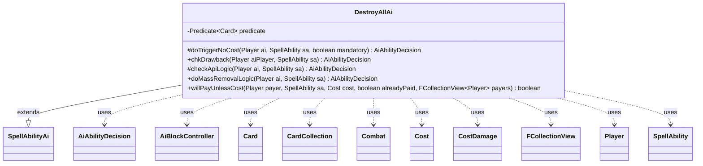

---
aliases:
  - DestroyAllAi
tags:
  - java/class
  - module/forge-ai
  - pkg/forge/ai/ability
fqn: forge.ai.ability.DestroyAllAi
package: forge.ai.ability
module: forge-ai
kind: Class
---

# DestroyAllAi

**Package:** `forge.ai.ability`   **Module:** `forge-ai`   **Kind:** Class



## Relationships
**Extends:**
- [[forge.ai.SpellAbilityAi|SpellAbilityAi]]
**Uses:**
- [[forge.ai.AiAbilityDecision|AiAbilityDecision]]
- [[forge.ai.AiBlockController|AiBlockController]]
- [[forge.game.card.Card|Card]]
- [[forge.game.card.CardCollection|CardCollection]]
- [[forge.game.combat.Combat|Combat]]
- [[forge.game.cost.Cost|Cost]]
- [[forge.game.cost.CostDamage|CostDamage]]
- [[forge.game.player.Player|Player]]
- [[forge.game.spellability.SpellAbility|SpellAbility]]
- [[forge.util.collect.FCollectionView|FCollectionView]]

## Design Description

`DestroyAllAi` is the AI decision module for spell abilities whose effect is a mass destruction ("destroy all") sweep. Extending `SpellAbilityAi`, it overrides the standard hooks — `checkApiLogic`, `chkDrawback`, and the mandatory-aware `doTriggerNoCost` — and funnels each to a shared static `doMassRemovalLogic`, which decides whether the computer should fire the board wipe. That logic compares the value of the AI's own affected permanents against each opponent's, using `ComputerUtilCard` evaluations and a per-opponent threshold, with special cases for creature-only and land-only sweeps, imminent-lethal combat situations (via `Combat` and a simulated `AiBlockController` block), and named card logics such as Raiding Party and Fell the Mighty.

A static `Predicate<Card>` filters out cards the sweep cannot meaningfully remove (indestructible, shielded, or flagged for sacrifice) so only genuinely destroyable permanents are weighed. The class also implements `willPayUnlessCost` to judge optional "unless you pay" costs — notably `CostDamage` — declining to pay when life loss is unaffordable or disproportionate to the creatures saved. The design centralizes all evaluation in one reusable method shared across trigger, drawback, and API entry points, collaborating with `Player`, `Card`/`CardCollection`, and the game's combat model rather than holding state of its own.

## Source
`forge-ai/src/main/java/forge/ai/ability/DestroyAllAi.java`

```java
package forge.ai.ability;

import forge.ai.*;
import forge.card.MagicColor;
import forge.game.card.*;
import forge.game.combat.Combat;
import forge.game.cost.Cost;
import forge.game.cost.CostDamage;
import forge.game.keyword.Keyword;
import forge.game.phase.PhaseType;
import forge.game.player.Player;
import forge.game.spellability.SpellAbility;
import forge.game.zone.ZoneType;
import forge.util.collect.FCollectionView;

import java.util.function.Predicate;

public class DestroyAllAi extends SpellAbilityAi {

    private static final Predicate<Card> predicate = c -> !(c.hasKeyword(Keyword.INDESTRUCTIBLE) || c.getCounters(CounterEnumType.SHIELD) > 0 || c.hasSVar("SacMe"));

    /* (non-Javadoc)
     * @see forge.card.abilityfactory.SpellAiLogic#doTriggerAINoCost(forge.game.player.Player, java.util.Map, forge.card.spellability.SpellAbility, boolean)
     */
    @Override
    protected AiAbilityDecision doTriggerNoCost(Player ai, SpellAbility sa, boolean mandatory) {
        if (mandatory) {
            return new AiAbilityDecision(100, AiPlayDecision.WillPlay);
        }

        return doMassRemovalLogic(ai, sa);
    }

    @Override
    public AiAbilityDecision chkDrawback(Player aiPlayer, SpellAbility sa) {
        return doMassRemovalLogic(aiPlayer, sa);
    }

    @Override
    protected AiAbilityDecision checkApiLogic(final Player ai, SpellAbility sa) {
        // AI needs to be expanded, since this function can be pretty complex
        // based on what the expected targets could be
        final String aiLogic = sa.getParamOrDefault("AILogic", "");

        if ("FellTheMighty".equals(aiLogic)) {
            return SpecialCardAi.FellTheMighty.consider(ai, sa);
        }

        return doMassRemovalLogic(ai, sa);
    }

    public static AiAbilityDecision doMassRemovalLogic(Player ai, SpellAbility sa) {
        final Card source = sa.getHostCard();
        final String logic = sa.getParamOrDefault("AILogic", "");

        // if we hit the whole board, the other opponents who are not the reason to cast this probably still suffer a bit too
        final int CREATURE_EVAL_THRESHOLD = 200 / (!sa.usesTargeting() ? ai.getOpponents().size() : 1);

        if (logic.equals("Always")) {
            return new AiAbilityDecision(100, AiPlayDecision.WillPlay);
        }

        String valid = sa.getParamOrDefault("ValidCards", "");

        if (valid.contains("X") && sa.getSVar("X").equals("Count$xPaid")) {
            ComputerUtilCost.setMaxXValue(sa, ai, sa.isTrigger());
        }

        // TODO should probably sort results when targeted to use on biggest threat instead of first match
        for (Player opponent: ai.getOpponents()) {
            CardCollection opplist = CardLists.getValidCards(opponent.getCardsIn(ZoneType.Battlefield), valid, source.getController(), source, sa);
            CardCollection ailist = CardLists.getValidCards(ai.getCardsIn(ZoneType.Battlefield), valid, source.getController(), source, sa);

            opplist = CardLists.filter(opplist, predicate);
            ailist = CardLists.filter(ailist, predicate);
            if (opplist.isEmpty()) {
                return new AiAbilityDecision(0, AiPlayDecision.CantPlayAi);
            }

            if (sa.usesTargeting()) {
                sa.resetTargets();
                if (sa.canTarget(opponent)) {
                    sa.getTargets().add(opponent);
                    ailist.clear();
                } else {
                    return new AiAbilityDecision(0, AiPlayDecision.CantPlayAi);
                }
            }

            // Special handling for Raiding Party
            if (logic.equals("RaidingParty")) {
                int numAiCanSave = Math.min(CardLists.count(ai.getCreaturesInPlay(), CardPredicates.isColor(MagicColor.WHITE).and(CardPredicates.UNTAPPED)) * 2, ailist.size());
                int numOppsCanSave = Math.min(CardLists.count(ai.getOpponents().getCreaturesInPlay(), CardPredicates.isColor(MagicColor.WHITE).and(CardPredicates.UNTAPPED)) * 2, opplist.size());

                if (numOppsCanSave < opplist.size() && (ailist.size() - numAiCanSave < opplist.size() - numOppsCanSave)) {
                    return new AiAbilityDecision(100, AiPlayDecision.WillPlay);
                } else if (numAiCanSave < ailist.size() && (opplist.size() - numOppsCanSave < ailist.size() - numAiCanSave)) {
                    return new AiAbilityDecision(0, AiPlayDecision.CantPlayAi);
                }
            }

            // If effect is destroying creatures and AI is about to lose, activate effect anyway no matter what!
            if ((!CardLists.getType(opplist, "Creature").isEmpty()) && (ai.getGame().getPhaseHandler().is(PhaseType.COMBAT_DECLARE_BLOCKERS))
                    && (ai.getGame().getCombat() != null && ComputerUtilCombat.lifeInSeriousDanger(ai, ai.getGame().getCombat()))) {
                return new AiAbilityDecision(100, AiPlayDecision.WillPlay);
            }

            // If effect is destroying creatures and AI is about to get low on life, activate effect anyway if difference in lost permanents not very much
            if ((!CardLists.getType(opplist, "Creature").isEmpty()) && (ai.getGame().getPhaseHandler().is(PhaseType.COMBAT_DECLARE_BLOCKERS))
                    && (ai.getGame().getCombat() != null && ComputerUtilCombat.lifeInDanger(ai, ai.getGame().getCombat()))
                    && ((ComputerUtilCard.evaluatePermanentList(ailist) - 6) >= ComputerUtilCard.evaluatePermanentList(opplist))) {
                return new AiAbilityDecision(100, AiPlayDecision.WillPlay);
            }

            // if only creatures are affected evaluate both lists and pass only if human creatures are more valuable
            if (CardLists.getNotType(opplist, "Creature").isEmpty() && CardLists.getNotType(ailist, "Creature").isEmpty()) {
                if (ComputerUtilCard.evaluateCreatureList(ailist) + CREATURE_EVAL_THRESHOLD < ComputerUtilCard.evaluateCreatureList(opplist)) {
                    return new AiAbilityDecision(100, AiPlayDecision.WillPlay);

                }

                if (ai.getGame().getPhaseHandler().getPhase().isBefore(PhaseType.MAIN2)) {
                    return new AiAbilityDecision(0, AiPlayDecision.WaitForMain2);
                }

                // test whether the human can kill the ai next turn
                Combat combat = new Combat(opponent);
                boolean containsAttacker = false;
                for (Card att : opponent.getCreaturesInPlay()) {
                    if (ComputerUtilCombat.canAttackNextTurn(att, ai)) {
                        combat.addAttacker(att, ai);
                        containsAttacker = containsAttacker || opplist.contains(att);
                    }
                }
                if (!containsAttacker) {
                    return new AiAbilityDecision(0, AiPlayDecision.CantPlayAi);
                }
                AiBlockController block = new AiBlockController(ai, false);
                block.assignBlockersForCombat(combat);

                if (ComputerUtilCombat.lifeInSeriousDanger(ai, combat)) {
                    return new AiAbilityDecision(100, AiPlayDecision.WillPlay);
                }
                return new AiAbilityDecision(0, AiPlayDecision.CantPlayAi);
            } // only lands involved
            else if (CardLists.getNotType(opplist, "Land").isEmpty() && CardLists.getNotType(ailist, "Land").isEmpty()) {
                if (ai.isCardInPlay("Crucible of Worlds") && !opponent.isCardInPlay("Crucible of Worlds")) {
                    // TODO Should care about any land recursion, not just Crucible of Worlds
                    return new AiAbilityDecision(100, AiPlayDecision.WillPlay);

                }
                // evaluate the situation with creatures on the battlefield separately, as that's where the AI typically makes mistakes
                CardCollection aiCreatures = ai.getCreaturesInPlay();
                CardCollection oppCreatures = opponent.getCreaturesInPlay();
                if (!oppCreatures.isEmpty()) {
                    if (ComputerUtilCard.evaluateCreatureList(aiCreatures) < ComputerUtilCard.evaluateCreatureList(oppCreatures) + CREATURE_EVAL_THRESHOLD) {
                        return new AiAbilityDecision(0, AiPlayDecision.CantPlayAi);
                    }
                }
                // check if the AI would lose more lands than the opponent would
                if (ComputerUtilCard.evaluatePermanentList(ailist) > ComputerUtilCard.evaluatePermanentList(opplist) + 1) {
                    return new AiAbilityDecision(0, AiPlayDecision.CantPlayAi);
                }
            } // otherwise evaluate both lists by CMC and pass only if human permanents are more valuable
            else if ((ComputerUtilCard.evaluatePermanentList(ailist) + 3) >= ComputerUtilCard.evaluatePermanentList(opplist)) {
                return new AiAbilityDecision(0, AiPlayDecision.CantPlayAi);
            }
            return new AiAbilityDecision(100, AiPlayDecision.WillPlay);

        }
        return new AiAbilityDecision(0, AiPlayDecision.CantPlayAi);
    }
    

    @Override
    public boolean willPayUnlessCost(Player payer, SpellAbility sa, Cost cost, boolean alreadyPaid, FCollectionView<Player> payers) {
        final Card source = sa.getHostCard();
        if (payers.size() > 1) {
            if (alreadyPaid) {
                return false;
            }
        }
        String valid = sa.getParamOrDefault("ValidCards", "");

        CardCollection ailist = CardLists.getValidCards(payer.getCardsIn(ZoneType.Battlefield), valid, source.getController(), source, sa);
        ailist = CardLists.filter(ailist, predicate);

        if (ailist.isEmpty()) {
            return false;
        }

        if (cost.hasSpecificCostType(CostDamage.class)) {
            if (!payer.canLoseLife()) {
                return false;
            }
            final CostDamage pay = cost.getCostPartByType(CostDamage.class);
            int realDamage = ComputerUtilCombat.predictDamageTo(payer, pay.getAbilityAmount(sa), source, false);
            if (realDamage > payer.getLife()) {
                return false;
            }
            if (realDamage > ailist.size() * 3) { // three life points per one creature
                return false;
            }
        }

        return super.willPayUnlessCost(payer, sa, cost, alreadyPaid, payers);
    }
}
```

## Python
`forge/ai/ability/DestroyAllAi.py`

```python
from forge.ai.SpellAbilityAi import SpellAbilityAi
from forge.ai.AiAbilityDecision import AiAbilityDecision
from forge.ai.AiPlayDecision import AiPlayDecision
from forge.ai.AiBlockController import AiBlockController
from forge.ai.SpecialCardAi import SpecialCardAi
from forge.ai.ComputerUtilCost import ComputerUtilCost
from forge.ai.ComputerUtilCombat import ComputerUtilCombat
from forge.ai.ComputerUtilCard import ComputerUtilCard
from forge.card.MagicColor import MagicColor
from forge.game.card.Card import Card
from forge.game.card.CardCollection import CardCollection
from forge.game.card.CardLists import CardLists
from forge.game.card.CardPredicates import CardPredicates
from forge.game.card.CounterEnumType import CounterEnumType
from forge.game.combat.Combat import Combat
from forge.game.cost.Cost import Cost
from forge.game.cost.CostDamage import CostDamage
from forge.game.keyword.Keyword import Keyword
from forge.game.phase.PhaseType import PhaseType
from forge.game.player.Player import Player
from forge.game.spellability.SpellAbility import SpellAbility
from forge.game.zone.ZoneType import ZoneType
from forge.util.collect.FCollectionView import FCollectionView


class DestroyAllAi(SpellAbilityAi):

    predicate = staticmethod(lambda c: not (c.hasKeyword(Keyword.INDESTRUCTIBLE) or c.getCounters(CounterEnumType.SHIELD) > 0 or c.hasSVar("SacMe")))

    # (non-Javadoc)
    # @see forge.card.abilityfactory.SpellAiLogic#doTriggerAINoCost(forge.game.player.Player, java.util.Map, forge.card.spellability.SpellAbility, boolean)
    def doTriggerNoCost(self, ai: Player, sa: SpellAbility, mandatory: bool) -> AiAbilityDecision:
        if mandatory:
            return AiAbilityDecision(100, AiPlayDecision.WillPlay)

        return DestroyAllAi.doMassRemovalLogic(ai, sa)

    def chkDrawback(self, aiPlayer: Player, sa: SpellAbility) -> AiAbilityDecision:
        return DestroyAllAi.doMassRemovalLogic(aiPlayer, sa)

    def checkApiLogic(self, ai: Player, sa: SpellAbility) -> AiAbilityDecision:
        # AI needs to be expanded, since this function can be pretty complex
        # based on what the expected targets could be
        aiLogic = sa.getParamOrDefault("AILogic", "")

        if "FellTheMighty" == aiLogic:
            return SpecialCardAi.FellTheMighty.consider(ai, sa)

        return DestroyAllAi.doMassRemovalLogic(ai, sa)

    @staticmethod
    def doMassRemovalLogic(ai: Player, sa: SpellAbility) -> AiAbilityDecision:
        source = sa.getHostCard()
        logic = sa.getParamOrDefault("AILogic", "")

        # if we hit the whole board, the other opponents who are not the reason to cast this probably still suffer a bit too
        CREATURE_EVAL_THRESHOLD = 200 // (ai.getOpponents().size() if not sa.usesTargeting() else 1)

        if logic == "Always":
            return AiAbilityDecision(100, AiPlayDecision.WillPlay)

        valid = sa.getParamOrDefault("ValidCards", "")

        if "X" in valid and sa.getSVar("X") == "Count$xPaid":
            ComputerUtilCost.setMaxXValue(sa, ai, sa.isTrigger())

        # TODO should probably sort results when targeted to use on biggest threat instead of first match
        for opponent in ai.getOpponents():
            opplist = CardLists.getValidCards(opponent.getCardsIn(ZoneType.Battlefield), valid, source.getController(), source, sa)
            ailist = CardLists.getValidCards(ai.getCardsIn(ZoneType.Battlefield), valid, source.getController(), source, sa)

            opplist = CardLists.filter(opplist, DestroyAllAi.predicate)
            ailist = CardLists.filter(ailist, DestroyAllAi.predicate)
            if opplist.isEmpty():
                return AiAbilityDecision(0, AiPlayDecision.CantPlayAi)

            if sa.usesTargeting():
                sa.resetTargets()
                if sa.canTarget(opponent):
                    sa.getTargets().add(opponent)
                    ailist.clear()
                else:
                    return AiAbilityDecision(0, AiPlayDecision.CantPlayAi)

            # Special handling for Raiding Party
            if logic == "RaidingParty":
                numAiCanSave = min(CardLists.count(ai.getCreaturesInPlay(), CardPredicates.isColor(MagicColor.WHITE).and_(CardPredicates.UNTAPPED)) * 2, ailist.size())
                numOppsCanSave = min(CardLists.count(ai.getOpponents().getCreaturesInPlay(), CardPredicates.isColor(MagicColor.WHITE).and_(CardPredicates.UNTAPPED)) * 2, opplist.size())

                if numOppsCanSave < opplist.size() and (ailist.size() - numAiCanSave < opplist.size() - numOppsCanSave):
                    return AiAbilityDecision(100, AiPlayDecision.WillPlay)
                elif numAiCanSave < ailist.size() and (opplist.size() - numOppsCanSave < ailist.size() - numAiCanSave):
                    return AiAbilityDecision(0, AiPlayDecision.CantPlayAi)

            # If effect is destroying creatures and AI is about to lose, activate effect anyway no matter what!
            if (not CardLists.getType(opplist, "Creature").isEmpty()) and (ai.getGame().getPhaseHandler().is_(PhaseType.COMBAT_DECLARE_BLOCKERS)) \
                    and (ai.getGame().getCombat() is not None and ComputerUtilCombat.lifeInSeriousDanger(ai, ai.getGame().getCombat())):
                return AiAbilityDecision(100, AiPlayDecision.WillPlay)

            # If effect is destroying creatures and AI is about to get low on life, activate effect anyway if difference in lost permanents not very much
            if (not CardLists.getType(opplist, "Creature").isEmpty()) and (ai.getGame().getPhaseHandler().is_(PhaseType.COMBAT_DECLARE_BLOCKERS)) \
                    and (ai.getGame().getCombat() is not None and ComputerUtilCombat.lifeInDanger(ai, ai.getGame().getCombat())) \
                    and ((ComputerUtilCard.evaluatePermanentList(ailist) - 6) >= ComputerUtilCard.evaluatePermanentList(opplist)):
                return AiAbilityDecision(100, AiPlayDecision.WillPlay)

            # if only creatures are affected evaluate both lists and pass only if human creatures are more valuable
            if CardLists.getNotType(opplist, "Creature").isEmpty() and CardLists.getNotType(ailist, "Creature").isEmpty():
                if ComputerUtilCard.evaluateCreatureList(ailist) + CREATURE_EVAL_THRESHOLD < ComputerUtilCard.evaluateCreatureList(opplist):
                    return AiAbilityDecision(100, AiPlayDecision.WillPlay)

                if ai.getGame().getPhaseHandler().getPhase().isBefore(PhaseType.MAIN2):
                    return AiAbilityDecision(0, AiPlayDecision.WaitForMain2)

                # test whether the human can kill the ai next turn
                combat = Combat(opponent)
                containsAttacker = False
                for att in opponent.getCreaturesInPlay():
                    if ComputerUtilCombat.canAttackNextTurn(att, ai):
                        combat.addAttacker(att, ai)
                        containsAttacker = containsAttacker or opplist.contains(att)
                if not containsAttacker:
                    return AiAbilityDecision(0, AiPlayDecision.CantPlayAi)
                block = AiBlockController(ai, False)
                block.assignBlockersForCombat(combat)

                if ComputerUtilCombat.lifeInSeriousDanger(ai, combat):
                    return AiAbilityDecision(100, AiPlayDecision.WillPlay)
                return AiAbilityDecision(0, AiPlayDecision.CantPlayAi)
            # only lands involved
            elif CardLists.getNotType(opplist, "Land").isEmpty() and CardLists.getNotType(ailist, "Land").isEmpty():
                if ai.isCardInPlay("Crucible of Worlds") and not opponent.isCardInPlay("Crucible of Worlds"):
                    # TODO Should care about any land recursion, not just Crucible of Worlds
                    return AiAbilityDecision(100, AiPlayDecision.WillPlay)

                # evaluate the situation with creatures on the battlefield separately, as that's where the AI typically makes mistakes
                aiCreatures = ai.getCreaturesInPlay()
                oppCreatures = opponent.getCreaturesInPlay()
                if not oppCreatures.isEmpty():
                    if ComputerUtilCard.evaluateCreatureList(aiCreatures) < ComputerUtilCard.evaluateCreatureList(oppCreatures) + CREATURE_EVAL_THRESHOLD:
                        return AiAbilityDecision(0, AiPlayDecision.CantPlayAi)
                # check if the AI would lose more lands than the opponent would
                if ComputerUtilCard.evaluatePermanentList(ailist) > ComputerUtilCard.evaluatePermanentList(opplist) + 1:
                    return AiAbilityDecision(0, AiPlayDecision.CantPlayAi)
            # otherwise evaluate both lists by CMC and pass only if human permanents are more valuable
            elif (ComputerUtilCard.evaluatePermanentList(ailist) + 3) >= ComputerUtilCard.evaluatePermanentList(opplist):
                return AiAbilityDecision(0, AiPlayDecision.CantPlayAi)
            return AiAbilityDecision(100, AiPlayDecision.WillPlay)

        return AiAbilityDecision(0, AiPlayDecision.CantPlayAi)

    def willPayUnlessCost(self, payer: Player, sa: SpellAbility, cost: Cost, alreadyPaid: bool, payers: FCollectionView) -> bool:
        source = sa.getHostCard()
        if payers.size() > 1:
            if alreadyPaid:
                return False
        valid = sa.getParamOrDefault("ValidCards", "")

        ailist = CardLists.getValidCards(payer.getCardsIn(ZoneType.Battlefield), valid, source.getController(), source, sa)
        ailist = CardLists.filter(ailist, DestroyAllAi.predicate)

        if ailist.isEmpty():
            return False

        if cost.hasSpecificCostType(CostDamage):
            if not payer.canLoseLife():
                return False
            pay = cost.getCostPartByType(CostDamage)
            realDamage = ComputerUtilCombat.predictDamageTo(payer, pay.getAbilityAmount(sa), source, False)
            if realDamage > payer.getLife():
                return False
            if realDamage > ailist.size() * 3:  # three life points per one creature
                return False

        return super().willPayUnlessCost(payer, sa, cost, alreadyPaid, payers)
```
