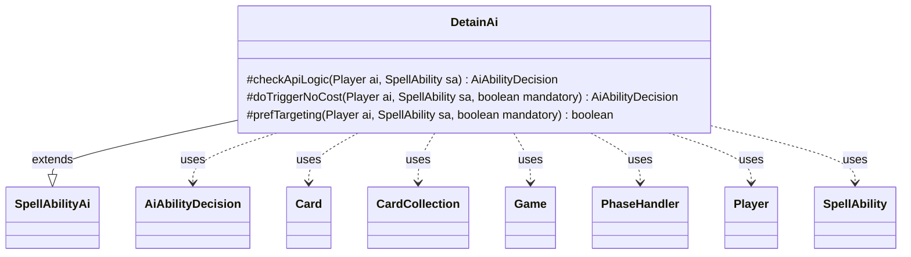

---
aliases:
  - DetainAi
tags:
  - java/class
  - module/forge-ai
  - pkg/forge/ai/ability
fqn: forge.ai.ability.DetainAi
package: forge.ai.ability
module: forge-ai
kind: Class
---

# DetainAi

**Package:** `forge.ai.ability` &nbsp; **Module:** `forge-ai` &nbsp; **Kind:** Class



## Relationships
**Extends:**
- [[forge.ai.SpellAbilityAi|SpellAbilityAi]]
**Uses:**
- [[forge.ai.AiAbilityDecision|AiAbilityDecision]]
- [[forge.game.Game|Game]]
- [[forge.game.card.Card|Card]]
- [[forge.game.card.CardCollection|CardCollection]]
- [[forge.game.phase.PhaseHandler|PhaseHandler]]
- [[forge.game.player.Player|Player]]
- [[forge.game.spellability.SpellAbility|SpellAbility]]

## Design Description

DetainAi is the AI strategy handler for "detain" effects, extending `SpellAbilityAi` to plug into Forge's ability-evaluation framework. Its job is to decide whether the AI should activate or trigger a detain ability and to choose the best opponent permanents to detain, returning an `AiAbilityDecision` weighted by desirability. The bulk of its logic lives in `prefTargeting`, which filters opponents' battlefield cards down to creatures (or tap-relevant permanents), then applies AI target preferences before selecting victims.

Target selection is context-sensitive: it prioritizes permanents it can kill via the detain, otherwise consults the `PhaseHandler` and combat state to tap down likely blockers before the AI attacks or likely attackers during the opponent's turn, falling back to the most expensive permanent. It collaborates with combat and evaluation helpers (`AiAttackController`, `CombatUtil`, `ComputerUtilCard`) and respects targeting constraints such as minimum/maximum counts, reflecting deliberate, combat-aware play rather than naive targeting.

## Source
`forge-ai/src/main/java/forge/ai/ability/DetainAi.java`

```java
package forge.ai.ability;

import java.util.List;

import forge.ai.AiAbilityDecision;
import forge.ai.AiAttackController;
import forge.ai.AiPlayDecision;
import forge.ai.ComputerUtil;
import forge.ai.ComputerUtilCard;
import forge.ai.SpellAbilityAi;
import forge.game.Game;
import forge.game.card.Card;
import forge.game.card.CardCollection;
import forge.game.card.CardLists;
import forge.game.card.CardPredicates;
import forge.game.combat.CombatUtil;
import forge.game.phase.PhaseHandler;
import forge.game.phase.PhaseType;
import forge.game.player.Player;
import forge.game.spellability.SpellAbility;
import forge.game.zone.ZoneType;

public class DetainAi extends SpellAbilityAi {

    @Override
    protected AiAbilityDecision checkApiLogic(Player ai, SpellAbility sa) {
        return doTriggerNoCost(ai, sa, false);
    }

    @Override
    protected AiAbilityDecision doTriggerNoCost(Player ai, SpellAbility sa, boolean mandatory) {
        if (prefTargeting(ai, sa, mandatory)) {
            return new AiAbilityDecision(100, AiPlayDecision.WillPlay);
        }
        return new AiAbilityDecision(0, AiPlayDecision.CantPlaySa);
    }

    protected boolean prefTargeting(final Player ai, final SpellAbility sa, final boolean mandatory) {
        if (!sa.usesTargeting()) {
            return mandatory;
        }

        final Game game = ai.getGame();
        final Card source = sa.getHostCard();
        CardCollection targetables = CardLists.getTargetableCards(ai.getOpponents().getCardsIn(ZoneType.Battlefield), sa);
        CardCollection list = CardLists.filter(targetables, CREATURE_OR_TAP_ABILITY);

        // Filter AI-specific targets if provided
        list = ComputerUtil.filterAITgts(sa, ai, list, true);

        if (list.isEmpty()) {
            if (!mandatory) {
                return false;
            }
            list = targetables;
        }
        sa.resetTargets();

        while (sa.canAddMoreTarget()) {
            Card choice = null;
            if (list.isEmpty()) {
                if (!sa.isMinTargetChosen() || sa.isZeroTargets()) {
                    return false;
                }
            }

            PhaseHandler phase = game.getPhaseHandler();
            final Player opp = AiAttackController.choosePreferredDefenderPlayer(ai);
            Card primeTarget = ComputerUtil.getKilledByTargeting(sa, list);
            if (primeTarget != null) {
                choice = primeTarget;
            } else if (phase.isPlayerTurn(ai) && phase.getPhase().isBefore(PhaseType.COMBAT_DECLARE_BLOCKERS)) {
                // Tap creatures possible blockers before combat during AI's turn.
                List<Card> attackers;
                if (phase.getPhase().isAfter(PhaseType.COMBAT_DECLARE_ATTACKERS)) {
                    //Combat has already started
                    attackers = game.getCombat().getAttackers();
                } else {
                    attackers = CardLists.filter(ai.getCreaturesInPlay(), c -> CombatUtil.canAttack(c, opp));
                    attackers.remove(source);
                }
                List<Card> creatureList = CardLists.filter(list, CardPredicates.possibleBlockerForAtLeastOne(attackers));

                // TODO check if own creature would be forced to attack and we want to keep it alive

                if (!attackers.isEmpty() && !creatureList.isEmpty()) {
                    choice = ComputerUtilCard.getBestCreatureAI(creatureList);
                } else if (sa.isTrigger() || ComputerUtil.castSpellInMain1(ai, sa)) {
                    choice = ComputerUtilCard.getMostExpensivePermanentAI(list);
                }
            } else if (phase.isPlayerTurn(opp)
                    && phase.getPhase().isBefore(PhaseType.COMBAT_DECLARE_ATTACKERS)) {
                // Tap creatures possible blockers before combat during AI's turn.
                if (list.anyMatch(CardPredicates.CREATURES)) {
                    List<Card> creatureList = CardLists.filter(list, c -> c.isCreature() && CombatUtil.canAttack(c, opp));
                    choice = ComputerUtilCard.getBestCreatureAI(creatureList);
                } else { // no creatures available
                    choice = ComputerUtilCard.getMostExpensivePermanentAI(list);
                }
            } else {
                choice = ComputerUtilCard.getMostExpensivePermanentAI(list);
            }

            if (choice == null) { // can't find anything left
                if (!sa.isMinTargetChosen() || sa.isZeroTargets()) {
                    return false;
                } else {
                    if (!ComputerUtil.shouldCastLessThanMax(ai, source)) {
                        return false;
                    }
                    break;
                }
            }

            list.remove(choice);
            sa.getTargets().add(choice);
        }

        return true;
    }
}
```

## Python
`forge/ai/ability/DetainAi.py`

````python
Output should be the Python source itself, not a file write. Here it is:

```
from typing import List

from forge.ai.AiAbilityDecision import AiAbilityDecision
from forge.ai.AiAttackController import AiAttackController
from forge.ai.AiPlayDecision import AiPlayDecision
from forge.ai.ComputerUtil import ComputerUtil
from forge.ai.ComputerUtilCard import ComputerUtilCard
from forge.ai.SpellAbilityAi import SpellAbilityAi
from forge.game.Game import Game
from forge.game.card.Card import Card
from forge.game.card.CardCollection import CardCollection
from forge.game.card.CardLists import CardLists
from forge.game.card.CardPredicates import CardPredicates
from forge.game.combat.CombatUtil import CombatUtil
from forge.game.phase.PhaseHandler import PhaseHandler
from forge.game.phase.PhaseType import PhaseType
from forge.game.player.Player import Player
from forge.game.spellability.SpellAbility import SpellAbility
from forge.game.zone.ZoneType import ZoneType


class DetainAi(SpellAbilityAi):

    def checkApiLogic(self, ai: Player, sa: SpellAbility) -> AiAbilityDecision:
        return self.doTriggerNoCost(ai, sa, False)

    def doTriggerNoCost(self, ai: Player, sa: SpellAbility, mandatory: bool) -> AiAbilityDecision:
        if self.prefTargeting(ai, sa, mandatory):
            return AiAbilityDecision(100, AiPlayDecision.WillPlay)
        return AiAbilityDecision(0, AiPlayDecision.CantPlaySa)

    def prefTargeting(self, ai: Player, sa: SpellAbility, mandatory: bool) -> bool:
        if not sa.usesTargeting():
            return mandatory

        game = ai.getGame()
        source = sa.getHostCard()
        targetables = CardLists.getTargetableCards(ai.getOpponents().getCardsIn(ZoneType.Battlefield), sa)
        list = CardLists.filter(targetables, CREATURE_OR_TAP_ABILITY)

        # Filter AI-specific targets if provided
        list = ComputerUtil.filterAITgts(sa, ai, list, True)

        if list.isEmpty():
            if not mandatory:
                return False
            list = targetables
        sa.resetTargets()

        while sa.canAddMoreTarget():
            choice = None
            if list.isEmpty():
                if not sa.isMinTargetChosen() or sa.isZeroTargets():
                    return False

            phase = game.getPhaseHandler()
            opp = AiAttackController.choosePreferredDefenderPlayer(ai)
            primeTarget = ComputerUtil.getKilledByTargeting(sa, list)
            if primeTarget is not None:
                choice = primeTarget
            elif phase.isPlayerTurn(ai) and phase.getPhase().isBefore(PhaseType.COMBAT_DECLARE_BLOCKERS):
                # Tap creatures possible blockers before combat during AI's turn.
                if phase.getPhase().isAfter(PhaseType.COMBAT_DECLARE_ATTACKERS):
                    # Combat has already started
                    attackers = game.getCombat().getAttackers()
                else:
                    attackers = CardLists.filter(ai.getCreaturesInPlay(), lambda c: CombatUtil.canAttack(c, opp))
                    attackers.remove(source)
                creatureList = CardLists.filter(list, CardPredicates.possibleBlockerForAtLeastOne(attackers))

                # TODO check if own creature would be forced to attack and we want to keep it alive

                if not attackers.isEmpty() and not creatureList.isEmpty():
                    choice = ComputerUtilCard.getBestCreatureAI(creatureList)
                elif sa.isTrigger() or ComputerUtil.castSpellInMain1(ai, sa):
                    choice = ComputerUtilCard.getMostExpensivePermanentAI(list)
            elif phase.isPlayerTurn(opp) and phase.getPhase().isBefore(PhaseType.COMBAT_DECLARE_ATTACKERS):
                # Tap creatures possible blockers before combat during AI's turn.
                if list.anyMatch(CardPredicates.CREATURES):
                    creatureList = CardLists.filter(list, lambda c: c.isCreature() and CombatUtil.canAttack(c, opp))
                    choice = ComputerUtilCard.getBestCreatureAI(creatureList)
                else:  # no creatures available
                    choice = ComputerUtilCard.getMostExpensivePermanentAI(list)
            else:
                choice = ComputerUtilCard.getMostExpensivePermanentAI(list)

            if choice is None:  # can't find anything left
                if not sa.isMinTargetChosen() or sa.isZeroTargets():
                    return False
                else:
                    if not ComputerUtil.shouldCastLessThanMax(ai, source):
                        return False
                    break

            list.remove(choice)
            sa.getTargets().add(choice)

        return True
````
