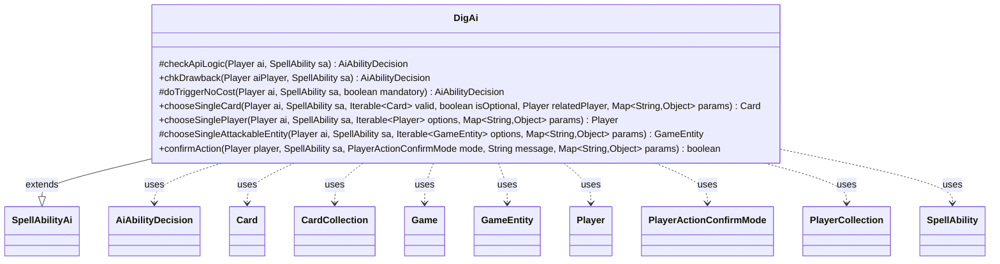

---
aliases:
  - DigAi
tags:
  - java/class
  - module/forge-ai
  - pkg/forge/ai/ability
fqn: forge.ai.ability.DigAi
package: forge.ai.ability
module: forge-ai
kind: Class
---

# DigAi

**Package:** `forge.ai.ability` &nbsp; **Module:** `forge-ai` &nbsp; **Kind:** Class



## Relationships
**Extends:**
- [[forge.ai.SpellAbilityAi|SpellAbilityAi]]
**Uses:**
- [[forge.ai.AiAbilityDecision|AiAbilityDecision]]
- [[forge.game.Game|Game]]
- [[forge.game.GameEntity|GameEntity]]
- [[forge.game.card.Card|Card]]
- [[forge.game.card.CardCollection|CardCollection]]
- [[forge.game.player.Player|Player]]
- [[forge.game.player.PlayerActionConfirmMode|PlayerActionConfirmMode]]
- [[forge.game.player.PlayerCollection|PlayerCollection]]
- [[forge.game.spellability.SpellAbility|SpellAbility]]

## Design Description

DigAi is the AI decision-making handler for "Dig"-style spell abilities (those that look at the top cards of a library to draw, exile, or rearrange them). As a concrete subclass of `SpellAbilityAi`, it overrides the engine's hook methods to teach the computer player how and when to use such effects: `checkApiLogic` decides whether playing is worthwhile (rejecting empty libraries, self-decking risks, off-tempo draws, and unaffordable X costs), while `doTriggerNoCost` handles triggered variants. The `chooseSingleCard`, `chooseSinglePlayer`, `chooseSingleAttackableEntity`, and `confirmAction` overrides resolve the selections a Dig presents, branching on `AILogic` parameters to support card-specific behavior.

Notable design intent: rather than hard-coding individual cards, DigAi reads string-keyed `AILogic` parameters (e.g. `DigForCreature`, `EmulateScry`, `PayXButSaveMana`) and delegates specialized cases to helpers like `SpecialCardAi` and the `ComputerUtil*` utilities, keeping per-card tuning data-driven while collaborating heavily with the game-state types (`Player`, `Card`, `Game`, `GameEntity`) it inspects.

## Source
`forge-ai/src/main/java/forge/ai/ability/DigAi.java`

```java
package forge.ai.ability;

import com.google.common.collect.Iterables;
import forge.ai.*;
import forge.game.Game;
import forge.game.GameEntity;
import forge.game.ability.AbilityUtils;
import forge.game.card.Card;
import forge.game.card.CardCollection;
import forge.game.card.CardLists;
import forge.game.keyword.Keyword;
import forge.game.phase.PhaseType;
import forge.game.player.Player;
import forge.game.player.PlayerActionConfirmMode;
import forge.game.player.PlayerCollection;
import forge.game.player.PlayerPredicates;
import forge.game.spellability.SpellAbility;
import forge.game.zone.ZoneType;
import forge.util.TextUtil;

import java.util.Map;

public class DigAi extends SpellAbilityAi {
    /* (non-Javadoc)
     * @see forge.card.abilityfactory.SpellAiLogic#canPlayAI(forge.game.player.Player, java.util.Map, forge.card.spellability.SpellAbility)
     */
    @Override
    protected AiAbilityDecision checkApiLogic(Player ai, SpellAbility sa) {
        final Game game = ai.getGame();
        Player opp = AiAttackController.choosePreferredDefenderPlayer(ai);
        final Card host = sa.getHostCard();
        Player libraryOwner = ai;

        if (sa.usesTargeting()) {
            sa.resetTargets();
            if (!sa.canTarget(opp)) {
                return new AiAbilityDecision(0, AiPlayDecision.CantPlayAi);
            }
            sa.getTargets().add(opp);
            libraryOwner = opp;
        }

        // return false if nothing to dig into
        if (libraryOwner.getCardsIn(ZoneType.Library).isEmpty()) {
            return new AiAbilityDecision(0, AiPlayDecision.CantPlayAi);
        }

        // don't deck yourself
        if (sa.hasParam("DestinationZone2") && !"Library".equals(sa.getParam("DestinationZone2"))) {
            int numToDig = AbilityUtils.calculateAmount(host, sa.getParam("DigNum"), sa);
            if (libraryOwner == ai && ai.getCardsIn(ZoneType.Library).size() <= numToDig + 2) {
                return new AiAbilityDecision(0, AiPlayDecision.CantPlayAi);
            }
        }

        // Don't use draw abilities before main 2 if possible
        if (game.getPhaseHandler().getPhase().isBefore(PhaseType.MAIN2) && !sa.hasParam("ActivationPhases")
                && !sa.hasParam("DestinationZone") && !ComputerUtil.castSpellInMain1(ai, sa)) {
            return new AiAbilityDecision(0, AiPlayDecision.CantPlayAi);
        }

        final String num = sa.getParam("DigNum");
        final boolean payXLogic = sa.hasParam("AILogic") && sa.getParam("AILogic").startsWith("PayX");
        if (num != null && (num.equals("X") && sa.getSVar(num).equals("Count$xPaid")) || payXLogic) {
            // By default, set PayX here to maximum value.
            SpellAbility root = sa.getRootAbility();
            if (root.getXManaCostPaid() == null) {
                int manaToSave = 0;

                // Special logic that asks the AI to conserve a certain amount of mana when paying X
                if (sa.hasParam("AILogic") && sa.getParam("AILogic").startsWith("PayXButSaveMana")) {
                    manaToSave = Integer.parseInt(TextUtil.split(sa.getParam("AILogic"), '.')[1]);
                }

                int numCards = ComputerUtilCost.setMaxXValue(sa, ai, sa.isTrigger()) - manaToSave;
                if (numCards <= 0) {
                    return new AiAbilityDecision(0, AiPlayDecision.CantPlayAi);
                }
                root.setXManaCostPaid(numCards);
            }
        }

        if (playReusable(ai, sa)) {
            return new AiAbilityDecision(100, AiPlayDecision.WillPlay);
        }

        if ((!game.getPhaseHandler().getNextTurn().equals(ai)
                || game.getPhaseHandler().getPhase().isBefore(PhaseType.END_OF_TURN))
            && !sa.hasParam("PlayerTurn") && !isSorcerySpeed(sa, ai)
            && (ai.getCardsIn(ZoneType.Hand).size() > 1 || game.getPhaseHandler().getPhase().isBefore(PhaseType.DRAW))
            && !ComputerUtil.activateForCost(sa, ai)) {
        	return new AiAbilityDecision(0, AiPlayDecision.CantPlayAi);
        }

        if ("MadSarkhanDigDmg".equals(sa.getParam("AILogic"))) {
            return SpecialCardAi.SarkhanTheMad.considerDig(ai, sa);
        }

        return new AiAbilityDecision(100, AiPlayDecision.WillPlay);
    }

    @Override
    public AiAbilityDecision chkDrawback(Player aiPlayer, SpellAbility sa) {
        // TODO: improve this check in ways that may be specific to a subability
        return canPlay(aiPlayer, sa);
    }

    @Override
    protected AiAbilityDecision doTriggerNoCost(Player ai, SpellAbility sa, boolean mandatory) {
        final SpellAbility root = sa.getRootAbility();
        PlayerCollection targetableOpps = ai.getOpponents().filter(PlayerPredicates.isTargetableBy(sa));
        Player opp = targetableOpps.min(PlayerPredicates.compareByLife());
        if (sa.usesTargeting()) {
            sa.resetTargets();
            if (mandatory && opp != null) {
                sa.getTargets().add(opp);
            } else if (mandatory && sa.canTarget(ai)) {
                sa.getTargets().add(ai);
            }
        }

        // Triggers that ask to pay {X} (e.g. Depala, Pilot Exemplar).
        if (sa.hasParam("AILogic") && sa.getParam("AILogic").startsWith("PayXButSaveMana")) {
            int manaToSave = Integer.parseInt(TextUtil.split(sa.getParam("AILogic"), '.')[1]);
            int numCards = ComputerUtilCost.setMaxXValue(sa, ai, true) - manaToSave;
            if (numCards <= 0) {
                if (mandatory) {
                    return new AiAbilityDecision(100, AiPlayDecision.WillPlay);
                }
                return new AiAbilityDecision(100, AiPlayDecision.CantPlayAi);
            }
            root.setXManaCostPaid(numCards);
        }

        return new AiAbilityDecision(100, AiPlayDecision.WillPlay);
    }
    
    @Override
    public Card chooseSingleCard(Player ai, SpellAbility sa, Iterable<Card> valid, boolean isOptional, Player relatedPlayer, Map<String, Object> params) {
        if ("DigForCreature".equals(sa.getParam("AILogic"))) {
            Card bestChoice = ComputerUtilCard.getBestCreatureAI(valid);
            if (bestChoice == null) {
                // no creatures, but maybe there's a morphable card that can be played as a creature?
                CardCollection morphs = CardLists.getKeyword(valid, Keyword.MORPH);
                if (!morphs.isEmpty()) {
                    bestChoice = ComputerUtilCard.getBestAI(morphs);
                }
            }

            // still nothing, so return the worst card since it'll be unplayable from exile (e.g. Vivien, Champion of the Wilds)
            return bestChoice != null ? bestChoice : ComputerUtilCard.getWorstAI(valid);
        } else if ("EmulateScry".equals(sa.getParam("AILogic"))) {
            for (Card choice : valid) {
                if (ComputerUtil.scryWillMoveCardToBottomOfLibrary(ai, choice)) {
                    return choice;
                }
            }
            return null;
        }

        if (sa.getActivatingPlayer().isOpponentOf(ai) && relatedPlayer.isOpponentOf(ai)) {
            return ComputerUtilCard.getWorstPermanentAI(valid, false, true, false, false);
        }
        return ComputerUtilCard.getBestAI(valid);
    }

    /* (non-Javadoc)
     * @see forge.card.ability.SpellAbilityAi#chooseSinglePlayer(forge.game.player.Player, forge.card.spellability.SpellAbility, java.util.List)
     */
    @Override
    public Player chooseSinglePlayer(Player ai, SpellAbility sa, Iterable<Player> options, Map<String, Object> params) {
        if (params != null && params.containsKey("Attacker")) {
            return (Player) ComputerUtilCombat.addAttackerToCombat(sa, (Card) params.get("Attacker"), options);
        }
        // an opponent choose a card from
        return Iterables.getFirst(options, null);
    }

    @Override
    protected GameEntity chooseSingleAttackableEntity(Player ai, SpellAbility sa, Iterable<GameEntity> options, Map<String, Object> params) {
        if (params != null && params.containsKey("Attacker")) {
            return ComputerUtilCombat.addAttackerToCombat(sa, (Card) params.get("Attacker"), options);
        }
        // should not be reached
        return super.chooseSingleAttackableEntity(ai, sa, options, params);
    }

    /* (non-Javadoc)
     * @see forge.card.ability.SpellAbilityAi#confirmAction(forge.card.spellability.SpellAbility, forge.game.player.PlayerActionConfirmMode, java.lang.String)
     */
    @Override
    public boolean confirmAction(Player player, SpellAbility sa, PlayerActionConfirmMode mode, String message, Map<String, Object> params) {
        Card topc = player.getZone(ZoneType.Library).get(0);

        if (ComputerUtilAbility.getAbilitySourceName(sa).equals("Explorer's Scope")) {
            // for Explorer's Scope, always put a land on the battlefield tapped
            // (TODO: might not always be a good idea, e.g. when a land ETBing can have detrimental effects)
            return true;
        } else if ("AlwaysConfirm".equals(sa.getParam("AILogic"))) {
            return true;
        }

        // looks like perfect code for Delver of Secrets, but what about other cards? 
        return topc.isInstant() || topc.isSorcery();
    }
}
```

## Python
`forge/ai/ability/DigAi.py`

```python
from forge.ai.SpellAbilityAi import SpellAbilityAi
from forge.ai.AiAbilityDecision import AiAbilityDecision
from forge.ai.AiPlayDecision import AiPlayDecision
from forge.ai.AiAttackController import AiAttackController
from forge.ai.ComputerUtil import ComputerUtil
from forge.ai.ComputerUtilCost import ComputerUtilCost
from forge.ai.ComputerUtilCard import ComputerUtilCard
from forge.ai.ComputerUtilCombat import ComputerUtilCombat
from forge.ai.ComputerUtilAbility import ComputerUtilAbility
from forge.ai.SpecialCardAi import SpecialCardAi
from forge.game.Game import Game
from forge.game.GameEntity import GameEntity
from forge.game.ability.AbilityUtils import AbilityUtils
from forge.game.card.Card import Card
from forge.game.card.CardCollection import CardCollection
from forge.game.card.CardLists import CardLists
from forge.game.keyword.Keyword import Keyword
from forge.game.phase.PhaseType import PhaseType
from forge.game.player.Player import Player
from forge.game.player.PlayerActionConfirmMode import PlayerActionConfirmMode
from forge.game.player.PlayerCollection import PlayerCollection
from forge.game.player.PlayerPredicates import PlayerPredicates
from forge.game.spellability.SpellAbility import SpellAbility
from forge.game.zone.ZoneType import ZoneType
from forge.util.TextUtil import TextUtil

from typing import Iterable, Map


class DigAi(SpellAbilityAi):
    # (non-Javadoc)
    # @see forge.card.abilityfactory.SpellAiLogic#canPlayAI(forge.game.player.Player, java.util.Map, forge.card.spellability.SpellAbility)
    def checkApiLogic(self, ai: Player, sa: SpellAbility) -> AiAbilityDecision:
        game = ai.getGame()
        opp = AiAttackController.choosePreferredDefenderPlayer(ai)
        host = sa.getHostCard()
        libraryOwner = ai

        if sa.usesTargeting():
            sa.resetTargets()
            if not sa.canTarget(opp):
                return AiAbilityDecision(0, AiPlayDecision.CantPlayAi)
            sa.getTargets().add(opp)
            libraryOwner = opp

        # return false if nothing to dig into
        if libraryOwner.getCardsIn(ZoneType.Library).isEmpty():
            return AiAbilityDecision(0, AiPlayDecision.CantPlayAi)

        # don't deck yourself
        if sa.hasParam("DestinationZone2") and not "Library" == sa.getParam("DestinationZone2"):
            numToDig = AbilityUtils.calculateAmount(host, sa.getParam("DigNum"), sa)
            if libraryOwner == ai and ai.getCardsIn(ZoneType.Library).size() <= numToDig + 2:
                return AiAbilityDecision(0, AiPlayDecision.CantPlayAi)

        # Don't use draw abilities before main 2 if possible
        if (game.getPhaseHandler().getPhase().isBefore(PhaseType.MAIN2) and not sa.hasParam("ActivationPhases")
                and not sa.hasParam("DestinationZone") and not ComputerUtil.castSpellInMain1(ai, sa)):
            return AiAbilityDecision(0, AiPlayDecision.CantPlayAi)

        num = sa.getParam("DigNum")
        payXLogic = sa.hasParam("AILogic") and sa.getParam("AILogic").startswith("PayX")
        if num is not None and (num == "X" and sa.getSVar(num) == "Count$xPaid") or payXLogic:
            # By default, set PayX here to maximum value.
            root = sa.getRootAbility()
            if root.getXManaCostPaid() is None:
                manaToSave = 0

                # Special logic that asks the AI to conserve a certain amount of mana when paying X
                if sa.hasParam("AILogic") and sa.getParam("AILogic").startswith("PayXButSaveMana"):
                    manaToSave = int(TextUtil.split(sa.getParam("AILogic"), '.')[1])

                numCards = ComputerUtilCost.setMaxXValue(sa, ai, sa.isTrigger()) - manaToSave
                if numCards <= 0:
                    return AiAbilityDecision(0, AiPlayDecision.CantPlayAi)
                root.setXManaCostPaid(numCards)

        if self.playReusable(ai, sa):
            return AiAbilityDecision(100, AiPlayDecision.WillPlay)

        if ((not game.getPhaseHandler().getNextTurn() == ai
                or game.getPhaseHandler().getPhase().isBefore(PhaseType.END_OF_TURN))
                and not sa.hasParam("PlayerTurn") and not self.isSorcerySpeed(sa, ai)
                and (ai.getCardsIn(ZoneType.Hand).size() > 1 or game.getPhaseHandler().getPhase().isBefore(PhaseType.DRAW))
                and not ComputerUtil.activateForCost(sa, ai)):
            return AiAbilityDecision(0, AiPlayDecision.CantPlayAi)

        if "MadSarkhanDigDmg" == sa.getParam("AILogic"):
            return SpecialCardAi.SarkhanTheMad.considerDig(ai, sa)

        return AiAbilityDecision(100, AiPlayDecision.WillPlay)

    def chkDrawback(self, aiPlayer: Player, sa: SpellAbility) -> AiAbilityDecision:
        # TODO: improve this check in ways that may be specific to a subability
        return self.canPlay(aiPlayer, sa)

    def doTriggerNoCost(self, ai: Player, sa: SpellAbility, mandatory: bool) -> AiAbilityDecision:
        root = sa.getRootAbility()
        targetableOpps = ai.getOpponents().filter(PlayerPredicates.isTargetableBy(sa))
        opp = targetableOpps.min(PlayerPredicates.compareByLife())
        if sa.usesTargeting():
            sa.resetTargets()
            if mandatory and opp is not None:
                sa.getTargets().add(opp)
            elif mandatory and sa.canTarget(ai):
                sa.getTargets().add(ai)

        # Triggers that ask to pay {X} (e.g. Depala, Pilot Exemplar).
        if sa.hasParam("AILogic") and sa.getParam("AILogic").startswith("PayXButSaveMana"):
            manaToSave = int(TextUtil.split(sa.getParam("AILogic"), '.')[1])
            numCards = ComputerUtilCost.setMaxXValue(sa, ai, True) - manaToSave
            if numCards <= 0:
                if mandatory:
                    return AiAbilityDecision(100, AiPlayDecision.WillPlay)
                return AiAbilityDecision(100, AiPlayDecision.CantPlayAi)
            root.setXManaCostPaid(numCards)

        return AiAbilityDecision(100, AiPlayDecision.WillPlay)

    def chooseSingleCard(self, ai: Player, sa: SpellAbility, valid: Iterable[Card], isOptional: bool, relatedPlayer: Player, params: Map[str, object]) -> Card:
        if "DigForCreature" == sa.getParam("AILogic"):
            bestChoice = ComputerUtilCard.getBestCreatureAI(valid)
            if bestChoice is None:
                # no creatures, but maybe there's a morphable card that can be played as a creature?
                morphs = CardLists.getKeyword(valid, Keyword.MORPH)
                if not morphs.isEmpty():
                    bestChoice = ComputerUtilCard.getBestAI(morphs)

            # still nothing, so return the worst card since it'll be unplayable from exile (e.g. Vivien, Champion of the Wilds)
            return bestChoice if bestChoice is not None else ComputerUtilCard.getWorstAI(valid)
        elif "EmulateScry" == sa.getParam("AILogic"):
            for choice in valid:
                if ComputerUtil.scryWillMoveCardToBottomOfLibrary(ai, choice):
                    return choice
            return None

        if sa.getActivatingPlayer().isOpponentOf(ai) and relatedPlayer.isOpponentOf(ai):
            return ComputerUtilCard.getWorstPermanentAI(valid, False, True, False, False)
        return ComputerUtilCard.getBestAI(valid)

    # (non-Javadoc)
    # @see forge.card.ability.SpellAbilityAi#chooseSinglePlayer(forge.game.player.Player, forge.card.spellability.SpellAbility, java.util.List)
    def chooseSinglePlayer(self, ai: Player, sa: SpellAbility, options: Iterable[Player], params: Map[str, object]) -> Player:
        if params is not None and "Attacker" in params:
            return ComputerUtilCombat.addAttackerToCombat(sa, params.get("Attacker"), options)
        # an opponent choose a card from
        return next(iter(options), None)

    def chooseSingleAttackableEntity(self, ai: Player, sa: SpellAbility, options: Iterable[GameEntity], params: Map[str, object]) -> GameEntity:
        if params is not None and "Attacker" in params:
            return ComputerUtilCombat.addAttackerToCombat(sa, params.get("Attacker"), options)
        # should not be reached
        return super().chooseSingleAttackableEntity(ai, sa, options, params)

    # (non-Javadoc)
    # @see forge.card.ability.SpellAbilityAi#confirmAction(forge.card.spellability.SpellAbility, forge.game.player.PlayerActionConfirmMode, java.lang.String)
    def confirmAction(self, player: Player, sa: SpellAbility, mode: PlayerActionConfirmMode, message: str, params: Map[str, object]) -> bool:
        topc = player.getZone(ZoneType.Library).get(0)

        if ComputerUtilAbility.getAbilitySourceName(sa) == "Explorer's Scope":
            # for Explorer's Scope, always put a land on the battlefield tapped
            # (TODO: might not always be a good idea, e.g. when a land ETBing can have detrimental effects)
            return True
        elif "AlwaysConfirm" == sa.getParam("AILogic"):
            return True

        # looks like perfect code for Delver of Secrets, but what about other cards?
        return topc.isInstant() or topc.isSorcery()
```
