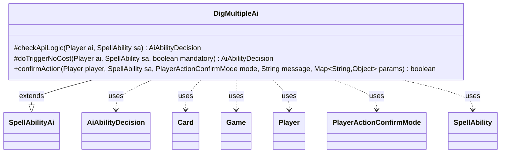

---
aliases:
  - DigMultipleAi
tags:
  - java/class
  - module/forge-ai
  - pkg/forge/ai/ability
fqn: forge.ai.ability.DigMultipleAi
package: forge.ai.ability
module: forge-ai
kind: Class
---

# DigMultipleAi

**Package:** `forge.ai.ability` &nbsp; **Module:** `forge-ai` &nbsp; **Kind:** Class



## Relationships
**Extends:**
- [[forge.ai.SpellAbilityAi|SpellAbilityAi]]
**Uses:**
- [[forge.ai.AiAbilityDecision|AiAbilityDecision]]
- [[forge.game.Game|Game]]
- [[forge.game.card.Card|Card]]
- [[forge.game.player.Player|Player]]
- [[forge.game.player.PlayerActionConfirmMode|PlayerActionConfirmMode]]
- [[forge.game.spellability.SpellAbility|SpellAbility]]

## Design Description

DigMultipleAi supplies the artificial-intelligence decision logic for the "DigMultiple" spell ability, which lets a player look at and distribute several cards from the top of a library. As a concrete subclass of `SpellAbilityAi`, it overrides the engine's hook methods so the AI can decide whether and how to play such abilities: `checkApiLogic` evaluates playability, while `doTriggerNoCost` handles triggered uses and `confirmAction` unconditionally approves prompts. Returning `AiAbilityDecision` values, it collaborates with the `Player`, `Card`, `Game`, and `SpellAbility` model types to inspect game state.

The design intent is visibly heuristic and self-protective: it picks a preferred opponent as the dig target, refuses to play against an empty library, avoids decking itself when cards leave the library, and defers card-draw effects until after Main 2 unless the ability is reusable or sorcery-speed timing makes acting now worthwhile.

## Source
`forge-ai/src/main/java/forge/ai/ability/DigMultipleAi.java`

```java
package forge.ai.ability;

import forge.ai.*;
import forge.game.Game;
import forge.game.ability.AbilityUtils;
import forge.game.card.Card;
import forge.game.phase.PhaseType;
import forge.game.player.Player;
import forge.game.player.PlayerActionConfirmMode;
import forge.game.spellability.SpellAbility;
import forge.game.zone.ZoneType;

import java.util.Map;

public class DigMultipleAi extends SpellAbilityAi {
    /* (non-Javadoc)
     * @see forge.card.abilityfactory.SpellAiLogic#canPlayAI(forge.game.player.Player, java.util.Map, forge.card.spellability.SpellAbility)
     */
    @Override
    protected AiAbilityDecision checkApiLogic(Player ai, SpellAbility sa) {
        final Game game = ai.getGame();
        Player opp = AiAttackController.choosePreferredDefenderPlayer(ai);
        final Card host = sa.getHostCard();
        Player libraryOwner = ai;

        if (sa.usesTargeting()) {
            sa.resetTargets();
            if (!opp.canBeTargetedBy(sa)) {
                return new AiAbilityDecision(0, AiPlayDecision.CantPlayAi);
            }
            sa.getTargets().add(opp);
            libraryOwner = opp;
        }

        // return false if nothing to dig into
        if (libraryOwner.getCardsIn(ZoneType.Library).isEmpty()) {
            return new AiAbilityDecision(0, AiPlayDecision.CantPlayAi);
        }

        // don't deck yourself
        if (sa.hasParam("DestinationZone2") && !"Library".equals(sa.getParam("DestinationZone2"))) {
            int numToDig = AbilityUtils.calculateAmount(host, sa.getParam("DigNum"), sa);
            if (libraryOwner == ai && ai.getCardsIn(ZoneType.Library).size() <= numToDig + 2) {
                return new AiAbilityDecision(0, AiPlayDecision.CantPlayAi);
            }
        }

        // Don't use draw abilities before main 2 if possible
        if (game.getPhaseHandler().getPhase().isBefore(PhaseType.MAIN2) && !sa.hasParam("ActivationPhases")
                && !sa.hasParam("DestinationZone") && !ComputerUtil.castSpellInMain1(ai, sa)) {
            return new AiAbilityDecision(0, AiPlayDecision.CantPlayAi);
        }

        if (playReusable(ai, sa)) {
            return new AiAbilityDecision(100, AiPlayDecision.WillPlay);
        }

        if ((!game.getPhaseHandler().getNextTurn().equals(ai)
                || game.getPhaseHandler().getPhase().isBefore(PhaseType.END_OF_TURN))
                && !sa.hasParam("PlayerTurn") && !isSorcerySpeed(sa, ai)
                && (ai.getCardsIn(ZoneType.Hand).size() > 1 || game.getPhaseHandler().getPhase().isBefore(PhaseType.DRAW))
                && !ComputerUtil.activateForCost(sa, ai)) {
            return new AiAbilityDecision(0, AiPlayDecision.CantPlayAi);
        }

        return new AiAbilityDecision(100, AiPlayDecision.WillPlay);
    }

    @Override
    protected AiAbilityDecision doTriggerNoCost(Player ai, SpellAbility sa, boolean mandatory) {
        final Player opp = AiAttackController.choosePreferredDefenderPlayer(ai);
        if (sa.usesTargeting()) {
            sa.resetTargets();
            if (mandatory && sa.canTarget(opp)) {
                sa.getTargets().add(opp);
            } else if (mandatory && sa.canTarget(ai)) {
                sa.getTargets().add(ai);
            }
        }

        return new AiAbilityDecision(100, AiPlayDecision.WillPlay);
    }

    /* (non-Javadoc)
     * @see forge.card.ability.SpellAbilityAi#confirmAction(forge.card.spellability.SpellAbility, forge.game.player.PlayerActionConfirmMode, java.lang.String)
     */
    @Override
    public boolean confirmAction(Player player, SpellAbility sa, PlayerActionConfirmMode mode, String message, Map<String, Object> params) {
        return true;
    }
}
```
