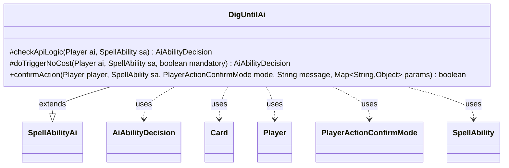

---
aliases:
  - DigUntilAi
tags:
  - java/class
  - module/forge-ai
  - pkg/forge/ai/ability
fqn: forge.ai.ability.DigUntilAi
package: forge.ai.ability
module: forge-ai
kind: Class
---

# DigUntilAi

**Package:** `forge.ai.ability` &nbsp; **Module:** `forge-ai` &nbsp; **Kind:** Class



## Relationships
**Extends:**
- [[forge.ai.SpellAbilityAi|SpellAbilityAi]]
**Uses:**
- [[forge.ai.AiAbilityDecision|AiAbilityDecision]]
- [[forge.game.card.Card|Card]]
- [[forge.game.player.Player|Player]]
- [[forge.game.player.PlayerActionConfirmMode|PlayerActionConfirmMode]]
- [[forge.game.spellability.SpellAbility|SpellAbility]]

## Design Description

`DigUntilAi` supplies the AI decision logic for "dig until" spell abilities — effects that reveal cards from a library until a condition is met. As a concrete subclass of `SpellAbilityAi`, it overrides the framework's decision hooks: `checkApiLogic` weighs whether the AI should activate the ability, scaling its willingness by timing (instant vs. sorcery speed, opponent's end of turn) and guarding against self-milling decks like Hermit Druid, while also assigning targets and resolving an X mana cost; `doTriggerNoCost` handles forced/triggered resolution by selecting an appropriate player target; and `confirmAction` answers ability-specific prompts such as the Oath of Druids choice.

The class collaborates with `Player`, `SpellAbility`, and `Card` to inspect game state (library contents, phase, zones), and returns its verdicts as `AiAbilityDecision` values paired with `AiPlayDecision` codes. It holds no state, acting purely as a stateless strategy plugged into Forge's ability-handling framework, with card-specific behavior driven by the `AILogic` parameter rather than subclassing.

## Source
`forge-ai/src/main/java/forge/ai/ability/DigUntilAi.java`

```java
package forge.ai.ability;

import forge.ai.*;
import forge.game.card.Card;
import forge.game.card.CardLists;
import forge.game.card.CardPredicates;
import forge.game.phase.PhaseType;
import forge.game.player.Player;
import forge.game.player.PlayerActionConfirmMode;
import forge.game.spellability.SpellAbility;
import forge.game.zone.ZoneType;

import java.util.List;
import java.util.Map;

public class DigUntilAi extends SpellAbilityAi {

    @Override
    protected AiAbilityDecision checkApiLogic(Player ai, SpellAbility sa) {
        Card source = sa.getHostCard();
        final String logic = sa.getParamOrDefault("AILogic", "");
        double chance = .4; // 40 percent chance with instant speed stuff
        if (isSorcerySpeed(sa, ai)) {
            chance = .667; // 66.7% chance for sorcery speed (since it will
                           // never activate EOT)
        }
        // if we don't use anything now, we wasted our opportunity.
        if ((ai.getGame().getPhaseHandler().is(PhaseType.END_OF_TURN))
                && (!ai.getGame().getPhaseHandler().isPlayerTurn(ai))) {
            chance = 1;
        }

        Player libraryOwner = ai;
        Player opp = AiAttackController.choosePreferredDefenderPlayer(ai);

        if ("DontMillSelf".equals(logic)) {
            // A card that digs for specific things and puts everything revealed before it into graveyard
            // (e.g. Hermit Druid) - don't use it to mill itself and also make sure there's enough playable
            // material in the library after using it several times.
            // TODO: maybe this should happen for any DigUntil SA with RevealedDestination$ Graveyard?
            if (ai.getCardsIn(ZoneType.Library).size() < 20) {
                return new AiAbilityDecision(0, AiPlayDecision.CantPlayAi);
            }
            if ("Land.Basic".equals(sa.getParam("Valid"))
                    && ai.getZone(ZoneType.Hand).contains(CardPredicates.LANDS_PRODUCING_MANA)) {
                // We already have a mana-producing land in hand, so bail
                // until opponent's end of turn phase!
                // But we still want more (and want to fill grave) if nothing better to do then
                // This is important for Replenish/Living Death type decks
                if (!ai.getGame().getPhaseHandler().is(PhaseType.END_OF_TURN)
                        && !ai.getGame().getPhaseHandler().isPlayerTurn(ai)) {
                    return new AiAbilityDecision(0, AiPlayDecision.CantPlayAi);
                }
            }
        }

        if (sa.usesTargeting()) {
            sa.resetTargets();
            if (!sa.canTarget(opp)) {
                return new AiAbilityDecision(0, AiPlayDecision.CantPlayAi);
            }
            sa.getTargets().add(opp);
            libraryOwner = opp;
        } else {
            if (sa.hasParam("Valid")) {
                final String valid = sa.getParam("Valid");
                if (CardLists.getValidCards(ai.getCardsIn(ZoneType.Library), valid, source.getController(), source, sa).isEmpty()) {
                    return new AiAbilityDecision(0, AiPlayDecision.CantPlayAi);
                }
            }
        }

        final String num = sa.getParam("Amount");
        if (num != null && num.equals("X") && sa.getSVar(num).equals("Count$xPaid")) {
            // Set PayX here to maximum value.
            SpellAbility root = sa.getRootAbility();
            if (root.getXManaCostPaid() == null) {
                int numCards = ComputerUtilCost.setMaxXValue(sa, ai, sa.isTrigger());
                if (numCards <= 0) {
                    return new AiAbilityDecision(0, AiPlayDecision.CantPlayAi);
                }
                root.setXManaCostPaid(numCards);
            }
        }

        // return false if nothing to dig into
        if (libraryOwner.getCardsIn(ZoneType.Library).isEmpty()) {
            return new AiAbilityDecision(0, AiPlayDecision.CantPlayAi);
        }

        return new AiAbilityDecision(100, AiPlayDecision.WillPlay);
    }

    @Override
    protected AiAbilityDecision doTriggerNoCost(Player ai, SpellAbility sa, boolean mandatory) {
        if (sa.usesTargeting()) {
            sa.resetTargets();
            if (sa.isCurse()) {
                for (Player opp : ai.getOpponents()) {
                    if (sa.canTarget(opp)) {
                        sa.getTargets().add(opp);
                        break;
                    }
                }
                if (mandatory && sa.getTargets().isEmpty() && sa.canTarget(ai)) {
                    sa.getTargets().add(ai);
                }
            } else {
                if (sa.canTarget(ai)) {
                    sa.getTargets().add(ai);
                }
            }
        }

        return new AiAbilityDecision(100, AiPlayDecision.WillPlay);
    }

    /* (non-Javadoc)
     * @see forge.card.ability.SpellAbilityAi#confirmAction(forge.card.spellability.SpellAbility, forge.game.player.PlayerActionConfirmMode, java.lang.String)
     */
    @Override
    public boolean confirmAction(Player player, SpellAbility sa, PlayerActionConfirmMode mode, String message, Map<String, Object> params) {
        if (sa.hasParam("AILogic")) {
            final String logic = sa.getParam("AILogic");
            if ("OathOfDruids".equals(logic)) {
                final List<Card> creaturesInLibrary =
                        CardLists.filter(player.getCardsIn(ZoneType.Library), CardPredicates.CREATURES);
                final List<Card> creaturesInBattlefield = player.getCreaturesInPlay();
                // if there are at least 3 creatures in library,
                // or none in play with one in library, oath
                return creaturesInLibrary.size() > 2
                        || (creaturesInBattlefield.size() == 0 && creaturesInLibrary.size() > 0);

            }
        }
        return true;
    }
}
```
