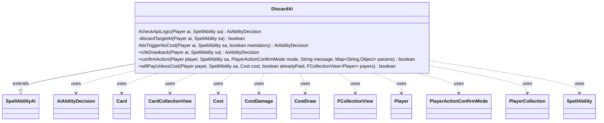

---
aliases:
  - DiscardAi
tags:
  - java/class
  - module/forge-ai
  - pkg/forge/ai/ability
fqn: forge.ai.ability.DiscardAi
package: forge.ai.ability
module: forge-ai
kind: Class
---

# DiscardAi

**Package:** `forge.ai.ability` &nbsp; **Module:** `forge-ai` &nbsp; **Kind:** Class



## Relationships
**Extends:**
- [[forge.ai.SpellAbilityAi|SpellAbilityAi]]
**Uses:**
- [[forge.ai.AiAbilityDecision|AiAbilityDecision]]
- [[forge.game.card.Card|Card]]
- [[forge.game.card.CardCollectionView|CardCollectionView]]
- [[forge.game.cost.Cost|Cost]]
- [[forge.game.cost.CostDamage|CostDamage]]
- [[forge.game.cost.CostDraw|CostDraw]]
- [[forge.game.player.Player|Player]]
- [[forge.game.player.PlayerActionConfirmMode|PlayerActionConfirmMode]]
- [[forge.game.player.PlayerCollection|PlayerCollection]]
- [[forge.game.spellability.SpellAbility|SpellAbility]]
- [[forge.util.collect.FCollectionView|FCollectionView]]

## Design Description

DiscardAi is the AI decision module for discard-type spell abilities, extending `SpellAbilityAi` to plug into Forge's ability-resolution framework. It overrides the AI hooks—`checkApiLogic`, `doTriggerNoCost`, `chkDrawback`, `confirmAction`, and `willPayUnlessCost`—to decide whether the computer player should activate, trigger, or pay for an effect that forces a `Player` to discard, returning its verdicts as `AiAbilityDecision` objects. Its core helper `discardTargetAI` selects a viable opponent to target, skipping those with empty hands or discard immunity (e.g. Tamiyo).

The design favors heuristic, card-aware evaluation: it special-cases named cards and `AILogic` variants, defers most discards until after Main 2, inspects hand sizes and castability via `CardCollectionView`, and weighs cost trade-offs (`CostDamage`, `CostDraw`) when deciding whether to pay an "unless" cost—guarding against self-decking and pointless life loss. Numerous TODOs mark it as an intentionally incremental, extensible heuristic.

## Source
`forge-ai/src/main/java/forge/ai/ability/DiscardAi.java`

```java
package forge.ai.ability;

import java.util.Collections;
import java.util.List;
import java.util.Map;

import forge.ai.*;
import forge.game.ability.AbilityUtils;
import forge.game.card.Card;
import forge.game.card.CardCollectionView;
import forge.game.card.CardLists;
import forge.game.card.CardPredicates;
import forge.game.cost.Cost;
import forge.game.cost.CostDamage;
import forge.game.cost.CostDraw;
import forge.game.phase.PhaseType;
import forge.game.player.Player;
import forge.game.player.PlayerActionConfirmMode;
import forge.game.player.PlayerCollection;
import forge.game.player.PlayerPredicates;
import forge.game.spellability.SpellAbility;
import forge.game.zone.ZoneType;
import forge.util.MyRandom;
import forge.util.collect.FCollectionView;

public class DiscardAi extends SpellAbilityAi {

    @Override
    protected AiAbilityDecision checkApiLogic(Player ai, SpellAbility sa) {
        final Card source = sa.getHostCard();
        final String sourceName = ComputerUtilAbility.getAbilitySourceName(sa);
        final String aiLogic = sa.getParamOrDefault("AILogic", "");

        if ("Chandra, Flamecaller".equals(sourceName)) {
            final int hand = ai.getCardsIn(ZoneType.Hand).size();
            if (MyRandom.getRandom().nextFloat() < (1.0 / (1 + hand))) {
                return new AiAbilityDecision(100, AiPlayDecision.WillPlay);
            }
            return new AiAbilityDecision(0, AiPlayDecision.CantPlayAi);
        }

        if (aiLogic.equals("VolrathsShapeshifter")) {
            return SpecialCardAi.VolrathsShapeshifter.consider(ai, sa);
        }

        final boolean humanHasHand = !ai.getWeakestOpponent().getCardsIn(ZoneType.Hand).isEmpty();

        if (sa.usesTargeting()) {
            if (!discardTargetAI(ai, sa)) {
                return new AiAbilityDecision(0, AiPlayDecision.CantPlayAi);
            }
        } else {
            // TODO: Add appropriate restrictions
            final List<Player> players = AbilityUtils.getDefinedPlayers(source, sa.getParam("Defined"), sa);

            if (players.size() == 1) {
                if (players.get(0) == ai) {
                    // the ai should only be using something like this if he has
                    // few cards in hand,
                    // cards like this better have a good drawback to be in the AIs deck
                } else {
                    // defined to the human, so that's fine as long the human has cards
                    if (!humanHasHand) {
                        return new AiAbilityDecision(0, AiPlayDecision.CantPlayAi);
                    }
                }
            } else {
                // Both players discard, any restrictions?
            }
        }

        if (sa.hasParam("NumCards")) {
           if (sa.getParam("NumCards").equals("X") && sa.getSVar("X").equals("Count$xPaid")) {
                // Set PayX here to maximum value.
                final int cardsToDiscard = Math.min(ComputerUtilCost.setMaxXValue(sa, ai, sa.isTrigger()), ai.getWeakestOpponent()
                        .getCardsIn(ZoneType.Hand).size());
                if (cardsToDiscard < 1) {
                    return new AiAbilityDecision(0, AiPlayDecision.CantPlayAi);
                }
                sa.setXManaCostPaid(cardsToDiscard);
            } else if (AbilityUtils.calculateAmount(source, sa.getParam("NumCards"), sa) < 1) {
               return new AiAbilityDecision(0, AiPlayDecision.CantPlayAi);
            }
        }

        // TODO: Improve support for Discard AI for cards with AnyNumber set to true.
        if (sa.hasParam("AnyNumber")) {
            if ("DiscardUncastableAndExcess".equals(aiLogic)) {
                final CardCollectionView inHand = ai.getCardsIn(ZoneType.Hand);
                final int numLandsOTB = CardLists.count(ai.getCardsIn(ZoneType.Hand), CardPredicates.LANDS);
                int numDiscard = 0;
                int numOppInHand = 0;
                for (Player p : ai.getGame().getPlayers()) {
                    if (p.getCardsIn(ZoneType.Hand).size() > numOppInHand) {
                        numOppInHand = p.getCardsIn(ZoneType.Hand).size();
                    }
                }
                for (Card c : inHand) {
                    if (c.equals(source)) { continue; }
                    if (c.hasSVar("DoNotDiscardIfAble") || c.hasSVar("IsReanimatorCard")) { continue; }
                    if (c.isCreature() && !ComputerUtilMana.hasEnoughManaSourcesToCast(c.getSpellPermanent(), ai)) {
                        numDiscard++;
                    }
                    if ((c.isLand() && numLandsOTB >= 5) || (c.getFirstSpellAbility() != null && !ComputerUtilMana.hasEnoughManaSourcesToCast(c.getFirstSpellAbility(), ai))) {
                        if (numDiscard + 1 <= numOppInHand) {
                            numDiscard++;
                        }
                    }
                }
                if (numDiscard == 0) {
                    return new AiAbilityDecision(0, AiPlayDecision.CantPlayAi);
                }
            }
        }

        // Don't use discard abilities before main 2 if possible
        if (ai.getGame().getPhaseHandler().getPhase().isBefore(PhaseType.MAIN2)
                && !sa.hasParam("ActivationPhases") && !aiLogic.startsWith("AnyPhase")) {
            return new AiAbilityDecision(0, AiPlayDecision.CantPlayAi);
        }

        if (aiLogic.equals("AnyPhaseIfFavored")) {
            if (ai.getGame().getCombat() != null) {
                if (ai.getCardsIn(ZoneType.Hand).size() < ai.getGame().getCombat().getDefenderPlayerByAttacker(source).getCardsIn(ZoneType.Hand).size()) {
                    return new AiAbilityDecision(0, AiPlayDecision.CantPlayAi);
                }
            }
        }

        // Don't tap creatures that may be able to block
        if (ComputerUtil.waitForBlocking(sa)) {
            return new AiAbilityDecision(0, AiPlayDecision.CantPlayAi);
        }

        // some other variables here, like handsize vs. maxHandSize

        return new AiAbilityDecision(100, AiPlayDecision.WillPlay);
    }

    private boolean discardTargetAI(final Player ai, final SpellAbility sa) {
        final PlayerCollection opps = ai.getOpponents();
        Collections.shuffle(opps);
        for (Player opp : opps) {
            if (opp.getCardsIn(ZoneType.Hand).isEmpty() && !ComputerUtil.activateForCost(sa, ai)) {
                continue;
            } else if (!opp.canDiscardBy(sa, true)) { // e.g. Tamiyo, Collector of Tales
                continue;
            }
            // TODO when DiscardValid is used and opponent plays with hand revealed, check if he has matching cards
            if (sa.usesTargeting()) {
                if (sa.canTarget(opp)) {
                    sa.resetTargets();
                    sa.getTargets().add(opp);
                    return true;
                }
            }
        }
        return false;
    }

    @Override
    protected AiAbilityDecision doTriggerNoCost(Player ai, SpellAbility sa, boolean mandatory) {
        if (sa.usesTargeting()) {
            PlayerCollection targetableOpps = ai.getOpponents().filter(PlayerPredicates.isTargetableBy(sa));
            Player opp = targetableOpps.min(PlayerPredicates.compareByLife());
            if (!discardTargetAI(ai, sa)) {
                if (mandatory && opp != null) {
                    sa.getTargets().add(opp);
                } else if (mandatory && sa.canTarget(ai)) {
                    sa.getTargets().add(ai);
                } else {
                    return new AiAbilityDecision(0, AiPlayDecision.CantPlayAi);
                }
            }
        } else {
            if (sa.hasParam("AILogic")) {
            	if ("AtLeast2".equals(sa.getParam("AILogic"))) {
            		final List<Player> players = AbilityUtils.getDefinedPlayers(sa.getHostCard(), sa.getParam("Defined"), sa);
            		if (players.isEmpty() || players.get(0).getCardsIn(ZoneType.Hand).size() < 2) {
            			return new AiAbilityDecision(0, AiPlayDecision.CantPlayAi);
            		}
            	}
            }
            if ("X".equals(sa.getParam("RevealNumber")) && sa.getSVar("X").equals("Count$xPaid")) {
                // Set PayX here to maximum value.
                final int cardsToDiscard = Math.min(ComputerUtilCost.setMaxXValue(sa, ai, true), ai.getWeakestOpponent()
                        .getCardsIn(ZoneType.Hand).size());
                sa.setXManaCostPaid(cardsToDiscard);
            }
        }

        return new AiAbilityDecision(100, AiPlayDecision.WillPlay);
    }

    @Override
    public AiAbilityDecision chkDrawback(Player ai, SpellAbility sa) {
        // Drawback AI improvements
        // if parent draws cards, make sure cards in hand + cards drawn > 0
        if (sa.usesTargeting()) {
            if (discardTargetAI(ai, sa)) {
                return new AiAbilityDecision(100, AiPlayDecision.WillPlay);
            }
            return new AiAbilityDecision(0, AiPlayDecision.TargetingFailed);
        }
        // TODO: check for some extra things
        return new AiAbilityDecision(100, AiPlayDecision.WillPlay);
    }

    public boolean confirmAction(Player player, SpellAbility sa, PlayerActionConfirmMode mode, String message, Map<String, Object> params) {
        if (mode == PlayerActionConfirmMode.Random) {
            // TODO For now AI will always discard Random used currently with: Balduvian Horde and similar cards
            return true;
        }
        return super.confirmAction(player, sa, mode, message, params);
    }

    @Override
    public boolean willPayUnlessCost(Player payer, SpellAbility sa, Cost cost, boolean alreadyPaid, FCollectionView<Player> payers) {
        final Card host = sa.getHostCard();
        final String aiLogic = sa.getParam("UnlessAI");
        if ("Never".equals(aiLogic)) { return false; }

        CardCollectionView hand = payer.getCardsIn(ZoneType.Hand);

        if ("Hand".equals(sa.getParam("Mode"))) {
            if (hand.size() <= 2) {
                return false;
            }
        } else {
            int amount = AbilityUtils.calculateAmount(host, sa.getParam("NumCards"), sa);
            // damage cost with prevention?
            if (cost.hasSpecificCostType(CostDamage.class)) {
                if (!payer.canLoseLife()) {
                    return false;
                }
                final CostDamage pay = cost.getCostPartByType(CostDamage.class);
                int realDamage = ComputerUtilCombat.predictDamageTo(payer, pay.getAbilityAmount(sa), host, false);
                if (realDamage > payer.getLife()) {
                    return false;
                }
                if (realDamage > amount * 2) { // two life points per not discarded card?
                    return false;
                }
            }

            boolean isDrawDiscard = cost.hasOnlySpecificCostType(CostDraw.class) && sa.hasParam("UnlessSwitched");
            // TODO should AI do draw + discard effects when hand is empty?
            // maybe if deck supports Graveyard or discard effects?
            if (hand.isEmpty()) {
                return false;
            }
            // is it always better?
            if (isDrawDiscard) {
                // check to not deck yourself
                int libSize = payer.getCardsIn(ZoneType.Library).size();
                if (amount >= libSize - 3) {
                    if (payer.isCardInPlay("Laboratory Maniac") && !payer.cantWin()) {
                        return true;
                    }
                    // Don't deck yourself
                    return false;
                }
                return true;
            }
        }

        return super.willPayUnlessCost(payer, sa, cost, alreadyPaid, payers);
    }
}
```
