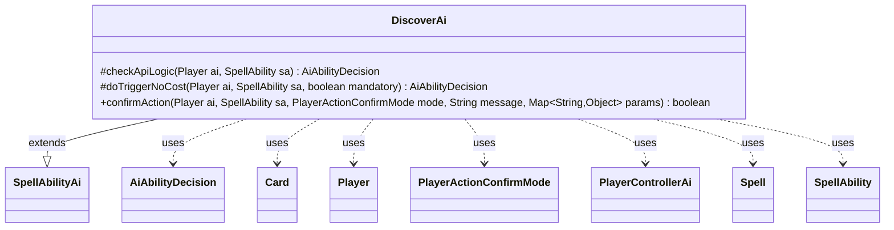

---
aliases:
  - DiscoverAi
tags:
  - java/class
  - module/forge-ai
  - pkg/forge/ai/ability
fqn: forge.ai.ability.DiscoverAi
package: forge.ai.ability
module: forge-ai
kind: Class
---

# DiscoverAi

**Package:** `forge.ai.ability`   **Module:** `forge-ai`   **Kind:** Class



## Relationships
**Extends:**
- [[forge.ai.SpellAbilityAi|SpellAbilityAi]]
**Uses:**
- [[forge.ai.AiAbilityDecision|AiAbilityDecision]]
- [[forge.ai.PlayerControllerAi|PlayerControllerAi]]
- [[forge.game.card.Card|Card]]
- [[forge.game.player.Player|Player]]
- [[forge.game.player.PlayerActionConfirmMode|PlayerActionConfirmMode]]
- [[forge.game.spellability.Spell|Spell]]
- [[forge.game.spellability.SpellAbility|SpellAbility]]

## Design Description

DiscoverAi implements the AI decision-making for cards with the "Discover" mechanic, slotting into the engine's ability-handler hierarchy by extending `SpellAbilityAi`. Like its siblings in `forge.ai.ability`, it overrides the framework's hook methods so the engine can consult it whenever a Discover ability is evaluated. It declines to initiate the effect on its own (`checkApiLogic` always returns `CantPlayAi`) but will resolve it when forced, reflecting that Discover is a triggered/mandatory outcome rather than a proactively cast spell.

Its substantive logic lives in `confirmAction`, where it inspects the discovered card's basic spells via `AbilityUtils` and delegates the actual playability judgment to the controlling `PlayerControllerAi`'s evaluator. The code guards two concrete failure modes—land-backed MDFCs that would trigger a `ClassCastException`, and spells with invalid target counts that would corrupt the stack—showing design intent focused on defensive correctness over aggressive value extraction.

## Source
`forge-ai/src/main/java/forge/ai/ability/DiscoverAi.java`

```java
package forge.ai.ability;

import forge.ai.*;
import forge.game.ability.AbilityUtils;
import forge.game.card.Card;
import forge.game.player.Player;
import forge.game.player.PlayerActionConfirmMode;
import forge.game.spellability.Spell;
import forge.game.spellability.SpellAbility;

import java.util.Map;

public class DiscoverAi extends SpellAbilityAi {

    @Override
    protected AiAbilityDecision checkApiLogic(final Player ai, final SpellAbility sa) {
        return new AiAbilityDecision(0, AiPlayDecision.CantPlayAi);
    }

    /**
     * <p>
     * doTriggerAINoCost
     * </p>
     * @param sa
     *            a {@link forge.game.spellability.SpellAbility} object.
     * @param mandatory
     *            a boolean.
     *
     * @return a boolean.
     */
    @Override
    protected AiAbilityDecision doTriggerNoCost(final Player ai, final SpellAbility sa, final boolean mandatory) {
        if (mandatory) {
            return new AiAbilityDecision(100, AiPlayDecision.WillPlay);
        }

        return checkApiLogic(ai, sa);
    }

    @Override
    public boolean confirmAction(Player ai, SpellAbility sa, PlayerActionConfirmMode mode, String message, Map<String, Object> params) {
        Card c = (Card)params.get("Card");
        for (SpellAbility s : AbilityUtils.getBasicSpellsFromPlayEffect(c, ai)) {
            if (s.isLandAbility()) {
                // return false or we get a ClassCastException later if the AI encounters MDFC with land backside
                return false;
            }
            Spell spell = (Spell) s;
            if (AiPlayDecision.WillPlay == ((PlayerControllerAi)ai.getController()).getAi().canPlayFromEffectAI(spell, false, true)) {
                // Before accepting, see if the spell has a valid number of targets (it should at this point).
                // Proceeding past this point if the spell is not correctly targeted will result
                // in "Failed to add to stack" error and the card disappearing from the game completely.
                if (!spell.isTargetNumberValid()) {
                    // if we won't be able to pay the cost, don't choose the card
                    return false;
                }
                return true;
            }
        }
        return false;
    }
}
```

## Python
`forge/ai/ability/DiscoverAi.py`

```python
from forge.ai.SpellAbilityAi import SpellAbilityAi
from forge.ai.AiAbilityDecision import AiAbilityDecision
from forge.ai.AiPlayDecision import AiPlayDecision
from forge.ai.PlayerControllerAi import PlayerControllerAi
from forge.game.ability.AbilityUtils import AbilityUtils
from forge.game.card.Card import Card
from forge.game.player.Player import Player
from forge.game.player.PlayerActionConfirmMode import PlayerActionConfirmMode
from forge.game.spellability.Spell import Spell
from forge.game.spellability.SpellAbility import SpellAbility

from typing import Map


class DiscoverAi(SpellAbilityAi):

    def checkApiLogic(self, ai: Player, sa: SpellAbility) -> AiAbilityDecision:
        return AiAbilityDecision(0, AiPlayDecision.CantPlayAi)

    def doTriggerNoCost(self, ai: Player, sa: SpellAbility, mandatory: bool) -> AiAbilityDecision:
        if mandatory:
            return AiAbilityDecision(100, AiPlayDecision.WillPlay)

        return self.checkApiLogic(ai, sa)

    def confirmAction(self, ai: Player, sa: SpellAbility, mode: PlayerActionConfirmMode, message: str, params: dict[str, object]) -> bool:
        c = params.get("Card")
        for s in AbilityUtils.getBasicSpellsFromPlayEffect(c, ai):
            if s.isLandAbility():
                # return false or we get a ClassCastException later if the AI encounters MDFC with land backside
                return False
            spell = s
            if AiPlayDecision.WillPlay == ai.getController().getAi().canPlayFromEffectAI(spell, False, True):
                # Before accepting, see if the spell has a valid number of targets (it should at this point).
                # Proceeding past this point if the spell is not correctly targeted will result
                # in "Failed to add to stack" error and the card disappearing from the game completely.
                if not spell.isTargetNumberValid():
                    # if we won't be able to pay the cost, don't choose the card
                    return False
                return True
        return False
```
