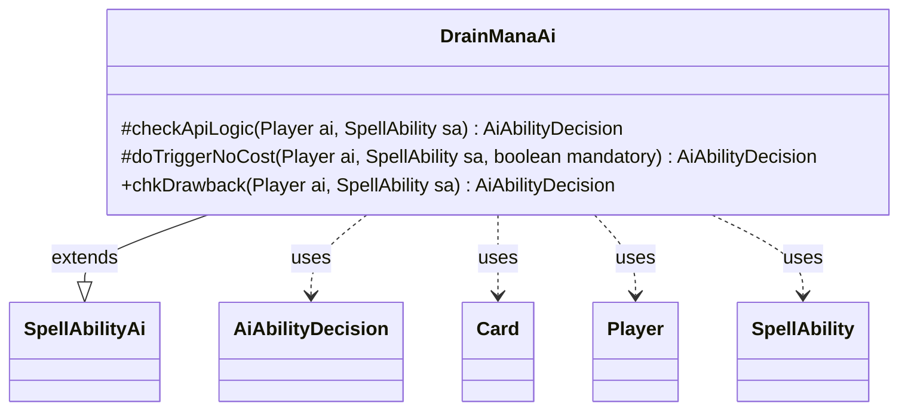

---
aliases:
  - DrainManaAi
tags:
  - java/class
  - module/forge-ai
  - pkg/forge/ai/ability
fqn: forge.ai.ability.DrainManaAi
package: forge.ai.ability
module: forge-ai
kind: Class
---

# DrainManaAi

**Package:** `forge.ai.ability`   **Module:** `forge-ai`   **Kind:** Class



## Relationships
**Extends:**
- [[forge.ai.SpellAbilityAi|SpellAbilityAi]]
**Uses:**
- [[forge.ai.AiAbilityDecision|AiAbilityDecision]]
- [[forge.game.card.Card|Card]]
- [[forge.game.player.Player|Player]]
- [[forge.game.spellability.SpellAbility|SpellAbility]]

## Design Description

Drain Mana ability.

DrainManaAi supplies the AI's decision logic for resolving "drain mana" spell abilities, which tap or empty an opponent's mana pool. As a concrete subclass of `SpellAbilityAi`, it overrides the framework's evaluation hooks—`checkApiLogic` for proactive casting, `doTriggerNoCost` for triggered uses, and `chkDrawback` for sub-ability drawbacks—each returning an `AiAbilityDecision` that pairs a confidence score with an `AiPlayDecision` verdict.

Its core intent is to steer the effect toward the AI's weakest opponent: when the ability uses targeting it resets and retargets that opponent, otherwise it inspects the `Defined` players (via `AbilityUtils`) and declines to play unless the opponent is affected (and, for drawbacks, refuses to drain itself). Code comments note the logic is constrained because the AI cannot yet act during the human's turn.

## Source
`forge-ai/src/main/java/forge/ai/ability/DrainManaAi.java`

```java
package forge.ai.ability;

import forge.ai.AiAbilityDecision;
import forge.ai.AiPlayDecision;
import forge.ai.SpellAbilityAi;
import forge.game.ability.AbilityUtils;
import forge.game.card.Card;
import forge.game.player.Player;
import forge.game.spellability.SpellAbility;

import java.util.List;

public class DrainManaAi extends SpellAbilityAi {

    @Override
    protected AiAbilityDecision checkApiLogic(Player ai, SpellAbility sa) {
        // AI cannot use this properly until he can use SAs during Humans turn

        final Card source = sa.getHostCard();
        final Player opp = ai.getWeakestOpponent();

        if (!sa.usesTargeting()) {
            // assume we are looking to tap human's stuff
            // TODO - check for things with untap abilities, and don't tap those.
            final List<Player> defined = AbilityUtils.getDefinedPlayers(source, sa.getParam("Defined"), sa);

            if (!defined.contains(opp)) {
                return new AiAbilityDecision(0, AiPlayDecision.CantPlayAi);
            }
        } else {
            sa.resetTargets();
            sa.getTargets().add(opp);
        }

        return new AiAbilityDecision(100, AiPlayDecision.WillPlay);
    }

    @Override
    protected AiAbilityDecision doTriggerNoCost(Player ai, SpellAbility sa, boolean mandatory) {
        final Player opp = ai.getWeakestOpponent();

        final Card source = sa.getHostCard();

        if (!sa.usesTargeting()) {
            if (mandatory) {
                return new AiAbilityDecision(100, AiPlayDecision.WillPlay);
            } else {
                final List<Player> defined = AbilityUtils.getDefinedPlayers(source, sa.getParam("Defined"), sa);

                if (defined.contains(opp)) {
                    return new AiAbilityDecision(100, AiPlayDecision.WillPlay);
                } else {
                    return new AiAbilityDecision(0, AiPlayDecision.CantPlayAi);
                }
            }
        } else {
            sa.resetTargets();
            sa.getTargets().add(opp);
        }

        return new AiAbilityDecision(100, AiPlayDecision.WillPlay);
    }

    @Override
    public AiAbilityDecision chkDrawback(Player ai, SpellAbility sa) {
        // AI cannot use this properly until he can use SAs during Humans turn
        final Card source = sa.getHostCard();

        if (!sa.usesTargeting()) {
            final List<Player> defined = AbilityUtils.getDefinedPlayers(source, sa.getParam("Defined"), sa);

            if (defined.contains(ai)) {
                return new AiAbilityDecision(0, AiPlayDecision.CantPlayAi);
            }
        } else {
            sa.resetTargets();
            sa.getTargets().add(ai.getWeakestOpponent());
        }

        return new AiAbilityDecision(100, AiPlayDecision.WillPlay);
    }
}
```

## Python
`forge/ai/ability/DrainManaAi.py`

```python
from forge.ai.AiAbilityDecision import AiAbilityDecision
from forge.ai.AiPlayDecision import AiPlayDecision
from forge.ai.SpellAbilityAi import SpellAbilityAi
from forge.game.ability.AbilityUtils import AbilityUtils
from forge.game.card.Card import Card
from forge.game.player.Player import Player
from forge.game.spellability.SpellAbility import SpellAbility


class DrainManaAi(SpellAbilityAi):

    def checkApiLogic(self, ai: Player, sa: SpellAbility) -> AiAbilityDecision:
        # AI cannot use this properly until he can use SAs during Humans turn

        source = sa.getHostCard()
        opp = ai.getWeakestOpponent()

        if not sa.usesTargeting():
            # assume we are looking to tap human's stuff
            # TODO - check for things with untap abilities, and don't tap those.
            defined = AbilityUtils.getDefinedPlayers(source, sa.getParam("Defined"), sa)

            if opp not in defined:
                return AiAbilityDecision(0, AiPlayDecision.CantPlayAi)
        else:
            sa.resetTargets()
            sa.getTargets().add(opp)

        return AiAbilityDecision(100, AiPlayDecision.WillPlay)

    def doTriggerNoCost(self, ai: Player, sa: SpellAbility, mandatory: bool) -> AiAbilityDecision:
        opp = ai.getWeakestOpponent()

        source = sa.getHostCard()

        if not sa.usesTargeting():
            if mandatory:
                return AiAbilityDecision(100, AiPlayDecision.WillPlay)
            else:
                defined = AbilityUtils.getDefinedPlayers(source, sa.getParam("Defined"), sa)

                if opp in defined:
                    return AiAbilityDecision(100, AiPlayDecision.WillPlay)
                else:
                    return AiAbilityDecision(0, AiPlayDecision.CantPlayAi)
        else:
            sa.resetTargets()
            sa.getTargets().add(opp)

        return AiAbilityDecision(100, AiPlayDecision.WillPlay)

    def chkDrawback(self, ai: Player, sa: SpellAbility) -> AiAbilityDecision:
        # AI cannot use this properly until he can use SAs during Humans turn
        source = sa.getHostCard()

        if not sa.usesTargeting():
            defined = AbilityUtils.getDefinedPlayers(source, sa.getParam("Defined"), sa)

            if ai in defined:
                return AiAbilityDecision(0, AiPlayDecision.CantPlayAi)
        else:
            sa.resetTargets()
            sa.getTargets().add(ai.getWeakestOpponent())

        return AiAbilityDecision(100, AiPlayDecision.WillPlay)
```
