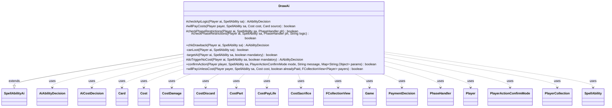

---
aliases:
  - DrawAi
tags:
  - java/class
  - module/forge-ai
  - pkg/forge/ai/ability
fqn: forge.ai.ability.DrawAi
package: forge.ai.ability
module: forge-ai
kind: Class
---

# DrawAi

**Package:** `forge.ai.ability` &nbsp; **Module:** `forge-ai` &nbsp; **Kind:** Class



## Relationships
**Extends:**
- [[forge.ai.SpellAbilityAi|SpellAbilityAi]]
**Uses:**
- [[forge.ai.AiAbilityDecision|AiAbilityDecision]]
- [[forge.ai.AiCostDecision|AiCostDecision]]
- [[forge.game.Game|Game]]
- [[forge.game.card.Card|Card]]
- [[forge.game.cost.Cost|Cost]]
- [[forge.game.cost.CostDamage|CostDamage]]
- [[forge.game.cost.CostDiscard|CostDiscard]]
- [[forge.game.cost.CostPart|CostPart]]
- [[forge.game.cost.CostPayLife|CostPayLife]]
- [[forge.game.cost.CostSacrifice|CostSacrifice]]
- [[forge.game.cost.PaymentDecision|PaymentDecision]]
- [[forge.game.phase.PhaseHandler|PhaseHandler]]
- [[forge.game.player.Player|Player]]
- [[forge.game.player.PlayerActionConfirmMode|PlayerActionConfirmMode]]
- [[forge.game.player.PlayerCollection|PlayerCollection]]
- [[forge.game.spellability.SpellAbility|SpellAbility]]
- [[forge.util.collect.FCollectionView|FCollectionView]]

## Design Description

DrawAi supplies the artificial-intelligence decision logic for "draw card" spells and abilities in Forge, extending `SpellAbilityAi` to override the standard hooks (`checkApiLogic`, `willPayCosts`, `checkPhaseRestrictions`, `doTriggerNoCost`, `chkDrawback`, `confirmAction`, and `willPayUnlessCost`). Its central responsibility is deciding whether, when, and at whom a draw effect should be aimed, returning `AiAbilityDecision`/`AiPlayDecision` verdicts to the engine. It collaborates with `Player`, `SpellAbility`, `PhaseHandler`, and `Game` to read board state, and inspects `Cost` parts (`CostSacrifice`, `CostPayLife`, `CostDamage`, `CostDiscard`) via `AiCostDecision`/`PaymentDecision` to judge affordability.

Notable design intent lies in the private `targetAI` and `canLoot` helpers: the AI guards against decking itself or overfilling its hand, accounts for `Laboratory Maniac` win conditions, and weighs draw-plus-discard loots for net card advantage. Special cards (Yawgmoth's Bargain, Veil of Summer, Risk Factor, Necrologia) are routed to bespoke `AILogic` branches, while X-cost draws are sized to a computed "safe" value, reflecting careful risk management around self-harm.

## Source
`forge-ai/src/main/java/forge/ai/ability/DrawAi.java`

```java
/*

* Forge: Play Magic: the Gathering.
 * Copyright (C) 2011  Forge Team
 *
 * This program is free software: you can redistribute it and/or modify
 * it under the terms of the GNU General Public License as published by
 * the Free Software Foundation, either version 3 of the License, or
 * (at your option) any later version.
 * 
 * This program is distributed in the hope that it will be useful,
 * but WITHOUT ANY WARRANTY; without even the implied warranty of
 * MERCHANTABILITY or FITNESS FOR A PARTICULAR PURPOSE.  See the
 * GNU General Public License for more details.
 * 
 * You should have received a copy of the GNU General Public License
 * along with this program.  If not, see <http://www.gnu.org/licenses/>.
 */
package forge.ai.ability;

import java.util.Map;

import forge.ai.*;
import forge.game.Game;
import forge.game.ability.AbilityUtils;
import forge.game.ability.ApiType;
import forge.game.card.Card;
import forge.game.card.CounterEnumType;
import forge.game.cost.*;
import forge.game.phase.PhaseHandler;
import forge.game.phase.PhaseType;
import forge.game.player.*;
import forge.game.spellability.SpellAbility;
import forge.game.zone.ZoneType;
import forge.util.MyRandom;
import forge.util.collect.FCollectionView;

public class DrawAi extends SpellAbilityAi {

    /* (non-Javadoc)
     * @see forge.ai.SpellAbilityAi#checkApiLogic(forge.game.player.Player, forge.game.spellability.SpellAbility)
     */
    @Override
    protected AiAbilityDecision checkApiLogic(Player ai, SpellAbility sa) {
        if (!targetAI(ai, sa, false)) {
            return new AiAbilityDecision(0, AiPlayDecision.TargetingFailed);
        }

        if (sa.usesTargeting()) {
            final Player player = sa.getTargets().getFirstTargetedPlayer();
            if (player != null && player.isOpponentOf(ai)) {
                return new AiAbilityDecision(0, AiPlayDecision.CantPlayAi);
            }
        }

        if (ComputerUtil.playImmediately(ai, sa)) {
            return new AiAbilityDecision(100, AiPlayDecision.WillPlay);
        }

        // Don't tap creatures that may be able to block
        if (ComputerUtil.waitForBlocking(sa)) {
            return new AiAbilityDecision(0, AiPlayDecision.WaitForCombat);
        }

        if (!canLoot(ai, sa)) {
            return new AiAbilityDecision(0, AiPlayDecision.CantPlayAi);
        }

        if (ComputerUtilCost.isSacrificeSelfCost(sa.getPayCosts())) {
            // Canopy lands and other cards that sacrifice themselves to draw cards
            if (ai.getCardsIn(ZoneType.Hand).isEmpty()
                    || (sa.getHostCard().isLand() && ai.getLandsInPlay().size() >= 5)) {
                // TODO: make this configurable in the AI profile
                return new AiAbilityDecision(100, AiPlayDecision.WillPlay);
            }
            return new AiAbilityDecision(0, AiPlayDecision.CostNotAcceptable);
        }

        return new AiAbilityDecision(100, AiPlayDecision.WillPlay);
    }

    /*
     * (non-Javadoc)
     * 
     * @see forge.ai.SpellAbilityAi#willPayCosts(forge.game.player.Player,
     * forge.game.spellability.SpellAbility, forge.game.cost.Cost,
     * forge.game.card.Card)
     */
    @Override
    protected boolean willPayCosts(Player payer, SpellAbility sa, Cost cost, Card source) {
        if (!ComputerUtilCost.checkCreatureSacrificeCost(payer, cost, source, sa)) {
            return false;
        }

        if (!ComputerUtilCost.checkLifeCost(payer, cost, source, 4, sa)) {
            return false;
        }

        if (!ComputerUtilCost.checkDiscardCost(payer, cost, source, sa)) {
            AiCostDecision aiDecisions = new AiCostDecision(payer, sa, false);
            for (final CostPart part : cost.getCostParts()) {
                if (part instanceof CostDiscard) {
                    PaymentDecision decision = part.accept(aiDecisions);
                    if (null == decision)
                        return false;
                    for (Card discard : decision.cards) {
                        if (!ComputerUtil.isWorseThanDraw(payer, discard)) {
                            return false;
                        }
                    }
                }
            }
        }

        if (!ComputerUtilCost.checkRemoveCounterCost(cost, source, sa)) {
            return false;
        }

        return true;
    }

    /*
     * (non-Javadoc)
     * 
     * @see
     * forge.ai.SpellAbilityAi#checkPhaseRestrictions(forge.game.player.Player,
     * forge.game.spellability.SpellAbility, forge.game.phase.PhaseHandler)
     */
    @Override
    protected boolean checkPhaseRestrictions(Player ai, SpellAbility sa, PhaseHandler ph) {
        // Sacrificing a creature in response to something dangerous is generally good in any phase
        boolean isSacCost = false;
        if (sa.getPayCosts() != null && sa.getPayCosts().hasSpecificCostType(CostSacrifice.class)) {
            isSacCost = true;
        }

        // Don't use draw abilities before main 2 if possible
        if (ph.getPhase().isBefore(PhaseType.MAIN2) && !sa.hasParam("ActivationPhases")
                && !ComputerUtil.castSpellInMain1(ai, sa) && !isSacCost) {
            return false;
        }

        return super.checkPhaseRestrictions(ai, sa, ph);
    }

    /*
     * (non-Javadoc)
     * 
     * @see
     * forge.ai.SpellAbilityAi#checkPhaseRestrictions(forge.game.player.Player,
     * forge.game.spellability.SpellAbility, forge.game.phase.PhaseHandler,
     * java.lang.String)
     */
    @Override
    protected boolean checkPhaseRestrictions(Player ai, SpellAbility sa, PhaseHandler ph, String logic) {
        if (logic.equals("VeilOfSummer")) {
            return SpecialCardAi.VeilOfSummer.consider(ai, sa); // this is more of a counterspell than a true draw card, so it's timed by the card-specific logic
        } else if (logic.startsWith("LifeLessThan.")) {
            // LifeLessThan logic presupposes activation as soon as possible in an
            // attempt to save the AI from dying
            return true;
        } else if (logic.equals("RespondToOwnActivation")) {
            return !ai.getGame().getStack().isEmpty() && ai.getGame().getStack().peekAbility().getHostCard().equals(sa.getHostCard());
        } else if ((!ph.getNextTurn().equals(ai) || ph.getPhase().isBefore(PhaseType.END_OF_TURN))
                && !sa.hasParam("PlayerTurn") && !isSorcerySpeed(sa, ai)
                && ai.getCardsIn(ZoneType.Hand).size() > 1 && !ComputerUtil.activateForCost(sa, ai)
                && !"YawgmothsBargain".equals(logic)) {
            return false;
        }
        return super.checkPhaseRestrictions(ai, sa, ph, logic);
    }

    @Override
    public AiAbilityDecision chkDrawback(Player ai, SpellAbility sa) {
        if (targetAI(ai, sa, sa.isTrigger() && sa.getHostCard().isInPlay())) {
            return new AiAbilityDecision(100, AiPlayDecision.WillPlay);
        }
        return new AiAbilityDecision(0, AiPlayDecision.TargetingFailed);
    }

    /**
     * Check if looter (draw + discard) effects are worthwhile
     */
    private boolean canLoot(Player ai, SpellAbility sa) {
        final SpellAbility sub = sa.findSubAbilityByType(ApiType.Discard);
        if (sub != null) {
            final Card source = sa.getHostCard();
            final String sourceName = ComputerUtilAbility.getAbilitySourceName(sa);

            int numHand = ai.getCardsIn(ZoneType.Hand).size();
            if ("Jace, Vryn's Prodigy".equals(sourceName) && ai.getCardsIn(ZoneType.Graveyard).size() > 3) {
                return !ai.isCardInPlay("Jace, Telepath Unbound");
            }
            if (source.isSpell() && ai.getCardsIn(ZoneType.Hand).contains(source)) {
                numHand--; // remember to count looter card if it is a spell in hand
            }
            int numDraw = 1;

            if (sa.hasParam("NumCards")) {
                String numDrawStr = sa.getParam("NumCards");
                if (numDrawStr.equals("X") && sa.getSVar(numDrawStr).equals("Count$Converge")) {
                    numDraw = ComputerUtilMana.getConvergeCount(sa, ai);
                } else {
                    numDraw = AbilityUtils.calculateAmount(source, numDrawStr, sa);
                }
            }
            int numDiscard = 1;
            if (sub.hasParam("NumCards")) {
                numDiscard = AbilityUtils.calculateAmount(source, sub.getParam("NumCards"), sub);
            }
            if (numHand == 0 && numDraw == numDiscard) {
                return false; // no looting since everything is dumped
            }
            if (numHand + numDraw < numDiscard) {
                return false; // net loss of cards
            }
        }
        return true;
    }

    private boolean targetAI(final Player ai, final SpellAbility sa, final boolean mandatory) {
        final Card source = sa.getHostCard();
        final Game game = ai.getGame();
        final String logic = sa.getParamOrDefault("AILogic", "");
        final boolean considerPrimary = logic.equals("ConsiderPrimary");
        final boolean drawback = sa.getParent() != null && !considerPrimary;
        boolean assumeSafeX = false; // if true, the AI will assume that the X value has been set to a value that is safe to draw

        int computerHandSize = ai.getCardsIn(ZoneType.Hand).size();
        final int computerLibrarySize = ai.getCardsIn(ZoneType.Library).size();
        final int computerMaxHandSize = ai.getMaxHandSize();

        final SpellAbility root = sa.getRootAbility();

        final SpellAbility gainLife = sa.findSubAbilityByType(ApiType.GainLife);
        final SpellAbility loseLife = sa.findSubAbilityByType(ApiType.LoseLife);
        final SpellAbility getPoison = sa.findSubAbilityByType(ApiType.Poison);

        //if a spell is used don't count the card
        if (sa.isSpell() && source.isInZone(ZoneType.Hand)) {
            computerHandSize -= 1;
        }

        int numCards = 1;
        if (sa.hasParam("NumCards")) {
            numCards = AbilityUtils.calculateAmount(source, sa.getParam("NumCards"), sa);
        }

        boolean xPaid = false;
        final String num = sa.getParam("NumCards");
        if (num != null && num.equals("X")) {
            if (sa.getSVar(num).equals("Count$xPaid")) {
                // Set PayX here to maximum value.
                if (drawback && root.getXManaCostPaid() != null) {
                    numCards = root.getXManaCostPaid();
                } else {
                    numCards = ComputerUtilCost.setMaxXValue(sa, ai, sa.isTrigger());
                    // try not to overdraw
                    int safeDraw = Math.abs(Math.min(computerMaxHandSize - computerHandSize, computerLibrarySize - 3));
                    if (source.isInstant() || source.isSorcery()) { safeDraw++; } // card will be spent
                    numCards = Math.min(numCards, safeDraw);

                    // assuming CostPayLife is the one with X
                    if (sa.getPayCosts().hasSpecificCostType(CostPayLife.class)) {
                        // [Necrologia, Pay X Life : Draw X Cards]
                        // Don't draw more than what's "safe" and don't risk a near death experience
                        boolean aggroAI = AiProfileUtil.getBoolProperty(ai, AiProps.PLAY_AGGRO);
                        while (ComputerUtil.aiLifeInDanger(ai, aggroAI, numCards) && numCards > 0) {
                            numCards--;
                        }
                    }

                    root.setXManaCostPaid(numCards);
                    assumeSafeX = true;
                }
                xPaid = true;
            } else if (sa.getSVar(num).equals("Count$Converge")) {
                numCards = ComputerUtilMana.getConvergeCount(sa, ai);
            }
        }

        // Logic for cards that require special handling
        if ("YawgmothsBargain".equals(logic)) {
            return SpecialCardAi.YawgmothsBargain.consider(ai, sa);
        }

        // Generic logic for all cards that do not need any special handling

        // TODO: if xPaid and one of the below reasons would fail, instead of
        // bailing reduce toPay amount to acceptable level
        if (sa.usesTargeting()) {
            sa.resetTargets();

            // if it wouldn't draw anything and its not mandatory, skip it
            if (numCards == 0 && !mandatory && !drawback) {
                return false;
            }

            PlayerCollection players = game.getPlayers().filter(PlayerPredicates.isTargetableBy(sa));

            if (players.isEmpty()) {
                return false;
            }

            PlayerCollection opps = players.filter(PlayerPredicates.isOpponentOf(ai));

            for (Player oppA : opps) {
                if (sa.isCurse() && ai.canDraw() && oppA.canLoseLife()) { // Risk Factor
                    if (numCards >= computerLibrarySize - 3) {
                        if (ai.isCardInPlay("Laboratory Maniac")) {
                            sa.getTargets().add(oppA);
                            return true;
                        }
                    } else if (computerHandSize + numCards <= computerMaxHandSize) {
                        sa.getTargets().add(oppA);
                        return true;
                    }
                }

                // try to kill opponent
                if (oppA.cantLoseCheck(GameLossReason.Milled) || !oppA.canDraw()) {
                    continue;
                }

                // try to mill opponent
                if (numCards >= oppA.getCardsIn(ZoneType.Library).size()) {
                    // but only it he doesn't have Laboratory Maniac
                    // also disable it for other checks later too
                    if (oppA.isCardInPlay("Laboratory Maniac")) {
                        continue;
                    }

                    sa.getTargets().add(oppA);
                    return true;
                }

                // try to make opponent pay to death
                if (loseLife != null && oppA.canLoseLife()) {
                    // loseLife for Target
                    if (loseLife.hasParam("Defined") && "Targeted".equals(loseLife.getParam("Defined"))) {
                        // currently all Draw / Lose cards use the same value
                        // for drawing and losing life
                        if (numCards >= oppA.getLife()) {
                            if (xPaid) {
                                root.setXManaCostPaid(oppA.getLife());
                            }
                            sa.getTargets().add(oppA);
                            return true;
                        }
                    }
                }

                // that opponent can gain life and also lose life and that life gain is negative
                if (gainLife != null && oppA.canGainLife() && oppA.canLoseLife() && ComputerUtil.lifegainNegative(oppA, source)) {
                    if (gainLife.hasParam("Defined") && "Targeted".equals(gainLife.getParam("Defined"))) {
                        if (numCards >= oppA.getLife()) {
                            if (xPaid) {
                                root.setXManaCostPaid(oppA.getLife());
                            }
                            sa.getTargets().add(oppA);
                            return true;
                        }
                    }
                }

                // try to make opponent lose to poison
                // currently only Caress of Phyrexia
                if (getPoison != null && oppA.canReceiveCounters(CounterEnumType.POISON)) {
                    if (oppA.getPoisonCounters() + numCards > 9) {
                        sa.getTargets().add(oppA);
                        return true;
                    }
                }
                // we're trying to save ourselves from death
                // (e.g. Bargain), so target the opp anyway
                if (logic.startsWith("LifeLessThan.")) {
                    int threshold = Integer.parseInt(logic.substring(logic.indexOf(".") + 1));
                    sa.getTargets().add(oppA);
                    return ai.getLife() < threshold;
                }
            }
            
            boolean aiTarget = sa.canTarget(ai) && (mandatory || ai.canDraw());
            // checks what the ai prevent from casting it on itself
            // if spell is not mandatory
            if (aiTarget && !ai.cantLose()) {
                if (numCards >= computerLibrarySize - 3) {
                    if (xPaid) {
                        numCards = computerLibrarySize - 1;
                        if (numCards <= 0 && !mandatory) {
                            // not drawing anything, so don't do it
                            return false;
                        }
                    } else if (!ai.isCardInPlay("Laboratory Maniac")) {
                        aiTarget = false;
                    }
                }

                if (loseLife != null && ai.canLoseLife()) {
                    if (numCards >= ai.getLife() + 5) {
                        if (xPaid) {
                            numCards = Math.min(numCards, ai.getLife() - 5);
                            if (numCards <= 0) {
                                aiTarget = false;
                            }
                        } else {
                            aiTarget = false;
                        }
                    }
                }

                if (getPoison != null && ai.canReceiveCounters(CounterEnumType.POISON)) {
                    if (numCards + ai.getPoisonCounters() >= 8) {
                        aiTarget = false;
                    }
                }

                if (xPaid) {
                    root.setXManaCostPaid(numCards);
                }
            }

            if (aiTarget) {
                if (!ai.isCardInPlay("Laboratory Maniac") && computerHandSize + numCards > computerMaxHandSize && game.getPhaseHandler().isPlayerTurn(ai)) {
                    if (xPaid) {
                        numCards = computerMaxHandSize - computerHandSize;
                        if (source.isInZone(ZoneType.Hand)) {
                            numCards++; // the card will be spent
                        }
                        root.setXManaCostPaid(numCards);
                    } else {
                        // Don't draw too many cards and then risk discarding cards at EOT
                        if (!drawback && !mandatory) {
                            return false;
                        }
                    }
                }

                sa.getTargets().add(ai);
                return true;
            }

            // try to benefit ally
            for (Player ally : ai.getAllies()) {
                // try to select ally to help
                if (!sa.canTarget(ally) || !ally.canDraw()) {
                    continue;
                }

                // use xPaid abilities only for itself
                if (xPaid) {
                    continue;
                }

                // ally would draw more than it can
                if (numCards >= ally.getCardsIn(ZoneType.Library).size()) {
                    if (!ally.isCardInPlay("Laboratory Maniac")) {
                        continue;
                    }
                }

                // ally would lose because of life lost
                if (loseLife != null && ally.canLoseLife()) {
                    if (numCards < ai.getLife() - 5) {
                        continue;
                    }
                }

                // ally would lose because of poison
                if (getPoison != null && ally.canReceiveCounters(CounterEnumType.POISON) && ally.getPoisonCounters() + numCards > 9) {
                        continue;
                }

                sa.getTargets().add(ally);
                return true;
            }

            // no nice targets, don't do it
            if (!mandatory) {
                return false;
            }

            // still try to target opponent first
            Player oppMin = opps.min(PlayerPredicates.compareByLife());
            if (oppMin != null) {
                sa.getTargets().add(oppMin);
                return true;
            }

            // final solution for a possible target
            Player result = players.min(PlayerPredicates.compareByLife());
            if (result != null) {
                sa.getTargets().add(result);
                return true;
            }
        } else if (!mandatory) {
            // ability is not targeted

            // TODO: consider if human is the defined player

            if ((numCards == 0 || !ai.canDraw()) && !drawback) {
                return false;
            }

            if (numCards >= computerLibrarySize - 3) {
                if (ai.isCardInPlay("Laboratory Maniac") && !ai.cantWin()) {
                    return true;
                }
                // Don't deck yourself
                return false;
            }

            if ((computerHandSize + numCards > computerMaxHandSize)) {
                // Don't draw too many cards and then risk discarding cards at EOT
                 if (game.getPhaseHandler().isPlayerTurn(ai)
                        && !sa.isTrigger()
                        && !assumeSafeX
                        && !drawback) {
                     return false;
                 }

                if (computerHandSize > computerMaxHandSize) {
                    // Don't make my hand size get too big if already at max
                    return false;
                }
            }
        }
        return true;
    }

    @Override
    protected AiAbilityDecision doTriggerNoCost(Player ai, SpellAbility sa, boolean mandatory) {
        if (!mandatory && !willPayCosts(ai, sa, sa.getPayCosts(), sa.getHostCard())) {
            return new AiAbilityDecision(0, AiPlayDecision.CantPlayAi);
        }

        if (targetAI(ai, sa, mandatory)) {
            return new AiAbilityDecision(100, AiPlayDecision.WillPlay);
        }
        return new AiAbilityDecision(0, AiPlayDecision.TargetingFailed);
    }

    /* (non-Javadoc)
     * @see forge.card.ability.SpellAbilityAi#confirmAction(forge.game.player.Player, forge.card.spellability.SpellAbility, forge.game.player.PlayerActionConfirmMode, java.lang.String)
     */
    @Override
    public boolean confirmAction(Player player, SpellAbility sa, PlayerActionConfirmMode mode, String message, Map<String, Object> params) {
        int numCards = sa.hasParam("NumCards") ? AbilityUtils.calculateAmount(sa.getHostCard(), sa.getParam("NumCards"), sa) : 1;
        // AI shouldn't mill itself
        if (numCards < player.getZone(ZoneType.Library).size())
            return true;
        // except it has Laboratory Maniac
        return player.isCardInPlay("Laboratory Maniac");
    }

    @Override
    public boolean willPayUnlessCost(Player payer, SpellAbility sa, Cost cost, boolean alreadyPaid, FCollectionView<Player> payers) {
        final Card host = sa.getHostCard();
        final String aiLogic = sa.getParam("UnlessAI");

        if ("LowPriority".equals(aiLogic) && MyRandom.getRandom().nextInt(100) < 67) {
            return false;
        }

        // Risk Factor Effects
        for (Player p : AbilityUtils.getDefinedPlayers(host, sa.getParam("Defined"), sa)) {
            if (p.isOpponentOf(payer)) {
                if (!p.canDraw()) {
                    return false;
                }
                if (cost.hasSpecificCostType(CostDamage.class)) {
                    if (!payer.canLoseLife()) {
                        continue;
                    }
                    final CostDamage pay = cost.getCostPartByType(CostDamage.class);
                    int realDamage = ComputerUtilCombat.predictDamageTo(payer, pay.getAbilityAmount(sa), host, false);
                    if (payer.getLife() < realDamage * 2) {
                        return false;
                    }
                }
            }
        }
        // TODO add logic for Discard + Draw Effects

        return super.willPayUnlessCost(payer, sa, cost, alreadyPaid, payers);
    }
}
```

## Python
`forge/ai/ability/DrawAi.py`

```python
from typing import Map

from forge.ai.SpellAbilityAi import SpellAbilityAi
from forge.ai.AiAbilityDecision import AiAbilityDecision
from forge.ai.AiPlayDecision import AiPlayDecision
from forge.ai.AiCostDecision import AiCostDecision
from forge.ai.ComputerUtil import ComputerUtil
from forge.ai.ComputerUtilCost import ComputerUtilCost
from forge.ai.ComputerUtilAbility import ComputerUtilAbility
from forge.ai.ComputerUtilMana import ComputerUtilMana
from forge.ai.ComputerUtilCombat import ComputerUtilCombat
from forge.ai.SpecialCardAi import SpecialCardAi
from forge.ai.AiProfileUtil import AiProfileUtil
from forge.ai.AiProps import AiProps
from forge.game.Game import Game
from forge.game.ability.AbilityUtils import AbilityUtils
from forge.game.ability.ApiType import ApiType
from forge.game.card.Card import Card
from forge.game.card.CounterEnumType import CounterEnumType
from forge.game.cost.Cost import Cost
from forge.game.cost.CostDamage import CostDamage
from forge.game.cost.CostDiscard import CostDiscard
from forge.game.cost.CostPart import CostPart
from forge.game.cost.CostPayLife import CostPayLife
from forge.game.cost.CostSacrifice import CostSacrifice
from forge.game.cost.PaymentDecision import PaymentDecision
from forge.game.phase.PhaseHandler import PhaseHandler
from forge.game.phase.PhaseType import PhaseType
from forge.game.player.Player import Player
from forge.game.player.PlayerActionConfirmMode import PlayerActionConfirmMode
from forge.game.player.PlayerCollection import PlayerCollection
from forge.game.player.PlayerPredicates import PlayerPredicates
from forge.game.player.GameLossReason import GameLossReason
from forge.game.spellability.SpellAbility import SpellAbility
from forge.game.zone.ZoneType import ZoneType
from forge.util.MyRandom import MyRandom
from forge.util.collect.FCollectionView import FCollectionView


class DrawAi(SpellAbilityAi):

    def checkApiLogic(self, ai: Player, sa: SpellAbility) -> AiAbilityDecision:
        if not self.targetAI(ai, sa, False):
            return AiAbilityDecision(0, AiPlayDecision.TargetingFailed)

        if sa.usesTargeting():
            player = sa.getTargets().getFirstTargetedPlayer()
            if player is not None and player.isOpponentOf(ai):
                return AiAbilityDecision(0, AiPlayDecision.CantPlayAi)

        if ComputerUtil.playImmediately(ai, sa):
            return AiAbilityDecision(100, AiPlayDecision.WillPlay)

        # Don't tap creatures that may be able to block
        if ComputerUtil.waitForBlocking(sa):
            return AiAbilityDecision(0, AiPlayDecision.WaitForCombat)

        if not self.canLoot(ai, sa):
            return AiAbilityDecision(0, AiPlayDecision.CantPlayAi)

        if ComputerUtilCost.isSacrificeSelfCost(sa.getPayCosts()):
            # Canopy lands and other cards that sacrifice themselves to draw cards
            if (ai.getCardsIn(ZoneType.Hand).isEmpty()
                    or (sa.getHostCard().isLand() and len(ai.getLandsInPlay()) >= 5)):
                # TODO: make this configurable in the AI profile
                return AiAbilityDecision(100, AiPlayDecision.WillPlay)
            return AiAbilityDecision(0, AiPlayDecision.CostNotAcceptable)

        return AiAbilityDecision(100, AiPlayDecision.WillPlay)

    def willPayCosts(self, payer: Player, sa: SpellAbility, cost: Cost, source: Card) -> bool:
        if not ComputerUtilCost.checkCreatureSacrificeCost(payer, cost, source, sa):
            return False

        if not ComputerUtilCost.checkLifeCost(payer, cost, source, 4, sa):
            return False

        if not ComputerUtilCost.checkDiscardCost(payer, cost, source, sa):
            aiDecisions = AiCostDecision(payer, sa, False)
            for part in cost.getCostParts():
                if isinstance(part, CostDiscard):
                    decision = part.accept(aiDecisions)
                    if decision is None:
                        return False
                    for discard in decision.cards:
                        if not ComputerUtil.isWorseThanDraw(payer, discard):
                            return False

        if not ComputerUtilCost.checkRemoveCounterCost(cost, source, sa):
            return False

        return True

    def checkPhaseRestrictions(self, ai: Player, sa: SpellAbility, ph: PhaseHandler, logic: str = None) -> bool:
        if logic is None:
            # Sacrificing a creature in response to something dangerous is generally good in any phase
            isSacCost = False
            if sa.getPayCosts() is not None and sa.getPayCosts().hasSpecificCostType(CostSacrifice):
                isSacCost = True

            # Don't use draw abilities before main 2 if possible
            if (ph.getPhase().isBefore(PhaseType.MAIN2) and not sa.hasParam("ActivationPhases")
                    and not ComputerUtil.castSpellInMain1(ai, sa) and not isSacCost):
                return False

            return super().checkPhaseRestrictions(ai, sa, ph)

        if logic == "VeilOfSummer":
            return SpecialCardAi.VeilOfSummer.consider(ai, sa)  # this is more of a counterspell than a true draw card, so it's timed by the card-specific logic
        elif logic.startswith("LifeLessThan."):
            # LifeLessThan logic presupposes activation as soon as possible in an
            # attempt to save the AI from dying
            return True
        elif logic == "RespondToOwnActivation":
            return not ai.getGame().getStack().isEmpty() and ai.getGame().getStack().peekAbility().getHostCard().equals(sa.getHostCard())
        elif ((not ph.getNextTurn().equals(ai) or ph.getPhase().isBefore(PhaseType.END_OF_TURN))
                and not sa.hasParam("PlayerTurn") and not self.isSorcerySpeed(sa, ai)
                and ai.getCardsIn(ZoneType.Hand).size() > 1 and not ComputerUtil.activateForCost(sa, ai)
                and "YawgmothsBargain" != logic):
            return False
        return super().checkPhaseRestrictions(ai, sa, ph, logic)

    def chkDrawback(self, ai: Player, sa: SpellAbility) -> AiAbilityDecision:
        if self.targetAI(ai, sa, sa.isTrigger() and sa.getHostCard().isInPlay()):
            return AiAbilityDecision(100, AiPlayDecision.WillPlay)
        return AiAbilityDecision(0, AiPlayDecision.TargetingFailed)

    def canLoot(self, ai: Player, sa: SpellAbility) -> bool:
        """Check if looter (draw + discard) effects are worthwhile"""
        sub = sa.findSubAbilityByType(ApiType.Discard)
        if sub is not None:
            source = sa.getHostCard()
            sourceName = ComputerUtilAbility.getAbilitySourceName(sa)

            numHand = ai.getCardsIn(ZoneType.Hand).size()
            if "Jace, Vryn's Prodigy" == sourceName and ai.getCardsIn(ZoneType.Graveyard).size() > 3:
                return not ai.isCardInPlay("Jace, Telepath Unbound")
            if source.isSpell() and ai.getCardsIn(ZoneType.Hand).contains(source):
                numHand -= 1  # remember to count looter card if it is a spell in hand
            numDraw = 1

            if sa.hasParam("NumCards"):
                numDrawStr = sa.getParam("NumCards")
                if numDrawStr == "X" and sa.getSVar(numDrawStr) == "Count$Converge":
                    numDraw = ComputerUtilMana.getConvergeCount(sa, ai)
                else:
                    numDraw = AbilityUtils.calculateAmount(source, numDrawStr, sa)
            numDiscard = 1
            if sub.hasParam("NumCards"):
                numDiscard = AbilityUtils.calculateAmount(source, sub.getParam("NumCards"), sub)
            if numHand == 0 and numDraw == numDiscard:
                return False  # no looting since everything is dumped
            if numHand + numDraw < numDiscard:
                return False  # net loss of cards
        return True

    def targetAI(self, ai: Player, sa: SpellAbility, mandatory: bool) -> bool:
        source = sa.getHostCard()
        game = ai.getGame()
        logic = sa.getParamOrDefault("AILogic", "")
        considerPrimary = logic == "ConsiderPrimary"
        drawback = sa.getParent() is not None and not considerPrimary
        assumeSafeX = False  # if true, the AI will assume that the X value has been set to a value that is safe to draw

        computerHandSize = ai.getCardsIn(ZoneType.Hand).size()
        computerLibrarySize = ai.getCardsIn(ZoneType.Library).size()
        computerMaxHandSize = ai.getMaxHandSize()

        root = sa.getRootAbility()

        gainLife = sa.findSubAbilityByType(ApiType.GainLife)
        loseLife = sa.findSubAbilityByType(ApiType.LoseLife)
        getPoison = sa.findSubAbilityByType(ApiType.Poison)

        # if a spell is used don't count the card
        if sa.isSpell() and source.isInZone(ZoneType.Hand):
            computerHandSize -= 1

        numCards = 1
        if sa.hasParam("NumCards"):
            numCards = AbilityUtils.calculateAmount(source, sa.getParam("NumCards"), sa)

        xPaid = False
        num = sa.getParam("NumCards")
        if num is not None and num == "X":
            if sa.getSVar(num) == "Count$xPaid":
                # Set PayX here to maximum value.
                if drawback and root.getXManaCostPaid() is not None:
                    numCards = root.getXManaCostPaid()
                else:
                    numCards = ComputerUtilCost.setMaxXValue(sa, ai, sa.isTrigger())
                    # try not to overdraw
                    safeDraw = abs(min(computerMaxHandSize - computerHandSize, computerLibrarySize - 3))
                    if source.isInstant() or source.isSorcery():
                        safeDraw += 1  # card will be spent
                    numCards = min(numCards, safeDraw)

                    # assuming CostPayLife is the one with X
                    if sa.getPayCosts().hasSpecificCostType(CostPayLife):
                        # [Necrologia, Pay X Life : Draw X Cards]
                        # Don't draw more than what's "safe" and don't risk a near death experience
                        aggroAI = AiProfileUtil.getBoolProperty(ai, AiProps.PLAY_AGGRO)
                        while ComputerUtil.aiLifeInDanger(ai, aggroAI, numCards) and numCards > 0:
                            numCards -= 1

                    root.setXManaCostPaid(numCards)
                    assumeSafeX = True
                xPaid = True
            elif sa.getSVar(num) == "Count$Converge":
                numCards = ComputerUtilMana.getConvergeCount(sa, ai)

        # Logic for cards that require special handling
        if "YawgmothsBargain" == logic:
            return SpecialCardAi.YawgmothsBargain.consider(ai, sa)

        # Generic logic for all cards that do not need any special handling

        # TODO: if xPaid and one of the below reasons would fail, instead of
        # bailing reduce toPay amount to acceptable level
        if sa.usesTargeting():
            sa.resetTargets()

            # if it wouldn't draw anything and its not mandatory, skip it
            if numCards == 0 and not mandatory and not drawback:
                return False

            players = game.getPlayers().filter(PlayerPredicates.isTargetableBy(sa))

            if players.isEmpty():
                return False

            opps = players.filter(PlayerPredicates.isOpponentOf(ai))

            for oppA in opps:
                if sa.isCurse() and ai.canDraw() and oppA.canLoseLife():  # Risk Factor
                    if numCards >= computerLibrarySize - 3:
                        if ai.isCardInPlay("Laboratory Maniac"):
                            sa.getTargets().add(oppA)
                            return True
                    elif computerHandSize + numCards <= computerMaxHandSize:
                        sa.getTargets().add(oppA)
                        return True

                # try to kill opponent
                if oppA.cantLoseCheck(GameLossReason.Milled) or not oppA.canDraw():
                    continue

                # try to mill opponent
                if numCards >= oppA.getCardsIn(ZoneType.Library).size():
                    # but only it he doesn't have Laboratory Maniac
                    # also disable it for other checks later too
                    if oppA.isCardInPlay("Laboratory Maniac"):
                        continue

                    sa.getTargets().add(oppA)
                    return True

                # try to make opponent pay to death
                if loseLife is not None and oppA.canLoseLife():
                    # loseLife for Target
                    if loseLife.hasParam("Defined") and "Targeted" == loseLife.getParam("Defined"):
                        # currently all Draw / Lose cards use the same value
                        # for drawing and losing life
                        if numCards >= oppA.getLife():
                            if xPaid:
                                root.setXManaCostPaid(oppA.getLife())
                            sa.getTargets().add(oppA)
                            return True

                # that opponent can gain life and also lose life and that life gain is negative
                if gainLife is not None and oppA.canGainLife() and oppA.canLoseLife() and ComputerUtil.lifegainNegative(oppA, source):
                    if gainLife.hasParam("Defined") and "Targeted" == gainLife.getParam("Defined"):
                        if numCards >= oppA.getLife():
                            if xPaid:
                                root.setXManaCostPaid(oppA.getLife())
                            sa.getTargets().add(oppA)
                            return True

                # try to make opponent lose to poison
                # currently only Caress of Phyrexia
                if getPoison is not None and oppA.canReceiveCounters(CounterEnumType.POISON):
                    if oppA.getPoisonCounters() + numCards > 9:
                        sa.getTargets().add(oppA)
                        return True
                # we're trying to save ourselves from death
                # (e.g. Bargain), so target the opp anyway
                if logic.startswith("LifeLessThan."):
                    threshold = int(logic[logic.index(".") + 1:])
                    sa.getTargets().add(oppA)
                    return ai.getLife() < threshold

            aiTarget = sa.canTarget(ai) and (mandatory or ai.canDraw())
            # checks what the ai prevent from casting it on itself
            # if spell is not mandatory
            if aiTarget and not ai.cantLose():
                if numCards >= computerLibrarySize - 3:
                    if xPaid:
                        numCards = computerLibrarySize - 1
                        if numCards <= 0 and not mandatory:
                            # not drawing anything, so don't do it
                            return False
                    elif not ai.isCardInPlay("Laboratory Maniac"):
                        aiTarget = False

                if loseLife is not None and ai.canLoseLife():
                    if numCards >= ai.getLife() + 5:
                        if xPaid:
                            numCards = min(numCards, ai.getLife() - 5)
                            if numCards <= 0:
                                aiTarget = False
                        else:
                            aiTarget = False

                if getPoison is not None and ai.canReceiveCounters(CounterEnumType.POISON):
                    if numCards + ai.getPoisonCounters() >= 8:
                        aiTarget = False

                if xPaid:
                    root.setXManaCostPaid(numCards)

            if aiTarget:
                if not ai.isCardInPlay("Laboratory Maniac") and computerHandSize + numCards > computerMaxHandSize and game.getPhaseHandler().isPlayerTurn(ai):
                    if xPaid:
                        numCards = computerMaxHandSize - computerHandSize
                        if source.isInZone(ZoneType.Hand):
                            numCards += 1  # the card will be spent
                        root.setXManaCostPaid(numCards)
                    else:
                        # Don't draw too many cards and then risk discarding cards at EOT
                        if not drawback and not mandatory:
                            return False

                sa.getTargets().add(ai)
                return True

            # try to benefit ally
            for ally in ai.getAllies():
                # try to select ally to help
                if not sa.canTarget(ally) or not ally.canDraw():
                    continue

                # use xPaid abilities only for itself
                if xPaid:
                    continue

                # ally would draw more than it can
                if numCards >= ally.getCardsIn(ZoneType.Library).size():
                    if not ally.isCardInPlay("Laboratory Maniac"):
                        continue

                # ally would lose because of life lost
                if loseLife is not None and ally.canLoseLife():
                    if numCards < ai.getLife() - 5:
                        continue

                # ally would lose because of poison
                if getPoison is not None and ally.canReceiveCounters(CounterEnumType.POISON) and ally.getPoisonCounters() + numCards > 9:
                    continue

                sa.getTargets().add(ally)
                return True

            # no nice targets, don't do it
            if not mandatory:
                return False

            # still try to target opponent first
            oppMin = opps.min(PlayerPredicates.compareByLife())
            if oppMin is not None:
                sa.getTargets().add(oppMin)
                return True

            # final solution for a possible target
            result = players.min(PlayerPredicates.compareByLife())
            if result is not None:
                sa.getTargets().add(result)
                return True
        elif not mandatory:
            # ability is not targeted

            # TODO: consider if human is the defined player

            if (numCards == 0 or not ai.canDraw()) and not drawback:
                return False

            if numCards >= computerLibrarySize - 3:
                if ai.isCardInPlay("Laboratory Maniac") and not ai.cantWin():
                    return True
                # Don't deck yourself
                return False

            if computerHandSize + numCards > computerMaxHandSize:
                # Don't draw too many cards and then risk discarding cards at EOT
                if (game.getPhaseHandler().isPlayerTurn(ai)
                        and not sa.isTrigger()
                        and not assumeSafeX
                        and not drawback):
                    return False

                if computerHandSize > computerMaxHandSize:
                    # Don't make my hand size get too big if already at max
                    return False
        return True

    def doTriggerNoCost(self, ai: Player, sa: SpellAbility, mandatory: bool) -> AiAbilityDecision:
        if not mandatory and not self.willPayCosts(ai, sa, sa.getPayCosts(), sa.getHostCard()):
            return AiAbilityDecision(0, AiPlayDecision.CantPlayAi)

        if self.targetAI(ai, sa, mandatory):
            return AiAbilityDecision(100, AiPlayDecision.WillPlay)
        return AiAbilityDecision(0, AiPlayDecision.TargetingFailed)

    def confirmAction(self, player: Player, sa: SpellAbility, mode: PlayerActionConfirmMode, message: str, params: dict) -> bool:
        numCards = AbilityUtils.calculateAmount(sa.getHostCard(), sa.getParam("NumCards"), sa) if sa.hasParam("NumCards") else 1
        # AI shouldn't mill itself
        if numCards < player.getZone(ZoneType.Library).size():
            return True
        # except it has Laboratory Maniac
        return player.isCardInPlay("Laboratory Maniac")

    def willPayUnlessCost(self, payer: Player, sa: SpellAbility, cost: Cost, alreadyPaid: bool, payers: FCollectionView) -> bool:
        host = sa.getHostCard()
        aiLogic = sa.getParam("UnlessAI")

        if "LowPriority" == aiLogic and MyRandom.getRandom().nextInt(100) < 67:
            return False

        # Risk Factor Effects
        for p in AbilityUtils.getDefinedPlayers(host, sa.getParam("Defined"), sa):
            if p.isOpponentOf(payer):
                if not p.canDraw():
                    return False
                if cost.hasSpecificCostType(CostDamage):
                    if not payer.canLoseLife():
                        continue
                    pay = cost.getCostPartByType(CostDamage)
                    realDamage = ComputerUtilCombat.predictDamageTo(payer, pay.getAbilityAmount(sa), host, False)
                    if payer.getLife() < realDamage * 2:
                        return False
        # TODO add logic for Discard + Draw Effects

        return super().willPayUnlessCost(payer, sa, cost, alreadyPaid, payers)
```
