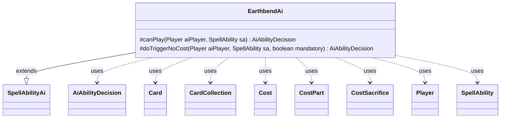

---
aliases:
  - EarthbendAi
tags:
  - java/class
  - module/forge-ai
  - pkg/forge/ai/ability
fqn: forge.ai.ability.EarthbendAi
package: forge.ai.ability
module: forge-ai
kind: Class
---

# EarthbendAi

**Package:** `forge.ai.ability` &nbsp; **Module:** `forge-ai` &nbsp; **Kind:** Class



## Relationships
**Extends:**
- [[forge.ai.SpellAbilityAi|SpellAbilityAi]]
**Uses:**
- [[forge.ai.AiAbilityDecision|AiAbilityDecision]]
- [[forge.game.card.Card|Card]]
- [[forge.game.card.CardCollection|CardCollection]]
- [[forge.game.cost.Cost|Cost]]
- [[forge.game.cost.CostPart|CostPart]]
- [[forge.game.cost.CostSacrifice|CostSacrifice]]
- [[forge.game.player.Player|Player]]
- [[forge.game.spellability.SpellAbility|SpellAbility]]

## Design Description

EarthbendAi is the AI decision module for the "earthbend" mechanic, determining whether and how the computer should activate a Spell­Ability that animates a land into a creature. As a concrete subclass of `SpellAbilityAi`, it overrides `canPlay` to choose a target and `doTriggerNoCost` to handle triggered or mandatory resolutions, returning `AiAbilityDecision` values that encode both a numeric score and an `AiPlayDecision` verdict.

Its core responsibility is target selection: it surveys the AI's lands via `CardCollection`, then inspects each land's activated abilities—drilling into the `Cost`/`CostPart` model to find affordable self-sacrifice (`CostSacrifice`) effects—so it can prefer fetchlands that retain later value. It delegates the final pick to `ComputerUtilCard.getBestLandToAnimate`, sets the chosen `Card` as the spell's target, and bails to `AnotherTime` when no lands exist. The design keeps all collaboration with the game model read-only until a viable play is confirmed.

## Source
`forge-ai/src/main/java/forge/ai/ability/EarthbendAi.java`

```java
package forge.ai.ability;

import forge.ai.*;
import forge.game.card.Card;
import forge.game.card.CardCollection;
import forge.game.card.CardLists;
import forge.game.cost.Cost;
import forge.game.cost.CostPart;
import forge.game.cost.CostSacrifice;
import forge.game.player.Player;
import forge.game.spellability.SpellAbility;

public class EarthbendAi extends SpellAbilityAi {
    @Override
    protected AiAbilityDecision canPlay(Player aiPlayer, SpellAbility sa) {
        CardCollection lands = aiPlayer.getLandsInPlay();
        if (lands.isEmpty()) {
            return new AiAbilityDecision(0, AiPlayDecision.AnotherTime);
        }
        CardCollection fetchLands = CardLists.filter(lands, c -> {
                    for (final SpellAbility ability : c.getAllSpellAbilities()) {
                        if (ability.isActivatedAbility()) {
                            final Cost cost = ability.getPayCosts();
                            for (final CostPart part : cost.getCostParts()) {
                                if (!(part instanceof CostSacrifice)) {
                                    continue;
                                }
                                CostSacrifice sacCost = (CostSacrifice) part;
                                if (sacCost.payCostFromSource() && ComputerUtilCost.canPayCost(ability, c.getController(), false)) {
                                    return true;
                                }
                            }
                        }
                    }
                    return false;
                });

        Card tgtLand;
        if (!fetchLands.isEmpty()) {
            // Prioritize fetchlands as they can be reused later
            tgtLand = ComputerUtilCard.getBestLandToAnimate(fetchLands);
        } else {
            tgtLand = ComputerUtilCard.getBestLandToAnimate(lands);
        }

        sa.resetTargets();
        sa.getTargets().add(tgtLand);

        return new AiAbilityDecision(100, AiPlayDecision.WillPlay);
    }

    @Override
    protected AiAbilityDecision doTriggerNoCost(Player aiPlayer, SpellAbility sa, boolean mandatory) {
        AiAbilityDecision decision = canPlay(aiPlayer, sa);
        if (decision.willingToPlay() || mandatory) {
            return new AiAbilityDecision(100, AiPlayDecision.WillPlay);
        }
        return new AiAbilityDecision(0, AiPlayDecision.CantPlayAi);
    }

}
```
